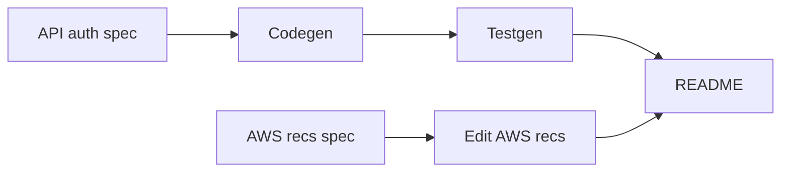

# FRVT Endpoint Security: Phased Execution Plan

**Document:** `frvt-11-execution-plan-1`
**Status:** Ready for implementation
**Audience:** A coding agent (and reviewers) implementing [frvt-11-acceptance-criteria-1.md](./frvt-11-acceptance-criteria-1.md)
**Scope:** Harden the existing HTTP Basic gate (fail-closed defaults, failed-auth limiter, explicit opt-out, default-credential warning), add tests for those contracts, make a **minimal** web-client error-vocabulary update so `429` / `too_many_requests` parses, write AWS deployment recommendations for Frontier R&D (recommendations only), and replace the root README with local run plus security guidance.

This plan is written for a **lower-quality coding agent**. Follow the phases in order. Do not invent extra auth schemes, AWS resources, Playwright work, new UI banners, or FRVT-3 edits.

---

## How to use this document

- Work phases **in order**. Each phase has an **Acceptance** gate. Do not start the next phase until that gate passes.
- After Phase 0, the API auth spec is the oracle for product behavior. Cite that spec (not this plan) when making policy decisions in code.
- After Phase 3 (and the Phase 4 edit), the AWS recommendations doc is the oracle for deployment advice. Do not implement those controls in this ticket.
- Existing FRVT-3 specs remain authoritative for everything this ticket does **not** change.

> **Rule 12 — read first.** Phase numbers and any identifiers in this plan are planning scaffolding. They must **never** appear in produced source code, comments, configuration, commit messages, migration names, or runtime strings. Name modules and symbols for what they do, not for the phase that created them. Rule 12 does **not** apply to files under `.spec/` or `.test/`.

---

## Locked owner decisions

| Topic | Decision |
| --- | --- |
| Auth scheme | HTTP Basic only. No cookies, sessions, OAuth, CORS, or anonymous health. |
| Default-on gate | Keep app-wide middleware in `create_app`. New routers inherit the gate without extra code. |
| Opt-out | Settings list of **path prefixes** (env, default empty). Prefixes skip Basic **and** the failed-auth limiter. Prefix `/` is **allowed** and matches **every** path (intentional full opt-out). |
| Default credentials | If `BASIC_AUTH_USERNAME` / `BASIC_AUTH_PASSWORD` still match the baked-in local defaults (`admin` / `Admin123!`), log a **WARNING** at startup. **Never** refuse to boot or serve. |
| Warning placement | Emit the WARNING inside `create_app` immediately after `configure_logging`, **not** in the lifespan/seed path. Tests call `create_app(run_startup_seed=False)` and would miss a lifespan-only log. |
| Failed-auth limiter | **10** failures / **60s** / client IP, then `429`. Successful auth is **not** limited and does **not** reset the window. In-memory, per-process, no Redis. |
| Disable limiter | `BASIC_AUTH_FAILURE_LIMIT <= 0` **or** `BASIC_AUTH_FAILURE_WINDOW_SECONDS <= 0` means **unlimited**: never `429`, do not store failure timestamps. Failures still return `401`. |
| What counts as a failure | Every failed gate: missing `Authorization`, non-Basic scheme, undecodable value, **or** well-formed Basic with wrong username/password. |
| Order of checks | Opt-out first. Then, if the limiter is enabled and the IP is already over the failure cap, still **validate credentials first**: valid credentials always proceed without incrementing. Invalid credentials increment the counter, then return `401` for failures 1–10 in the window and `429` for failure 11+. |
| Client IP | `request.client.host` by default. `TRUST_PROXY_HEADERS` default **false**. When true, use the **rightmost** non-empty `X-Forwarded-For` hop (ALB appends the connecting client on the right). Missing/empty header: `request.client.host`. If `request.client` is `None`, use the documented fallback string `unknown`. |
| Clock | Store **monotonic** timestamps (`time.monotonic` by default). `Retry-After` is remaining **delay-seconds** (integer), not an HTTP-date. |
| Limiter concurrency | `threading.Lock` around read / increment / prune / evict. Starlette `BaseHTTPMiddleware` may run `dispatch` in a thread pool; do **not** use `asyncio.Lock`. |
| Memory bound | Cap stored IPs at **10_000**. When over cap, evict the IP whose **most recent** failure is oldest. |
| 429 envelope | `detail`: `Too many failed authentication attempts.` `code`: `too_many_requests`. Headers: `WWW-Authenticate: Basic realm="FRVT"` and `Retry-After` = remaining whole seconds until the **oldest** timestamp in that IP's window expires, **minimum 1**. |
| Web client | **Minimal** vocabulary update only: `too_many_requests` on the existing `ErrorCode` union and 429 status map so envelopes parse. **No** Playwright. **No** new banner. The auth-required banner stays **401-only**. |
| Spec authority | **Do not edit** FRVT-3 specs. The Phase 0 spec **supersedes** [frvt-3-http-api-spec-1.md](./frvt-3-http-api-spec-1.md) §3 and [frvt-3-server-and-api-spec-1.md](./frvt-3-server-and-api-spec-1.md) §5.3 / §5.4 **only where they conflict** (limiter, opt-out, warning, `too_many_requests`, rightmost XFF). |
| AWS | Recommendations only. No Terraform, WAF, Shield, or demo-account changes. Treat the demo baseline snapshot in this plan as **frozen**; do not probe the account. |
| AWS recs edit | Phase 4 is an implementing-agent editorial pass on the AWS recs doc only (accuracy, less AI-sounding). No extra README edit pass. |
| UI | Out of scope except the locked client error-vocabulary update. |
| Future batch/index APIs | Do not call them out. They inherit the default-on gate. |

---

## Authoritative vs supporting

**After they exist, these are authoritative for this ticket:**

- [frvt-11-api-auth-hardening-spec-1.md](./frvt-11-api-auth-hardening-spec-1.md) (written in Phase 0)
- [frvt-11-aws-deploy-recommendations-1.md](./frvt-11-aws-deploy-recommendations-1.md) (written in Phase 3, edited in Phase 4)
- [frvt-11-test-plan-auth-hardening-1.md](./frvt-11-test-plan-auth-hardening-1.md) (written in Phase 2; product spec wins if a case is ambiguous)

**Supporting (do not contradict unless the Phase 0 spec supersedes):**

- Current gate: [`frvt/api/auth.py`](../frvt/api/auth.py), wired in [`frvt/api/main.py`](../frvt/api/main.py) (`app.add_middleware(BasicAuthMiddleware, ...)`)
- Defaults: [`frvt/api/config.py`](../frvt/api/config.py), [`frvt/.env.example`](../frvt/.env.example)
- Error envelope: [`frvt/api/errors.py`](../frvt/api/errors.py)
- Web client vocabulary: [`frvt/web/src/api/types.ts`](../frvt/web/src/api/types.ts), [`frvt/web/src/api/errors.ts`](../frvt/web/src/api/errors.ts)
- Existing tests: [`frvt/tests/test_health_auth.py`](../frvt/tests/test_health_auth.py)
- Existing auth cases: [frvt-3-test-plan-auth-and-bootstrap-1.md](./frvt-3-test-plan-auth-and-bootstrap-1.md)
- Local run details to distill into README: [`.test/runbooks/env-up.md`](../.test/runbooks/env-up.md), [`frvt/docker-compose.yml`](../frvt/docker-compose.yml)

---

## AWS demo baseline (already reviewed; frozen)

Use this snapshot when writing Phase 3. Do **not** require AWS CLI. Do **not** change this account in this ticket. Frontier recs should describe **their** eventual deploys, using this demo as a cautionary baseline rather than a prescription to copy.

- Region `us-east-1`. Internet-facing ALB `frvt-demo`: port 80 **301** to HTTPS 443, ACM cert on the ALB DNS name, target group HTTP **8000**, instance healthy.
- EC2 `versification-demo` (`t3.medium`), public subnet, **public IP**, no instance profile. Security group: TCP **8000** only from the ALB security group; SSH TCP **22** from a single `/32`. ALB security group: 80/443 from `0.0.0.0/0`.
- No RDS (Postgres is not an RDS instance). No ECS, Beanstalk, WAF, Shield subscription, GuardDuty detector, CloudTrail trail, ALB access logs, or Route 53 zone for this demo. CloudFront in the account is unrelated (S3 plugin repo).
- In-app Basic auth is the only application identity check.

---

## Global conventions (apply to every phase)

- **Never commit or push** (Rule 11).
- **Logging** ([server §5.6, §10.2](./frvt-3-server-and-api-spec-1.md)): shared `frvt` logger. Public backend method entry at `DEBUG`; caught exceptions at `ERROR` with `exc_info=True`; getter-style reads at `TRACE`. Default-credential notice at **WARNING**. Limiter trips at `DEBUG` (IP only, never credentials). Do not log passwords.
- **Orienting comments** (Rule 4) on every new field and non-overriding method.
- **Testing** (Rule 3): happy paths and essential failures for contracts. Do not test thin REST delegates, DTO accessors, or middleware internals (no assertions on the counter dict or lock).
- **Reuse** (Rule 6): settings object, error envelope, existing `BasicAuthMiddleware`. Do not add a second auth mechanism on routers (`Depends` Basic). Share one pair of default-credential string constants between `Settings` field defaults and the warning check so they cannot drift.
- **Modern idioms** (Rules 7–8): Pydantic v2 settings, small helpers instead of long argument lists.
- **Size and arguments** (Rules 9–10): files ≤600 lines desirable / 1000 hard; named arguments ≤6 desirable / 10 hard. If `auth.py` grows, split limiter/IP helpers into a sibling module named for what it does (for example a failed-auth limiter module), not for the ticket.

## Tooling and quality gates

- Phases that produce **Python**: `ruff`, `mypy`, and `black --check` clean on changed code (config in `frvt/pyproject.toml`). Run pytest from `frvt/` as today.
- Phases that produce **TypeScript**: `npm run typecheck` and `npm test` (Vitest unit tests only, **not** Playwright) from `frvt/web/`.
- Phases that produce **only `.spec` or README** markdown: no Python/TS gates; the Acceptance text is the gate.
- Tests use the existing dockerized Postgres fixtures in `frvt/tests/conftest.py`. Auth limiter tests do **not** need the DB beyond what `create_app(run_startup_seed=False)` already does.
- The shared `api_client` fixture in `conftest.py` is **function-scoped** (fresh `create_app` per test). Existing CRUD/ingest tests that send one unauthenticated request stay safe under the limit of 10. Do not change that fixture to session scope.

---

## Phase graph

Run **API auth spec, codegen, testgen, AWS recs spec, edit AWS recs, README** in that order so a weaker agent never mixes unfinished specs into code. (AWS spec writing does not depend on codegen; the order still keeps one job at a time.)

---

## Regression traps (read before codegen)

1. **`code_for_status` maps unknown 4xx to `bad_request`.** [`frvt/api/errors.py`](../frvt/api/errors.py) has no `429` today. If the limiter raises `HTTPException(429)`, clients would get `code: bad_request`. **Build 401 and 429 in the middleware with `JSONResponse`**, the same way `_unauthorized` already does, **and** add `429 -> too_many_requests` to `ErrorCode` and `STATUS_TO_CODE`.
2. **Limiter state must not be a module-level dict.** A process-global counter leaks across `create_app()` calls and will 429 later tests. Store counters **on the middleware instance** (created in `create_app`). Each test that calls `create_app()` gets a fresh limiter.
3. **Unauthenticated loops can self-trigger 429.** `test_unauthenticated_rejected_on_every_route` hits a handful of paths (safe under 10). A full `app.routes` inventory can exceed 10 failures on one IP. The inventory test **must** send a **distinct client IP per path** (`TRUST_PROXY_HEADERS=true` and a unique **rightmost** `X-Forwarded-For` hop), or keep the unauthenticated inventory under 10 requests on a fresh app.
4. **Do not mount a second auth dependency on routers.** That would double-challenge and break opt-out.
5. **Do not make `/api/health` public** unless it is on the opt-out list (default: it is not).
6. **Do not edit FRVT-3 spec files** to mention the limiter. Point reviewers at the Phase 0 spec.
7. **TestClient** shares `127.0.0.1` (or similar) across requests. Distinct-IP tests must use `TRUST_PROXY_HEADERS` plus `X-Forwarded-For`, not hope `request.client.host` changes.
8. **Starlette `app.routes` does not list every SPA URL.** Inventory registered routes (API, `/docs`, `/redoc`, `/openapi.json`, `/`) plus any opt-out prefixes. Do not require a 401 matrix for every client-side path.
9. **ALB appends XFF on the right.** Rate-limit by the **rightmost** hop. Tests that only vary the leftmost hop while keeping the rightmost hop fixed must share one limiter key.
10. **`frvt` logger has `propagate=False`.** Pytest `caplog` will **not** see the default-credential WARNING unless the test attaches `caplog.handler` to `logging.getLogger("frvt")` (and removes it afterward). `caplog.set_level` on the root logger is not enough.
11. **Do not monkeypatch `time.monotonic` globally.** Pass an optional `clock` callable into `create_app` / the limiter (same test-only style as `run_startup_seed`). Default remains `time.monotonic`. Never add a clock env var or README setting.
12. **Web client `ErrorCode` is a closed union.** If the backend emits `too_many_requests` and [`frvt/web/src/api/errors.ts`](../frvt/web/src/api/errors.ts) `isErrorCode` rejects it, `fromResponse` falls back to `bad_request` for 429. Update `types.ts` and `errors.ts` together. Do **not** change `ViewerSession` banner logic (401-only).
13. **Prefix `/` opts out everything.** That is allowed. Do not "helpfully" reject it. README must warn that it disables the gate.
14. **Existing `@pytest.mark.phase1` markers stay as they are.** New tests use only the existing `auth` marker (and frontend Vitest has no phase markers). Do not add ticket or phase identifiers to new files.

---

## Phase 0 — Spec writing for API auth hardening

**Goal:** a single contract document a weaker agent can implement without guessing.

**Work:** Write [frvt-11-api-auth-hardening-spec-1.md](./frvt-11-api-auth-hardening-spec-1.md). Standalone spec (not a FRVT-3 addenda table). Must pin all of the following.

### Gate

- `BasicAuthMiddleware` remains registered on the FastAPI app in `create_app`. Constant-time compare (`secrets.compare_digest`) and `WWW-Authenticate: Basic realm="FRVT"` stay as today for `401`.
- Unchanged `401` envelope: `detail` plus `code: unauthorized`. Keep today's detail string (`Missing or invalid credentials.`).
- `add_middleware` vs `include_router` source order does not decide whether the gate runs; Starlette wraps the whole app. Do not add a second gate.

### Opt-out

- Setting `BASIC_AUTH_PUBLIC_PATHS`: comma-separated path prefixes, default empty. Strip whitespace; ignore empty tokens.
- Normalize each prefix by stripping trailing `/` **except** when the prefix is exactly `/`.
- A request path matches if the prefix is `/`, **or** the path equals the prefix, **or** the path starts with `prefix + "/"`. Do not treat `/doc` as matching `/docs`.
- Matched paths skip Basic **and** the limiter.
- Prefix `/` is a documented full opt-out, not a parse error.

### Failed-auth limiter

- Settings: `BASIC_AUTH_FAILURE_LIMIT` default `10`, `BASIC_AUTH_FAILURE_WINDOW_SECONDS` default `60`.
- If either value is `<= 0`, the limiter is disabled: no timestamp storage, no `429`.
- Key by client IP (see below). Store **monotonic** failure timestamps on the middleware instance; drop timestamps older than the window (sliding window). Cap at 10_000 IPs; evict the IP with the oldest most-recent failure.
- Guard store mutations with `threading.Lock`.
- Failures 1–10 in the window: `401` as today. Failure 11+: `429` with envelope `detail: Too many failed authentication attempts.` plus `code: too_many_requests`, headers `WWW-Authenticate: Basic realm="FRVT"` and `Retry-After` set to remaining whole seconds until the oldest timestamp in that IP's window expires (minimum 1). `Retry-After` is delay-seconds, not a date.
- Successful auth: do not increment; do not clear the window.
- Test seam: optional `clock: Callable[[], float]` on `create_app` (default `time.monotonic`), forwarded to the limiter. Not a settings/env field.

### Client IP

- `TRUST_PROXY_HEADERS` default `false`. When false, **ignore** `X-Forwarded-For` even if present.
- When true: split `X-Forwarded-For` on commas, strip whitespace, skip empty tokens, take the **rightmost** remaining hop. Empty or missing header: `request.client.host`. If `request.client` is `None`, use `unknown`.

### Default-credential warning

- In `create_app`, after `configure_logging`, if username **and** password equal the baked-in defaults `admin` and `Admin123!` (same constants as `Settings` field defaults), log WARNING. Do not log the password. Do not exit.
- Do **not** put this only in the lifespan/seed function.

### Error vocabulary

- Add `too_many_requests` to the public error-code list (backend `ErrorCode` / `STATUS_TO_CODE`, and the web client's `ErrorCode` union plus `isErrorCode` / `statusToCode`).
- Document that this spec supersedes server §5.4 / HTTP API §3 for that code and for limiter/opt-out/warning/XFF behavior.
- `describeApiError` may keep using `error.detail` for 429 (no new user-facing banner string). Auth-required UI banner remains 401-only.

### Out of scope in this spec

- AWS controls, Redis, per-router auth, changing the Basic realm, public health by default, Playwright, new UI chrome.

**Acceptance:** the spec file exists, contains every bullet above, and does not instruct FRVT-3 file edits or AWS codegen.

---

## Phase 1 — Codegen for API auth hardening

**Goal:** implement Phase 0 only.

**Work:**

- [`frvt/api/config.py`](../frvt/api/config.py) and [`frvt/.env.example`](../frvt/.env.example): `BASIC_AUTH_PUBLIC_PATHS`, `TRUST_PROXY_HEADERS`, `BASIC_AUTH_FAILURE_LIMIT`, `BASIC_AUTH_FAILURE_WINDOW_SECONDS`. Parse public paths into a tuple of prefixes on the settings object (strip, drop empties, trailing-slash normalize except `/`). Orienting comments on each new field. `.env.example` comments must note that `<= 0` disables the limiter and that prefix `/` opens every path.
- [`frvt/api/auth.py`](../frvt/api/auth.py) (split a sibling module if size requires): opt-out match, rightmost-XFF IP helper, sliding-window failure store **on the instance** with `threading.Lock`, `401` / `429` `JSONResponse` builders, optional `clock`. Keep `compare_digest`.
- [`frvt/api/main.py`](../frvt/api/main.py): still `app.add_middleware(BasicAuthMiddleware, settings=settings)` only once (forward `clock` when provided); emit the default-credential warning in `create_app` after logging is configured. Optional `clock` argument on `create_app` for tests only.
- [`frvt/api/errors.py`](../frvt/api/errors.py): add `too_many_requests` to `ErrorCode` and `STATUS_TO_CODE[429]`.
- [`frvt/web/src/api/types.ts`](../frvt/web/src/api/types.ts) and [`frvt/web/src/api/errors.ts`](../frvt/web/src/api/errors.ts): add `too_many_requests` to the union, `isErrorCode`, and `statusToCode(429)`. Do not change `describeApiError` banner copy for 401. Do not touch `ViewerSession.tsx`.

Do **not**: add CORS, change health auth, edit FRVT-3 specs, add Redis, put limiter state at module import time, log passwords, add Playwright, add a clock env var.

**Acceptance:**

- App boots with current defaults.
- Unauthenticated `GET /api/health` is `401` with `WWW-Authenticate` and `code: unauthorized`.
- Eleven failed gate attempts from the same IP within 60s: first ten `401`, eleventh `429` with `code: too_many_requests`, pinned detail, and `Retry-After`.
- A valid Basic request succeeds even after ten prior failures from that IP.
- With a test-only public prefix configured, that prefix is reachable without Basic; a non-matching path is still `401`.
- Startup with defaults emits one WARNING that credentials match local defaults (visible in process logs).
- `ruff`, `mypy`, `black --check` clean. `npm run typecheck` clean. Existing auth tests that stay under ten failures on a fresh app still pass.

---

## Phase 2 — Testgen for API auth hardening

**Goal:** contract tests and a small test-plan file. Product spec wins if a case disagrees.

**Work:** Write [frvt-11-test-plan-auth-hardening-1.md](./frvt-11-test-plan-auth-hardening-1.md) with one case per contract below, then implement Python cases in a **sibling** of [`frvt/tests/test_health_auth.py`](../frvt/tests/test_health_auth.py) (keep the existing file readable; do not put ticket numbers in the new module name). Reuse `basic_auth_header` and `assert_error_envelope` from `frvt.testops.http_client`. Use `create_app(run_startup_seed=False)` and `get_settings.cache_clear()` like the existing fixture. Mark Python tests with the existing `auth` pytest marker only.

For default-credential caplog: attach `caplog.handler` to `logging.getLogger("frvt")` for the duration of the test because that logger sets `propagate=False`.

For window expiry: pass a fake `clock` into `create_app` (a zero-arg callable returning a mutable monotonic value). Advance it by more than the window; do not `sleep(60)` and do not patch `time.monotonic` process-wide.

Add one Vitest case in [`frvt/web/src/api/errors.test.ts`](../frvt/web/src/api/errors.test.ts): `fromResponse` on a 429 body with `code: too_many_requests` yields that code (not `bad_request`).

Cases (happy path and essential failures only):

- Unauthenticated `401` on `/api/health`, `/api/translations`, `/docs`, `/` (keep TC-AUTH-010 behavior).
- Route inventory: for each **HTTP** route on `app.routes` whose path is not opted out, one unauthenticated request is `401`. Use **unique rightmost** `X-Forwarded-For` values with `TRUST_PROXY_HEADERS` enabled so the limiter cannot 429 the inventory.
- Wrong password is `401` and `unauthorized`.
- Ten failures then an eleventh from the **same** IP is `429` / `too_many_requests` with pinned detail, `Retry-After`, and `WWW-Authenticate`.
- The eleventh **valid** request from that same IP (after ten failures) is **not** `429`.
- A different IP still receives `401` after another IP has been 429'd.
- After ten failures, advancing the fake clock past the window makes the next failure `401` again (not `429`).
- `TRUST_PROXY_HEADERS=false`: varying `X-Forwarded-For` does **not** isolate IPs; eleven failures still `429` on the eleventh.
- `TRUST_PROXY_HEADERS=true`: the limiter keys on the **rightmost** hop. Eleven failures that share a rightmost hop and vary the leftmost hop still `429` on the eleventh.
- Default-credential WARNING appears in caplog when using baked-in defaults; a `GET /api/health` with those defaults still `200`.
- Opt-out: configure a prefix (e.g. `/openapi.json` or a test-only prefix); opted-out path `200` or docs HTML without auth; a gated path still `401`.
- Opt-out does not treat `/doc` as matching `/docs`.
- `BASIC_AUTH_FAILURE_LIMIT=0`: eleven failures from one IP are all `401` (no `429`).
- Client: 429 envelope maps to `too_many_requests`.

Do not assert on internal counter maps or the lock. Do not add Playwright for this ticket.

**Acceptance:** new Python cases pass; existing TC-AUTH-* / TC-SERVER-* in `test_health_auth.py` pass; Vitest error-envelope case passes; quality gates clean (`ruff` / `mypy` / `black --check`, `npm run typecheck`, `npm test` in `frvt/web/`).

---

## Phase 3 — Spec writing for AWS deploy recommendations

**Goal:** Frontier-facing recommendations for **eventual** deploys. Unauthorized use and DDoS. No codegen. Use the **frozen** demo baseline above; do not probe AWS.

**Work:** Write [frvt-11-aws-deploy-recommendations-1.md](./frvt-11-aws-deploy-recommendations-1.md).

Must include:

- What the current **demo** already does well (ALB HTTPS redirect, 8000 only from ALB, SSH `/32`).
- Gaps vs a reasonable production posture (public instance IP, Postgres on the box, no WAF/Shield, no GuardDuty/CloudTrail, no ALB logs, Basic auth with shareable defaults, in-memory limiter is per-process).
- `TRUST_PROXY_HEADERS` and XFF: enable **only** behind a trusted proxy. The limiter uses the **rightmost** hop, which is the connecting client an ALB appends. If the instance is reachable directly with the setting on, clients can spoof XFF and bypass the limiter. Additional reverse proxies **in front of** the ALB mean the rightmost hop is that proxy, not the browser — call that out as an operator caution, not as extra controls to implement in this ticket.
- Recommendations Frontier can apply in **their** account: private instance, RDS private, secrets in env/SM not image defaults, rotate Basic password, enable `TRUST_PROXY_HEADERS` only behind a trusted proxy, WAF rate rules + AWS Shield as appropriate, CloudTrail, GuardDuty, ALB access logs, do not expose `/docs` on the public internet if avoidable (opt-out stays empty in production; never set public prefix `/` in production).
- Explicit **out of scope**: implementing those controls in this repository or demo account as part of this ticket.
- Pointer that in-app Basic + failed-auth limiter is necessary but **not sufficient** against DDoS. `BASIC_AUTH_FAILURE_LIMIT=0` disables even that in-app throttle.

Do not paste live public IPs as copy-paste deploy targets. Describe patterns. Do not write Terraform.

**Acceptance:** the document exists, maps to AC items 3.1 and 3.2, and contains no implementation tasks disguised as recommendations.

---

## Phase 4 — Edit AWS recs spec for tone and accuracy

**Goal:** the Phase 3 document is factually aligned with the frozen baseline snapshot above and readable for Frontier (not obviously padded AI prose).

**Work:** Edit [frvt-11-aws-deploy-recommendations-1.md](./frvt-11-aws-deploy-recommendations-1.md) only.

- Fact-check: HTTPS on ALB, HTTP 301, target 8000, no WAF/Shield/GuardDuty/CloudTrail/RDS, public EC2, SSH restricted, rightmost XFF (not leftmost).
- Shorten repetition; prefer direct sentences; drop hedging stacks and generic cloud filler that is not tied to this app.
- Do not add new controls or change technical claims without matching the baseline.

**Acceptance:** same recommendations, tighter prose, still markdown in `.spec`.

---

## Phase 5 — Update README with run and security guidance

**Goal:** a new developer can run the app locally and understands the Basic gate. One writing pass (no separate edit phase).

**Work:** Replace the one-line root [`README.md`](../README.md). Distill (do not contradict) [`.test/runbooks/env-up.md`](../.test/runbooks/env-up.md), [`frvt/.env.example`](../frvt/.env.example), and Compose. Prefer POSIX commands (bash) as the primary instructions; PowerShell may be a short alternate. Do **not** rewrite the runbook.

Must cover:

- What the repo is (versification viewer: FastAPI + Postgres + React UI).
- Prerequisites: Docker, Python 3.11+, Node/npm.
- Copy `frvt/.env.example` to `frvt/.env`.
- `docker compose up -d` from `frvt/` (Postgres host port **5433**).
- venv, install, `alembic upgrade head` from `frvt/`, `npm ci` / `npm run build` in `frvt/web`, uvicorn `frvt.api.main:app` from **repo root** on port 8000.
- Health check with Basic `admin` / `Admin123!`.
- Security: all routes gated; defaults are **local only** and log a warning; set strong `BASIC_AUTH_*` for any shared host; failed-auth limiter (10 / 60s / IP) and `429`; `BASIC_AUTH_FAILURE_LIMIT=0` (or a non-positive window) disables the limiter; `TRUST_PROXY_HEADERS` only behind a trusted proxy (rightmost XFF hop); `BASIC_AUTH_PUBLIC_PATHS` default empty; prefix `/` disables the gate for every path; pointer to [frvt-11-aws-deploy-recommendations-1.md](./frvt-11-aws-deploy-recommendations-1.md).
- Do not claim AWS controls were implemented. Do not document the test-only `clock` argument.

**Acceptance:** README alone is enough to boot locally; security section matches Phase 0/1 behavior; no AWS codegen implied.

---

## Out of scope (entire ticket)

- Implementing WAF, Shield, GuardDuty, CloudTrail, RDS, or ALB log buckets
- Changing the demo AWS account or re-querying it
- New authentication schemes
- Playwright, new UI banners, or `ViewerSession` auth-banner changes
- Editing FRVT-3 product specs
- Committing or pushing
