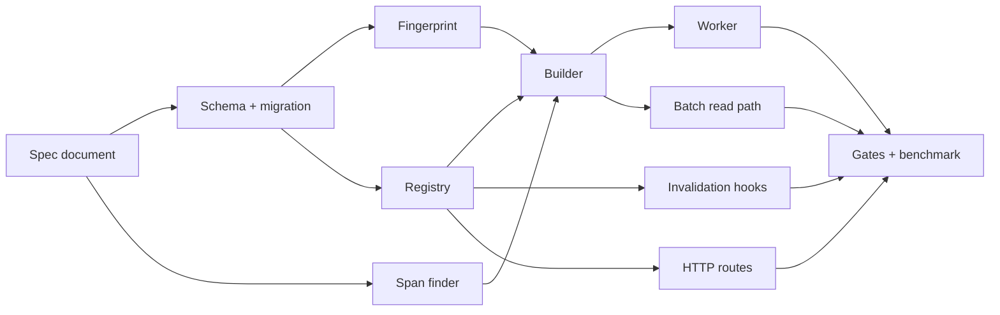

# Translation Index API: Phased Execution Plan

**Document:** `frvt-12-execution-plan-1`
**Status:** Implemented
**Audience:** Reviewers of [frvt-12-acceptance-criteria-1.md](./frvt-12-acceptance-criteria-1.md) and the code that followed this plan
**Scope:** Add CRUD endpoints for *indexes* — a translation plus a versification whose pairwise verse mappings are pre-created against every other index — build them asynchronously in-process, keep them current as translations and versifications change, report their resource cost, and make the batch mapping endpoints from [frvt-8-batch-mapping-api-spec-1.md](./completed/frvt-8-batch-mapping-api-spec-1.md) read them.

Implementation is complete. The phase gates below are the record of how the work was sequenced; do not re-run them against the tree. HTTP tests that only repeated registry or batch-component behavior were removed under Rule 3; remaining HTTP coverage is route-order (`GET /api/indexes/usage`) and the auth gate. Criterion-5 timings from `.test/scripts/run-index-benchmark.sh` are recorded in the spec document. The build lock is the catalog OID of the current database plus a fixed resource key; reclaim vacuum runs after a reclaim entry is fully drained; startup orphan detection queues reclaim rather than deleting one chunk.

Never commit or push. The owner reviews all changes.

---

## How this document was used

The phases below are a historical record. After Phase 0, the spec was the oracle for request/response shape and status codes. Helpers already in the tree (pagination, scheme selection, span lookup, chain walking, range expansion, test seeding) were reused rather than copied.

> **Rule 12 — read first.** Phase numbers and any identifiers in this plan are planning scaffolding. They must **never** appear in produced source code, comments, configuration, migration names, or runtime strings. Name modules and symbols for what they do. Rule 12 does **not** apply to files under `.spec/` or `.test/`.
>
> The pre-existing `phase1`–`phase6` pytest markers in [`frvt/pyproject.toml`](../frvt/pyproject.toml) are the repository's established test-gating vocabulary and predate this plan. Reuse them as instructed. Do **not** add new markers.

---

## Locked owner decisions

| Topic | Decision |
| --- | --- |
| Async execution | An **in-process worker thread** started in the FastAPI lifespan. No Celery, no Redis, no second process to deploy. |
| Multi-process safety | A session-level two-int `pg_try_advisory_lock` serializes builds **per database** (the catalog OID of `current_database()` plus a fixed resource key). A second process on the same database waits; pytest worker databases do not block the API database. |
| What a mapping row stores | The **full `ResolveResult` as JSONB**, one row per (ordered index pair, source ref). The read path is one bulk query with no resolver work per verse. |
| Index identity | The pair `(translation_id, scheme_id)`. Unique. |
| Cartesian product | **Ordered** pairs excluding self-pairs, because resolve is directional. Twelve indexes means 132 pairs. |
| Versification default | Explicit parameter, else the translation's preferred scheme, else canonical `org` — reusing `batch_scheme_ref()`. This *is* acceptance criterion 4. |
| Default tracking | An index created without an explicit versification records that fact and **retargets** when the translation's preferred scheme changes. |
| Index count cap | **None.** Report resource consumption instead of refusing work. |
| Deletion | `DELETE` returns immediately. Mapping rows are reclaimed by the worker in chunks. |
| Read-path scope | The two batch endpoints only. `GET /api/resolve`, `/api/resolve/chapter`, and navigation are untouched. |
| Build cost | The shared span-enrichment path takes an optional preloaded lookup so a build costs minutes, not hours. |
| Criterion 5 evidence | A runnable benchmark script under `.test/scripts/`, with measured numbers recorded in the spec. **No wall-clock assertions in pytest.** |
| Out of plan | No UI, no `frvt/web` changes, no new dependencies, no separate test-plan document. |

---

## The master safety invariant

**The read path uses an index pair only when *both* indexes have status `ready`.**

Every partial, stale, failed, cancelled, or orphaned state is therefore safe: it falls back to live resolve and returns the same answer, just slower. Refer back to this whenever a phase asks "what if the data is incomplete?".

The corollary is a testing hazard. Because fallback produces *identical* results, a bug that silently disabled indexing would leave every correctness test green. That is why `index_used` is asserted as a response-contract field even though timing evidence lives in a script.

---

## What exists today (integration points)

Read these before writing anything. Line references are current at plan time; verify before editing.

- **Batch driver** — [`frvt/api/resolve_batch.py`](../frvt/api/resolve_batch.py). `BatchTarget`, `expand_stored_range()`, `_prepare()`, `_resolve_entries()`, `resolve_verse_set()`, `resolve_verse_range()`.
- **Per-verse worker and hop path** — `resolve_single_with_path()`, `build_resolve_path()`, `_to_result()`, `_enrich_span()`, `_canonicalize_query_ref()` in [`frvt/api/ports/resolver_port.py`](../frvt/api/ports/resolver_port.py).
- **Span lookup** — `find_stored_span()` in [`frvt/api/ports/span_lookup.py`](../frvt/api/ports/span_lookup.py). Exactly **two** call sites, both in `resolver_port.py` (lines 73 and 151). It returns a whole `VerseSpan` entity, including the `content` scripture text.
- **Scheme selection** — `require_translation()`, `require_scheme()`, `clamp_page()`, `batch_scheme_ref()`, `org_scheme_ref()`, `DEFAULT_LIMIT`, `MAX_LIMIT` in [`frvt/api/scheme_select.py`](../frvt/api/scheme_select.py).
- **Chain walking** — `build_chain()`, `scheme_ref_from_id()`, `load_mapping_views()` in [`frvt/resolver/chains.py`](../frvt/resolver/chains.py). `Hop` carries `scheme_id`, `based_on_id`, `mappings`.
- **Reference grammar** — `parse_ref()`, `expand()`, `format_bcv()`, `covers()` in [`frvt/resolver/parse_ref.py`](../frvt/resolver/parse_ref.py).
- **Models** — [`frvt/api/models/__init__.py`](../frvt/api/models/__init__.py). Migration head is `b2c3d4e5f6a7`.
- **Sessions** — [`frvt/api/db.py`](../frvt/api/db.py): synchronous `Session`; `get_session` commits on success; `get_session_factory()` is what a thread must use.
- **App wiring** — [`frvt/api/main.py`](../frvt/api/main.py): `create_app(run_startup_seed=True)`, a `lifespan` that calls `seed_canonical()`, and router registration.
- **Settings** — [`frvt/api/config.py`](../frvt/api/config.py): `pydantic-settings` with `Field(alias=...)` and `@lru_cache` on `get_settings()`.
- **Mutation sites to hook** — `PATCH`/`DELETE` in [`translations.py`](../frvt/api/routers/translations.py), `PATCH`/`DELETE` in [`versifications.py`](../frvt/api/routers/versifications.py), `POST`/`PUT preferred`/`DELETE` in [`associations.py`](../frvt/api/routers/associations.py), and `refresh_combined_milestone_splits()` in [`ports/ingest_port.py`](../frvt/api/ports/ingest_port.py).
- **Test harness** — [`frvt/tests/conftest.py`](../frvt/tests/conftest.py): every test runs in a transaction that is rolled back; `api_client` overrides `get_session`. Seeding helpers live in [`frvt/testops/fixtures/api_setup.py`](../frvt/testops/fixtures/api_setup.py).

---

## Regression traps (read before writing code)

1. **A worker thread cannot see test data.** Tests run inside a rolled-back transaction on one connection; a thread with its own session sees nothing. Every component is therefore a plain function taking a `Session`, tested directly with `seeded_session`. The thread loop itself stays a thin, untested wrapper, and `api_client` must pass `run_index_worker=False`.
2. **`pg_advisory_xact_lock` would release at the first chunk commit.** Use session-level `pg_try_advisory_lock` and release it in a `finally`.
3. **`ResolveResult` has a `model_serializer` that drops unset axis keys.** `source_rel` / `target_rel` vanish from `model_dump(mode="json")` when `None`. Round-tripping must be proven by an explicit equality test, not assumed.
4. **`/api/indexes/usage` must be declared before `/api/indexes/{index_id}`**, or FastAPI tries to parse `usage` as a UUID.
5. **Do not skip `_prepare()` on the indexed path.** It is what raises the request-level `404` / `409` / `422`, including "no shared ancestor". Skipping it would silently change existing status codes.
6. **`index_mapping` has no foreign key to `translation_index`** — deliberately, so a delete cannot cascade millions of rows inside an HTTP request. Orphan rows are unreadable by the master invariant and are cleaned up by the worker.
7. **Count with two queries, not one `OR`.** `WHERE source_index_id = :id OR target_index_id = :id` uses neither index. Two separate `COUNT`s each use theirs.
8. **A cancelled build leaves partial rows.** That is intended. They are unreadable, cleared by the next build, and reported in the usage payload.
9. **`logger.trace(...)` needs `# type: ignore[attr-defined]`** on the same line; mypy runs strict and does not know the custom level.
10. **Verse `0` is legal** (Psalm titles). Never add a `ge=1` guard to verse numbers.
11. **Anchor translations have no spans.** An index on one is legal and yields zero rows. Do not treat that as failure.
12. **Seed before starting the thread.** `seed_canonical()` mutates schemes, so the lifespan must finish seeding before the first fingerprint sweep runs.
13. **`get_settings()` is `lru_cache`d.** Adding fields is safe, but do not read settings at import time.

---

## Global conventions (apply to every phase)

- **Logging (Rule 2).** `logger = get_logger(__name__)` at module top. Public functions log `DEBUG` on entry with troubleshooting detail. Non-mutating getters log `TRACE`. Every `except` logs `ERROR` with `exc_info=True`. Do not guard log calls with level checks.
- **Orienting comments (Rule 4).** Every new module gets a docstring; every new function and every new Pydantic or ORM field gets a comment saying why it exists and what to expect. Match the density in `frvt/api/models/__init__.py` and `frvt/api/schemas/__init__.py`.
- **Testing (Rule 3).** Happy paths and essential contract failures only. Do not test router functions that merely delegate, schema defaults, or accessors.
- **Reuse (Rule 6).** `clamp_page`, `require_translation`, `require_scheme`, `batch_scheme_ref`, `scheme_ref_from_id`, `build_resolve_path`, `resolve_single_with_path`, `Page[T]`, `AppError`, and the `api_setup.py` helpers already exist. Use them.
- **Modern patterns and boilerplate (Rules 7, 8).** SQLAlchemy 2.0 `select()`, `Mapped[...]` / `mapped_column()`, frozen dataclasses for value types, Pydantic v2, comprehensions where they stay readable.
- **Argument limits (Rule 10).** Six named arguments is the target. Use the parameter objects this plan defines rather than threading four ids everywhere. Keyword-only after `*`.
- **File size (Rule 9).** Every file here should land under 300 lines. If one passes 600, split it.
- **Typing.** mypy strict covers `frvt.api`. Annotate every parameter and return.
- **Error codes.** Reuse the fixed `ErrorCode` vocabulary in [`frvt/api/errors.py`](../frvt/api/errors.py). Add none.

### Test markers

| Test kind | Markers |
| --- | --- |
| Pure/unit and component (fingerprint, registry, builder, worker, lookup) | `phase6` + `resolve` |
| Index CRUD over HTTP | `phase2` + `api` |
| Batch read path over HTTP | `phase4` + `resolve` |
| Schema constraints | follow [`frvt/tests/test_schema_constraints.py`](../frvt/tests/test_schema_constraints.py) |

---

## Tooling and quality gates

Run from `frvt/` with the virtualenv active. `$REPO` is the repository root.

```bash
cd "$REPO/frvt"
docker compose up -d
python -m ruff check api resolver ingest tests testops
python -m black --check api resolver ingest tests testops
python -m mypy -p frvt.api -p frvt.resolver -p frvt.ingest
PYTHONPATH="$REPO" python -m pytest tests/test_<file>.py -vv
PYTHONPATH="$REPO" python -m pytest -n auto
```

---

## New settings

Add to `Settings` in [`frvt/api/config.py`](../frvt/api/config.py), each with an orienting comment:

| Field | Alias | Default | Purpose |
| --- | --- | --- | --- |
| `index_worker_enabled` | `INDEX_WORKER_ENABLED` | `True` | Master switch for the background thread. |
| `index_worker_poll_seconds` | `INDEX_WORKER_POLL_SECONDS` | `5.0` | Idle sleep between queue polls. |
| `index_build_chunk_size` | `INDEX_BUILD_CHUNK_SIZE` | `500` | Refs per commit, and the cancellation check interval. |
| `index_fingerprint_sweep_seconds` | `INDEX_FINGERPRINT_SWEEP_SECONDS` | `300` | Minimum gap between staleness sweeps. |
| `index_reclaim_chunk_size` | `INDEX_RECLAIM_CHUNK_SIZE` | `10000` | Mapping rows deleted per reclaim commit. |

---

## Files this plan creates or changes

**New:** `.spec/frvt-12-translation-index-api-spec-1.md`; `frvt/api/indexing/{__init__,keys,fingerprint,registry,builder,worker,invalidation,lookup}.py`; `frvt/api/routers/indexes.py`; one Alembic revision; `frvt/tests/test_index_keys.py`, `test_index_fingerprint.py`, `test_index_registry.py`, `test_index_builder.py`, `test_index_worker.py`, `test_index_invalidation.py`, `test_api_indexes.py`, `test_index_read_path.py`, `test_span_finder.py`; `.test/scripts/run-index-benchmark.sh`.

**Changed:** `frvt/api/models/__init__.py`, `frvt/api/schemas/__init__.py`, `frvt/api/config.py`, `frvt/api/main.py`, `frvt/api/ports/span_lookup.py`, `frvt/api/ports/resolver_port.py`, `frvt/api/resolve_batch.py`, `frvt/api/routers/{translations,versifications,associations}.py`, `frvt/api/ports/ingest_port.py`, `frvt/tests/conftest.py`, `docs/api.md`, `docs/openapi.json`.

**Explicitly unchanged:** `frvt/resolver/**`, `frvt/api/resolve_chapter.py`, `frvt/api/routers/navigation.py`, `frvt/api/jump_cancel.py`, `frvt/web/**`.

---

## Phase graph



Phases 1 and 3 are independent and may be done in either order, but each must pass its own gate first.

---

## Phase 0 — Write the API spec document

**Goal:** One authoritative contract so later phases have an oracle instead of guesses.

**Work:** Create `.spec/frvt-12-translation-index-api-spec-1.md`, matching the tone of [frvt-8-batch-mapping-api-spec-1.md](./completed/frvt-8-batch-mapping-api-spec-1.md). Cover: an acceptance-criteria map; the index resource and its status vocabulary; every route with parameters, bodies, and status codes; versification defaulting and default-tracking; the status/cancel/rebuild state machine; resource-consumption reporting; the read-path integration and `index_used`; the resource estimate (~4M rows, on the order of 2.5–3.5 GB at the twelve-index cap, with disk-headroom advice); and non-goals.

**Acceptance:** The file exists, every criterion in the acceptance document maps to a named section, markdown lints clean under [`.markdownlint.json`](../.markdownlint.json), and no source file changed.

---

## Phase 1 — Schema and migration

**Goal:** Three tables and one Alembic revision, verifiable by constraint tests alone.

**Work:** Add to `frvt/api/models/__init__.py`:

**`TranslationIndex`** (`translation_index`) — `id` UUID PK (`uuid.uuid4`); `translation_id` UUID FK `translation.id` `ondelete="CASCADE"`; `scheme_id` UUID FK `versification_scheme.id` `ondelete="CASCADE"`; `scheme_explicit` Boolean default `False`; `status` Text default `"pending"`; `cancel_requested` Boolean default `False`; `content_fingerprint` Text nullable; `pending_reason`, `build_notes`, `last_error` Text nullable; `pairs_total`, `pairs_completed` Integer default `0`; `requested_at` timestamptz `func.now()`; `started_at`, `completed_at` timestamptz nullable; `created_at`, `updated_at` matching the existing models. Table args: `UniqueConstraint("translation_id", "scheme_id", name="uq_translation_index_pair")`; `CheckConstraint("status IN ('pending','building','ready','failed','cancelled')", name="ck_translation_index_status")`; `Index("ix_translation_index_status", "status", "requested_at")`.

**`IndexMapping`** (`index_mapping`) — composite primary key `(source_index_id, target_index_id, source_ref)` where the two ids are `UUID` and `source_ref` is `Text`; `payload` `JSONB` not null. Add `Index("ix_index_mapping_target", "target_index_id")`. **No foreign keys** (trap 6) — carry a comment saying why, and that orphans are reclaimed by the worker and unreadable meanwhile.

**`IndexReclaim`** (`index_reclaim`) — `index_id` UUID PK; `requested_at` timestamptz `func.now()`.

Add one revision, `down_revision = "b2c3d4e5f6a7"`, file named per the `file_template` in [`frvt/alembic.ini`](../frvt/alembic.ini), written in the imperative `op.create_table` / `op.create_index` style of the existing revisions, with a downgrade that drops all three tables in reverse order.

Add `frvt/tests/test_index_schema.py` (or extend `test_schema_constraints.py`): duplicate `(translation_id, scheme_id)` rejected; an invalid `status` rejected; duplicate `(source_index_id, target_index_id, source_ref)` rejected; deleting a translation removes its index rows; deleting a scheme removes its index rows.

**Acceptance:** `python -m alembic -c alembic.ini upgrade head` then `downgrade -1` then `upgrade head` all succeed against a scratch database; the new tests pass; the full suite still passes (new tables join `Base.metadata.sorted_tables`, which `conftest` truncates); ruff, black, mypy pass.

---

## Phase 2 — Content fingerprint

**Goal:** One deterministic string per index that changes whenever anything the index depends on changes — including transitive scheme changes no route hook can observe.

**Work:** Create `frvt/api/indexing/fingerprint.py`.

- `index_fingerprint(session, *, translation_id, scheme) -> str` where `scheme` is a `SchemeRef`. Build a deterministic text block from: the translation's `updated_at` and its `verse_span` row count; then, for every `Hop` in `build_chain(session, scheme)` in order, the hop's `scheme_id`, that scheme's `updated_at`, and `len(hop.mappings)`. Hash with `hashlib.sha256` and return the hex digest. Log `DEBUG` on entry.
- Let `LookupError` from `build_chain` propagate as `AppError(422, ...)`, consistent with `build_resolve_path`; the caller records it as a build failure.

Create `frvt/tests/test_index_fingerprint.py` using `seeded_session` and `eng_org_resolve_context()`: the value is stable across two calls; it changes when a span is added; it changes when the scheme's mapping rows change; two different translations differ.

**Acceptance:** those tests pass; ruff, black, mypy pass; the module imports nothing from FastAPI.

---

## Phase 3 — Optional preloaded span finder

**Goal:** Remove the per-verse span queries that dominate build cost, **without changing live behavior**.

**Why:** `find_stored_span()` loads whole `VerseSpan` entities including `content`, and runs three to four times per verse resolution. At ~4M resolutions for a full cartesian build that is ~14M queries and many hours.

**Design note that keeps risk low:** the preloaded finder returns the **same `VerseSpan` objects**, so no return type changes, no new value type, and `_resolved_from_stored()` is untouched. Load them once with `load_only()` for the columns the result uses (`book`, `chapter`, `verse`, `seq`, `part`, `verse_label`, `verse_range`) plus the primary key.

**Work:** In `frvt/api/ports/span_lookup.py`:

- `SpanFinder` — a `typing.Protocol` with `__call__(self, translation_id: UUID, *, book: str, chapter: int, verse: int, part: str | None) -> VerseSpan | None`.
- `db_span_finder(session) -> SpanFinder` — closes over the session and delegates to the existing `find_stored_span()`. This is the default everywhere, so the live path keeps today's exact behavior.
- `preloaded_span_finder(session, translation_id) -> SpanFinder` — loads every span for the translation once and answers from memory, replicating `find_stored_span` semantics **exactly**: a dict keyed by `(book, chapter, verse, part)` for exact hits; the documented fallback from a missing part to the whole verse; and, per `(book, chapter)`, the `verse_range`-bearing rows in `seq` order matched with `covers()`. Log `DEBUG` with the row count.

In `frvt/api/ports/resolver_port.py`, thread an optional `span_finder: SpanFinder | None = None` through `_canonicalize_query_ref()`, `_enrich_span()`, `_to_result()`, and `resolve_single_with_path()`, resolving `None` to `db_span_finder(session)` once per call. Change no signatures' existing parameters and no defaults.

Create `frvt/tests/test_span_finder.py`. The essential gate is **equivalence**: over a fixture containing whole verses, a verse `0`, a row with a non-null `part`, and a combined milestone with `verse_range`, assert `preloaded_span_finder` returns the same row identity as `find_stored_span` for every stored coordinate and for a set of deliberate misses.

**Acceptance:** the new tests pass; and, unchanged, `tests/test_span_lookup.py tests/test_api_resolve.py tests/test_api_resolve_chapter.py tests/test_api_resolve_batch.py tests/test_api_navigation.py tests/test_jump_cancel_filter.py tests/test_resolver_port_enrich.py tests/test_resolve_batch.py` all pass — this is the regression gate. ruff, black, mypy pass.

---

## Phase 4 — Index registry

**Goal:** Every state transition an operator can request, as plain functions with no HTTP involved.

**Work:** Create `frvt/api/indexing/keys.py` first — `index_key(ref: str) -> str | None`: strip, `parse_ref()`, return `None` when the ref is not a single verse or does not parse (`ReferenceError`), otherwise `format_bcv(VerseId(book, chapter, verse_start, None))`. **Both the builder and the reader use this one function**, which is what guarantees their keys agree.

Create `frvt/api/indexing/registry.py`:

- `create_index(session, *, translation_id, scheme_id=None) -> TranslationIndex` — `require_translation()`; when `scheme_id` is given, validate it with `selected_scheme_ref()` and set `scheme_explicit=True`; otherwise resolve with `batch_scheme_ref(session, translation_id, None)` and set `scheme_explicit=False`. Duplicate pair raises `AppError(409, ..., code="conflict")`. Sets `status="pending"`, `pending_reason="created"`.
- `list_indexes(session, *, limit, offset) -> tuple[list[TranslationIndex], int]` — `clamp_page()`.
- `get_index(session, index_id) -> TranslationIndex` — `404` when missing.
- `set_versification(session, index_id, scheme_id) -> TranslationIndex` — validates, sets `scheme_explicit=True`, `409` on collision with an existing index for the resulting pair, queues reclaim for the old rows, resets to `pending` with reason `"versification changed"`.
- `delete_index(session, index_id) -> None` — queue reclaim for the id, then delete the row. Returns fast; the worker frees the space.
- `request_rebuild(session, index_id) -> TranslationIndex` — sets `status="pending"`, `pending_reason="manual rebuild"`, `requested_at=now()`, `cancel_requested=False`. Legal from any status, including `building`.
- `request_cancel(session, index_id) -> TranslationIndex` — sets `cancel_requested=True` when the status is `pending` or `building`; raises `AppError(409, ...)` otherwise.
- `queue_reclaim(session, index_ids) -> None` — idempotent inserts into `index_reclaim`.
- `index_row_counts(session, index_id) -> tuple[int, int]` — outbound and inbound counts as **two** queries (trap 7). Log `TRACE`.
- `usage_summary(session) -> IndexUsage` — a frozen dataclass with total and ready index counts, total mapping rows, `pg_total_relation_size('index_mapping')` bytes, and the pending-reclaim count.

Create `frvt/tests/test_index_registry.py` and `test_index_keys.py`. Cover: create with an explicit versification; create without one, falling back to preferred then `org` (criterion 4); duplicate create is `409`; cancel from `pending` sets the flag; cancel from `ready` is `409`; rebuild from `ready` returns to `pending`; delete queues reclaim and removes the row; `index_key` accepts `GEN 1:1`, returns `None` for `GEN 1:1-3` and for garbage.

**Acceptance:** those tests pass; ruff, black, mypy pass; the module imports nothing from FastAPI.

---

## Phase 5 — Pair builder

**Goal:** Materialize the cartesian product for one index, chunked, cancellable, and idempotent.

**Work:** First, in `frvt/api/resolve_batch.py`, extract `stored_verse_refs(session, translation_id, *, window=None) -> list[str]` from `expand_stored_range()` and have `expand_stored_range()` delegate to it with a window. Coverage then matches `GET /api/resolve/range` exactly, combined-milestone constituents included, by construction rather than by coincidence.

Create `frvt/api/indexing/builder.py`:

- `PairBuild` — a frozen dataclass parameter object holding the source and target `TranslationIndex` rows and their `SchemeRef`s (Rule 10).
- `build_index(session, index_id, *, chunk_size) -> None`:
  1. Load the row; return quietly when it is gone.
  2. Collect other indexes with status `ready`. Set `pairs_total = 2 * len(others)`, `pairs_completed = 0`, and commit so status reads show progress.
  3. Delete this index's existing mapping rows in chunks, both directions.
  4. For each other index, build `this → other` then `other → this` via a private `_build_pair()`.
  5. Finish: recompute `content_fingerprint`, set `completed_at`, and set `status="ready"` **only if** the row is still `building` and not cancel-requested (see the state machine). Otherwise leave the status alone.
- `_build_pair(session, build, *, chunk_size) -> None`:
  - `build_resolve_path()` once. Preload a `SpanFinder` for each side once.
  - `stored_verse_refs()` for the source translation; map through `index_key()`; iterate in chunks of `chunk_size`. For each ref call `resolve_single_with_path(..., part=None, span_finder=...)` and collect `(source_ref, result.model_dump(mode="json"))`.
  - Bulk write each chunk with `sqlalchemy.dialects.postgresql.insert(...).on_conflict_do_update(...)` so a retry is idempotent, then commit and check for cancellation or row deletion.
  - Catch `AppError` from `build_resolve_path` (a pair with no shared ancestor), log `ERROR` with `exc_info=True`, append a note to `build_notes`, and skip that pair. The index still becomes `ready`: the read path falls back per ref and `_prepare()` still raises the same `422`.
  - Catch `AppError` from a single ref, log `ERROR`, and skip that ref. One bad verse must never fail a build.

Create `frvt/tests/test_index_builder.py`. Cover: a two-index build populates both directions for every stored ref; **cartesian completeness** — with three indexes built in sequence, every ordered pair covers every stored ref (criterion 2.1.3); a payload round-trips (`ResolveResult.model_validate(payload)` equals a live `resolve_single_with_path()` result, which is trap 3's gate); an index whose translation has no spans becomes `ready` with zero rows; a rebuild is idempotent and leaves no stale rows; setting `cancel_requested` mid-build stops it without reaching `ready`.

**Acceptance:** those tests pass; ruff, black, mypy pass; `builder.py` is under 300 lines and imports nothing from FastAPI.

---

## Phase 6 — Worker

**Goal:** Drive builds, reclamation, and staleness detection with no request in flight.

**Work:** Create `frvt/api/indexing/worker.py`.

- A module-level advisory-lock constant, and private helpers that take and release a session-level `pg_try_advisory_lock` (trap 2).
- `recover_orphaned_builds(session) -> int` — returns rows stuck in `building` to `pending` with reason `"interrupted"`. Runs once at startup; a crash must not wedge an index forever.
- `drain_reclaim(session, *, chunk_size) -> int` — for one `index_reclaim` row, delete up to `chunk_size` mapping rows in each direction; remove the reclaim row when none remain. Bounded so it cannot starve builds.
- `purge_orphan_mappings(session, *, chunk_size) -> int` — the startup safety net: delete mapping rows whose index id no longer exists, for anything the hooks missed. Startup only; it is a scan.
- `sweep_fingerprints(session) -> int` — for each `ready` index, recompute `index_fingerprint()` and set `pending` with reason `"content changed"` on mismatch. This is the authority for transitive scheme changes.
- `process_next_index(session, *, chunk_size) -> bool` — claim the oldest `pending` row with `ORDER BY requested_at ... FOR UPDATE SKIP LOCKED LIMIT 1`. If `cancel_requested`, mark `cancelled`, clear the flag, and return `True`. Otherwise set `building` and `started_at`, **commit to release the row lock** so the API can still write `cancel_requested`, then call `build_index()`. On unexpected exception, log `ERROR` with `exc_info=True` and set `failed` with `last_error`. Returns whether work was done.
- `IndexWorker` — a small class owning a `threading.Thread` (daemon) and a `threading.Event`. `start()` runs recovery and the orphan purge once, then loops: take the advisory lock; drain one reclaim chunk; `process_next_index()`; if nothing was done and the sweep interval has elapsed, `sweep_fingerprints()`; release the lock; wait on the event for the poll interval. `stop()` sets the event and joins with a timeout so uvicorn exits cleanly. Each iteration uses a fresh session from `get_session_factory()`, and every iteration is wrapped so no exception can kill the thread.

Wire it in `frvt/api/main.py`: add `run_index_worker: bool = True` to `create_app`, and in the lifespan start the worker **after** `seed_canonical()` (trap 12) only when the argument and `settings.index_worker_enabled` both allow it; stop it on shutdown. Set `run_index_worker=False` in the `api_client` fixture in `frvt/tests/conftest.py` (trap 1).

Create `frvt/tests/test_index_worker.py`, calling the functions directly with `seeded_session` — never through the thread. Cover: `process_next_index` builds a pending index and returns `True`; it returns `False` on an empty queue; a pending index with `cancel_requested` becomes `cancelled` without building; `recover_orphaned_builds` re-queues a `building` row; `drain_reclaim` removes rows and then the reclaim entry; `sweep_fingerprints` re-queues an index after a span is added.

**Acceptance:** those tests pass; the full suite passes with no hangs and no cross-test leakage; ruff, black, mypy pass.

---

## Phase 7 — Invalidation hooks

**Goal:** Automatic rebuild and termination on the mutations that matter (criteria 2.1.1, 2.1.2, 3.2).

**Work:** Create `frvt/api/indexing/invalidation.py`:

- `invalidate_for_translation(session, translation_id, *, reason) -> int` and `invalidate_for_scheme(session, scheme_id, *, reason) -> int` — set matching indexes to `pending` with that reason.
- `drop_indexes_for_translation(session, translation_id) -> int` and `drop_indexes_for_scheme(session, scheme_id) -> int` — queue reclaim, then delete the index rows. Called **before** the entity is deleted so the cascade is only a safety net, and so an in-flight build sees its row disappear and aborts.
- `retarget_default_indexes(session, translation_id) -> int` — for each index of that translation with `scheme_explicit` false, re-resolve `batch_scheme_ref(session, translation_id, None)`. When it differs, queue reclaim for the old rows, update `scheme_id`, and set `pending` with reason `"preferred versification changed"`. When the new pair would collide with an existing index, **leave `scheme_id` unchanged**, record the collision in `build_notes`, log `ERROR`, and move on — never silently delete either index.

Call them from: `update_translation` (invalidate), `delete_translation` (drop, before the existing bulk deletes), `update_versification` (invalidate), `delete_versification` (drop), `create_association` / `make_preferred` / `delete_association` (retarget), and `refresh_combined_milestone_splits` (invalidate for the scheme).

Create `frvt/tests/test_index_invalidation.py`: renaming a translation re-queues its index; deleting a translation removes its indexes and queues reclaim; deleting a versification does the same; changing the preferred versification retargets a default index but not an explicit one; a retarget collision leaves the index alone and records a note.

**Acceptance:** those tests pass; `tests/test_api_crud.py` and the ingest suites pass unchanged; ruff, black, mypy pass.

---

## Phase 8 — HTTP routes

**Goal:** Expose the registry and prove the wire contract.

**Work:** Add to `frvt/api/schemas/__init__.py`, each field with a `#` comment: `IndexCreate` (`translation_id`, optional `versification_id`), `IndexUpdate` (`versification_id`), `IndexOut` (ids, `versification_explicit`, `status`, `pending_reason`, `build_notes`, `last_error`, `pairs_total`, `pairs_completed`, `outbound_mappings`, `inbound_mappings`, the three timestamps), and `IndexUsageOut` (index counts, mapping rows, mapping bytes, pending reclaims).

Create `frvt/api/routers/indexes.py` on one `APIRouter(tags=["indexes"])`, handlers thin — log one `DEBUG` line, delegate to the registry, return. Register it in `main.py`.

`GET /api/indexes` → `Page[IndexOut]`; `POST /api/indexes` → `201`; **`GET /api/indexes/usage` declared before** `GET /api/indexes/{index_id}` (trap 4); `PATCH /api/indexes/{index_id}`; `DELETE /api/indexes/{index_id}` → `204`; `POST /api/indexes/{index_id}/rebuild` → `202`; `POST /api/indexes/{index_id}/cancel` → `202`.

Create `frvt/tests/test_api_indexes.py`. Because handlers merely delegate, Rule 3 says test only what is invisible below HTTP: one happy path per route; `404` for an unknown index and an unknown translation; `409` for a duplicate index and for cancelling a `ready` one; `GET /api/indexes/usage` resolves to the usage route rather than the id route; and an unauthenticated request returns `401` with `code="unauthorized"`, following `tests/test_health_auth.py`.

**Acceptance:** those tests pass; every route appears in `GET /openapi.json` with the expected schemas; ruff, black, mypy pass.

---

## Phase 9 — Batch read path

**Goal:** The batch endpoints answer from an index when one is ready, with byte-identical results (criterion 5).

**Work:** Create `frvt/api/indexing/lookup.py`:

- `IndexedPair` — a frozen dataclass of the two index ids.
- `find_ready_pair(session, *, from_translation, from_scheme_id, to_translation, to_scheme_id) -> IndexedPair | None` — returns a pair only when **both** index rows exist with status `ready` (the master invariant). Log `TRACE`.
- `load_payloads(session, pair, refs) -> dict[str, ResolveResult]` — map refs through `index_key()`, one `select` with `source_ref.in_(keys)`, and `ResolveResult.model_validate()` each payload. On a malformed payload log `ERROR` and omit that key so the caller falls back for it.

In `frvt/api/resolve_batch.py`: leave `_prepare()` **exactly as it is** (trap 5). Give `_resolve_entries()` an optional `pair`; when present, bulk-load payloads once, then per ref use the payload if there is one and otherwise call `resolve_single_with_path()` as today. Have `resolve_verse_set()` and `resolve_verse_range()` call `find_ready_pair()` and pass `index_used` through. Add `index_used: bool = False` to `BatchResolveOut` with a comment defining it as "a ready index pair was consulted for this request".

Create `frvt/tests/test_index_read_path.py` (component) and extend `tests/test_api_resolve_batch.py` (HTTP). The essential gate is **equivalence**: for a set of refs, the response with a ready index is equal to the response without one, entry for entry. Also cover: `index_used` is true with a ready pair and false when either index is missing or not `ready`; a range ref such as `GEN 1:1-3` still resolves through fallback while its siblings come from the index; and existing `404` / `409` / `422` cases are unchanged with an index present.

**Acceptance:** those tests pass; `tests/test_api_resolve_batch.py` and `tests/test_resolve_batch.py` pass with only the additions above; ruff, black, mypy pass.

---

## Phase 10 — Gates, benchmark, and reconciliation

**Goal:** Prove nothing regressed, and measure criterion 5 honestly.

**Work:**

- Run the full suite and all three quality gates.
- Create `.test/scripts/run-index-benchmark.sh`, following [`run-frvt-8-test-plan.sh`](../.test/scripts/run-frvt-8-test-plan.sh) for shape and conventions: ingest two sample translations, create both indexes, poll until `ready`, then time `POST /api/resolve/verses` with about 50 refs both with and without the index, printing both. Record the measured numbers and the host they came from in the spec document. Note that `LOG_LEVEL` defaults to `DEBUG` and should be raised for benchmarking and batch workloads.
- Regenerate `docs/openapi.json` with the command in [`README.md`](../README.md), and add the index endpoints plus the `index_used` field to `docs/api.md`.
- Diff the built behavior against the Phase 0 spec. For each difference, change the code or the spec deliberately, and say which.
- Re-read the new modules against Rules 2, 4, 9, and 10, and grep the new and changed source for leaked plan or phase identifiers (Rule 12).
- Report to the owner: files added and changed, the endpoints as built, measured benchmark numbers, the storage cost observed, and any spec deviation. **Do not commit and do not push.**

**Acceptance:** `PYTHONPATH="$REPO" python -m pytest -n auto` passes with no new failures against the pre-change baseline; ruff, black, and mypy pass; `git status` shows only files listed in this plan and `git log` shows no new commits.

---

## Out of scope

- Any UI, `frvt/web`, or TypeScript client change.
- Index use by `GET /api/resolve`, `GET /api/resolve/chapter`, or the navigation and jump-menu routes. Reasonable follow-ups; the chapter route's dedupe and emit-once rules make it the riskiest and it is deliberately excluded.
- A hard cap on index count, and any refusal to build on resource grounds.
- Sub-verse part handling in an index; parts fall back to live resolve.
- Scheme-to-scheme indexing without translations.
- Distributed or parallel build workers, and any new infrastructure or dependency.
- A separate test-plan document and `.test/coverage-matrix.md` rows.
