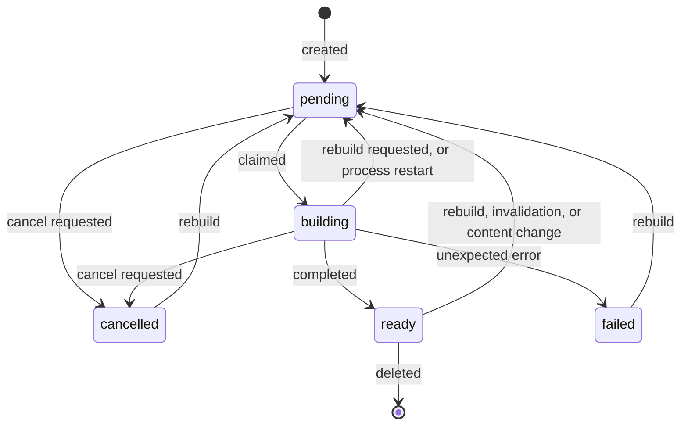

# Translation Index API

**Status:** Authoritative contract for the translation index endpoints
**Audience:** Implementers and reviewers of [frvt-12-acceptance-criteria-1.md](./frvt-12-acceptance-criteria-1.md)
**Scope:** `/api/indexes` CRUD, status, rebuild, cancel, and usage, plus the index-backed read path in the batch mapping endpoints. Every other route is unchanged.

An **index** is a translation paired with a versification whose verse mappings against every *other* index are pre-created and stored. Mapping a verse between two indexed translations then costs one bulk row read instead of a chain walk and per-verse span queries.

Authentication, the error envelope, pagination bounds, and BCV grammar follow [frvt-3-http-api-spec-1.md](./completed/frvt-3-http-api-spec-1.md) and [frvt-8-batch-mapping-api-spec-1.md](./completed/frvt-8-batch-mapping-api-spec-1.md) except where this document says otherwise.

---

## 1. Acceptance criteria map

| Criterion | Where it lives |
| --- | --- |
| 1 CRUD a list of translation/versification combinations | [§3](#3-endpoints) |
| 1.1 Cartesian product of mappings | [§4](#4-what-gets-built) |
| 1.1.1 Scale limits | [§8](#8-resource-consumption) |
| 2.1 Asynchronous indexing | [§5](#5-lifecycle-and-status) |
| 2.1.1 Terminated on removal | [§6](#6-automatic-invalidation-and-removal) |
| 2.1.2 Rebuilt on update | [§6](#6-automatic-invalidation-and-removal) |
| 2.1.3 Rebuilt when other indexes are added | [§4](#4-what-gets-built) |
| 2.2.1 Indexing status | [§5](#5-lifecycle-and-status) |
| 2.2.2 Manual rebuild and termination | [§7](#7-manual-rebuild-and-termination) |
| 3.1 Resource consumption data | [§8](#8-resource-consumption) |
| 3.2 Automatic removal with translations/versifications | [§6](#6-automatic-invalidation-and-removal) |
| 4 Versification optional, with defaults | [§3.2](#32-versification-defaulting) |
| 5 Batch mapping API uses indexes | [§9](#9-read-path) |

---

## 2. The index resource

```json
{
  "id": "11111111-1111-1111-1111-111111111111",
  "translation_id": "22222222-2222-2222-2222-222222222222",
  "versification_id": "33333333-3333-3333-3333-333333333333",
  "versification_explicit": false,
  "status": "ready",
  "pending_reason": null,
  "build_notes": null,
  "last_error": null,
  "pairs_total": 4,
  "pairs_completed": 4,
  "outbound_mappings": 31102,
  "inbound_mappings": 31170,
  "requested_at": "2026-09-17T18:00:00Z",
  "started_at": "2026-09-17T18:00:05Z",
  "completed_at": "2026-09-17T18:04:41Z"
}
```

| Field | Meaning |
| --- | --- |
| `translation_id` / `versification_id` | The indexed combination. Unique together; a second index for the same pair is `409`. |
| `versification_explicit` | `false` when the versification was defaulted ([§3.2](#32-versification-defaulting)). A defaulted index **retargets** when the translation's preferred versification changes; an explicit one does not. |
| `status` | One of `pending`, `building`, `ready`, `failed`, `cancelled`. See [§5](#5-lifecycle-and-status). |
| `pending_reason` | Why the index is queued: `created`, `manual rebuild`, `translation updated`, `versification updated`, `content changed`, `preferred versification changed`, `versification changed`, `interrupted`. |
| `build_notes` | Non-fatal warnings from the last build, such as a pair skipped for having no shared ancestor, or a retarget that would have collided with an existing index. |
| `last_error` | Set only alongside `failed`. |
| `pairs_total` / `pairs_completed` | Progress across the ordered pairs this build must materialize. |
| `outbound_mappings` / `inbound_mappings` | Stored rows where this index is the source and the target respectively ([§8](#8-resource-consumption)). |

---

## 3. Endpoints

| Method | Path | Success | Purpose |
| --- | --- | --- | --- |
| `GET` | `/api/indexes` | `200` `Page[IndexOut]` | List indexes. `limit` defaults to `100`, max `500`. |
| `POST` | `/api/indexes` | `201` `IndexOut` | Create an index and queue its build. |
| `GET` | `/api/indexes/usage` | `200` `IndexUsageOut` | Aggregate resource consumption. |
| `GET` | `/api/indexes/{index_id}` | `200` `IndexOut` | Read one index, including status and progress. |
| `PATCH` | `/api/indexes/{index_id}` | `200` `IndexOut` | Change the versification; queues a rebuild. |
| `DELETE` | `/api/indexes/{index_id}` | `204` | Remove the index. Returns immediately. |
| `POST` | `/api/indexes/{index_id}/rebuild` | `202` `IndexOut` | Queue a rebuild. |
| `POST` | `/api/indexes/{index_id}/cancel` | `202` `IndexOut` | Request termination of a queued or running build. |

`GET /api/indexes/usage` is a fixed path and takes precedence over `/api/indexes/{index_id}`; `usage` is never treated as an id.

### 3.1 Create

```json
{
  "translation_id": "22222222-2222-2222-2222-222222222222",
  "versification_id": null
}
```

`versification_id` is optional ([§3.2](#32-versification-defaulting)). The response is the new index with `status` `pending`. Building is asynchronous; the caller polls `GET /api/indexes/{index_id}`.

### 3.2 Versification defaulting

Versification is an optional indexing parameter. When it is omitted:

1. the translation's **preferred** versification, if there is one; otherwise
2. the canonical **`org`** versification.

This is the same precedence the batch endpoints use, so an index created with the default is the one those endpoints will look for. `versification_explicit` records which way the index was created:

- **Defaulted** (`false`) — the index tracks the default. If the translation's preferred versification later changes, the index's `versification_id` is updated to the new default and a rebuild is queued. Without this, the stored id would no longer match what the batch endpoints select and the index would silently stop being used.
- **Explicit** (`true`) — the index stays on the versification it was given. `PATCH` always sets this to `true`.

If retargeting would collide with an existing index for the same translation and versification, the defaulted index is **left unchanged**, the collision is recorded in `build_notes`, and nothing is deleted.

### 3.3 Status codes

| Status | `code` | When |
| --- | --- | --- |
| `200` / `201` / `202` / `204` | — | Accepted. |
| `401` | `unauthorized` | Missing or invalid Basic credentials. |
| `404` | `not_found` | Unknown index, translation, or versification. |
| `409` | `conflict` | An index already exists for that translation and versification; a `PATCH` would collide with one; a cancel was requested for an index that is not `pending` or `building`; the translation has no preferred versification and no canonical `org` exists. |
| `422` | `validation_failed` | `limit` outside `1..500`. |
| `429` | `too_many_requests` | Failed-auth limiter. |

An index may be created for a translation with no stored verses. It becomes `ready` with zero mapping rows. That is not an error.

---

## 4. What gets built

Mappings are pre-created for the **cartesian product of ordered pairs** of indexes, excluding self-pairs. Resolution is directional — mapping A into B is not the inverse of mapping B into A — so both directions are stored. Twelve indexes therefore means 132 pairs.

One stored row is one (ordered pair, source reference) with the complete `ResolveResult` that `GET /api/resolve` would return for that reference. Source references are exactly the whole verses the source translation has stored, expanded the same way `GET /api/resolve/range` expands them, including every constituent verse of a combined milestone. Sub-verse parts are not indexed.

Adding an index does **not** rebuild the existing ones. Building index X materializes the pairs between X and every index already `ready`, in both directions; pairs between two indexes that were already `ready` are untouched and remain valid. Indexes queued at the same time converge, because each one builds against whichever are `ready` when its turn comes and then becomes `ready` itself.

Builds run one at a time, serialized per database (session-level advisory lock keyed by the catalog OID of the current database). A second process on the same database waits; processes on other databases, including pytest workers, do not block it. After a reclaim-queue entry's mapping rows are gone, the worker runs ``VACUUM (ANALYZE)`` on ``index_mapping`` so ``mapping_bytes`` can drop without waiting for autovacuum.

A pair whose two versification chains share no ancestor cannot be built. That pair is skipped, the reason is recorded in `build_notes`, and the index still becomes `ready`. Requests for that pair fall back to live resolve, which returns the same `422` it returns today.

---

## 5. Lifecycle and status



| Status | Meaning |
| --- | --- |
| `pending` | Queued. `pending_reason` says why. |
| `building` | Being materialized. `pairs_completed` advances as it goes. |
| `ready` | Complete and usable by the read path. |
| `failed` | Stopped on an unexpected error; `last_error` has the detail. Mapping rows may be partial. |
| `cancelled` | Stopped on request. Mapping rows may be partial. |

Partial rows from a `failed` or `cancelled` build are never read, because [§9](#9-read-path) requires both indexes to be `ready`. They are cleared by the next build, and they are visible in `GET /api/indexes/usage` until then.

A build interrupted by a process restart is returned to `pending` at the next startup, so a crash cannot leave an index wedged in `building`.

---

## 6. Automatic invalidation and removal

| Event | Effect |
| --- | --- |
| Translation renamed or its language changed | Its indexes return to `pending`. |
| Versification renamed, or its mappings rebuilt | Indexes on that versification return to `pending`. |
| A versification anywhere in an index's chain changes | Detected by a periodic content check; the index returns to `pending`. |
| Translation's preferred versification changed | Defaulted indexes retarget and return to `pending` ([§3.2](#32-versification-defaulting)). |
| Translation deleted | Its indexes are removed. |
| Versification deleted | Indexes on it are removed. |
| Index deleted | Its mapping rows in both directions are removed. |

Removal terminates any build in flight for that index: the build notices its own row is gone and stops.

Beyond the per-request hooks above, each index stores a fingerprint of everything it depends on — the translation's modification time and verse count, and every versification in its chain with its modification time and mapping count. The background worker re-checks those fingerprints when it is otherwise idle. That check is the authority for changes no single endpoint can observe, including canonical seeding at startup, so a stale index heals itself rather than waiting for someone to notice.

Deleting an index or its translation or versification returns immediately. The index record disappears at once, which is what makes the removal observable, while the mapping rows are reclaimed in the background in chunks. At the twelve-index scale a single index owns several hundred thousand rows, and deleting those inside the request would make an ordinary `DELETE` take a long time. Until reclamation finishes, the rows are unreachable and are reported as pending reclamation in `GET /api/indexes/usage`.

---

## 7. Manual rebuild and termination

Two endpoints let an operator intervene, and both are safe to use while automatic indexing is running.

**`POST /api/indexes/{index_id}/rebuild`** queues the index for a full rebuild. It is legal from **any** status, including `building`. A rebuild requested during a build wins: the running build notices it is no longer the current request, abandons its work without publishing a result, and the index is re-claimed from the start. This is what makes the endpoint safe to call at any moment — there is no window in which a rebuild request can be silently overwritten by a build that was already in flight.

**`POST /api/indexes/{index_id}/cancel`** requests termination. The effect depends on the status:

- `building` — the build stops at its next checkpoint, within one chunk of work, and the index becomes `cancelled` with its partial rows left in place.
- `pending` — the index becomes `cancelled` without being built.
- `ready`, `failed`, `cancelled` — `409 conflict`. There is nothing to cancel, and reporting that is more useful than silently doing nothing.

Cancellation never deletes data. Recover from it with `rebuild`, which clears the partial rows before writing new ones.

Because a build publishes its `ready` status only if it is still the current request and has not been cancelled, the automatic triggers in [§6](#6-automatic-invalidation-and-removal) and these manual operations cannot overwrite one another. The most recent request always determines the outcome.

---

## 8. Resource consumption

`GET /api/indexes/usage`:

```json
{
  "total_indexes": 3,
  "ready_indexes": 2,
  "mapping_rows": 186612,
  "mapping_bytes": 132055040,
  "reclaim_pending": 0
}
```

| Field | Meaning |
| --- | --- |
| `mapping_rows` | Stored mapping rows across all pairs. |
| `mapping_bytes` | Postgres `pg_total_relation_size` for `index_mapping` (table plus indexes). Dead tuples remain until `VACUUM`, so this can stay high after `mapping_rows` drops to zero. |
| `reclaim_pending` | Deleted indexes whose mapping rows are still queued for chunked cleanup. |

Per-index counts are on the index resource as `outbound_mappings` and `inbound_mappings`. They are computed on read, so they are always accurate but cost two counting queries; treat them as an administrative read rather than something to poll aggressively.

### 8.1 Expected scale

Mappings grow with the *square* of the number of indexed translations, which is why the acceptance criteria cap practical use at twelve full-sized translations with no more than about 5% divergence each.

At that cap, with about 30,000 verses per translation:

- ordered pairs: 132
- stored rows: about 4.0 million
- on-disk size: on the order of 2.5–3.5 GB, including the primary key

Provision disk with headroom for that plus reclamation lag, and watch `mapping_bytes`. **No cap is enforced.** The API reports consumption and lets an operator decide; it will not refuse to create a thirteenth index.

Building is I/O-bound and takes minutes per pair on a full-sized translation. Adding an index to an existing set costs two pairs per existing index, so the cost of each addition grows linearly while total storage grows quadratically.

---

## 9. Read path

`GET /api/resolve/range` and `POST /api/resolve/verses` use an index automatically. Nothing in the request changes.

For each request, both sides' versifications are selected exactly as before. An index is then used **only when both sides have a `ready` index for the translation and versification actually selected**. That single condition is what makes every incomplete state safe: anything else falls back to resolving live and returns the same answer.

The response carries one additional field:

| Field | Meaning |
| --- | --- |
| `index_used` | `true` when a ready index pair was consulted for this request. Per-entry fallback within a consulted pair is not distinguished. |

Results are identical either way. The stored payload is the same `ResolveResult` the live path produces, written by the same code, so relation classification, span de-duplication, combined-milestone anchoring, and the omission of unset relation axes all behave the same.

Two kinds of reference always fall back to live resolve, per entry, even when the pair is indexed:

- a multi-verse reference such as `GEN 1:1-3`, which is not a single indexed coordinate
- a reference outside the source translation's stored verses

Request-level validation is unchanged and still happens before any lookup: unknown translation is `404`, an unassociated override versification is `409`, and versifications with no shared ancestor or a chain cycle are `422`. An index never suppresses or alters those.

### 9.1 Performance

The indexed path replaces per-verse chain walking and span enrichment with one bulk row read, which is what makes a chapter's worth of verses — about 50 — comfortably sub-second in a typical AWS deployment. Measured numbers from `.test/scripts/run-index-benchmark.sh` belong in [§9.2](#92-measured-results).

`LOG_LEVEL` defaults to `DEBUG`, and the live path logs a line per verse. Raise it above `DEBUG` for batch workloads and when benchmarking, or logging will dominate the measurement.

### 9.2 Measured results

Recorded 2026-09-17 on host `dev-frontier-rnd-1` (Linux, 8 CPUs) against a local API (`LOG_LEVEL=WARNING`, `INDEX_WORKER_POLL_SECONDS=1`, Compose Postgres on port 5433). Translations: *Biblica® Open Nueva Biblia Viva* and *American Standard Version of 1901 [eng] ASV*, each indexed on its preferred versification. After both indexes were `ready`, `GET /api/indexes/usage` reported `mapping_rows` 62205 and `mapping_bytes` 41394176 (~39.5 MiB). After those indexes were deleted, an explicit `VACUUM (ANALYZE)` on `index_mapping` dropped `mapping_bytes` to 7512064 (~7.2 MiB) with `mapping_rows` 0.

`POST /api/resolve/verses` for 50 whole verses from JHN:

| Path | Wall-clock | `index_used` |
| --- | --- | --- |
| Ready index pair | 0.1965 s | `true` |
| Live resolve (indexes deleted) | 1.1280 s | `false` |

The indexed path stayed under one second on this host (about six times faster than live resolve). The live path did not; criterion 5's sub-second target is for a typical AWS deployment, not this development box. Re-run with [`.test/scripts/run-index-benchmark.sh`](../.test/scripts/run-index-benchmark.sh); raise `LOG_LEVEL` above `DEBUG` or logging will dominate the live-path measurement.

---

## 10. Non-goals

- Any UI or TypeScript client change.
- Index use by `GET /api/resolve`, `GET /api/resolve/chapter`, or the navigation and jump-menu routes.
- An enforced cap on index count, or refusing work on resource grounds.
- Sub-verse part handling inside an index.
- Indexing a versification pair without translations.
- Parallel or distributed build workers, and any new infrastructure or runtime dependency.
