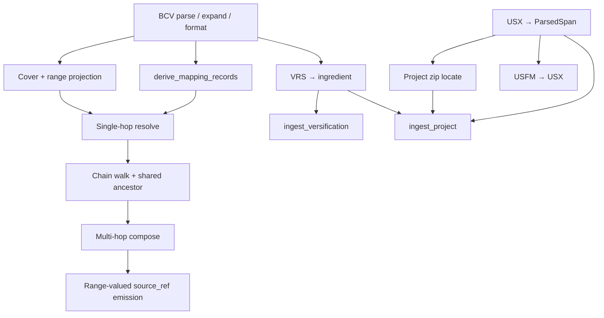

# Versification Viewer: Mapping Resolver and Ingest Derivation Specification

**Status:** Draft for implementation (implementation-ready interim bindings)
**Audience:** Developers (or coding agents) implementing `frvt.resolver` and the mapping/ingest derivation pieces of `frvt.ingest`; planners combining this work with API, ORM, and UI delivery.
**Companion documents:**
- API / DB / HTTP: [frvt-3-server-and-api-spec-1.md](./frvt-3-server-and-api-spec-1.md) (contracts §8.1–§8.2, data model §6)
- Working requirements / assumption ids: [frvt-3-resolver-requirements-1.md](./requirements/frvt-3-resolver-requirements-1.md)
- Samples: [research/CopenhagenFormat/](../research/CopenhagenFormat/), [research/ParatextFormat/](../research/ParatextFormat/)
- POC context: [research/frvt-versification-viewer-poc-1.md](../research/frvt-versification-viewer-poc-1.md)

**Scope:** Behavior of the in-process resolver (`resolve`) and of ingest functions that produce `ParsedSpan` / `ParsedScheme` / `MappingRecordDTO` (API §8.2). Out of scope: HTTP, auth, ORM models/migrations, CRUD routers, UI. The API persists what ingest returns and attaches `verse_span.seq` after resolve.

> **Modification policy.** The normative body of this specification (numbered sections before **Addenda**) is frozen after initial reconciliation and is **never edited**. All post-reconciliation changes are recorded only in **Addenda** at the end of this file.
>
> - **Subsections** (`### ADD-*-NNN`) represent logical spec extensions or modifications — one subsection per issue discovery or requirements change. A subsection may list multiple modification rows. The subsection **title** and **Purpose** describe the extension at a **capability or logical level** (what the spec must support); they do not list field names, section ids, or other implementation detail.
> - **Modification rows** (within a subsection table) are the atomic changes: each row has its own id, cites the section identifier(s) being changed, states an **Action** (`ADD`, `CLARIFY`, `REPLACE`, `REMOVE`), and provides the **effective text**. Detail lives here, not in the Purpose paragraph. Rows with `REPLACE` or `REMOVE` supersede or void the cited main-body text **logically** when computing the effective specification; they do **not** authorize editing the main body.
> - **Effective specification:** Start from the frozen main body, then apply addendum subsections in order; within each subsection, apply modification rows in listed order. Later rows override earlier ones for the same target. The on-disk main body always remains unchanged.

**How to use this document:** Algorithms in §§5–8 and contracts in §3 are normative enough to implement or to derive a delivery plan that is later merged with API/ORM/UI work. This document does **not** prescribe project phases. Section 12 lists **dependencies** that constrain ordering when a combined plan is produced. Where a rule was previously TBD, this document states an **interim binding** (marked *Interim*) that may later move into the requirements assumptions table.

---

## 0. Implementation-readiness notes

Detail level aims at: a moderate-skill implementer (or LLM) can invent concrete algorithms and a combined schedule from this spec plus the API design, without inventing policy.

| Area | Role in this document |
| --- | --- |
| Resolver I/O contract | Explicit types + exception matrix (§3) |
| Shared-ancestor / hop walk | Pseudocode, chain shape, stop conditions (§6.2) |
| Covering record + range projection | Cover rules, zip-by-index, unequal-length policy (§6.3–6.4) |
| Relation inverses / composition | Interim composition + shift/renumber classifier (§6.5, §7.2) |
| `derive_mapping_records` | Ordered algorithm, partial encoding, ordinal (§7) |
| Project / VRS / USX ingest | Zip layout, USX span rules, VRS→ingredient map (§8) |
| Module layout | Suggested packages (§2); planners may split further |
| Ordering | Dependencies only (§12); no delivery phases here |

Residual TBDs that need not block core resolve/derive work: cross-book range inputs; exotic part suffixes beyond schema (`ESG 8:12t`). Heterogeneous ranges and many-to-many compositions are resolved as one `complex` hull with `edges` (§6.8, A24), not a "dominant relation".

---

## 1. Overview

Given a BCV `source_ref` (single verse or same-chapter range) and two schemes, return individual source/target spans and a `relation_type` by pivoting through a **shared ancestor translation** on each scheme’s `based_on_id` chain.


Uncovered verses on a hop are identity `one_to_one` (same book, chapter, verse, part). The resolver **reads only** scheme/mapping/association data; it does **not** read `VERSE_SPAN.content` (A20). Ingest derivation is pure (no DB writes).

### 1.1 What mapping does and does not use

| Used by resolve | Not used by resolve |
| --- | --- |
| `mapping_record` (BCV / bcvRange coords + relation) | `VERSE_SPAN.content` |
| Scheme `based_on_id` / chain + preferred scheme of each base translation | Semantic equivalence of verse text or parts |
| Optional `ingredient.maxVerses` for bounds; `mapping_record.part` for partial parts | UI layout |

`based_on_id` points at a **translation** because that row is the stable numbering-space node in the chain (look up its preferred scheme for the next hop; FK prevents deleting an anchor still in use). Mapping rows are already complete as coordinate transforms; the base translation’s text is irrelevant to the algorithm. Text is required only so the API/UI can **display** the caller’s source and target translations after refs are resolved.

**Scheme sharing:** A `VERSIFICATION_SCHEME` outlives any single association. Deleting a translation drops its `translation_versification` rows and spans; the scheme and its `mapping_record`s remain for other translations. Deleting a translation that is still referenced as `based_on_id` is rejected—chain integrity, not text dependency.

**Part splits:** If two translations partition the same verse into different `part` sets, the resolver still only moves coordinates / part labels. Any semantic drift is for human review, not for this algorithm (A4, A20).

---

## 2. Package layout (suggested)

Aligns with API §9. Implement against these modules; planners may split further but should not move contracts.

```text
frvt/
  resolver/
    __init__.py          # re-export resolve, DTOs
    types.py             # BcvRef, SchemeRef, ResolutionDTO, …
    parse_ref.py         # parse / expand / format BCV
    cover.py             # covering-record lookup, range projection
    chains.py            # based_on chain walk, shared ancestor
    compose.py           # upward / downward hop application
    resolve.py           # resolve() orchestration
  ingest/
    __init__.py
    types.py             # ParsedSpan, ParsedScheme, MappingRecordDTO, IngestIssue
    project_zip.py       # unzip, locate USX + .vrs
    usx_parse.py         # USX → ParsedSpan sequence
    usfm_convert.py      # optional USFM→USX (depends on A13; see §12)
    vrs_convert.py       # VRS text → ingredient dict
    burrito_validate.py  # schema / structural checks
    derive_mappings.py   # derive_mapping_records()
    ingest_api.py        # ingest_project, ingest_versification
```

---

## 3. Boundary contracts

### 3.1 Resolver (API §8.1)

```python
@dataclass(frozen=True)
class SchemeRef:
    scheme_id: UUID
    based_on_id: UUID | None       # translation.id — numbering-space anchor, not text
    based_on_name: str | None = None

@dataclass(frozen=True)
class ResolvedSpanDTO:
    ref: str                 # single-verse "BOOK C:V" only; the part is carried separately
    part: str | None

@dataclass(frozen=True)
class ResolutionEdgeDTO:
    # A single connector in a composite ("complex") result. Indices point into the
    # ResolutionDTO's source_spans / target_spans tuples; `relation` is the
    # per-connector relation the UI colors and labels (§3.3).
    source_index: int
    target_index: int
    relation: str

@dataclass(frozen=True)
class ResolutionDTO:
    source_spans: tuple[ResolvedSpanDTO, ...]
    target_spans: tuple[ResolvedSpanDTO, ...]
    relation: str                               # relation_type; "complex" for many-to-many hulls
    edges: tuple[ResolutionEdgeDTO, ...] = ()    # populated only when relation == "complex"

def resolve(
    session: Session,
    source_ref: str,
    *,
    source_scheme: SchemeRef | None = None,
    target_scheme: SchemeRef | None = None,
    source_translation: UUID | None = None,
    target_translation: UUID | None = None,
    part: str | None = None,
) -> ResolutionDTO: ...
```

| Input / output | Rule |
| --- | --- |
| `source_ref` | bcv or same-chapter bcvRange; **no part in the string**; ranges must not raise |
| `part` (input) | Optional part id passed separately; never concatenated into `source_ref` (A23) |
| `source_scheme` / `target_scheme` | Optional per side. When given, that concrete scheme is used. When omitted, the resolver loads the corresponding translation's **preferred** scheme (`preferred_scheme_ref`); a side must supply *either* a scheme *or* a translation id |
| `source_translation` / `target_translation` | Translation ids used only to look up a preferred scheme when the matching `*_scheme` is omitted (per-request selection / preferred default, A26) |
| Emitted `ref` | Always single-verse BCV; never `V-V`; never carries a part suffix |
| `part` (output) | `None` for whole verse; else part id string, carried on `ResolvedSpanDTO.part` |
| `edges` | Empty for atomic relations; for `complex`, one entry per connector (§6.6) |
| Raises | `ReferenceError` invalid grammar / cross-chapter range; `LookupError` missing scheme, a side with neither scheme nor a translation that has a preferred scheme, missing intermediate preferred scheme, no shared ancestor. The API pre-checks translation existence and the selected scheme (server §7.8) before calling, so those never surface here as `LookupError` |

*Interim:* When a `*_scheme` is supplied the resolver uses it directly and needs no translation id for that side; the API supplies the selected scheme (per-request `*_versification` override, else preferred) so the fallback lookup stays dormant for API calls. When a `*_scheme` is omitted (direct/library callers), the resolver resolves the translation's preferred scheme. Chain walking starts at the resulting scheme; the first hop’s “own” numbering is that scheme’s source side. The next translation is `based_on_id`; its **preferred** scheme is loaded via `translation_versification` for further hops.

### 3.2 Ingest (API §8.2) — owned here

```python
def ingest_project(archive_bytes: bytes) -> ProjectIngestResult: ...
def ingest_versification(file_bytes: bytes, filename: str) -> tuple[ParsedScheme, tuple[IngestIssue, ...]]: ...
def derive_mapping_records(scheme: ParsedScheme) -> tuple[MappingRecordDTO, ...]: ...
```

DTOs match API §8.2. Each `IngestIssue` carries a `kind` (`missing` | `invalid`): a `missing` issue (a required file absent from the input) ⇒ API `400`; an `invalid` issue (content or schema validation failure) ⇒ API `422` (server §8.2). Any non-empty `issues` still means reject and persist nothing (all-or-nothing). Functions do not open DB sessions or commit.

### 3.3 Relation vocabulary

`one_to_one` | `shift` | `renumber` | `split` | `merge` | `exclude` | `partial` | `complex`

The first seven are **atomic** and may be stored on a `mapping_record`. `complex` is **resolve-time only** (never stored): it is the top-level relation of a many-to-many composed hull, whose per-connector relations travel on `ResolutionDTO.edges` (§6.6, A24).

**Inverses (descent):** `split`↔`merge`; others self-inverse; `exclude` terminates (empty targets).

**Cardinality of `ResolutionDTO`:**

| Relation | source_spans | target_spans | edges |
| --- | --- | --- | --- |
| `one_to_one` / `shift` / `renumber` | 1 | 1 | empty |
| `split` | 1 | N | empty |
| `merge` | N (query verse + siblings) | 1 | empty |
| `exclude` | ≥1 | 0 | empty |
| `partial` | parts set on spans | parts set on spans | empty |
| `complex` | M | N | one per connector, each with its own relation |

---

## 4. Internal types and BCV grammar

### 4.1 Grammar

| Form | Regex | Example |
| --- | --- | --- |
| bcv | `^([A-Z1-6]{3}) ([0-9]+):([0-9]+)$` | `GEN 31:55`, `PSA 3:0` |
| bcvRange | `^([A-Z1-6]{3}) ([0-9]+):([0-9]+)(?:-([0-9]+))?$` | `PSA 3:0-8` |

Verse `0` is valid (Psalm title). Cross-chapter ranges are **invalid** for resolve input (*Interim*). The grammar deliberately has **no part component**: parts travel separately (A23), so a caller resolves `SIR 36:13a` by passing `source_ref="SIR 36:13"` with `part="a"`, not a part-suffixed string. `parse_ref("SIR 36:13a")` raises `ReferenceError`.

### 4.2 Internal structs

```python
@dataclass(frozen=True)
class VerseId:
    book: str
    chapter: int
    verse: int
    part: str | None = None

@dataclass(frozen=True)
class RefRange:
    book: str
    chapter: int
    verse_start: int
    verse_end: int  # inclusive; == start for single verse
```

**Required helpers:**

| Function | Behavior |
| --- | --- |
| `parse_ref(s) -> RefRange` | Raise `ReferenceError` if neither pattern matches or `verse_end < verse_start` |
| `expand(range) -> list[VerseId]` | One `VerseId` per verse in `[start, end]`, `part=None` |
| `format_bcv(v: VerseId) -> str` | `f"{book} {chapter}:{verse}"` (part not in string; carried separately) |
| `covers(record_range: RefRange, v: VerseId) -> bool` | Same book/chapter and `start <= v.verse <= end` |
| `index_in_range(range, v) -> int` | `v.verse - range.verse_start` (caller ensures covers) |

---

## 5. Data the resolver loads

| Need | Query sketch |
| --- | --- |
| Scheme row | `versification_scheme` by `scheme_id` |
| Mapping rows | All `mapping_record` for `scheme_id` (or filtered by book later) |
| Preferred scheme of translation T | `translation_versification` where `translation_id=T` and `preferred=true` → `scheme_id`. Used for chain hops and as the fallback when a caller omits a side's scheme; a per-request `*_versification` override is resolved by the API before `resolve()`. |
| maxVerses (optional) | From `ingredient` for navigation bounds |
| Partial parts | From the `mapping_record.part` column on `partial` rows (no ingredient re-read, A23) |
| Base translation row | Only to confirm `based_on_id` exists when diagnosing; **not** its spans |

Do **not** load `VERSE_SPAN` / `content` inside `resolve` (A20). Seq/content attachment is an API-port concern after resolution.

*Interim:* Prefer loading all mapping rows for a scheme into memory per hop (POC size). Index in process by book for cover search.

---

## 6. Resolution algorithm (normative)

### 6.1 Orchestration (`resolve`)

```text
0. Select each side's scheme (per-request selection / preferred default, A26):
     source_scheme = source_scheme or preferred_scheme_ref(source_translation)
     target_scheme = target_scheme or preferred_scheme_ref(target_translation)
   if either side still has no scheme: raise LookupError
   (For API calls this is a no-op: the API already passes the selected scheme.)
1. members = expand(parse_ref(source_ref))   # part arrives separately, applied to members
2. src_chain = build_chain(session, source_scheme)   # list[Hop]
3. tgt_chain = build_chain(session, target_scheme)
4. ancestor = nearest_shared_translation(src_chain, tgt_chain)
   if none: raise LookupError
5. src_hops_to_anc = hops on src_chain until numbering lands on ancestor
6. tgt_hops_from_anc = hops on tgt_chain from ancestor down to target (reverse order for apply)
7. Attempt an atomic resolution first:
   - result_state = apply_upward(members, src_hops_to_anc)   # tracks pivot verses per source
   - if a member resolves to exclude with no counterpart: handle exclude
     (ResolutionDTO source_spans=..., target_spans=(), relation="exclude")
   - result_state = apply_downward(result_state, tgt_hops_from_anc)
8. Collect merge/split siblings into source_spans / target_spans (§6.4).
9. If the source<->pivot<->target linkage is many-to-many (more than one source AND
   more than one target after sibling closure), build the composite hull and edges via
   build_hull (§6.8); relation = "complex".
10. Otherwise emit the atomic ResolutionDTO (relation per §6.5, empty edges).
    Return the ResolutionDTO.
```

### 6.2 Build chain

A **Hop** is `(scheme_id, based_on_id, mappings)`.

```text
build_chain(scheme: SchemeRef) -> list[Hop]:
  hops = []
  current = scheme
  seen_schemes = set()
  while True:
    if current.scheme_id in seen_schemes: raise LookupError("cycle")
    seen_schemes.add(current.scheme_id)
    rows = load_mapping_records(current.scheme_id)
    hops.append(Hop(current.scheme_id, current.based_on_id, rows))
    if current.based_on_id is None:
      break  # root numbering reached after this hop's application
    next_scheme = preferred_scheme_ref(current.based_on_id)
    if next_scheme is None:
      # Root base translation with no further scheme: stop.
      # Numbering after last hop is that translation's canonical numbering.
      break
    current = next_scheme
  return hops
```

**Translation sequence for ancestor search:**  
`[based_on_id of hop0, based_on_id of hop1, …]` filtering nulls; also treat “root numbering” as a sentinel if the last hop has `based_on_id is None` after applying (the root translation is the last non-null `based_on_id`, or a configured root name such as a translation named `org` when both chains end there).

*Interim shared-ancestor rule:*

1. Let `S` = ordered list of translation ids visited as `based_on_id` along the source chain (first hop’s `based_on_id` first).
2. Let `T` = same for target.
3. If `S` and `T` share any id, pick the **first** id in `S` that also appears in `T` (nearest to source / short-cut).
4. Else if either chain ends at a root with null further base, and the other chain eventually reaches the same root translation id, use that root.
5. Else `LookupError`.

Same `based_on_id` on both input schemes ⇒ that translation is the ancestor (one upward hop each, then downward).

### 6.3 Covering record

For verse `v` and hop mappings:

1. Consider records whose parsed `source_ref` (upward) or `base_ref` (downward / inverse) covers `v`.
2. Prefer **narrowest** cover (smallest `verse_end - verse_start`); if tie, lowest `ordinal`.
3. If none → identity: output `v` unchanged, relation contribution `one_to_one`.

### 6.4 Project through a range pair (upward)

Given covering record with `source_ref` → `src_r`, `base_ref` → `base_r` (nullable):

| Relation | Action |
| --- | --- |
| `exclude` | `base_ref` is null → mark excluded; stop chain |
| `merge` | All verses in `src_r` map to **one** target: `base_r.verse_start` (or sole verse). Collect siblings = expand(`src_r`) for emission |
| `split` | Rare on stored upward rows; if `src` single and `base` multi: map source verse to all expand(`base_r`) |
| `partial` | Preserve `part`; map book/chapter/verse per refs |
| `shift` / `renumber` / `one_to_one` | **Zip by index** (*Interim*): `i = index_in_range(src_r, v)`; if `i >= length(base_r)` raise or clamp — *Interim: clamp to last base verse and log*; emit `VerseId(base.book, base.chapter, base.verse_start + i)` if same-chapter base range. If `src` and `base` lengths differ, zip `min(len)`; *Interim: if `v` index ≥ len(base), use last base verse* |

**Downward / invert:** swap roles of `source_ref` and `base_ref`; invert relation via §3.3; same projection rules.

### 6.5 Compose relations across hops (*Interim* A11)

```text
compose(a, b):
  if a == one_to_one: return b
  if b == one_to_one: return a
  if a == exclude or b == exclude: return exclude
  if {a,b} == {split, merge}: return one_to_one   # cancel
  if a == b: return a
  # otherwise: prefer more “structural” relation
  priority = exclude > merge > split > renumber > shift > partial > one_to_one
  return higher_priority(a, b)
```

`compose` classifies a **single 1↔1 path** (one source verse to one target verse). When the source-climb and target-descent instead link a set of source verses to a set of target verses through shared pivot verses (many-to-many), the atomic composition above does not apply; §6.8 builds a `complex` hull with explicit per-connector relations, and `compose` is used only to label each individual connector edge.

### 6.6 Range-valued `source_ref` (*Interim* A8–A9)

1. Expand members.
2. Resolve each member through the same chains (reuse hop loads).
3. If all members share the same final atomic `relation` and form one contiguous mapping group, emit **one** `ResolutionDTO` whose `source_spans` / `target_spans` are the unions (sorted by book, chapter, verse), relation = that relation, empty `edges`.
4. If the members' linkage is many-to-many or their relations conflict, emit one `complex` hull over all members via `build_hull` (§6.8) — **do not raise**. This supersedes any earlier "dominant relation" interim.

### 6.7 Worked numeric examples

Assume eng scheme `mappedVerses` contains `"PSA 3:0-8": "PSA 3:1-9"` classified `shift`, and both schemes `based_on` → translation `org` (or eng→org and target is org).

| Call | Expected |
| --- | --- |
| `resolve("PSA 3:1", eng, org)` | `shift`; source `PSA 3:1`; target `PSA 3:2` |
| `resolve("GEN 31:55", eng, org)` | `renumber` or `shift` per classifier; target `GEN 32:1` |
| `resolve("JHN 3:16", eng, org)` | `one_to_one`; same ref both sides |
| `resolve("PSA 3:0-2", eng, org)` | No raise; three (or grouped) individual spans, shifted |

Use [research/CopenhagenFormat/eng.json](../research/CopenhagenFormat/eng.json) for fixtures.

### 6.8 Composite (`complex`) hulls (A24)

When the source-climb and target-descent link **more than one** source verse to **more than one** target verse through shared pivot (ancestor) verses, do not collapse to a single atomic relation. Instead return the complete connected component.

The hull is the **complete connected component** — a bidirectional transitive closure over the bipartite graph `source verses <-> pivot (ancestor) verses <-> target verses`. Walking only source→pivot→target is insufficient: a pivot reached from the queried verse may also be reached by *sibling* source verses (e.g. a merge on the source side), and those siblings and their further targets belong in the same component.

```text
# Projection helpers reuse §6.3/§6.4 (cover + range projection), applied in both
# directions of a chain:
#   up(s)   = pivot verses a source verse maps to    (src_hops_to_anc, upward)
#   src(p)  = source verses that map to pivot p       (src_hops_to_anc, inverted)
#   down(p) = target verses a pivot maps to           (tgt_hops_from_anc, downward)
#   piv(t)  = pivots a target maps to                 (tgt_hops_from_anc, inverted)

build_hull(source_members, src_hops_to_anc, tgt_hops_from_anc):
  sources, pivots, targets = set(), set(), set()
  seen = set()
  worklist = [("source", s) for s in source_members]   # seed with the queried verse(s)
  while worklist:
    kind, node = worklist.pop()
    if (kind, node) in seen: continue
    seen.add((kind, node))
    if kind == "source":
      sources.add(node)
      for p in up(node):        worklist.append(("pivot", p))
    elif kind == "pivot":
      pivots.add(node)
      for s in src(node):       worklist.append(("source", s))   # pulls in sibling sources
      for t in down(node):      worklist.append(("target", t))
    else:  # target
      # an excluded branch yields no target verse; simply contributes nothing here
      targets.add(node)
      for p in piv(node):       worklist.append(("pivot", p))

  source_spans = sort_unique(sources)          # (book, chapter, verse, part)
  target_spans = sort_unique(targets)
  edges = []
  for p in pivots:
    for s in src(p):
      for t in down(p):
        edges.append(ResolutionEdgeDTO(
            index_of(s, source_spans), index_of(t, target_spans),
            compose(up_relation(s, p), down_relation(p, t))))   # per-connector label

  log(pivots, per-hop chains) if RESOLVE_TRACE_PIVOTS     # diagnostics only; NOT returned

  if len(source_spans) <= 1 and len(target_spans) <= 1:
    return atomic ResolutionDTO(source_spans, target_spans, atomic_relation, edges=())
  return ResolutionDTO(source_spans, target_spans, "complex", dedup(edges))
```

Rules and edge cases:

- **Not complex when 1↔1.** A closed component with at most one source and one target is not `complex`; emit its atomic relation with empty `edges`.
- **Atomic split/merge stay atomic.** A plain `split` (1→N) or `merge` (N→1) whose closure adds no further verses keeps its atomic relation and cardinality with empty `edges`.
- **Edge indices.** `edges` reference positions in `source_spans` / `target_spans`; `dedup` ensures each (source, target) connector appears once, carrying its own `relation`.
- **Exclude inside a hull.** An `exclude` branch contributes no target verse. If, after closure, the component has zero target spans, degenerate the whole result to `exclude` (empty `target_spans`, empty `edges`).
- **Partial inside a hull.** Parts are preserved on the participating spans (`ResolvedSpanDTO.part`); an edge touching a partial span still carries its per-connector relation.
- **Termination.** The `seen` set bounds the closure; `build_chain` already rejects scheme cycles (§6.2) and each hop's verse sets are finite, so the worklist drains.

Worked example: an `A` verse splits to two `org` verses (`split` A→org); each of those two `org` verses is one of a pair that `B` merges (`merge` B→org). Closure pulls in the B sibling verses and any A siblings sharing those pivots. The hull returns every linked A source verse and B target verse, `edges` labelling each connector (`split` / `merge` / composed), and top-level `relation = complex`.

---

## 7. Deriving `MAPPING_RECORD` rows

Pure function. Input: validated ingredient dict on `ParsedScheme`. Output: ordered `MappingRecordDTO`.

### 7.1 Algorithm

All `DTO(...)` are `MappingRecordDTO(source_ref, base_ref, part, relation, ordinal)` (§3.2 / server §8.2); `part` is `None` except for `partial` rows.

```text
ordinal = 0
rows = []

# 1) mappedVerses: object key -> value
for key, value in ingredient.get("mappedVerses", {}).items():
    rel = classify_mapped(key, value)   # §7.2
    rows.append(DTO(source_ref=key, base_ref=value, part=None, relation=rel, ordinal=ordinal)); ordinal += 1

# 2) excludedVerses: array of bcv
for ref in ingredient.get("excludedVerses", []):
    rows.append(DTO(source_ref=ref, base_ref=None, part=None, relation="exclude", ordinal=ordinal)); ordinal += 1

# 3) mergedVerses: array of bcvRange
for ref in ingredient.get("mergedVerses", []):
    base = ingredient.get("mappedVerses", {}).get(ref)
    # If exact key missing, *Interim*: find mappedVerses entry whose source_ref equals ref
    # or whose source range equals ref; else base_ref=None (still store merge)
    rows.append(DTO(source_ref=ref, base_ref=base, part=None, relation="merge", ordinal=ordinal)); ordinal += 1

# 4) partialVerses: bcv -> [part, ...]
for ref, parts in ingredient.get("partialVerses", {}).items():
    for part in parts:
        # source_ref stays plain bcv; the part goes in the dedicated `part` column,
        # never embedded in the ref string (A23). base_ref = ref (identity locus).
        # The resolver matches a partial row by (source_ref, part) directly from the
        # column — no need to re-read the ingredient.
        rows.append(DTO(source_ref=ref, base_ref=ref, part=part, relation="partial", ordinal=ordinal)); ordinal += 1

return tuple(rows)
```

`basedOn` / `maxVerses` / `verification` produce **no** mapping rows.

### 7.2 `classify_mapped` (*Interim* A11)

Parse `source_ref` and `base_ref` as `RefRange`.

```text
if source.book != base.book:
    return "renumber"
if source.chapter != base.chapter:
    return "renumber"
# same book+chapter
src_len = source.verse_end - source.verse_start + 1
base_len = base.verse_end - base.verse_start + 1
if src_len == 1 and base_len == 1 and source.verse_start == base.verse_start:
    return "one_to_one"
if src_len == base_len and (source.verse_start != base.verse_start):
    return "shift"   # includes Psalm title 0-8 → 1-9
if source.chapter != base.chapter or src_len != base_len:
    return "renumber"
return "shift"
```

---

## 8. Ingest pipelines (normative for planning)

### 8.1 `ingest_versification(file_bytes, filename)`

```text
1. Detect format:
   - .json / content starts with `{` → Copenhagen/Burrito ingredient
   - .vrs / lines look like VRS → convert (§8.3)
   - validation failures here → issue(kind="invalid", ...)
2. Validate required keys: maxVerses present; types roughly match schema
3. based_on = ingredient.get("basedOn") or "org"   # uploads default to org (A22)
4. name = optional override else filename stem else based_on or "custom"
5. canonical = False for uploads always; canonical roots come only from bootstrap (A21)
6. Return ParsedScheme(name, based_on, canonical, ingredient), issues
```

API resolves `based_on` → `translation` by **case-insensitive** name match (*Interim* A17); the defaulted/named base is guaranteed present via bootstrap (A21), so a lookup miss ⇒ ingest failure at persist time (API may also pre-check).

### 8.2 `ingest_project(archive_bytes)`

**Expected zip layout** (Paratext/DBL-style release bundle):

```text
metadata.xml                 # optional for POC parse
release/USX_1/*.usx          # or release/USX_<n>/
release/versification.vrs    # required for Path A success in API flow
release/styles.xml, *.ldml   # ignore
```

```text
1. Unzip to temp or ZipFile
2. Find first directory matching release/USX_* containing *.usx
   - If none: issue(kind="missing", field="archive", message="No USX_* tree")
3. Find release/**/*.vrs (prefer versification.vrs). The versification file is
   REQUIRED for project ingest (A15).
   - If none: issue(kind="missing", field="versification", message="No .vrs in project")
4. For each .usx (sorted by name): parse → append ParsedSpans (§8.4)
5. Convert vrs → ingredient (§8.3); validate (validation failures → issue(kind="invalid", ...))
6. ParsedScheme from vrs; basedOn from ingredient, defaulting to "org" when absent (A22)
7. Return ProjectIngestResult(spans, scheme, issues)   # any non-empty issues ⇒ reject, persist nothing
```

USFM-only trees: convert via `usfm_convert` then the same USX path (A13); see §12 for ordering relative to USX ingest.

### 8.3 VRS → ingredient (*Interim*)

VRS samples use:

- Book lines: `GEN 1:31 2:25 ...` → `maxVerses["GEN"] = ["31","25",...]` (string verse maxima per chapter index).
- Mapping lines: `GEN 31:55 = GEN 32:1` → `mappedVerses["GEN 31:55"] = "GEN 32:1"`.
- Comment lines starting `#` ignored.
- Partial / excluded sections if present: map into `partialVerses` / `excludedVerses`; if absent, `[]` / `{}`.
- `basedOn`: default `"org"` when not specified in VRS (A22).
- `mergedVerses`: *Interim* `[]` unless VRS encodes merges in a recognized form; do not invent.

Unsupported VRS constructs → `IngestIssue` and fail closed (non-empty issues).

### 8.4 USX → `ParsedSpan` (*Interim*)

Target: USX 3.0 as in samples.

```text
seq = 0
For each book file:
  book = <book code="...">
  On <chapter number="N">: chapter = N
  On <verse number="V" sid="..."> ... <verse eid> or milestone pairs:
    - If number contains comma (e.g. "6,7"): *Interim* emit one span per integer,
      splitting text equally only if needed; prefer duplicate same content for POC
      or attach full text to first verse and empty to others — pick one and test it:
      *Interim: full text on first verse, empty string on subsequent numbers in the list.*
    - part = None unless milestone indicates partial (rare in samples)
    - content = text nodes between verse start and end, excluding <note> inner text
      (*Interim: drop note elements entirely*)
    - yield ParsedSpan(seq, book, chapter, int(V), part, content); seq += 1
```

Empty content spans are allowed. Books with no verses → no spans (not a hard failure unless zero spans overall).

### 8.5 Post-parse API responsibilities (not ingest)

- Persist translation, spans, scheme.ingredient
- Look up `based_on` translation → set `based_on_id` / `based_on_name`
- Call `derive_mapping_records` → insert rows
- Create `translation_versification` `preferred=true` for Path A (the ingested scheme becomes the translation's preferred scheme by default)

---

## 9. Failure matrix

| Stage | Condition | Effect |
| --- | --- | --- |
| parse_ref | Bad grammar / cross-chapter range / part embedded in ref string | `ReferenceError` (→ API `400`) |
| resolve | Range input well-formed | Proceed |
| resolve | No covering row | Identity hop |
| resolve | No shared ancestor / cycle / missing intermediate preferred scheme / a side with neither scheme nor a translation that has a preferred | `LookupError` (→ API `422`, server §7.8) |
| resolve | Missing translation / invalid versification override / no preferred scheme on an input | Pre-checked by API before `resolve()`: `404` / `409` (never reaches resolver) |
| ingest | No USX tree / no vrs (required) | `IngestIssue(kind="missing")` (→ API `400`) |
| ingest | VRS/JSON invalid / schema validation fails | `IngestIssue(kind="invalid")` (→ API `422`) |
| persist (API) | `basedOn` (or defaulted `org`) name not found | `422` / validation |

---

## 10. Test plan (contract fixtures)

Use ingredients from [research/CopenhagenFormat/eng.json](../research/CopenhagenFormat/eng.json) and [org.json](../research/CopenhagenFormat/org.json) seeded as schemes based_on translation `org`.

| Id | Case | Assert |
| --- | --- | --- |
| T1 | Identity `JHN 3:16` eng→org | `one_to_one`, identical refs |
| T2 | `PSA 3:1` eng→org | `shift`, target `PSA 3:2` |
| T3 | `GEN 31:55` eng→org | target `GEN 32:1`, relation shift or renumber |
| T4 | `exclude` fixture verse | empty `target_spans` |
| T5 | merge fixture | `len(source_spans)>1`, `len(target_spans)==1` |
| T6 | `PSA 3:0-2` range | no raise; only single-verse refs in output |
| T7 | derive eng mappedVerses | row count = len(mappedVerses)+…; PSA 3:0-8 → shift |
| T8 | VRS convert ([research/ParatextFormat/eng.vrs](../research/ParatextFormat/eng.vrs)) | maxVerses GEN ch1 == 31; mapped GEN 31:55 present |
| T9 | USX parse (DBL/Paratext `release/USX_*/*.usx` layout) | seq monotonic; at least one book with non-empty verse 1 content |
| T10 | Missing ancestor | `LookupError` |
| T11 | Composite hull (e.g. `split` up ∘ `merge` down) | `relation == "complex"`; `source_spans` / `target_spans` cover the full connected component; `edges` present, each with its own per-connector relation |
| T12 | Partial input with separate part | `resolve("SIR 36:13", part="a")` returns a `partial` result carrying `part="a"`; `parse_ref("SIR 36:13a")` raises `ReferenceError` |
| T13 | Derive `partialVerses` | `source_ref` stays plain bcv; the part lands in the `part` column (not the ref) |

Do not assert HTTP status codes here.

---

## 11. Open items

| Topic | Blocks core resolve/derive? | Interim |
| --- | --- | --- |
| Richer composition table | No | §6.5 (per-edge relations in `complex` hulls, §6.8) |
| Exotic part refs (`ESG 8:12t`) | No | Resolved shape: parts are a separate `part` field/column (A23), stored verbatim; whether multi-char part letters are first-class remains iteration |
| Heterogeneous range / many-to-many → many DTOs | No | Resolved: one DTO carrying a `complex` hull with `edges` (§6.8, A24) |
| USFM conversion library choice | No (only USFM-only projects) | usfm-grammar or equivalent |
| Jump-menu categorization | N/A | Resolved: ETL/API derivation, out of resolver scope (server §7.9) |
| Whether a `based_on` translation must carry full verse text, or may be a numbering-space stub | No | A20; mapping does not need text either way |

---

## 12. Implementation dependencies

This section does **not** define delivery phases. It states dependency edges so a later, combined plan (resolver + ingest + API + ORM + UI) can order work without conflicting with other specs’ schedules.

### 12.1 Within this document’s scope



| Depends on | Dependent | Why |
| --- | --- | --- |
| BCV parse/expand | `derive_mapping_records`, cover/projection, VRS mapping lines | Shared ref grammar |
| `derive_mapping_records` + cover | Single-hop `resolve` | Needs rows + projection |
| Single-hop `resolve` | Chain walk / shared ancestor / multi-hop | Extends the same apply path |
| Multi-hop `resolve` | Range-valued `source_ref` grouping (§6.6) | Reuses full compose |
| VRS→ingredient | `ingest_versification`, project ingest | Scheme payload |
| USX→spans | Project ingest | Translation payload |
| Zip locate + USX + VRS | `ingest_project` | Path A assembly |
| USX ingest | USFM→USX | Same span pipeline after conversion |

`resolver` and `ingest` packages are otherwise **independent** after BCV helpers exist: resolve can be built against seeded DB rows; ingest can be built and unit-tested without `resolve`.

### 12.2 Cross-spec (API / ORM / UI)

| This capability | Needs from elsewhere | Notes |
| --- | --- | --- |
| `resolve` integration tests with real session | ORM models + migrations for `versification_scheme`, `mapping_record`, `translation_versification`, `translation` | Port can use fakes until then |
| Persist after `ingest_*` | API transaction + `based_on` name→`translation` lookup (A17) | Ingest itself stays DB-free |
| `GET /api/resolve` | Selected-scheme selection (per-request `*_versification` override, else preferred) + seq attachment | API §7.8 / resolver port |
| Seeded eng/org fixtures | Canonical translations + schemes loaded (often via ingest or bootstrap) | Tests T1–T7 |
| UI overlays | Working resolve adapter | UI depends on API; not on ingest internals |

Soft constraints (useful when merging plans, not hard blockers):

- Prefer implementing BCV + `derive_mapping_records` before wiring ingest persist, so derived rows are correct on first load.
- Prefer single-hop resolve before multi-hop; both before relying on UI alignment demos that need indirection.
- Project-zip ingest can proceed in parallel with resolve once VRS and USX parsers exist.
- USFM conversion is optional for sample zips (samples are USX); schedule it only if USFM-only inputs are in scope for the combined milestone.

---

## 13. Glossary

- **Ancestor / pivot:** Translation id at which upward composition stops and downward begins (numbering-space node, not a text source).
- **Covering record:** `mapping_record` whose relevant ref range includes the current verse.
- **Hop:** One scheme’s mapping set applied toward its `based_on` translation’s numbering.
- **Identity:** Implicit `one_to_one` when no covering record exists.
- **Ingredient:** Copenhagen/Burrito JSON; system of record for deltas.
- **Numbering-space translation:** A `translation` row named by ingredient `basedOn` and referenced by `based_on_id`; used to walk chains and load the next preferred scheme. Its verse text is not an input to resolve (A20).
- **Preferred scheme:** A translation's default versification (`translation_versification.preferred=true`); set to the ingested scheme at load, changeable via CRUD, and not deletable. Used for chain hops and as the fallback when a caller omits a side's scheme.
- **Selected scheme:** The scheme a given request actually uses — a per-request versification override when supplied, else the preferred scheme. The API resolves it before calling `resolve()`.

---

## Addenda

Post-reconciliation modifications. Apply subsections in order (`ADD-*-001`, then `ADD-*-002`, …). Each subsection is one logical extension; modification rows within it are applied in listed order to compute the **effective** specification. The main body above is never edited.

### ADD-R-001 — Visual alignment and category test coverage

**Purpose:** Clarifications required to generate visual tests of all alignment relation types and jump-menu misalignment categories, including composed and multi-hop resolution paths.

| Mod id | Target | Action | Effective text |
| --- | --- | --- | --- |
| ADD-R-001a | §8.1 | ADD | Reject ingredients whose `basedOn` fails `^[a-z][a-z0-9]*$` before lookup. |
| ADD-R-001b | §8.3 | ADD | VRS `# basedOn:` comment values must satisfy the same charset when present. |
| ADD-R-001c | §6.2 | ADD | When a scheme's `based_on_id` references a non-anchor user translation, the next hop uses that translation's preferred scheme (same as anchors). Verse text on the intermediate translation is not read (A20). |
| ADD-R-001d | §10 | ADD | Rows T1–T13 remain the resolver/ETL golden set. Extended end-to-end coverage (composed relations, category navigation, multi-hop parity) is in the Visual Demo Corpus and Multi-hop Chain Test Bed fixture modules cited in server ADD-S-001e. |

### ADD-R-002 — Chapter batch resolve (cross-spec traceability)

**Purpose:** Cross-spec traceability for chapter batch resolve; document that the resolver package is unchanged.

**No modification rows.** The frozen main body and effective specification are unchanged. This addendum records the API↔resolver boundary for implementers and reviewers.

`GET /api/resolve/chapter` (server ADD-S-002) is API-layer orchestration: it selects schemes once, enumerates whole-verse keys from stored `verse_span` rows, and calls the existing single-verse `resolve()` path repeatedly through the resolver port.

The `frvt.resolver` package, `ResolutionDTO` shape, and resolution algorithms (§§5–8) are **unchanged**. Emit-once dedupe, alignment fingerprinting, and verse enumeration are not resolver concerns.

Ingest and `mapping_record` derivation are unchanged.

UI chapter mode (ADD-U-002) consumes the chapter endpoint so users can view alignments among currently displayed verses without the jump menu; that behavior does not require resolver modifications.

### ADD-R-003 — Jump-books summary (cross-spec traceability)

**Purpose:** Cross-spec traceability for jump-books summary; document that the resolver package is unchanged.

**No modification rows.** The frozen main body and effective specification are unchanged. This addendum records the API↔resolver boundary for implementers and reviewers.

`GET /api/resolve/jump-books` (server ADD-S-003) is API-layer orchestration: it selects schemes, loads cancel-filtered jump mappings (same path as deltas/misalignments), and collects distinct from-side book codes from navigation targets.

The `frvt.resolver` package, `ResolutionDTO` shape, and resolution algorithms (§§5–8) are **unchanged**. Cancel filtering, categorization, and book aggregation are not resolver concerns.

Ingest and `mapping_record` derivation are unchanged.

UI book indicators (ADD-U-003) consume the jump-books endpoint; that behavior does not require resolver modifications.

### ADD-R-004 — Composed alignment classification

**Purpose:** Truer top-level classification for alignments produced by composing mappings across schemes, so that a round trip landing on its own coordinate, a range whose two sides differ in length, and a many-to-many hull are each reported as what they are rather than collapsed onto the nearest atomic relation.

| Mod id | Target | Action | Effective text |
| --- | --- | --- | --- |
| ADD-R-004a | §3.3 | ADD | `range` joins the resolve-time-only vocabulary alongside `complex`; never storable on a `mapping_record`. |
| ADD-R-004b | §6.3 | CLARIFY | Cover width then `ordinal` also orders selection among competing unequal-zip covers on a path. |
| ADD-R-004c | §6.4 | ADD | A zip-class cover whose two sides differ in length marks that hop as a range trigger; index clamping itself is unchanged. `partial` rows are excluded. |
| ADD-R-004d | §6.6 | ADD | After assembly, a result with exactly one source and one target span sharing book/chapter/verse/part is emitted as `one_to_one`; skip when the top-level relation is already `one_to_one`, `merge`, `split`, `complex`, `range`, `exclude`, or `partial`, or when either side has more than one span; per-connector `edges[].relation` is never rewritten. |
| ADD-R-004e | §6.8 | ADD | Each connector carries a source leg and a target leg; a composed hull reports the dominant non-identity relation per axis using the §3.3 composition priority, omitted when an axis is all-identity. |
| ADD-R-004f | §6.8 | ADD | Precedence: a hull that qualifies as `complex` always wins over `range`. |

### ADD-R-005 — Project metadata extraction

**Purpose:** Project ingest optionally extracts language and script direction from bundle metadata for API persist to store on the translation and to name ingested schemes consistently.

| Mod id | Target | Action | Effective text |
| --- | --- | --- | --- |
| ADD-R-005a | §8.2 step 1 | ADD | Optionally read root `metadata.xml`. Extract translation name (`<identification><name>`), language (`ldml` then `iso`), and `scriptDirection` when parseable; omit silently on absence or malformed XML (not a blocking ingest issue by itself). |
| ADD-R-005b | §8.5 | ADD | API persist resolves `translation.name` and `translation.language` from extracted metadata (authoritative) with optional form fallbacks; fails closed with `400` when either is unresolvable. Persists `text_direction` (`rtl` when `scriptDirection` is `RTL`, else `ltr`). Names ingested scheme after translation `name` when project `.vrs` is present. |
| ADD-R-005c | §11 / §10.3 | ADD | Unit tests for metadata parser and ingest language/direction resolution. |

### ADD-R-006 — Viewer session local persistence (cross-spec traceability)

**Purpose:** Cross-spec traceability for client-side viewer session persistence; document that the resolver package is unchanged.

**No modification rows.** The frozen main body and effective specification are unchanged. This addendum records the API↔resolver boundary for implementers and reviewers.

Viewer session persistence (ADD-U-008, ADD-S-006) is a web-client concern. The `frvt.resolver` package, `ResolutionDTO` shape, and resolution algorithms (§§5–8) are **unchanged**. Ingest and `mapping_record` derivation are unchanged.

### ADD-R-007 — Combined USX milestones as explicit split mappings

**Purpose:** USX combined verse milestones (`number="1,2"` / hyphen equivalents) must produce one stored span per milestone, implied upward `split` mappings onto the basedOn numbering space (in ingredient and `mapping_record`), and resolve/hull behavior identical to an explicit VRS split — including multi-hop shifts, renumbers, and composed merges. Display labels and navigation remain span-driven.

| Mod id | Target | Action | Effective text |
| --- | --- | --- | --- |
| ADD-R-007a | §8.4 | REPLACE | On `<verse number="V" sid="...">` … `<verse eid>` milestones: if `number` matches USX 3.0 combined forms (comma- or hyphen-separated integers, e.g. `6,7`, `1-2`), emit **one** `ParsedSpan` with full milestone text on the **anchor** verse (first integer), `verse_label` = raw USX `number` string, `verse_range` = normalized same-book/chapter hyphen range legal for `parse_ref` (comma USX becomes hyphen in `verse_range`; display comma preserved in `verse_label`). Simple single-integer milestones omit both label fields. Do **not** emit phantom rows for covered verse numbers. `vid` continuation paragraphs append to the same anchor span. Notes dropped; `seq` monotonic as today. |
| ADD-R-007b | §3.2 / §8.2 `ParsedSpan` | ADD | Optional fields `verse_label: str \| None` and `verse_range: str \| None` on ingest `ParsedSpan` (after `content` in the dataclass when defaults are used). |
| ADD-R-007c | §7.1 | ADD | Ingredient key `splitVerses`: array of single-verse BCV anchors. For each anchor listed, emit `MappingRecordDTO` with `relation="split"`, `source_ref` = anchor, `base_ref` = `mappedVerses[anchor]`, skipping anchors already handled in the plain `mappedVerses` classify loop (same skip pattern as `mergedVerses`). Keys in `splitVerses` must not be reclassified as `renumber`/`shift` by `classify_mapped`. |
| ADD-R-007d | §8.3 / §8.5 | ADD | After USX parse and VRS→ingredient conversion, **before** `derive_mapping_records`: for each combined-milestone span with `verse_range`, when basedOn has discrete whole-verse spans at every member of that range (*Interim:* local USX numbers match basedOn coordinates — current FI/CM samples), and skip rules pass (no existing VRS mapping on anchor; anchor not already in `splitVerses`/`mergedVerses`; no covering `mappedVerses` source range), append `mappedVerses[anchor] = verse_range` and `splitVerses += anchor` to the ingredient. Never overwrite existing keys. Persist the **updated** ingredient on the scheme; derive all `mapping_record` rows from that full ingredient. Implied splits are exportable scheme content, not resolver-only rows. |
| ADD-R-007e | §8.1 / `burrito_validate` | ADD | Copenhagen schema and ingredient validation accept optional `splitVerses` (array of single BCVs, same grammar as `excludedVerses`). Unknown top-level keys remain rejected. |
| ADD-R-007f | §6.4 / §6.8 | ADD | When assembling an atomic resolve path, if the upward or downward hop leg relation is `split` or `merge`, escalate to `build_hull` instead of returning a truncated atomic result with missing siblings. `build_hull` may still emit atomic `split`/`merge` for 1↔N closures; `complex` only for M×N. Stored upward `split` rows use `base_ref` as the cover side on descent (invert → `merge`); org verses inside the base range are cover hits. |
| ADD-R-007g | §10 | ADD | Contract tests: parse hyphen/comma milestones (one span, label, range); ingredient `splitVerses` + derived `split` row; identity EN↔org merge/split hull; EN shift + FI combined (scheme-projected siblings, not BCV copy); skip when VRS already maps anchor; chapter batch emit-once with combined milestones. Re-ingest required for translations with combined USX milestones after deploy. |
| ADD-R-007h | §12 | CLARIFY | Cross-spec: server ADD-S-007 (persistence/API/port); UI ADD-U-009 (labels/navigation). Chapter batch resolve (ADD-R-002) unchanged except benefiting from hull escalation. |

### ADD-R-008 — Coupled preferred scheme on translation delete (cross-spec traceability)

**Purpose:** Cross-spec traceability for server ADD-S-008; no resolver or ETL behavior changes.

**No modification rows.** The frozen main body and effective specification are unchanged. Project ingest still creates a translation and a preferred scheme with the same project name; deleting that translation via `DELETE /api/translations/{id}` may remove the scheme when ADD-S-008a applies. Canonical schemes (`eng`, `org`, …) and separately uploaded schemes are unaffected unless they happen to match the coupling rule and sole-association condition.
