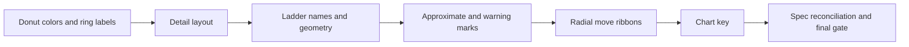

# Divergence detail, chart key, and radial moves

**Document:** `frvt-7-detail-key-radial-execution-plan-1`
**Status:** Implemented
**Audience:** The agent implementing these changes, and the owner reviewing them
**Scope:** The divergence dialog in `frvt/web`: the Details tab layout, stable donut layer colors, a chart key on every tab, and radial move arrows.

Never commit or push. The owner reviews all changes.

---

## How to use this document

Do the phases in order. Each phase lists its work, its tests, and a gate. Do not start a phase until the previous gate passes. The "Locked decisions" section is the contract. Do not invent alternatives.

> **Rule 12.** Phase numbers and other identifiers in this plan must never appear in source code, comments, test names, CSS class names, or runtime strings. Name things for what they do.

## Diagnosis

The inner ring is the four **layers**, not the event types. The engine ([frvt/divergence/taxonomy.py](../frvt/divergence/taxonomy.py)) puts `RENUMBER`, `CHAPTER_MOVE`, `CROSS_BOOK`, `ONE_SIDED`, `MERGE`, `SPLIT`, `ORDER_INVERSION`, and `VERSE0_TITLE` in `scheme` ("Numbering"). These comparisons have no `segment` or `text` events, and `canon` (`BOOK_ONE_SIDED`) only covers whole books. So any chapter you pin really is 100% Numbering. The counts are correct.

The real bug is in `sliceColor` in [frvt/web/src/divergence/Donut.tsx](../frvt/web/src/divergence/Donut.tsx). A layer slice takes its color from its **position** among the slices drawn. So the first visible layer is always purple: Numbering in one selection, and "Books on one side only" when a one-sided book is pinned. Nothing on screen says the inner ring is layers.

**Fix:** give each layer a fixed color by its index in `LAYER_IDS`, and label both rings.

## Locked decisions

- Donut: every layer has a fixed color, and the inner ring is always drawn. A caption under the chart reads `Inner ring: layers. Outer ring: event types.`. The key headings become `Inner ring: layers` and `Outer ring: types`.
- Radial: port the prototype's ribbons exactly: arrowheads that point to the destination, the ribbon stopping 7px short of the destination, width set by verse count, and hover and click. Also give **book moves** (`CROSS_BOOK`) their own color, `BOOK_MOVE = "#5cc8ff"`. Chapter moves and order inversions keep the severity color. Only chapter moves and book moves get arrowheads. This color is used only in the radial chart. Key and caption text use the catalog wording from `TYPE_LABELS`: `Chapter move`, `Cross-book move`, `Order inversion`.
- Radial caption: the chart's draw effect currently runs `select(host).selectAll("*").remove()` on the same element that holds the React-rendered caption, so the caption is deleted on every draw. That is why the screenshot shows none. Draw into a dedicated child element so the caption survives.
- Chart key: six items from the prototype, in one row under the layer toggles, on every tab:
  - Same
  - Less → more chapter deviance
  - Event severity 1 to 4
  - Chapter on one side only
  - Approximate
  - Data warning

  On the Radial tab, add Chapter move, Cross-book move, and Order inversion. Severity 5 is left out because only "Book on one side only" has it, and the hatch item already covers that. The key uses no `title=` attributes.
- Vertical tab labels read bottom to top.
- Detail view background is the dialog surface (`--surface-raised`). Overview and Radial keep `--bg`.

## Rules for every phase

- Orienting doc comment on every new or changed function, interface, field, and module constant.
- No plan, phase, or requirement identifiers in code, comments, tests, CSS, or UI strings.
- Files stay at or under 600 lines, and functions take at most 6 named parameters.
- Tests cover happy paths and essential contracts only.
- Run `npx prettier --write` on new files only.
- **Gate**, after each phase:

  ```bash
  cd frvt/web && export PATH=$HOME/.local/node/bin:$PATH && npx vitest run src/divergence && npm run typecheck && npx eslint src/divergence
  ```

  eslint must report 0 errors. The 6 existing warnings are acceptable. Full `npm run lint` already fails on `src/viewer/columnScroll.ts`, so ignore that file.



---

## Phase 1: Stable donut colors and ring labels

**Files:** [Donut.tsx](../frvt/web/src/divergence/Donut.tsx), [DonutKey.tsx](../frvt/web/src/divergence/DonutKey.tsx), [Donut.test.ts](../frvt/web/src/divergence/Donut.test.ts), [Donut.test.tsx](../frvt/web/src/divergence/Donut.test.tsx), [divergence.css](../frvt/web/src/styles/divergence.css)

**Work:**

- Change `sliceColor` to `sliceColor(key: string, colors: readonly string[]): string`, removing the `position` parameter:
  - A `type-N` key returns `colors[N % colors.length]`.
  - A `layer-<id>` key returns `colors[(LAYER_IDS as readonly string[]).indexOf(id)]`.
  - An unknown key or id (index `-1` or `NaN`) falls back to `colors[0] ?? ""`.
  - Update its doc comment: every layer keeps one color whichever layers are drawn.
- Update `LAYER_COLORS`'s doc: the colors are in `LAYER_IDS` order.
- Update both callers: `ring()` in Donut.tsx and `SliceGroup` in DonutKey.tsx. The `position` argument goes away. Also drop the now-unused `position` parameter from `slices.map` in `SliceGroup`, or eslint flags it.
- Under the `<svg>` in `Donut`, render `<p className="dv-donut-caption">Inner ring: layers. Outer ring: event types.</p>`. Do not render it in the empty state.
- Change the DonutKey group headings to `Inner ring: layers` and `Outer ring: types`.
- CSS: `.dv-donut-caption { margin: 0.25rem 0 0; color: var(--text-muted); font-size: 0.75rem; text-align: center; }`.

**Tests:**

- `Donut.test.ts`:
  - Replace the positional layer assertions with `sliceColor("layer-canon", LAYER_COLORS) === LAYER_COLORS[3]`.
  - Assert `sliceColor("layer-text", LAYER_COLORS) === LAYER_COLORS[2]`.
  - Keep the type assertions, without the middle argument.
- `Donut.test.tsx`: update the `sliceColor` calls, and assert the caption text in one existing render test.

**Gate:** as above.

---

## Phase 2: Detail layout

**Files:** [DivergenceDialog.tsx](../frvt/web/src/divergence/DivergenceDialog.tsx), [DetailView.tsx](../frvt/web/src/divergence/DetailView.tsx), [SideTabs.tsx](../frvt/web/src/divergence/SideTabs.tsx), [divergence.css](../frvt/web/src/styles/divergence.css)

**Work:**

- **Background:**
  - Change the stage element to `className={tab === "detail" ? "dv-stage is-detail" : "dv-stage"}`.
  - CSS: `.dv-stage.is-detail { background: var(--surface-raised); }`.
  - Change the tick halo in `.dv-ladder text.dv-tick` to `stroke: var(--surface-raised)` so it matches the new background.
  - Add `border: 1px solid var(--border); border-radius: 6px;` to `.dv-dot` so the canvas still stands out on the same surface.
- **Toolbar:**
  - Add `--dv-toolbar-inset: 0.75rem` on `.dv-detail-toolbar`, with a comment saying it is both the end padding and the gap between the controls.
  - Use `padding-inline: var(--dv-toolbar-inset); column-gap: var(--dv-toolbar-inset); row-gap: 0.75rem`.
  - `.dv-detail-book { flex: 0 1 28rem; min-width: min(100%, 12rem); }` replaces the old book rule.
  - `.dv-detail-zoom { flex: 1 1 12rem; }`, so the zoom control fills the rest of the row.
  - Keep `.dv-detail-zoom input { width: 100%; }`.
- **Vertical tabs:**
  - In `SideTabs`, wrap each tab's text in `<span className="dv-sidetab-label">{tab.label}</span>`. The button's accessible name does not change. Older Chromium ignores `writing-mode` on a `<button>`, so the rotation goes on the inner span.
  - `.dv-sidetab { padding: 0.75rem 0.35rem; }`, which swaps the padding for the tall shape. Remove `text-align: left`.
  - `.dv-sidetab-label { display: block; writing-mode: vertical-rl; transform: rotate(180deg); white-space: nowrap; }`, with a comment saying that rotating vertical text makes it read bottom to top.
- **Dot-plot panel:**
  - Wrap the magnify label and `DotPlot` in `<div className="dv-dot-panel">`.
  - CSS: `.dv-dot-panel { display: flex; flex-direction: column; align-items: center; gap: 0.5rem; }`.
- **Inline checkbox:**
  - Give the magnify `<label>` `className="dv-check"`.
  - In CSS, change the selector `.modal-body .dv-layer label` to `.modal-body .dv-layer label, .modal-body label.dv-check` so both use the same row layout. Add a one-line comment that `modal.css` stacks form labels by default.

**Tests:** none. These are layout-only changes. Existing tests still find the checkbox by its label text and the tabs by their accessible names.

**Gate:** as above.

---

## Phase 3: Translation names closer to the strip

**Files:** [Ladder.tsx](../frvt/web/src/divergence/Ladder.tsx), [divergence.css](../frvt/web/src/styles/divergence.css)

**Work:**

- Replace the inline geometry with named, documented module constants:

```ts
/** Vertical position of the A, org, and B axes in the strip, top to bottom. */
const AXIS_Y = [24, 122, 220] as const;
/** Gap between an axis line and the ribbon edge that meets it. */
const RIBBON_INSET = 6;
/** Strip height. It leaves room for the B labels under the last axis. */
const LADDER_HEIGHT = 240;
```

- `levels` uses `AXIS_Y`.
- The ribbon band between axis `item` and `item + 1` uses `yTop = AXIS_Y[item] + RIBBON_INSET` and `yBottom = AXIS_Y[item + 1] - RIBBON_INSET`. That is the same shape as today, moved up 20px.
- The SVG height uses `LADDER_HEIGHT`.
- In the JSX, put the place caption (`dv-ladder-place`) **before** the A name, so the order is caption, A name, stage, B name.
- CSS:
  - `.dv-ladder-name { margin: 0; font-size: 0.8rem; }`
  - `.dv-ladder-place { margin: 0 0 0.25rem; }`
  - Remove the shared margin rule both classes use today.

**Tests:** the existing DetailView tests must still pass, including "labels the first chapter on all three axes" and "places the translation names around the strip". The second one checks only that A comes before the stage and B after it, so moving the caption does not break it.

**Gate:** as above.

---

## Phase 4: Approximate and data-warning marks

The key needs these marks drawn where the prototype draws them.

**Files:** [MatrixView.tsx](../frvt/web/src/divergence/MatrixView.tsx), [RadialView.tsx](../frvt/web/src/divergence/RadialView.tsx), [Ladder.tsx](../frvt/web/src/divergence/Ladder.tsx), [model/colors.ts](../frvt/web/src/divergence/model/colors.ts), plus tests.

**Work:**

- Add to `colors.ts`:

```ts
/** Dash pattern for an approximate cell outline. */
export const APPROXIMATE_DASH = "2 1.6";
```

- **Matrix `drawCell`:** when `state.approximate`, append the outline after the hatch and before the warning corner:
  - `rect` at x and y `0.75`, with width and height `MATRIX.cell - 1.5` and `rx` 2.
  - `fill: none`, `stroke: currentColor`, `stroke-width` 1.2, `stroke-dasharray: APPROXIMATE_DASH`.
- **Radial chapter cells:** when `state.warning`, append a tick on the cell's outer edge:
  - `{ ...geo, innerRadius: geo.outerRadius - 1.6 }`, filled with `ACCENT` and `pointer-events: none`.
- **Radial book ring:** when `summary.oneSided`, append the hatch fill (`pointer-events: none`) over the book ring. Add it after the ring's fill and before its transparent click path, so clicks still reach the book.
- **Ladder ribbons:** add a local documented helper:

```ts
/** Outline for a ribbon: a data warning is accent, an approximate run is dashed. Null when neither. */
function ribbonOutline(flags: string): { stroke: string; dash: string | null } | null
```

  - Flag `w` gives `ACCENT`. Flag `a` alone gives `currentColor`. Flag `a` also sets dash `"3 2"`.
  - When the result is not null, set `stroke`, `stroke-dasharray` (only when dash is set), and `stroke-width` 1.
  - `.dv-selected` CSS still wins over these attributes.

**Tests:**

- `DetailView.test.tsx`:
  - Give `renderDetail` an optional `runs` parameter that defaults to the current runs.
  - A run with flags `"a"` renders a `.dv-ladder path` with `stroke-dasharray="3 2"`.
  - A run with flags `"w"` renders a path with `stroke` equal to `ACCENT`.
- New `MatrixView.test.tsx`:
  - Build an index from a one-book report like the DetailView fixture, with one event flagged `["approximate"]`.
  - Render `MatrixView`, then assert that one `rect[stroke-dasharray="2 1.6"]` exists.

**Gate:** as above.

---

## Phase 5: Radial move ribbons

**Files:** new [model/radial.ts](../frvt/web/src/divergence/model/radial.ts) and `model/radial.test.ts`; [RadialView.tsx](../frvt/web/src/divergence/RadialView.tsx); [model/colors.ts](../frvt/web/src/divergence/model/colors.ts); new `RadialView.test.tsx`.

**Work:**

- Add to `colors.ts`:

```ts
/** Ribbon color for a move to another book, so it reads apart from a chapter move. */
export const BOOK_MOVE = "#5cc8ff";
```

- Add `model/radial.ts` with these documented pure helpers:
  - `RIBBON_TYPES = ["CHAPTER_MOVE", "CROSS_BOOK", "ORDER_INVERSION"] as const`, in key order, and `type RibbonType = (typeof RIBBON_TYPES)[number]`.
  - `isRibbonType(type: string): type is RibbonType`, a type guard RadialView uses in place of its inline `includes` list.
  - `RIBBON_LABELS: Record<RibbonType, string>` set to `Chapter move`, `Cross-book move`, and `Order inversion`. This is the catalog wording in `TYPE_LABELS`.
  - `interface RibbonStyle { color: string; arrow: boolean }`, with each field documented.
  - `ribbonStyle(type: RibbonType, severity: number): RibbonStyle`:
    - `CROSS_BOOK` gives `{ color: BOOK_MOVE, arrow: true }`.
    - `CHAPTER_MOVE` gives `{ color: severityColor(severity), arrow: true }`.
    - `ORDER_INVERSION` gives `{ color: severityColor(severity), arrow: false }`.
  - `ribbonWidth(verses: number)` returns `Math.min(4, 0.8 + Math.log2(1 + verses) / 2)`.
  - `ribbonCurve(start, end, arrow)` returns a path string, or `null` when start equals end. Points are `readonly [number, number]`.
    - The control point is `(start + end) * 0.12`.
    - When `arrow` is set, the end moves 7px back toward the control point (`ARROW_GAP_PX = 7`) so the arrowhead stays clear of the sector.
    - Output: `M${sx},${sy} Q${cx},${cy} ${ex},${ey}`.
  - `bookLabelTransform(midAngle: number, radius: number)` returns `{ transform, anchor }`. It converts the angle with `deg = midAngle * 180 / Math.PI - 90` and flips the label when `deg > 90 && deg < 270`, adding `rotate(180)` and anchor `end`. Otherwise the anchor is `start`.
- In RadialView:
  - Fix the missing caption. Render `<div className="dv-radial"><div ref={hostRef} /><p className="dv-caption">…</p></div>`, so the d3 effect only clears the inner div. `host.clientWidth` still reads the full width, because the inner div is a block.
  - Add CSS `.dv-caption { margin: 0.5rem 0 0; color: var(--text-muted); font-size: 0.8rem; }`.
  - Replace `ribbonPath` with a `chapterPoint(units, span, geometry)` helper that returns the point or null, plus `ribbonCurve`.
  - Create an arrow marker the first time each color is needed, kept in a `Map<string, string>` from color to marker id. The id is `${hatchId}-arrow-${n}`.
  - Marker settings, copied from the prototype:
    - `viewBox` `0 0 10 10`, `refX` 8.5, `refY` 5, `markerWidth` and `markerHeight` 9.
    - `markerUnits="userSpaceOnUse"`, `orient="auto"`.
    - Path `M0,1 L9,5 L0,9 L2.6,5 Z`, filled with the ribbon color.
  - Each ribbon gets:
    - `stroke` from `style.color`, `stroke-opacity` 0.55, `stroke-width` from `ribbonWidth(event.n)`.
    - `marker-end` when `style.arrow` is set.
    - `cursor: pointer`.
    - On mouseenter: opacity 1, then `onHover` with the source chapter `{ bookCode: a[0], chapter: a[1], summary: false }` unless pinned.
    - On mouseleave: opacity back to 0.55.
    - On click: `onSelect` with the same selection.
  - Skip a ribbon when `ribbonCurve` returns null.
  - Book codes: use `bookLabelTransform`. Skip the label when `per * radius <= 7`, as the prototype does.
  - Update both caption sentences. Each should also say that chapter and cross-book moves carry an arrowhead pointing to the destination, and that cross-book moves are blue.

**Tests:**

- `model/radial.test.ts`:
  - `ribbonStyle` for the three types: color and arrow.
  - `ribbonCurve` with an arrow ends 7px from `end` (check the distance), and returns null when start equals end.
  - `bookLabelTransform` flips at an angle on the left half and does not flip on the right.
- `RadialView.test.tsx`:
  - Use a two-book fixture (GEN and EXO, each with chapters on both sides) and one `CROSS_BOOK` event from `GEN 1:1` to `EXO 1:1`.
  - Set `types: [{ id: "CROSS_BOOK", severity: 4, layer: "scheme" }]` with type index 0, and `layersOn = new Set(["scheme"])`.
  - Assert that a path with `marker-end` exists, and that the `marker` it references contains a path filled with `BOOK_MOVE`.
  - Assert that the caption text is still in the document after the chart draws. This guards the caption fix.

**Gate:** as above.

---

## Phase 6: Chart key

**Files:** new [ChartKey.tsx](../frvt/web/src/divergence/ChartKey.tsx) and `ChartKey.test.tsx`; [DivergenceDialog.tsx](../frvt/web/src/divergence/DivergenceDialog.tsx); [divergence.css](../frvt/web/src/styles/divergence.css).

**Work:**

- Props: `ChartKeyProps { index: ComparisonIndex; showRibbons: boolean }`, with each field documented.
- Render `<ul className="dv-chart-key" aria-label="Chart key">`. Each `<li>` holds an `aria-hidden` 14px swatch followed by its text:
  1. `Same`: a `NEUTRAL` square.
  2. `Less → more chapter deviance`: a 42px bar with `linear-gradient(90deg, devianceColor(0.05), devianceColor(0.5), devianceColor(1))`.
  3. `Event severity 1 to 4`: four squares, `severityColor(1..4)`.
  4. `Chapter on one side only`: an inline SVG with a `NEUTRAL` rect and the hatch pattern. The pattern id comes from `useId()` with colons removed, as in RadialView.
  5. `Approximate`: a dashed rect with `stroke: currentColor` and `APPROXIMATE_DASH`.
  6. `Data warning`: a `NEUTRAL` rect with the `ACCENT` corner path `M9,0 H14 V5 Z`.
- When `showRibbons` is set, add one item for each entry of `RIBBON_TYPES`, styled with `ribbonStyle(type, severityOf(index, type))`. `severityOf` is in `model/detail.ts`.
  - Swatch: a 20px SVG line in the style color, with an arrowhead polygon when `arrow` is set.
  - Text: `RIBBON_LABELS[type]`.
- Do not use `title=` attributes.
- In DivergenceDialog, render `<ChartKey index={index} showRibbons={tab === "radial"} />` right after the first `.dv-controls`.
- CSS:
  - `.dv-chart-key`: flex, wraps, gap `0.35rem 1rem`, no list style, no margin or padding, `color: var(--text-muted)`, `font-size: 0.8rem`.
  - `.dv-chart-key li`: inline-flex, centered, gap 0.35rem.

**Tests (`ChartKey.test.tsx`):**

- Without ribbons: renders the six item texts and no `Cross-book move`.
- With `showRibbons`: `Chapter move`, `Cross-book move`, and `Order inversion` are present.

**Gate:** as above.

---

## Phase 7: Spec reconciliation and final gate

**Work:**

- In [.spec/frvt-7-execution-plan-1.md](../.spec/frvt-7-execution-plan-1.md):
  - Donut paragraph: each layer has a fixed color, and a caption names the rings.
  - Dialog behavior: the chart key row is shown on every tab, and the Radial tab adds the move items.
  - Radial work line: arrowheads on moves, book moves in their own color, and width by verse count.
  - Book detail bullet: vertical tab labels.
  - Edit only those lines.
- Run `npm test`, `npm run typecheck`, `npx eslint src/divergence`, and `npm run build`.

**Owner visual checklist** (report each item as not yet checked in a browser):

1. The detail background matches the dialog, and tick labels have no dark halos.
2. The translation names are smaller, and each sits right against the strip.
3. The zoom slider fills the row; the gap to the book menu equals the right padding.
4. The tab labels are vertical and read bottom to top.
5. The dot plot and the magnify checkbox are centered, with the checkbox beside its label.
6. The donut caption shows; a pinned one-sided book draws its layer in that layer's own color, not purple.
7. The key row shows on all tabs, and the move items show only on Radial.
8. Radial arrows point to the destination, cross-book moves are blue, the left-side book codes read upright, and the caption shows under the chart.

## Out of scope

- Ribbons in the ladder and the dot plot keep their severity colors.
- The radial chart draws no approximate mark, as in the prototype, so the Approximate key item applies to the overview and the strip.
- A strip run on a hidden layer still shows its warning or approximate outline, as in the prototype, because the outline comes from the run's flags.
- In the rings layout, the book ring still spans one sector per wrapped book.
