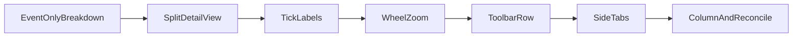

# Divergence detail view refinements: phased execution plan

**Document:** `frvt-7-detail-view-refinements-execution-plan-1`
**Status:** Implemented
**Audience:** The agent implementing these changes, and the owner reviewing them
**Scope:** Six refinements to the divergence dialog in `frvt/web/src/divergence/`. The first matches the prototype's measure. The rest improve the Details tab.

Never commit or push. The owner reviews all changes.

---

## How to use this document

Do the phases in order. Each phase lists its work, its tests, and a gate. Do not start a phase until the previous gate passes. The "Locked decisions" section is the contract. Do not invent alternatives.

> **Rule 12.** Phase numbers and other identifiers in this plan must never appear in source code, comments, test names, CSS class names, or runtime strings. Name things for what they do.

Run this gate command from the repository root for every phase:

```bash
cd frvt/web && npm test && npm run typecheck && npm run lint
```

`npm run lint` already reports one error outside this work, in `src/viewer/columnScroll.ts` (`@typescript-eslint/no-empty-object-type`). Leave it alone. The lint part of the gate means no new errors or warnings in the files this plan touches (`npx eslint src/divergence` must report zero errors).

Code standards for every phase:

- Every new or changed function, component, interface field, and module constant gets an orienting doc comment: why it exists, when to use it, and what it returns. Match the comment style in `model/detail.ts`.
- Keep each source file under 600 lines.
- Keep functions to 6 or fewer named parameters.
- Test happy paths and essential failures only. Do not test CSS, boilerplate, or implementation details.
- This work changes only the web client. There are no backend methods, so the backend logging rule has nothing to apply to.
- The code snippets in this plan show logic only. Add the required doc comments when you copy them.
- Updating a ref during render (`latestRef.current = value`) is the existing repository pattern (see `ModalShell.tsx`), and `react-hooks/refs` is off in `eslint.config.js`. Use that pattern where this plan says to.

---

## Locked decisions

- **Measure.** The prototype (`versification-divergence-views.html`) counts events everywhere: the summary, the layer toggles, the book menu, and the inspector. It has no verse measure and no selector. The donut exists only in the port, and it will count events only. Remove the `Events` / `Verses affected` buttons, the `countVerses` state, and the `countVerses` parameter of `breakdown()`. Nothing else depends on the verse measure. The chapter and book shading in `model/index.ts` uses event verse counts internally, as the prototype does, and does not change.
- **Tick labels.** Label all three strip axes, as the prototype does. Labels for axis A go above its line. Labels for org and B go below their lines. Use the prototype's stride rule, plus a pixel-gap guard so short chapters such as Psalms 117 never overlap. The first chapter of each book is always labeled.
- **Wheel zoom.** A plain mouse wheel over the strip zooms around the pointer, using the same curve as d3-zoom's default (the prototype uses d3-zoom). Pinch on a trackpad arrives as a wheel event with `ctrlKey` set and zooms 10 times faster, as in d3.
  - A plain wheel at zoom 1 or 400 that would go further is not consumed, so the dialog still scrolls. This is the common case, because the strip opens at zoom 1.
  - A `ctrlKey` wheel is always consumed, even at a limit, so pinching past the limit never zooms the whole browser page.
  - A purely horizontal wheel (`deltaY` 0) changes nothing and is not consumed.
- **Zoom control.** Wheel zoom is fractional. The slider keeps `step={1}`, so keyboard arrows still move it by 1. It shows the wheel zoom at the nearest whole step, because the browser rounds the value it displays. The label beside it shows the exact zoom to one decimal below 10. Moving the slider zooms around the center of the window.
- **Toolbar.** The book menu goes on the left and the zoom control on the right, on one row above the strip. Add horizontal padding at both ends and a gap between the two controls. The row wraps on narrow screens.
- **Sub-tabs.** Below the strip, a vertical tab list on the left edge holds `Divergences` (the event table, open by default) and `Dot plot` (the `Magnify offsets` checkbox plus the canvas). The tab buttons are stacked, with horizontal text. Tab state lives in `DetailView` and resets when the Details tab unmounts. The highlighted run is shared, so a selection survives switching tabs.
- **Column width.** The right column (donut, key, and inspector) narrows from `22rem` to `19.8rem`. The donut stays `14rem`, which still fits.

---

## Files

- [frvt/web/src/divergence/breakdown.ts](../frvt/web/src/divergence/breakdown.ts), [breakdown.test.ts](../frvt/web/src/divergence/breakdown.test.ts), [counts.ts](../frvt/web/src/divergence/counts.ts), [layerLabel.ts](../frvt/web/src/divergence/layerLabel.ts), [DivergenceDialog.tsx](../frvt/web/src/divergence/DivergenceDialog.tsx)
- [frvt/web/src/divergence/DetailView.tsx](../frvt/web/src/divergence/DetailView.tsx), [DetailView.test.tsx](../frvt/web/src/divergence/DetailView.test.tsx)
- New: `frvt/web/src/divergence/Ladder.tsx`, `DotPlot.tsx`, `SideTabs.tsx`, `model/ladderTicks.ts`, `model/ladderTicks.test.ts`
- [frvt/web/src/divergence/model/detail.ts](../frvt/web/src/divergence/model/detail.ts), [model/detail.test.ts](../frvt/web/src/divergence/model/detail.test.ts) (already exists; add to it)
- [frvt/web/src/styles/divergence.css](../frvt/web/src/styles/divergence.css)
- [.spec/frvt-7-execution-plan-1.md](../.spec/frvt-7-execution-plan-1.md) (reconciliation only)



---

## Phase 1: Count events only

**Work:**

- `breakdown.ts`: Remove the `countVerses` parameter from `breakdown()` and `typeTotals()`. Each matching event adds `1`. Reword every comment that mentions an event-or-verse measure: the `Slice.value`, `LayerStat`, `LayerStat.count`, and `SelectionStat.count` docs, the `breakdown` doc, and the `typeTotals` doc. Each should say "events".
- `DivergenceDialog.tsx`: Delete the `countVerses` state, the two buttons, and `countVerses` from the `useMemo` call and its dependency list.
- `counts.ts` (the `comparisonTotal` doc) and `layerLabel.ts` (the `LayerCount.count` doc): Reword to say events only.

**Tests:** In `breakdown.test.ts`, drop the fourth argument from every call. The "limits the rings to the pinned book" test now expects `value: 1`. Delete "counts a zero verse total as one when measuring verses".

**Gate:** The gate command passes, and `rg -n "countVerses|Verses affected" frvt/web/src` finds nothing.

---

## Phase 2: Split the detail view (no behavior change)

`DetailView.tsx` is 509 lines and is about to grow. Split it before changing behavior.

**Work:**

- Move the `Ladder` component and `placeCaption` into `Ladder.tsx`. Export `Ladder`.
- Move `DotPlot` and `canvasContext` into `DotPlot.tsx`. Export `DotPlot`.
- Move `severityOf` and the `RunHighlight` interface into `model/detail.ts` and export them. Both components and `DetailView` import them from there.
- Move the module constants with the code that uses them: `LADDER_LEFT`, `LADDER_RIGHT`, and `PAN_SLOP_PX` go to `Ladder.tsx`, and `DOT_HIT_SLOP_PX` goes to `DotPlot.tsx`.
- `formatSpan` stays in `DetailView.tsx`.
- Give each moved component a documented props interface (`LadderProps`, `DotPlotProps`) in place of the inline prop type.
- Do not change markup, class names, or logic.

**Tests:** None new. Existing tests must pass unchanged.

**Gate:** The gate command passes with no edits to any test file.

---

## Phase 3: Readable tick labels on all three axes

**Work:** Create `model/ladderTicks.ts`:

```ts
/** Least horizontal distance between two drawn tick labels, in pixels. Same spacing as the prototype. */
export const MIN_TICK_LABEL_GAP_PX = 34;

/** One chapter tick to draw on a strip axis, in screen pixels. */
export interface TickMark {
  /** Screen x of the tick line. */
  x: number;
  /** Text to draw beside the tick, or null for an unlabeled tick. */
  label: string | null;
  /** First chapter of a book. Drawn longer and always labeled. */
  major: boolean;
}

export function tickMarks(
  axis: LadderAxis,
  visible: readonly [number, number],
  toPx: (verse: number) => number,
  plotWidthPx: number,
): TickMark[] {
  const [start, end] = visible;
  const zoomFactor = axis.length / Math.max(end - start, Number.MIN_VALUE);
  const slots = Math.max(1, plotWidthPx / MIN_TICK_LABEL_GAP_PX);
  const stride = Math.max(1, Math.ceil(axis.ticks.length / slots / zoomFactor));
  const marks: TickMark[] = [];
  let lastLabeled: TickMark | null = null;
  for (const [position, tick] of axis.ticks.entries()) {
    if (tick.x < start || tick.x > end) {
      continue;
    }
    const mark: TickMark = { x: toPx(tick.x), label: null, major: tick.major };
    const crowded = lastLabeled !== null && mark.x - lastLabeled.x < MIN_TICK_LABEL_GAP_PX;
    if (tick.major) {
      if (crowded && lastLabeled !== null && !lastLabeled.major) {
        lastLabeled.label = null;
      }
      mark.label = tick.label;
    } else if (position % stride === 0 && !crowded) {
      mark.label = tick.label;
    }
    if (mark.label !== null) {
      lastLabeled = mark;
    }
    marks.push(mark);
  }
  return marks;
}
```

`position` is the tick's index in the whole axis, not in the visible slice. The doc comment for `tickMarks` must say three things:

- The stride is computed from the whole axis and the zoom, and the same ticks keep their labels while the strip pans.
- A minor label closer than the gap to the previous label is dropped. A major label removes a crowded minor label before it.
- Two crowded major labels are both kept.

In `Ladder.tsx`, change the drawing effect:

1. Draw every ribbon first, then the three axis lines and their ticks, so the labels paint on top. Ribbon geometry, classes, and click handling do not change.
2. For each axis `i`, compute that axis's visible range the same way its scale does: `ladderWindow(axes[i].length, zoom, alignedOrigin(axes[i].length, sideA.length, origin))`. Call `tickMarks(axes[i], range, scales[i], width - LADDER_LEFT - LADDER_RIGHT)`.
3. For each mark, draw a tick line from `y - (major ? 7 : 4)` to `y + (major ? 7 : 4)`, with `stroke-width` of 1.4 for a major tick and 0.8 for a minor one.
4. When a mark has a label, draw `<text class="dv-tick">` at `x + 2`, with `text-anchor="start"`. Its y is `y - 8` for axis A, and `y + 16` for org and B.
5. An axis with no ticks draws only its line. This happens with an empty org map.
6. Reword the `LADDER_LEFT` comment. Labels now start at their tick, so the inset only has to fit the `org` axis name.

Add a halo to `divergence.css` so a label stays legible over a ribbon:

```css
.dv-ladder text.dv-tick {
  paint-order: stroke;
  stroke: var(--bg);
  stroke-width: 3px;
  stroke-linejoin: round;
}
```

**Tests:**

- `model/ladderTicks.test.ts`:
  - Build a `LadderAxis` by hand with a small helper: book `PSA`, 150 chapters of 10 verses, ticks at `x = 11 * (chapter - 1)` labeled `PSA 1`, then `2`, `3`, and so on, with only chapter 1 `major`, and length `1650`. Pass the range `[0, 1650]`, a linear `toPx` onto 0 to 600, and a 600 px plot. Labeled marks are at least `MIN_TICK_LABEL_GAP_PX` apart, and the first label is `PSA 1`.
  - Use the same axis with a range that covers three chapters, mapped onto 600 px. Every mark is labeled.
- `DetailView.test.tsx`: Three `.dv-tick` elements have the text `GEN 1`, one per axis. The existing first-tick assertion must still pass.

**Gate:** The gate command passes.

---

## Phase 4: Wheel zoom and a synced zoom control

**Work in `model/detail.ts`:**

```ts
/** Highest strip zoom. Zoom 1 shows the whole axis. */
export const MAX_LADDER_ZOOM = 400;

/** Zoom factor and first visible verse of the strip. Changed together so a zoom never paints a stale origin. */
export interface LadderView {
  /** Zoom factor from 1 to ``MAX_LADDER_ZOOM``. Fractional after a wheel zoom. */
  zoom: number;
  /** First visible verse on axis A. Ignored at zoom 1. */
  origin: number;
}

export function clampZoom(zoom: number): number {
  return Math.min(MAX_LADDER_ZOOM, Math.max(1, zoom));
}

export function zoomAround(length: number, view: LadderView, nextZoom: number, fraction: number): LadderView {
  const zoom = clampZoom(nextZoom);
  const [start, end] = ladderWindow(length, view.zoom, view.origin);
  const share = Math.min(1, Math.max(0, fraction));
  const anchor = start + share * (end - start);
  return { zoom, origin: ladderWindow(length, zoom, anchor - share * (length / zoom))[0] };
}

export function wheelZoomFactor(deltaY: number, deltaMode: number, ctrlKey: boolean): number {
  const perUnit = deltaMode === 1 ? 0.05 : deltaMode === 0 ? 0.002 : 1;
  return 2 ** (-deltaY * perUnit * (ctrlKey ? 10 : 1));
}
```

Also in `model/detail.ts`:

- Change `ladderWindow` to use `clampZoom` instead of its inline `Math.min(400, Math.max(1, zoom))`.
- `zoomAround` doc: the verse at `fraction` of the plot width stays under the pointer, and the result is clamped inside the axis.
- `wheelZoomFactor` doc: it uses d3-zoom's default wheel curve. A negative `deltaY` zooms in. `deltaMode` 1 is lines and 2 is pages.

**Work in `DetailView.tsx`:**

- Replace the `zoom` and `origin` state with `const [view, setView] = useState<LadderView>({ zoom: 1, origin: 0 })`. On a book change, the existing render-time reset becomes `setView((current) => ({ ...current, origin: 0 }))`.
- Compute the A axis once: `const sideA = useMemo(() => axisFor(index, scoped, "a", (code) => index.byCode.get(code)?.a), [index, scoped])`. Pass it to `Ladder` as `axis`, and remove the copy inside `Ladder`.
- The slider uses `min={1}`, `max={MAX_LADDER_ZOOM}`, `step={1}`, `value={view.zoom}`, and `onChange={(e) => setView((current) => zoomAround(sideA.length, current, Number(e.target.value), 0.5))}`. Keep `step={1}`. Do not use `step="any"`, because browsers handle keyboard steps inconsistently with it.
- The label text is `Zoom {formatZoom(view.zoom)}`. Add a local `formatZoom`: below 10, show one decimal and drop a trailing `.0`, so 1 is `1`, 3.74 is `3.7`, and 9.96 is `10`. At 10 and above, show a whole number.
- Pass `view` and `onView={setView}` to `Ladder`, replacing the `zoom`, `origin`, and `onOrigin` props. Add `axis` and `view` to the drawing effect's dependency list, and remove `sideA`, `zoom`, and `origin` from it.
- Zoom carries over between books, as it does today. Only the origin resets.
- Move the default-book choice (the first book with a visible divergence, else the first book with chapters, else `""`) into a module-level `defaultBook(index, layersOn): string` helper, and compute `bookCode = book ?? defaultBook(index, layersOn)`. Computed inline, `bookCode` triggers the `react-hooks/preserve-manual-memoization` lint error on the `scoped` memo, which the new `sideA` memo depends on. Keep both `useMemo` calls; the React Compiler is not part of the build.

**Work in `Ladder.tsx`:**

- Panning reads zoom and length from `latest.current`, not from the render, and writes the panned view back to `latest.current.view` before calling `onView`. A pointer-down stores `latest.current.view.origin`. Otherwise a wheel zoom during a drag is undone by the next pointer move, which would still be holding the zoom from the last render.
- Add the wheel listener as a native `addEventListener("wheel", handler, { passive: false })` on the stage element, inside a `useEffect` with an empty dependency list. React's `onWheel` is passive and cannot call `preventDefault`.
- Keep `latest = useRef({ view, length: axis.length, onView })` and assign `latest.current` on every render. The handler does the following:
  1. If `e.ctrlKey`, call `preventDefault`, so a pinch never zooms the browser page.
  2. Compute `next = clampZoom(view.zoom * wheelZoomFactor(e.deltaY, e.deltaMode, e.ctrlKey))` from `latest.current.view`.
  3. If `next === view.zoom`, return. A plain wheel at a limit, or a purely horizontal wheel, is then not consumed.
  4. Call `preventDefault`. Compute `fraction = (e.clientX - rect.left - LADDER_LEFT) / (Math.max(320, stage.clientWidth) - LADDER_LEFT - LADDER_RIGHT)`. `zoomAround` clamps it.
  5. Compute `result = zoomAround(length, view, next, fraction)`. Write it to `latest.current.view` immediately so that several wheel events before the next render compound correctly.
  6. If a pan is in progress (`dragRef.current !== null`), rebase it with `dragRef.current = { ...drag, x: e.clientX, origin: result.origin }` so the strip does not jump on the next pointer move.
  7. Call `onView(result)`.
- Remove the listener in the effect cleanup.

**Tests:**

- `model/detail.test.ts`:
  - `zoomAround(1000, { zoom: 1, origin: 0 }, 10, 0.5)` returns origin 450.
  - Zooming from `{ zoom: 10, origin: 450 }` to 20 at fraction 0 keeps origin 450.
  - A next zoom of 1000 clamps to 400.
  - `wheelZoomFactor(-100, 0, false) > 1` and `wheelZoomFactor(100, 0, false) < 1`.
- `DetailView.test.tsx`:
  - `fireEvent.wheel(stage, { deltaY: -1000 })` sets the slider (`getByRole("slider")`) to `4`. The factor is `2 ** 2`, and jsdom reports a zero-size rectangle, so the fraction clamps to 0.
  - At zoom 1, `fireEvent.wheel(stage, { deltaY: 100 })` returns `true` (not prevented) and the slider stays at `1`.
  - The stage is `container.querySelector(".dv-ladder-stage")`.

**Gate:** The gate command passes.

---

## Phase 5: Book and zoom on one row

**Work:**

- In `DetailView.tsx`, wrap the two labels in `<div className="dv-detail-toolbar">`, with the book label first. Give the book label `className="dv-detail-book"` and the zoom label `className="dv-detail-zoom"`.
- Add to `divergence.css`. The `.modal-body` prefix is required to override `.modal-body label` in `modal.css`, as `.modal-body .dv-layer label` already does.

```css
.dv-detail-toolbar {
  display: flex;
  flex-wrap: wrap;
  align-items: flex-end;
  justify-content: space-between;
  gap: 0.75rem 2rem;
  padding-inline: 0.75rem;
}

.modal-body .dv-detail-toolbar label {
  margin-bottom: 0;
}

.dv-detail-book {
  flex: 1 1 16rem;
  max-width: 28rem;
}

.dv-detail-zoom {
  flex: 0 1 16rem;
}

.dv-detail-zoom input {
  width: 100%;
}
```

**Tests:** None. This is layout only.

**Gate:** The gate command passes.

---

## Phase 6: Vertical sub-tabs for the table and the dot plot

**Work:** Create `SideTabs.tsx`, a reusable vertical tab list:

- Props: `tabs: readonly { id: T; label: string }[]`, `selected: T`, `onSelect: (id: T) => void`, `label: string` (the tablist's accessible name), and `children` (the selected panel). `T extends string`.
- Get ids from `useId()`.
- Markup:
  - `div.dv-sidetabs` contains `div[role=tablist][aria-orientation=vertical].dv-sidetabs-list` and `div[role=tabpanel].dv-sidetabs-panel`.
  - Each tab is `<button type="button" role="tab" className="btn dv-sidetab">` with `aria-selected`, `aria-controls` set to the panel id, and `tabIndex` 0 when selected and -1 otherwise.
  - The panel has `aria-labelledby` set to the selected tab's id.
- ArrowDown and ArrowUp on the tablist select the next or previous tab, wrapping at the ends, call `preventDefault` so the dialog does not scroll, and move focus to the new tab. Use a ref array for the buttons. Other keys pass through. The dialog's own arrow-key handler on `.dv-stage` already ignores keys outside the Overview tab.
- Every prop and the component get orienting doc comments. `SideTabs` knows nothing about the divergence data, so it stays reusable.

In `DetailView.tsx`:

- Add `const [panel, setPanel] = useState<"events" | "dot">("events")`.
- Below `Ladder`, render `SideTabs` with the label `Book detail views` and the tabs `Divergences` (`events`) and `Dot plot` (`dot`).
- The events panel holds the existing table. The dot panel holds the `Magnify offsets` label and `DotPlot`. Only the selected panel is mounted.
- Update the `DetailView` doc comment to describe the toolbar, the strip, and the two tabs.

CSS:

```css
.dv-sidetabs {
  display: grid;
  grid-template-columns: auto minmax(0, 1fr);
  gap: 0.75rem;
  align-items: start;
}

.dv-sidetabs-list {
  display: flex;
  flex-direction: column;
  gap: 0.25rem;
}

.dv-sidetab {
  text-align: left;
  white-space: nowrap;
}

.dv-sidetab[aria-selected="true"] {
  border-color: var(--dv-accent);
}
```

**Tests:**

- `DetailView.test.tsx`:
  - By default the table row `GEN 1:1` is present and `.dv-dot` is absent.
  - After clicking the `Dot plot` tab, `.dv-dot` and the `Magnify offsets` checkbox are present and the table is absent.
  - Select row 1, switch to `Dot plot` and back, and the row is still `aria-selected="true"`.
- Add one `SideTabs` assertion to the same file: `fireEvent.keyDown` with `ArrowDown` on the selected tab selects `Dot plot`.
- Query the tabs with `getByRole("tab", { name: "Dot plot" })`. The existing row and ribbon tests keep passing, because `Divergences` is the default.

**Gate:** The gate command passes.

---

## Phase 7: Column width, spec reconciliation, and final gates

**Work:**

- In `divergence.css`, change `.dv-layout` from `grid-template-columns: minmax(0, 1fr) 22rem` to `minmax(0, 1fr) 19.8rem`.
- In `.spec/frvt-7-execution-plan-1.md`, edit these six places only:
  - The Breakdown row in the decisions table: drop "Events / Verses toggle" and say the donut counts events.
  - The layer-toggle percent paragraph: say "share of events in all layers", and drop "under the current donut measure".
  - The donut paragraph: remove the `Events` / `Verses affected` control sentences.
  - The donut phase's Work line: remove "Add the Events / Verses toggle."
  - The `Book detail:` style bullet: say the book menu and zoom share one row; the strip zooms with the slider or the mouse wheel; and the event table (`Divergences`, the default) and the dot plot sit on vertical tabs under the strip.
  - The radial and book detail phase's Work line: after "Zoom is a controlled range input from 1 to 400", add that the mouse wheel over the strip also zooms and the slider follows it.

**Owner visual checklist.** The agent lists these items in its final report but does not claim them.

1. Psalms at zoom 1: labels do not overlap on any of the three axes.
2. The mouse wheel zooms around the pointer, and the slider and its label follow.
3. At zoom 1, scrolling down over the strip scrolls the dialog.
4. Pinching past zoom 400 does not zoom the browser page.
5. Keyboard arrows on the focused slider still change the zoom by 1.
6. Book menu on the left and zoom on the right, with padding at both ends.
7. The vertical tabs sit directly under the strip, and a selected row stays selected after a round trip through `Dot plot`.
8. The right column is visibly narrower.

**Gate:** The gate command passes, and `rg -n "countVerses|Verses affected|Events / Verses" frvt/web/src .spec/frvt-7-execution-plan-1.md` finds nothing.
