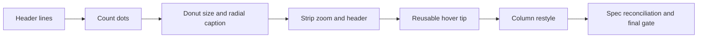
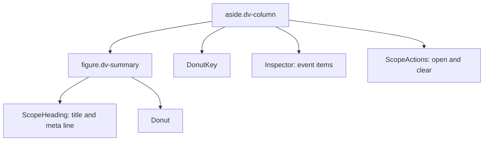

# Divergence dialog: header, column, and view polish

**Document:** `frvt-7-header-column-polish-execution-plan-1`
**Status:** Implemented
**Audience:** The agent implementing these changes, and the owner reviewing them
**Scope:** The divergence dialog in `frvt/web/src/divergence/`, its styles in `frvt/web/src/styles/`, and the launcher in `frvt/web/src/viewer/ViewerHeaderControls.tsx`. No backend change.

Never commit or push. The owner reviews all changes.

---

## How to use this document

Do the phases in order. Each phase lists its files, its work, its tests, and a gate. Do not start a phase until the previous gate passes. The "Locked decisions" section is the contract. Do not invent alternatives. When this plan gives exact text in quotes, use that text.

> **Rule 12.** Phase numbers and other identifiers in this plan must never appear in source code, comments, test names, CSS class names, or runtime strings. Name things for what they do.

The prototype is at `/mnt/hgfs/files/versification-prototype/viewer-template.html`. Its column styles are the `aside` rules near line 74, and its column markup is `inspect` and `evItem` near line 446.

**Web gate**, after every phase:

```bash
cd frvt/web && export PATH=$HOME/.local/node/bin:$PATH && npx vitest run src/divergence && npm run typecheck && npx eslint src/divergence src/viewer/ViewerHeaderControls.tsx
```

eslint must report 0 errors in those paths. Existing warnings are acceptable, but add none. If full `npm run lint` fails, it fails on files this plan does not touch. Leave those files alone.

## Rules for every phase

- Every new or changed function, component, hook, interface, interface field, and module constant gets an orienting doc comment: why it exists, when to use it, and what it returns or throws. Match the style in `model/detail.ts`. Where a snippet in this plan already has doc comments, copy them as written. Where it shows logic only, add the doc comments yourself. Update any existing doc comment that the change makes wrong.
- Files stay under 600 lines. Functions take at most 6 named parameters.
- Tests cover happy paths and essential contracts only. Do not test CSS or markup structure for its own sake.
- This work changes no backend method, so the backend logging rule has nothing to apply to.
- Run `npx prettier --write` on new files only.
- Do not add a `title` attribute anywhere inside the dialog. The main spec (`.spec/frvt-7-execution-plan-1.md`, "Dialog behavior" and the help-text phase) allows native `title` tips only outside `.dv-root`. Tips inside the dialog use `InfoTip` (click) or the `HoverTip` added here (hover).
- `.spec/frvt-7-prototype-parity-execution-plan-1.md` is a finished record. Some of its locked decisions (dot color, note line, buttons on the title row) are replaced here. Do not edit that file.

---

## Findings that shape this plan

1. **The header lines.** `DivergenceDialog` renders `pairLabel` (`ASV (versification: default) → ...`) and `noteLine(...)` (`Texts mode. ... Loader warnings: ...`) above the summary sentence. Removing both leaves `pairHeading.ts`, `noteLine`, `displayNote`, and `legacyFidelitySentence` unused. They and their tests are deleted. The engine still emits `note`, and `Comparison.note` stays in `types.ts` because it is wire format.
2. **The count dots.** The prototype and the repo both draw a small dot for 2 to 4 events and a larger one for 5 or more. The visible difference is color: the repo's `countDotColor` puts a light dot on dark cells, so the repo shows dark and white dots. The owner chose one dark color on every cell, with the two sizes kept.
3. **The column layout.** In `.dv-refs`, the label column is `auto`, so a long translation name such as `American Standard Version of 1901 [eng] ASV` fills the column and each reference wraps onto three lines. The prototype's labels are short scheme ids. The owner chose to cut long names with an ellipsis and show the full name in a hover tip.
4. **The donut already has a delayed hover tip.** `Donut.tsx` owns a 250ms timer, a fixed-position tip, and cleanup. The side-name tip needs the same behavior, so that logic moves into a reusable hook and component first, with the existing `Donut.test.tsx` as the safety net.
5. **The zoom limit.** `MAX_LADDER_ZOOM` in `model/detail.ts` feeds both the slider's `max` and `clampZoom`, which the mouse wheel uses. Changing that one constant limits both. The `Math.min(400, ...)` in `model/dotPlot.ts` is the dot-plot magnification, not the strip zoom. Leave it alone.

---

## Locked decisions

- **Header.** Remove the pair-label line and the note line (mode, source notes, and loader warnings). The summary sentence, or `These versifications agree verse for verse.`, stays as the first line under the dialog title.
- **Count dots.** Every count dot is filled with `PAPER` (`#15181e`) through a new `COUNT_DOT` constant. Radius rules stay: 1.5 for 2 to 4 events, 2.3 for 5 or more.
- **Donut.** 20% less area: `.dv-donut` goes from `14rem` to `12.5rem` square (14 × √0.8 ≈ 12.52). The SVG `viewBox` and ring radii do not change, so the chart scales as a whole.
- **Radial caption.** Remove the caption paragraph for both layouts (`Each book gets an equal sector...` and `Long books wrap into several sectors...`).
- **Zoom.** The strip zooms from 1 to 100, with the slider and with the mouse wheel.
- **Strip header text.** The range label (for example `Genesis 27–28`) uses the same style as the translation names above and below the strip: `0.8rem`, the normal text color, no margin. The muted color and `0.85rem` go away.
- **Strip header spacing.** `0.5rem` of space above the row that holds the range label and the side A name, so it sits apart from the book menu and the zoom slider.
- **Column panel.** The column (`<aside>`) is a bordered panel like the prototype: `var(--bg)` background, `1px solid var(--border)`, `8px` radius, `0.875rem 1rem` padding. The dialog itself is `var(--surface-raised)`, so `var(--bg)` (the Overview and Radial chart color) makes the panel stand out, as the prototype's panels do.
- **Column title.** The `h2` uses `650 1.125rem/1.2 var(--font-serif)`, the prototype's `aside h2`. This applies to the centered comparison title too.
- **Column text sizes.** Meta line and references are `0.8125rem` (the prototype's 13px). The meta line has `0.625rem` below it.
- **Column buttons.** The `Details` and `Clear` buttons leave the title row. Under the event list, a new `ScopeActions` row shows `Open {CODE} in book detail` (for example `Open GEN in book detail`, class `btn primary`) and `Clear selection` (class `btn ghost`). The handlers are the ones `ScopeHeading` receives today. Visibility, as in the prototype:
  - `Open {CODE} in book detail` shows whenever the heading names a book, hovered or pinned, except on the Details tab.
  - `Clear selection` shows only while something is pinned. This is a change: today `Clear` also shows for a hover.
  - When neither button would show, including when nothing is selected, the row is not rendered at all.
- **Long side names.** In each event's reference list, the side A and side B labels are capped at `9rem` and cut with an ellipsis. Hovering a label shows its full name in a `HoverTip` after the same 250ms delay as the donut. `org`, `Verses`, and `Segments` labels do not get a tip. The label always carries the full text in the DOM, so screen readers read the whole name.
- **Hover tip placement.** The tip renders in place with `position: fixed`, as the donut tip does today. Do not portal it to `document.body`.



---

## Phase 1: Remove the header lines

**Files:** [DivergenceDialog.tsx](../frvt/web/src/divergence/DivergenceDialog.tsx), [ViewerHeaderControls.tsx](../frvt/web/src/viewer/ViewerHeaderControls.tsx), [summaryText.ts](../frvt/web/src/divergence/summaryText.ts), [summaryText.test.ts](../frvt/web/src/divergence/summaryText.test.ts), [help.ts](../frvt/web/src/divergence/help.ts), [breakdown.test.ts](../frvt/web/src/divergence/breakdown.test.ts). Delete: `pairHeading.ts`, `pairHeading.test.ts`.

**Work:**

- `DivergenceDialog.tsx`:
  - Delete `pairLabel` from `DivergenceDialogProps` (with its doc comment) and from the destructured parameters.
  - Delete `<p className="dv-note">{pairLabel}</p>` and `<p className="dv-note dv-muted">{noteLine(comparison, report.sides)}</p>`.
  - Delete the `noteLine` import.
  - In the component doc comment, delete the sentence `The line under the title names those translations and the versification each column uses.`
- `ViewerHeaderControls.tsx`: delete the `pairLabel={pairHeading(...)}` prop, the `headingSide` function, and the `pairHeading` / `PairSide` import.
- Delete `pairHeading.ts` and `pairHeading.test.ts`.
- `summaryText.ts`: delete `noteLine` and its doc comment, the `displayNote` import, and the `Comparison, DivergenceReport` type import if nothing else uses it.
- `summaryText.test.ts`: delete the `noteLine` describe block and its import. Keep the fixture as it is.
- `help.ts`: delete `legacyFidelitySentence` and `displayNote` with their doc comments.
- `breakdown.test.ts`: delete the `displayNote` describe block. Change the import to `import { dataWarningTip } from "./help";`.
- Keep the `.dv-note` and `.dv-muted` CSS rules. The agree line and the column still use them.

**Tests:** None new. Only deletions.

**Gate:** Web gate, and `rg -n "pairHeading|pairLabel|noteLine|displayNote|legacyFidelitySentence" frvt/web/src` finds nothing.

---

## Phase 2: One color for count dots

**Files:** [model/colors.ts](../frvt/web/src/divergence/model/colors.ts), [MatrixView.tsx](../frvt/web/src/divergence/MatrixView.tsx), [MatrixView.test.tsx](../frvt/web/src/divergence/MatrixView.test.tsx)

**Work:**

- `colors.ts`:
  - Delete `countDotColor` and `INK`. Nothing else uses them.
  - Change the d3 import to `import { interpolateCividis, interpolateRdYlGn } from "d3";`.
  - Add, after `PAPER`:

```ts
/**
 * Fill for every count dot in the matrix.
 * One dark color on every cell, as in the prototype, so the dot reads as a single kind of mark.
 */
export const COUNT_DOT = PAPER;
```

- `MatrixView.tsx`: import `COUNT_DOT` instead of `countDotColor`, and set the circle's fill with `.attr("fill", COUNT_DOT)`. The `fill` variable still paints the cell rectangle.
- Leave `countDotRadius` in `model/index.ts` unchanged.

**Tests (`MatrixView.test.tsx`):**

- Add `draws the count dot in the dark color on a red cell`:

```tsx
const { container } = renderMatrix({
  ...report,
  comparisons: [
    {
      ...comparison(),
      books: [{ code: "GEN", name: "Genesis", section: "OT", a: [2], b: [2] }],
      events: [approximate, approximate],
    },
  ],
});
const dots = [...container.querySelectorAll("circle")];
expect(dots).toHaveLength(2);
expect(dots.every((dot) => dot.getAttribute("fill") === COUNT_DOT)).toBe(true);
```

  Each event covers 2 verses of a 2-verse chapter, so the chapter cell and the book cell have deviance 0.85 and are red. The old rule would have drawn a light dot there. Import `COUNT_DOT` next to `ACCENT` from `./model/colors`.

**Gate:** Web gate, and `rg -n "countDotColor|\bINK\b" frvt/web/src` finds nothing.

---

## Phase 3: Donut size and radial caption

**Files:** [divergence.css](../frvt/web/src/styles/divergence.css), [RadialView.tsx](../frvt/web/src/divergence/RadialView.tsx), [RadialView.test.tsx](../frvt/web/src/divergence/RadialView.test.tsx)

**Work:**

- `divergence.css`: in `.dv-donut`, change `width: 14rem;` and `height: 14rem;` to `12.5rem`.
- `RadialView.tsx`: delete the `<p className="dv-caption">...</p>` element. The component returns `<div className="dv-radial"><div ref={hostRef} /></div>`. Keep the `.dv-caption` CSS rule, because `Ladder` and `DotPlot` still use it.
- `RadialView.test.tsx`: rename `draws a cross-book move as a blue arrow and keeps the caption` to `draws a cross-book move as a blue arrow`. Delete its `cross-book moves are blue` assertion. Drop `screen` from the import if nothing else uses it.

**Gate:** Web gate, and `rg -n "equal sector|Long books wrap" frvt/web/src` finds nothing.

---

## Phase 4: Strip zoom limit and strip header

**Files:** [model/detail.ts](../frvt/web/src/divergence/model/detail.ts), [model/detail.test.ts](../frvt/web/src/divergence/model/detail.test.ts), [model/index.test.ts](../frvt/web/src/divergence/model/index.test.ts), [Ladder.tsx](../frvt/web/src/divergence/Ladder.tsx), [divergence.css](../frvt/web/src/styles/divergence.css)

**Work:**

- `model/detail.ts`:
  - `export const MAX_LADDER_ZOOM = 100;`
  - In the `ladderWindow` doc comment, replace `Zoom 400 shows one four-hundredth of it.` with `The highest zoom, MAX_LADDER_ZOOM, shows one hundredth of it.`
- `Ladder.tsx`: in the `Ladder` doc comment, replace `Zoom 400 shows a thin window.` with `The highest zoom, MAX_LADDER_ZOOM, shows one hundredth of the book.`
- Nothing else changes for the zoom. `DetailView` already passes `MAX_LADDER_ZOOM` to the slider, and the wheel goes through `clampZoom`. Do not touch `Math.min(400, ...)` in `model/dotPlot.ts`.
- `divergence.css`, strip header:
  - In `.dv-ladder-head`, change `margin: 0 0 0.25rem;` to `margin: 0.5rem 0 0.25rem;`.
  - Replace the `.dv-ladder-name` rule and the `.dv-ladder-place` rule with:

```css
.dv-ladder-place,
.dv-ladder-name {
  margin: 0;
  font-size: 0.8rem;
}

.dv-ladder-name {
  text-align: right;
}
```

  Keep `.dv-ladder > .dv-ladder-name { padding-right: 14px; }` and its comment as they are.

**Tests:**

- `model/index.test.ts`: rename `shows the whole axis at zoom 1 and a 400th of it at zoom 400` to `shows the whole axis at zoom 1 and a hundredth of it at the highest zoom`. Keep `ladderWindow(800, 1)` → `[0, 800]`. Replace the second assertion with `ladderWindow(800, 100)` → `[0, 8]` and `ladderWindow(800, 400)` → `[0, 8]`, which shows that a larger zoom is held at the limit.
- `model/detail.test.ts`: in the `zoomAround` test, change `.toBe(400)` to `.toBe(100)`.
- `DetailView.test.tsx` needs no change. Its wheel tests stay under zoom 16.

**Gate:** Web gate, and `rg -n "Zoom 400|MAX_LADDER_ZOOM = 400" frvt/web/src` finds nothing.

---

## Phase 5: Reusable hover tip (no behavior change)

**Files:** [Donut.tsx](../frvt/web/src/divergence/Donut.tsx), [divergence.css](../frvt/web/src/styles/divergence.css). New: `useHoverTip.ts`, `HoverTip.tsx`, both in `frvt/web/src/divergence/`.

The hook and the components live in separate files so that `react-refresh/only-export-components` stays quiet.

**Work:**

- `useHoverTip.ts`, the timer and the tip state moved out of `Donut`:

```ts
import { useCallback, useEffect, useRef, useState } from "react";

/**
 * Wait before a hover tip appears.
 * A native title waits about 500ms, and that wait cannot be changed. This is half of it.
 */
const HOVER_TIP_DELAY_MS = 250;

/** Pixels between the pointer and the tip, so the tip does not cover what it describes. */
const HOVER_TIP_OFFSET_PX = 12;

/** An open hover tip and where it sits in the viewport. */
export interface HoverTipState {
  /** Sentence shown beside the pointer. */
  text: string;
  /** Horizontal viewport position, already offset from the pointer. */
  x: number;
  /** Vertical viewport position, already offset from the pointer. */
  y: number;
}

/** What ``useHoverTip`` hands to the component that owns the tip. */
export interface HoverTipControls {
  /** The open tip, or null while none is shown. */
  tip: HoverTipState | null;
  /** Arm a tip for ``text`` at a pointer position. It opens after the delay. */
  show: (text: string, x: number, y: number) => void;
  /** Cancel a pending tip and close an open one. */
  hide: () => void;
}

/**
 * Delayed pointer tip shared by the donut slices and the column's side names.
 * Use it where a native ``title`` is not allowed, which is everywhere inside the dialog.
 * ``show`` and ``hide`` keep their identity across renders, so they are safe effect
 * dependencies. A pending timer is cleared on unmount. Render ``tip`` with ``HoverTipBody``.
 */
export function useHoverTip(): HoverTipControls {
  const [tip, setTip] = useState<HoverTipState | null>(null);
  const timer = useRef<ReturnType<typeof setTimeout> | null>(null);
  const cancel = useCallback(() => {
    if (timer.current !== null) {
      clearTimeout(timer.current);
      timer.current = null;
    }
  }, []);
  const hide = useCallback(() => {
    cancel();
    setTip(null);
  }, [cancel]);
  const show = useCallback(
    (text: string, x: number, y: number) => {
      hide();
      timer.current = setTimeout(() => {
        timer.current = null;
        setTip({ text, x: x + HOVER_TIP_OFFSET_PX, y: y + HOVER_TIP_OFFSET_PX });
      }, HOVER_TIP_DELAY_MS);
    },
    [hide],
  );
  useEffect(() => cancel, [cancel]);
  return { tip, show, hide };
}
```

- `HoverTip.tsx`:

```tsx
import type { ReactNode } from "react";
import { useHoverTip, type HoverTipState } from "./useHoverTip";

/**
 * Tip box for a ``useHoverTip`` state, or nothing while the tip is closed.
 * It renders in place with ``position: fixed``, so a clipping ancestor such as a
 * truncated label does not cut it off, and it stays inside the dialog's stacking context.
 */
export function HoverTipBody({ tip }: { tip: HoverTipState | null }) {
  if (tip === null) {
    return null;
  }
  return (
    <span className="dv-hover-tip" role="tooltip" style={{ left: tip.x, top: tip.y }}>
      {tip.text}
    </span>
  );
}

/** Props for inline content that shows a delayed tip on hover. */
export interface HoverTipProps {
  /** Full text shown in the tip. */
  text: string;
  /** Visible content the pointer hovers. */
  children: ReactNode;
}

/**
 * Inline wrapper that shows ``text`` in a tip after the pointer rests on ``children``.
 * Use it for content cut short on screen, such as a long translation name.
 * Leaving the content cancels or closes the tip.
 */
export function HoverTip({ text, children }: HoverTipProps) {
  const { tip, show, hide } = useHoverTip();
  return (
    <span
      onPointerEnter={(event) => show(text, event.clientX, event.clientY)}
      onPointerLeave={hide}
    >
      {children}
      <HoverTipBody tip={tip} />
    </span>
  );
}
```

  The tip body is a `span`, not a `div`, because `HoverTip` is used inside inline and `dt` content.

- `Donut.tsx`:
  - Delete `SLICE_TIP_DELAY_MS`, `SLICE_TIP_OFFSET_PX`, the `HoverTip` interface, the `timer` ref, the `hover` state, the local `hide`, and `arm`. The local `HoverTip` interface must go, or its name will clash with the new `HoverTip` component.
  - At the top of the component: `const { tip, show, hide } = useHoverTip();`, then `useEffect(() => { hide(); }, [hide, layers, types, scope, locale]);`. Both stay above the early `return` for an empty chart.
  - Each slice path calls `show(item.tip, event.clientX, event.clientY)` on `onPointerEnter` and `hide` on `onPointerLeave`.
  - Replace the `{hover !== null && (<div className="dv-slice-tip" ...>)}` block with `<HoverTipBody tip={tip} />`.
  - Update the React import to what is still used.
- `divergence.css`: rename `.dv-slice-tip` to `.dv-hover-tip`, and add `white-space: normal;` so a tip inside a no-wrap label still wraps.

**Tests:** None new. The three existing `Donut slice tip` tests must pass unchanged. They cover the delay, leaving early, and dropping a stale tip.

**Gate:** Web gate, and `rg -n "dv-slice-tip|SLICE_TIP" frvt/web/src` finds nothing.

---

## Phase 6: Column restyle

**Files:** [ScopeHeading.tsx](../frvt/web/src/divergence/ScopeHeading.tsx), [ScopeHeading.test.tsx](../frvt/web/src/divergence/ScopeHeading.test.tsx), [Inspector.tsx](../frvt/web/src/divergence/Inspector.tsx), [Inspector.test.tsx](../frvt/web/src/divergence/Inspector.test.tsx), [DivergenceDialog.tsx](../frvt/web/src/divergence/DivergenceDialog.tsx), [divergence.css](../frvt/web/src/styles/divergence.css), [divergence-events.css](../frvt/web/src/styles/divergence-events.css). New: `ScopeActions.tsx`, `ScopeActions.test.tsx`.



**Work in `ScopeHeading.tsx`:**

- `ScopeHeadingProps` keeps only `title`, `subtitle?: string | null`, and `centered`. Delete `bookCode`, `onOpenBook`, `onClear`, and `showDetails`.
- Add the return type of `scopeHeading`:

```ts
/** Everything the column needs to describe the hovered or pinned scope. */
export interface ScopeHeadingModel {
  /** Book or chapter name, the event's catalog label, or the whole-comparison title. */
  title: string;
  /** Meta line under the title, or null when nothing is selected. */
  subtitle: string | null;
  /** True for the comparison title, which is centered. */
  centered: boolean;
  /** Book the column describes, or null when nothing is selected. ``ScopeActions`` reads it. */
  bookCode: string | null;
}
```

- `scopeHeading(...)` returns `ScopeHeadingModel`. Its logic does not change.
- `ScopeHeading` renders `<header className={...}><h2>{title}</h2></header>` and the meta line as today. Delete the actions `div`. Update the doc comments on the props and the component so they no longer mention Details or Clear.

**Work in `ScopeActions.tsx`:**

```tsx
/** Props for the buttons under the column's event list. */
export interface ScopeActionsProps {
  /** Book the column describes, from ``scopeHeading``. Null when nothing is selected. */
  bookCode: string | null;
  /** True while a selection is pinned. Only a pin can be cleared. */
  pinned: boolean;
  /**
   * When false, the book detail button is hidden.
   * The Details tab passes false because that tab is already open.
   */
  showDetails?: boolean;
  /** Opens the Details tab for the selected book. */
  onOpenBook: (code: string) => void;
  /** Clears the hover, the pin, the keyboard focus, and the strip highlight. */
  onClear: () => void;
}

/**
 * Buttons under the event list, as in the prototype.
 * The book detail button shows for a hovered or pinned book unless the Details tab is open.
 * Clear selection shows only while a selection is pinned. When neither applies, the row is not rendered.
 */
export function ScopeActions({
  bookCode,
  pinned,
  showDetails = true,
  onOpenBook,
  onClear,
}: ScopeActionsProps) {
  if (bookCode === null || (!showDetails && !pinned)) {
    return null;
  }
  return (
    <div className="dv-scope-actions">
      {showDetails && (
        <button type="button" className="btn primary" onClick={() => onOpenBook(bookCode)}>
          {`Open ${bookCode} in book detail`}
        </button>
      )}
      {pinned && (
        <button type="button" className="btn ghost" onClick={onClear}>
          Clear selection
        </button>
      )}
    </div>
  );
}
```

The early return narrows `bookCode` to `string` for the click handler. Do not add a non-null assertion.

A pin whose book the index does not know gives `bookCode: null` (the centered comparison title), so no buttons show. Escape still clears that pin, as it does today.

**Work in `Inspector.tsx`:**

- In `EventItem`, wrap the two side labels:

```tsx
<dt>
  <HoverTip text={sideNames.a}>{sideNames.a}</HoverTip>
</dt>
```

  The same for `sideNames.b`. The `org`, `Verses`, and `Segments` labels stay plain. Update the `EventItem` doc comment: a long side name is cut with an ellipsis, and hovering it shows the full name.

**Work in `DivergenceDialog.tsx`:**

- Before the `return`, compute the heading once:

```ts
const heading =
  index === null || chart === null || comparison === undefined
    ? null
    : scopeHeading(shown, index, comparisonTotal(chart.layerStats), { a: comparison.a, b: comparison.b }, layerSet);
```

  Put it after `const shown = pin ?? hover;` and after the last hook (`pickEventFromTable`). It is a plain call, not a hook, so this does not change hook order. Add `heading !== null &&` to the guard that renders the loaded dialog, after `index !== null`.
- The column becomes:

```tsx
<aside className="dv-column">
  <figure className="dv-summary">
    <ScopeHeading title={heading.title} subtitle={heading.subtitle} centered={heading.centered} />
    <Donut ... unchanged ... />
  </figure>
  <DonutKey ... unchanged ... />
  <Inspector ... unchanged ... />
  <ScopeActions
    bookCode={heading.bookCode}
    pinned={pin !== null}
    showDetails={tab !== "detail"}
    onOpenBook={/* the onOpenBook handler ScopeHeading has today */}
    onClear={/* the onClear handler ScopeHeading has today */}
  />
</aside>
```

  Move the two handler bodies over unchanged. Pass props by name. Do not spread `heading` into `ScopeHeading`.
- In the `DivergenceDialog` doc comment, after the sentence about the heading, add: `The book detail button sits under the event list, and Clear selection joins it while a selection is pinned.`

**CSS in `divergence.css`:**

- Replace the `.dv-inspector-head`, `.dv-inspector-head.is-centered`, `.dv-inspector-head.is-centered h2`, and `.dv-inspector-head h2` rules with:

```css
.dv-inspector-head {
  align-self: stretch;
  margin: 0 0 0.25rem;
}

.dv-inspector-head h2 {
  margin: 0;
  font: 650 1.125rem/1.2 var(--font-serif);
}

.dv-inspector-head.is-centered h2 {
  text-align: center;
}
```

- Delete `.dv-inspector-actions` and `.dv-inspector-actions .btn`, with the comment above the second one.

**CSS in `divergence-events.css`:**

- Change the first-line comment to `/* The selection column, event items, flag chips, and the event table in the divergence dialog. */`.
- Add, before `.dv-scope-meta`:

```css
.dv-column {
  min-width: 0;
  padding: 0.875rem 1rem;
  background: var(--bg);
  border: 1px solid var(--border);
  border-radius: 8px;
}
```

- In `.dv-scope-meta`, change `margin` to `0 0 0.625rem` and `font-size` to `0.8125rem`.
- Add, after `.dv-scope-meta`:

```css
.dv-scope-actions {
  display: flex;
  flex-wrap: wrap;
  gap: 0.4rem;
  margin-top: 0.625rem;
}
```

- Replace the `.dv-refs`, `.dv-refs dt`, and `.dv-refs dd` rules with:

```css
.dv-refs {
  display: grid;
  grid-template-columns: auto minmax(0, 1fr);
  gap: 1px 0.625rem;
  margin: 0.25rem 0 0;
  font-size: 0.8125rem;
}

/* The cap keeps a long translation name from pushing the references onto several lines. */
.dv-refs dt {
  max-width: 9rem;
  overflow: hidden;
  color: var(--text-muted);
  text-overflow: ellipsis;
  white-space: nowrap;
}

.dv-refs dd {
  min-width: 0;
  margin: 0;
  overflow-wrap: anywhere;
}
```

  An `auto` grid track sizes to the label's width, clamped by `max-width`, so short names (`eng`, `org`) keep a narrow label column as in the prototype.

**Tests:**

- `ScopeActions.test.tsx` (move and adapt the two button tests from `ScopeHeading.test.tsx`):
  - `offers book detail and then clear for a pinned book`: with `bookCode="GEN"` and `pinned`, the buttons read `Open GEN in book detail` and `Clear selection`, in that order. Clicking them calls `onOpenBook("GEN")` and `onClear` once each.
  - `offers only book detail for a hovered book`: with `pinned={false}`, `Clear selection` is absent and `Open GEN in book detail` is present.
  - `hides the book detail button while the Details tab is open`: with `pinned` and `showDetails={false}`, only `Clear selection` is present.
  - `renders nothing when no button applies`: with `bookCode={null}` and `pinned`, `expect(container).toBeEmptyDOMElement()`. Also, with `bookCode="GEN"`, `pinned={false}`, and `showDetails={false}`, the container is empty.
- `ScopeHeading.test.tsx`:
  - Delete `puts Details and then Clear on the selected chapter` and `hides Details and keeps Clear while the Details tab is open`.
  - Rename `centers the comparison title and offers no actions` to `centers the comparison title`. Drop its button assertions and the props that no longer exist. Remove the `userEvent` and `vi` imports if they become unused.
  - The `scopeHeading` describe block stays unchanged.
- `Inspector.test.tsx`: add `shows a long side name in full in a hover tip`. Add `act` and `fireEvent` to the `@testing-library/react` import, and `afterEach` and `vi` to the `vitest` import. Call `vi.useFakeTimers()` in the test, and `vi.useRealTimers()` in an `afterEach` inside the `Inspector` describe block. Render the chapter selection with `sideNames={{ a: "American Standard Version of 1901 [eng] ASV", b: "B" }}`. Fire `pointerEnter` on `screen.getByText(thatName)` with `{ clientX: 8, clientY: 16 }`, advance the timers by 250 inside `act`, and assert that `screen.getByRole("tooltip")` has that full name as its text.

**Gate:** Web gate, and:

- `rg -n "dv-inspector-actions" frvt/web/src` finds nothing.
- `rg -n "title=" frvt/web/src/divergence --glob '!*.test.tsx'` finds only `title="Divergence"` in `DivergenceDialog.tsx`.

---

## Phase 7: Spec reconciliation and final gate

**Work:**

- In [.spec/frvt-7-execution-plan-1.md](../.spec/frvt-7-execution-plan-1.md), edit only these places:
  - The `Book detail:` bullet in "Dialog behavior" (around line 486): `zooms from 1 to 400` becomes `zooms from 1 to 100`.
  - The radial and book detail phase's Work line (around line 713): `from 1 to 400` becomes `from 1 to 100`. Its Tests line (around line 715): `zoom 1 and zoom 400` becomes `zoom 1 and the highest zoom`.
  - The dialog phase's Work line (around line 689). Replace this text:

    ```text
    legend, summary, note, provenance line (`engineVersion`, `computedAt`), and the legacy sentence taken from `sides` when fidelity is `legacy`.
    ```

    with:

    ```text
    legend, and summary. The dialog does not show the pair label or the engine note; the note stays in the payload.
    ```

  - The same phase's Tests line (around line 691). Delete this sentence:

    ```text
    A test that the note builder emits the legacy sentence when fidelity is `legacy`.
    ```
  - The overview and inspector phase's Work line (around line 701): `Matrix cells draw count dots` becomes `Matrix cells draw dark count dots`. Append `The column is a bordered panel. Long side names are cut with an ellipsis and shown in full on hover. The book detail button sits under the event list, and Clear selection joins it while a selection is pinned.`
- Run the web gate, then `npm test` and `npm run build` in `frvt/web`.
- Confirm that no touched file is over 600 lines: `wc -l frvt/web/src/divergence/*.ts* frvt/web/src/divergence/model/*.ts frvt/web/src/styles/divergence*.css frvt/web/src/viewer/ViewerHeaderControls.tsx`.
- Confirm that no plan identifier leaked: `rg -n -i "phase|frvt-7" frvt/web/src/divergence frvt/web/src/styles/divergence*.css frvt/web/src/viewer/ViewerHeaderControls.tsx` finds nothing new.
- Set this document's **Status** to `Implemented`.

**Owner visual checklist.** The agent lists these items in its final report, each marked as not yet checked in a browser:

1. No pair-label line and no `Texts mode` line above the summary sentence.
2. The column is a bordered panel with a serif title. A long translation name ends in an ellipsis, each reference fits on one line, and hovering the name shows it in full.
3. `Open GEN in book detail` sits under the event list for a hovered or pinned book. `Clear selection` joins it only while something is pinned. On the Details tab, only `Clear selection` shows, and only for a pin.
4. The donut is visibly smaller (12.5rem) and still centered, and its slice tips still appear after a short delay.
5. Count dots on the Overview are dark on every cell, including red ones.
6. The Radial tab has no caption under the chart in either layout.
7. The zoom slider stops at 100, and the mouse wheel stops there too.
8. The range label above the strip matches the translation names in size and color, and has a small gap under the book menu and the zoom slider.

---

## Out of scope

- The engine's `note` field and `_note` in `frvt/api/divergence/compute.py`. They stay as they are.
- A sticky column, and the prototype's `Nothing selected` title.
- Long translation names in the event table headers and the flag chips.
- The dot-plot magnification cap of 400.
- Keyboard focus for the truncated side names. The label keeps the full name in the DOM, so screen readers read all of it. Making up to 120 labels tab stops would cost more than it helps.
- Closing a hover tip when the column scrolls under a still pointer. The donut tip behaves the same way today.
