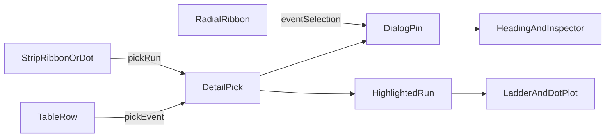

# Divergence dialog: prototype parity

**Document:** `frvt-7-prototype-parity-execution-plan-1`
**Status:** Implemented
**Audience:** The agent implementing these changes, and the owner reviewing them
**Scope:** The divergence dialog in `frvt/web/src/divergence/`, plus one engine test in `frvt/tests/`. It removes the donut caption, tidies the strip header, restyles the selection column to match the prototype, and ports the prototype features the dialog still lacks.

Never commit or push. The owner reviews all changes.

---

## How to use this document

Do the phases in order. Each phase lists its files, its work, its tests, and a gate. Do not start a phase until the previous gate passes. The "Locked decisions" section is the contract. Do not invent alternatives. When this plan gives exact text in quotes, use that text.

> **Rule 12.** Phase numbers and other identifiers in this plan must never appear in source code, comments, test names, CSS class names, or runtime strings. Name things for what they do.

The prototype is at `/mnt/hgfs/files/versification-prototype/viewer-template.html`. Function names cited below (`drawCell`, `inspect`, `evItem`, `renderDetail`, `drawDot`) are in that file. Read the cited function before porting it.

**Web gate**, after every phase:

```bash
cd frvt/web && export PATH=$HOME/.local/node/bin:$PATH && npx vitest run src/divergence && npm run typecheck && npx eslint src/divergence
```

eslint must report 0 errors in `src/divergence`. Existing warnings are acceptable, but add none. Full `npm run lint` already fails on `src/viewer/columnScroll.ts`, so leave that file alone.

**Engine gate**, only where a phase says so:

```bash
cd frvt && .venv/bin/python -m pytest tests/test_divergence_engine.py -q
```

## Rules for every phase

- Every new or changed function, component, interface, interface field, and module constant gets an orienting doc comment: why it exists, when to use it, and what it returns or throws. Match the style in `model/detail.ts`. The snippets in this plan show logic only. Add the doc comments when you copy them.
- Files stay under 600 lines. Functions take at most 6 named parameters. Use a props or options object past that.
- Tests cover happy paths and essential contracts only. Do not test CSS, markup structure for its own sake, or boilerplate.
- This work changes no backend method, so the backend logging rule has nothing to apply to. The one backend change is a test.
- Run `npx prettier --write` on new files only.
- The 600-line limit applies to CSS too. `styles/divergence.css` is 442 lines, so the new column and table styles go in a new `styles/divergence-events.css` (see the column restyle phase).
- Do not create two modules whose names differ only by case (for example `fooBar.ts` and `FooBar.tsx`). They collide on case-insensitive file systems.
- Updating a ref during render (`ref.current = value`) is the existing pattern (see `MatrixView.tsx`). Use it where this plan says to.

---

## Findings that shape this plan

1. **Approximate and data-warning marks already work.** `MatrixView.drawCell`, the radial warning tick, and `Ladder.ribbonOutline` draw them, and tests cover them. None of the 17 reports stored in the local database carries an `approximate` or `dataWarning` flag. Every stored side is loaded from a `.vrs` source, so merges and splits are never approximate. These text pairs also have no unequal ranges, identity collisions, or unanchored verses. The prototype's own eng vs vul has 5 warnings and 0 approximate events. So the marks stay. This plan adds a test that proves the flags reach the payload, and shows the comparison note and loader warnings so a reader can tell when flags are expected.
2. **The chapter-level dots are missing.** The prototype's `drawCell` draws a dot in a cell with 2 or more events, and a bigger dot at 5 or more. The repo's `drawCell` does not.
3. **The comparison note is never shown.** `help.ts` has `displayNote`, and nothing calls it. The prototype shows the note and the loader-warning counts under the summary sentence.
4. **Most text-comparison events have no ladder run.** `BRIDGE` and `SEGMENT` events are appended after runs are built, so no run carries those types. Today a table row for those events cannot be selected. Selecting an event directly, as the prototype does, fixes this.
5. **`model/detail.ts` is 587 lines.** Move the dot-plot helpers out before adding anything to it.

---

## Locked decisions

- **Donut caption.** Remove the `Inner ring: layers. Outer ring: event types.` paragraph and its CSS. The key headings (`Inner ring: layers`, `Outer ring: types`) stay.
- **Strip header.** The visible-chapter caption (for example `1 Samuel 1–31`) sits on the left of the line above the strip, and the side A name sits on the right of that same line. The side B name under the strip is also right-aligned.
- **Column layout.** Keep the title row with `Details` and `Clear`, the donut, and the donut key. Add a muted meta line under the title. Replace the plain numbered list with prototype-style event items: a severity swatch, the catalog label in bold, a muted `, severity N`, an A / org / B / Verses grid, and flag chips. The column is shared by all three tabs, so the restyle applies everywhere.
- **Meta line text:**
  - Chapter: `Chapter 60: eng 12 verses; vul 9 verses`. A side that lacks the chapter reads `absent`. One verse reads `1 verse`.
  - Whole book: `Whole book: 150 chapters in eng, no in vul`. Zero chapters reads `no`. This replaces the `N chapters in A, M in B.` paragraph in `Inspector`.
  - Event: the verse label, for example `Psalms 60:1–12`.
  - Nothing selected: no meta line.
- **Event selection.** A selection may name one event (`eventIndex`). Then the title is the catalog label (`Chapter move`), the meta line is the verse label, and the column lists only that event. When the event's layer is switched off, the heading and the list fall back to the chapter. The donut keeps following the chapter.
  - A radial ribbon click or hover selects its event.
  - A strip ribbon, a dot-plot stroke, or a dot-plot tick selects its run. The run's best-matching event (`eventForRun`) becomes the selected event. A run with no matching event selects its chapter, with the verse label as the title, as today.
  - A table row selects its event. When a run matches it (`runForEvent`), that ribbon is highlighted too. When none does, no ribbon is highlighted, but the row and the column still show the event.
  - Clicking the selected run, or the selected row, again clears the selection.
- **Hover.** While nothing is pinned, hovering a ribbon, a dot-plot stroke or tick, a table row, the matrix book cell, or the radial inner ring updates the column. A hover is not cleared when the pointer leaves, as in the matrix today. d3 drawing effects must not re-run on hover: read hover callbacks from a ref, never from an effect dependency.
- **Count dots.** In a matrix cell, 2 to 4 events draw a dot of radius 1.5, and 5 or more draw radius 2.3, centered in the cell. `BOOK_ONE_SIDED` events are not counted (this is `CellState.count`). The book-summary cell gets dots too. Dot color: a fill with luminance above 0.55 gets `PAPER`, otherwise `INK`. This is the readable contrast for the dark palette. The prototype picks its ink color for light fills, and ink is light in its dark theme, so it would put a light dot on a light cell.
- **Wrapped matrix rows.** A book row after the first prints its chapter range, such as `51–100`, where the book name would be.
- **Summary sentence.** `vul differs from eng in 359 events across 48 books (346 numbering, 5 segment, 8 one-sided book).` It counts events in the switched-on layers. Use `1 event` and `1 book` for one. The parenthesis lists each layer with a nonzero count, in `LAYER_IDS` order, with these short names: `numbering`, `segment`, `bridge or omission`, `one-sided book`. Omit the parenthesis when every count is zero. When the comparison has no events at all, keep the existing `These versifications agree verse for verse.` line and skip the sentence.
- **Note line.** `displayNote(comparison.note, report.sides)` followed by `Loader warnings: 3 in eng, 2 in vul.` The engine note already starts with `Texts mode.` or `Schemes mode.`. Do not add the mode again.
- **Strip one-sided runs.** A run with A and no B draws a 22px block under the A axis. A run with B and no A draws a 22px block above the B axis. A block is selectable unless its run is `SAME`. Its ribbon to org, when it has one, still draws.
- **Opening window.** When the side A axis is longer than 1200 verses, the strip opens on a 300-verse window that starts 20 verses before the first divergence on side A. Shorter books open at zoom 1. A book change always resets the view this way, including a change made by selecting a run in another book. The owner confirmed this. It replaces "the zoom carries over between books" from the earlier refinements plan, and matches the prototype. A layer toggle does not reset the view.
- **Strip caption.** Under the side B name, in `.dv-caption`:
  `Three verse axes: {A} on top, org in the middle, and {B} below. A straight ribbon is the same numbering, a slanted one is renumbered, a fanned one is a merge or split, a long one is a move, and crossing ribbons are an order inversion. A dashed edge is approximate, and an accent edge is a data warning. A block on the top or bottom axis has verses on that side only. Scroll or pinch to zoom, and drag to pan.`
- **Dot plot.** Port `drawDot`. It adds a dashed reference diagonal, one-sided margin ticks that can be clicked, deviance strokes 2.4px wide, unchanged strokes in `MUTED` at 1.2px, the selected run in `ACCENT` at 3.5px, a canvas scaled by `devicePixelRatio`, and a caption. The checkbox label stays `Magnify offsets`.
- **Dot-plot captions:**
  - Magnified: `x is the {A} position and y is the {B} position. Distance from the dashed diagonal is magnified about {N}× for this book, so single-verse offsets show. On the dashed line the two numberings are in step. Steps and runs off the line are divergences. Margin ticks are verses on one side only. Click a run to inspect it.`
  - True scale: `x is the {A} position and y is the {B} position, at true scale. The dashed line is the proportional diagonal. Steps, gaps, and marks off the line are divergences, and small ones can be hard to see without magnification. Margin ticks are verses on one side only. Click a run to inspect it.`
- **Event table.** Columns: `Type` (severity swatch and catalog label), `Sev.`, side A name, `org`, side B name, `Verses`, `Flags`. Rows take focus, and Enter or Space selects them. The table scrolls inside a 420px box with a sticky header.
- **Shared wording.** The column chips and the table's `Flags` column use the same text for each flag:
  - `missingInA` / `missingInB`: `missing in {side}`
  - `bridgeInA` / `bridgeInB`: `bridged in {side} only`
  - `approximate`: `approximate`
  - `dataWarning`: `data warning`, drawn in the accent color
  - `vrsSupplement`: `from .vrs supplement`
  - `textOmission`: `text omission`
  - Any other flag: the flag itself
- **Reference format.** One reference function everywhere, ported from the prototype's `refStr`. `PSA 60:1–12` within one chapter, `PSA 60:1` for one verse, `PSA 61:0–65:13` across chapters, and `—` when the side has no span.

```mermaid
flowchart LR
  quick[Caption and strip header] --> split[Split modules]
  split --> overview[Overview marks]
  overview --> summary[Summary, note, flag test]
  summary --> column[Column restyle]
  column --> selection[Event selection]
  selection --> table[Event table]
  table --> ladder[Strip additions]
  ladder --> dot[Dot plot]
  dot --> hover[Hover]
  hover --> wrap[Reconcile and final gate]
```



---

## Phase 1: Donut caption and strip header

**Files:** [Donut.tsx](../frvt/web/src/divergence/Donut.tsx), [Donut.test.tsx](../frvt/web/src/divergence/Donut.test.tsx), [Ladder.tsx](../frvt/web/src/divergence/Ladder.tsx), [divergence.css](../frvt/web/src/styles/divergence.css)

**Work:**

- `Donut.tsx`: delete the `<p className="dv-donut-caption">` element. Update the component doc comment if it mentions the caption.
- `divergence.css`: delete the `.dv-donut-caption` rule.
- `Ladder.tsx`: wrap the place caption and the side A name in one row:

```tsx
<div className="dv-ladder-head">
  <p className="dv-ladder-place">{placeCaption(index, chapters)}</p>
  <p className="dv-ladder-name">{sideNames.a}</p>
</div>
```

  The stage and the side B name follow, unchanged.
- CSS:

```css
/* Right padding matches LADDER_RIGHT in Ladder.tsx, so the names end where the axes end. */
.dv-ladder-head {
  display: flex;
  justify-content: space-between;
  align-items: baseline;
  gap: 1rem;
  margin: 0 0 0.25rem;
  padding-right: 14px;
}

.dv-ladder-name {
  margin: 0;
  font-size: 0.8rem;
  text-align: right;
}
```

  Add `padding-right: 14px` to the side B name as well, with a selector such as `.dv-ladder > .dv-ladder-name`. Change `.dv-ladder-place` to `margin: 0`. The empty caption still holds the left slot, so the name stays on the right.

**Tests:** In `Donut.test.tsx`, delete the assertion for the caption text. The existing DetailView test "places the translation names around the strip..." must still pass unchanged.

**Gate:** Web gate, and `rg -n "Outer ring: event types" frvt/web/src` finds nothing.

---

## Phase 2: Split modules (no behavior change)

**Files:** [model/detail.ts](../frvt/web/src/divergence/model/detail.ts), [model/detail.test.ts](../frvt/web/src/divergence/model/detail.test.ts), [DotPlot.tsx](../frvt/web/src/divergence/DotPlot.tsx), [MatrixView.tsx](../frvt/web/src/divergence/MatrixView.tsx), [Inspector.tsx](../frvt/web/src/divergence/Inspector.tsx), [ScopeHeading.tsx](../frvt/web/src/divergence/ScopeHeading.tsx), [RadialView.tsx](../frvt/web/src/divergence/RadialView.tsx), [DivergenceDialog.tsx](../frvt/web/src/divergence/DivergenceDialog.tsx), [Ladder.tsx](../frvt/web/src/divergence/Ladder.tsx), [DetailView.tsx](../frvt/web/src/divergence/DetailView.tsx). New: `model/dotPlot.ts`, `model/dotPlot.test.ts`, `model/selection.ts`.

**Work:**

- Move these from `model/detail.ts` to `model/dotPlot.ts`, unchanged: `DotSegment`, `nearestSegment`, `selectedDotKey`, `dotSegments`, `drawDotPlot`, and the private `segmentDistance`. `dotPlot.ts` imports what it needs (`axisFor`, `ladderWindow`, `runKey`, `runSelectable`, `ScopedRun`) from `./detail`. `dotSegments` is the only user of `scaleLinear` in `detail.ts`, so move that import too.
- Move the `nearestSegment`, `selectedDotKey`, and `dotSegments` describe blocks from `detail.test.ts` to `dotPlot.test.ts`, unchanged except for imports. Copy the fixture helpers they use.
- Move `MatrixSelection` and `coversWholeBook` from `MatrixView.tsx` to `model/selection.ts`. Move `RunHighlight` from `model/detail.ts` to `model/selection.ts`. Update every import. Do not re-export from the old files.
- Do not change logic, markup, or class names.

**Tests:** None new. Only import lines change in test files.

**Gate:** Web gate, and `model/detail.ts` is under 480 lines.

---

## Phase 3: Overview marks

**Files:** [MatrixView.tsx](../frvt/web/src/divergence/MatrixView.tsx), [RadialView.tsx](../frvt/web/src/divergence/RadialView.tsx), [model/colors.ts](../frvt/web/src/divergence/model/colors.ts), [model/index.ts](../frvt/web/src/divergence/model/index.ts), [MatrixView.test.tsx](../frvt/web/src/divergence/MatrixView.test.tsx), [model/index.test.ts](../frvt/web/src/divergence/model/index.test.ts)

**Work:**

- `colors.ts` (change the import to `import { interpolateCividis, interpolateRdYlGn, rgb } from "d3"`):

```ts
/** Light text color of the dark palette. */
export const INK = "#e6e8ec";
/** Page color of the dark palette. */
export const PAPER = "#15181e";
/** Muted text color of the dark palette, for canvas strokes that cannot read CSS variables. */
export const MUTED = "#9aa1ad";

export function countDotColor(fill: string): string {
  const { r, g, b } = rgb(fill);
  return (0.299 * r + 0.587 * g + 0.114 * b) / 255 > 0.55 ? PAPER : INK;
}
```

- `model/index.ts`:

```ts
export function countDotRadius(count: number): number | null {
  if (count >= 5) {
    return 2.3;
  }
  return count >= 2 ? 1.5 : null;
}
```

- `MatrixView.drawCell`: after the warning corner, when `countDotRadius(state.count)` is not null, append a `circle` at `cx = cy = MATRIX.cell / 2` with that radius, filled with `countDotColor(fill)`.
- `MatrixView.drawCell`: replace the `onSummary` parameter with `summary: { onSelect: () => void; onHover: () => void } | null`. The book cell wires `click` to `onSelect` and `mouseenter` to `onHover`, which calls `handlers.current.onHover` with the summary selection. Chapter cells pass `null`.
- `MatrixView`: for a book row with `part > 0`, draw `<text class="dv-axis">` at `x = 42`, `y = item.y + MATRIX.cell - 3`, reading `${part * MATRIX.cols + 1}–${Math.min((part + 1) * MATRIX.cols, book.slots)}`.
- `RadialView`: the transparent book-ring path also gets `mouseenter`, which calls `onHover` with the summary selection unless `handlers.current.pinned` is set.

**Tests:**

- `model/index.test.ts`: `countDotRadius` returns `null` for 1, `1.5` for 2, and `2.3` for 5.
- `MatrixView.test.tsx`:
  - Two events in Genesis 1 draw exactly two `circle[r="1.5"]` elements: one in the chapter cell and one in the book cell, whose count is also 2.
  - Five events in Genesis 1 draw `circle[r="2.3"]`.
  - A book with 60 chapters on both sides draws the text `51–60`.
  - A chapter whose event has the `dataWarning` flag draws a path filled with `ACCENT`.

**Gate:** Web gate.

---

## Phase 4: Summary sentence, note line, and a flag test

**Files:** [DivergenceDialog.tsx](../frvt/web/src/divergence/DivergenceDialog.tsx), [taxonomy.ts](../frvt/web/src/divergence/taxonomy.ts), [divergence.css](../frvt/web/src/styles/divergence.css), [frvt/tests/test_divergence_engine.py](../frvt/tests/test_divergence_engine.py). New: `summaryText.ts`, `summaryText.test.ts`, `ComparisonSummary.tsx`.

**Work:**

- `taxonomy.ts`: add `LAYER_SHORT: Record<LayerId, string>` with `numbering`, `segment`, `bridge or omission`, and `one-sided book`.
- `summaryText.ts`, the counts and text behind the summary sentence and the note line:

```ts
export interface SummaryCounts {
  /** Events in switched-on layers. */
  events: number;
  /** Books touched on either side by those events. */
  books: number;
  /** Event count per layer, in LAYER_IDS order, nonzero only. */
  layers: { id: LayerId; count: number }[];
}

export function summaryCounts(index: ComparisonIndex, layersOn: ReadonlySet<string>): SummaryCounts {
  const visible = index.events.filter((event) => layersOn.has(event.layer));
  const books = new Set(
    visible.flatMap((event) => [event.a?.[0], event.b?.[0]]).filter((code): code is string => code !== undefined),
  );
  const layers = LAYER_IDS.map((id) => ({ id, count: visible.filter((event) => event.layer === id).length }))
    .filter((layer) => layer.count > 0);
  return { events: visible.length, books: books.size, layers };
}

export function noteLine(comparison: Comparison, sides: DivergenceReport["sides"]): string {
  const note = displayNote(comparison.note, sides);
  const loader = `Loader warnings: ${comparison.warnings.aCount} in ${comparison.a}, ${comparison.warnings.bCount} in ${comparison.b}.`;
  return note.length > 0 ? `${note} ${loader}` : loader;
}
```

- `ComparisonSummary.tsx`: props `{ index; layersOn; comparison: Comparison; sides; locale?: string }`. It renders:

```tsx
<p className="dv-summary-line">
  <strong>{comparison.b}</strong> differs from <strong>{comparison.a}</strong> in{" "}
  <strong>{formatCount(counts.events, locale)}</strong> {counts.events === 1 ? "event" : "events"} across{" "}
  <strong>{formatCount(counts.books, locale)}</strong> {counts.books === 1 ? "book" : "books"}
  {parts.length > 0 ? ` (${parts.join(", ")})` : ""}.
</p>
```

  `parts` is each layer as `${formatCount(count, locale)} ${LAYER_SHORT[id]}`.
- `DivergenceDialog.tsx`: under the `pairLabel` line, render `ComparisonSummary` when `comparison.events.length > 0`, and the existing agree line otherwise. Then always render `<p className="dv-note dv-muted">{noteLine(comparison, report.sides)}</p>`.
- CSS: `.dv-summary-line { margin: 0; }` and `.dv-muted { color: var(--text-muted); font-size: 0.85rem; }`.
- `test_divergence_engine.py`: add one test with no marker:

```python
def test_flags_reach_the_payload() -> None:
    """Approximate and data-warning flags survive encoding when one side has no supplement."""
    org = load_scheme("org", _doc("org"))
    eng = load_scheme("eng", _doc("eng"), _pairs("eng"))
    lxx = load_scheme("lxx", _doc("lxx"))
    comparison = build_comparison(eng, lxx, org)["comparisons"][0]
    flags = {flag for event in comparison["events"] for flag in event[6]}
    letters = "".join(run[4] for run in comparison["runs"])
    assert {"approximate", "dataWarning"} <= flags
    assert "a" in letters
    assert "w" in letters
```

**Tests (`summaryText.test.ts`):**

- The fixture's `types` table holds `RENUMBER` (layer `scheme`) and `BOOK_ONE_SIDED` (layer `canon`). With two scheme events in GEN and one canon event in TOB, all layers on: `{ events: 3, books: 2, layers: [{ id: "scheme", count: 2 }, { id: "canon", count: 1 }] }`.
- With `scheme` off: `{ events: 1, books: 1, layers: [{ id: "canon", count: 1 }] }`.
- `noteLine` with an empty note and `sides: []` returns `Loader warnings: 3 in A, 2 in B.`

**Gate:** Web gate and engine gate.

---

## Phase 5: Column restyle and meta line

**Files:** [taxonomy.ts](../frvt/web/src/divergence/taxonomy.ts), [types.ts](../frvt/web/src/divergence/types.ts), [model/index.ts](../frvt/web/src/divergence/model/index.ts), [Inspector.tsx](../frvt/web/src/divergence/Inspector.tsx), [Inspector.test.tsx](../frvt/web/src/divergence/Inspector.test.tsx), [ScopeHeading.tsx](../frvt/web/src/divergence/ScopeHeading.tsx), [ScopeHeading.test.tsx](../frvt/web/src/divergence/ScopeHeading.test.tsx), [DivergenceDialog.tsx](../frvt/web/src/divergence/DivergenceDialog.tsx), [divergence.css](../frvt/web/src/styles/divergence.css), [main.tsx](../frvt/web/src/main.tsx). New: `eventFormat.ts`, `eventFormat.test.ts`, `styles/divergence-events.css`.

**Work:**

- `taxonomy.ts`: add `TYPE_IDS`, the engine's type ids in the same order as `TYPE_LABELS`: `VERSE0_TITLE`, `BRIDGE`, `RENUMBER`, `MERGE`, `SPLIT`, `SEGMENT`, `CHAPTER_MOVE`, `ORDER_INVERSION`, `CROSS_BOOK`, `EXCLUDED`, `ONE_SIDED`, `BOOK_ONE_SIDED`. The doc comment says it must match `TYPE_IDS` in `frvt/divergence/taxonomy.py`.
- Segment parts are lists on the wire (`report.py` appends `event["segA"]`, a list). In `types.ts`, change the last two `EventRow` entries from `string?` to `string[]?`. In `IndexedEvent`, change `segA?: string` and `segB?: string` to `segA?: string[]` and `segB?: string[]`. They stay optional because only segment events carry them. No current test fixture passes them.
- `eventFormat.ts`, shared by the column and the table:
  - `typeLabel(id: string): string` returns `TYPE_LABELS[TYPE_IDS.indexOf(id)] ?? id`. It looks up by id, not by payload index, so test fixtures with short type tables still get the right label.
  - `formatRef(span: Span | null): string`, ported from `refStr` (see "Reference format").
  - `flagText(flag: string, sideNames: { a: string; b: string }): string`, using the "Shared wording" table.
  - `eventSwatch(event: IndexedEvent): string` returns `NEUTRAL` for `BOOK_ONE_SIDED`, and `severityColor(event.severity)` otherwise.
- `ScopeHeading`:
  - Add optional `subtitle?: string | null` to `ScopeHeadingProps`, defaulting to null, so the existing component tests that omit it keep working. Render `<p className="dv-scope-meta">{subtitle}</p>` right after the `<header>` when it is not null (return a fragment).
  - Move the `chapterTotal` helper from `Inspector.tsx` to `ScopeHeading.tsx`. The whole-book line uses it.
  - Change the signature to `scopeHeading(shown, index, total, sideNames, locale?)`, returning `title`, `subtitle`, `centered`, and `bookCode`. The subtitle follows "Meta line text": the chapter line for a chapter, the whole-book line for a summary or a null chapter, and null for nothing selected. Event subtitles come in the event-selection phase. A strip pin with a `verseLabel` keeps the verse label as its title and gets the chapter line.
  - Use `formatCount` for verse and chapter counts. Chapter numbers stay ungrouped.
- `Inspector`:
  - Delete the chapter-total paragraph. That text is now the meta line.
  - Each event renders:

```tsx
<li className="dv-event">
  <div className="dv-event-type">
    <span className="dv-swatch" style={{ background: eventSwatch(event) }} aria-hidden="true" />
    <span>
      {typeLabel(event.type)}
      <span className="dv-event-severity">, severity {event.severity}</span>
    </span>
  </div>
  <dl className="dv-refs">
    <dt>{sideNames.a}</dt><dd>{formatRef(event.a)}</dd>
    <dt>org</dt><dd>{formatRef(event.o)}</dd>
    <dt>{sideNames.b}</dt><dd>{formatRef(event.b)}</dd>
    <dt>Verses</dt><dd>{formatCount(event.n, locale)} ({event.rel})</dd>
    {/* Segment row only for SEGMENT events that carry segA */}
  </dl>
  {/* Flag chips */}
</li>
```

  - Segment row: `<dt>Segments</dt><dd>{segA.join(" ") || "none"} vs {segB.join(" ") || "none"}</dd>`.
  - Flag chips go in `<div className="dv-flags">`. Each one is the existing `InfoTip`, with `<span className={flag === "dataWarning" ? "dv-flag is-warning" : "dv-flag"}>{flagText(flag, sideNames)}</span>` as its child. The tip text is unchanged. The `label` becomes `flagText(flag, sideNames)`, so the accessible name matches the visible chip instead of the raw flag id.
  - Keep the 60-item cap. When more exist, add `<p className="dv-muted">{n} more in the book detail table.</p>`.
  - The list is `<ol className="dv-events">`, styled with no numbers.
- `DivergenceDialog`: pass `{ a: comparison.a, b: comparison.b }` to `scopeHeading`, and pass `subtitle` through to `ScopeHeading`.
- CSS: create `styles/divergence-events.css` and import it in `main.tsx` on the line after `import "./styles/divergence.css";`. Start the file with a one-line comment: "Event items, flag chips, and the event table in the divergence dialog." Delete `.dv-events` and `.dv-ref` from `divergence.css`. Keep `.dv-swatch` there. Put these rules in the new file:

```css
.dv-scope-meta {
  align-self: stretch;
  margin: 0 0 0.5rem;
  color: var(--text-muted);
  font-size: 0.8rem;
}

.dv-events {
  margin: 0;
  padding: 0;
  list-style: none;
}

.dv-event {
  padding: 0.5rem 0;
  border-top: 1px solid var(--border);
}

.dv-event:first-child {
  border-top: 0;
}

.dv-event-type {
  display: flex;
  align-items: center;
  gap: 0.5rem;
  font-weight: 700;
}

.dv-event-severity {
  color: var(--text-muted);
  font-weight: 400;
}

.dv-refs {
  display: grid;
  grid-template-columns: auto 1fr;
  gap: 1px 0.6rem;
  margin: 0.25rem 0 0;
  font-size: 0.8rem;
}

.dv-refs dt {
  color: var(--text-muted);
}

.dv-refs dd {
  margin: 0;
}

.dv-flags {
  display: flex;
  flex-wrap: wrap;
  gap: 0.25rem;
  margin-top: 0.3rem;
}

.dv-flag {
  border: 1px solid var(--border);
  border-radius: 10px;
  padding: 0 0.45rem;
  color: var(--text-muted);
  font-size: 0.75rem;
}

.dv-flag.is-warning {
  border-color: var(--dv-accent);
  color: var(--dv-accent);
}
```

**Tests:**

- `eventFormat.test.ts`:
  - `formatRef` gives `PSA 60:1–12`, `PSA 60:1`, `PSA 61:0–65:13`, and `—`.
  - `typeLabel("CHAPTER_MOVE")` is `Chapter move`, and an unknown id comes back unchanged.
  - `flagText("missingInB", { a: "eng", b: "vul" })` is `missing in vul`.
- `Inspector.test.tsx`: update the span assertions to the new layout. Assert that a chapter event shows `Renumbered run` and the Verses value. Delete the chapter-total paragraph assertion. A `dataWarning` event renders a `.dv-flag.is-warning` chip that reads `data warning`.
- `ScopeHeading.test.tsx`: update every `scopeHeading` call for the new parameter. Add subtitle assertions: `Chapter 1: A 1 verse; B absent` for a chapter missing on B, and `Whole book: 1,000 chapters in A, no in B` with `en-US`.

**Gate:** Web gate.

---

## Phase 6: Event selection

**Files:** [model/selection.ts](../frvt/web/src/divergence/model/selection.ts), [model/detail.ts](../frvt/web/src/divergence/model/detail.ts), [DivergenceDialog.tsx](../frvt/web/src/divergence/DivergenceDialog.tsx), [DetailView.tsx](../frvt/web/src/divergence/DetailView.tsx), [DetailView.test.tsx](../frvt/web/src/divergence/DetailView.test.tsx), [RadialView.tsx](../frvt/web/src/divergence/RadialView.tsx), [RadialView.test.tsx](../frvt/web/src/divergence/RadialView.test.tsx), [Inspector.tsx](../frvt/web/src/divergence/Inspector.tsx), [ScopeHeading.tsx](../frvt/web/src/divergence/ScopeHeading.tsx), plus their tests. New: `model/selection.test.ts`.



**Work in `model/detail.ts`:**

- Export `verseTitle`.
- Move `defaultBook(index, layersOn)` here from `DetailView.tsx`, and export it.

**Work in `model/selection.ts`:**

- Add `eventIndex?: number` to `MatrixSelection`: "One event chosen from a ribbon, a run, or a table row. The column lists only that event."
- Extend `RunHighlight` with `activeEvent: number | null` (the event the column shows, which table rows compare against) and `onPickEvent: (event: IndexedEvent) => void`.
- Add these pure helpers:

```ts
export interface DetailPick {
  /** Highlighted run, or null. */
  runKey: string | null;
  /** Column pin, or null to clear it. */
  pin: MatrixSelection | null;
}

export interface PickContext {
  index: ComparisonIndex;
  /** Every run in the comparison. */
  runs: RunRow[];
  layersOn: ReadonlySet<string>;
  /** Book shown in the Details tab. */
  book: string;
}

export function eventSelection(index: ComparisonIndex, event: IndexedEvent, book: string | null): MatrixSelection | null {
  const span = [event.a, event.b].find((side) => side !== null && side[0] === book) ?? event.a ?? event.b;
  if (span === null) {
    return null;
  }
  const name = index.byCode.get(span[0])?.name ?? span[0];
  return { bookCode: span[0], chapter: span[1], summary: false, verseLabel: verseTitle(name, span), eventIndex: event.index };
}

export function runSelection(index: ComparisonIndex, run: ScopedRun, layersOn: ReadonlySet<string>): MatrixSelection | null {
  const place = runPlace(index, run);
  if (place === null) {
    return null;
  }
  const event = eventForRun(index, run, layersOn);
  return {
    bookCode: place.bookCode,
    chapter: place.chapter,
    summary: false,
    verseLabel: place.title,
    ...(event === null ? {} : { eventIndex: event.index }),
  };
}

export function findRun(context: PickContext, key: string): ScopedRun | undefined {
  return scopeRuns(context.index, context.runs, context.book, context.layersOn).find((run) => runKey(run) === key);
}

export function pickRun(context: PickContext, current: DetailPick, key: string | null): DetailPick | null {
  if (key === null) {
    return null;
  }
  const run = findRun(context, key);
  if (run === undefined || !runSelectable(run)) {
    return null;
  }
  if (key === current.runKey) {
    return { runKey: null, pin: runPlace(context.index, run) === null ? current.pin : null };
  }
  return { runKey: key, pin: runSelection(context.index, run, context.layersOn) ?? current.pin };
}

export function pickEvent(context: PickContext, current: DetailPick, event: IndexedEvent): DetailPick {
  if (current.pin?.eventIndex === event.index) {
    return { runKey: null, pin: null };
  }
  const scoped = scopeRuns(context.index, context.runs, context.book, context.layersOn);
  const run = runForEvent(context.index, scoped, event, context.layersOn);
  return { runKey: run === null ? null : runKey(run), pin: eventSelection(context.index, event, context.book) };
}

export function pinnedEvent(index: ComparisonIndex, selection: MatrixSelection | null, layersOn: ReadonlySet<string>): IndexedEvent | null {
  const event = selection?.eventIndex === undefined ? undefined : index.events[selection.eventIndex];
  return event !== undefined && layersOn.has(event.layer) ? event : null;
}
```

  - `pickRun` and `pickEvent` doc comments must state the toggle rule. `pickRun` returns null when nothing should change.
  - `pinnedEvent` doc comment: the event is ignored when its layer is off, so the column falls back to the chapter.

**Work in `DivergenceDialog.tsx`:**

- Compute `detailBookCode` with `useMemo(() => (index === null ? "" : (detailBook ?? defaultBook(index, layerSet))), [detailBook, index, layerSet])` and pass it to `DetailView` as `book`. Hooks must stay above any condition, so the memo handles the null index itself. `DetailView.book` becomes `string`, and `DetailView` drops its own default.
- Build `pickContext: PickContext | null` with `useMemo` from `index`, `comparison?.runs`, `layerSet`, and `detailBookCode`. It is null while the report is loading. Every handler returns early when it is null.
- Add one `applyPick(next: DetailPick | null)`, as a `useCallback` with `[detailBookCode]` as its dependencies (the state setters are stable). It returns on null. Otherwise it sets `runKey`, clears hover, and sets the pin. A null pin also clears focus. When the pin's book differs from `detailBookCode`, it sets `detailBook`.
- Replace the body of `pickRun` with `applyPick(pickRun(pickContext, { runKey, pin }, key))`. Add `pickEventFromTable(event)` as `applyPick(pickEvent(pickContext, { runKey, pin }, event))`. Both are `useCallback`s whose dependency lists are `[applyPick, pickContext, pin, runKey]`, so `react-hooks/exhaustive-deps` stays quiet and no callback reads a stale book. Import the pure helpers under other names (for example `import { pickRun as nextRunPick } from "./model/selection"`) so they do not shadow the dialog callbacks.
- Pass `activeEvent: pin?.eventIndex ?? null` and `onPickEvent` in the `highlight` prop.
- Pass `layerSet` to `scopeHeading` (next point).

**Work in the column:**

- `scopeHeading(shown, index, total, sideNames, layersOn, locale?)`: when `pinnedEvent(index, shown, layersOn)` returns an event, the title is `typeLabel(event.type)` and the subtitle is `shown.verseLabel` (or the book name when it is missing). Update the test calls.
- `Inspector`: when `pinnedEvent` returns an event, list only that event.

**Work in the views:**

- `DetailView`: a table row is selected when `highlight.activeEvent === event.index`. A row click calls `highlight.onPickEvent(event)`. Delete the `runForEvent` call and the `selectedEvent` derivation from `DetailView`. `DetailView` still narrows `activeKey` to a visible selectable run. Pass `{ ...highlight, activeKey }` to `Ladder` and `DotPlot`, because `RunHighlight` now has more fields than the old `{ activeKey, onPick }` literal.
- `RadialView`: a ribbon's selection becomes `eventSelection(index, event, null)`. Skip the ribbon when that returns null.

**Tests:**

- `model/selection.test.ts`:
  - `eventSelection` prefers the span in the given book, and sets `eventIndex` and the verse label.
  - `pickRun` with a new key returns that key and a pin with the run's event index. The same key again returns `{ runKey: null, pin: null }`. A `SAME` run returns null.
  - `pickEvent` for an event with no run returns `runKey: null` and a pin carrying the event. The same event again returns `{ runKey: null, pin: null }`.
  - `pinnedEvent` returns null when the event's layer is off.
- `DetailView.test.tsx`:
  - Rewrite `Harness` to hold `{ runKey, pin }` state and call `pickRun` and `pickEvent` from `model/selection.ts`. Build the `PickContext` from the Harness's own `index`, `runs`, `layersOn`, and `book` props, so tests that pass a custom index (such as "does not select an unchanged chapter") stay consistent. A null result from `pickRun` leaves the state unchanged. Pass `activeKey: runKey` and `activeEvent: pin?.eventIndex ?? null`.
  - Replace "leaves a row with no overlapping run unselected": clicking the chapter 2 row selects it (`aria-selected="true"`), and no `.dv-selected` element exists.
  - The other selection tests keep their assertions.
- `RadialView.test.tsx`: clicking the cross-book ribbon calls `onSelect` with `eventIndex: 0`.
- `ScopeHeading.test.tsx`: a selection with `eventIndex` on a visible event returns the catalog label as the title and the verse label as the subtitle.

**Gate:** Web gate.

---

## Phase 7: Event table

**Files:** [DetailView.tsx](../frvt/web/src/divergence/DetailView.tsx), [DetailView.test.tsx](../frvt/web/src/divergence/DetailView.test.tsx), [divergence.css](../frvt/web/src/styles/divergence.css), [divergence-events.css](../frvt/web/src/styles/divergence-events.css). New: `EventTable.tsx`.

**Work:**

- Move the table into `EventTable.tsx`. Props: `events: IndexedEvent[]`, `sideNames`, `activeEvent: number | null`, `onPick: (event: IndexedEvent) => void`. `DetailView` renders it in the `Divergences` panel. Delete `formatSpan` from `DetailView`, and use `formatRef`.
- Columns, in this order: `Type`, `Sev.`, `{sideNames.a}`, `org`, `{sideNames.b}`, `Verses`, `Flags`.
  - `Type`: `<span className="dv-swatch" style={{ background: eventSwatch(event) }} aria-hidden="true" />` followed by `typeLabel(event.type)`.
  - `Flags`: `event.flags.map((flag) => flagText(flag, sideNames)).join(", ")`.
  - The empty row uses `colSpan={7}`.
- Each row: `tabIndex={0}`, `aria-selected`, `onClick`, and `onKeyDown`. Enter or Space calls `preventDefault()` and then `onPick(event)`.
- Wrap the table in `<div className="dv-table-wrap">`.
- CSS: move the existing `.dv-table` rules from `divergence.css` to `divergence-events.css`, then add:

```css
.dv-table-wrap {
  max-height: 420px;
  overflow: auto;
}

.dv-table th {
  position: sticky;
  top: 0;
  background: var(--surface-raised);
  color: var(--text-muted);
  font-weight: 400;
}

.dv-table td,
.dv-table th {
  white-space: nowrap;
}

.dv-table .dv-swatch {
  display: inline-block;
  margin-right: 0.4rem;
  vertical-align: -1px;
}
```

**Tests (`DetailView.test.tsx`):**

- The chapter 1 row shows the catalog label `Renumbered run` and the severity `2`.
- Pressing Enter on a focused row selects it.
- The `chapterRow` helper still matches `GEN 1:1`, because `formatRef` prints `GEN 1:1–2`.

**Gate:** Web gate.

---

## Phase 8: Strip additions

**Files:** [Ladder.tsx](../frvt/web/src/divergence/Ladder.tsx), [DetailView.tsx](../frvt/web/src/divergence/DetailView.tsx), [model/detail.ts](../frvt/web/src/divergence/model/detail.ts), [model/detail.test.ts](../frvt/web/src/divergence/model/detail.test.ts), [DetailView.test.tsx](../frvt/web/src/divergence/DetailView.test.tsx), [divergence.css](../frvt/web/src/styles/divergence.css)

**Work in `model/detail.ts`:**

```ts
/** Side A length above which a book opens on a window instead of the whole axis. */
export const LONG_BOOK_VERSES = 1200;
/** Width of the opening window for a long book, in verses. */
export const OPENING_WINDOW_VERSES = 300;
/** Verses shown before the first divergence in the opening window. */
export const OPENING_LEAD_VERSES = 20;

export function initialLadderView(axis: LadderAxis, runs: readonly ScopedRun[]): LadderView {
  if (axis.length <= LONG_BOOK_VERSES) {
    return { zoom: 1, origin: 0 };
  }
  const first = runs.reduce(
    (min, run) => (run.type === "SAME" || run.a === null ? min : Math.min(min, axis.position(run.a, false))),
    Number.POSITIVE_INFINITY,
  );
  const zoom = clampZoom(axis.length / OPENING_WINDOW_VERSES);
  const start = Number.isFinite(first) ? first - OPENING_LEAD_VERSES : 0;
  return { zoom, origin: ladderWindow(axis.length, zoom, start)[0] };
}
```

Use `reduce`, not `Math.min(...array)`, because a large spread can overflow the stack.

**Work in `DetailView.tsx`:**

- Move the `scoped` and `sideA` memos above the view state.
- `const [view, setView] = useState<LadderView>(() => initialLadderView(sideA, scoped));`
- Rename `originBook` to `viewBook`. On a book change, call `setView(initialLadderView(sideA, scoped))`.
- Update the doc comments: the view resets on every book change, and long books open on a window.

**Work in `Ladder.tsx`:**

- Add `const ONE_SIDED_BLOCK_HEIGHT = 22;`.
- Inside the drawing effect, add one local `wire(element, run)` helper. It applies `dv-pick` and `dv-selected`, the `pointerdown` stop, and the click. Use it for ribbons and blocks. The existing outline code stays on ribbons only.
- After the ribbon loops, draw the blocks for each run:
  - `run.a !== null && run.b === null`: `rect` at `x = scales[0](axis.position(run.a, false))`, `y = AXIS_Y[0] + RIBBON_INSET`, `width = Math.max(1, scales[0](axis.position(run.a, true)) - x)`, height `ONE_SIDED_BLOCK_HEIGHT`.
  - `run.b !== null && run.a === null`: the same with `scales[2]` and `sideB`, at `y = AXIS_Y[2] - RIBBON_INSET - ONE_SIDED_BLOCK_HEIGHT`.
  - Fill: the same color as the run's ribbons.
- Draw the blocks before the axes, so ticks and labels paint on top. After the ribbons and blocks, and before the axes, call `svg.selectAll(".dv-selected").raise()` so the highlighted run paints above its neighbors but under the axes.
- After the side B name, render the strip caption from "Locked decisions" in `<p className="dv-caption">`, with the side names filled in.
- CSS: generalize the ladder hit rules:

```css
.dv-ladder :is(path, rect):not(.dv-pick) {
  pointer-events: none;
}

.dv-ladder .dv-pick {
  cursor: pointer;
}

.dv-ladder .dv-selected {
  stroke: var(--dv-accent);
  stroke-width: 2;
}
```

  These replace the three `path` rules.

**Tests:**

- `model/detail.test.ts`. Build each axis by hand, `{ books: ["PSA"], length, ticks: [], position: (span) => span[2] }`, so a span's verse number is its position. Runs are `ScopedRun` objects with `a: ["PSA", 1, verse, 1, verse]`:
  - An axis of length 500 returns `{ zoom: 1, origin: 0 }`.
  - An axis of length 3000 with a `RENUMBER` run at verse 600 and a `SAME` run at verse 100 returns zoom 10 and origin 580.
  - An axis of length 3000 with only `SAME` runs returns zoom 10 and origin 0.
- `DetailView.test.tsx`: define `const sideAOnly: RunRow = [["GEN", 1, 3, 1, 3], null, null, 0, "", "", ""];` and call `renderDetail([run, sideAOnly])`. It draws one `.dv-ladder rect.dv-pick`, and clicking it gives that rect the `dv-selected` class.

**Gate:** Web gate.

---

## Phase 9: Dot plot

**Files:** [model/dotPlot.ts](../frvt/web/src/divergence/model/dotPlot.ts), [model/dotPlot.test.ts](../frvt/web/src/divergence/model/dotPlot.test.ts), [DotPlot.tsx](../frvt/web/src/divergence/DotPlot.tsx), [DetailView.tsx](../frvt/web/src/divergence/DetailView.tsx), [divergence.css](../frvt/web/src/styles/divergence.css)

**Work in `model/dotPlot.ts`:**

- `dotMagnification(runs, index): number`. The prototype's factor reduces to `0.3 * sideB.length / maxOffset`, independent of canvas size. Return `Math.min(400, 0.3 * Math.max(1, sideB.length) / maxOffset)` when `maxOffset > 0`, else 1. `maxOffset` is computed as in `dotSegments` today. The caption and the layout both use it.
- Replace `dotSegments` with `dotPlotLayout(runs, index, magnify, size): DotPlotLayout`:

```ts
export interface DotTick {
  /** Identity shared with the ladder ribbon. */
  key: string;
  /** Run type, ``SAME`` when the layer is hidden. */
  type: string;
  /** Drawn rectangle: x, y, width, height. */
  rect: readonly [number, number, number, number];
  /** Click rectangle, a little larger than the drawn one. */
  hit: readonly [number, number, number, number];
}

export interface DotPlotLayout {
  segments: DotSegment[];
  ticks: DotTick[];
  /** Dashed reference line: x0, y0, x1, y1. */
  diagonal: readonly [number, number, number, number];
  magnification: number;
}
```

  - Segments: as today.
  - A-only tick (`a` set, `b` null): `x = xScale(a0)`, `w = Math.max(1.5, xScale(a1) - x)`. `rect = [x, size - 11, w, 6]`. `hit = [x - 2, size - 13, Math.max(w, 5), 10]`.
  - B-only tick (`b` set, `a` null): `y = yScale(b1)`, `h = Math.max(1.5, yScale(b0) - y)`, using the true-scale `y` even when magnified. `rect = [2, y, 6, h]`. `hit = [0, y - 2, 10, Math.max(h, 5)]`.
  - Diagonal: magnified, `[x(0), bottom, x(sideA.length), top]` where `top = 4 + head` and `bottom = size - 14 - head`. True scale, `[x(0), y(0), x(sideA.length), y(sideB.length)]`.
- Change `selectedDotKey(layout, x, y, slop)`: a selectable tick whose `hit` contains the point wins. Otherwise use the segment rule that exists today. A `SAME` result is null. Update the existing `selectedDotKey` tests (moved earlier to `dotPlot.test.ts`) to pass a layout such as `{ segments, ticks: [], diagonal: [0, 0, 0, 0], magnification: 1 }`. Keep their assertions. `nearestSegment` keeps its segment-array signature.
- In `DotPlot.tsx`, rename `segmentsRef` to `layoutRef`. It holds the whole layout, and an empty layout when the canvas has no context.

**Work in `DotPlot.tsx`:**

- Add `sideNames` to `DotPlotProps`, and pass it from `DetailView`.
- Paint:
  1. `const ratio = window.devicePixelRatio || 1`. Set `canvas.width` and `canvas.height` to `size * ratio`, then `context.setTransform(ratio, 0, 0, ratio, 0, 0)`. Click math stays in CSS pixels.
  2. Frame as today.
  3. Diagonal: `save()`, `setLineDash([3, 3])`, `globalAlpha = 0.55`, `strokeStyle = MUTED`, draw it, `restore()`.
  4. Segments: `SAME` in `MUTED` at width 1.2, others in their severity color at width 2.4.
  5. Ticks: `fillRect` in the same colors.
  6. The selected segment or tick last, in `ACCENT`. A segment uses width 3.5.
- Under the canvas, render `<p className="dv-caption">` with the magnified or true-scale caption. `{N}` is `Math.round(magnification)`, from `useMemo(() => dotMagnification(runs, index), [runs, index])`.
- CSS: add `aspect-ratio: 1;` to `.dv-dot`.

**Tests (`model/dotPlot.test.ts`):**

- Port the existing `dotSegments` test to `dotPlotLayout(...).segments`.
- An A-only `RENUMBER` run produces one tick, and `selectedDotKey` at the tick's center returns its key. The same run typed `SAME` returns null.
- A one-chapter book of 99 verses on both sides (axis length 100), with one run offset by 2 verses, gives magnification 15 (`0.3 * 100 / 2`).
- With no offsets, magnification is 1.

**Gate:** Web gate.

---

## Phase 10: Hover in the Details tab

**Files:** [model/selection.ts](../frvt/web/src/divergence/model/selection.ts), [model/selection.test.ts](../frvt/web/src/divergence/model/selection.test.ts), [DivergenceDialog.tsx](../frvt/web/src/divergence/DivergenceDialog.tsx), [Ladder.tsx](../frvt/web/src/divergence/Ladder.tsx), [DotPlot.tsx](../frvt/web/src/divergence/DotPlot.tsx), [EventTable.tsx](../frvt/web/src/divergence/EventTable.tsx), [DetailView.tsx](../frvt/web/src/divergence/DetailView.tsx), [DetailView.test.tsx](../frvt/web/src/divergence/DetailView.test.tsx)

**Work:**

- `RunHighlight`: add `onHover: (key: string) => void` and `onHoverEvent: (event: IndexedEvent) => void`.
- `model/selection.ts`: add `hoverSelection(context, key): MatrixSelection | null`. It returns `runSelection` for a selectable run found by `findRun`, and null otherwise.
- `DivergenceDialog`:
  - `onHover(key)`: return when `pinRef.current !== null`. Otherwise, when `hoverSelection` returns a value, `setHover` it.
  - `onHoverEvent(event)`: same guard, then `setHover(eventSelection(index, event, detailBookCode))`.
  - Both are `useCallback`s. `onHover` depends on `[pickContext]` and `onHoverEvent` on `[detailBookCode, index]`. They read the pin through `pinRef`, so a pin change does not recreate them.
- `Ladder`: keep `handlers = useRef({ hover: highlight.onHover })` and assign it on every render. In `wire`, add `mouseenter`, which calls `handlers.current.hover(key)`. Do not add `onHover` to the drawing effect's dependencies.
- `DotPlot`: `onMouseMove` computes `selectedDotKey` at the pointer. It sets `canvas.style.cursor` to `pointer` or `default`. When the key is not null and differs from `lastHoverRef.current`, it stores the key and calls `onHover(key)`. `onMouseLeave` resets the cursor and `lastHoverRef`.
- `EventTable`: add an `onHover` prop. Each row's `onMouseEnter` calls it. `DetailView` passes `highlight.onHoverEvent`.
- Update the test `Harness` to accept optional `onHover` and `onHoverEvent` props, defaulting to `vi.fn()` (import `vi` from `vitest`).

**Tests:**

- `model/selection.test.ts`: `hoverSelection` returns null for a `SAME` run and a selection with `eventIndex` for a deviance run.
- `DetailView.test.tsx`:
  - `mouseEnter` on a `.dv-pick` ribbon calls `onHover` with that run's key.
  - `mouseEnter` on a table row calls `onHoverEvent` with that event.

**Gate:** Web gate.

---

## Phase 11: Spec reconciliation and final gate

**Work:**

- In [.spec/frvt-7-execution-plan-1.md](../.spec/frvt-7-execution-plan-1.md), edit only these places:
  - The donut paragraph (around line 473): remove "and a caption under the chart names the two rings".
  - The `Book detail:` bullet (around line 486): add that every book change resets the strip view, long books open on a 300-verse window at the first divergence, one-sided runs draw blocks on their axis, and the event table shows labels, severity, and flags.
  - The overview and inspector phase's Work line (around line 701): add count dots, wrapped-row chapter ranges, the meta line, and event items with flag chips.
  - The radial and book detail phase's Work line (around line 713): add that ribbons, runs, dot-plot marks, and table rows select a single event, and that hover in the Details tab updates the inspector.
- Run the web gate, the engine gate, `npm test`, and `npm run build`.
- Confirm that no touched file is over 600 lines: `wc -l frvt/web/src/divergence/*.ts* frvt/web/src/divergence/model/*.ts frvt/web/src/styles/divergence*.css`.
- Confirm that no plan identifier leaked: `rg -n -i "phase|frvt-7" frvt/web/src/divergence frvt/web/src/styles/divergence*.css` finds nothing new. Existing `pytest.mark.phase6` markers in `test_divergence_engine.py` predate this work; do not add one.
- Set this document's **Status** to `Implemented`.

**Owner visual checklist.** The agent lists these items in its final report, each marked as not yet checked in a browser:

1. No caption under the donut.
2. The Details tab shows the chapter range on the left and the side A name on the right of one line. The side B name is right-aligned.
3. Matrix cells with 2 or more events show a dot, and the dot is readable on both green and red cells.
4. Wrapped Psalms rows read `51–100` and `101–150`.
5. Hovering a book cell or the radial inner ring updates the column.
6. The summary sentence and the note line appear under the pair label, with loader-warning counts.
7. A pinned chapter shows the meta line and prototype-style event items with chips.
8. A radial ribbon, a strip ribbon, a dot stroke, and a table row each show a single event with its catalog label as the title.
9. A bridge row in a text comparison can be selected.
10. Psalms opens on a narrow window at its first divergence. Genesis in a scheme pair opens whole.
11. One-sided blocks appear on the strip, and margin ticks appear on the dot plot.
12. The dot plot is sharp on a high-density display, and its caption shows the magnification.
13. Hovering in the Details tab updates the column while nothing is pinned, and the strip does not flicker.

---

## Out of scope

- The prototype's `Axes cover ...` caption and its "Opened on a 300-verse window" sentence. The place caption and the zoom label already show the window.
- The prototype's default-book preference list (`PSA`, `MAL`, `EXO`, `ROM`, `DAN`). The dialog keeps "first book with a visible divergence".
- A light theme. Canvas and SVG colors stay on the dark palette in `model/colors.ts`.
- Changing the layer toggle labels. They keep the percentage format.
- Hiding the `Approximate` and `Data warning` key items when a comparison has none.
