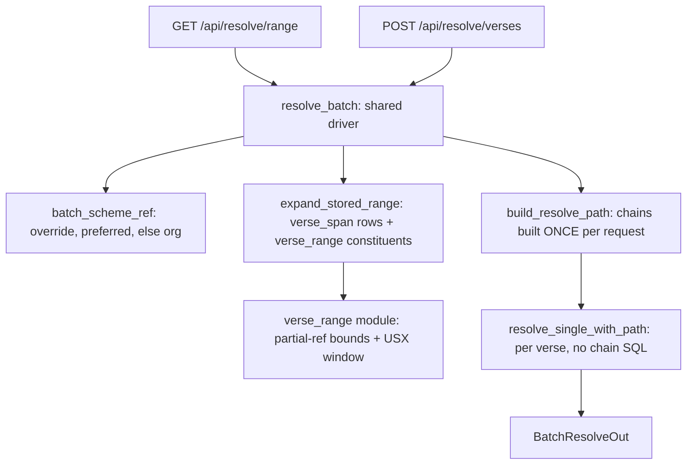
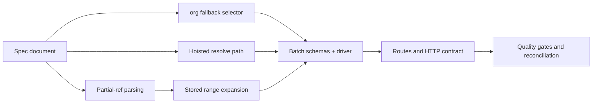

# Batch Mapping API: Phased Execution Plan

**Document:** `frvt-8-execution-plan-1`
**Status:** Ready for implementation
**Audience:** A coding agent (and reviewers) implementing [frvt-8-acceptance-criteria-1.md](./frvt-8-acceptance-criteria-1.md)
**Scope:** Add two batch verse-mapping endpoints to the existing FastAPI backend — one for a verse *range* expressed as from/to partial references, one for an explicit *set* of verse references — with versification as an optional parameter that defaults to a translation's preferred scheme and falls back to `org`. Includes a narrow resolver-port change so a batch does not rebuild scheme chains once per verse.

This plan is written for a **lower-quality coding agent**. Work the phases in order. Each phase has an **Acceptance** gate that can be verified on its own or with only the phases before it. Do not start a phase until the previous gate passes. Do not invent endpoints, settings, database columns, migrations, UI, or TypeScript client code beyond what is written here.

---

## How to use this document

- Work phases **in order**. Do not skip ahead, and do not merge phases.
- Phase 0 produces the API spec document. After Phase 0, **that spec is the oracle** for request/response shape and status codes. If the code and the spec disagree, fix one of them deliberately in Phase 7 and say which.
- Existing FRVT-3 specs remain authoritative for everything this ticket does not change.
- Reuse the existing helpers named in this plan. Do not write parallel copies of pagination, scheme selection, span lookup, chain walking, or test seeding.
- Never commit or push. The owner reviews all changes.

> **Rule 12 — read first.** Phase numbers and any identifiers in this plan are planning scaffolding. They must **never** appear in produced source code, comments, configuration, migration names, or runtime strings. Name modules and symbols for what they do, not for the phase that created them. Rule 12 does **not** apply to files under `.spec/` or `.test/`.
>
> The pre-existing `phase1`–`phase6` pytest markers in [`frvt/pyproject.toml`](../frvt/pyproject.toml) are part of the repository's established test-suite gating vocabulary and predate this plan. Reuse them as instructed below. Do **not** add new markers.

---

## Locked owner decisions

| Topic | Decision |
| --- | --- |
| Endpoint count | **Two**: `GET /api/resolve/range` and `POST /api/resolve/verses`. No combined endpoint. |
| Why POST for the set | A verse-ID set can exceed practical query-string length. The range endpoint stays `GET` to match `/api/resolve` and `/api/resolve/chapter`. |
| Range expansion source | **Stored `verse_span` rows of the from-translation**. **Never** enumerate from a scheme's `maxVerses` ingredient. |
| Combined milestones | A combined milestone (`GEN 1:1-2`) is stored as **one** row at the anchor verse. The expansion **must** read `verse_range` and emit an entry for **every constituent verse**, so `GEN 1:2` is not silently dropped. |
| "Partials" in the criteria | **Partial references** as range endpoints (`GEN`, `GEN 3`, `GEN 3:5`). **Not** sub-verse parts (the `a` in `SIR 36:13a`). Sub-verse parts are out of scope for both endpoints. |
| Accepted ref grammar in the set | Whatever `/api/resolve` accepts for its `ref` parameter, i.e. `BOOK C:V` **and** same-chapter `BOOK C:V-V`. The entry is keyed by the ref exactly as submitted. |
| Versification default | Explicit override, else the translation's preferred scheme, else the canonical **`org`** scheme. |
| Blast radius of the `org` fallback | The fallback applies to the **new batch endpoints only**. `selected_scheme_ref()` keeps raising `409` for every existing endpoint. |
| Response shape | `BatchResolveOut`, which extends the existing `Page[BatchResolveEntry]` with the two scheme ids actually used, so a caller can see whether the `org` fallback fired. |
| Per-verse failures | Recorded as `error` on the entry with HTTP `200` overall. **Do not** copy the silent `continue` in `resolve_chapter()`. |
| Request-level failures | Chain problems (cycle, no shared ancestor) are detected **once**, before the loop, and returned as a single `422`. A caller must never receive `200` with 500 copies of the same error. |
| Chain hoisting | Scheme chains and hops are built **once per request** and reused for every verse, mirroring `JumpCancelContext` in [`frvt/api/jump_cancel.py`](../frvt/api/jump_cancel.py). |
| Dedupe | **None.** The emit-once dedupe in `resolve_chapter()` is deliberately not reused; keying by input ref requires one entry per input. |
| Size limits | Reuse `DEFAULT_LIMIT = 100` / `MAX_LIMIT = 500` and `clamp_page()` from [`frvt/api/scheme_select.py`](../frvt/api/scheme_select.py). No new settings, no new environment variables. |
| Range pagination | `GET /api/resolve/range` accepts `limit` / `offset` over the ordered expansion. `total` is the **full** expansion size before slicing. Default page size is therefore `100`. |
| Set size limit | `POST /api/resolve/verses` rejects a `refs` list longer than `MAX_LIMIT` with `422`. No pagination — the caller already controls the list. |
| Ordering | Range results in USX book order, then chapter, then verse. Set results in **request order**, duplicates preserved. |
| Database | **No schema change and no migration.** Both endpoints read existing tables only. |
| `resolve_chapter` | **Not migrated** to the new hoisted path. It resolves about 30 verses per call, so the win is small and the jump-menu and overlay regression surface is not worth it. Noted as a follow-up. |
| Out-of-plan work | No UI, no `frvt/web` changes, no test-plan document, no coverage-matrix rows, no edits to the FRVT-3 spec documents. |

---

## What exists today (integration points)

Read these before writing anything. Line references are current at plan time; verify before editing.

- **Single resolve endpoint** — [`frvt/api/routers/resolve.py`](../frvt/api/routers/resolve.py). Two `GET` routes on a shared `APIRouter(tags=["resolve"])`, registered in [`frvt/api/main.py`](../frvt/api/main.py) via `app.include_router(resolve.router)`. The new routes go in this same file and router, so **no `main.py` change is needed**.
- **Resolve one reference with pre-selected schemes** — `resolve_single_with_schemes()` in [`frvt/api/ports/resolver_port.py`](../frvt/api/ports/resolver_port.py). Validates the ref, canonicalizes combined milestones via `_canonicalize_query_ref()`, calls `frvt.resolver.resolve.resolve()`, enriches spans via `_to_result()`, and raises `AppError(400 | 422)` on failure.
- **The hoisting pattern to copy** — `JumpCancelContext._resolve_path()` in [`frvt/api/jump_cancel.py`](../frvt/api/jump_cancel.py) builds both chains once and then calls `assemble(members, src_hops, tgt_hops)` per reference. `assemble` is exported from `frvt.resolver`; `build_chain`, `nearest_shared_translation`, `hops_to_ancestor`, and `hops_from_ancestor` come from `frvt.resolver.chains`; `Hop` comes from `frvt.resolver.types`.
- **Scheme selection** — `selected_scheme_ref()` in [`frvt/api/scheme_select.py`](../frvt/api/scheme_select.py): override → `404` if the scheme is missing, `409` if it is not associated; no override → the `TranslationVersification` row with `preferred = True`, else `409`.
- **Existing batch precedent** — [`frvt/api/resolve_chapter.py`](../frvt/api/resolve_chapter.py) shows the driver skeleton: validate translations once, select both schemes once, then loop. Copy that skeleton; do **not** copy its dedupe or its silent error swallowing.
- **Pagination** — `clamp_page()`, `DEFAULT_LIMIT`, `MAX_LIMIT` in `scheme_select.py`. Raises `AppError(422, ..., code="validation_failed")`.
- **Book ordering** — `usx_book_sort_key()` and `USX_BOOK_ORDER` in [`frvt/api/usx_book_order.py`](../frvt/api/usx_book_order.py).
- **Reference grammar** — `parse_ref()`, `expand()`, `format_bcv()` in [`frvt/resolver/parse_ref.py`](../frvt/resolver/parse_ref.py). Accepts only `BOOK C:V` and same-chapter `BOOK C:V-V`; **rejects** embedded part suffixes and cross-chapter ranges.
- **Schemas** — [`frvt/api/schemas/__init__.py`](../frvt/api/schemas/__init__.py): `ResolveResult`, `RelationType`, and the generic `Page[PageItem]`.
- **Errors** — `AppError` in [`frvt/api/errors.py`](../frvt/api/errors.py) exposes `status_code`, `detail`, `code`, `errors`. Its constructor normalizes `code` to the `ErrorCode` literal, so no mapping is needed when copying it onto an entry. **Do not add new codes.**
- **`org` anchor** — seeded by [`frvt/api/bootstrap.py`](../frvt/api/bootstrap.py) as both a `Translation` named `org` **and** a `VersificationScheme` named `org` with `canonical = True` and `based_on_id = NULL`. The fallback needs the **scheme**, not the translation.
- **Test seeding** — [`frvt/testops/fixtures/api_setup.py`](../frvt/testops/fixtures/api_setup.py) provides `eng_org_resolve_context()`, `ingest_primary_project()`, `associate()`, `upload_ingredient_json()`, `set_preferred()`, `create_translation()`, and `insert_partial_verse_span()`. The primary sample project is `research/SampleTranslations/biblica-spanish-1.zip`.

### Request flow to build



---

## Regression traps (read before writing code)

1. **`parse_ref()` cannot parse a cross-book or cross-chapter range.** Never hand it `GEN 1:1-EXO 2:2` or a bare `GEN`. Partial-reference parsing is new code in this plan.
2. **`parse_ref()` rejects part suffixes.** `SIR 36:13a` raises `ReferenceError`. Both endpoints treat that as a per-verse error, never as something to strip.
3. **`selected_scheme_ref()` raises `409` when there is no preferred scheme.** That is correct for existing endpoints. Do not "fix" it. Add the fallback in a new function.
4. **`resolve_chapter()` swallows per-verse failures with `continue`.** The batch endpoints must surface them as entry-level `error` objects instead.
5. **A combined milestone stores ONE row.** `GEN 1:1-2` is a single `verse_span` with `verse = 1` and `verse_range = "GEN 1:1-2"`. A naive `SELECT DISTINCT book, chapter, verse` silently omits verse 2. See the expansion phase.
6. **`clamp_page()` raises `422`, not `400`.** Match it; do not invent a different status for limit violations.
7. **`from` is a Python keyword.** Name the range query parameters `from_ref` and `to_ref`.
8. **`logger.trace(...)` needs `# type: ignore[attr-defined]`** on the same line — mypy runs in strict mode and does not know about the custom level.
9. **Filter `verse_span.part IS NULL`** when expanding a range. Without it, a verse with stored sub-verse parts yields duplicate verse numbers.
10. **`usx_book_sort_key()` sorts unknown book codes *after* all known ones.** An unrecognized code would silently produce a bizarre window, so reject unknown codes explicitly with `422`.
11. **Verse `0` is legal** (Psalm titles). Do not add a `ge=1` guard on verse numbers.
12. **A base class is not an annotation.** `frvt/api/schemas/__init__.py` uses `from __future__ import annotations`, which postpones *field annotations* only. That is why `JumpMenuEntries` at line 281 can annotate a field as `Page[DeltaEntry]` even though `Page` is not defined until line 297. **Subclassing is different**: a base-class expression is evaluated eagerly, so `class BatchResolveOut(Page[BatchResolveEntry])` placed before line 297 raises `NameError` at import time. It must be defined **after** `Page`.
13. **Importing `MAX_LIMIT` from `scheme_select` into `schemas` is verified not to create a cycle.** `scheme_select` imports only `errors`, `logging_config`, `models`, and `resolver.types`; none of those import `schemas`, and `models/__init__.py` imports nothing from `frvt.api` at all.
14. **`PYTHONPATH` is the repository root, not `frvt/`.** Tests import `frvt.api...`.
15. **Do not change the behavior of `resolve_single_with_schemes()`.** The refactor in the hoisting phase must be observably identical; the existing resolve, chapter, navigation, and jump tests are the proof.
16. **The hoisting refactor orphans an import.** `from frvt.resolver import resolve as resolve_coords` at `resolver_port.py:15` is used at exactly one call site (line 231). Once that call is gone, ruff fails with `F401` unless the import is removed.

---

## Global conventions (apply to every phase)

- **Logging (Rule 2).** `logger = get_logger(__name__)` at module top. Every new public function logs a `DEBUG` message on entry with the parameters a troubleshooter needs. Getter-style functions that do not mutate state log `TRACE`. Every `except` block logs `ERROR` with `exc_info=True`. Do not guard log calls with level checks.
- **Orienting comments (Rule 4).** Every new module gets a one-line docstring. Every new function and every new Pydantic field gets a comment or docstring saying **why it exists** and **what to expect**, including raised exceptions. Match the existing density in `frvt/api/schemas/__init__.py` (one `#` comment above each field).
- **Testing (Rule 3).** Happy paths and essential contract failures only. Do not test the router functions that merely delegate, Pydantic field defaults, or accessor behavior.
- **Reuse (Rule 6).** `clamp_page`, `usx_book_sort_key`, `selected_scheme_ref`, `Page[T]`, `AppError`, `assemble`, and the `frvt/testops/fixtures/api_setup.py` helpers all already exist. Use them.
- **Modern patterns (Rule 7) and boilerplate (Rule 8).** SQLAlchemy 2.0 `select()` style, `frozen=True` dataclasses for value types, Pydantic v2 models, comprehensions over accumulator loops where it stays readable.
- **Argument limits (Rule 10).** Six named arguments is the target. Use the `BatchTarget` parameter object defined below rather than threading four ids through every call. Keyword-only arguments after `*`.
- **File size (Rule 9).** Every file this plan creates should land well under 300 lines. If one grows past 600, split it.
- **Typing.** mypy strict covers `frvt.api`. Annotate every parameter and return type.

---

## Tooling and quality gates

Run from `frvt/` with the virtualenv active. `$REPO` is the repository root.

```bash
cd "$REPO/frvt"
python -m ruff check api resolver ingest tests testops
python -m black --check api resolver ingest tests testops
python -m mypy -p frvt.api -p frvt.resolver -p frvt.ingest
```

Tests need the Compose Postgres running:

```bash
cd "$REPO/frvt"
docker compose up -d
PYTHONPATH="$REPO" python -m pytest tests/test_<file>.py -vv     # single file
PYTHONPATH="$REPO" python -m pytest -n auto                       # full suite
```

Test markers: use the repository's existing vocabulary. Pure/unit tests get `@pytest.mark.phase6` plus `@pytest.mark.resolve`. HTTP-level tests get `@pytest.mark.phase4` plus `@pytest.mark.resolve`, matching [`frvt/tests/test_api_resolve_chapter.py`](../frvt/tests/test_api_resolve_chapter.py).

---

## Files this plan creates or changes

**New:**

- `.spec/frvt-8-batch-mapping-api-spec-1.md` — API contract (Phase 0)
- `frvt/api/verse_range.py` — partial-reference parsing and range bounds (Phase 1)
- `frvt/api/resolve_batch.py` — range expansion and the shared batch driver (Phases 4–5)
- `frvt/tests/test_verse_range.py` (Phase 1)
- `frvt/tests/test_scheme_select.py` (Phase 2)
- `frvt/tests/test_resolve_batch.py` (Phases 4–5)
- `frvt/tests/test_api_resolve_batch.py` (Phase 6)

**Changed:**

- `frvt/api/scheme_select.py` — add the `org`-fallback scheme selector (Phase 2)
- `frvt/api/ports/resolver_port.py` — add the hoisted resolve path (Phase 3)
- `frvt/tests/test_resolver_port_enrich.py` — add hoisted-path coverage (Phase 3)
- `frvt/testops/fixtures/api_setup.py` — generalize the span-insert helper (Phase 4)
- `frvt/api/schemas/__init__.py` — add batch request/response models (Phase 5)
- `frvt/api/routers/resolve.py` — add the two routes (Phase 6)

**Explicitly unchanged:** `frvt/api/main.py`, `frvt/api/resolve_chapter.py`, `frvt/api/jump_cancel.py`, `frvt/resolver/**`, `frvt/migrations/**`, `frvt/web/**`.

---

## Phase graph



Phases 1, 2, and 3 are independent of each other and may be verified in any order, but each must pass its own gate before Phase 4 or 5 begins.

---

## Phase 0 — Write the API spec document

**Goal:** Produce the single authoritative contract both endpoints must satisfy, so later phases have an oracle instead of guesses.

**Work:**

Create `.spec/frvt-8-batch-mapping-api-spec-1.md`, matching the tone and section style of [frvt-3-http-api-spec-1.md](./frvt-3-http-api-spec-1.md). Cover:

- **`GET /api/resolve/range`** query parameters: `from_translation` (UUID, required), `to_translation` (UUID, required), `from_ref` (string, required), `to_ref` (string, required), `from_versification` (UUID, optional), `to_versification` (UUID, optional), `limit` (int, optional, default 100, max 500), `offset` (int, optional).
  - `from_ref` / `to_ref` grammar: `BOOK`, `BOOK C`, or `BOOK C:V`, where `BOOK` matches `[A-Z1-6]{3}` and must be a code in `USX_BOOK_ORDER`. No part suffix, no range marker.
  - Bound semantics: an omitted chapter or verse means "open" toward the interval's own side. `from_ref = GEN` starts at the first stored verse of `GEN`; `to_ref = EXO 3` ends at the last stored verse of `EXO 3`; `to_ref = EXO 3:5` ends at exactly `EXO 3:5`.
  - Expansion: whole verses (`part IS NULL`) stored for `from_translation` within the closed interval, **including every constituent verse of a combined milestone**, ordered by USX book order, then chapter, then verse, deduplicated by coordinate.
- **`POST /api/resolve/verses`** body `{from_translation, to_translation, refs, from_versification?, to_versification?}`, where `refs` holds 1..500 reference strings in the grammar `/api/resolve` accepts (`BOOK C:V` or same-chapter `BOOK C:V-V`). Results are returned in request order with duplicates preserved.
- **Shared response `BatchResolveOut`:**
  - `items[].ref` — the requested reference string, exactly as submitted.
  - `items[].result` — a `ResolveResult` (identical to the `/api/resolve` body) when the verse resolved, otherwise `null`.
  - `items[].error` — `{code, detail}` when that one verse failed, otherwise `null`. Exactly one of `result` / `error` is non-null.
  - `total` — for the range endpoint, the full expansion size **before** `limit`/`offset`; for the verses endpoint, `len(refs)`.
  - `from_versification` / `to_versification` — the scheme ids actually used, so a caller can see which defaulting rule applied.
- **Versification defaulting:** explicit parameter, else the translation's preferred association, else the canonical `org` scheme. State that this fallback is specific to these two endpoints and that `/api/resolve`, `/api/resolve/chapter`, and the navigation endpoints keep returning `409`.
- **Status codes**, with an example body for each: `200`; `400` (unparseable `from_ref`/`to_ref`); `404` (unknown translation or unknown override scheme); `409` (override scheme not associated with the translation); `422` (`to_ref` sorts before `from_ref`; unknown book code; `limit` outside `1..500`; `refs` empty or longer than 500; the two schemes share no ancestor or their chain contains a cycle); plus the inherited `401` / `429` from Basic auth.
- **Combined-milestone note:** a constituent verse resolves through the stored anchor, so `GEN 1:1` and `GEN 1:2` of a `GEN 1:1-2` milestone return the same `result` payload under different `ref` keys. Say so explicitly — it is surprising otherwise.
- **Known performance characteristic:** scheme chains are built once per request, but span enrichment still issues a few queries per verse, so a 500-verse page costs roughly 2,000 queries. Recommend the default page size for interactive use.
- **Known logging characteristic:** Rule 2 requires a debug-level line on every public method invocation, and the resolver's `assemble()` adds its own, so a full 500-verse page emits well over a thousand DEBUG lines. `LOG_LEVEL` defaults to `DEBUG`; advise operators to raise it above `DEBUG` for batch workloads. This is a documented trade-off, not a defect.
- **Non-goals:** no dedupe, no sub-verse parts, no scheme-to-scheme mapping without translations, no database change.

**Acceptance:**

- The file exists and every acceptance criterion in [frvt-8-acceptance-criteria-1.md](./frvt-8-acceptance-criteria-1.md) maps to a named section.
- Markdown lints clean under [`.markdownlint.json`](../.markdownlint.json).
- No source files were modified in this phase.

---

## Phase 1 — Partial-reference parsing and range bounds

**Goal:** A pure, database-free module that turns two partial reference strings into a comparable, ordered interval — verifiable entirely with unit tests.

**Work:**

Create `frvt/api/verse_range.py` with no SQLAlchemy imports.

- `PartialRef` — a `@dataclass(frozen=True)` with `book: str`, `chapter: int | None`, `verse: int | None`. A verse may only be present when a chapter is present.
- `parse_partial_ref(value: str) -> PartialRef` — matches `^([A-Z1-6]{3})(?: ([0-9]+)(?::([0-9]+))?)?$` against a stripped input. Raises `AppError(400, ..., code="bad_request")` when the grammar does not match, and `AppError(422, ..., code="validation_failed")` when the book code is not in `USX_BOOK_ORDER`. Log `TRACE` on entry and `ERROR` before each raise.
- `VerseKey` — a type alias `tuple[int, int, int]` of `(usx book index, chapter, verse)` used purely for ordering.
- `verse_key(book: str, chapter: int, verse: int) -> VerseKey` — the ordering key for a concrete stored verse, so callers compare like with like.
- `range_window(from_value: str, to_value: str) -> VerseRangeWindow` — the only function callers outside this module need. Parses both strings, then returns a frozen `VerseRangeWindow` holding `books: tuple[str, ...]` (the contiguous `USX_BOOK_ORDER` slice from the from-book through the to-book inclusive), `lower: VerseKey`, and `upper: VerseKey`. Missing chapter/verse become `-1` on the lower bound (below any real chapter or verse, including verse `0`) and `sys.maxsize` on the upper bound. Raises `AppError(422, ..., code="validation_failed")` when `lower > upper`, which covers both a reversed book order and a reversed chapter or verse inside one book. Log `DEBUG` on entry.
- Keep the bound-building and book-slicing helpers private (leading underscore). `range_window`, `verse_key`, `PartialRef`, `VerseRangeWindow`, and `parse_partial_ref` are the module's public surface.

Create `frvt/tests/test_verse_range.py`, marked `@pytest.mark.phase6` and `@pytest.mark.resolve`. No database fixtures. Cover:

- Each of the three grammars parses: `GEN`, `GEN 3`, `GEN 3:5`.
- A whole-book window lists only that book; a cross-book window lists the intervening books in USX order.
- `GEN` to `EXO 3:5` produces bounds that include `GEN 1:0` and `EXO 3:5` and exclude `EXO 3:6`.
- Reversed input (`EXO` to `GEN`, and `GEN 5` to `GEN 2`) raises `AppError` with status `422`.
- An unknown book code (`ZZZ`) raises `AppError` with status `422`; malformed strings (`GEN 3:`, `GEN 3:5a`, `GEN 1-2`) raise `AppError` with status `400`.

**Acceptance:**

- `PYTHONPATH="$REPO" python -m pytest tests/test_verse_range.py -vv` passes.
- ruff, black, and mypy pass.
- `frvt/api/verse_range.py` imports nothing from `sqlalchemy` and nothing from `frvt.api.models`.

---

## Phase 2 — Versification default with `org` fallback

**Goal:** A scheme selector that implements acceptance criterion 2 without changing any existing endpoint's behavior.

**Work:**

Add to [`frvt/api/scheme_select.py`](../frvt/api/scheme_select.py) (currently 128 lines).

- Extract the preferred-association lookup that `selected_scheme_ref()` already performs into a small private helper, and have `selected_scheme_ref()` call it. This is a pure refactor: the `409` behavior must not change.
- `org_scheme_ref(session: Session) -> SchemeRef` — loads the scheme whose name equals `org` case-insensitively **and** whose `canonical` flag is true. Raises `AppError(409, ..., code="conflict")` naming the missing canonical `org` scheme if it is absent, logging `ERROR` first. Log `TRACE` on entry.
  - Guard against the trap: query `VersificationScheme`, not `Translation`. Both are named `org`.
- `batch_scheme_ref(session: Session, translation_id: UUID, override_scheme_id: UUID | None) -> SchemeRef` — the selector the batch endpoints use. Log `DEBUG` on entry.
  - Override present → delegate to `selected_scheme_ref()` unchanged, preserving `404` for a missing scheme and `409` for an unassociated one.
  - No override, a preferred association exists → delegate to `selected_scheme_ref()`.
  - No override, no preferred association → return `org_scheme_ref(session)`.
  - Docstring must say this differs from `selected_scheme_ref()` **only** in the last case, and why: a batch request must not fail wholesale over a missing preferred scheme.

Create `frvt/tests/test_scheme_select.py` (there is no existing test module for this helper), marked `@pytest.mark.phase6` and `@pytest.mark.resolve`, using the `seeded_session` fixture:

- A translation with a preferred association resolves to that scheme.
- A translation with **no** association resolves to the canonical `org` scheme.
- An explicit override that is associated resolves to the override.
- An override that is not associated still raises `AppError` with status `409`.
- Regression guard: `selected_scheme_ref()` still raises `409` for a translation with no preferred association.

**Acceptance:**

- `PYTHONPATH="$REPO" python -m pytest tests/test_scheme_select.py -vv` passes.
- `PYTHONPATH="$REPO" python -m pytest tests/test_api_resolve.py tests/test_api_resolve_chapter.py tests/test_api_navigation.py -vv` passes **unchanged** — proof the refactor did not alter existing behavior.
- ruff, black, and mypy pass.

---

## Phase 3 — Hoist scheme-chain construction out of the per-verse loop

**Goal:** Make it possible to resolve many references without rebuilding scheme chains each time, and turn chain-level failures into one request-level error. Verified almost entirely by existing tests continuing to pass.

**Why this phase exists:** `resolve()` calls `build_chain()` for both sides on every invocation, costing roughly eight to ten queries per verse with no caching anywhere. At the 500-verse cap that is several thousand redundant queries. `JumpCancelContext` already solves this for the jump menu; this phase generalizes the same idea into the port so the batch driver can use it.

**Work:**

Add to [`frvt/api/ports/resolver_port.py`](../frvt/api/ports/resolver_port.py) (currently 280 lines).

- `ResolvePath` — a `@dataclass(frozen=True)` holding `source_hops: list[Hop]` and `target_hops: list[Hop]`, with a docstring explaining it is valid only for the scheme pair it was built from and only within one request.
- `build_resolve_path(session: Session, *, source_scheme: SchemeRef, target_scheme: SchemeRef) -> ResolvePath` — calls `build_chain()` for both sides, `nearest_shared_translation()`, then `hops_to_ancestor()` / `hops_from_ancestor()`, exactly as `JumpCancelContext._resolve_path()` does. Wraps `LookupError` (cycle, no shared ancestor) in `AppError(422, str(exc), code="validation_failed")` after logging `ERROR` with `exc_info=True`. Log `DEBUG` on entry.
- `resolve_single_with_path(session: Session, *, from_translation: UUID, to_translation: UUID, ref: str, part: str | None, path: ResolvePath) -> ResolveResult` — the per-verse worker with no chain SQL:
  - Log `DEBUG` on entry with the ref, part, and both scheme ids. This preserves the diagnostic line `resolve()` emits today (`"Resolving ref=%s part=%s source_scheme=%s target_scheme=%s"`), which would otherwise be lost when the batch path stops calling `resolve()`.
  - `parse_ref(ref)` for validation, mapping `ReferenceError` to `AppError(400, ..., code="bad_request")`.
  - `resolve_ref, resolve_part = _canonicalize_query_ref(session, from_translation, ref, part)` as today.
  - `members = expand(parse_ref(resolve_ref))`, then apply `resolve_part` by rebuilding each `VerseId` with that part — copy the four-line block from `JumpCancelContext._resolve_navigation()`. Add `expand` to the existing `frvt.resolver.parse_ref` import.
  - `assemble(members, path.source_hops, path.target_hops)`, keeping the existing `ReferenceError` → `400` and `LookupError` → `422` mapping around it.
  - `_to_result(session, from_translation, to_translation, dto)`.
- **Refactor `resolve_single_with_schemes()` to delegate**: build a `ResolvePath` and call `resolve_single_with_path()`. This is the important part — it guarantees the single and batch paths cannot drift, and it puts the new code under the existing resolve test suite. Keep the public signature byte-for-byte identical.
  - **Remove the now-unused `resolve_coords` import** (trap 16), otherwise ruff fails with `F401`.
  - Confirm nothing is lost by bypassing `resolve()`. Read it side by side with the new function: `resolve()` does `_select_scheme` twice, then `expand`/part-override, then the chain work, then `assemble`. `_select_scheme` returns its argument unchanged whenever a concrete `SchemeRef` is passed, and `resolve_single_with_schemes()` always passes concrete schemes, so dropping it is a no-op. Everything else is reproduced above.
  - Confirm the status codes are unchanged: today a chain `LookupError` escapes `resolve()` and the port maps it to `422`; after the refactor `build_resolve_path()` raises `AppError(422, ...)` directly. Same status, same envelope code.
  - Confirm `resolve_chapter()` is unaffected: its `except AppError: continue` still catches the `422`, so a broken chain still yields an empty item list rather than a crash.
  - Leave `frvt/resolver/resolve.py` alone. `resolve()` stays public and is still exercised directly by `frvt/tests/test_resolver.py`.

Add to `frvt/tests/test_resolver_port_enrich.py`, marked `@pytest.mark.phase6` and `@pytest.mark.resolve`:

- Resolving the same reference through `resolve_single_with_schemes()` and through `build_resolve_path()` plus `resolve_single_with_path()` produces equal `ResolveResult` objects.
- Two references resolved against one `ResolvePath` both succeed, showing the path is reusable.
- `build_resolve_path()` raises `AppError` with status `422` for two schemes with no shared ancestor. Copy the fixture setup from the existing no-shared-ancestor case in `frvt/tests/test_api_resolve.py` (search for "no shared ancestor"): two orphan translations, each with its own scheme whose `based_on_id` is `None`, each marked preferred.

**Acceptance:**

- `PYTHONPATH="$REPO" python -m pytest tests/test_resolver_port_enrich.py tests/test_api_resolve.py tests/test_api_resolve_chapter.py tests/test_resolver.py tests/test_api_navigation.py tests/test_jump_cancel_filter.py -vv` passes **with no test file edits other than the additions above**. This is the regression gate for the refactor.
- ruff, black, and mypy pass.
- `frvt/api/ports/resolver_port.py` stays under 400 lines.

---

## Phase 4 — Expand a stored verse range

**Goal:** Turn a range window into the ordered list of reference strings the from-translation actually covers, including combined-milestone constituents.

**Work:**

First, generalize the test seeding helper in [`frvt/testops/fixtures/api_setup.py`](../frvt/testops/fixtures/api_setup.py) so range tests can create precise coordinates (Rule 6 — do not write a second copy in the test file):

- Add `insert_verse_span(session, translation_id, *, book, chapter, verse, part=None, content="[fixture]", seq=None, verse_label=None, verse_range=None) -> VerseSpan`, carrying the existing auto-`seq` logic from `insert_partial_verse_span()`.
- Reimplement `insert_partial_verse_span()` as a thin call into it so its current signature and behavior are preserved for existing callers.

Then create `frvt/api/resolve_batch.py` with the expansion half only.

- `expand_stored_range(session: Session, translation_id: UUID, *, from_ref: str, to_ref: str) -> list[str]`:
  - Log `DEBUG` on entry with the translation and both bounds.
  - Call `range_window(from_ref, to_ref)` from Phase 1. Let its `AppError`s propagate; they already carry the right status codes.
  - Select `book`, `chapter`, `verse`, `verse_range` from `VerseSpan` where `translation_id` matches, `VerseSpan.book.in_(window.books)`, and `VerseSpan.part.is_(None)`. Use SQLAlchemy 2.0 `select()` style, following `_stored_whole_verses()` in [`frvt/api/resolve_chapter.py`](../frvt/api/resolve_chapter.py).
  - Build a `set[tuple[str, int, int]]` of covered `(book, chapter, verse)` coordinates. For each row add its own coordinate. When `verse_range` is not null, `parse_ref()` it and add a coordinate for **every** verse from `verse_start` through `verse_end` — this is what keeps `GEN 1:2` of a `GEN 1:1-2` milestone from disappearing. Wrap that `parse_ref()` in `try` / `except ReferenceError`, logging `ERROR` with the offending value and skipping only that row's range, so one malformed stored value cannot fail the request.
  - Keep the set keyed by **book code**, not by book index. Comparison against the window uses `verse_key(book, chapter, verse)` and sorting uses `(usx_book_sort_key(book), chapter, verse)`, so there is never a need to map an index back to a code.
  - Filter to coordinates whose `verse_key(...)` falls in `[window.lower, window.upper]`, sort, and format each as `f"{book} {chapter}:{verse}"`.
  - Comment why edge filtering happens in Python: the interval is a lexicographic `(book order, chapter, verse)` comparison whose book ordering is a Python constant, so the SQL restriction to the book window keeps the fetch bounded while the tuple comparison stays obviously correct.
  - Return an empty list — never an error — when the translation covers nothing in the window.

Create `frvt/tests/test_resolve_batch.py` (Phase 5 adds to it), marked `@pytest.mark.phase6` and `@pytest.mark.resolve`. Build the fixture with `create_translation()` plus the new `insert_verse_span()` so coordinates are exact. It needs two books, with at least four chapters in the first so the chapter-bounded case below has verses on both sides of the window, plus one Psalm-title verse `0`, one row with a non-null `part`, and one combined milestone carrying `verse_range`. Cover:

- Whole-book range (`GEN` to `GEN`) returns every covered verse of that book in order.
- Chapter-bounded range (`GEN 2` to `GEN 3`) excludes chapters 1 and 4.
- Verse-bounded range (`GEN 2:3` to `GEN 3:2`) includes both endpoints and excludes the verses just outside them.
- Cross-book range crosses the book boundary in USX order.
- A combined milestone stored at `GEN 1:1` with `verse_range = "GEN 1:1-2"` yields **both** `GEN 1:1` and `GEN 1:2`.
- The row with a non-null `part` does not produce a duplicate verse entry.
- Verse `0` is included when it is inside the window.
- A window with no covered verses returns `[]`, and so does a metadata-only translation that has no stored spans at all.

**Acceptance:**

- `PYTHONPATH="$REPO" python -m pytest tests/test_resolve_batch.py -vv` passes.
- `PYTHONPATH="$REPO" python -m pytest tests/test_fixture_shared_helpers.py tests/test_api_resolve.py -vv` passes — proof the `insert_partial_verse_span()` refactor did not break existing callers.
- ruff, black, and mypy pass.
- `frvt/api/resolve_batch.py` contains no FastAPI imports yet.

---

## Phase 5 — Batch response models and the shared driver

**Goal:** One driver that both endpoints call, producing per-verse entries with per-verse errors and one shared scheme path — verifiable without going through HTTP.

**Work:**

Add to [`frvt/api/schemas/__init__.py`](../frvt/api/schemas/__init__.py), each field carrying a `#` orienting comment in the existing style. **Placement matters** — see trap 12:

- `BatchResolveError` — `code: ErrorCode` and `detail: str`. Import the existing `ErrorCode` literal from [`frvt/api/errors.py`](../frvt/api/errors.py) rather than typing `code` as a bare `str`, so the fixed vocabulary is enforced and shows up in the generated OpenAPI schema. Place it with the other resolve models.
- `BatchResolveEntry` — `ref: str`, `result: ResolveResult | None = None`, `error: BatchResolveError | None = None`. Class docstring states exactly one of `result` / `error` is non-null. Both keys are always present in the JSON; do **not** add a `model_serializer` that drops them, because a per-entry union is easier to consume when the shape is stable. Place it with the other resolve models.
- `BatchVerseRequest` — the `POST /api/resolve/verses` body: `from_translation: UUID`, `to_translation: UUID`, `refs: Annotated[list[str], Field(min_length=1, max_length=MAX_LIMIT)]`, `from_versification: UUID | None = None`, `to_versification: UUID | None = None`. Import `MAX_LIMIT` from `frvt.api.scheme_select`; trap 13 confirms there is no import cycle. Place it with the other resolve models.
- `BatchResolveOut(Page[BatchResolveEntry])` — subclass the existing generic envelope so `items` and `total` are inherited rather than restated, and add `from_versification: UUID` and `to_versification: UUID` (the schemes actually used). **This class must be defined below `Page`** (currently line 297), because a base-class expression is evaluated eagerly and postponed annotations do not help. Put it immediately after `Page` with a short comment saying why it lives there rather than with its siblings.

Add to `frvt/api/resolve_batch.py`:

- `BatchTarget` — a `@dataclass(frozen=True)` with `from_translation: UUID`, `to_translation: UUID`, `from_versification: UUID | None = None`, `to_versification: UUID | None = None`. This is the Rule 10 parameter object; both public functions and the private worker take it instead of four loose ids.
- A private `_prepare(session, target) -> tuple[SchemeRef, SchemeRef, ResolvePath]` — `require_translation()` for both translations, `batch_scheme_ref()` for both sides, then `build_resolve_path()`. Every failure here is request-level and propagates as `404` / `409` / `422`. Log `DEBUG` on entry.
- A private `_resolve_entries(session, refs, *, target, path) -> list[BatchResolveEntry]`:
  - For each ref, call `resolve_single_with_path()` with `part=None`.
  - On success, wrap the `ResolveResult` in an entry.
  - On `AppError`, log `ERROR` with `exc_info=True` and the offending ref, then append an entry carrying `BatchResolveError(code=exc.code, detail=exc.detail)`.
  - On any other `Exception`, log `ERROR` with `exc_info=True` and append an entry with code `internal_error`. One bad verse must never fail the whole batch.
- `resolve_verse_set(session, target: BatchTarget, refs: list[str]) -> BatchResolveOut`:
  - Log `DEBUG` on entry with both translations and `len(refs)`.
  - Raise `AppError(422, ..., code="validation_failed")` when `refs` is empty or longer than `MAX_LIMIT`, so the component enforces the contract even when a caller bypasses Pydantic.
  - `_prepare()`, then `_resolve_entries()`, then return `BatchResolveOut(items=entries, total=len(entries), from_versification=source_scheme.scheme_id, to_versification=target_scheme.scheme_id)`. Request order and duplicates are preserved.
- `resolve_verse_range(session, target: BatchTarget, *, from_ref: str, to_ref: str, limit: int | None = None, offset: int | None = None) -> BatchResolveOut`:
  - Log `DEBUG` on entry. Six named arguments, within the Rule 10 target.
  - `clamp_page(limit, offset)` for the page bounds, `_prepare()` for schemes and path.
  - `expand_stored_range()` for the full ordered ref list; capture `total = len(all_refs)` **before** slicing; slice `all_refs[offset : offset + limit]`; resolve only the slice.
  - Return `BatchResolveOut` with the full `total` and the two scheme ids.

Add tests to `frvt/tests/test_resolve_batch.py`, marked `@pytest.mark.phase6` and `@pytest.mark.resolve`, reusing the Phase 4 fixture:

- A verse set resolves in request order and preserves a duplicated ref.
- A verse set containing one malformed ref (`GEN 1:1a`) returns entries whose length equals the input length, with the good ones carrying `result` and the malformed one carrying `error`.
- A same-chapter range string (`GEN 1:1-3`) in `refs` resolves rather than erroring.
- A range with `limit` and `offset` returns the expected slice while `total` reports the full expansion.
- A translation **with** a preferred association and no explicit override echoes that scheme id in `from_versification` (acceptance criterion 2.1).
- A translation with **no** preferred association resolves through the `org` fallback, and `from_versification` echoes the canonical `org` scheme id (acceptance criterion 2.2).
- Two schemes with no shared ancestor raise a single `AppError` with status `422` rather than producing per-entry errors.

The two versification-default cases are the primary evidence for acceptance criterion 2; Phase 6 does not repeat them.

**Acceptance:**

- `PYTHONPATH="$REPO" python -m pytest tests/test_resolve_batch.py -vv` passes.
- ruff, black, and mypy pass.
- `frvt/api/resolve_batch.py` is under 300 lines; split the expansion helpers into a private module if it is not.

---

## Phase 6 — Routes and the HTTP contract

**Goal:** Expose both endpoints and prove the wire contract, including status codes and the auth gate.

**Work:**

Add two routes to [`frvt/api/routers/resolve.py`](../frvt/api/routers/resolve.py) on the existing `router`. Keep the handlers thin — build a `BatchTarget`, log one `DEBUG` line, delegate, return. No `main.py` change.

- `@router.get("/api/resolve/range", response_model=BatchResolveOut)` with query parameters `from_translation`, `to_translation`, `from_ref`, `to_ref`, `from_versification`, `to_versification`, `limit`, `offset`, plus the `session` dependency. Declare `limit` and `offset` as plain optional ints and let `clamp_page()` enforce the bounds, matching the paginated navigation endpoints.
- `@router.post("/api/resolve/verses", response_model=BatchResolveOut)` taking a `BatchVerseRequest` body and the `session` dependency.
- Both handlers get a docstring explaining what the endpoint returns and that per-verse failures appear as entry errors rather than HTTP errors.

Create `frvt/tests/test_api_resolve_batch.py`, marked `@pytest.mark.phase4` and `@pytest.mark.resolve`. Use the `api_client` fixture, `basic_auth_header()` and `assert_error_envelope()` from `frvt.testops.http_client`, and `eng_org_resolve_context()` from `frvt.testops.fixtures.api_setup` — the same setup [`frvt/tests/test_api_resolve_chapter.py`](../frvt/tests/test_api_resolve_chapter.py) uses. Derive expected refs from `GET /api/translations/{id}/spans?book=...&chapter=...` rather than hard-coding verse numbers from the sample project, and keep every range bounded to one or two chapters so the counts stay well inside the 500-verse cap and the spans endpoint's own pagination.

Because both handlers delegate straight to `resolve_batch`, Rule 3 says **do not** re-prove component behavior here. Phase 5 already covers request ordering, duplicate refs, per-entry errors, `limit`/`offset` slicing, and the `org` fallback. Test only what is invisible below the HTTP boundary:

- One happy path per route: `GET /api/resolve/range` over one chapter and `POST /api/resolve/verses` with a handful of refs, each returning `200` with a well-formed `BatchResolveOut` (entries present, `total` consistent, both scheme ids echoed).
- Query-parameter and request-body binding actually works: the range route honors `from_ref` / `to_ref` / `limit` / `offset` as sent over the wire, and the POST route parses `refs` from JSON.
- Response serialization: an entry carrying an `error` and an entry carrying a `result` both round-trip through JSON with the expected keys.
- Status-code and envelope mapping, each asserted with `assert_error_envelope()`: unknown translation → `404`; override scheme not associated → `409`; `to_ref` before `from_ref` → `422`; malformed `from_ref` → `400`; `limit=501` → `422`; `refs` longer than 500 → `422`; empty `refs` → `422`. The last two come from Pydantic rather than the component, so they are genuinely HTTP-layer contracts.
- An unauthenticated request to each route returns `401` with `code="unauthorized"`, following the pattern in `frvt/tests/test_health_auth.py`. This proves the new routes inherit the app-wide Basic gate.

**Acceptance:**

- `PYTHONPATH="$REPO" python -m pytest tests/test_api_resolve_batch.py -vv` passes.
- Both routes appear in `GET /openapi.json` with the expected parameters and the `BatchResolveOut` response schema.
- ruff, black, and mypy pass.

---

## Phase 7 — Full gates and reconciliation

**Goal:** Prove nothing regressed and that the shipped behavior matches the Phase 0 spec.

**Work:**

- Run the full backend suite and all three quality gates.
- Sanity-check the hoist actually worked: resolve a 200-verse range and confirm from the `DEBUG` log that `build_resolve_path` ran once, not once per verse.
- Diff the implemented contract against `.spec/frvt-8-batch-mapping-api-spec-1.md`. For every difference, either change the code or change the spec — deliberately — and say which in the summary to the owner.
- Re-read the new modules against Rules 2, 4, 9, and 10: every public function logs `DEBUG` on entry, every getter logs `TRACE`, every `except` logs `ERROR` with `exc_info=True`, every field and function has an orienting comment, no file is near 600 lines, no signature exceeds ten named arguments.
- Grep the new and changed source files for phase or plan identifiers and remove any that leaked in (Rule 12).
- Report to the owner: files added and changed, the endpoints as built, any spec deviation, and the residual per-verse span-lookup cost. **Do not commit and do not push.**

**Acceptance:**

- `PYTHONPATH="$REPO" python -m pytest -n auto` passes with no new failures relative to the pre-change baseline.
- `python -m ruff check api resolver ingest tests testops`, `python -m black --check api resolver ingest tests testops`, and `python -m mypy -p frvt.api -p frvt.resolver -p frvt.ingest` all pass.
- `git status` shows only the files listed in this plan, and `git log` shows no new commits.

---

## Out of scope

- Any database schema change or Alembic migration.
- Scheme-to-scheme mapping without translation identifiers.
- Sub-verse part handling in either endpoint.
- Dedupe of identical alignments, and any change to `/api/resolve/chapter` — including migrating it onto the hoisted resolve path, which is a reasonable follow-up but not worth the regression surface here.
- Migrating `JumpCancelContext` in [`frvt/api/jump_cancel.py`](../frvt/api/jump_cancel.py) onto `build_resolve_path()`. It already hoists chains its own way, so the duplication is knowingly left in place rather than risking the jump menu and overlay; fold it in as a follow-up.
- Caching or batching the remaining per-verse `find_stored_span()` queries. The chain hoist removes the dominant cost; the span cost stays and is documented.
- Changing `selected_scheme_ref()` behavior for existing endpoints.
- TypeScript client, types, or any `frvt/web` change.
- A separate test-plan document, `.test/coverage-matrix.md` rows, and edits to the FRVT-3 spec documents.
- New settings or environment variables.
