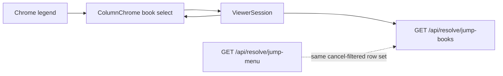

# Book Jump-Difference Indicators — Execution Plan

**Document:** `frvt-3-book-jump-indicators-execution-plan-1`
**Status:** Ready for implementation
**Audience:** A coding agent (and reviewers) adding per-book indicators on the viewer book dropdown for books that have jump-menu differences, plus a visible legend.
**Scope:** Spec addenda (UI, server, resolver cross-spec); new pair-scoped summary API; ViewerSession fetch/cache; `ColumnChrome` book-option markers and legend; tests.

## How to use this document

- Work phases **in order**. Do not start phase *N+1* until phase *N* Acceptance passes.
- Product specs remain authoritative after Phase 0 records addenda: [server](./frvt-3-server-and-api-spec-1.md), [UI](./frvt-3-ui-spec-1.md), [resolver/ETL](./frvt-3-resolver-and-etl-spec-1.md).
- **Effective specification** = frozen main body + addenda applied in order (see [Spec modification policy](#spec-modification-policy-all-three-product-specs) below). Cite effective spec targets (main-body section **or** addendum row), not this plan, when making policy decisions in code.
- **Never commit or push** (Rule 11).

> **Rule 12 (product code).** Phase numbers and plan/workflow identifiers must **never** appear in product application code under `frvt/api`, `frvt/resolver`, `frvt/ingest`, or `frvt/web/src`. Name modules and symbols for what they do, not for the phase that created them.

---

## Spec modification policy (all three product specs)

Each product spec ([UI](./frvt-3-ui-spec-1.md), [server](./frvt-3-server-and-api-spec-1.md), [resolver/ETL](./frvt-3-resolver-and-etl-spec-1.md)) states the same **modification policy**:

- The numbered main body (everything before **Addenda**) is **frozen** and must **never** be edited.
- Post-reconciliation changes go **only** in **Addenda** at the end of each file.
- One logical change set → one addendum subsection (`### ADD-*-NNN`) with a **capability-level Purpose** (no field names or section ids in the Purpose paragraph).
- Atomic changes → **modification rows** in a table: `Mod id`, `Target` (main-body section id), `Action` (`ADD` \| `CLARIFY` \| `REPLACE` \| `REMOVE`), `Effective text`.
- Apply subsections in numeric order; within a subsection, apply rows in listed order. Later rows override earlier ones for the same target.

Phase 0 must **append** `ADD-U-003`, `ADD-S-003`, and `ADD-R-003` — not rewrite §2.3, §7.9, §6.6, capability tables, or other main-body text in place. **`ADD-R-003` is documentation-only** (Purpose + narrative; no modification rows).

The navigation test plan ([`frvt-3-test-plan-resolver-and-navigation-1.md`](./frvt-3-test-plan-resolver-and-navigation-1.md)) is **not** governed by this addenda policy; Phase 5 may edit test cases directly.

---

## Locked owner decisions

| Topic | Decision |
| --- | --- |
| Meaning | Mark a book when it has **≥1 jump-relevant difference** for the current pair + schemes — i.e. any row that would appear in **Mapped deltas** or **Misalignments** after the server cancel-filter (same underlying `_cancel_filtered_jump_mappings` set; deltas and misalignments are two projections of that set) |
| Indicator richness | **Boolean only** — no per-book counts, no per-category icons |
| Control UI | Keep the native book `<select>`. Encode the mark as a **unicode suffix** on the option label (see Marker). Do **not** build a custom dropdown |
| Marker | Suffix ` ●` (U+25CF BLACK CIRCLE) after the USFM code when the book is flagged — e.g. `PSA ●`. Books without differences stay `PSA`. The `value` attribute remains the bare book code |
| Legend | **Always visible** in each column’s chrome, immediately under or beside the Book control: `● Book has mapping differences` (same wording in both columns) |
| Columns | **Both** left and right book dropdowns. Each request uses that column as `from_translation` and the counterpart as `to_translation`, with that column’s `*_versification` overrides (same directionality as `JumpMenu`) |
| API | New **`GET /api/resolve/jump-books`**. Do **not** enrich per-translation `NavBook` / navigation (pair-scoped data does not belong there). Do **not** require the client to page through full deltas/misalignments |
| Response | `{ books: string[] }` — distinct from-side book codes that have ≥1 post-cancel-filter jump row, sorted in USX book order (`usx_book_sort_key`) |
| Empty / disabled | When `!canResolve`, show no markers. Legend visible whenever the Book select is enabled (translation selected); markers only when `canResolve` and summary data has loaded ( **ADD-U-003b** ) |
| Loading | While the summary request is in flight, show unmarked book labels (no flicker of stale pair data). Clear cached books immediately when pair/schemes change |
| Cancel filter | Indicators must match jump-menu visibility: only books with rows **kept** by `filter_canceling_jump_rows` |
| Non-goals for marker | Do not mark books solely from identity verses; do not show chapter-level marks |

---

## Why a new endpoint



- Jump menu is **book-scoped**; users need translation-level cues before opening Jump.
- Existing deltas/misalignments return entry lists (paginated). Client aggregation would require fetching all pages, re-implementing cancel semantics, and repeating work per column.
- Navigation is **per-translation**; differences are **pair + scheme** scoped — a dedicated summary endpoint is the correct seam.
- Reuse `_cancel_filtered_jump_mappings(..., book=None)` and collect distinct books from kept rows’ navigation targets (see Phase 1).

---

## Global conventions (every phase)

- **Logging:** public backend entry at `DEBUG`; caught exceptions at `ERROR` with `exc_info=True`; getter-style reads at `TRACE`.
- **Orienting comments** (Rule 4) on every new field and non-overriding method.
- **Testing** (Rule 3): happy paths and essential failure contracts only — no thin handler-only tests, no DTO accessor tests.
- **Reuse** (Rule 6): share cancel-filter + scheme selection with jump-menu routers; share USX sort with navigation.
- **Size / arguments** (Rules 9–10): keep modules under limits; extract a small helper module if `navigation.py` grows past comfort.
- Quality gates on changed code: Python `ruff` / `mypy` / `black`; TypeScript `tsc --noEmit` / `eslint` / `prettier --check`.
- **Never commit or push.**

---

## Phases

### Phase 0 — Spec addenda (frozen main body unchanged)

Append addendum subsections to the three product specs. Do **not** edit numbered sections before **Addenda**. Implementation cites **effective** text (main body as modified by addenda rows), not this plan.

#### UI — [`frvt-3-ui-spec-1.md`](./frvt-3-ui-spec-1.md) → `### ADD-U-003`

**Purpose (capability level):** Per-book indicators on each column’s native book selector for translation-pair jump differences, plus a visible legend, so users see which books have jump-menu deltas or misalignments before opening Jump.

| Mod id | Target | Action | Effective text (summary — expand when writing the spec) |
| --- | --- | --- | --- |
| ADD-U-003a | §2.3 row 3 | REPLACE | Book selector shows a unicode suffix on books that have jump-relevant mapping differences for the current pair and schemes (via `GET /api/resolve/jump-books` for that column’s from→to direction). Always-visible legend: `● Book has mapping differences`. |
| ADD-U-003b | §10 layout (`ColumnChrome`) | ADD | Native book `<select>`: option **display text** suffixes ` ●` (U+25CF) when the book is in the jump-books set for that column; `value` stays the bare USFM code. Legend visible whenever the Book select is enabled (translation selected). Markers only when `canResolve` and summary data has loaded; unmarked labels while loading or when `!canResolve`. |
| ADD-U-003c | §7.2 | ADD | Session caches per-side jump-books: e.g. `jumpBooksFor(side): ReadonlySet<string>`. Fetch when `canResolve`; one request per column direction (left-as-from, right-as-from) with `AbortController`; clear cache on translation or versification change before new data arrives. Prefetch independently of Jump panel open state; do not block BCV selection. |
| ADD-U-003d | §9.3 | ADD | `GET /api/resolve/jump-books` per column when both translations are resolvable. |
| ADD-U-003e | §11.3 | ADD | Contract tests: option label suffix when book is flagged; legend visible; bare `value` preserved on selection (no marker leaked into URL book params). Do not test thin fetch wrappers. |
| ADD-U-003f | §6.6 | CLARIFY | Jump-books indicators use the same cancel-filtered row set as Mapped deltas and Misalignments; they are a translation-level summary, not a replacement for the jump menu. |

Accessibility: prefer one visible legend element with an `id` and `aria-describedby` on the Book `<select>` (do not rely on `aria-hidden` alone when using describedby).

#### Server — [`frvt-3-server-and-api-spec-1.md`](./frvt-3-server-and-api-spec-1.md) → `### ADD-S-003`

**Purpose (capability level):** Pair-scoped summary of which from-side books have jump-relevant mapping differences after cancel filtering, without paginating deltas or misalignments.

| Mod id | Target | Action | Effective text (summary — expand when writing the spec) |
| --- | --- | --- | --- |
| ADD-S-003a | §2.3 row 3 | REPLACE | Book/chapter/verse selector data includes a pair-scoped jump-books summary (`GET /api/resolve/jump-books`) for book-dropdown indicators. |
| ADD-S-003b | §7.2 | ADD | `JumpBooksOut`: `{ books: list[str] }` — distinct from-side USFM book codes, USX-sorted. |
| ADD-S-003c | §7.9 | ADD | **`GET /api/resolve/jump-books`** — query: `from_translation`, `to_translation`, optional `from_versification`, `to_versification`. Response: `200` `JumpBooksOut`. Same scheme-selection / `404` / `409` pre-checks as deltas and jump-menu endpoints. Collect distinct from-side books from **cancel-filtered** scheme-difference rows (same set as deltas/misalignments; `book` query param not used). Derive each row’s book from its discrete navigation target (range lower bound). Sort with existing USX book order. Empty pair, identical schemes, or no differences ⇒ `{ books: [] }`. Do **not** enrich per-translation `NavBook` / navigation with pair-scoped flags. |
| ADD-S-003d | §10.3 | ADD | Jump-books: happy path with known book differences; cancel-filter excludes identity-only books; empty / identical schemes; `404` / `409` pre-checks; USX sort. Lives in e.g. [`frvt/tests/test_api_jump_books.py`](../frvt/tests/test_api_jump_books.py). |

Include the endpoint table from Locked decisions in ADD-S-003c effective text:

| Method | Path | Query | Response |
| --- | --- | --- | --- |
| `GET` | `/api/resolve/jump-books` | `from_translation`, `to_translation`, optional `from_versification`, `to_versification` | `200` `{ books: string[] }` |

#### Resolver / ETL — [`frvt-3-resolver-and-etl-spec-1.md`](./frvt-3-resolver-and-etl-spec-1.md) → `### ADD-R-003`

**Purpose:** Cross-spec traceability for jump-books summary; document that the resolver package is unchanged.

**No modification rows.** Append this subsection with **Purpose and narrative only** — no modification-row table. The frozen main body and effective specification are unchanged; this addendum exists so implementers and reviewers see the API↔resolver boundary in one place.

**Narrative to include in the spec (paraphrase acceptable; keep the contracts):**

- `GET /api/resolve/jump-books` (server **ADD-S-003**) is API-layer orchestration: it selects schemes, loads cancel-filtered jump mappings (same path as deltas/misalignments), and collects distinct from-side book codes from navigation targets.
- The `frvt.resolver` package, `ResolutionDTO` shape, and resolution algorithms (§§5–8) are **unchanged**. Cancel filtering, categorization, and book aggregation are **not** resolver concerns.
- Ingest and `mapping_record` derivation are unchanged.
- UI book indicators ( **ADD-U-003** ) consume the jump-books endpoint; that behavior does not require resolver modifications.

#### Test plan (optional note this phase)

[`frvt-3-test-plan-resolver-and-navigation-1.md`](./frvt-3-test-plan-resolver-and-navigation-1.md): optional Phase 0 note that TC-NAV-014 / TC-NAV-015 will be added in Phase 5. Full case text is Phase 5.

**Acceptance:**

- `ADD-U-003` and `ADD-S-003` appended with complete modification-row tables; `ADD-R-003` appended with **Purpose + narrative only** (explicit “no modification rows” note).
- **No** edits to main-body sections before **Addenda** in any of the three product specs.
- Each addendum subsection has a capability-level **Purpose**; UI/server detail lives in modification rows; resolver detail lives in narrative only.
- Mod ids, targets, and actions follow the shared policy in UI and server addenda.
- No product code required.

---

### Phase 1 — Pure book-set helper (server)

Extract (or add) a focused function that turns cancel-filtered jump rows into a sorted unique book list. Prefer a small helper in [`frvt/api/routers/navigation.py`](../frvt/api/routers/navigation.py) or a sibling module such as `frvt/api/jump_books.py` if that keeps the router thinner.

**Implement:**

```python
def jump_difference_books(rows: list[JumpMapping]) -> list[str]:
    """Return distinct from-side books for jump rows, USX-sorted."""
```

- Derive each row’s book from `navigation_target(row.source_ref, …)` / existing `jump_navigation_ref` + `NavRef.book` so range refs contribute their lower-bound book (same navigation book the jump menu would use).
- Deduplicate; sort via `usx_book_sort_key`.
- Unit-test with synthetic `JumpMapping` fixtures (multi-book, duplicate books, empty, unparseable skipped or handled as existing navigation helpers do).

**Do not** add the HTTP route yet.

**Acceptance:** unit tests green for the pure collector; ruff / mypy / black clean; existing navigation tests still green.

---

### Phase 2 — HTTP `GET /api/resolve/jump-books`

**Touch:**

- [`frvt/api/schemas/__init__.py`](../frvt/api/schemas/__init__.py) — e.g. `JumpBooksOut` with `books: list[str]`
- [`frvt/api/routers/navigation.py`](../frvt/api/routers/navigation.py) — route handler
- Tests: [`frvt/tests/test_api_navigation.py`](../frvt/tests/test_api_navigation.py) or new `test_api_jump_books.py`
- Fixtures: reuse complementary / eng–org setups from [`frvt/testops/fixtures/`](../frvt/testops/fixtures/)

**Implement handler:**

1. `DEBUG` log translations + overrides.
2. Resolve schemes via `selected_scheme_ref` (same as deltas).
3. `rows = _cancel_filtered_jump_mappings(..., book=None)`.
4. Return `JumpBooksOut(books=jump_difference_books(rows))`.

**Essential HTTP tests:**

- Happy path: pair known to differ in specific books (e.g. eng↔org Psalms / complementary fixture) ⇒ those books present; books with only canceling identity rows absent.
- Empty / identical schemes ⇒ `books: []`.
- Missing translation ⇒ `404`; no preferred scheme ⇒ `409` (match deltas).
- Optional: book list is USX-sorted.

**Acceptance:** pytest green; quality gates clean; deltas/jump-menu tests unchanged in behavior.

---

### Phase 3 — Client API + ViewerSession cache

**Touch:**

- [`frvt/web/src/api/types.ts`](../frvt/web/src/api/types.ts) — `JumpBooksOut`
- [`frvt/web/src/api/resolve.ts`](../frvt/web/src/api/resolve.ts) — `listJumpBooks(...)` (or `navigation.ts` if preferred; keep next to other resolve/jump clients)
- [`frvt/web/src/viewer/ViewerSession.tsx`](../frvt/web/src/viewer/ViewerSession.tsx)
- Session/unit tests for gating if a harness exists; otherwise a small pure cache-key helper test

**Implement:**

1. `listJumpBooks({ fromTranslation, toTranslation, fromVersification?, toVersification? }, options?)`.
2. Session exposes e.g. `jumpBooksFor(side: DriveSide): ReadonlySet<string>` (or `string[]`).
3. When `canResolve`, fetch **twice** conceptually (left-as-from and right-as-from) — or one effect per side. Use `AbortController`; ignore stale responses.
4. Cache key: `from|to|fromVers|toVers` per direction. Clear on translation/scheme change before the new response arrives (so markers do not show the previous pair).
5. Do **not** couple to Jump panel open state — prefetch for chrome independently of [`JumpMenu.tsx`](../frvt/web/src/viewer/JumpMenu.tsx).

**Acceptance:**

- `canResolve === false` ⇒ empty sets, no request (or requests aborted).
- Switching counterpart translation clears old markers then fills new ones.
- `tsc` / eslint clean.

---

### Phase 4 — ColumnChrome marker + legend

**Touch:**

- [`frvt/web/src/viewer/ColumnChrome.tsx`](../frvt/web/src/viewer/ColumnChrome.tsx)
- [`frvt/web/src/styles/app.css`](../frvt/web/src/styles/app.css) — compact legend styling under the Book control (muted text; do not introduce card chrome)
- Viewer unit/RTL tests that query option text / legend if present ([`viewerStates.test.tsx`](../frvt/web/src/routes/viewerStates.test.tsx) or ColumnChrome tests)

**Implement:**

1. Book options:

```tsx
<option key={book.book} value={book.book}>
  {jumpBooks.has(book.book) ? `${book.book} ●` : book.book}
</option>
```

2. Legend (always when Book select is enabled — translation selected):

```tsx
<p className="book-jump-legend" aria-hidden="true">
  ● Book has mapping differences
</p>
```

   Also expose an accessible name: e.g. `aria-describedby` on the Book `<select>` pointing at a legend element with an `id` (do not rely on `aria-hidden` alone if using describedby — prefer one visible legend with `id` and `aria-describedby` on the select; drop `aria-hidden` in that case).

3. Selected value stays the bare code (`value={bcv?.book}`); parsing must **not** strip markers from `value` (markers are display-only in option text).

**Acceptance:**

- With a fixture pair that differs in PSA (or similar), PSA option text includes `●`; a book with no jump rows does not.
- Legend visible in both columns when translations are selected.
- Changing book still navigates via bare USFM code.
- No custom dropdown component introduced.

---

### Phase 5 — Test-plan sync, e2e, gate wrap-up

**Touch:**

- [`frvt-3-test-plan-resolver-and-navigation-1.md`](./frvt-3-test-plan-resolver-and-navigation-1.md) — add cases (suggested ids: TC-NAV-014 API jump-books; TC-NAV-015 UI markers + legend)
- [`frvt/web/e2e/viewer.spec.ts`](../frvt/web/e2e/viewer.spec.ts) (or navigation-focused e2e)
- Coverage matrix under [`.test/`](../.test/) if applicable

**E2E / manual checks:**

1. Two associated translations with known differences → marked books in the from-side dropdown; legend visible.
2. Open Jump on a marked book → Mapped deltas and/or Misalignments non-empty (after cancel filter).
3. Open Jump on an unmarked book → both difference sections empty (chapter verses may still list).
4. Single-translation mode → Jump disabled; no erroneous markers from a stale pair.
5. Switch versification override → markers refresh to match new scheme differences.

**Acceptance:** docs and tests agree with shipped behavior; quality gates clean; no commits/pushes.

---

## Touch-point index

| Artifact | Role |
| --- | --- |
| `.spec/frvt-3-server-and-api-spec-1.md` | `ADD-S-003`: `GET /api/resolve/jump-books` contract |
| `.spec/frvt-3-ui-spec-1.md` | `ADD-U-003`: book marker + legend UX |
| `.spec/frvt-3-resolver-and-etl-spec-1.md` | `ADD-R-003`: cross-spec traceability (no resolver changes) |
| `.spec/frvt-3-test-plan-resolver-and-navigation-1.md` | TC-NAV-014 / TC-NAV-015 |
| `frvt/api/jump_books.py` (or helper in navigation router) | Pure book-set collector |
| `frvt/api/schemas/__init__.py` | `JumpBooksOut` |
| `frvt/api/routers/navigation.py` | HTTP endpoint; reuse cancel-filtered rows |
| `frvt/api/jump_cancel.py` | Unchanged cancel semantics |
| `frvt/tests/test_api_navigation.py` (or `test_api_jump_books.py`) | API contracts |
| `frvt/web/src/api/resolve.ts` | `listJumpBooks` |
| `frvt/web/src/api/types.ts` | DTO |
| `frvt/web/src/viewer/ViewerSession.tsx` | Per-side fetch + cache |
| `frvt/web/src/viewer/ColumnChrome.tsx` | Option suffix + legend |
| `frvt/web/src/styles/app.css` | Legend layout |
| `frvt/web/e2e/viewer.spec.ts` | Marker / legend smoke |

---

## Explicit non-goals

- Custom book dropdown / portal / combobox widgets
- Per-book counts or per-misalignment-category icons
- Enriching `GET /api/translations/{id}/navigation` with pair-scoped flags
- Changing cancel-filter rules, jump-menu sections, or overlay mapping visibility
- Chapter-level indicators inside the chapter `<select>`
- Committing or pushing (Rule 11)

---

## Verification cheat-sheet (implementer)

After Phase 5, a reviewer should be able to:

1. Load two translations with scheme differences (e.g. eng/org or complementary Psalms fixture).
2. See `● Book has mapping differences` under each column’s Book control.
3. See `●` only on books that actually have Jump deltas/misalignments for that column’s from→to direction.
4. Select a marked book, open Jump, and find at least one mapped delta or misalignment entry.
5. Select an unmarked book, open Jump, and find empty delta/misalignment sections.
6. Confirm book `value` changes still set structured BCV correctly (no `●` leaked into URL book params).
