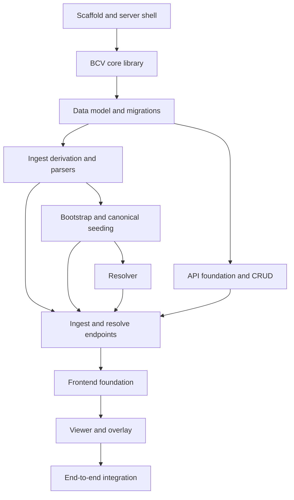

# Versification Viewer: Phased Execution Plan

**Status:** Ready for implementation
**Audience:** The coding agent (and reviewers) implementing the FRVT-3 versification viewer end to end.
**Scope:** Build the full application described by the four authoritative FRVT-3 specs — PostgreSQL database, FastAPI backend, in-process resolver and ingest modules, and the React/Vite UI — under a new repo-root `frvt/` directory.

## How to use this document

- The four documents in `.spec` are **authoritative**. Everything in `research/` (POC, standards, prototype) is **supporting only** and must not override a spec.
  - [frvt-3-resolver-requirements-1.md](./requirements/frvt-3-resolver-requirements-1.md) — requirements and assumption ids (A1–A27).
  - [frvt-3-resolver-and-etl-spec-1.md](./frvt-3-resolver-and-etl-spec-1.md) — resolver + ingest algorithms, contracts, test plan.
  - [frvt-3-server-and-api-spec-1.md](./frvt-3-server-and-api-spec-1.md) — server, database, HTTP API.
  - [frvt-3-ui-spec-1.md](./frvt-3-ui-spec-1.md) — React frontend.
  - [frvt-3-spec-reconciliation-decisions-1.md](./frvt-3-spec-reconciliation-decisions-1.md) — cross-document reconciliation (provenance).
- Work the phases **in order**. Each phase has an explicit **Acceptance** gate; do not start a later phase until the current one's tests and quality gates pass.
- Cite spec sections (not this plan) when making policy decisions in code.

> **Rule 12 — read first.** The phase numbers and any identifiers in this plan are planning scaffolding. They must **never** appear in produced source code, comments, configuration, commit messages, migration names, or runtime strings. Name modules and symbols for what they do, not for the phase that created them.

---

## Global conventions (apply to every phase)

These bind the generated code to the project rules and the specs' cross-cutting sections ([server §10](./frvt-3-server-and-api-spec-1.md), [UI §11](./frvt-3-ui-spec-1.md)).

- **Never commit or push.** The user reviews every change before it is shared (Rule 11).
- **Logging** ([server §5.6, §10.2](./frvt-3-server-and-api-spec-1.md)): use the shared `frvt` logger with a custom `TRACE` level (numeric 5). Public backend method entry logs at `DEBUG` with troubleshooting args; caught exceptions log at `ERROR` with `exc_info=True` before mapping to the error envelope; getter-style reads log at `TRACE`. The logging APIs check level before formatting, so pass format args rather than pre-building strings (only guard manually when constructing a genuinely large string inline).
- **Orienting comments** (Rule 4): every new field and non-overriding method at every access level carries a short comment explaining why it exists and when/how to use it. Contract-style comments for interfaces/abstract declarations; high-level implementation notes for implementations.
- **Testing** (Rule 3, [server §10.3](./frvt-3-server-and-api-spec-1.md)): cover happy paths and essential failure cases for behavior that carries a contract, not implementation detail. Do **not** test thin REST handlers that only delegate, DTO/model construction and accessors, or fetch wrappers that only forward arguments. Remove such tests if they appear.
- **Reuse** (Rule 6): shared concerns live in exactly one place — the settings object, the DB session dependency, the logging module, the error envelope, and the two ports. Routers, models, and components reuse these.
- **Modern idioms** (Rules 7–8): typed SQLAlchemy 2.0 declarative models, Pydantic v2, `dataclasses`, comprehensions/generator expressions over manual loops, and small parameter objects/DTOs instead of long argument lists.
- **Size and arguments** (Rules 9–10): source files ≤600 lines desirable / 1000 hard; named arguments ≤6 desirable / 10 hard. Decompose or introduce a parameter object before crossing these.

## Tooling, quality gates, and verification (apply to every phase)

- **Quality gates are part of every phase's Acceptance**, not just passing tests:
  - Python: `ruff` (lint), `mypy` (type-check), and `black` (format check) pass clean on changed code. Config lives in `frvt/pyproject.toml`; dev tools are pinned in `frvt/requirements-dev.txt`.
  - TypeScript: `tsc --noEmit` (type-check), `eslint` (lint), and `prettier --check` (format) pass clean. Config lives under `frvt/web/`.
- **Test database strategy** (DB-backed work): tests run against a **dockerized PostgreSQL** using a **dedicated test database** (a separate `DATABASE_URL`/settings override). Provide `frvt/tests/conftest.py` with:
  - a **session-scoped** engine that applies migrations once, and
  - a **function-scoped** session bound to a transaction that **rolls back after each test** (use nested `SAVEPOINT`s for code that commits), so tests are isolated and repeatable.
  - Pure logic (BCV grammar, ingest derivation/parsers, UI `drawPlan`) is tested without a database.
- **Seeding placement (decided):** canonical seeding runs as an **idempotent startup step** keyed by case-insensitive name — not an Alembic data migration — so migrations stay pure-schema and seeding is re-runnable and testable.
- **Frontend approach (decided):** build `frvt/web/` **fresh** with **npm** (`package-lock.json`). The prototype at `research/prototypes/frontier_web/` is a **visual/porting reference only**; leave it untouched and do **not** import its types (they predate the reconciled contract). Mirror [server §7.2](./frvt-3-server-and-api-spec-1.md) instead.

---

## Reference-asset map

Concrete inputs available in the repo. Verify paths at implementation time.

- **Sample projects (Path A ingest, viewer demo):** `research/SampleTranslations/*.zip` — six real Paratext/DBL-style bundles. Verified layout: `metadata.xml` (name/language under `<identification>`), `release/USX_1/*.usx` (USX 3.0 with `<verse ... sid/> ... <verse eid/>` milestones), and `release/versification.vrs` (a `maxVerses` book table plus `=` mapping lines).
- **Canonical Copenhagen ingredients (bootstrap):** `research/CopenhagenFormat/{org,eng,lxx,rso,rsc,vul}.json`. Package these as importable resources inside `frvt/` so seeding is independent of the working directory. `eng.json` carries `maxVerses` + `mappedVerses` (e.g. `PSA 3:0-8` → `PSA 3:1-9`, `GEN 31:55` → `GEN 32:1`); `validated.json` additionally exercises `partialVerses`, `mergedVerses`, `excludedVerses`, and `verification`.
- **Schema + standalone VRS (upload tests):** `research/CopenhagenFormat/versification_schema.json`; `research/ParatextFormat/*.vrs`.

---

## Target `frvt/` layout

Matches [server §9](./frvt-3-server-and-api-spec-1.md) and [UI §10](./frvt-3-ui-spec-1.md). Split any module that approaches the size limits rather than letting it grow.

```text
frvt/
  api/
    main.py              # app bootstrap, middleware, static mount, router include, startup seed hook
    config.py            # Pydantic BaseSettings
    auth.py              # HTTP Basic middleware
    db.py                # engine, session factory, get_session dependency
    errors.py            # error envelope, exception handlers, code vocabulary
    logging_config.py    # shared logger with TRACE level
    bootstrap.py         # idempotent canonical seeding
    ports/
      resolver_port.py   # adapter over frvt.resolver (scheme selection, structured coords, seq)
      ingest_port.py     # adapter over frvt.ingest (persist parsed results in one transaction)
    routers/
      translations.py  spans.py  versifications.py  associations.py
      ingest.py  resolve.py  navigation.py  health.py
    schemas/             # Pydantic request/response models (server §7.2)
    models/              # SQLAlchemy models (server §6)
  resolver/
    __init__.py  types.py  parse_ref.py  cover.py  chains.py  compose.py  resolve.py
  ingest/
    __init__.py  types.py  project_zip.py  usx_parse.py  usfm_convert.py
    vrs_convert.py  burrito_validate.py  derive_mappings.py  ingest_api.py
  resources/             # packaged canonical Copenhagen ingredients for seeding
  web/                   # React + Vite SPA; build output in web/dist/ is served by FastAPI
  migrations/            # Alembic env + versions
  tests/                 # pytest (conftest with test-DB fixtures)
  pyproject.toml  requirements.txt  requirements-dev.txt
  docker-compose.yml  .env.example  alembic.ini
```

---

## Dependency-ordered phases



Each phase's **Acceptance** is verifiable on its own or with earlier phases. "Done" means the phase's tests **and** the Python/TS quality gates pass clean.

### Phase 0 — Repo scaffold and running server shell

**Goal:** a bootable, authenticated FastAPI process on a dockerized Postgres, with the test harness and quality gates wired.

- Create the `frvt/` tree above plus `requirements.txt`, `requirements-dev.txt`, `pyproject.toml` (ruff/mypy/black config), `docker-compose.yml` (Postgres 15, container `5432` → host `5433`), `.env.example`, `alembic.ini`, and an empty `migrations/` env. Pin dependency lower bounds per [server §4.1](./frvt-3-server-and-api-spec-1.md).
- Implement: settings object (`BaseSettings`, [§5.2](./frvt-3-server-and-api-spec-1.md) variables), logging module with `TRACE` ([§5.6](./frvt-3-server-and-api-spec-1.md)), HTTP Basic middleware using `secrets.compare_digest` + `WWW-Authenticate` ([§5.3](./frvt-3-server-and-api-spec-1.md)), the uniform error envelope + exception handlers + fixed `code` vocabulary ([§5.4](./frvt-3-server-and-api-spec-1.md)), DB engine/session dependency (`get_session`, commit on success / rollback on error), `GET /api/health` with a DB ping (`200` ok / `503` when down, [§7.10](./frvt-3-server-and-api-spec-1.md)), and a static-file mount placeholder after the API routes ([§5.5](./frvt-3-server-and-api-spec-1.md)).
- Add `tests/conftest.py` with the dockerized test-DB fixtures (session-scoped migrated engine, function-scoped rollback session) described in the Tooling section, and wire pytest, ruff, mypy, black.

**Acceptance:** `docker compose up` starts Postgres; the server boots; `GET /api/health` returns `{"status":"ok"}` and returns `503` when the DB is unavailable; an unauthenticated request returns `401` with a `WWW-Authenticate` challenge (including `/docs`); the (currently minimal) test suite and ruff/mypy/black all run clean.

### Phase 1 — BCV core library (pure)

**Goal:** the shared reference grammar used by ingest derivation and the resolver.

- Implement `resolver/types.py` (`VerseId`, `RefRange`) and `resolver/parse_ref.py` helpers `parse_ref`, `expand`, `format_bcv`, `covers`, `index_in_range` per [resolver §4](./frvt-3-resolver-and-etl-spec-1.md). Grammar is `bcv` (`^[A-Z1-6]{3} [0-9]+:[0-9]+$`) and `bcvRange` (`...(-[0-9]+)?$`); verse `0` is valid; **parts are never in the string** and cross-chapter ranges are invalid — both raise `ReferenceError`.

**Acceptance:** unit tests cover bcv/bcvRange parse, verse 0, `expand` of a range to member verses, `covers`/`index_in_range`, and the invalid cases (part suffix like `SIR 36:13a`, cross-chapter range, `end < start`).

### Phase 2 — Data model and migrations

**Goal:** the relational schema and ORM models.

- SQLAlchemy 2.0 typed declarative models for `translation`, `verse_span`, `versification_scheme`, `translation_versification`, `mapping_record`, and the `relation_type` enum per [server §6](./frvt-3-server-and-api-spec-1.md). Include: unique `(translation_id, book, chapter, verse, part)` (null vs non-null `part` are distinct rows), unique `(translation_id, seq)`, the **partial** unique index on `translation_id where preferred`, FK delete rules (`RESTRICT` on `versification_scheme.based_on_id` and `translation_versification.scheme_id`; `CASCADE` on spans and associations), unique case-insensitive `translation.name`, and indexes `(scheme_id, source_ref)`, `(scheme_id, relation)`, `(translation_id, book, chapter)`.
- Author the initial Alembic migration. **Caveat:** autogenerate does not reliably emit the partial unique index or nullable-part uniqueness — hand-write and verify these.

**Acceptance:** the migration applies cleanly to Postgres and downgrades; constraints/indexes exist (inspect `information_schema`); a duplicate preferred association and a duplicate case-insensitive name are both rejected at the DB; models import; a smoke insert/rollback works.

### Phase 3 — Ingest derivation and parsers (pure, DB-free)

**Goal:** the ingest module callables the API will later persist ([server §8.2](./frvt-3-server-and-api-spec-1.md); [resolver §7–§8](./frvt-3-resolver-and-etl-spec-1.md)). No DB access, no commits.

- `ingest/types.py`: `ParsedSpan`, `ParsedScheme`, `IngestIssue` (`kind` ∈ `missing|invalid`), `ProjectIngestResult`, `MappingRecordDTO`.
- `derive_mappings.py`: `derive_mapping_records` per [resolver §7.1](./frvt-3-resolver-and-etl-spec-1.md), including `classify_mapped` (shift vs renumber, §7.2) and `partial` rows with the part in the dedicated column (never in the ref). `basedOn`/`maxVerses`/`verification` produce no rows.
- `usx_parse.py`: USX 3.0 → `ParsedSpan` sequence per [resolver §8.4](./frvt-3-resolver-and-etl-spec-1.md) (milestone verse pairs, document-order `seq`, drop `<note>` inner text; interim comma-verse rule: full text on first number, empty on the rest).
- `vrs_convert.py`: VRS → ingredient per [§8.3](./frvt-3-resolver-and-etl-spec-1.md) (`maxVerses` book lines, `=` mapping lines, `#` comments ignored, `basedOn` defaults to `org`); unsupported constructs → `IngestIssue(kind="invalid")`.
- `burrito_validate.py`: structural validation against the Copenhagen schema.
- `project_zip.py`: locate `release/USX_*` (required) and a `.vrs` (required); absence → `IngestIssue(kind="missing")`.
- `ingest_api.py`: `ingest_project(archive_bytes)` and `ingest_versification(file_bytes, filename)` orchestration ([§8.1–§8.2](./frvt-3-resolver-and-etl-spec-1.md)). `usfm_convert.py` is a clear fail-closed stub (out of scope; samples are USX).

**Acceptance** (using real assets, [resolver §10](./frvt-3-resolver-and-etl-spec-1.md) T7–T9, T13): derive rows from `eng.json`/`validated.json` (`PSA 3:0-8` classified `shift`; partial part lands in the `part` column; exclude/merge counts correct); VRS convert of a sample `versification.vrs` (`GEN` chapter 1 max = 31; `GEN 31:55` mapped); USX parse of a short book (e.g. `PHM.usx`) yields monotonic `seq` with non-empty verse content; a zip missing the USX tree or the `.vrs` yields `IngestIssue(kind="missing")`; an unparseable ingredient yields `kind="invalid"`.

### Phase 4 — Bootstrap and canonical seeding

**Goal:** canonical numbering-space anchors and schemes so `basedOn` lookups resolve and the resolver can walk chains on a clean install ([server §5.7](./frvt-3-server-and-api-spec-1.md), [reqs A21–A22](./requirements/frvt-3-resolver-requirements-1.md)).

- `api/bootstrap.py`: idempotent (case-insensitive name keyed) seed of anchors `org, eng, lxx, rso, rsc, vul` with `is_anchor = true`, each associated to its canonical scheme (`canonical = true`) marked `preferred`. Load ingredients from packaged `frvt/resources/` (not `research/`). Resolve `based_on_id` by name: `org` is the root (null base); the others resolve to `org`. Derive and insert `mapping_record` rows via Phase 3. Re-running never duplicates.

**Acceptance:** running the seed twice produces no duplicates; all six anchors, their canonical schemes, and derived rows exist; the `org` scheme has a null base while `eng`/`lxx`/etc. resolve to the `org` anchor; each anchor has exactly one preferred association.

### Phase 5 — Resolver (single-hop, then multi-hop and hulls)

**Goal:** the in-process resolver ([resolver §6](./frvt-3-resolver-and-etl-spec-1.md); contract [§3.1 / server §8.1](./frvt-3-server-and-api-spec-1.md)). Coordinate-only — it must never read `verse_span.content`.

- `cover.py` (covering-record lookup + range projection, §6.3–§6.4), `chains.py` (`build_chain`, shared-ancestor search, cycle guard, §6.2), `compose.py` (inverses + interim composition table, §6.5), `resolve.py` (orchestration §6.1, range expansion §6.6, `build_hull` for `complex` §6.8). Emit single-verse refs only; carry parts separately; log pivots at `TRACE` when `RESOLVE_TRACE_PIVOTS` is enabled.

**Acceptance** (fixtures against seeded `eng`/`org`, [resolver §10](./frvt-3-resolver-and-etl-spec-1.md) T1–T6, T10–T13): identity `JHN 3:16`; `shift` `PSA 3:1` → `PSA 3:2`; `GEN 31:55` → `GEN 32:1` (shift/renumber); `exclude` → empty `target_spans`; `merge` returns siblings; a `bcvRange` input does not raise and yields single-verse spans; missing ancestor raises `LookupError`; a `complex` case returns a hull with `edges` each carrying a relation; a partial resolves via the separate `part` while `parse_ref("SIR 36:13a")` raises.

### Phase 6 — API foundation and CRUD

**Goal:** the read/write CRUD surface and the shared response contracts ([server §7](./frvt-3-server-and-api-spec-1.md)).

- Pydantic models per [§7.2](./frvt-3-server-and-api-spec-1.md) (including `RelationType`, `ResolvedSpan` with structured coords, `ResolveEdge`, `NavRef`, delta/misalignment DTOs). Pagination envelope `{items, total}` with `limit`/`offset` per [§7.1](./frvt-3-server-and-api-spec-1.md).
- Routers: translations ([§7.3](./frvt-3-server-and-api-spec-1.md)), scripture spans ([§7.4](./frvt-3-server-and-api-spec-1.md), ordered by `seq`), versifications ([§7.5](./frvt-3-server-and-api-spec-1.md), detail returns `ingredient`), associations ([§7.6](./frvt-3-server-and-api-spec-1.md)) enforcing the preferred invariants (at most one preferred; make-preferred clears the prior in one transaction; the preferred association cannot be deleted). Map errors to the envelope/status table ([§5.4](./frvt-3-server-and-api-spec-1.md)).

**Acceptance** (TestClient, [§10.3](./frvt-3-server-and-api-spec-1.md)): translation CRUD incl. duplicate case-insensitive name → `409` and deleting a translation still referenced as `based_on_id` → `409`; association invariants (second preferred clears the first; making an unassociated scheme preferred → `409`; deleting the preferred → `409`, non-preferred → `204`); seeded anchors are excluded from `GET /api/translations`; error-contract cases `404` (missing id) and `413` (over `MAX_UPLOAD_BYTES`).

### Phase 7 — Ingest and resolve endpoints

**Goal:** wire the two ports and the coordinate-interpreting endpoints ([server §7.7–§7.9, §8](./frvt-3-server-and-api-spec-1.md)).

- `ingest_port`: persist `ingest_project` / `ingest_versification` results in **one transaction** (all-or-nothing), look up `basedOn` → `based_on_id` by case-insensitive name, call `derive_mapping_records` on insert, and for a project create the `preferred` association ([§8.2](./frvt-3-resolver-and-etl-spec-1.md) responsibilities). `source_format` is inferred from the zip (USX present → `usx`; USFM-only → `usfm`; both → `usx`).
- `resolver_port`: owns per-request scheme selection (the `*_versification` override validated as associated, else the preferred scheme), fills each `ResolvedSpan`'s structured `book`/`chapter`/`verse` by parsing the emitted single-verse ref, attaches `verse_span.seq`/content when a stored span exists, passes `edges` through, and maps `ReferenceError` → `400` while any residual `LookupError` → `422` ([§8.1](./frvt-3-server-and-api-spec-1.md)).
- Routers: `POST /api/ingest/project` and `POST /api/versifications/upload` ([§7.7](./frvt-3-server-and-api-spec-1.md), `missing` → `400`, `invalid` → `422`, `413` over size cap); `GET /api/resolve` with the `404`/`409`/`400`/`422` pre-check precedence ([§7.8](./frvt-3-server-and-api-spec-1.md)); `GET /api/translations/{id}/navigation`, `GET /api/resolve/deltas`, `GET /api/resolve/misalignments` with server-owned categorization (heuristics + known-divergence table) and discrete `navigation_ref`/`navigation` derivation ([§7.9](./frvt-3-server-and-api-spec-1.md)).

**Acceptance:** uploading a `research/SampleTranslations/*.zip` via the API persists translation + spans + scheme + preferred association; resolve contract tests cover `one_to_one`/`shift`/`split`/`merge`/`exclude`/`complex`, a well-formed range, a partial via the `part` param, no-shared-ancestor → `422`, an override that does not exist → `404`, an override not associated → `409`, and no preferred scheme → `409`; a project missing the `.vrs` or USX tree → `400`; an invalid ingredient → `422` with populated `errors`; a range-form jump entry yields a discrete `navigation_ref` legal as a resolve `ref`.

### Phase 8 — Frontend foundation (React + Vite)

**Goal:** the SPA shell, API client, and manage screens ([UI §5–§7, §9–§10](./frvt-3-ui-spec-1.md)).

- Scaffold `frvt/web/` with npm and Vite (`outDir = dist`). Build: `api/` client (`apiGet`/`apiSend`/`apiUpload` with `credentials: "same-origin"`), `ApiError` mapping the [§5.4](./frvt-3-server-and-api-spec-1.md) envelope, and `types.ts` mirroring [server §7.2](./frvt-3-server-and-api-spec-1.md) (structured `ResolvedSpan`, `edges`, `NavRef`, `navigation`). Router/`AppShell`; `/manage/translations` and `/manage/versifications` pages; modals for upload project/versification, rename, associate, remove association, and confirm delete ([§6.2](./frvt-3-ui-spec-1.md)); the empty-state upload flow ([§6.3](./frvt-3-ui-spec-1.md)). FastAPI serves `frvt/web/dist/`.

**Acceptance:** `vite build` emits `dist/` and FastAPI serves it behind Basic auth; the empty state shows when `translations.total === 0`; uploading a sample project lists the new translation; translation/versification CRUD, associate, and set-preferred all work against the live API; `tsc`/`eslint`/`prettier` pass.

### Phase 9 — Viewer and overlay

**Goal:** the two-column aligned viewer and SVG overlay ([UI §6–§8](./frvt-3-ui-spec-1.md)).

- `ViewerSession`: URL-param source of truth ([§7.1](./frvt-3-ui-spec-1.md)), caches keyed to include the selected versification ([§7.2](./frvt-3-ui-spec-1.md)), the resolve cycle ([§7.6](./frvt-3-ui-spec-1.md)), and the cross-chapter follower load-before-scroll ([§6.4](./frvt-3-ui-spec-1.md)). Build `ScriptureColumn`/`VerseList`/`VerseSpan` (with `data-seq`/`data-ref`/`data-part`), `ColumnChrome` (BCV selectors + per-request scheme select that never changes the preferred, [§6.5](./frvt-3-ui-spec-1.md)), `JumpMenu` (navigate only via structured `navigation`; never parse ranges, [§6.6](./frvt-3-ui-spec-1.md)), and `MappingOverlay` + `OverlayController` + `visualLanguage` + `drawPlan` covering every relation topology including the `complex` graph (one connector per `edges` entry) and `exclude` connector-to-void ([§8.2, §8.4–§8.5](./frvt-3-ui-spec-1.md)). `toResolveArgs` sends the part separately ([§7.4](./frvt-3-ui-spec-1.md)); verse 0 displays as `Title (0)`.

**Acceptance:** `drawPlan`/`visualLanguage` unit tests for each relation (direct, split branch, merge converge, exclude → void with zero target outlines, partial part-outline, `complex` with per-edge coloring, and `drive=right` edge direction); integration: driving a verse resolves and scrolls the follower with connectors drawn, the map toggle clears the overlay, a scheme switch re-resolves, and a cross-chapter resolve loads the follower chapter before scrolling.

### Phase 10 — End-to-end integration and polish

**Goal:** a working clean-install demonstration of the full POC.

- Wire the startup seed into `api/main.py`; load two sample projects; walk the full capability list (side-by-side display, navigation-driven alignment, jump menus, outlines/connectors, highlight, overlay toggle, versification switching, CRUD, ingest). Verify error envelopes, logging levels, file-size compliance, all quality gates, and consistency with the [reconciliation decisions](./frvt-3-spec-reconciliation-decisions-1.md).
- **Demo divergence:** the sample projects are largely English-versification, so identity mappings dominate. To exercise non-identity alignment, associate a sample translation with a **contrasting** canonical scheme (e.g. `org` or `lxx`) via the association API and select it per column, and/or pick two samples whose `versification.vrs` differ. Confirm the overlay renders at least one non-`one_to_one` relation.

**Acceptance:** clean-install run — `docker compose up` → startup seed → upload two projects → side-by-side view with working alignment (including a demonstrated non-identity relation), functioning jump menus, overlay toggle, and per-column versification switching; the full test suite and all quality gates are green.

---

## Deferred / out of scope

- **USFM → USX conversion** (A13): `usfm_convert` is a fail-closed stub; the sample bundles are USX.
- The specs' own interim rules stand until superseded there: the composition table and shift/renumber classifier ([resolver §6.5, §7.2](./frvt-3-resolver-and-etl-spec-1.md)), exotic multi-character part suffixes, and VRS constructs that cannot round-trip (fail closed).
- Non-viewer scripture query, versification detection/sniffer, mobile/responsive layout, and production authentication/scaling/multi-tenancy ([server §2.2](./frvt-3-server-and-api-spec-1.md), [UI §2.2](./frvt-3-ui-spec-1.md)).
