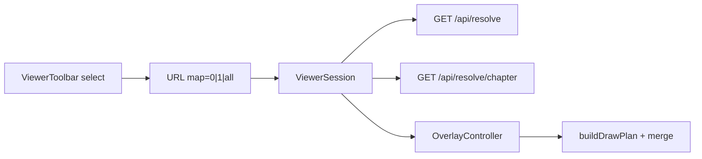

# Mapping Visibility Modes — Execution Plan

**Document:** `frvt-3-mapping-visibility-execution-plan-1`
**Status:** Ready for implementation
**Audience:** A coding agent (and reviewers) implementing a three-mode mapping overlay (hidden / current / chapter-wide with current full and others dimmed).
**Scope:** Spec amendments; new `GET /api/resolve/chapter` API; URL ternary `map=0|1|all`; overlay draw-plan dimming/merge; ViewerSession fetch; toolbar control; tests.

## How to use this document

- Work phases **in order**. Do not start phase *N+1* until phase *N* Acceptance passes.
- Product specs remain authoritative after Phase 0 amends them: [server](./frvt-3-server-and-api-spec-1.md), [UI](./frvt-3-ui-spec-1.md).
- Cite product-spec sections (not this plan) when making policy decisions in code.
- **Never commit or push** (Rule 11).

> **Rule 12 (product code).** Phase numbers and plan/workflow identifiers must **never** appear in product application code under `frvt/api`, `frvt/resolver`, `frvt/ingest`, or `frvt/web/src`. Name modules and symbols for what they do, not for the phase that created them.

---

## Locked owner decisions

| Topic | Decision |
| --- | --- |
| Modes | **`off`**: clear SVG connectors/outlines. **`current`**: paint only the current `ResolveResult` at full opacity (today’s behavior). **`chapter`**: paint every drive-chapter alignment; **current at full opacity**, **all others dimmed** |
| Control | Replace the “Show mapping” checkbox with a native `<select>` labeled **Mapping**, options **Hidden** / **Current** / **All (dimmed)**. Disabled when `!canResolve` |
| URL | Ternary `map=0\|1\|all`. Absent or unrecognized ⇒ `1` (`current`). Replace boolean `ViewerUrlState.map` with `mapMode: MapMode` |
| API | New **`GET /api/resolve/chapter`**. Do **not** overload single-ref `GET /api/resolve` (range = one hull) or reuse deltas (no `seq`/`edges`) |
| Chapter scope | Every distinct whole-verse in the **drive** translation’s current book+chapter (including identity `one_to_one`), ordered by verse number. Skip part-only rows as separate resolve keys; part annotations surface via the current single resolve when the drive verse has a part |
| Response shape | `{ items: ResolveResult[], total: int }` — one `ResolveResult` per drive verse successfully resolved; omit verses that fail resolve (log at ERROR, continue) |
| Dimming | Non-current outlines, connectors, labels, void marks, and arrowheads use SVG `opacity="0.25"`. Paint dimmed plans first, current plan last (so current sits on top) |
| Current identity | The session’s current single-verse `ResolveResult` is emphasized. Match by comparing drive-side primary coordinates `(book, chapter, verse)` of each chapter item’s first `source_spans` entry to the current result’s first `source_spans` entry (or drive BCV when result spans are empty for exclude — use drive URL BCV) |
| Highlights | Verse text `.is-highlighted` stays independent of map mode (unchanged) |
| Missing anchors | Skip undrawable endpoints (existing behavior). Cross-chapter follower targets draw only when that chapter is loaded in the follower column |
| Loading | In `chapter` mode while the chapter request is in flight (or failed), paint **current-only** at full opacity as a degraded fallback |
| Fetch gating | Fetch `/api/resolve/chapter` only when `mapMode === "chapter"` and `canResolve`. Abort in-flight chapter requests on mode/BCV/pair/scheme change. Keep the existing single `GET /api/resolve` for highlights, follower scroll, and `current` mode |

---

## Why a new endpoint (do not reinvent)



- `GET /api/resolve` with a chapter-sized range expands members then composes **one** hull — not N independent alignments.
- `GET /api/resolve/deltas` returns navigation labels without `seq`, spans, or `edges` — unsuitable for connectors.
- Client N× `/api/resolve` repeats scheme/chain work and complicates abort. A chapter endpoint loads schemes once and resolves each drive verse into overlay-native `ResolveResult`s.

---

## Global conventions (every phase)

- **Logging** ([server §5.6, §10.2](./frvt-3-server-and-api-spec-1.md)): public backend entry at `DEBUG`; caught exceptions at `ERROR` with `exc_info=True`; getter-style reads at `TRACE`. Pass format args; do not pre-build large strings.
- **Orienting comments** (Rule 4): every new field and non-overriding method gets a short comment on why it exists and when/how to use it.
- **Testing** (Rule 3): happy paths and essential failure contracts only. Do **not** test thin REST handlers that only delegate, DTO accessors, or fetch wrappers that only forward arguments.
- **Reuse** (Rule 6): reuse `resolve_reference` / `_to_result` / scheme selection from [`frvt/api/ports/resolver_port.py`](../frvt/api/ports/resolver_port.py); reuse `Page`-style `{items, total}` envelope patterns from [`frvt/api/schemas`](../frvt/api/schemas/__init__.py).
- **Size / arguments** (Rules 9–10): keep files ≤600 lines desirable / 1000 hard. If [`OverlayController.ts`](../frvt/web/src/viewer/overlay/OverlayController.ts) grows past comfort after paint opacity work, extract `paintPlan` (+ helpers) into `frvt/web/src/viewer/overlay/paintPlan.ts`.
- **Do not** import from `research/prototypes/` (visual reference only).
- Quality gates on changed code: Python `ruff` / `mypy` / `black`; TypeScript `tsc --noEmit` / `eslint` / `prettier --check`.

---

## Phases

### Phase 0 — Spec amendments

Amend product specs so implementation cites contracts, not this plan.

**UI** — [`frvt-3-ui-spec-1.md`](./frvt-3-ui-spec-1.md):

1. Capability table row 8: three-mode Mapping control; `current` uses one `ResolveResult`; `chapter` uses chapter API with dimming.
2. Goals / overview text that says “current alignment only” — update to allow `chapter` mode.
3. §5.4 URL table: replace `map` `1|0` with `map` `0|1|all` (absent ⇒ `1`). Document default `current`.
4. §8.2 toggle paragraph: describe `off` / `current` / `chapter` behavior, dimming opacity `0.25`, text highlight independence.
5. Module / toolbar mentions of “map toggle” checkbox → Mapping `<select>`.

**Server** — [`frvt-3-server-and-api-spec-1.md`](./frvt-3-server-and-api-spec-1.md):

1. Capability table row 8: overlay modes; cite both `GET /api/resolve` and `GET /api/resolve/chapter`.
2. New endpoint subsection (near §7.8):

| Method | Path | Query | Response |
| --- | --- | --- | --- |
| `GET` | `/api/resolve/chapter` | `from_translation`, `to_translation`, `book`, `chapter`, optional `from_versification`, `to_versification` | `200` `{ items: ResolveResult[], total }` |

Contract notes to include in the server spec:

- Same scheme-selection / `404` / `409` pre-checks as single resolve.
- Enumerate distinct whole verses (`part IS NULL` / no part) for `from_translation` in `(book, chapter)` via `verse_span`, ordered by `verse`.
- Resolve each verse with the same coordinate resolver path as single resolve (no `part` query for chapter items).
- On per-verse resolve failure: log ERROR, skip that verse, continue (partial success). Empty chapter ⇒ `{ items: [], total: 0 }`.
- Do **not** change single-ref `/api/resolve` semantics.

**Test plan** — [`frvt-3-test-plan-viewer-and-overlay-1.md`](./frvt-3-test-plan-viewer-and-overlay-1.md) (wording only in this phase is optional; full case rewrites land in Phase 6): note that TC-OVERLAY-001 / TC-OVERLAY-012 will be revised so `map=1` remains current-only and `map=all` is the chapter-wide path.

**Acceptance:** amended wording present in UI + server specs; no product code required.

---

### Phase 1 — URL `MapMode` (pure frontend)

Replace boolean map state with a ternary mode. No overlay or API changes yet.

**Touch:**

- [`frvt/web/src/viewer/viewerUrl.ts`](../frvt/web/src/viewer/viewerUrl.ts)
- [`frvt/web/src/viewer/viewerUrl.test.ts`](../frvt/web/src/viewer/viewerUrl.test.ts)
- Call sites that read/write `url.map` / `setMapEnabled` must compile: temporarily map `MapMode` through adapters **or** update session/toolbar/workspace in the same phase to the new type while keeping UX as a checkbox wired only to `off`/`current` until Phase 5. Prefer updating the type everywhere and keeping a checkbox that sets `off`↔`current` only (ignore `chapter` in UI until Phase 5) so TypeScript stays green.

**Implement:**

```ts
/** Overlay visibility mode encoded in the ``map`` URL param. */
export type MapMode = "off" | "current" | "chapter";
```

- `ViewerUrlState.mapMode: MapMode` (remove `map: boolean`).
- Parse: `map=0` → `off`; `map=all` → `chapter`; anything else / absent → `current`.
- Serialize: always emit `map=0|1|all`.
- Replace `setMapEnabled(boolean)` with `setMapMode(MapMode)` on the session API (or keep a thin boolean helper that only toggles `off`/`current` until Phase 5 — prefer `setMapMode` only).

**Acceptance:**

- Unit tests: round-trip `0` / `1` / `all`; absent defaults to `current`; unknown value defaults to `current`.
- `tsc` / eslint / prettier clean for touched files.
- Existing e2e that use `map=0`/`map=1` still parse correctly (no `chapter` UI yet).

---

### Phase 2 — Pure overlay dim + merge

Extend the draw-plan model so chapter mode can compose many alignments without DOM.

**Touch:**

- [`frvt/web/src/viewer/overlay/drawPlan.ts`](../frvt/web/src/viewer/overlay/drawPlan.ts)
- [`frvt/web/src/viewer/overlay/drawPlan.test.ts`](../frvt/web/src/viewer/overlay/drawPlan.test.ts)

**Implement:**

1. Add optional `opacity?: number` on `OutlinePlan` and `ConnectorPlan` (default full / omit ⇒ painter treats as `1`).
2. Keep `buildDrawPlan(result, anchors, mapEnabled)` behavior for a single result (opacity unset = full).
3. Add:

```ts
/** Merge per-alignment plans; non-emphasized plans get dimOpacity. */
export function mergeDrawPlans(
  plans: DrawPlan[],
  options: { emphasizeIndex: number | null; dimOpacity?: number },
): DrawPlan;
```

- Default `dimOpacity` = `0.25`.
- For each plan index ≠ `emphasizeIndex`, set `opacity` on every outline and connector.
- Emphasized plan leaves opacity unset (full).
- Concatenate: all dimmed plans’ outlines/connectors first, then the emphasized plan’s (so paint order favors current).
- If `emphasizeIndex` is `null`, dim all plans.

4. Unit tests with fixture `ResolveResult`s / synthetic `DrawPlan`s: merge ordering, opacity application, empty input, single plan emphasize.

**Do not** change `OverlayController` paint yet — that is Phase 5. Pure functions only.

**Acceptance:** vitest green for merge + opacity contracts; no DOM; file stays under size limits.

---

### Phase 3 — Chapter resolve API

**Touch:**

- [`frvt/api/schemas/__init__.py`](../frvt/api/schemas/__init__.py) — e.g. `ChapterResolveOut` with `items: list[ResolveResult]`, `total: int` (or reuse `Page[ResolveResult]` if generics already export cleanly)
- [`frvt/api/ports/resolver_port.py`](../frvt/api/ports/resolver_port.py) — `resolve_chapter(...)` helper
- [`frvt/api/routers/resolve.py`](../frvt/api/routers/resolve.py) — `GET /api/resolve/chapter`
- Tests: prefer a focused module such as [`frvt/tests/test_api_resolve_chapter.py`](../frvt/tests/test_api_resolve_chapter.py) (or extend existing resolve API tests). Use existing synthetic / eng–org fixtures from [`frvt/testops/fixtures/`](../frvt/testops/fixtures/).

**Implement `resolve_chapter`:**

1. `DEBUG` log entry with translation ids, book, chapter.
2. `require_translation` both sides; `selected_scheme_ref` both sides (same as `resolve_reference`).
3. Query distinct whole-verse numbers for `from_translation` where `book`/`chapter` match and part is null, ordered ascending.
4. For each verse, build ref via existing BCV helpers (`format` / `parse_ref` patterns already used server-side), call the same resolve+enrich path as single resolve **reusing already-selected `SchemeRef`s** (do not re-run scheme lookup per verse).
5. Per-verse `ReferenceError` / `LookupError` / unexpected failure: log `ERROR` with `exc_info=True`, skip, continue.
6. Return `{ items, total: len(items) }`.

**HTTP:**

- Query params: `from_translation`, `to_translation`, `book`, `chapter` (int ≥ 1), optional `*_versification`.
- Auth and error envelope unchanged.
- Invalid book/chapter: follow existing patterns (`400` for bad input where applicable).

**Acceptance:**

- Happy path: known paired translations + chapter with multiple verses → `items.length` matches resolvable whole verses; each item is a valid `ResolveResult` with enriched `seq` when spans exist.
- Essential failure: missing translation → `404`; no preferred scheme → `409` (same as single resolve).
- ruff / mypy / black clean.
- Existing single-resolve tests still green.

---

### Phase 4 — Client fetch + ViewerSession

**Touch:**

- [`frvt/web/src/api/types.ts`](../frvt/web/src/api/types.ts) — `ChapterResolveOut` (or `Page<ResolveResult>`)
- [`frvt/web/src/api/resolve.ts`](../frvt/web/src/api/resolve.ts) — `resolveChapter(...)`
- [`frvt/web/src/viewer/ViewerSession.tsx`](../frvt/web/src/viewer/ViewerSession.tsx)
- Session/unit tests as appropriate (mode gating; abort). Avoid testing thin `apiGet` wrappers.

**Implement:**

1. `resolveChapter({ fromTranslation, toTranslation, book, chapter, fromVersification?, toVersification? }, options?)` → `GET /api/resolve/chapter`.
2. Session state: `chapterResolveItems: ResolveResult[] | null` (or empty array when loaded empty), `chapterResolveLoading: boolean`.
3. Effect: when `url.mapMode === "chapter"` and `canResolve` and drive BCV present, fetch with `AbortController`; clear/abort when mode leaves `chapter` or inputs change.
4. Keep existing single-resolve effect unchanged (always runs when resolvable — needed for highlights/scroll and for emphasizing “current”).
5. Expose chapter items + loading on `ViewerSessionValue` for the workspace/overlay.

**Acceptance:**

- Mode `current` / `off`: no chapter request (verify via test double or spy if a session test harness exists; otherwise manual check + ensure effect deps gate correctly).
- Mode `chapter`: request fires; abort on drive chapter change; stale responses ignored.
- `tsc` / eslint clean.

---

### Phase 5 — OverlayController + toolbar + workspace

Wire modes end-to-end.

**Touch:**

- [`frvt/web/src/viewer/overlay/OverlayController.ts`](../frvt/web/src/viewer/overlay/OverlayController.ts) (+ extract [`paintPlan.ts`](../frvt/web/src/viewer/overlay/paintPlan.ts) if needed)
- [`frvt/web/src/viewer/overlay/OverlayController.test.ts`](../frvt/web/src/viewer/overlay/OverlayController.test.ts)
- [`frvt/web/src/viewer/overlay/MappingOverlay.tsx`](../frvt/web/src/viewer/overlay/MappingOverlay.tsx)
- [`frvt/web/src/viewer/ViewerWorkspace.tsx`](../frvt/web/src/viewer/ViewerWorkspace.tsx)
- [`frvt/web/src/viewer/ViewerToolbar.tsx`](../frvt/web/src/viewer/ViewerToolbar.tsx)
- [`frvt/web/src/styles/app.css`](../frvt/web/src/styles/app.css) — restyle `.map-toggle` for a select if needed
- Call-site updates in viewer state tests / e2e selectors

**Overlay model:**

```ts
export interface OverlayModel {
  /** Current single-verse resolve (highlights / emphasize key). */
  result: ResolveResult | null;
  /** Chapter alignments when mapMode is chapter; otherwise ignored. */
  chapterResults: ResolveResult[] | null;
  /** URL map mode. */
  mapMode: MapMode;
  driveSide: DriveSide;
}
```

**Redraw rules:**

| `mapMode` | Behavior |
| --- | --- |
| `off` | `clearSvg` |
| `current` | Require `result`; `buildDrawPlan(result, …)`; paint full opacity |
| `chapter` | If `chapterResults` non-null and non-empty: measure **union** of all `source_spans`/`target_spans` across items; `buildDrawPlan` each; `mergeDrawPlans` with emphasize index of the item matching current (see Locked decisions); paint. If chapter data missing/empty: fall back to current-only full paint when `result` exists |

**Paint:** honor `opacity` on outlines/connectors (and matching void circle / label / marker). Arrow markers for dimmed strokes should also be dimmed (group opacity on path+marker use, or set marker fill with opacity — simplest reliable approach: set `opacity` attribute on each painted element including labels and void circles).

**Measure:** extend `measureColumn` inputs to the union of spans from all results being drawn (not only `result`).

**Toolbar:**

```tsx
<label className="map-toggle">
  Mapping
  <select
    aria-label="Mapping"
    value={session.url.mapMode}
    disabled={!session.canResolve}
    onChange={(e) => session.setMapMode(e.target.value as MapMode)}
  >
    <option value="off">Hidden</option>
    <option value="current">Current</option>
    <option value="chapter">All (dimmed)</option>
  </select>
</label>
```

Update any tests that used `getByLabelText(/show mapping/i)` to `getByLabelText(/^mapping$/i)` or equivalent.

**Acceptance:**

- `map=0`: SVG cleared; verse highlight still present (manual or e2e in Phase 6).
- `map=1`: connectors for current alignment only (regression of prior checkbox-on).
- `map=all` with chapter data: multiple connectors; non-current paths/outlines at opacity 0.25; current at full opacity.
- Controller unit tests cover clear / single / merge emphasize if practical without full DOM layout; otherwise rely on drawPlan tests + e2e.
- Quality gates clean.

---

### Phase 6 — E2E, test-plan sync, gate wrap-up

**Touch:**

- [`frvt/web/e2e/overlay.spec.ts`](../frvt/web/e2e/overlay.spec.ts), [`frvt/web/e2e/viewer.spec.ts`](../frvt/web/e2e/viewer.spec.ts)
- [`frvt-3-test-plan-viewer-and-overlay-1.md`](./frvt-3-test-plan-viewer-and-overlay-1.md)
- Coverage matrix under [`.test/`](../.test/) if a map/overlay row exists

**Test plan updates:**

- **TC-OVERLAY-001** — Hidden clears; Current draws current only (`map=0` / `map=1`).
- **TC-OVERLAY-012** — **Replace** “chapter-wide absent” with: `map=all` draws multiple chapter connectors; current full / others dimmed; `map=1` still current-only.
- **TC-OVERLAY-006** — Highlight independent of Mapping select (all three modes).
- Defaults case (`TC-UI-032` or equivalent): default `map=1` / Current.
- Add API cases for chapter resolve in the API/resolve test plan if one lists resolve endpoints (happy + 404/409).

**E2E:**

- Select Hidden → no `svg.mapping-overlay path` (or empty svg children aside from possible empty state).
- Select Current → at least one path for a known mapped verse.
- Select All (dimmed) → more than one path in a chapter with multiple resolvable verses; assert at least one element with `opacity="0.25"` and at least one without (full current).
- Disabled Mapping select when only one translation.

**Acceptance:**

- Updated e2e green against local stack.
- Product + test-plan docs consistent with shipped behavior.
- Full quality gates on touched Python and TypeScript clean.
- No commits/pushes.

---

## Touch-point index

| Artifact | Role |
| --- | --- |
| `.spec/frvt-3-ui-spec-1.md` | Mode / URL / overlay contract |
| `.spec/frvt-3-server-and-api-spec-1.md` | Chapter resolve HTTP contract |
| `.spec/frvt-3-test-plan-viewer-and-overlay-1.md` | Overlay test cases |
| `frvt/api/schemas/__init__.py` | `ChapterResolveOut` / page envelope |
| `frvt/api/ports/resolver_port.py` | `resolve_chapter` batch helper |
| `frvt/api/routers/resolve.py` | `GET /api/resolve/chapter` |
| `frvt/tests/test_api_resolve_chapter.py` | Chapter API contracts |
| `frvt/web/src/api/resolve.ts` | Client `resolveChapter` |
| `frvt/web/src/api/types.ts` | Shared DTOs |
| `frvt/web/src/viewer/viewerUrl.ts` | `MapMode` parse/serialize |
| `frvt/web/src/viewer/ViewerSession.tsx` | Chapter fetch + session API |
| `frvt/web/src/viewer/ViewerToolbar.tsx` | Mapping `<select>` |
| `frvt/web/src/viewer/ViewerWorkspace.tsx` | Overlay props |
| `frvt/web/src/viewer/overlay/drawPlan.ts` | Opacity fields + `mergeDrawPlans` |
| `frvt/web/src/viewer/overlay/OverlayController.ts` | Multi-result redraw |
| `frvt/web/src/viewer/overlay/MappingOverlay.tsx` | Model wiring |
| `frvt/web/src/viewer/overlay/paintPlan.ts` | Optional extract if controller grows |
| `frvt/web/e2e/overlay.spec.ts` | Visibility mode e2e |

---

## Explicit non-goals

- Auto-loading follower chapters for every cross-chapter target in `chapter` mode
- Dimming or toggling verse text highlights
- Changing jump-menu deltas/misalignments APIs or cancel-filter behavior
- Canvas / WebGL overlay rewrite
- Importing or porting code from `research/prototypes/frontier_web/`
- Committing or pushing (Rule 11)

---

## Verification cheat-sheet (implementer)

After Phase 6, a reviewer should be able to:

1. Open the viewer with two associated translations.
2. Confirm Mapping defaults to **Current** and URL contains `map=1`.
3. Switch to **Hidden** → connectors gone; current verse still highlighted; URL `map=0`.
4. Switch to **All (dimmed)** → many connectors; URL `map=all`; current alignment visually stronger than neighbors.
5. Change drive verse → emphasize moves; chapter refetch for the new chapter when the chapter number changes.
6. Drop to one translation → Mapping disabled.
