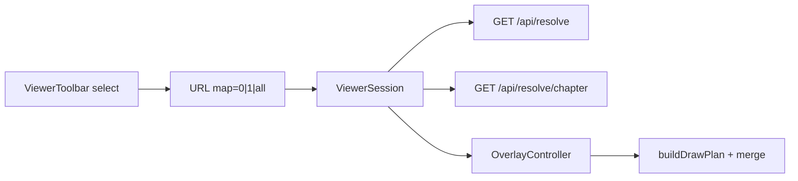

# Mapping Visibility Modes — Execution Plan

**Document:** `frvt-3-mapping-visibility-execution-plan-1`
**Status:** Ready for implementation
**Audience:** A coding agent (and reviewers) implementing a three-mode mapping overlay (hidden / current / chapter-wide with current full and others dimmed).
**Scope:** Spec addenda (UI, server, resolver cross-spec); new `GET /api/resolve/chapter` API; URL ternary `map=0|1|all`; overlay draw-plan dimming/merge; ViewerSession fetch; toolbar control; tests.

## How to use this document

- Work phases **in order**. Do not start phase *N+1* until phase *N* Acceptance passes.
- Product specs remain authoritative after Phase 0 records addenda: [server](./frvt-3-server-and-api-spec-1.md), [UI](./frvt-3-ui-spec-1.md), [resolver/ETL](./frvt-3-resolver-and-etl-spec-1.md).
- **Effective specification** = frozen main body + addenda applied in order (see [Spec modification policy](#spec-modification-policy-all-three-product-specs) below). Cite effective spec targets (main-body section **or** addendum row), not this plan, when making policy decisions in code.
- **Never commit or push** (Rule 11).

> **Rule 12 (product code).** Phase numbers and plan/workflow identifiers must **never** appear in product application code under `frvt/api`, `frvt/resolver`, `frvt/ingest`, or `frvt/web/src`. Name modules and symbols for what they do, not for the phase that created them.

---

## Spec modification policy (all three product specs)

Each product spec ([UI](./frvt-3-ui-spec-1.md), [server](./frvt-3-server-and-api-spec-1.md), [resolver/ETL](./frvt-3-resolver-and-etl-spec-1.md)) states the same **modification policy**:

- The numbered main body (everything before **Addenda**) is **frozen** and must **never** be edited.
- Post-reconciliation changes go **only** in **Addenda** at the end of each file.
- One logical change set → one addendum subsection (`### ADD-*-NNN`) with a **capability-level Purpose** (no field names or section ids in the Purpose paragraph).
- Atomic changes → **modification rows** in a table: `Mod id`, `Target` (main-body section id), `Action` (`ADD` \| `CLARIFY` \| `REPLACE` \| `REMOVE`), `Effective text`.
- Apply subsections in numeric order; within a subsection, apply rows in listed order. Later rows override earlier ones for the same target.

Phase 0 must **append** `ADD-U-002`, `ADD-S-002`, and `ADD-R-002` — not rewrite §5.4, §7.8, §8.2, capability tables, or other main-body text in place. **`ADD-R-002` is documentation-only** (Purpose + narrative; no modification rows).

The overlay test plan ([`frvt-3-test-plan-viewer-and-overlay-1.md`](./frvt-3-test-plan-viewer-and-overlay-1.md)) is **not** governed by this addenda policy; Phase 6 may edit test cases directly.

---

## Locked owner decisions

| Topic | Decision |
| --- | --- |
| Modes | **`off`**: clear SVG connectors/outlines. **`current`**: paint only the current `ResolveResult` at full opacity (today’s behavior). **`chapter`**: paint every **unique** drive-chapter alignment; **current at full opacity**, **all others dimmed** |
| Control | Replace the “Show mapping” checkbox with a native `<select>` labeled **Mapping**, options **Hidden** / **Current** / **All (dimmed)**. Disabled when `!canResolve` |
| URL | Ternary `map=0\|1\|all`. Absent or unrecognized ⇒ `1` (`current`). Replace boolean `ViewerUrlState.map` with `mapMode: MapMode` |
| API | New **`GET /api/resolve/chapter`**. Do **not** overload single-ref `GET /api/resolve` (range = one hull) or reuse deltas (no `seq`/`edges`) |
| Request direction | Same **`from_translation` / `to_translation` mapping as §7.6 single resolve**: drive column → `from_translation`, follower → `to_translation`; `book` / `chapter` are the **drive** column’s current BCV. Server walks whole verses and emits `source_spans` on the drive side — client must not pass follower BCV as the chapter scope |
| Chapter scope | Enumerate resolve keys **only** from `verse_span` rows stored for `from_translation` in the drive `(book, chapter)` — distinct whole verses (`part` null), ordered by `verse`. Do **not** infer verses from navigation, `maxVerses`, or scheme metadata. Results therefore reflect alignments for verses **currently displayable** in the drive column (same rows the UI loads), not gaps with no stored span |
| Chapter mode UX | With **`chapter`** enabled, the user can view alignments among the **currently displayed verses** in the drive column **without using the jump menu**. Jump menu remains available for cross-chapter navigation and discovery |
| Hull dedupe | **Emit-once while walking.** Resolve each verse with the same path as single resolve, then keep a result only if its **alignment fingerprint** has not been seen. Multi-span merge / split / `complex` hulls therefore appear **once** in `items`, not once per member verse. First kept emission is the lowest drive-chapter verse that hits that hull (walk order) |
| Fingerprint | Stable key over `relation` + sorted `(ref, part)` for all `source_spans` + sorted `(ref, part)` for all `target_spans` + sorted `edges` as `(source_index, target_index, relation)`. Span order in the live `ResolveResult` stays resolver order; the fingerprint sorts copies for comparison only |
| Response shape | `{ items: ResolveResult[], total: int }` — `items` are **unique** alignments after emit-once; `total == len(items)`. Per-verse resolve failures: log ERROR, skip, continue. Empty chapter ⇒ `{ items: [], total: 0 }` |
| Dimming | Non-current outlines, connectors, labels, void marks, and arrowheads use SVG `opacity="0.25"`. Paint dimmed plans first, current plan last (so current sits on top). Dimmed and full connectors must **not** share one arrow `<marker>` definition at full opacity — use opacity-specific markers or wrap each connector’s path+use in a `<g opacity="…">` |
| Current identity | Emphasize the chapter `items` entry whose `source_spans` **contain** the drive BCV `(book, chapter, verse)` (match `part` when the drive URL has a part; otherwise match the span with null/empty part, or any span on that verse if only part-bearing spans exist). Do **not** compare “first `source_spans` entry” — merge/complex sorts siblings and first ≠ queried verse. If no item contains the drive verse, emphasize none (`emphasizeIndex = null`, all dimmed) and still paint current-only fallback only when chapter data is missing — when chapter data exists but current is absent, dim all chapter items |
| Highlights | Verse text `.is-highlighted` stays independent of map mode (unchanged) |
| Missing anchors | Skip undrawable endpoints (existing behavior). Cross-chapter follower **or source-sibling** anchors draw only when that chapter is loaded in the column; partial hull geometry is acceptable |
| Loading | In `chapter` mode while the chapter request is in flight (or failed), paint **current-only** at full opacity as a degraded fallback |
| Fetch gating | Fetch `/api/resolve/chapter` only when `mapMode === "chapter"` and `canResolve`. Abort in-flight chapter requests on mode/BCV/pair/scheme change. Keep the existing single `GET /api/resolve` for highlights, follower scroll, and `current` mode |

---

## Why a new endpoint (do not reinvent)



- `GET /api/resolve` with a chapter-sized range expands members then composes **one** hull — not N independent alignments for the whole chapter.
- `GET /api/resolve/deltas` returns navigation labels without `seq`, spans, or `edges` — unsuitable for connectors.
- Client N× `/api/resolve` repeats scheme/chain work and complicates abort. A chapter endpoint loads schemes once, resolves each drive verse, and **emits each unique alignment once** so merge/split/`complex` hulls are not duplicated in the overlay.

---

## Global conventions (every phase)

- **Logging** ([server §5.6, §10.2](./frvt-3-server-and-api-spec-1.md)): public backend entry at `DEBUG`; caught exceptions at `ERROR` with `exc_info=True`; getter-style reads at `TRACE`. Pass format args; do not pre-build large strings.
- **Orienting comments** (Rule 4): every new field and non-overriding method gets a short comment on why it exists and when/how to use it.
- **Testing** (Rule 3): happy paths and essential failure contracts only. Do **not** test thin REST handlers that only delegate, DTO accessors, or fetch wrappers that only forward arguments.
- **Reuse** (Rule 6): reuse `resolve_reference` / `_to_result` / scheme selection from [`frvt/api/ports/resolver_port.py`](../frvt/api/ports/resolver_port.py); reuse `Page`-style `{items, total}` envelope patterns from [`frvt/api/schemas`](../frvt/api/schemas/__init__.py).
- **Size / arguments** (Rules 9–10): keep files ≤600 lines desirable / 1000 hard. If [`OverlayController.ts`](../frvt/web/src/viewer/overlay/OverlayController.ts) grows past comfort after paint opacity work, extract `paintPlan` (+ helpers) into `frvt/web/src/viewer/overlay/paintPlan.ts`.
- **Do not** import from `research/prototypes/` (visual reference only).
- Quality gates on changed code: Python `ruff` / `mypy` / `black`; TypeScript `tsc --noEmit` / `eslint` / `prettier --check`.

---

## Phases

### Phase 0 — Spec addenda (frozen main body unchanged)

Append addendum subsections to the three product specs. Do **not** edit numbered sections before **Addenda**. Implementation cites **effective** text (main body as modified by addenda rows), not this plan.

#### UI — [`frvt-3-ui-spec-1.md`](./frvt-3-ui-spec-1.md) → `### ADD-U-002`

**Purpose (capability level):** Three-mode mapping overlay visibility — hidden, current alignment only, and chapter-wide unique alignments with the drive verse emphasized and others dimmed. In chapter mode, the user sees alignments among currently displayed verses without opening the jump menu.

| Mod id | Target | Action | Effective text (summary — expand when writing the spec) |
| --- | --- | --- | --- |
| ADD-U-002a | §1 (overview resp. 2) | REPLACE | Overlay draws in three modes, not “current only”: hidden clears SVG; current paints one `ResolveResult`; chapter paints unique alignments for **currently displayed** drive-column verses via the chapter API (dimmed except current). Chapter mode does **not** require the jump menu. |
| ADD-U-002b | §2.1 | CLARIFY | Mapping control is a three-option `<select>` labeled **Mapping**, not a boolean checkbox. |
| ADD-U-002c | §2.3 row 8 | REPLACE | Capability 8: three-mode Mapping control (`Hidden` / `Current` / `All (dimmed)`). `current` → `GET /api/resolve`; `chapter` → `GET /api/resolve/chapter` + dimming — user views in-column alignments without jump menu. Disabled when `!canResolve`. |
| ADD-U-002d | §3.2 (Mapping toggle) | REPLACE | Three modes: `off` clears overlay; `current` draws the current alignment only; `chapter` draws **unique** alignments for verses **currently displayed** in the drive column (from stored `verse_span` rows; not jump-menu deltas). Text highlight stays on in all modes. Jump menu is optional for chapter-mode viewing. |
| ADD-U-002e | §7.1 `map` | REPLACE | `map` is `0` \| `1` \| `all`. Absent or unrecognized ⇒ `1` (`current`). Serialize always as `map=0\|1\|all`. |
| ADD-U-002f | §7.2 | ADD | Session caches chapter resolve: `chapterResolveItems`, `chapterResolveLoading`; fetch gated on `mapMode === "chapter"` and `canResolve`; abort on mode/BCV/pair/scheme change. |
| ADD-U-002g | §7.6 | ADD | Chapter fetch uses the same drive→from / follower→to mapping as single resolve; `book`/`chapter` are the **drive** column’s BCV. |
| ADD-U-002h | §8.2 (toggle paragraph) | REPLACE | `off` / `current` / `chapter` behavior; `chapter` paints alignments visible among currently displayed drive-column verses (unique hulls, current emphasized); dim non-current outlines/connectors/labels/void marks at SVG opacity `0.25`; paint dimmed plans first, current last; no duplicate hull paint after server emit-once; highlights independent of map mode; no jump-menu interaction required. |
| ADD-U-002i | §8.4 | REPLACE | Redraw gate covers three modes; chapter path merges multiple `DrawPlan`s; triggers include Mapping select change (not only boolean toggle). |
| ADD-U-002j | §9.2 row 5 | REPLACE | **Supersedes** “current only; other verses via jump menu”: `map=1` stays current-only. **`map=all` (chapter mode)** lets the user view alignments among currently displayed verses **without** the jump menu, via `GET /api/resolve/chapter` (not deltas). Jump menu remains for cross-chapter navigation and discovery outside chapter overlay mode. |
| ADD-U-002k | §9.3 (Resolve + overlay) | REPLACE | Lists `GET /api/resolve` and `GET /api/resolve/chapter`. |
| ADD-U-002l | §11.3 | ADD | Contract tests: `MapMode` URL round-trip; `mergeDrawPlans` / `indexOfDriveAlignment` (including drive verse in non-first `source_spans`); three-mode overlay behavior; do not test thin fetch wrappers. |
| ADD-U-002m | §13 (glossary **Current alignment**) | CLARIFY | In `chapter` mode, “current” is the emphasized alignment whose `source_spans` contain the drive BCV (+ part when set), not necessarily the only painted alignment. |
| ADD-U-002n | §6.3, §6.4, §10 layout | CLARIFY | “Map toggle” / checkbox wording → Mapping `<select>`; disable the select (not merely hide) when `!canResolve`. |

Emphasize rule (must appear in ADD-U-002h or a dedicated row): chapter item whose `source_spans` **contain** the drive `(book, chapter, verse)` (+ part when set); never compare only `[0]` on merge/complex hulls.

#### Server — [`frvt-3-server-and-api-spec-1.md`](./frvt-3-server-and-api-spec-1.md) → `### ADD-S-002`

**Purpose:** Batch chapter resolve endpoint returning unique alignments for overlay chapter mode, scoped to stored verse spans, without changing single-reference resolve semantics.

| Mod id | Target | Action | Effective text (summary — expand when writing the spec) |
| --- | --- | --- | --- |
| ADD-S-002a | §2.3 row 8 | REPLACE | Overlay data: `GET /api/resolve` (current) and `GET /api/resolve/chapter` (unique alignments for stored drive-column verses in the requested chapter). |
| ADD-S-002b | §7.2 | ADD | Response envelope `ChapterResolveOut` (or `Page[ResolveResult]`): `{ items: ResolveResult[], total: int }`; `total === len(items)` after dedupe. |
| ADD-S-002c | §7.8 | ADD | **`GET /api/resolve/chapter`** — query: `from_translation`, `to_translation`, `book`, `chapter`, optional `from_versification`, `to_versification`. Same scheme-selection / `404` / `409` pre-checks as single resolve. **Verse enumeration:** query distinct whole-verse numbers (`part IS NULL`) from **`verse_span` rows only** for `from_translation` in `(book, chapter)`, ordered by `verse`. Do **not** use navigation, `maxVerses`, or other inferred verse lists — results reflect only verses that exist in the DB and match what the UI can display. Resolve each with the same port path as single resolve (no `part` param). **Emit-once** by alignment fingerprint (Locked decisions). Per-verse failure: log ERROR, skip, continue. Empty chapter / no spans ⇒ `{ items: [], total: 0 }`. **Does not** change `GET /api/resolve` semantics. |
| ADD-S-002d | §10.3 | ADD | Chapter resolve: happy path; 404/409 pre-checks; **emit-once** regression for merge/split/`complex` hulls in one chapter; partial per-verse skip; enumeration limited to stored `verse_span` rows (no navigation-derived verses). Lives in e.g. `test_api_resolve_chapter.py`. |
| ADD-S-002e | §8.3 | CLARIFY | UI may call the chapter endpoint for overlay chapter mode so users view in-column alignments without the jump menu; resolver port is invoked repeatedly, not extended. |

Include the endpoint table from Locked decisions in ADD-S-002c effective text.

#### Resolver / ETL — [`frvt-3-resolver-and-etl-spec-1.md`](./frvt-3-resolver-and-etl-spec-1.md) → `### ADD-R-002`

**Purpose:** Cross-spec traceability for chapter batch resolve; document that the resolver package is unchanged.

**No modification rows.** Append this subsection with **Purpose and narrative only** — no modification-row table. The frozen main body and effective specification are unchanged; this addendum exists so implementers and reviewers see the API↔resolver boundary in one place.

**Narrative to include in the spec (paraphrase acceptable; keep the contracts):**

- `GET /api/resolve/chapter` (server **ADD-S-002**) is API-layer orchestration: it selects schemes once, enumerates whole-verse keys from stored `verse_span` rows, and calls the existing single-verse `resolve()` path repeatedly through the resolver port.
- The `frvt.resolver` package, `ResolutionDTO` shape, and resolution algorithms (§§5–8) are **unchanged**. Emit-once dedupe, alignment fingerprinting, and verse enumeration are **not** resolver concerns.
- Ingest and `mapping_record` derivation are unchanged.
- UI chapter mode ( **ADD-U-002** ) consumes the chapter endpoint so users can view alignments among currently displayed verses without the jump menu; that behavior does not require resolver modifications.

No ingest or `mapping_record` derivation changes.

#### Test plan (optional note this phase)

[`frvt-3-test-plan-viewer-and-overlay-1.md`](./frvt-3-test-plan-viewer-and-overlay-1.md): optional Phase 0 note that TC-OVERLAY-001 / TC-OVERLAY-012 will be revised in Phase 6 (`map=1` current-only; `map=all` chapter-wide). Full rewrites are Phase 6.

**Acceptance:**

- `ADD-U-002` and `ADD-S-002` appended with complete modification-row tables; `ADD-R-002` appended with **Purpose + narrative only** (explicit “no modification rows” note).
- **No** edits to main-body sections before **Addenda** in any of the three product specs.
- Each addendum subsection has a capability-level **Purpose**; UI/server detail lives in modification rows; resolver detail lives in narrative only.
- Mod ids, targets, and actions follow the shared policy in UI and server addenda.
- No product code required.

---

### Phase 1 — URL `MapMode` (pure frontend)

Replace boolean map state with a ternary mode. No overlay or API changes yet.

**Touch:**

- [`frvt/web/src/viewer/viewerUrl.ts`](../frvt/web/src/viewer/viewerUrl.ts)
- [`frvt/web/src/viewer/viewerUrl.test.ts`](../frvt/web/src/viewer/viewerUrl.test.ts)
- Call sites that read/write `url.map` / `setMapEnabled` must compile: temporarily map `MapMode` through adapters **or** update session/toolbar/workspace in the same phase to the new type while keeping UX as a checkbox wired only to `off`/`current` until Phase 5. Prefer updating the type everywhere and keeping a checkbox that sets `off`↔`current` only (ignore `chapter` in UI until Phase 5) so TypeScript stays green.

**Implement:**

```ts
/** Overlay visibility mode encoded in the ``map`` URL param. */
export type MapMode = "off" | "current" | "chapter";
```

- `ViewerUrlState.mapMode: MapMode` (remove `map: boolean`).
- Parse: `map=0` → `off`; `map=all` → `chapter`; anything else / absent → `current`.
- Serialize: always emit `map=0|1|all`.
- Replace `setMapEnabled(boolean)` with `setMapMode(MapMode)` on the session API (or keep a thin boolean helper that only toggles `off`/`current` until Phase 5 — prefer `setMapMode` only).

**Acceptance:**

- Unit tests: round-trip `0` / `1` / `all`; absent defaults to `current`; unknown value defaults to `current`.
- `tsc` / eslint / prettier clean for touched files.
- Existing e2e that use `map=0`/`map=1` still parse correctly (no `chapter` UI yet).

---

### Phase 2 — Pure overlay dim + merge

Extend the draw-plan model so chapter mode can compose many alignments without DOM.

**Touch:**

- [`frvt/web/src/viewer/overlay/drawPlan.ts`](../frvt/web/src/viewer/overlay/drawPlan.ts)
- [`frvt/web/src/viewer/overlay/drawPlan.test.ts`](../frvt/web/src/viewer/overlay/drawPlan.test.ts)

**Implement:**

1. Add optional `opacity?: number` on `OutlinePlan` and `ConnectorPlan` (default full / omit ⇒ painter treats as `1`).
2. Keep `buildDrawPlan(result, anchors, mapEnabled)` behavior for a single result (opacity unset = full).
3. Add:

```ts
/** Merge per-alignment plans; non-emphasized plans get dimOpacity. */
export function mergeDrawPlans(
  plans: DrawPlan[],
  options: { emphasizeIndex: number | null; dimOpacity?: number },
): DrawPlan;

/**
 * Index of the unique chapter alignment whose source_spans contain drive BCV.
 * Returns null when none match (all plans should be dimmed).
 */
export function indexOfDriveAlignment(
  results: ResolveResult[],
  drive: { book: string; chapter: number; verse: number; part: string | null },
): number | null;
```

- Default `dimOpacity` = `0.25`.
- For each plan index ≠ `emphasizeIndex`, set `opacity` on every outline and connector.
- Emphasized plan leaves opacity unset (full).
- Concatenate: all dimmed plans’ outlines/connectors first, then the emphasized plan’s (so paint order favors current).
- If `emphasizeIndex` is `null`, dim all plans.
- `indexOfDriveAlignment` must treat merge/complex multi-span sources correctly (membership, not `[0]`).

4. Unit tests with fixture `ResolveResult`s / synthetic `DrawPlan`s: merge ordering, opacity application, empty input, single plan emphasize, **drive verse in non-first `source_spans` slot**, no match ⇒ `null`.

**Do not** change `OverlayController` paint yet — that is Phase 5. Pure functions only.

**Acceptance:** vitest green for merge + opacity + emphasize-index contracts; no DOM; file stays under size limits.

---

### Phase 3 — Chapter resolve API

**Touch:**

- [`frvt/api/schemas/__init__.py`](../frvt/api/schemas/__init__.py) — e.g. `ChapterResolveOut` with `items: list[ResolveResult]`, `total: int` (or reuse `Page[ResolveResult]` if generics already export cleanly)
- [`frvt/api/ports/resolver_port.py`](../frvt/api/ports/resolver_port.py) — `resolve_chapter(...)` helper
- [`frvt/api/routers/resolve.py`](../frvt/api/routers/resolve.py) — `GET /api/resolve/chapter`
- Tests: prefer a focused module such as [`frvt/tests/test_api_resolve_chapter.py`](../frvt/tests/test_api_resolve_chapter.py) (or extend existing resolve API tests). Use existing synthetic / eng–org fixtures from [`frvt/testops/fixtures/`](../frvt/testops/fixtures/).

**Implement `resolve_chapter`:**

1. `DEBUG` log entry with translation ids, book, chapter.
2. `require_translation` both sides; `selected_scheme_ref` both sides (same as `resolve_reference`).
3. Query distinct whole-verse numbers from **`verse_span` rows only** for `from_translation` where `book`/`chapter` match and `part IS NULL`, ordered ascending. Do **not** use navigation or `maxVerses`.
4. Maintain `seen: set[fingerprint]` and `items: list[ResolveResult]`.
5. For each verse, build ref via existing BCV helpers, call the same resolve+enrich path as single resolve **reusing already-selected `SchemeRef`s** (do not re-run scheme lookup per verse).
6. On success: compute fingerprint (Locked decisions). If fingerprint ∈ `seen`, **skip append** (emit-once). Else add fingerprint to `seen` and append the `ResolveResult`.
7. Per-verse `ReferenceError` / `LookupError` / unexpected failure: log `ERROR` with `exc_info=True`, skip, continue.
8. Return `{ items, total: len(items) }`.

Extract a small pure helper (e.g. `alignment_fingerprint(result: ResolveResult) -> hashable`) next to the port or in a tiny module so it is unit-testable without HTTP. Prefer keeping `resolve_chapter` readable; if `resolver_port.py` approaches size limits, put chapter orchestration in `frvt/api/resolve_chapter.py`.

**HTTP:**

- Query params: `from_translation`, `to_translation`, `book`, `chapter` (int ≥ 1), optional `*_versification`. Callers pass **drive** as `from_translation` and drive BCV as `book`/`chapter` (same directionality as single resolve §7.6 / UI ADD-U-002g).
- Auth and error envelope unchanged.
- Invalid book/chapter: follow existing patterns (`400` for bad input where applicable).

**Acceptance:**

- Happy path: known paired translations + chapter with multiple verses → `items` are unique alignments; `total == len(items)`.
- **Hull regression (required):** for a chapter containing a multi-span merge and/or `complex` hull, resolving every member verse must yield **one** `items` entry for that hull (not N). Assert identical fingerprint / equal span sets.
- Identity verses still appear as separate one-to-one items when they differ.
- Chapter enumeration includes only verses with stored `verse_span` rows (no navigation-inferred gaps).
- Essential failure: missing translation → `404`; no preferred scheme → `409` (same as single resolve).
- ruff / mypy / black clean.
- Existing single-resolve tests still green.

---

### Phase 4 — Client fetch + ViewerSession

**Touch:**

- [`frvt/web/src/api/types.ts`](../frvt/web/src/api/types.ts) — `ChapterResolveOut` (or `Page<ResolveResult>`)
- [`frvt/web/src/api/resolve.ts`](../frvt/web/src/api/resolve.ts) — `resolveChapter(...)`
- [`frvt/web/src/viewer/ViewerSession.tsx`](../frvt/web/src/viewer/ViewerSession.tsx)
- Session/unit tests as appropriate (mode gating; abort). Avoid testing thin `apiGet` wrappers.

**Implement:**

1. `resolveChapter({ fromTranslation, toTranslation, book, chapter, fromVersification?, toVersification? }, options?)` → `GET /api/resolve/chapter`.
2. Session state: `chapterResolveItems: ResolveResult[] | null` (or empty array when loaded empty), `chapterResolveLoading: boolean`.
3. Effect: when `url.mapMode === "chapter"` and `canResolve` and drive BCV present, fetch with `AbortController`. Build args with the **same drive→from / follower→to mapping as §7.6** (`fromTranslation` = drive column, `book`/`chapter` = drive BCV). Clear/abort when mode leaves `chapter` or inputs change.
4. Keep existing single-resolve effect unchanged (always runs when resolvable — needed for highlights/scroll and for emphasizing “current”).
5. Expose chapter items + loading on `ViewerSessionValue` for the workspace/overlay.

**Acceptance:**

- Mode `current` / `off`: no chapter request (verify via test double or spy if a session test harness exists; otherwise manual check + ensure effect deps gate correctly).
- Mode `chapter`: request fires; abort on drive chapter change; stale responses ignored.
- `tsc` / eslint clean.

---

### Phase 5 — OverlayController + toolbar + workspace

Wire modes end-to-end.

**Touch:**

- [`frvt/web/src/viewer/overlay/OverlayController.ts`](../frvt/web/src/viewer/overlay/OverlayController.ts) (+ extract [`paintPlan.ts`](../frvt/web/src/viewer/overlay/paintPlan.ts) if needed)
- [`frvt/web/src/viewer/overlay/OverlayController.test.ts`](../frvt/web/src/viewer/overlay/OverlayController.test.ts)
- [`frvt/web/src/viewer/overlay/MappingOverlay.tsx`](../frvt/web/src/viewer/overlay/MappingOverlay.tsx)
- [`frvt/web/src/viewer/ViewerWorkspace.tsx`](../frvt/web/src/viewer/ViewerWorkspace.tsx)
- [`frvt/web/src/viewer/ViewerToolbar.tsx`](../frvt/web/src/viewer/ViewerToolbar.tsx)
- [`frvt/web/src/styles/app.css`](../frvt/web/src/styles/app.css) — restyle `.map-toggle` for a select if needed
- Call-site updates in viewer state tests / e2e selectors

**Overlay model:**

```ts
export interface OverlayModel {
  /** Current single-verse resolve (highlights / emphasize key). */
  result: ResolveResult | null;
  /** Chapter alignments when mapMode is chapter; otherwise ignored. */
  chapterResults: ResolveResult[] | null;
  /** URL map mode. */
  mapMode: MapMode;
  driveSide: DriveSide;
}
```

**Redraw rules:**

| `mapMode` | Behavior |
| --- | --- |
| `off` | `clearSvg` |
| `current` | Require `result`; `buildDrawPlan(result, …)`; paint full opacity |
| `chapter` | If `chapterResults` non-null and non-empty: measure **union** of all `source_spans`/`target_spans` across items; `buildDrawPlan` each; `emphasizeIndex = indexOfDriveAlignment(chapterResults, driveBcv)`; `mergeDrawPlans`; paint. If chapter data missing/empty/failed: fall back to current-only full paint when `result` exists |

**Paint:** honor `opacity` on outlines/connectors/labels/void marks. Arrowheads: do **not** reuse a single full-opacity marker for both dimmed and full strokes (marker-end often ignores path opacity). Prefer a `<g opacity="…">` wrapping each connector’s path (and void mark / label), or separate marker ids per opacity tier.

**Measure:** extend `measureColumn` inputs to the union of spans from all results being drawn (not only `result`).

**Toolbar:**

```tsx
<label className="map-toggle">
  Mapping
  <select
    aria-label="Mapping"
    value={session.url.mapMode}
    disabled={!session.canResolve}
    onChange={(e) => session.setMapMode(e.target.value as MapMode)}
  >
    <option value="off">Hidden</option>
    <option value="current">Current</option>
    <option value="chapter">All (dimmed)</option>
  </select>
</label>
```

Update any tests that used `getByLabelText(/show mapping/i)` to `getByLabelText(/^mapping$/i)` or equivalent.

**Acceptance:**

- `map=0`: SVG cleared; verse highlight still present (manual or e2e in Phase 6).
- `map=1`: connectors for current alignment only (regression of prior checkbox-on).
- `map=all` with chapter data: multiple connectors; non-current paths/outlines at opacity 0.25; current at full opacity; **a multi-span hull contributes one outline/connector set, not stacked duplicates**.
- Emphasize follows drive BCV membership in `source_spans` (including non-first merge siblings).
- Controller unit tests cover clear / single / merge emphasize if practical without full DOM layout; otherwise rely on drawPlan tests + e2e.
- Quality gates clean.

---

### Phase 6 — E2E, test-plan sync, gate wrap-up

**Touch:**

- [`frvt/web/e2e/overlay.spec.ts`](../frvt/web/e2e/overlay.spec.ts), [`frvt/web/e2e/viewer.spec.ts`](../frvt/web/e2e/viewer.spec.ts)
- [`frvt-3-test-plan-viewer-and-overlay-1.md`](./frvt-3-test-plan-viewer-and-overlay-1.md)
- Coverage matrix under [`.test/`](../.test/) if a map/overlay row exists

**Test plan updates:**

- **TC-OVERLAY-001** — Hidden clears; Current draws current only (`map=0` / `map=1`).
- **TC-OVERLAY-012** — **Replace** “chapter-wide absent” with: `map=all` draws multiple **unique** chapter connectors; current full / others dimmed; `map=1` still current-only.
- **TC-OVERLAY-013** (new) — Chapter mode does not duplicate merge/split/`complex` hulls: with a known multi-span alignment, SVG must not stack N identical connector sets for N member verses (API `items` length and painted geometry).
- **TC-OVERLAY-006** — Highlight independent of Mapping select (all three modes).
- Defaults case (`TC-UI-032` or equivalent): default `map=1` / Current.
- Add API cases for chapter resolve (happy, 404/409, **emit-once hull dedupe**).

**E2E:**

- Select Hidden → no `svg.mapping-overlay path` (or empty svg children aside from possible empty state).
- Select Current → at least one path for a known mapped verse.
- Select All (dimmed) → more than one path in a chapter with multiple distinct alignments; assert at least one element with `opacity="0.25"` and at least one without (full current).
- Where a merge/complex fixture is available in e2e data: member-verse count ≫ unique painted hulls for that alignment.
- Disabled Mapping select when only one translation.

**Acceptance:**

- Updated e2e green against local stack.
- Product addenda (`ADD-U-002`, `ADD-S-002`, `ADD-R-002`) and test-plan docs consistent with shipped behavior.
- Full quality gates on touched Python and TypeScript clean.
- No commits/pushes.

---

## Touch-point index

| Artifact | Role |
| --- | --- |
| `.spec/frvt-3-ui-spec-1.md` | **ADD-U-002** — mode / URL / overlay contract |
| `.spec/frvt-3-server-and-api-spec-1.md` | **ADD-S-002** — chapter resolve HTTP contract |
| `.spec/frvt-3-resolver-and-etl-spec-1.md` | **ADD-R-002** — cross-spec narrative only (no modification rows; no resolver code changes) |
| `.spec/frvt-3-test-plan-viewer-and-overlay-1.md` | Overlay test cases |
| `frvt/api/schemas/__init__.py` | `ChapterResolveOut` / page envelope |
| `frvt/api/ports/resolver_port.py` | `resolve_chapter` batch helper + emit-once |
| `frvt/api/resolve_chapter.py` | Optional extract: fingerprint + chapter orchestration |
| `frvt/api/routers/resolve.py` | `GET /api/resolve/chapter` |
| `frvt/tests/test_api_resolve_chapter.py` | Chapter API + hull emit-once contracts |
| `frvt/web/src/api/resolve.ts` | Client `resolveChapter` |
| `frvt/web/src/api/types.ts` | Shared DTOs |
| `frvt/web/src/viewer/viewerUrl.ts` | `MapMode` parse/serialize |
| `frvt/web/src/viewer/ViewerSession.tsx` | Chapter fetch + session API |
| `frvt/web/src/viewer/ViewerToolbar.tsx` | Mapping `<select>` |
| `frvt/web/src/viewer/ViewerWorkspace.tsx` | Overlay props |
| `frvt/web/src/viewer/overlay/drawPlan.ts` | Opacity fields + `mergeDrawPlans` + `indexOfDriveAlignment` |
| `frvt/web/src/viewer/overlay/OverlayController.ts` | Multi-result redraw |
| `frvt/web/src/viewer/overlay/MappingOverlay.tsx` | Model wiring |
| `frvt/web/src/viewer/overlay/paintPlan.ts` | Optional extract if controller grows |
| `frvt/web/e2e/overlay.spec.ts` | Visibility mode e2e |

---

---

## Residual risks (accepted)

- **Density:** Chapter mode includes identity `one_to_one` for every stored whole-verse `verse_span` in the drive chapter, so large chapters can become visually crowded even after hull dedupe. Product-accepted; do not silently filter identities unless a later owner decision says so.
- **Partial geometry:** Hulls with source or target spans outside the loaded chapter(s) omit missing anchors; the remaining connectors still draw. No auto-load of extra chapters.
- **Performance:** Emit-once still **computes** resolve for every enumerated `verse_span` verse (needed to discover hull membership); only the response/`items` list is deduped. Acceptable for typical chapter sizes; do not add a second client-side resolve fan-out.

---

## Explicit non-goals

- Auto-loading follower (or cross-chapter source-sibling) chapters for every hull member in `chapter` mode
- Client-side hull dedupe as the sole defense (server emit-once is required; client may still be defensive but must not replace the API contract)
- Dimming or toggling verse text highlights
- Changing jump-menu deltas/misalignments APIs or cancel-filter behavior
- Canvas / WebGL overlay rewrite
- Importing or porting code from `research/prototypes/frontier_web/`
- Committing or pushing (Rule 11)

---

## Verification cheat-sheet (implementer)

After Phase 6, a reviewer should be able to:

1. Open the viewer with two associated translations.
2. Confirm Mapping defaults to **Current** and URL contains `map=1`.
3. Switch to **Hidden** → connectors gone; current verse still highlighted; URL `map=0`.
4. Switch to **All (dimmed)** → many connectors; URL `map=all`; current alignment visually stronger than neighbors.
5. On a merge/complex chapter: stepping through member verses does **not** thicken/stack duplicate connectors for the same hull; emphasize moves among unique alignments correctly.
6. Change drive verse → emphasize moves; chapter refetch for the new chapter when the chapter number changes.
7. Drop to one translation → Mapping disabled.
