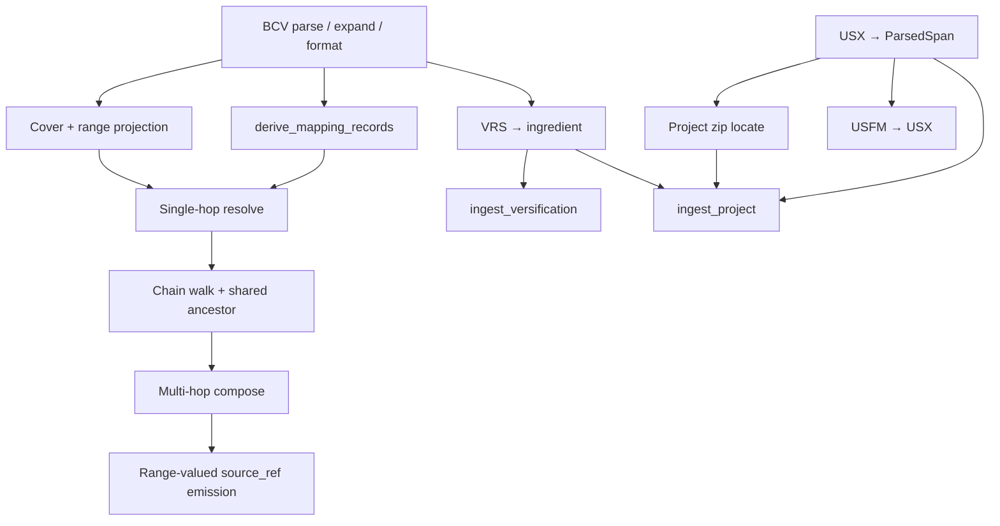

# Versification Viewer: Mapping Resolver and Ingest Derivation Specification

**Status:** Draft for implementation (implementation-ready interim bindings)
**Audience:** Developers (or coding agents) implementing `frvt.resolver` and the mapping/ingest derivation pieces of `frvt.ingest`; planners combining this work with API, ORM, and UI delivery.
**Companion documents:**
- API / DB / HTTP: [frvt-3-server-db-api-design-1.md](./frvt-3-server-db-api-design-1.md) (contracts §8.1–§8.2, data model §6)
- Working requirements / assumption ids: [frvt-3-resolver-requirements-1.md](./frvt-3-resolver-requirements-1.md)
- Samples: [research/CopenhagenFormat/](../research/CopenhagenFormat/), [research/ParatextFormat/](../research/ParatextFormat/)
- POC context: [research/frvt-versification-viewer-poc-1.md](../research/frvt-versification-viewer-poc-1.md)

**Scope:** Behavior of the in-process resolver (`resolve`) and of ingest functions that produce `ParsedSpan` / `ParsedScheme` / `MappingRecordDTO` (API §8.2). Out of scope: HTTP, auth, ORM models/migrations, CRUD routers, UI. The API persists what ingest returns and attaches `verse_span.seq` after resolve.

**How to use this document:** Algorithms in §§5–8 and contracts in §3 are normative enough to implement or to derive a delivery plan that is later merged with API/ORM/UI work. This document does **not** prescribe project phases. Section 12 lists **dependencies** that constrain ordering when a combined plan is produced. Where a rule was previously TBD, this document states an **interim binding** (marked *Interim*) that may later move into the requirements assumptions table.

---

## 0. Implementation-readiness notes

Detail level aims at: a moderate-skill implementer (or LLM) can invent concrete algorithms and a combined schedule from this spec plus the API design, without inventing policy.

| Area | Role in this document |
| --- | --- |
| Resolver I/O contract | Explicit types + exception matrix (§3) |
| Shared-ancestor / hop walk | Pseudocode, chain shape, stop conditions (§6.2) |
| Covering record + range projection | Cover rules, zip-by-index, unequal-length policy (§6.3–6.4) |
| Relation inverses / composition | Interim composition + shift/renumber classifier (§6.5, §7.2) |
| `derive_mapping_records` | Ordered algorithm, partial encoding, ordinal (§7) |
| Project / VRS / USX ingest | Zip layout, USX span rules, VRS→ingredient map (§8) |
| Module layout | Suggested packages (§2); planners may split further |
| Ordering | Dependencies only (§12); no delivery phases here |

Residual TBDs that need not block core resolve/derive work: cross-book range inputs; exotic part suffixes beyond schema (`ESG 8:12t`); full multi-`ResolutionDTO` packaging for heterogeneous ranges (interim: single DTO, dominant relation).

---

## 1. Overview

Given a BCV `source_ref` (single verse or same-chapter range) and two schemes, return individual source/target spans and a `relation_type` by pivoting through a **shared ancestor translation** on each scheme’s `based_on_id` chain.


Uncovered verses on a hop are identity `one_to_one` (same book, chapter, verse, part). The resolver **reads only** scheme/mapping/association data; it does **not** read `VERSE_SPAN.content` (A20). Ingest derivation is pure (no DB writes).

### 1.1 What mapping does and does not use

| Used by resolve | Not used by resolve |
| --- | --- |
| `mapping_record` (BCV / bcvRange coords + relation) | `VERSE_SPAN.content` |
| Scheme `based_on_id` / chain + active scheme of each base translation | Semantic equivalence of verse text or parts |
| Optional `ingredient.maxVerses` / `partialVerses` for bounds or part lists | UI layout |

`based_on_id` points at a **translation** because that row is the stable numbering-space node in the chain (look up its active scheme for the next hop; FK prevents deleting an anchor still in use). Mapping rows are already complete as coordinate transforms; the base translation’s text is irrelevant to the algorithm. Text is required only so the API/UI can **display** the caller’s source and target translations after refs are resolved.

**Scheme sharing:** A `VERSIFICATION_SCHEME` outlives any single association. Deleting a translation drops its `translation_versification` rows and spans; the scheme and its `mapping_record`s remain for other translations. Deleting a translation that is still referenced as `based_on_id` is rejected—chain integrity, not text dependency.

**Part splits:** If two translations partition the same verse into different `part` sets, the resolver still only moves coordinates / part labels. Any semantic drift is for human review, not for this algorithm (A4, A20).

---

## 2. Package layout (suggested)

Aligns with API §9. Implement against these modules; planners may split further but should not move contracts.

```text
frvt/
  resolver/
    __init__.py          # re-export resolve, DTOs
    types.py             # BcvRef, SchemeRef, ResolutionDTO, …
    parse_ref.py         # parse / expand / format BCV
    cover.py             # covering-record lookup, range projection
    chains.py            # based_on chain walk, shared ancestor
    compose.py           # upward / downward hop application
    resolve.py           # resolve() orchestration
  ingest/
    __init__.py
    types.py             # ParsedSpan, ParsedScheme, MappingRecordDTO, IngestIssue
    project_zip.py       # unzip, locate USX + .vrs
    usx_parse.py         # USX → ParsedSpan sequence
    usfm_convert.py      # optional USFM→USX (depends on A13; see §12)
    vrs_convert.py       # VRS text → ingredient dict
    burrito_validate.py  # schema / structural checks
    derive_mappings.py   # derive_mapping_records()
    ingest_api.py        # ingest_project, ingest_versification
```

---

## 3. Boundary contracts

### 3.1 Resolver (API §8.1)

```python
@dataclass(frozen=True)
class SchemeRef:
    scheme_id: UUID
    based_on_id: UUID | None       # translation.id — numbering-space anchor, not text
    based_on_name: str | None = None

@dataclass(frozen=True)
class ResolvedSpanDTO:
    ref: str                 # single-verse "BOOK C:V" only
    part: str | None

@dataclass(frozen=True)
class ResolutionDTO:
    source_spans: tuple[ResolvedSpanDTO, ...]
    target_spans: tuple[ResolvedSpanDTO, ...]
    relation: str

def resolve(
    session: Session,
    source_ref: str,
    source_scheme: SchemeRef,
    target_scheme: SchemeRef,
) -> ResolutionDTO: ...
```

| Input / output | Rule |
| --- | --- |
| `source_ref` | bcv or same-chapter bcvRange; ranges must not raise |
| Emitted `ref` | Always single-verse BCV; never `V-V` |
| `part` | `None` for whole verse; else part id string |
| Raises | `ReferenceError` invalid grammar / cross-chapter range; `LookupError` missing scheme, missing intermediate active scheme, no shared ancestor |

*Interim:* `SchemeRef` need not include the owning translation id. Chain walking starts at the given scheme; the first hop’s “own” numbering is that scheme’s source side. The next translation is `based_on_id`; its **active** scheme is loaded via `translation_versification` for further hops.

### 3.2 Ingest (API §8.2) — owned here

```python
def ingest_project(archive_bytes: bytes) -> ProjectIngestResult: ...
def ingest_versification(file_bytes: bytes, filename: str) -> tuple[ParsedScheme, tuple[IngestIssue, ...]]: ...
def derive_mapping_records(scheme: ParsedScheme) -> tuple[MappingRecordDTO, ...]: ...
```

DTOs match API §8.2. Non-empty `issues` ⇒ API rejects with `422`. Functions do not open DB sessions or commit.

### 3.3 Relation vocabulary

`one_to_one` | `shift` | `renumber` | `split` | `merge` | `exclude` | `partial`

**Inverses (descent):** `split`↔`merge`; others self-inverse; `exclude` terminates (empty targets).

**Cardinality of `ResolutionDTO`:**

| Relation | source_spans | target_spans |
| --- | --- | --- |
| `one_to_one` / `shift` / `renumber` | 1 | 1 |
| `split` | 1 | N |
| `merge` | N (query verse + siblings) | 1 |
| `exclude` | ≥1 | 0 |
| `partial` | parts set on spans | parts set on spans |

---

## 4. Internal types and BCV grammar

### 4.1 Grammar

| Form | Regex | Example |
| --- | --- | --- |
| bcv | `^([A-Z1-6]{3}) ([0-9]+):([0-9]+)$` | `GEN 31:55`, `PSA 3:0` |
| bcvRange | `^([A-Z1-6]{3}) ([0-9]+):([0-9]+)(?:-([0-9]+))?$` | `PSA 3:0-8` |

Verse `0` is valid (Psalm title). Cross-chapter ranges are **invalid** for resolve input (*Interim*).

### 4.2 Internal structs

```python
@dataclass(frozen=True)
class VerseId:
    book: str
    chapter: int
    verse: int
    part: str | None = None

@dataclass(frozen=True)
class RefRange:
    book: str
    chapter: int
    verse_start: int
    verse_end: int  # inclusive; == start for single verse
```

**Required helpers:**

| Function | Behavior |
| --- | --- |
| `parse_ref(s) -> RefRange` | Raise `ReferenceError` if neither pattern matches or `verse_end < verse_start` |
| `expand(range) -> list[VerseId]` | One `VerseId` per verse in `[start, end]`, `part=None` |
| `format_bcv(v: VerseId) -> str` | `f"{book} {chapter}:{verse}"` (part not in string; carried separately) |
| `covers(record_range: RefRange, v: VerseId) -> bool` | Same book/chapter and `start <= v.verse <= end` |
| `index_in_range(range, v) -> int` | `v.verse - range.verse_start` (caller ensures covers) |

---

## 5. Data the resolver loads

| Need | Query sketch |
| --- | --- |
| Scheme row | `versification_scheme` by `scheme_id` |
| Mapping rows | All `mapping_record` for `scheme_id` (or filtered by book later) |
| Active scheme of translation T | `translation_versification` where `translation_id=T` and `active=true` → `scheme_id` |
| maxVerses / partialVerses (optional) | From `ingredient` for bounds or part expansion |
| Base translation row | Only to confirm `based_on_id` exists when diagnosing; **not** its spans |

Do **not** load `VERSE_SPAN` / `content` inside `resolve` (A20). Seq/content attachment is an API-port concern after resolution.

*Interim:* Prefer loading all mapping rows for a scheme into memory per hop (POC size). Index in process by book for cover search.

---

## 6. Resolution algorithm (normative)

### 6.1 Orchestration (`resolve`)

```text
1. members = expand(parse_ref(source_ref))
2. src_chain = build_chain(session, source_scheme)   # list[Hop]
3. tgt_chain = build_chain(session, target_scheme)
4. ancestor = nearest_shared_translation(src_chain, tgt_chain)
   if none: raise LookupError
5. src_hops_to_anc = hops on src_chain until numbering lands on ancestor
6. tgt_hops_from_anc = hops on tgt_chain from ancestor down to target (reverse order for apply)
7. For planning emission:
   - Pick primary verse = members[0] when single-verse UI; for range, see §6.6
   - result_state = apply_upward(primary, src_hops_to_anc)
   - if exclude: return ResolutionDTO(source_spans=..., target_spans=(), relation="exclude")
   - result_state = apply_downward(result_state, tgt_hops_from_anc)
8. Expand merge/split siblings into source_spans / target_spans (§6.5)
9. Return ResolutionDTO
```

### 6.2 Build chain

A **Hop** is `(scheme_id, based_on_id, mappings)`.

```text
build_chain(scheme: SchemeRef) -> list[Hop]:
  hops = []
  current = scheme
  seen_schemes = set()
  while True:
    if current.scheme_id in seen_schemes: raise LookupError("cycle")
    seen_schemes.add(current.scheme_id)
    rows = load_mapping_records(current.scheme_id)
    hops.append(Hop(current.scheme_id, current.based_on_id, rows))
    if current.based_on_id is None:
      break  # root numbering reached after this hop's application
    next_scheme = active_scheme_ref(current.based_on_id)
    if next_scheme is None:
      # Root base translation with no further scheme: stop.
      # Numbering after last hop is that translation's canonical numbering.
      break
    current = next_scheme
  return hops
```

**Translation sequence for ancestor search:**  
`[based_on_id of hop0, based_on_id of hop1, …]` filtering nulls; also treat “root numbering” as a sentinel if the last hop has `based_on_id is None` after applying (the root translation is the last non-null `based_on_id`, or a configured root name such as a translation named `org` when both chains end there).

*Interim shared-ancestor rule:*

1. Let `S` = ordered list of translation ids visited as `based_on_id` along the source chain (first hop’s `based_on_id` first).
2. Let `T` = same for target.
3. If `S` and `T` share any id, pick the **first** id in `S` that also appears in `T` (nearest to source / short-cut).
4. Else if either chain ends at a root with null further base, and the other chain eventually reaches the same root translation id, use that root.
5. Else `LookupError`.

Same `based_on_id` on both input schemes ⇒ that translation is the ancestor (one upward hop each, then downward).

### 6.3 Covering record

For verse `v` and hop mappings:

1. Consider records whose parsed `source_ref` (upward) or `base_ref` (downward / inverse) covers `v`.
2. Prefer **narrowest** cover (smallest `verse_end - verse_start`); if tie, lowest `ordinal`.
3. If none → identity: output `v` unchanged, relation contribution `one_to_one`.

### 6.4 Project through a range pair (upward)

Given covering record with `source_ref` → `src_r`, `base_ref` → `base_r` (nullable):

| Relation | Action |
| --- | --- |
| `exclude` | `base_ref` is null → mark excluded; stop chain |
| `merge` | All verses in `src_r` map to **one** target: `base_r.verse_start` (or sole verse). Collect siblings = expand(`src_r`) for emission |
| `split` | Rare on stored upward rows; if `src` single and `base` multi: map source verse to all expand(`base_r`) |
| `partial` | Preserve `part`; map book/chapter/verse per refs |
| `shift` / `renumber` / `one_to_one` | **Zip by index** (*Interim*): `i = index_in_range(src_r, v)`; if `i >= length(base_r)` raise or clamp — *Interim: clamp to last base verse and log*; emit `VerseId(base.book, base.chapter, base.verse_start + i)` if same-chapter base range. If `src` and `base` lengths differ, zip `min(len)`; *Interim: if `v` index ≥ len(base), use last base verse* |

**Downward / invert:** swap roles of `source_ref` and `base_ref`; invert relation via §3.3; same projection rules.

### 6.5 Compose relations across hops (*Interim* A11)

```text
compose(a, b):
  if a == one_to_one: return b
  if b == one_to_one: return a
  if a == exclude or b == exclude: return exclude
  if {a,b} == {split, merge}: return one_to_one   # cancel
  if a == b: return a
  # otherwise: prefer more “structural” relation
  priority = exclude > merge > split > renumber > shift > partial > one_to_one
  return higher_priority(a, b)
```

### 6.6 Range-valued `source_ref` (*Interim* A8–A9)

1. Expand members.
2. Resolve each member through the same chains (reuse hop loads).
3. If all members share the same final `relation` and form one contiguous mapping group, emit **one** `ResolutionDTO` whose `source_spans` / `target_spans` are the unions (sorted by book, chapter, verse), relation = that relation.
4. If relations conflict, emit one DTO using priority from §6.5 over member relations, spans = union — **do not raise**.

### 6.7 Worked numeric examples

Assume eng scheme `mappedVerses` contains `"PSA 3:0-8": "PSA 3:1-9"` classified `shift`, and both schemes `based_on` → translation `org` (or eng→org and target is org).

| Call | Expected |
| --- | --- |
| `resolve("PSA 3:1", eng, org)` | `shift`; source `PSA 3:1`; target `PSA 3:2` |
| `resolve("GEN 31:55", eng, org)` | `renumber` or `shift` per classifier; target `GEN 32:1` |
| `resolve("JHN 3:16", eng, org)` | `one_to_one`; same ref both sides |
| `resolve("PSA 3:0-2", eng, org)` | No raise; three (or grouped) individual spans, shifted |

Use [research/CopenhagenFormat/eng.json](../research/CopenhagenFormat/eng.json) for fixtures.

---

## 7. Deriving `MAPPING_RECORD` rows

Pure function. Input: validated ingredient dict on `ParsedScheme`. Output: ordered `MappingRecordDTO`.

### 7.1 Algorithm

```text
ordinal = 0
rows = []

# 1) mappedVerses: object key -> value
for key, value in ingredient.get("mappedVerses", {}).items():
    rel = classify_mapped(key, value)   # §7.2
    rows.append(DTO(key, value, rel, ordinal)); ordinal += 1

# 2) excludedVerses: array of bcv
for ref in ingredient.get("excludedVerses", []):
    rows.append(DTO(ref, None, "exclude", ordinal)); ordinal += 1

# 3) mergedVerses: array of bcvRange
for ref in ingredient.get("mergedVerses", []):
    base = ingredient.get("mappedVerses", {}).get(ref)
    # If exact key missing, *Interim*: find mappedVerses entry whose source_ref equals ref
    # or whose source range equals ref; else base_ref=None (still store merge)
    rows.append(DTO(ref, base, "merge", ordinal)); ordinal += 1

# 4) partialVerses: bcv -> [part, ...]
for ref, parts in ingredient.get("partialVerses", {}).items():
    for part in parts:
        # *Interim* encoding: source_ref remains plain bcv; part is NOT embedded in the
        # string. Store DTO with source_ref=ref, base_ref=ref (identity locus), relation=partial.
        # Resolver matches partial by (ref, part) when verse_span.part is present; if resolve
        # input has no part, treat as whole-verse unless only partial rows exist for that bcv.
        rows.append(DTO(ref, ref, "partial", ordinal)); ordinal += 1
        # Optional: also stash part in a side channel — for POC, API/resolver may re-read
        # ingredient.partialVerses when relation is partial. *Interim:* re-read ingredient
        # for part lists when expanding partials.

return tuple(rows)
```

`basedOn` / `maxVerses` / `verification` produce **no** mapping rows.

### 7.2 `classify_mapped` (*Interim* A11)

Parse `source_ref` and `base_ref` as `RefRange`.

```text
if source.book != base.book:
    return "renumber"
if source.chapter != base.chapter:
    return "renumber"
# same book+chapter
src_len = source.verse_end - source.verse_start + 1
base_len = base.verse_end - base.verse_start + 1
if src_len == 1 and base_len == 1 and source.verse_start == base.verse_start:
    return "one_to_one"
if src_len == base_len and (source.verse_start != base.verse_start):
    return "shift"   # includes Psalm title 0-8 → 1-9
if source.chapter != base.chapter or src_len != base_len:
    return "renumber"
return "shift"
```

---

## 8. Ingest pipelines (normative for planning)

### 8.1 `ingest_versification(file_bytes, filename)`

```text
1. Detect format:
   - .json / content starts with `{` → Copenhagen/Burrito ingredient
   - .vrs / lines look like VRS → convert (§8.3)
2. Validate required keys: maxVerses present; types roughly match schema
3. based_on = ingredient.get("basedOn")  # may be None
4. name = optional override else filename stem else based_on or "custom"
5. canonical = False for uploads (*Interim*; seed data may set True out of band)
6. Return ParsedScheme(name, based_on, canonical, ingredient), issues
```

API resolves `based_on` → `translation` by **case-insensitive** name match (*Interim* A17); missing ⇒ ingest failure at persist time (API may also pre-check).

### 8.2 `ingest_project(archive_bytes)`

**Expected zip layout** (Paratext/DBL-style release bundle):

```text
metadata.xml                 # optional for POC parse
release/USX_1/*.usx          # or release/USX_<n>/
release/versification.vrs    # required for Path A success in API flow
release/styles.xml, *.ldml   # ignore
```

```text
1. Unzip to temp or ZipFile
2. Find first directory matching release/USX_* containing *.usx
   - If none: issue field="archive", message="No USX_* tree"
3. Find release/**/*.vrs (prefer versification.vrs)
   - If none: issue (API currently expects vrs for project ingest)
4. For each .usx (sorted by name): parse → append ParsedSpans (§8.4)
5. Convert vrs → ingredient (§8.3); validate
6. ParsedScheme from vrs; basedOn from ingredient or *Interim* default "org" if absent
7. Return ProjectIngestResult(spans, scheme, issues)
```

USFM-only trees: convert via `usfm_convert` then the same USX path (A13); see §12 for ordering relative to USX ingest.

### 8.3 VRS → ingredient (*Interim*)

VRS samples use:

- Book lines: `GEN 1:31 2:25 ...` → `maxVerses["GEN"] = ["31","25",...]` (string verse maxima per chapter index).
- Mapping lines: `GEN 31:55 = GEN 32:1` → `mappedVerses["GEN 31:55"] = "GEN 32:1"`.
- Comment lines starting `#` ignored.
- Partial / excluded sections if present: map into `partialVerses` / `excludedVerses`; if absent, `[]` / `{}`.
- `basedOn`: *Interim* `"org"` when not specified in VRS.
- `mergedVerses`: *Interim* `[]` unless VRS encodes merges in a recognized form; do not invent.

Unsupported VRS constructs → `IngestIssue` and fail closed (non-empty issues).

### 8.4 USX → `ParsedSpan` (*Interim*)

Target: USX 3.0 as in samples.

```text
seq = 0
For each book file:
  book = <book code="...">
  On <chapter number="N">: chapter = N
  On <verse number="V" sid="..."> ... <verse eid> or milestone pairs:
    - If number contains comma (e.g. "6,7"): *Interim* emit one span per integer,
      splitting text equally only if needed; prefer duplicate same content for POC
      or attach full text to first verse and empty to others — pick one and test it:
      *Interim: full text on first verse, empty string on subsequent numbers in the list.*
    - part = None unless milestone indicates partial (rare in samples)
    - content = text nodes between verse start and end, excluding <note> inner text
      (*Interim: drop note elements entirely*)
    - yield ParsedSpan(seq, book, chapter, int(V), part, content); seq += 1
```

Empty content spans are allowed. Books with no verses → no spans (not a hard failure unless zero spans overall).

### 8.5 Post-parse API responsibilities (not ingest)

- Persist translation, spans, scheme.ingredient
- Look up `based_on` translation → set `based_on_id` / `based_on_name`
- Call `derive_mapping_records` → insert rows
- Create `translation_versification` active=true for Path A

---

## 9. Failure matrix

| Stage | Condition | Effect |
| --- | --- | --- |
| parse_ref | Bad grammar / cross-chapter range | `ReferenceError` |
| resolve | Range input well-formed | Proceed |
| resolve | No covering row | Identity hop |
| resolve | No shared ancestor / cycle / missing active scheme | `LookupError` |
| ingest | No USX tree / no vrs when required | `IngestIssue` |
| ingest | VRS/JSON invalid | `IngestIssue` |
| persist (API) | `basedOn` name not found | `422` / validation |

---

## 10. Test plan (contract fixtures)

Use ingredients from [research/CopenhagenFormat/eng.json](../research/CopenhagenFormat/eng.json) and [org.json](../research/CopenhagenFormat/org.json) seeded as schemes based_on translation `org`.

| Id | Case | Assert |
| --- | --- | --- |
| T1 | Identity `JHN 3:16` eng→org | `one_to_one`, identical refs |
| T2 | `PSA 3:1` eng→org | `shift`, target `PSA 3:2` |
| T3 | `GEN 31:55` eng→org | target `GEN 32:1`, relation shift or renumber |
| T4 | `exclude` fixture verse | empty `target_spans` |
| T5 | merge fixture | `len(source_spans)>1`, `len(target_spans)==1` |
| T6 | `PSA 3:0-2` range | no raise; only single-verse refs in output |
| T7 | derive eng mappedVerses | row count = len(mappedVerses)+…; PSA 3:0-8 → shift |
| T8 | VRS convert ([research/ParatextFormat/eng.vrs](../research/ParatextFormat/eng.vrs)) | maxVerses GEN ch1 == 31; mapped GEN 31:55 present |
| T9 | USX parse (DBL/Paratext `release/USX_*/*.usx` layout) | seq monotonic; at least one book with non-empty verse 1 content |
| T10 | Missing ancestor | `LookupError` |

Do not assert HTTP status codes here.

---

## 11. Open items

| Topic | Blocks core resolve/derive? | Interim |
| --- | --- | --- |
| Richer composition table | No | §6.5 |
| Exotic part refs (`ESG 8:12t`) | No | Reject or treat suffix as part if pattern extended later |
| Heterogeneous range → many DTOs | No | §6.6 single DTO |
| USFM conversion library choice | No (only USFM-only projects) | usfm-grammar or equivalent |
| Jump-menu categorization | N/A | API §7.9; out of resolver scope |
| Whether a `based_on` translation must carry full verse text, or may be a numbering-space stub | No | A20; mapping does not need text either way |

---

## 12. Implementation dependencies

This section does **not** define delivery phases. It states dependency edges so a later, combined plan (resolver + ingest + API + ORM + UI) can order work without conflicting with other specs’ schedules.

### 12.1 Within this document’s scope



| Depends on | Dependent | Why |
| --- | --- | --- |
| BCV parse/expand | `derive_mapping_records`, cover/projection, VRS mapping lines | Shared ref grammar |
| `derive_mapping_records` + cover | Single-hop `resolve` | Needs rows + projection |
| Single-hop `resolve` | Chain walk / shared ancestor / multi-hop | Extends the same apply path |
| Multi-hop `resolve` | Range-valued `source_ref` grouping (§6.6) | Reuses full compose |
| VRS→ingredient | `ingest_versification`, project ingest | Scheme payload |
| USX→spans | Project ingest | Translation payload |
| Zip locate + USX + VRS | `ingest_project` | Path A assembly |
| USX ingest | USFM→USX | Same span pipeline after conversion |

`resolver` and `ingest` packages are otherwise **independent** after BCV helpers exist: resolve can be built against seeded DB rows; ingest can be built and unit-tested without `resolve`.

### 12.2 Cross-spec (API / ORM / UI)

| This capability | Needs from elsewhere | Notes |
| --- | --- | --- |
| `resolve` integration tests with real session | ORM models + migrations for `versification_scheme`, `mapping_record`, `translation_versification`, `translation` | Port can use fakes until then |
| Persist after `ingest_*` | API transaction + `based_on` name→`translation` lookup (A17) | Ingest itself stays DB-free |
| `GET /api/resolve` | Active-scheme selection + seq attachment | API §7.8 / resolver port |
| Seeded eng/org fixtures | Canonical translations + schemes loaded (often via ingest or bootstrap) | Tests T1–T7 |
| UI overlays | Working resolve adapter | UI depends on API; not on ingest internals |

Soft constraints (useful when merging plans, not hard blockers):

- Prefer implementing BCV + `derive_mapping_records` before wiring ingest persist, so derived rows are correct on first load.
- Prefer single-hop resolve before multi-hop; both before relying on UI alignment demos that need indirection.
- Project-zip ingest can proceed in parallel with resolve once VRS and USX parsers exist.
- USFM conversion is optional for sample zips (samples are USX); schedule it only if USFM-only inputs are in scope for the combined milestone.

---

## 13. Glossary

- **Ancestor / pivot:** Translation id at which upward composition stops and downward begins (numbering-space node, not a text source).
- **Covering record:** `mapping_record` whose relevant ref range includes the current verse.
- **Hop:** One scheme’s mapping set applied toward its `based_on` translation’s numbering.
- **Identity:** Implicit `one_to_one` when no covering record exists.
- **Ingredient:** Copenhagen/Burrito JSON; system of record for deltas.
- **Numbering-space translation:** A `translation` row named by ingredient `basedOn` and referenced by `based_on_id`; used to walk chains and load the next active scheme. Its verse text is not an input to resolve (A20).
