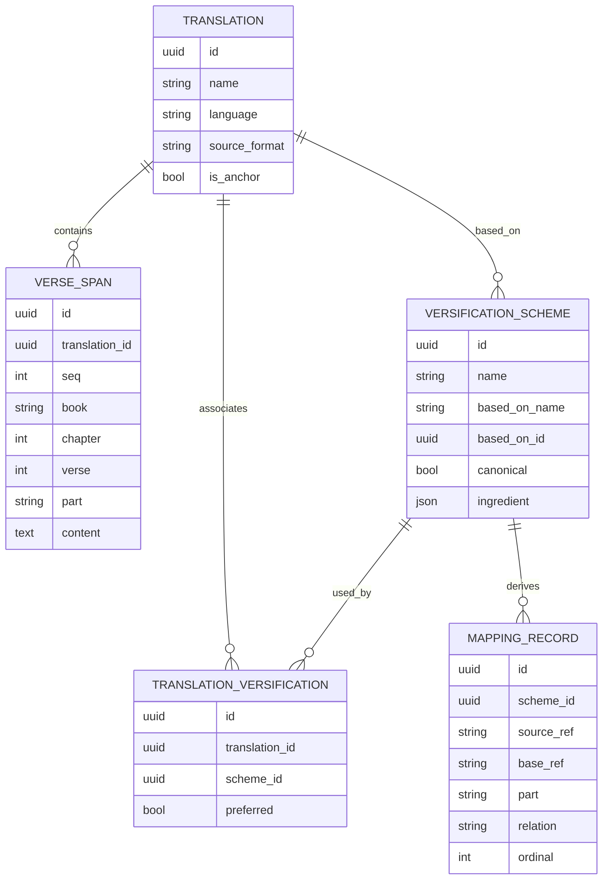

# Overview

The resolver maps verse spans from a source translation’s selected versification
scheme onto a target translation’s selected scheme by pivoting through shared
ancestor translations on `based_on` chains. Each side's scheme is the one chosen
for the request (a per-request versification selection) or, by default, the
translation’s **preferred** scheme. This avoids requiring a full
N-squared set of pairwise scheme mappings.

The resolver is a Python module invoked in-process by the FastAPI application
(see [frvt-3-server-db-api-design-1.md](./frvt-3-server-db-api-design-1.md)
§8.1 and the resolver specification
[frvt-3-resolver-1.md](./frvt-3-resolver-1.md)). HTTP transport,
auth, and persistence ownership stay with the API design; this document and the
resolver spec own ingest derivation of mapping rows and the resolution
algorithm.

Before resolution can run, translations and versification schemes must be
ingested (see [Ingestion workflow](#ingestion-workflow) and [Ingestion](#ingestion)).

Input/output shapes, relation vocabulary, ref formats, and other revisable
policy live in [Assumptions](#assumptions). Cite those entries by id when
implementing; change them there, not by editing scattered prose.

Reference samples for schema and layout:

- Copenhagen/Burrito schema and examples: [research/CopenhagenFormat/](../research/CopenhagenFormat/)
- Canonical base ingredients: [research/CopenhagenFormat/](../research/CopenhagenFormat/) (`eng.json`, `org.json`, …)
- Paratext VRS samples: [research/ParatextFormat/](../research/ParatextFormat/) (`eng.vrs`, `org.vrs`, `lxx.vrs`, …)

# Scope

In scope:

- Ingestion workflow and pipeline for the two input kinds below (zipped project
  or versification file)
- Ingestion of translations (USX; USFM via conversion per A12–A13) and of
  versification schemes (VRS or Copenhagen/Burrito), including association to
  translations and resolution of ingredient `basedOn` (A17)
- Extraction of `VERSE_SPAN`s and derived `MAPPING_RECORD`s into the schema
  (A19)
- Mapping resolution via a shared ancestor translation on the `based_on` chain
  (A1)
- Resolver I/O aligned with the API resolve contract (A8–A9, A18)
- Rejection and failure handling (see [Failure / rejection](#failure--rejection))

Out of scope until specified separately: UI rendering, HTTP transport details,
and what *triggers* ingestion beyond the API ingest endpoints. Items marked TBD
are under [Open questions / TBD](#open-questions--tbd); interim bindings are
only in [Assumptions](#assumptions).

# Assumptions

Single source of truth for interim and revisable decisions. Prefer editing this
section over restating policy elsewhere. Main sections should link here by id
(e.g. A8) rather than repeating the rule. Where this document and the API
design disagree, reconcile both; do not silently diverge.

| Id | Assumption |
|----|------------|
| A1 | Ingredient `basedOn` is a **name** (e.g. `org`, `eng`). In the DB it is stored as `based_on_name` (display) and `based_on_id` (nullable UUID FK → `TRANSLATION.id`, `ON DELETE RESTRICT`) for referential integrity. At ingest, look up the base **translation** by name; the FK prevents later inconsistencies (a translation that other schemes `based_on` cannot be deleted). Shared-ancestor search walks Translations via scheme `based_on_id` links. A root (typically `org`) has null `basedOn` / null `based_on_id`. The base translation is a **numbering-space anchor** for chain walking (which preferred scheme to load next), not a requirement that the resolver read that translation’s verse text (A20). |
| A2 | Closed `relation` vocabulary (API `relation_type`): `one_to_one`, `shift`, `renumber`, `split`, `merge`, `exclude`, `partial`, `complex`. The relation on a stored `MAPPING_RECORD` is one of the first seven and is implied by the ingredient section it was derived from (`mappedVerses`, `excludedVerses`, `mergedVerses`, `partialVerses`), with `shift` vs `renumber` classified from `mappedVerses` book/chapter/verse deltas (exact classifier rules TBD under A11). `complex` is **resolve-time only** (never stored on a `MAPPING_RECORD`): it is the top-level relation of a many-to-many composed result whose per-connector relations travel on the result's edges (A24). |
| A3 | `source_ref` / `base_ref` use Copenhagen BCV grammar matching the sample schema: `bcv` = `BOOK C:V` (`^[A-Z1-6]{3} [0-9]+:[0-9]+$`); `bcvRange` = `BOOK C:V` or `BOOK C:V-V` (`^[A-Z1-6]{3} [0-9]+:[0-9]+(-[0-9]+)?$`). `BOOK` is a three-character USFM id. Verse `0` is a Psalm-title span. Stored mapping refs stay in range form when the ingredient uses ranges (e.g. `PSA 3:0-8` → `PSA 3:1-9`). `base_ref` is null for `exclude`. Partial parts are **never embedded in ref strings**; a part travels in its own column (`MAPPING_RECORD.part`, `VERSE_SPAN.part`) and, on the resolve boundary, in a separate `part` field (A4, A23). |
| A4 | `VERSE_SPAN.part` is null for whole verses; otherwise a short part id (usually a letter such as `a`, or `-` as in samples). `VERSE_SPAN.seq` (document order from ingest) orders spans and parts within a translation for **display**; it is not used to look up mappings. Differing part splits across translations may cause semantic drift for human reviewers; the resolver does not attempt semantic equivalence of parts or text (A20). |
| A5 | Every derived `MAPPING_RECORD` maps this scheme’s **BCV numbering** → the `based_on` translation’s **BCV numbering** (coordinate transform only). Descent toward the target inverts each hop. Rows are complete for resolution without verse text. |
| A6 | Interim inverses: `split` ↔ `merge`; `partial` ↔ `partial`; `shift` ↔ `shift`; `renumber` ↔ `renumber`; `one_to_one` ↔ `one_to_one`. `exclude` ends the chain (no target span). |
| A7 | Shifts and renumbers are not quantified separately; magnitude and chapter moves are implied only by the source/base ref book/chapter/verse (ranges). |
| A8 | Primary resolver input follows API `GET /api/resolve` / §8.1: a BCV `ref` that may be a **single verse** (`BOOK C:V`) or a **bcvRange** (`BOOK C:V-V`), plus an optional separate `part` argument (A23; the part is never part of the `ref` string). The design must not fail solely because `source_ref` is a range. Internally: expand a range input to its member verses; match covering `MAPPING_RECORD`s (which may themselves be ranges); compose; emit per-span results (A9). UI navigation typically passes a single verse; range input is valid for the same contract. |
| A9 | Resolver primary output is one `ResolutionDTO` / `ResolveResult`: `source_spans` (individual single-verse/partial spans, never ranges), `target_spans` (same), and `relation`. Cardinality is carried by list length, not by range strings: `one_to_one` / `shift` / `renumber` → 1 source, 1 target; `split` → 1 source, N targets; `merge` → N sources (queried verse plus siblings), 1 target; `exclude` → 1 source, 0 targets; `partial` → spans carry `part`; `complex` → M sources, N targets with explicit connector `edges` (A24). Multi-span lists are useful for single-verse input (e.g. merge siblings) and for range input (expanded members under one covering relation). Heterogeneous ranges that span multiple distinct relations, and any many-to-many composition, are returned as one `complex` hull with `edges` (A24); never hard-fail. |
| A10 | `canonical` and the `preferred` flag do not change resolver math. The API selects each translation’s **effective** scheme — the per-request versification override when supplied, otherwise the translation’s preferred scheme (A26) — before calling the resolver, and passes those concrete schemes as inputs. The resolver also accepts an optional scheme per side and, when one is omitted, loads that translation’s preferred scheme itself (A26). |
| A11 | Rules for combining successive relation types across hops (beyond A6), and the deterministic `shift` vs `renumber` classifier for `mappedVerses`, are TBD. |
| A12 | POC translation text format is USX. Prefer USX because it is XML: standard tooling, fail-fast on malformed input. |
| A13 | USFM-only projects are accepted by converting USFM → USX (e.g. usfm-grammar or equivalent) before parse/persist. Conversion failure is an ingest failure. |
| A14 | A Paratext/DBL-style project input is a zip. Expected layout: `metadata.xml`, `release/USX_1/*.usx` (or `release/USX_*`), and `release/versification.vrs` (not necessarily `custom.vrs`). Ingest must locate USX under a `release/USX_*` (or equivalent) tree and a `.vrs` versification when present. Standalone VRS examples live under [research/ParatextFormat/](../research/ParatextFormat/). Exact required-file policy beyond this layout is TBD; missing expected content fails closed. |
| A15 | In a project ingest, a successful USX parse yields a `TRANSLATION` and its `VERSE_SPAN`s, and the **required** versification file yields a `VERSIFICATION_SCHEME` (ingredient stored verbatim), derived `MAPPING_RECORD`s (A19), and a `TRANSLATION_VERSIFICATION` linking scheme to that translation and marked **preferred** (the default scheme, A25). All of these are persisted together or not at all (all-or-nothing project ingest); a missing versification file or any failure aborts the ingest with nothing persisted. |
| A16 | A versification-only input (VRS or Copenhagen/Burrito) creates an unassociated scheme; association to an existing `TRANSLATION` is a separate API step. Ingest of the file does not create a translation. |
| A17 | The Copenhagen/Burrito ingredient’s `basedOn` names the base (e.g. `"org"`). Ingestion looks up an existing `TRANSLATION` by that name, stores `based_on_name` (display) and `based_on_id` (FK to that translation) (A1). For uploaded/ingested schemes a missing `basedOn` defaults to `org` (A22); the named base translation is guaranteed present because canonical anchors are bootstrapped (A21). Unresolvable `basedOn` (a name that matches no bootstrapped anchor or prior translation) is an ingest failure. The null-`basedOn` root case (A1) applies only to bootstrapped canonical roots, not to uploads. |
| A18 | If a given verse span has no covering `MAPPING_RECORD` on a hop, that hop is an identity `one_to_one` mapping (same book, chapter, verse, and part). Missing deltas are not a resolve failure. |
| A19 | The ingredient JSON is the system of record for a scheme. `MAPPING_RECORD` rows are derived at load time, rebuildable, and never authoritative over the ingredient. |
| A20 | **Coordinate-only resolution.** Mapping algorithms operate solely on BCV (and part) coordinates plus `MAPPING_RECORD` / ingredient data. They do **not** read `VERSE_SPAN.content`. Verse text is required to **display** the source and target translations in the UI; the API may attach `seq` / content after resolve. `VERSIFICATION_SCHEME` rows are not owned by a translation: deleting a translation removes its associations and spans, but leaves schemes intact for reuse by other translations. A translation that is still someone’s `based_on_id` cannot be deleted (`ON DELETE RESTRICT`) so numbering-space anchors remain. That restriction is about chain integrity, not about needing the base’s text for mapping. |
| A21 | **Canonical bootstrap & anchors.** Canonical numbering-space translations (`org`, `eng`, `lxx`, `rso`, `rsc`, `vul`) and their canonical schemes are created by a server-owned bootstrap/seed step (see API design §5.7), **not** by user upload. Each anchor translation is flagged (`TRANSLATION.is_anchor = true`) and excluded from user-facing translation listings and empty-state counts. `org` is the root (null `basedOn` / null `based_on_id`). Each anchor translation is associated with its canonical scheme and that association is marked **preferred** (A25) so chain walking can load an anchor's preferred scheme when a hop lands on it. Bootstrapping guarantees `basedOn` lookups (A17) resolve on a clean install without polluting the UI translation list. |
| A22 | **Upload base default.** Schemes ingested via the API (standalone upload or inside a project zip) are assumed to be based on a canonical versification. When the ingredient/VRS omits `basedOn`, default it to `org`. Canonical roots are never uploaded — they come only from bootstrap (A21) — so the null-`basedOn` root case (A1) applies only to bootstrapped schemes, and the `org` default never causes a scheme to be based on itself. |
| A23 | **Ref/part separation on the boundary.** The resolve boundary carries the verse reference as `BOOK C:V` (bcv) or `BOOK C:V-V` (bcvRange) with **no** part in the string, plus an optional separate `part` argument/field. Parts are likewise stored in dedicated columns (`MAPPING_RECORD.part`, `VERSE_SPAN.part`), never concatenated into a ref (A3, A4). |
| A24 | **Composite (`complex`) resolution & hull.** When composition across the pivot yields a many-to-many connected component (e.g. `split` composed with `split`/`merge`), resolve returns the **complete connected component**: all participating source spans and all target spans, plus explicit connector `edges` (source-index ↔ target-index pairs), each edge carrying its own `relation`. The top-level `relation` is `complex`. Intermediate pivot spans are **not** returned to the caller but MAY be logged on the backend under a controllable diagnostics setting (API design §5.6 / §8.1). |
| A25 | **Preferred scheme (default versification).** A translation's default scheme is its **preferred** association (`TRANSLATION_VERSIFICATION.preferred = true`); at most one per translation. The scheme ingested with a translation is preferred by default (A15). The preferred scheme is changeable through the CRUD API by selecting another already-associated scheme, and it **cannot be deleted** — a delete of the preferred association is rejected until another association is made preferred. Consequently a translation with any association always retains exactly one preferred scheme. (This is the flag formerly named `active`.) |
| A26 | **Per-request versification selection.** Coordinate-interpreting API endpoints (resolve, deltas, misalignments, navigation) and the resolver accept an optional versification id per side. When supplied it must be a scheme already associated with that translation; when omitted, the capability defaults to the translation's preferred scheme (A25). A per-request selection is used only for that request and never mutates the preferred scheme. In the side-by-side UI the currently selected versification is passed along with all relevant requests; changing it does not change the preferred. An override that names a scheme that does not exist is a not-found error; one that exists but is not associated with the translation is a conflict (API design §7.8 maps these to `404` / `409`). |
| A27 | **Missing preferred scheme.** If a translation has no preferred scheme (only possible before any association exists) and no versification override is supplied, the capability fails closed with a conflict error and suitable HTTP status (`409`, API design §7.8), rather than silently proceeding. |

# Ingestion workflow

Ingestion accepts one of two input kinds. Both feed the same persistence model
and must complete successfully (or fail closed) before artifacts are usable in
resolution. UI and triggers beyond the API endpoints are out of scope; this
section defines required ingest behavior only.

| Input kind | Contents | Creates |
|------------|----------|---------|
| Zipped project | USX + **required** `.vrs` (e.g. `release/versification.vrs`) | `TRANSLATION` / `VERSE_SPAN`s + scheme + derived rows + preferred link, all-or-nothing (A14–A15) |
| Versification file | VRS or Copenhagen/Burrito | Scheme + derived `MAPPING_RECORD`s; association is separate (A16) |

## Path A — Zipped project (translation + required versification)

1. Accept project zip (A14).
2. Locate translation text under `release/USX_*` (or convert USFM → USX per A12–A13).
3. Parse USX; on success stage `TRANSLATION` and `VERSE_SPAN`s (A15).
4. Locate the project's versification file (e.g. `release/versification.vrs`); it is
   **required**. Run the [versification pipeline](#versification-pipeline) and link the
   resulting scheme to the new translation via `TRANSLATION_VERSIFICATION` (A15) as the
   preferred scheme (A25).
5. Project ingest is **all-or-nothing**: a missing versification file, or any USX /
   versification parse or derivation failure, fails the whole ingest and persists
   nothing. Translation-only ingest is out of scope for the project endpoint; a
   translation with no associated scheme arises only via a separate future
   standalone-translation path, not here. A missing *required* file is reported
   distinctly from invalid content (see [Failure / rejection](#failure--rejection)).

## Path B — Versification file only

1. Accept a VRS or Copenhagen/Burrito mapping file.
2. Run the [versification pipeline](#versification-pipeline); do not require a
   translation id at upload time (A16).
3. Caller associates the scheme to a translation afterward
   (`POST /api/translations/{id}/versifications`).

# Schema

Aligned with the API data model
([frvt-3-server-db-api-design-1.md](./frvt-3-server-db-api-design-1.md)
§6). Resolver-facing fields only; timestamps and CRUD-only columns omitted.

- `VERSE_SPAN` identifies a whole verse, a Psalm-title span (`verse = 0`), or a
  part of a verse (A4). `content` is for display; unused by resolve (A20).
- `TRANSLATION.source_format` records the original form (e.g. `usx`, `usfm`);
  stored verse content is derived from USX after any conversion (A12–A13).
- `VERSIFICATION_SCHEME` is shareable across translations via
  `TRANSLATION_VERSIFICATION`. It is not cascaded when a translation is
  deleted. `based_on_name` + `based_on_id` name the base **numbering-space
  translation** for chain walking (A1, A17, A20)—not a text dependency.
- `MAPPING_RECORD.source_ref` / `base_ref` remain in BCV / bcvRange form (A3) with
  parts held in the dedicated nullable `part` column (never embedded in a ref, A23);
  resolve expands covering records (and range inputs) to individual spans (A8–A9).
- `TRANSLATION.is_anchor` marks a bootstrapped numbering-space anchor (A21); anchors
  are excluded from user-facing translation listings and empty-state counts.
- Ingredient → row derivation: A2, A19; unused flags for resolver math: A10.

### Ingredient → `MAPPING_RECORD` derivation

| Ingredient field | Derived rows |
|------------------|--------------|
| `basedOn` | Not a mapping row; stored as `based_on_name` + resolved `based_on_id` (A17). |
| `maxVerses` | Not mapping rows; validate refs and drive navigation bounds. |
| `mappedVerses` | One row per entry: `source_ref` = key, `base_ref` = value, `relation` = `shift` or `renumber` (A2, A11). |
| `excludedVerses` | One row per verse: `source_ref` set, `base_ref` null, `relation` = `exclude`. |
| `mergedVerses` | One row per range: `relation` = `merge`; `base_ref` from corresponding `mappedVerses` when present. |
| `partialVerses` | One row per part: `relation` = `partial`; `source_ref` stays plain BCV and the part goes in the dedicated `MAPPING_RECORD.part` column (A3, A23). |
| `verification` | Retained inside `ingredient` only; not modeled as rows. |

# Ingestion

Ingestion implements the [Ingestion workflow](#ingestion-workflow). It has two
stages: translation ingest (Path A) and the shared versification pipeline
(both paths). Callables match the API ingest port
([frvt-3-server-db-api-design-1.md](./frvt-3-server-db-api-design-1.md)
§8.2).

## Translation ingest (Path A)

1. Accept project zip (A14); reject if unreadable or not a supported project
   layout.
2. Discover USX under `release/USX_*` (or USFM and convert per A13).
3. If USFM, convert to USX (A13); on conversion failure, fail the ingest.
4. Parse USX (A12); on parse failure, fail the ingest.
5. Persist `TRANSLATION` (including `source_format`) and `VERSE_SPAN`s with
   document-order `seq` (A15).
6. If a versification file is included, continue with
   [versification pipeline](#versification-pipeline) and link via
   `TRANSLATION_VERSIFICATION`. If absent, stop after translation persist.

## Versification pipeline

Used by Path A (embedded file) and Path B (standalone file).

1. Load VRS or Copenhagen/Burrito input.
2. If VRS, translate to a Copenhagen/Burrito ingredient (within supported
   features; VRS cannot express splits; unsupported-feature policy TBD — fail
   closed for now).
3. Persist `VERSIFICATION_SCHEME` with `ingredient` stored verbatim (A19).
4. Read `basedOn`, defaulting to `org` when absent for uploaded/ingested schemes
   (A22); look up `TRANSLATION` by name; set `based_on_name` and `based_on_id`
   (A1, A17). Fail if the resolved name matches no translation.
5. Derive `MAPPING_RECORD` rows from the ingredient (A2–A3, A5, A19).
6. Path A: create `TRANSLATION_VERSIFICATION` for the new translation (A15).
   Path B: leave unassociated (A16).

Partial success policy: if translation persist succeeds but versification fails
in Path A, do not leave a half-linked scheme; either roll back the scheme side
or fail the whole ingest. Exact transactional boundary is TBD; fail closed so
resolution never sees an incomplete scheme.

Failure cases: [Failure / rejection](#failure--rejection).

# Mapping resolution

## Contract

Matches the API resolver port
([frvt-3-server-db-api-design-1.md](./frvt-3-server-db-api-design-1.md)
§8.1).

- **Inputs:** `source_ref` (bcv or bcvRange, A8) plus an optional separate `part`
  (A23), `source_scheme`, `target_scheme` (each with `scheme_id`, `based_on_id` →
  Translation, and optional `based_on_name`).
- **Primary output:** `source_spans`, `target_spans`, `relation`, and `edges`
  (source-index ↔ target-index connectors, each with its own `relation`) for the
  `complex` case (A9, A24).
- **Secondary output (optional):** full resolution chains per hop (source climb and
  target descent), including intermediate pivot spans — **not** returned to the
  caller but logged on the backend under a controllable diagnostics setting (A24).
- **UI attachment:** the API adapter may attach `verse_span.seq` when a stored span
  exists; the resolver itself returns refs and parts.

## Algorithm

1. **Normalize input.** Parse `source_ref` as bcv or bcvRange (A3, A8); the optional
   `part` arrives as a separate argument, never inside the ref (A23). If a range,
   expand to the ordered set of member verses (same book/chapter). Do not reject
   solely for being a range.
2. **Shared ancestor.** Using A1, find the nearest shared ancestor
   **translation** on the `based_on_id` chains of the source and target
   schemes (short-cut when both share a non-root base; otherwise pivot through
   a common root such as `org`). If none, fail.
3. **Chains.** Build the shortest chains that respect the selected translations
   and schemes:

   `TRANSLATION (-> VERSIFICATION_SCHEME -> TRANSLATION)+`

   from source and from target, each ending at the shared ancestor. Each hop
   uses the scheme’s `based_on_id` as the next translation; the next scheme on
   that translation is its preferred scheme (A10, A25), failing closed if a required
   intermediate association is missing.
4. **Compose upward.** For each input member verse, find any covering
   `MAPPING_RECORD` (range or single) on each hop up the source chain to the
   ancestor. Where no record covers the verse, apply identity `one_to_one`
   (A18). Combine relations per A2 and A11. Stored ranges may be used to
   *apply* a mapping; work in concrete verses between hops.
5. **Compose downward.** Follow the target chain from the ancestor to the
   target translation, inverting each hop (A5, A6). Apply A7 when a
   shift/renumber is involved. Again, uncovered verses are identity (A18).
6. **Expand result.** Emit individual source and target spans (A9). For
   `merge`, include sibling source verses from the covering record; for
   `split`, include all target verses; for `exclude`, emit empty
   `target_spans`. A single-verse query that participates in a merge still
   returns siblings — that is intentional for UI overlays, not only for range
   input.
7. **Exclude.** On `exclude` (A6), end that chain; emit a mapping with no
   target spans (A9).
8. **Compose to a hull.** When applying the source-climb and target-descent hops
   produces a many-to-many connected component (e.g. a `split` upward composed with
   a `split`/`merge` downward), compute the **complete connected component**: the
   transitive closure over shared pivot verses linking source and target spans.
   Emit every participating source span and target span, plus explicit `edges`
   (source-index ↔ target-index) each carrying the per-connector relation, with the
   top-level `relation = complex` (A24). Simple 1↔1 / 1↔N / N↔1 cases keep their
   atomic relation and need no `edges`. Intermediate pivot spans are logged (not
   returned) under the controllable diagnostics setting.

# Failure / rejection

Reject or fail (do not invent non-identity mappings or leave usable incomplete
schemes) when:

| Stage | Condition |
|-------|-----------|
| Translation ingest | Unreadable zip or unsupported project layout (A14) |
| Project ingest | Required USX tree absent from the zip — a *missing-file* failure, reported distinctly from invalid content (A14, A15) |
| Project ingest | Required versification file absent from the zip — a *missing-file* failure, reported distinctly from invalid content (A15) |
| Translation ingest | USFM → USX conversion fails (A13) |
| Translation ingest | USX parse fails or yields no usable verse spans (A12) |
| Versification ingest | Unsupported or unparseable VRS / Burrito input |
| Versification ingest | VRS features that cannot be represented in the stored ingredient (policy TBD; fail closed) |
| Versification ingest | Ingredient present but `MAPPING_RECORD` derivation fails or is inconsistent |
| Versification ingest | Ingredient `basedOn` (or the defaulted `org`, A22) not resolvable to a `TRANSLATION` by name (A17) |
| Resolve | Source or target scheme missing / unloadable |
| Resolve | `source_ref` syntactically invalid (not bcv / bcvRange) (A3, A8) |
| Resolve | No shared ancestor translation between the selected schemes’ `based_on_id` chains (A1) |
| Resolve | Required intermediate translation has no usable scheme association for a hop |

Not a failure: a verse with no covering `MAPPING_RECORD` on a hop — that is
identity `one_to_one` (A18). Not a failure: `source_ref` is a bcvRange (A8).

Error codes and messages are implementation / API details. Requirements only
require these cases to fail rather than succeed with empty or guessed
*non-identity* results.

# Open questions / TBD

Work remaining. Until resolved, use the linked assumption as the interim rule.
Do not add a second interim rule in the body.

| Topic | Interim |
|-------|---------|
| Formal composition table across hops; `shift` vs `renumber` classifier | A11 (inverses: A6; vocabulary: A2) |
| Whether partial-verse letters beyond schema `bcv` (e.g. `ESG 8:12t` in samples) are first-class refs or part suffixes | A3 / A4 |
| Whether a `based_on` translation must carry full verse text, or may be a numbering-space stub (scheme + empty/minimal spans) | A20 (mapping does not need text either way) |
| Exact required files in project zips beyond sample layout | A14 |
| Ingest policy when VRS cannot round-trip to Burrito | — (fail closed per failure table) |
| Path A transactional boundary if versification fails after translation persist | Resolved: all-or-nothing project ingest, nothing persisted on any failure (A15) |
| Precise diagnostic chain result structure | — (secondary output optional; logged not returned, A24; payload TBD) |
| Heterogeneous range input spanning multiple distinct relations — one vs many `ResolveResult`s | Resolved: one result carrying the composite hull (`complex` relation + `edges`, A24) |
| Canonical base ingredients missing `basedOn` — imply root / null? | Resolved: bootstrap seeds canonical roots (A21); uploads default `basedOn` to `org` (A22) |
| How `basedOn` name matches `TRANSLATION.name` (exact vs case-insensitive; aliases) | A17 (case-insensitive; API design §6.1.3) |
| Delta / misalignment categorization for jump menus | Resolved: owned by ETL/API derivation, out of resolver scope (API design §7.9) |
| UI / HTTP transport | — (API design; explicitly out of scope here) |
