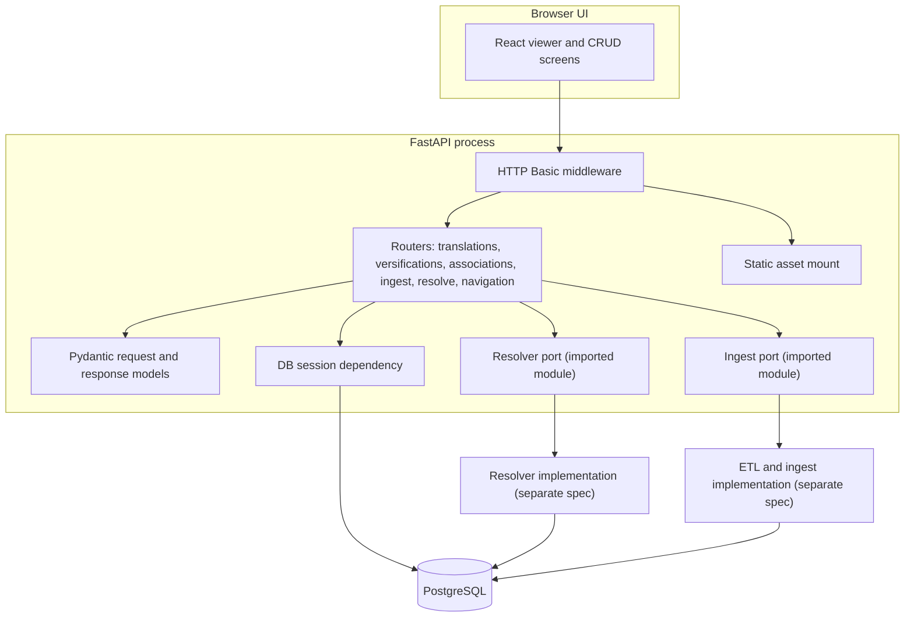
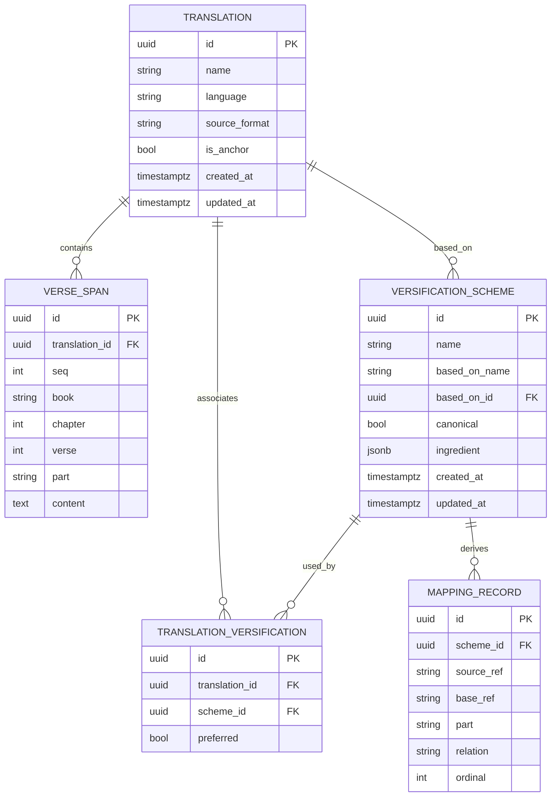
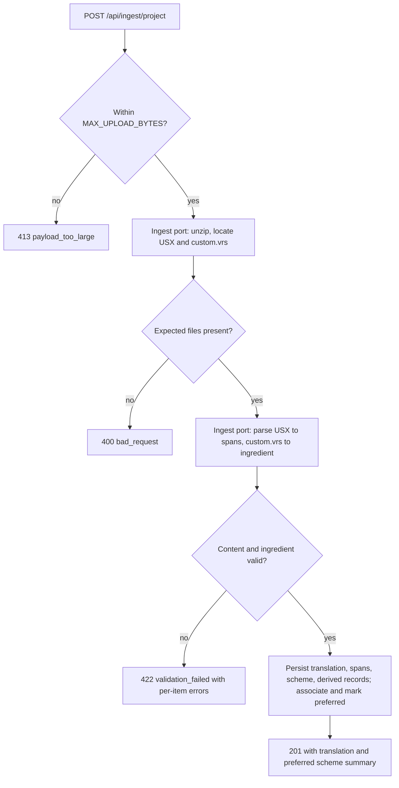
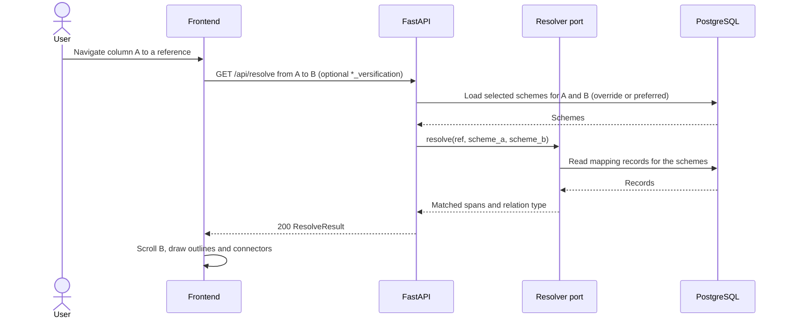

# Versification Viewer: Server, Database, and API Design Specification

**Status:** Draft for review and reconciliation
**Audience:** The developer implementing the server, database, and API; and the developers writing the UI, resolver, and ETL specifications that this document is reconciled against.
**Scope of this document:** The backend server process, the relational database, and the HTTP API. It does not specify the resolver internals, the ETL/ingest parsing internals, or the UI. Those are owned by separate specifications and appear here only as isolated interface contracts.

---

## 1. Overview

This specification describes the server, database, and API for the versification viewer proof-of-concept (POC). The POC displays two Bible translations side by side and aligns them across differing versifications, as described in [research/frvt-versification-viewer-poc-1.md](../research/frvt-versification-viewer-poc-1.md).

The backend has three responsibilities:

1. Persist translations, their verse text, versification schemes (stored as Copenhagen/Scripture Burrito ingredients), and the associations between them.
2. Expose an HTTP API that the UI uses to manage this data, read scripture content for display, and resolve a reference in one translation to the matching span in another.
3. Host the static UI assets and gate all access behind a simple authentication check.

The server calls a mapping resolver and a set of ETL/ingest routines. Both are implemented against separate specifications. This document defines the contracts the server depends on so the pieces reconcile cleanly later. See [Section 8](#8-boundary-interface-contracts).

### 1.1 Operational conventions

The server follows these stack and operational conventions: FastAPI on Uvicorn, PostgreSQL in Docker Compose, `.env`-based configuration, HTTP Basic authentication as middleware, a static-file mount that serves the UI from the same process, and a shared logging module with a custom `TRACE` level. Persistence uses an ORM with versioned migrations (rather than hand-written SQL applied from a single schema file), and the API is read/write CRUD (not read-only).

---

## 2. Scope and non-goals

### 2.1 In scope

- Database schema and ORM models for translations, verse spans, versification schemes, scheme-to-translation associations, and derived mapping records.
- Schema migrations.
- The HTTP API: CRUD for translations and versifications, scheme-to-translation association, file ingest and upload endpoints, scripture-content reads, navigation and jump-menu data, and reference resolution.
- Server bootstrap: configuration, authentication, static-asset serving, database session lifecycle, logging, and a uniform error contract.

### 2.2 Non-goals (owned by other specifications)

- **Resolver internals.** The algorithm that pivots through a base translation and classifies relations is specified in [frvt-3-resolver-1.md](./frvt-3-resolver-1.md). This document defines only the callable the API invokes and the data it exchanges. See [Section 8.1](#81-resolver-contract).
- **ETL/ingest internals.** Parsing USX into verse spans, converting VRS to a Copenhagen ingredient, validating an ingredient, and deriving `mapping_record` rows are specified in [frvt-3-resolver-1.md](./frvt-3-resolver-1.md) (§§7–8). This document defines only the callables the ingest endpoints invoke. See [Section 8.2](#82-etl--ingest-contract).
- **UI.** The React frontend, the overlay rendering of outlines and connectors, and client-side navigation are specified elsewhere. This document defines the API the UI consumes.
- **Versification detection.** The POC does not run the Copenhagen sniffer. Detection happens outside the tool; the tool ingests the resulting files. This matches the POC scope.
- **Production concerns.** Authentication beyond a simple gate, horizontal scaling, and multi-tenancy are out of scope, consistent with the POC.

### 2.3 Capability traceability

Every POC capability that touches the server, database, or API traces to an endpoint and a data-model element below. Visual rendering (outlines, connector lines, highlight, toggle) is UI-owned; this spec supplies the data those features consume.

| # | POC capability | API surface | Data-model element | Rendering owner |
| --- | --- | --- | --- | --- |
| 1 | Side-by-side display of two translations | `GET /api/translations`, `GET /api/translations/{id}/spans` | `translation`, `verse_span` | UI |
| 2 | Navigation in one column drives alignment in the other | `GET /api/resolve` | `mapping_record` | UI |
| 3 | Per-column book/chapter/verse selector | `GET /api/translations/{id}/navigation`, `GET /api/translations/{id}/spans` | `verse_span`, `versification_scheme.ingredient` (`maxVerses`) | UI |
| 4 | Per-column jump menu (mapped areas, common misalignments, arbitrary verses) | `GET /api/resolve/deltas`, `GET /api/resolve/misalignments`, `GET /api/translations/{id}/navigation` | `mapping_record` | UI |
| 5 | Outlines around mapped verses and partial spans | `GET /api/resolve` (spans carry `part`) | `verse_span.part`, `mapping_record` (`partial`) | UI |
| 6 | Connector lines between mapped spans | `GET /api/resolve` (`source_spans`/`target_spans` with `seq`) | `verse_span.seq` | UI |
| 7 | Always-on highlight of current verse and its lines | `GET /api/resolve` | `mapping_record` | UI |
| 8 | Toggle for the current alignment's mapping overlay | `GET /api/resolve` (current result only) | `mapping_record` | UI |
| 9 | Change the preferred versification of a translation (CRUD) | `PUT /api/translations/{id}/versifications/{scheme_id}/preferred` | `translation_versification.preferred` | UI |
| 9b | Per-request versification selection (side-by-side), without changing the preferred | optional `*_versification` query params on resolve / deltas / misalignments / navigation | `translation_versification` (associated schemes) | UI |
| 10 | Ingest translation plus `custom.vrs` from a zipped project | `POST /api/ingest/project` | `translation`, `verse_span`, `versification_scheme`, `mapping_record` | n/a |
| 11 | Direct upload of VRS and Copenhagen/Burrito files | `POST /api/versifications/upload` | `versification_scheme`, `mapping_record` | n/a |
| 12 | Association of an uploaded versification with a translation | `POST /api/translations/{id}/versifications` | `translation_versification` | n/a |
| 13 | CRUD for translations | Section 7.3 | `translation` | UI |
| 14 | CRUD for associated versifications | Sections 7.5 and 7.6 | `versification_scheme`, `translation_versification` | UI |

---

## 3. Basis and assumptions

### 3.1 Sources

- Architecture and capabilities: [research/frvt-versification-viewer-poc-1.md](../research/frvt-versification-viewer-poc-1.md).
- Versification domain and format background: [research/frvt-versification-standards-and-tooling-1.md](../research/frvt-versification-standards-and-tooling-1.md).
- Copenhagen/Burrito ingredient schema: [research/CopenhagenFormat/versification_schema.json](../research/CopenhagenFormat/versification_schema.json).
- Concrete ingredient samples used for the examples below: [research/CopenhagenFormat/eng.json](../research/CopenhagenFormat/eng.json), [research/CopenhagenFormat/org.json](../research/CopenhagenFormat/org.json), and [research/CopenhagenFormat/validated.json](../research/CopenhagenFormat/validated.json).
- Stack and operational conventions: FastAPI on Uvicorn, PostgreSQL in Docker Compose, `.env`-based configuration, HTTP Basic middleware, same-process static UI mount, and a shared logging module with a custom `TRACE` level (see Section 1.1).

### 3.2 Assumptions to reconcile

These are decisions this document makes at boundaries owned by other specifications. Each is flagged so it can be confirmed or changed during reconciliation. They are collected again in [Section 11](#11-open-questions-and-reconciliation-items).

- **In-process resolver.** The resolver runs in-process as an imported Python module, not as a separate service. The POC architecture describes "a mapping resolver that the API calls," which this reads as an in-process call.
- **Synchronous ingest.** The ETL/ingest routines run in-process, synchronously, within the request handling the upload. The POC targets a small number of translations, so synchronous ingest is acceptable.
- **USX ingest target.** The ingest target format is USX, as the POC recommends. USFM projects are converted to USX before ingest by the ETL layer.
- **Single preferred scheme.** A translation has at most one *preferred* versification scheme (its default) at a time; several may be associated. The scheme ingested with the translation is preferred by default. This follows the POC resolution model.
- **Per-request versification selection.** Coordinate endpoints and the resolver accept an optional versification id per side. When supplied it must be a scheme already associated with that translation; when omitted the endpoint falls back to the translation's preferred scheme. A per-request selection never mutates the preferred scheme (that is a CRUD-only operation, Section 7.6).
- **BCV reference grammar.** Reference strings use the Copenhagen BCV grammar: `BOOK C:V` and ranges `BOOK C:V-V`, with `BOOK` a three-character USFM book id (pattern `^[A-Z1-6]{3}$`) and verse `0` reserved for a Psalm-title span. A sub-verse **part** (a letter such as `a`, or `-`) is **not** embedded in the ref string; it travels as a separate field/parameter (the resolve `part` query param in Section 7.8, `verse_span.part`, and `mapping_record.part`). This matches the schema's `bcv` and `bcvRange` patterns, which contain no part component.
- **Ingredient as system of record.** The ingredient JSON is the system of record for a scheme. `mapping_record` rows are derived from it and can be rebuilt at any time.

---

## 4. Technology stack

| Concern | Choice | Rationale |
| --- | --- | --- |
| Language | Python 3.11+ | Keeps the API, resolver, and ETL in one language. |
| Web framework | FastAPI on Uvicorn | Typed request/response models, automatic OpenAPI, dependency injection for the DB session. |
| Validation / DTOs | Pydantic v2 | Request and response models, ingredient field validation at the edge. |
| ORM | SQLAlchemy 2.0 (typed, declarative) | The CRUD surface and the association join are relational and benefit from an ORM over hand-written SQL. |
| Migrations | Alembic | Schema evolves across CRUD entities, so versioned migrations are preferred to a single `schema.sql` apply script. |
| Database | PostgreSQL 15 | Relational store with `jsonb` support; PostGIS is not required (no geometry). |
| Ingredient storage | `jsonb` column | Preserves the Copenhagen/Burrito ingredient verbatim for round-trip fidelity, while allowing indexed queries on derived rows. |
| DB driver | `psycopg2-binary` | Works with SQLAlchemy 2.0. |
| Config | `python-dotenv` + environment | Local Compose defaults via `.env`. |
| Auth | HTTP Basic via Starlette middleware | Simple gate for the POC: one shared username/password for API, UI, and docs. |
| Logging | Shared module with a custom `TRACE` level | Getter-style reads log at `TRACE` (numeric `5`, below `DEBUG`). |
| Tests | Pytest + Starlette `TestClient` | API and adapter contract tests. |

### 4.1 Dependencies

Pin these in `requirements.txt`. Versions are lower bounds; resolve to current releases at implementation time rather than inventing exact pins.

```text
fastapi>=0.115.0
uvicorn[standard]>=0.32.0
SQLAlchemy>=2.0.0
alembic>=1.13.0
psycopg2-binary>=2.9.9
pydantic>=2.7.0
python-dotenv>=1.0.0
python-multipart>=0.0.9
pytest>=8.0.0
httpx>=0.27.0
```

`python-multipart` is required for FastAPI file uploads. `httpx` backs the Starlette `TestClient`.

---

## 5. Server architecture



### 5.1 Request lifecycle

1. Every request passes through the HTTP Basic middleware first, including static assets and the OpenAPI docs. Unauthenticated requests get `401` with a `WWW-Authenticate` challenge.
2. Authenticated requests route to a router. The router validates the request body or query with a Pydantic model.
3. Handlers acquire a database session through a FastAPI dependency (`Depends(get_session)`), which yields a session and closes it after the response, committing on success and rolling back on error.
4. Handlers that resolve references call the resolver port. Handlers that ingest files call the ingest port. Both ports are thin adapters over the imported implementation modules, so the API depends on a stable signature rather than on internals.
5. Responses are serialized from Pydantic response models. Errors follow the uniform error contract in [Section 5.4](#54-error-contract).

### 5.2 Configuration

Read from environment (loaded from `.env` at startup). All have defaults suitable for local Compose.

| Variable | Default | Purpose |
| --- | --- | --- |
| `POSTGRES_HOST` | `localhost` | Database host. |
| `POSTGRES_PORT` | `5433` | Database port (Compose maps container `5432` to host `5433`). |
| `POSTGRES_DB` | `frvt` | Database name. |
| `POSTGRES_USER` | `frvt` | Database user. |
| `POSTGRES_PASSWORD` | `frvt` | Database password. |
| `DATABASE_URL` | derived | Optional full SQLAlchemy URL; when unset, built from the `POSTGRES_*` values. |
| `BASIC_AUTH_USERNAME` | `admin` | API/UI username. |
| `BASIC_AUTH_PASSWORD` | `Admin123!` | API/UI password. |
| `MAX_UPLOAD_BYTES` | `52428800` | Upload size cap (50 MB) for ingest endpoints. |
| `LOG_LEVEL` | `DEBUG` | Root logger level for the `frvt` logger tree. |
| `RESOLVE_TRACE_PIVOTS` | `false` | When true, log resolver pivot spans and per-hop chains at `TRACE` for composite (`complex`) resolutions ([Section 8.1](#81-resolver-contract)). |

Configuration is centralized in a single settings object (a Pydantic `BaseSettings` model) so callers read typed values rather than calling `os.getenv` throughout.

### 5.3 Authentication

Implement HTTP Basic as a `BaseHTTPMiddleware` subclass that validates the `Authorization: Basic` header against the configured credentials using `secrets.compare_digest`, and returns `401` with `WWW-Authenticate: Basic realm="FRVT"` on failure. Credentials are cached with `lru_cache`. This gates the API, the static UI, and the `/docs` page. This is a simple gate only and is not a production authentication system.

### 5.4 Error contract

All error responses share one JSON envelope so the UI can handle them uniformly:

```json
{
  "detail": "Human-readable summary.",
  "code": "machine_readable_code",
  "errors": [
    { "field": "custom.vrs", "message": "Unmapped verse at REV 13:1." }
  ]
}
```

- `detail` is always present. `code` is always present and drawn from a fixed set. `errors` is present only for validation failures that have per-item detail (for example, ingest problems), and is omitted otherwise.
- Status code usage:

| Status | When |
| --- | --- |
| `400` | Malformed request (bad reference grammar, bad query parameter, unparseable file). |
| `401` | Missing or invalid credentials. |
| `404` | A referenced translation, scheme, or association does not exist. |
| `409` | A conflicting write or state (for example: making preferred a scheme not associated with the translation; deleting the preferred association; a translation with no preferred scheme and no versification override supplied; or deleting a scheme still referenced by an association). |
| `413` | Upload exceeds `MAX_UPLOAD_BYTES`. |
| `422` | A file or ingredient fails schema or content validation (invalid ingredient, USX that does not parse into spans). FastAPI also emits `422` for request-model validation. |
| `500` | Unexpected server error. |
| `503` | Database unavailable. |

A fixed `code` vocabulary: `bad_request`, `unauthorized`, `not_found`, `conflict`, `payload_too_large`, `validation_failed`, `internal_error`, `database_unavailable`.

### 5.5 Static UI serving

Mount the UI directory at `/` with `StaticFiles(html=True)`. The mount comes after the API routes so `/api/...` is never shadowed. The middleware still gates static assets.

### 5.6 Logging

Use a shared logging module under a `frvt` logger root: a custom `TRACE` level (numeric `5`, below `DEBUG`) added to `logging.Logger`, a single stream handler configured once, and `get_logger(__name__)` used at import time. Per the project logging rules, these APIs check the level before building the message, so callers pass format args rather than pre-building strings. Logging expectations for generated code are in [Section 10.2](#102-logging).

Resolver **pivot diagnostics** are controllable: the intermediate pivot spans and per-hop chains that a `complex` resolution passes through (Section 8.1, requirements A24) are not returned to the client but are logged at `TRACE` when a `RESOLVE_TRACE_PIVOTS` setting (Section 5.2) is enabled, so composite alignments can be diagnosed without changing the response contract.

### 5.7 Bootstrap and canonical seeding

On first startup (or via an idempotent Alembic data migration), the server seeds the canonical numbering-space translations and their canonical schemes so scheme ingest can resolve `basedOn` names and the resolver can walk `based_on_id` chains on a clean install. This is the owner of canonical-anchor creation (requirements A21).

- **Canonical translations:** `org` (root), `eng`, `lxx`, `rso`, `rsc`, `vul`. Each is created as a numbering-space **anchor** (`translation.is_anchor = true`, Section 6.1.1) and may carry minimal or no verse spans — they are numbering anchors, not display content (resolver §1.1; requirements A20–A21).
- **Canonical schemes:** one `versification_scheme` per canonical ingredient (from [research/CopenhagenFormat/](../research/CopenhagenFormat/)), with `canonical = true` and `based_on_name` / `based_on_id` set from the ingredient (`org` is the root with null base).
- **Anchor associations:** each canonical translation is associated with its matching canonical scheme via `translation_versification`, marked **preferred** (Section 6.1.4), so `preferred_scheme_ref` succeeds when the resolver hops to an anchor during chain walking (resolver §5, §6.2).
- **Anchor exclusion:** anchors are excluded from user-facing translation listings (`GET /api/translations`, Section 7.3) and from the UI empty-state count, so a clean install still shows the upload-first empty state (UI §6.3) while `basedOn` lookups succeed.
- **Upload base default:** uploaded/ingested schemes (standalone or in a project) are assumed to be based on a canonical versification, defaulting `basedOn` to `org` when absent (requirements A22). Canonical roots are never created by upload.
- Seeding is **idempotent** (keyed by case-insensitive name): re-running it does not duplicate anchors or schemes.

---

## 6. Data model

This section is self-contained so it can be updated independently during reconciliation with the ETL, resolver, and UI specs. It defines five entities and one enumeration.



### 6.1 Entities

#### 6.1.1 `translation`

A single Bible translation loaded into the tool.

| Column | Type | Notes |
| --- | --- | --- |
| `id` | `uuid` PK | Server-generated. |
| `name` | `text` not null | Display name, unique per case-insensitive value. |
| `language` | `text` not null | Free-text language label. |
| `source_format` | `text` not null | Original upload format, one of `usx`, `usfm`. Recorded for provenance; content is always stored as spans. On project ingest it is inferred from the zip (USX present -> `usx`; USFM-only converted -> `usfm`; if both are present, `usx`), Section 7.7.1. |
| `is_anchor` | `bool` not null default false | True for bootstrapped canonical numbering-space anchors (`org`, `eng`, `lxx`, ...), Section 5.7. Anchors are excluded from `GET /api/translations` and the UI empty-state count; they exist so scheme `based_on_id` chains resolve. |
| `created_at` | `timestamptz` not null default now | |
| `updated_at` | `timestamptz` not null default now | Updated on write. |

Deleting a translation cascades to its verse spans and its association rows. It does not delete versification schemes, which can be shared by other translations via new or remaining associations. Deleting a translation that is referenced as `versification_scheme.based_on_id` is rejected (`409 conflict` / `ON DELETE RESTRICT`) so numbering-space anchors in scheme chains stay consistent. That FK is for chain integrity: resolution maps BCV coordinates through `mapping_record` rows and does not require the base translation’s verse text (see [frvt-3-resolver-1.md](./frvt-3-resolver-1.md) §1.1 and requirements A20).

#### 6.1.2 `verse_span`

One addressable span of scripture text within a translation. A span can be a whole verse, a Psalm-title span (`verse = 0`), or a sub-verse part (`part` set), which is what lets the model represent partial verses.

| Column | Type | Notes |
| --- | --- | --- |
| `id` | `uuid` PK | |
| `translation_id` | `uuid` FK not null | References `translation.id`, `ON DELETE CASCADE`. |
| `seq` | `int` not null | Document order assigned by the parser during ingest. A column always renders by `seq`, so reading order is stable regardless of the selected versification. Each part of a split verse gets its own consecutive `seq`. |
| `book` | `char(3)` not null | USFM book id, pattern `^[A-Z1-6]{3}$`. |
| `chapter` | `int` not null | |
| `verse` | `int` not null | `0` denotes a Psalm-title span. |
| `part` | `text` null | Sub-verse part id (for example `a`), null for whole verses. |
| `content` | `text` not null | The verse text for this span. Required for UI display of this translation; not an input to the mapping resolver. |

Constraints and indexes:

- Unique `(translation_id, book, chapter, verse, part)` where `part` null and non-null are distinct rows.
- Unique `(translation_id, seq)`.
- Index `(translation_id, book, chapter)` to serve column reads.

#### 6.1.3 `versification_scheme`

A versification stored as a Copenhagen/Burrito ingredient, plus the metadata the tool needs to resolve through it.

| Column | Type | Notes |
| --- | --- | --- |
| `id` | `uuid` PK | |
| `name` | `text` not null | Display name (for example `eng`, `org`, `french org custom`). |
| `based_on_name` | `text` null | Display name of the base numbering-space translation, from the ingredient's `basedOn` (for example `org`). Null for a root such as `org`. |
| `based_on_id` | `uuid` FK null | References `translation.id` (`ON DELETE RESTRICT`). Resolved at ingest by looking up a translation whose name matches `basedOn`. Anchors the scheme’s place in the shared-ancestor chain (next hop’s preferred scheme). Does **not** imply that resolve reads that translation’s verse spans. Null for a root. |
| `canonical` | `bool` not null default false | True for the shipped canonical schemes (`org`, `eng`, `lxx`, `rso`, `rsc`, `vul`), false for uploaded custom schemes. |
| `ingredient` | `jsonb` not null | The full Copenhagen/Burrito ingredient, the system of record for this scheme. |
| `created_at` | `timestamptz` not null default now | |
| `updated_at` | `timestamptz` not null default now | |

At ingest, the ingredient's `basedOn` name is looked up against existing `translation` rows; both `based_on_name` and `based_on_id` are set. For uploaded/ingested schemes a missing `basedOn` defaults to `org` (requirements A22); the named base is guaranteed present because canonical anchors are bootstrapped (Section 5.7). Canonical roots (null `based_on`) are created only by bootstrap, never by upload. Resolver chain walking uses `based_on_id` (translation UUIDs) as numbering-space nodes; `based_on_name` is for display and provenance. Verse text on the base translation is not required for mapping.

#### 6.1.4 `translation_versification`

The association join. A translation can be associated with several schemes and can switch the **preferred** one (its default) on the fly.

| Column | Type | Notes |
| --- | --- | --- |
| `id` | `uuid` PK | |
| `translation_id` | `uuid` FK not null | `ON DELETE CASCADE`. |
| `scheme_id` | `uuid` FK not null | `ON DELETE RESTRICT`, so a scheme in use cannot be deleted out from under a translation. |
| `preferred` | `bool` not null default false | At most one preferred row per translation. The scheme ingested with the translation is preferred by default; changeable via the CRUD API (Section 7.6). |

Constraints:

- Unique `(translation_id, scheme_id)`.
- A partial unique index on `translation_id` where `preferred` is true, enforcing at most one preferred scheme per translation (the single-preferred-scheme assumption, Section 3.2).
- The preferred association cannot be deleted; a delete of the preferred row is rejected (`409`) until another association is made preferred (Section 7.6).

#### 6.1.5 `mapping_record`

The flattened, queryable form of a scheme's ingredient relationships, derived at load time from the `ingredient` jsonb (the ingredient-as-system-of-record assumption, Section 3.2). These rows exist to make resolution and jump-menu queries straightforward and fast; they are never the system of record.

| Column | Type | Notes |
| --- | --- | --- |
| `id` | `uuid` PK | |
| `scheme_id` | `uuid` FK not null | `ON DELETE CASCADE`. |
| `source_ref` | `text` not null | A reference or range in this scheme, BCV grammar. Parts are never embedded here; see `part`. |
| `base_ref` | `text` null | The corresponding reference or range in the base scheme. Null for an exclusion (no counterpart). |
| `part` | `text` null | Sub-verse part id for `partial` rows (a letter such as `a`, or `-`); null for all other relations. Kept in its own column rather than embedded in `source_ref` (Section 6.3). |
| `relation` | `text` not null | A `relation_type` value (below). One of the seven atomic values; `complex` is resolve-time only and never stored. |
| `ordinal` | `int` not null | Stable ordering for deterministic output and jump-menu listing. |

Indexes: `(scheme_id, source_ref)` and `(scheme_id, relation)`.

### 6.2 Relation type enumeration

`relation_type` is a fixed vocabulary shared by the data model, the resolver contract, and the API. It travels with every resolved result because the UI draws each case differently.

| Value | Meaning |
| --- | --- |
| `one_to_one` | One span maps to one span with the same number. |
| `shift` | One span maps to one span with a different number (for example a Psalm-title offset). |
| `renumber` | A block moves across a chapter boundary or into a different chapter count. |
| `split` | One span in the source corresponds to several in the base. |
| `merge` | Several spans in the source correspond to one in the base. |
| `exclude` | The span is absent in the counterpart; it resolves to no span. |
| `partial` | The mapping covers only part of a verse. |
| `complex` | A resolve-time-only value: a many-to-many composed alignment (a connected hull of source and target spans). Never stored on a `mapping_record`; it appears only in a `ResolveResult`, whose `edges` carry the per-connector relation ([Section 7.2](#72-pydantic-models), requirements A24). |

The first seven values are **atomic** and are the only ones that may be stored on a `mapping_record`. `complex` is emitted by the resolver when composition across the pivot produces a many-to-many component.

### 6.3 Storing mappings, and how the ingredient maps to rows

The `ingredient` jsonb is kept verbatim so the interchange format round-trips without loss, including fields the POC does not use. Deriving `mapping_record` rows from it, rather than normalizing every ingredient field into its own tables, keeps queries simple while preserving fidelity. The derivation reads each ingredient field and emits rows as follows. Examples are taken from the real samples in [research/CopenhagenFormat](../research/CopenhagenFormat).

| Ingredient field | Example (from samples) | Derived `mapping_record` rows |
| --- | --- | --- |
| `basedOn` | `"org"` (in [validated.json](../research/CopenhagenFormat/validated.json)) | Not a mapping row; stored as `versification_scheme.based_on_name` and resolved by name to `based_on_id` → `translation.id`. |
| `maxVerses` | `"GEN": ["31","25",...]` (in [eng.json](../research/CopenhagenFormat/eng.json)) | Not rows; used to validate references and drive navigation bounds. |
| `mappedVerses` | `"GEN 31:55": "GEN 32:1"`, `"PSA 3:0-8": "PSA 3:1-9"`, `"NEH 7:69-73": "NEH 7:68-72"` (in [eng.json](../research/CopenhagenFormat/eng.json)) | One row per entry: `source_ref` = key, `base_ref` = value, `relation` classified as `shift` or `renumber` by comparing book/chapter/verse deltas. |
| `excludedVerses` | `["MAT 17:21", ...]` in NT-omission schemes; `[]` in [eng.json](../research/CopenhagenFormat/eng.json) | One row per verse: `source_ref` set, `base_ref` null, `relation` = `exclude`. |
| `mergedVerses` | `["JOS 19:47-48", "1PE 4:1-2", ...]` (in [validated.json](../research/CopenhagenFormat/validated.json)) | One row per range with `relation` = `merge`; `base_ref` resolved from the corresponding `mappedVerses` entry where present. |
| `partialVerses` | `"SIR 36:13": ["a"]`, `"ESG 3:13": ["-","a","b",...]` (in [validated.json](../research/CopenhagenFormat/validated.json)) | One row per part with `relation` = `partial`; `source_ref` stays plain BCV and the part is stored in the dedicated `part` column, never embedded in `source_ref`. |

The concrete classification rules (how `shift` versus `renumber` is decided, how `mergedVerses` join to `mappedVerses`) belong to the resolver/ETL specifications. This document requires only that the derivation is deterministic, is rebuildable from the ingredient, and populates the columns above. See the ingredient-as-system-of-record assumption (Section 3.2) and [Section 8](#8-boundary-interface-contracts).

`mapping_record.source_ref` and `base_ref` stay in range form here, mirroring the ingredient's range keys. The `/api/resolve` endpoint expands covering records (and range-valued `ref`) into individual single-verse spans at query time ([Section 7.8](#78-reference-resolution)); range form is preserved in storage and in the jump-menu deltas, and denormalized only where the viewer needs per-span anchors.

### 6.4 Coverage check

Every Copenhagen/Burrito ingredient field named in the schema is accounted for: `basedOn` (`based_on_name` + `based_on_id`), `maxVerses` (validation and navigation), `mappedVerses`, `excludedVerses`, `mergedVerses`, and `partialVerses` (derived rows). The `verification` field, when present, is retained inside the stored `ingredient` and is not otherwise modeled.

---

## 7. API contract

This section is self-contained so it can be updated independently during reconciliation. All paths are under `/api`. All requests require HTTP Basic auth. All responses are JSON unless noted. `id` path parameters are UUIDs. Timestamps are ISO-8601 UTC.

### 7.1 Conventions

- Paginated collection endpoints (`/api/translations`, `/api/versifications`, `/api/translations/{id}/spans`, `/api/resolve/deltas`, `/api/resolve/misalignments`) return `{ "items": [...], "total": <int> }` and accept `limit` (default `100`, max `500`) and `offset` (default `0`).
- Small bounded nested lists that are not paginated (`/api/translations/{id}/versifications`, `/api/translations/{id}/navigation`) return a bare JSON array.
- Reference strings follow the BCV grammar defined in Section 3.2.
- Write endpoints validate the body with a Pydantic model and return the created or updated resource.
- Errors follow [Section 5.4](#54-error-contract).

### 7.2 Pydantic models

Request and response models. Field types are Python; JSON types follow directly.

```python
# Shared
class RelationType(str, Enum):
    one_to_one = "one_to_one"
    shift = "shift"
    renumber = "renumber"
    split = "split"
    merge = "merge"
    exclude = "exclude"
    partial = "partial"
    complex = "complex"     # resolve-time only (many-to-many hull); never stored on a mapping_record

# Translations
class TranslationCreate(BaseModel):
    name: str
    language: str
    source_format: Literal["usx", "usfm"]

class TranslationUpdate(BaseModel):
    name: str | None = None
    language: str | None = None

class TranslationOut(BaseModel):
    id: UUID
    name: str
    language: str
    source_format: str
    created_at: datetime
    updated_at: datetime

# Verse spans
class VerseSpanOut(BaseModel):
    id: UUID
    seq: int
    book: str
    chapter: int
    verse: int
    part: str | None
    content: str

# Versification schemes
class VersificationOut(BaseModel):
    id: UUID
    name: str
    based_on_name: str | None
    based_on_id: UUID | None
    canonical: bool
    created_at: datetime
    updated_at: datetime
    # `ingredient` returned only from the detail endpoint, see 7.5

class VersificationDetailOut(VersificationOut):
    ingredient: dict

class VersificationUpdate(BaseModel):
    name: str | None = None

# Associations
class AssociationCreate(BaseModel):
    scheme_id: UUID

class AssociationOut(BaseModel):
    id: UUID
    translation_id: UUID
    scheme_id: UUID
    preferred: bool          # the translation's default scheme; at most one per translation

# Resolution
class ResolvedSpan(BaseModel):
    ref: str                 # single-verse BCV string, never a range; no part suffix
    book: str                # structured coords so the UI never tokenizes `ref`
    chapter: int
    verse: int
    seq: int | None          # verse_span.seq when a stored span exists
    part: str | None = None

class ResolveEdge(BaseModel):
    # A single connector for a `complex` result: indices into the source_spans /
    # target_spans lists plus the per-connector relation the UI colors and labels.
    source_index: int
    target_index: int
    relation: RelationType

class ResolveResult(BaseModel):
    # Both sides are denormalized to individual verse/partial-verse spans,
    # so each entry maps directly to one rendered span. Cardinality is carried
    # by list length, not by range strings:
    #   one_to_one / shift / renumber -> 1 source, 1 target
    #   split                         -> 1 source, N targets
    #   merge                         -> N sources, 1 target
    #   exclude                       -> 1 source, 0 targets
    #   partial                       -> spans carry `part`
    #   complex                       -> M sources, N targets, with `edges` set
    source_spans: list[ResolvedSpan]   # the queried verse, plus merge/hull siblings
    target_spans: list[ResolvedSpan]   # empty for `exclude`
    relation: RelationType
    edges: list[ResolveEdge] = []      # populated only when relation == "complex"

# Navigation
class NavBook(BaseModel):
    book: str
    chapters: list[int]      # chapter numbers present, from maxVerses/spans

# Structured single-verse navigation target so the UI never parses ranges (7.9).
class NavRef(BaseModel):
    book: str
    chapter: int
    verse: int
    part: str | None = None

class DeltaEntry(BaseModel):
    source_ref: str          # display-only label; may be a range string (UI never parses it)
    base_ref: str | None     # display-only label; may be a range string
    relation: RelationType
    navigation_ref: str      # discrete single-verse BCV jump target (range lower bound)
    navigation: NavRef       # structured form of navigation_ref

class MisalignmentEntry(BaseModel):
    category: str            # see 7.9
    source_ref: str          # display-only label; may be a range string
    relation: RelationType
    navigation_ref: str      # discrete single-verse BCV jump target (range lower bound)
    navigation: NavRef       # structured form of navigation_ref
```

### 7.3 Translations CRUD

| Method | Path | Purpose | Success |
| --- | --- | --- | --- |
| `GET` | `/api/translations` | List translations. | `200` `{items, total}` of `TranslationOut`. |
| `POST` | `/api/translations` | Create a metadata-only translation (content arrives via ingest). | `201` `TranslationOut`. |
| `GET` | `/api/translations/{id}` | Get one translation. | `200` `TranslationOut`. |
| `PATCH` | `/api/translations/{id}` | Update name/language. | `200` `TranslationOut`. |
| `DELETE` | `/api/translations/{id}` | Delete translation, its spans, and its associations. | `204`. |

`POST` and `PATCH` reject a duplicate case-insensitive `name` with `409 conflict`. `DELETE`/`GET`/`PATCH` on a missing id return `404 not_found`. `DELETE` of a translation that is still referenced as `versification_scheme.based_on_id` returns `409 conflict`.

### 7.4 Scripture content reads

| Method | Path | Query | Purpose | Success |
| --- | --- | --- | --- | --- |
| `GET` | `/api/translations/{id}/spans` | `book` (required), `chapter` (optional), `limit`, `offset` | Return verse spans for a column, ordered by `seq`. | `200` `{items, total}` of `VerseSpanOut`. |

Behavior: `book` filters to one book; adding `chapter` narrows to one chapter. Ordering is always by `seq` so reading order is stable regardless of the selected versification (see `verse_span.seq`). Unknown `book` returns an empty list, not an error. Missing translation returns `404`.

### 7.5 Versifications CRUD

| Method | Path | Purpose | Success |
| --- | --- | --- | --- |
| `GET` | `/api/versifications` | List schemes. Supports `canonical` boolean filter. | `200` `{items, total}` of `VersificationOut`. |
| `GET` | `/api/versifications/{id}` | Get one scheme including its `ingredient`. | `200` `VersificationDetailOut`. |
| `PATCH` | `/api/versifications/{id}` | Rename a scheme. | `200` `VersificationOut`. |
| `DELETE` | `/api/versifications/{id}` | Delete a scheme and its derived rows. | `204`, or `409 conflict` if any association references it. |

Creation of a scheme happens through upload ([Section 7.7](#77-file-ingest-and-upload)), not a plain `POST`, because a scheme is always created from a file. Deleting a canonical scheme is allowed but discouraged; if it is referenced by an association it returns `409`.

### 7.6 Associations

| Method | Path | Purpose | Success |
| --- | --- | --- | --- |
| `GET` | `/api/translations/{id}/versifications` | List schemes associated with a translation, marking the preferred one. | `200` list of `AssociationOut`. |
| `POST` | `/api/translations/{id}/versifications` | Associate an existing scheme with the translation. | `201` `AssociationOut`. |
| `PUT` | `/api/translations/{id}/versifications/{scheme_id}/preferred` | Make this association the preferred (default) one. | `200` `AssociationOut`. |
| `DELETE` | `/api/translations/{id}/versifications/{scheme_id}` | Remove a **non-preferred** association. | `204`, or `409 conflict` if it is the preferred association. |

Rules: `POST` with an already-associated scheme returns `409`. `PUT ... /preferred` on a scheme not associated with the translation returns `409 conflict`; it also clears `preferred` on the previously preferred row within the same transaction, preserving the single-preferred-scheme invariant. **The preferred association cannot be deleted:** `DELETE` on the preferred row returns `409 conflict` — the caller must first make another association preferred. Deleting a non-preferred association is always allowed. A translation therefore always retains exactly one preferred scheme once it has any association (its ingested scheme is preferred by default).

### 7.7 File ingest and upload

Both endpoints accept `multipart/form-data`. Both enforce `MAX_UPLOAD_BYTES` and return `413 payload_too_large` when exceeded. Both delegate parsing and validation to the ingest port ([Section 8.2](#82-etl--ingest-contract)) and persist the results in one transaction.

#### 7.7.1 Load a project

| Method | Path | Form fields | Purpose |
| --- | --- | --- | --- |
| `POST` | `/api/ingest/project` | `file` (zip), `name`, `language` | Ingest a zipped Paratext-style project: USX content plus a `custom.vrs`. |

Flow, matching the POC "Loading a Project" workflow:



Project ingest is **all-or-nothing** and the versification file is **required**: USX content and a `.vrs` must both be present, or nothing is persisted (requirements A15). The ingest port reports problems as `IngestIssue`s carrying a `kind` ([Section 8.2](#82-etl--ingest-contract)): a `missing` issue (a required file absent) maps to `400 bad_request`; an `invalid` issue (content or schema validation failure) maps to `422 validation_failed` with per-item `errors`. `source_format` is inferred from the zip (USX present -> `usx`; USFM-only converted -> `usfm`; if both USX and USFM are present, `usx`) and set server-side; the form has no `source_format` field.

Success returns `201` with a body containing the created `TranslationOut` and the created/preferred `VersificationOut` (the ingested scheme becomes the translation's preferred scheme by default). On failure the transaction rolls back and the response uses the `errors` array to report the offending files, lines, or content.

#### 7.7.2 Upload a versification

| Method | Path | Form fields | Purpose |
| --- | --- | --- | --- |
| `POST` | `/api/versifications/upload` | `file` (`.vrs` or Copenhagen/Burrito `.json`), `name` (optional) | Create a scheme from a standalone file. |

Flow, matching the POC "Uploading Versifications" workflow: the ingest port detects the format, converts VRS to a Copenhagen ingredient when needed (noting VRS cannot express splits), validates against the schema, stores the scheme, and derives records. The scheme is created unassociated; the caller associates it separately via [Section 7.6](#76-associations). Success returns `201` `VersificationOut`. Invalid input returns `422` with per-item `errors`.

### 7.8 Reference resolution

| Method | Path | Query | Purpose |
| --- | --- | --- | --- |
| `GET` | `/api/resolve` | `from_translation` (uuid), `to_translation` (uuid), `ref` (bcv or bcvRange string, no part), `part` (optional part id), `from_versification` (optional uuid), `to_versification` (optional uuid) | Resolve a reference (or range), optionally a specific sub-verse part, from the source translation's **selected** scheme to the target translation's selected scheme. Each side's selected scheme is the supplied `*_versification` override, or the translation's preferred scheme when omitted. |

Behavior:

1. Pre-checks in order, before calling the resolver, per side (source, then target):
   - If the translation is missing, return `404 not_found`.
   - If a `*_versification` override is supplied: return `404 not_found` if that scheme id does not exist at all; return `409 conflict` if it exists but is **not associated** with that translation.
   - If no override is supplied and the translation has no preferred scheme, return `409 conflict` (`no_preferred_scheme`).
   Then load each side's selected scheme (override if valid, else preferred). A per-request override never mutates `translation_versification.preferred`.
2. Validate `ref` against the BCV grammar (`400 bad_request` on failure). Accept a single verse **or** a `bcvRange` (`BOOK C:V-V`); do not reject solely because `ref` is a range. The `ref` never carries a part — a partial verse is expressed with the separate `part` query param (Section 3.2); a part embedded in `ref` is a `400`.
3. Call the resolver port ([Section 8.1](#81-resolver-contract)) with the source `ref`, the optional `part`, and the two selected schemes. The resolver expands range inputs and covering range-based `mapping_record`s into individual verses before composing. A resolver `LookupError` (no shared ancestor / missing intermediate preferred scheme — cases the pre-checks in step 1 do not cover) maps to `422 validation_failed`, not `409`.
4. Return `200` `ResolveResult`. Both `source_spans` and `target_spans` are denormalized to individual verse/partial-verse spans so each entry maps to one rendered span (see [Section 7.2](#72-pydantic-models)). An `exclude` relation returns an empty `target_spans`, which the UI renders as a gap rather than a false match; a `merge` returns the full set of sibling verses in `source_spans`. A `complex` relation returns the full many-to-many hull of source and target spans with `edges` linking them (each edge carrying its own relation, requirements A24). Multi-span lists are intentional for single-verse UI navigation when the verse participates in a merge/split/complex hull, and also for range-valued `ref`.

Storage keeps ranges (`mapping_record.source_ref` and `base_ref` mirror the ingredient's range keys), but resolution expands covering records (and range-valued `ref`) into concrete single-verse spans at query time. This keeps storage faithful to the interchange format while giving the viewer per-span results it can anchor connectors to. The jump-menu endpoints in [Section 7.9](#79-navigation-and-jump-menu-data) intentionally keep range form, since those are navigation targets rather than per-span connectors.

The resolver performs the pivot through the base, the multi-hop indirection, and the shared-base short-cut described in the POC; the API does not implement resolution logic itself. The sequence:



### 7.9 Navigation and jump-menu data

These endpoints supply the higher-level navigation controls: places where two versifications are explicitly mapped, common misalignment categories, and the book/chapter structure for arbitrary navigation.

| Method | Path | Query | Purpose | Success |
| --- | --- | --- | --- | --- |
| `GET` | `/api/translations/{id}/navigation` | `versification` (optional uuid) | Books and chapter numbers available for the translation's selected scheme (override, else preferred), from `maxVerses` and stored spans. | `200` list of `NavBook`. |
| `GET` | `/api/resolve/deltas` | `from_translation`, `to_translation`, `book` (optional), `limit`, `offset`, `from_versification` (optional uuid), `to_versification` (optional uuid) | The explicit mapping deltas between the two selected schemes: every place they differ. | `200` `{items, total}` of `DeltaEntry`. |
| `GET` | `/api/resolve/misalignments` | `from_translation`, `to_translation`, `category` (optional), `limit`, `offset`, `from_versification` (optional uuid), `to_versification` (optional uuid) | Deltas grouped into common misalignment categories. | `200` `{items, total}` of `MisalignmentEntry`. |

The optional `*_versification` (and `versification`) query params select a scheme per side exactly as `GET /api/resolve` does (Section 7.8): the override must be a scheme associated with that translation (`404` if the scheme id does not exist, `409` if it exists but is not associated), otherwise the endpoint falls back to the translation's preferred scheme (`409 no_preferred_scheme` if none). A per-request selection never changes the preferred scheme.

The `category` vocabulary, drawn from the research's known divergence categories: `psalm_title`, `chapter_boundary`, `chapter_count`, `lxx_psalm`, `synodal`, `nt_omission`, `other`. The deltas come from `mapping_record` rows for the schemes involved. **Categorization is owned by the ETL/API derivation layer, not the resolver** (which stays pure coordinate math): each delta is assigned a `category` from book/chapter/verse-delta heuristics plus a small known-divergence table, maintained here. Entries are ordered deterministically by `mapping_record.ordinal`.

Every `DeltaEntry` / `MisalignmentEntry` also carries a **discrete** single-verse navigation target so the UI never parses ranges: `navigation_ref` (a single-verse BCV string) and its structured form `navigation` (`NavRef`, Section 7.2). Derivation, owned by this API/ETL layer: for a range-form `source_ref` (e.g. `PSA 3:0-8`) `navigation_ref` is the range's lower bound in the from-scheme (`PSA 3:0`, part null); a single-verse `source_ref` (including excludes) passes through unchanged; for a `partial` row, `navigation.part` is the row's `mapping_record.part` (and `navigation_ref` stays the plain BCV, since parts are never in ref strings). `navigation_ref` must be legal as the `ref` query param of `GET /api/resolve`. `source_ref` / `base_ref` remain range-form **display-only labels** the UI renders but never parses.

### 7.10 Health

| Method | Path | Purpose | Success |
| --- | --- | --- | --- |
| `GET` | `/api/health` | Liveness plus a database ping. | `200` `{"status":"ok"}`, or `503 database_unavailable`. |

---

## 8. Boundary interface contracts

The server depends on two modules owned by other specifications. Each contract below is a stable seam: the API imports the callable and exchanges the DTOs shown. Both rest on the in-process resolver and synchronous ingest assumptions (Section 3.2). Keeping them here, isolated, is what lets the resolver and ETL specs evolve without reopening the API or data-model sections.

### 8.1 Resolver contract

The resolver is imported as a module and called in-process (see the in-process resolver assumption, Section 3.2). It reads `mapping_record` rows (and may read `maxVerses` from the ingredient) to resolve and classify. It does not write.

```python
# frvt.resolver (implemented against the resolver specification)

@dataclass(frozen=True)
class SchemeRef:
    """Identifies a scheme for resolution: its id and base-translation FK."""
    scheme_id: UUID
    based_on_id: UUID | None       # translation.id; chain walk uses this
    based_on_name: str | None = None  # display / provenance

@dataclass(frozen=True)
class ResolvedSpanDTO:
    ref: str                 # single-verse BCV string, never a range; no part suffix
    part: str | None

@dataclass(frozen=True)
class ResolutionEdgeDTO:
    # Connector for a `complex` result: indices into source_spans / target_spans
    # plus the per-connector relation the UI colors/labels.
    source_index: int
    target_index: int
    relation: str

@dataclass(frozen=True)
class ResolutionDTO:
    # Both sides denormalized to individual spans; cardinality carried by
    # length (see ResolveResult in Section 7.2). The resolver expands range
    # inputs and covering range-based mapping_record rows into concrete
    # single-verse spans.
    source_spans: tuple[ResolvedSpanDTO, ...]   # queried verse(s) plus merge/hull siblings
    target_spans: tuple[ResolvedSpanDTO, ...]   # empty for exclude
    relation: str            # a relation_type value; "complex" for many-to-many hulls
    edges: tuple[ResolutionEdgeDTO, ...] = ()   # populated only when relation == "complex"

def resolve(
    session: Session,
    source_ref: str,
    *,
    source_scheme: SchemeRef | None = None,
    target_scheme: SchemeRef | None = None,
    source_translation: UUID | None = None,
    target_translation: UUID | None = None,
    part: str | None = None,
) -> ResolutionDTO:
    """
    Resolve `source_ref` (bcv or bcvRange), optionally a specific sub-verse `part`,
    from the source scheme to the target scheme by pivoting through a shared
    ancestor translation (`based_on_id` chains). Each side's scheme is optional:
    when a `*_scheme` is omitted the resolver loads that translation's preferred
    scheme via `*_translation` (a side needs a scheme or a translation, else
    LookupError). Expands range inputs and covering mappings into individual spans
    on both sides and returns them with the relation type (and `edges` for a
    `complex` hull). Raises ReferenceError for a syntactically invalid ref (not for
    a well-formed range) and LookupError when a scheme / intermediate preferred
    scheme cannot be loaded or no shared ancestor exists. Intermediate pivot spans
    are not returned; the resolver logs them at TRACE when RESOLVE_TRACE_PIVOTS is
    enabled (Section 5.6).
    """
```

The API adapter (`resolver port`) owns per-request scheme selection: for each side it uses the `*_versification` override when supplied (validated as an associated scheme, `404`/`409` per Section 7.8) or the translation's preferred scheme, and passes the resulting concrete `SchemeRef` plus the translation id to `resolve`. It maps `ResolutionDTO` to `ResolveResult`: it fills each span's structured `book` / `chapter` / `verse` by parsing the single-verse `ref` the resolver emits (server-side parsing is fine; only the client is barred from tokenizing refs, UI §6.4), attaches `verse_span.seq` when a stored span exists, and passes `edges` through unchanged. It translates `ReferenceError` to `400 bad_request`. Since the API pre-checks translation existence (`404`), override association (`404`/`409`), and preferred scheme (`409`) before calling `resolve` (Section 7.8), any `LookupError` that does surface (no shared ancestor / missing intermediate preferred scheme) maps to `422 validation_failed`.

### 8.2 ETL / ingest contract

The ingest module is imported and called synchronously within the upload request (see the synchronous ingest assumption, Section 3.2). It parses and validates; the API persists what it returns inside one transaction, so the ingest functions do not commit.

```python
# frvt.ingest (implemented against the ETL specification)

@dataclass(frozen=True)
class ParsedSpan:
    seq: int
    book: str
    chapter: int
    verse: int
    part: str | None
    content: str

@dataclass(frozen=True)
class ParsedScheme:
    name: str
    based_on: str | None     # ingredient basedOn name (defaulted to "org" when absent for
                             # uploads, requirements A22); API looks up translation → based_on_id
    canonical: bool          # always False from ingest; canonical roots come only from bootstrap
    ingredient: dict         # validated Copenhagen/Burrito ingredient

@dataclass(frozen=True)
class IngestIssue:
    kind: Literal["missing", "invalid"]  # "missing" (required file absent) → API 400;
                                         # "invalid" (content/schema failure) → API 422
    field: str               # e.g. "custom.vrs" or "GEN.usx"
    message: str

@dataclass(frozen=True)
class ProjectIngestResult:
    spans: tuple[ParsedSpan, ...]
    scheme: ParsedScheme
    issues: tuple[IngestIssue, ...]   # non-empty means reject

def ingest_project(archive_bytes: bytes) -> ProjectIngestResult:
    """
    Unzip a Paratext-style project, locate USX files and custom.vrs, parse USX
    into spans and custom.vrs into a validated ingredient. Returns parsed data
    and any blocking issues. Does not touch the database.
    """

def ingest_versification(file_bytes: bytes, filename: str) -> tuple[ParsedScheme, tuple[IngestIssue, ...]]:
    """
    Detect VRS vs Copenhagen/Burrito by content and extension, convert VRS to
    an ingredient when needed, and validate against the schema. Returns the
    parsed scheme and any blocking issues. Does not touch the database.
    """

@dataclass(frozen=True)
class MappingRecordDTO:
    # Mirrors the mapping_record columns minus id and scheme_id, which the API
    # assigns on insert. Kept in range form here; the resolve endpoint expands
    # ranges into single-verse spans at query time (Sections 6.3, 7.8).
    source_ref: str          # reference or range, BCV grammar; no part embedded
    base_ref: str | None     # counterpart in the base scheme; None for an exclusion
    part: str | None         # sub-verse part for `partial` rows; None otherwise (Section 6.3)
    relation: str            # an atomic relation_type value (never "complex")
    ordinal: int             # stable ordering for deterministic output

def derive_mapping_records(scheme: ParsedScheme) -> tuple[MappingRecordDTO, ...]:
    """
    Flatten an ingredient into mapping_record rows per Section 6.3. Pure and
    deterministic, so records can be rebuilt from the stored ingredient.
    """
```

When `issues` is non-empty, the API rolls back and persists nothing (all-or-nothing). The status depends on the highest-severity `kind`: any `missing` issue yields `400 bad_request`; otherwise `invalid` issues yield `422 validation_failed`. Either way the issues populate the `errors` array.

### 8.3 UI boundary

The UI consumes the API in [Section 7](#7-api-contract). The only shared contracts are the endpoint shapes and the `relation_type` vocabulary, which the UI uses to draw outlines and connectors. No server code depends on the UI beyond serving its static files.

---

## 9. Module and file layout

```text
frvt/
  api/
    main.py            # app bootstrap, middleware, static mount, router include
    config.py          # Pydantic settings object
    auth.py            # HTTP Basic middleware
    db.py              # engine, session factory, get_session dependency
    errors.py          # error envelope, exception handlers, code vocabulary
    logging_config.py  # shared logger with TRACE level
    ports/
      resolver_port.py # adapter over frvt.resolver
      ingest_port.py   # adapter over frvt.ingest
    routers/
      translations.py
      spans.py
      versifications.py
      associations.py
      ingest.py
      resolve.py
      navigation.py
      health.py
    schemas/           # Pydantic request/response models (Section 7.2)
    models/            # SQLAlchemy models (Section 6)
  migrations/          # Alembic environment and versions
  resolver/            # owned by the resolver spec (contract in 8.1)
  ingest/              # owned by the ETL spec (contract in 8.2)
  web/                 # owned by the UI spec; served statically
  tests/
  requirements.txt
  docker-compose.yml
  .env.example
  alembic.ini
```

Routers stay small and focused. If a router or module approaches the size guidance, split it (for example, separate read and write routers) rather than letting one file grow.

---

## 10. Cross-cutting conventions

These bind the generated code to the project rules.

### 10.1 Orienting comments

Every new field and non-overriding method, at every access level, carries an orienting comment explaining why it exists and when to use it. Interface and abstract declarations document the contract; implementations document high-level approach. The signatures in [Section 8](#8-boundary-interface-contracts) already carry contract-style docstrings for this reason.

### 10.2 Logging

Using the shared logger (Section 5.6), which checks the level before formatting:

- Public backend method invocations log at `DEBUG` with enough arguments to troubleshoot (for example, `logger.debug("Resolving ref=%s from=%s to=%s", ref, from_id, to_id)`).
- Caught exceptions log at `ERROR` with `exc_info=True` before mapping to the error envelope.
- Getter-style reads that do not modify state log at `TRACE`.
- Do not pre-check the level except when building a genuinely large string inline with the call.

### 10.3 Testing

Per the testing rules, cover happy paths and essential failures for behavior that carries a contract, not implementation detail:

- Resolution adapter: a `one_to_one`, a `shift` (Psalm title, `PSA 3:0-8` to `PSA 3:1-9`), a `split` (one `source_spans`, several `target_spans`), a `merge` (several `source_spans`, one `target_spans`), an `exclude` (one `source_spans`, empty `target_spans`), and a `complex` hull (M `source_spans`, N `target_spans`, populated `edges` each carrying a relation). Each asserts spans are single-verse, never ranges, and carry structured `book`/`chapter`/`verse`. Also assert: a well-formed bcvRange `ref` succeeds and returns individual spans; a partial resolves via the separate `part` param; a resolve with no shared ancestor maps to `422`.
- Association invariant: making a second scheme preferred clears the previous preferred; making an unassociated scheme preferred returns `409`; deleting the preferred association returns `409` while deleting a non-preferred one succeeds.
- Versification selection: a resolve with an explicit `*_versification` associated with the translation uses it (not the preferred); an override that does not exist returns `404`; an override that exists but is not associated returns `409`; omitting the override falls back to preferred, and a translation with no preferred returns `409`.
- Ingest endpoints: a valid project loads; a project missing the required `.vrs` (or USX tree) returns `400` (an `IngestIssue` of kind `missing`); an invalid ingredient returns `422` with populated `errors`.
- Jump-menu entries: a range-form `source_ref` yields a discrete `navigation_ref` (range lower bound) and structured `navigation` legal as a resolve `ref`; a single-verse `source_ref` passes through unchanged.
- Bootstrap/anchors: seeded canonical anchors are excluded from `GET /api/translations`; a scheme upload with absent `basedOn` resolves against the bootstrapped `org` anchor.
- Error contract: `404` for missing ids; `413` over the size cap.
- Do not test REST handlers that only delegate, Pydantic model construction, ORM column accessors, or other boilerplate. Remove any such tests if they appear.

### 10.4 Size and argument limits

Keep source files within the desirable and hard size limits and decompose when they approach them. Keep function argument counts within the limits; the resolver and ingest signatures use small parameter objects (`SchemeRef`, the parsed DTOs) partly for this reason.

### 10.5 Reuse

Shared concerns live in one place: the settings object, the DB session dependency, the logging module, the error envelope, and the two ports. Routers and models reuse these rather than re-implementing them.

---

## 11. Open questions and reconciliation items

Consolidated boundary assumptions from Section 3.2, to confirm with the resolver, ETL, and UI specs:

- **In-process resolver.** Resolver runs in-process as an imported module (Section 8.1). Confirm it is not a separate service.
- **Synchronous ingest.** Ingest runs synchronously within the upload request (Section 8.2). Confirm no async job runner is expected for the POC.
- **USX ingest target.** USX is the canonical ingest target; USFM is converted to USX by ETL (Section 7.7). Confirm ETL owns the conversion.
- **Single preferred scheme.** At most one preferred scheme per translation, enforced by a partial unique index (Section 6.1.4). The ingested scheme is preferred by default and the preferred association cannot be deleted (Section 7.6). Confirm the UI expects a single preferred scheme plus a per-request versification selection that does not mutate it.
- **BCV reference grammar.** BCV grammar for references, including `verse 0` for Psalm titles and a `part` for partial verses (Section 3.2). Confirm the resolver and UI use the same grammar.
- **Ingredient as system of record.** The ingredient jsonb is the system of record; `mapping_record` rows are derived and rebuildable (Sections 6.3, 8.2). Confirm the ETL derivation is deterministic and owns the classification rules.
- Delta and misalignment categorization (Section 7.9): **Resolved** — the category vocabulary and the rules assigning deltas to categories live in the ETL/API derivation layer, not the resolver (Section 7.9).
- Resolve denormalization (Sections 7.2, 7.8, 8.1): confirm the resolver expands range-based mapping records **and** range-valued `ref` into individual single-verse spans on both sides, and returns `merge` siblings in `source_spans`. Do not reject a well-formed bcvRange `ref`. Storage and jump-menu deltas remain range-form.
- `based_on` representation (Section 6.1.3): confirm ingredient `basedOn` (name) is looked up against `translation.name`, persisted as `based_on_name` + `based_on_id` (FK → `translation`), that chain walking uses the translation UUID as a numbering-space anchor, and that resolve does not depend on that translation’s verse text.
- Coordinate-only resolve: confirm UI/API attach `seq`/content after resolve; resolver never reads `verse_span.content`.

### 11.1 Reconciled decisions (this revision)

Recorded during the spec reconciliation (see `.spec` reconciliation decision log):

- **Canonical bootstrap & anchors** (Section 5.7, requirements A21): server owns seeding canonical anchors/schemes; `translation.is_anchor` hides them from listings and empty-state.
- **Ref/part separation** (Section 3.2, 7.8; requirements A23): the resolve `ref` never carries a part; a separate `part` param/column/field carries it.
- **Project ingest requires `.vrs`, all-or-nothing** (Section 7.7.1; requirements A15) with `IngestIssue.kind` mapping `missing` → `400`, `invalid` → `422` (Section 8.2).
- **`ResolvedSpan` structured coords** (Section 7.2): `book`/`chapter`/`verse` added; the resolver port fills them by parsing the emitted ref.
- **Jump-menu discrete navigation** (Section 7.2, 7.9): `navigation_ref` + `navigation` derived server-side; `source_ref`/`base_ref` are display-only labels.
- **Partial part column** (Section 6.1.5, 6.3): part stored in `mapping_record.part`, not embedded in `source_ref`.
- **Categorization ownership** (Section 7.9): ETL/API derivation, not resolver.
- **Upload base default** (Section 6.1.3, requirements A22): uploaded schemes default `basedOn` to `org`; roots only from bootstrap.
- **Toggle wording** (Section 2.3 row 8): overlay toggle draws the current `ResolveResult` only.
- **Resolve error precedence** (Section 7.8, 8.1): `404`/`409` pre-checks before `resolve`; residual `LookupError` → `422`.
- **`complex` relation** (Section 6.2, 7.2, 8.1; requirements A24): many-to-many hulls returned with per-connector `edges`; pivot spans logged (not returned) under `RESOLVE_TRACE_PIVOTS`.
- **`source_format` inference** (Section 7.7.1): inferred from the zip (both present → `usx`).

---

## 12. Glossary

- **Versification scheme:** a system that assigns book, chapter, and verse numbers to spans of text.
- **Versification mapping:** a relation between spans in one scheme and the spans holding the same text in another, usually a canonical base.
- **Ingredient:** the Copenhagen/Scripture Burrito JSON document describing a scheme, stored verbatim in `versification_scheme.ingredient`.
- **`org`:** the original-language (Hebrew/Greek) numbering, the default canonical base.
- **Pivot / base:** the numbering-space translation a scheme's deltas are expressed against, named by ingredient `basedOn` and stored as `based_on_name` + `based_on_id` (FK → `translation`). Used for chain walking; not a text dependency for resolve.
- **Span:** an addressable unit of scripture text (`verse_span`), possibly a Psalm title (`verse 0`) or a sub-verse part.
- **Partial verse:** a mapping that covers only part of a verse, represented by a `part` component.
- **Relation type:** the classification of a mapping (`one_to_one`, `shift`, `renumber`, `split`, `merge`, `exclude`, `partial`; plus the resolve-time-only `complex` for many-to-many hulls).
