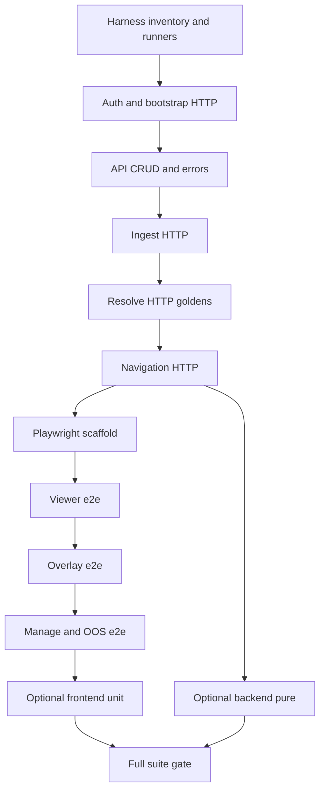

# FRVT-3 Test Execution Plan

**Document:** `frvt-3-test-execution-plan-1`
**Status:** Ready for implementation
**Audience:** A coding agent (and reviewers) automating the FRVT-3 test plans end to end.
**Scope:** Implement automated coverage for **every Required and Optional** case in the test-plan index and area files; fix product defects until green; leave changes uncommitted for owner review.

## How to use this document

- The **test plans** are the oracle for expected behavior. Do not invent new acceptance criteria.
  - [frvt-3-test-plan-1.md](./frvt-3-test-plan-1.md) — index, fixtures, assumptions, risks R-01–R-10
  - [frvt-3-test-plan-auth-and-bootstrap-1.md](./frvt-3-test-plan-auth-and-bootstrap-1.md)
  - [frvt-3-test-plan-api-and-ingest-1.md](./frvt-3-test-plan-api-and-ingest-1.md)
  - [frvt-3-test-plan-resolver-and-navigation-1.md](./frvt-3-test-plan-resolver-and-navigation-1.md)
  - [frvt-3-test-plan-viewer-and-overlay-1.md](./frvt-3-test-plan-viewer-and-overlay-1.md)
  - [frvt-3-test-plan-manage-and-oos-1.md](./frvt-3-test-plan-manage-and-oos-1.md)
- Product specs remain authoritative when a case is ambiguous: [server](./frvt-3-server-and-api-spec-1.md), [UI](./frvt-3-ui-spec-1.md), [resolver/ETL](./frvt-3-resolver-and-etl-spec-1.md). Specs win over POC/research.
- Work phases **in order**. Do not start phase *N+1* until phase *N* Acceptance passes.
- Harness scaffolding and runbooks already exist (see [Target layout](#target-layout)). **Fill in test bodies** and update [`.test/coverage-matrix.md`](../.test/coverage-matrix.md) as you complete each case.
- Follow runbooks under [`.test/runbooks/`](../.test/runbooks/) for environment, per-phase gates, defect loops, and full-suite orchestration.

> **Rule 12 (product code).** Phase numbers and plan/workflow identifiers must **never** appear in product application code under `frvt/api`, `frvt/resolver`, `frvt/ingest`, or `frvt/web/src` (including comments, config, migrations, commit messages, and runtime strings).
>
> **Harness exemption.** Rule 12 **does not apply** to harnesses and incidental/ephemeral testops code: `.spec/`, `.test/`, `frvt/testops/`, `frvt/web/e2e/`, suite runners, and pytest/Playwright markers. `TC-*` IDs **should** appear in markers, docstrings, and the coverage matrix for traceability.

---

## Locked owner decisions

| Topic | Decision |
| --- | --- |
| Case scope | Required **and** Optional (full backlog) |
| Defects | Fix product code until the case passes; never commit or push |
| Browser e2e | Playwright |
| Server for e2e | **External** — operator (or runbook) starts uvicorn; Playwright does **not** auto-start `webServer` |
| Traceability | `TC-*` in markers/docstrings + [`.test/coverage-matrix.md`](../.test/coverage-matrix.md) |

---

## Global conventions

- **Never commit or push** (Rule 11). Owner reviews everything.
- **Defect policy:** On red caused by product behavior, fix product code (logging, orienting comments, size/argument limits, reuse) then re-run the phase gate. Do **not** weaken assertions to match a buggy product. Escalate only when an Interim lock (A-04 / R-01–R-10) conflicts with the product and needs an owner decision.
- **Testing standards (Rule 3):** Happy paths and essential failure cases for contracts. Do not test thin REST delegates, DTO accessors, or fetch wrappers that only forward arguments.
- **Reuse:** Prefer extending existing modules under `frvt/tests/` and Vitest files under `frvt/web/src/` over forking parallel suites. Shared helpers live in `frvt/testops/`.
- **Flaky e2e:** Wait on URL params, visible labels, and stable roles — not fixed sleeps.
- **Out of scope confirmations:** Assert absence of POC-only behaviors (chapter-wide overlay, sniffer, custom login route, editable scripture).
- **Quality gates** are part of every phase Acceptance (see below).

### Quality gates (every phase that touches code)

From `frvt/` (with venv active) and `frvt/web/` as applicable:

```text
# Python (from frvt/)
python -m ruff check api resolver ingest tests testops
python -m black --check api resolver ingest tests testops
python -m mypy -p frvt.api -p frvt.resolver -p frvt.ingest

# TypeScript (from frvt/web/)
npm run typecheck
npm run lint
npm run format:check
```

### Pytest markers

Register and use markers (already declared in `frvt/pyproject.toml`):

- `phase1` … `phase12` — phase gate selection
- `tc("TC-…")` style: use `@pytest.mark.tc("TC-AUTH-001")` (marker name `tc` with id argument) **or** a dedicated marker per area (`auth`, `api`, `ingest`, `resolve`, `nav`, `ui`, `overlay`, `manage`, `oos`) plus the TC id in the test docstring’s first line: `"""TC-AUTH-001: …"""`

Recommended pattern:

```python
@pytest.mark.phase1
@pytest.mark.auth
def test_valid_basic_credentials_allow_api_access(api_client):
    """TC-AUTH-001: Valid Basic credentials allow API access."""
    ...
```

Playwright: put `TC-…` in `test.describe` / `test` titles and in annotations.

---

## Target layout

```text
.spec/frvt-3-test-execution-plan-1.md   # this file
.test/
  coverage-matrix.md
  runbooks/
    env-up.md
    run-phase.md
    defect-loop.md
    full-suite.md
frvt/
  testops/           # shared helpers, fixture factories, run_suite.py
  tests/             # pytest TC bodies (extend existing modules)
  web/
    e2e/             # Playwright suites
    playwright.config.ts
```

Primary fixtures (from the test-plan index):

| Asset | Path |
| --- | --- |
| Sample project zip | `research/SampleTranslations/6b7f504f1b6050c1-rev1-release.zip` |
| Other sample zips | `research/SampleTranslations/*.zip` |
| Copenhagen ingredients | `research/CopenhagenFormat/{org,eng,lxx,rso,rsc,vul,validated}.json` |
| Schema | `research/CopenhagenFormat/versification_schema.json` |
| Paratext VRS | `research/ParatextFormat/*.vrs` |

Helpers: `frvt/testops/sample_assets.py`, `frvt/testops/http_client.py`, `frvt/testops/fixtures/`.

---

## Dependency-ordered phases



Run a phase gate with:

```text
python -m frvt.testops.run_suite --phase N
```

(from repo root, with `frvt/.venv` and `PYTHONPATH` including the repo root — see runbooks).

---

### Phase 0 — Harness inventory and runners

**Goal:** Confirm scaffolding is present and the coverage matrix lists every `TC-*`.

**Work (already done in scaffolding pass; re-verify if missing):**

- `.test/coverage-matrix.md` lists every case from the five area files
- `.test/runbooks/*.md` present
- `frvt/testops/` helpers and `run_suite.py` importable
- Playwright config + smoke stub present; **no** `webServer` auto-start
- Pytest markers registered in `frvt/pyproject.toml`

**Cases:** none (infrastructure)

**Acceptance:**

1. `python -m frvt.testops.run_suite --phase 0` exits 0
2. Coverage matrix row count matches the inventory in this plan’s [Appendix A](#appendix-a--complete-tc-inventory)
3. Runbooks open and path references resolve

---

### Phase 1 — Auth and bootstrap (HTTP)

**Goal:** Automate auth and server bootstrap cases via pytest `TestClient` (and note e2e-only cases deferred to phase 7).

**Cases:**

| ID | Priority | Notes |
| --- | --- | --- |
| TC-AUTH-001 | Required | pytest |
| TC-AUTH-002 | Required | Playwright — implement in phase 7; mark matrix `deferred-phase7` until then |
| TC-AUTH-010 | Required | pytest — all gated routes |
| TC-AUTH-011 | Required | pytest |
| TC-AUTH-013 | Required | Playwright — phase 7/8 |
| TC-SERVER-001 | Required | pytest |
| TC-SERVER-002 | Required | pytest against seeded session |
| TC-SERVER-003 | Required | pytest |
| TC-SERVER-004 | Required | Playwright — phase 7 |
| TC-SERVER-010 | Required | pytest (simulate DB down carefully) |
| TC-SERVER-011 | Required | pytest idempotent seed |
| TC-SERVER-013 | Required | pytest; pivots not in body |

**Work:** Extend `frvt/tests/test_health_auth.py`, `test_bootstrap.py` (or add focused modules). Use `@pytest.mark.phase1`. Update matrix statuses.

**Acceptance:** `python -m frvt.testops.run_suite --phase 1` green; all phase-1 pytest cases `done` in matrix; quality gates clean for touched Python.

---

### Phase 2 — API CRUD, pagination, errors

**Goal:** Cover all `TC-API-*` via HTTP integration tests.

**Cases:** TC-API-001, 002, 003, 004, 005, 010, 011, 012, 013, 014, 015, 016, 017 (all Required).

**Work:** Extend `frvt/tests/test_api_crud.py` (and siblings). Honor R-10: `limit>500` expects `422` primarily (accept `400` only if hand-validated). Use `frvt/testops` helpers for auth and envelope asserts.

**Acceptance:** `--phase 2` green; matrix updated; quality gates clean.

---

### Phase 3 — Ingest (HTTP Required)

**Goal:** Project/VRS/JSON ingest happy paths and negatives over HTTP.

**Cases:**

| ID | Priority | Where |
| --- | --- | --- |
| TC-INGEST-001 | Required | pytest |
| TC-INGEST-002 | Required | pytest |
| TC-INGEST-003 | Required | pytest |
| TC-INGEST-010 | Required | pytest + `malformed_zips` |
| TC-INGEST-011 | Required | pytest + `malformed_zips` |
| TC-INGEST-012 | Required | pytest |
| TC-INGEST-013 | Required | pytest |
| TC-INGEST-017 | Required | pytest — convert or fail closed; never silent persist |
| TC-INGEST-018 | Required | Playwright — phase 8/10; matrix `deferred-phase8` until then |

**Work:** Extend `frvt/tests/test_api_ingest_resolve.py`; use `sample_assets.primary_project_zip()` and malformed builders. Do not require literal filename `custom.vrs` (R-02).

**Acceptance:** `--phase 3` green; sample zip ingest succeeds in tests; matrix updated.

---

### Phase 4 — Resolve API (Required goldens and errors)

**Goal:** All Required `TC-RESOLVE-*` via `GET /api/resolve`.

**Cases (Required):** TC-RESOLVE-001–011, 013–014, 020–025, 027–028.

**Deferred to phase 6 (Optional):** TC-RESOLVE-012, TC-RESOLVE-026.

**Work:**

- Build translation pairs with eng/org preferred or overrides via testops helpers
- Synthetic schemes for exclude/merge/complex (T4/T5/T11) via `frvt/testops/fixtures/synthetic_schemes.py`
- Assert T3 relation ∈ `{shift, renumber}` (R-03)
- Error precedence: missing translation `404` before resolve; override not associated `409`; no preferred `409`; no shared ancestor `422`

**Acceptance:** `--phase 4` green; matrix updated for Required resolve cases.

---

### Phase 5 — Navigation, deltas, misalignments

**Goal:** Required `TC-NAV-*`.

**Cases:**

| ID | Priority | Where |
| --- | --- | --- |
| TC-NAV-001, 002, 003, 004, 010, 012 | Required | pytest HTTP |
| TC-NAV-005, 006, 007, 011 | Required | Playwright — implement in phase 8; matrix `deferred-phase8` until then |

**Work:** HTTP cases first. Misalignment tests assert fixed vocabulary + representative seeds (A-08 / R-04), not an exhaustive per-verse golden list.

**Acceptance:** `--phase 5` green for pytest subset; deferred e2e rows noted in matrix.

---

### Phase 6 — Optional backend (pure / internals)

**Goal:** Optional automation candidates that call Python modules directly.

**Cases:** TC-INGEST-004, 005, 006, 007, 014, 015, 016; TC-RESOLVE-012, 026.

**Work:** Prefer `frvt/tests/test_ingest_pure.py`, `test_resolver.py`, `test_parse_ref.py`. No DB writes in pure ETL asserts (TC-INGEST-007). Cycle detection and “resolve never loads verse text” as Optional unit/integration.

**Acceptance:** `--phase 6` green; matrix Optional backend rows `done`.

---

### Phase 7 — Playwright scaffold and auth/server smoke

**Goal:** Live-server smoke against an **already running** API+UI (external server mode).

**Preconditions:** Follow [`.test/runbooks/env-up.md`](../.test/runbooks/env-up.md); server on `http://localhost:8000` with Basic `admin` / `Admin123!` (or env overrides).

**Cases:** TC-AUTH-002, TC-SERVER-004 (and optionally start TC-AUTH-013).

**Work:** Expand `frvt/web/e2e/` beyond smoke. Use `httpCredentials` from Playwright config. Do **not** add `webServer` auto-start unless the owner revises this plan.

**Acceptance:** With server up, `python -m frvt.testops.run_suite --phase 7` green; smoke + listed cases pass.

---

### Phase 8 — Viewer e2e

**Goal:** Required viewer session cases.

**Cases (Required):** TC-UI-001–007, 009–010, 020–025, 027, 030–036; plus deferred TC-INGEST-018 and TC-NAV-005/006/007/011 as applicable when viewer chrome is ready.

**Optional (phase 11):** TC-UI-026, TC-UI-037.

**Work:** Seed data via API helpers before UI steps. Assert URL owns session params; desktop viewport ≥1280. Manual-level cases (024, 025, 027) may be automated where practical or checklist-documented under `.test/runbooks/` with clear pass criteria — prefer Playwright automation when feasible.

**Acceptance:** `--phase 8` green; matrix updated.

---

### Phase 9 — Overlay e2e

**Goal:** Required overlay topologies and map behavior.

**Cases (Required):** TC-OVERLAY-001–006, 011, 012.

**Optional (phase 11):** TC-OVERLAY-007, 010.

**Work:** Associate contrasting schemes for non-identity overlays (A-05 / R-07). Assert current-result-only (no chapter-wide overlay — TC-OVERLAY-012). Prefer visible connectors/outlines over DevTools.

**Acceptance:** `--phase 9` green; matrix updated.

---

### Phase 10 — Manage and out-of-scope confirmations

**Goal:** Manage flows and OOS confirmations.

**Cases:** All `TC-MANAGE-*`, all `TC-OOS-*` (all Required).

**Work:** Modals are local state (URL must not change). Preferred remove blocked. OOS: no sniffer, scripture not editable, no custom login route.

**Acceptance:** `--phase 10` green; matrix updated.

---

### Phase 11 — Optional frontend

**Goal:** Optional UI/overlay unit automation.

**Cases:** TC-UI-026, TC-UI-037; TC-OVERLAY-007, TC-OVERLAY-010; any DrawPlan/`lib` coverage that supports those cases.

**Work:** Vitest under `frvt/web/src/` (extend `drawPlan.test.ts`, format/ref helpers). Credentials-never-logged may be a static scan or console spy — keep it essential, not brittle.

**Acceptance:** `--phase 11` green; Optional frontend rows `done`.

---

### Phase 12 — Full suite gate

**Goal:** One autonomous run covering all prior phases; matrix fully mapped.

**Work:**

1. Update `.test/coverage-matrix.md` so every TC is `done` (or explicitly `oos-confirmed` where the case is an out-of-scope confirmation that passed)
2. Run `python -m frvt.testops.run_suite --all` with Postgres up and (for e2e) server running
3. Run full quality gates
4. Follow [`.test/runbooks/full-suite.md`](../.test/runbooks/full-suite.md)

**Acceptance:**

- `--all` exits 0
- Coverage matrix has no `pending` or `deferred-*` rows
- Python and TypeScript quality gates clean
- No commits/pushes performed

---

## Defect loop (summary)

See [`.test/runbooks/defect-loop.md`](../.test/runbooks/defect-loop.md). Short form:

1. Reproduce with the smallest command (`pytest -k …` or a single Playwright test)
2. Fix product code (not the assertion) unless the test plan Expected result is wrong — then escalate
3. Re-run the phase gate
4. Update matrix notes if a risk flag (R-*) applied

---

## Appendix A — Complete TC inventory

| ID | Priority | Phase | Proposed home |
| --- | --- | --- | --- |
| TC-AUTH-001 | Required | 1 | `frvt/tests/test_health_auth.py` |
| TC-AUTH-002 | Required | 7 | `frvt/web/e2e/auth.spec.ts` |
| TC-AUTH-010 | Required | 1 | `frvt/tests/test_health_auth.py` |
| TC-AUTH-011 | Required | 1 | `frvt/tests/test_health_auth.py` |
| TC-AUTH-013 | Required | 7–8 | `frvt/web/e2e/auth.spec.ts` |
| TC-SERVER-001 | Required | 1 | `frvt/tests/test_health_auth.py` |
| TC-SERVER-002 | Required | 1 | `frvt/tests/test_bootstrap.py` |
| TC-SERVER-003 | Required | 1 | `frvt/tests/test_bootstrap.py` |
| TC-SERVER-004 | Required | 7 | `frvt/web/e2e/smoke.spec.ts` |
| TC-SERVER-010 | Required | 1 | `frvt/tests/test_health_auth.py` |
| TC-SERVER-011 | Required | 1 | `frvt/tests/test_bootstrap.py` |
| TC-SERVER-013 | Required | 1 | `frvt/tests/test_api_ingest_resolve.py` |
| TC-API-001 | Required | 2 | `frvt/tests/test_api_crud.py` |
| TC-API-002 | Required | 2 | `frvt/tests/test_api_crud.py` |
| TC-API-003 | Required | 2 | `frvt/tests/test_api_crud.py` |
| TC-API-004 | Required | 2 | `frvt/tests/test_api_crud.py` |
| TC-API-005 | Required | 2 | `frvt/tests/test_api_crud.py` |
| TC-API-010 | Required | 2 | `frvt/tests/test_api_crud.py` |
| TC-API-011 | Required | 2 | `frvt/tests/test_api_crud.py` |
| TC-API-012 | Required | 2 | `frvt/tests/test_api_crud.py` |
| TC-API-013 | Required | 2 | `frvt/tests/test_api_crud.py` |
| TC-API-014 | Required | 2 | `frvt/tests/test_api_crud.py` |
| TC-API-015 | Required | 2 | `frvt/tests/test_api_crud.py` |
| TC-API-016 | Required | 2 | `frvt/tests/test_api_crud.py` |
| TC-API-017 | Required | 2 | `frvt/tests/test_api_crud.py` |
| TC-INGEST-001 | Required | 3 | `frvt/tests/test_api_ingest_resolve.py` |
| TC-INGEST-002 | Required | 3 | `frvt/tests/test_api_ingest_resolve.py` |
| TC-INGEST-003 | Required | 3 | `frvt/tests/test_api_ingest_resolve.py` |
| TC-INGEST-004 | Optional | 6 | `frvt/tests/test_ingest_pure.py` |
| TC-INGEST-005 | Optional | 6 | `frvt/tests/test_ingest_pure.py` |
| TC-INGEST-006 | Optional | 6 | `frvt/tests/test_ingest_pure.py` |
| TC-INGEST-007 | Optional | 6 | `frvt/tests/test_ingest_pure.py` |
| TC-INGEST-010 | Required | 3 | `frvt/tests/test_api_ingest_resolve.py` |
| TC-INGEST-011 | Required | 3 | `frvt/tests/test_api_ingest_resolve.py` |
| TC-INGEST-012 | Required | 3 | `frvt/tests/test_api_ingest_resolve.py` |
| TC-INGEST-013 | Required | 3 | `frvt/tests/test_api_ingest_resolve.py` |
| TC-INGEST-014 | Optional | 6 | `frvt/tests/test_ingest_pure.py` |
| TC-INGEST-015 | Optional | 6 | `frvt/tests/test_ingest_pure.py` |
| TC-INGEST-016 | Optional | 6 | `frvt/tests/test_ingest_pure.py` |
| TC-INGEST-017 | Required | 3 | `frvt/tests/test_api_ingest_resolve.py` |
| TC-INGEST-018 | Required | 8 | `frvt/web/e2e/manage.spec.ts` |
| TC-RESOLVE-001 | Required | 4 | `frvt/tests/test_resolver.py` / API tests |
| TC-RESOLVE-002 | Required | 4 | same |
| TC-RESOLVE-003 | Required | 4 | same |
| TC-RESOLVE-004 | Required | 4 | same |
| TC-RESOLVE-005 | Required | 4 | same |
| TC-RESOLVE-006 | Required | 4 | same |
| TC-RESOLVE-007 | Required | 4 | same |
| TC-RESOLVE-008 | Required | 4 | same |
| TC-RESOLVE-009 | Required | 4 | same |
| TC-RESOLVE-010 | Required | 4 | same |
| TC-RESOLVE-011 | Required | 4 | same |
| TC-RESOLVE-012 | Optional | 6 | `frvt/tests/test_resolver.py` |
| TC-RESOLVE-013 | Required | 4 | API resolve tests |
| TC-RESOLVE-014 | Required | 4 | API resolve tests |
| TC-RESOLVE-020 | Required | 4 | API resolve tests |
| TC-RESOLVE-021 | Required | 4 | API resolve tests |
| TC-RESOLVE-022 | Required | 4 | API resolve tests |
| TC-RESOLVE-023 | Required | 4 | API resolve tests |
| TC-RESOLVE-024 | Required | 4 | API resolve tests |
| TC-RESOLVE-025 | Required | 4 | API resolve tests |
| TC-RESOLVE-026 | Optional | 6 | `frvt/tests/test_resolver.py` |
| TC-RESOLVE-027 | Required | 4 | API / DB inspect |
| TC-RESOLVE-028 | Required | 4 | API resolve tests |
| TC-NAV-001 | Required | 5 | navigation API tests |
| TC-NAV-002 | Required | 5 | navigation API tests |
| TC-NAV-003 | Required | 5 | navigation API tests |
| TC-NAV-004 | Required | 5 | navigation API tests |
| TC-NAV-005 | Required | 8 | `frvt/web/e2e/viewer.spec.ts` |
| TC-NAV-006 | Required | 8 | `frvt/web/e2e/viewer.spec.ts` |
| TC-NAV-007 | Required | 8 | `frvt/web/e2e/viewer.spec.ts` |
| TC-NAV-010 | Required | 5 | navigation API tests |
| TC-NAV-011 | Required | 8 | `frvt/web/e2e/viewer.spec.ts` |
| TC-NAV-012 | Required | 5 | navigation API tests |
| TC-UI-001 | Required | 8 | `frvt/web/e2e/viewer.spec.ts` |
| TC-UI-002 | Required | 8 | viewer e2e |
| TC-UI-003 | Required | 8 | viewer e2e |
| TC-UI-004 | Required | 8 | viewer e2e |
| TC-UI-005 | Required | 8 | viewer e2e |
| TC-UI-006 | Required | 8 | viewer e2e |
| TC-UI-007 | Required | 8 | viewer e2e |
| TC-UI-009 | Required | 8 | viewer e2e |
| TC-UI-010 | Required | 8 | viewer e2e |
| TC-UI-020 | Required | 8 | viewer e2e |
| TC-UI-021 | Required | 8 | viewer e2e |
| TC-UI-022 | Required | 8 | viewer e2e |
| TC-UI-023 | Required | 8 | viewer e2e |
| TC-UI-024 | Required | 8 | viewer e2e / checklist |
| TC-UI-025 | Required | 8 | viewer e2e / checklist |
| TC-UI-026 | Optional | 11 | vitest / scan |
| TC-UI-027 | Required | 8 | viewer e2e / checklist |
| TC-UI-030 | Required | 8 | viewer e2e |
| TC-UI-031 | Required | 8 | viewer e2e |
| TC-UI-032 | Required | 8 | viewer e2e |
| TC-UI-033 | Required | 8 | viewer e2e |
| TC-UI-034 | Required | 8 | viewer e2e |
| TC-UI-035 | Required | 8 | viewer e2e |
| TC-UI-036 | Required | 8 | viewer e2e |
| TC-UI-037 | Optional | 11 | `frvt/web/src/lib/*.test.ts` |
| TC-OVERLAY-001 | Required | 9 | `frvt/web/e2e/overlay.spec.ts` |
| TC-OVERLAY-002 | Required | 9 | overlay e2e |
| TC-OVERLAY-003 | Required | 9 | overlay e2e |
| TC-OVERLAY-004 | Required | 9 | overlay e2e |
| TC-OVERLAY-005 | Required | 9 | overlay e2e |
| TC-OVERLAY-006 | Required | 9 | overlay e2e |
| TC-OVERLAY-007 | Optional | 11 | `drawPlan` / controller unit |
| TC-OVERLAY-010 | Optional | 11 | overlay unit |
| TC-OVERLAY-011 | Required | 9 | overlay e2e |
| TC-OVERLAY-012 | Required | 9 | overlay e2e |
| TC-MANAGE-001 | Required | 10 | `frvt/web/e2e/manage.spec.ts` |
| TC-MANAGE-002 | Required | 10 | manage e2e |
| TC-MANAGE-003 | Required | 10 | manage e2e |
| TC-MANAGE-004 | Required | 10 | manage e2e |
| TC-MANAGE-005 | Required | 10 | manage e2e |
| TC-MANAGE-006 | Required | 10 | manage e2e |
| TC-MANAGE-010 | Required | 10 | manage e2e |
| TC-MANAGE-011 | Required | 10 | manage e2e |
| TC-OOS-001 | Required | 10 | manage/api e2e |
| TC-OOS-002 | Required | 10 | viewer e2e |
| TC-OOS-003 | Required | 10 | auth e2e |

**Total:** 120 cases (see [`.test/coverage-matrix.md`](../.test/coverage-matrix.md) for the authoritative row list).

---

## Deferred / out of scope for this plan’s agent

- Committing or pushing
- Marking “Approved (human)” boxes on the test-plan index
- Editing authoritative product specs
- Changing Interim algorithm locks without owner approval
