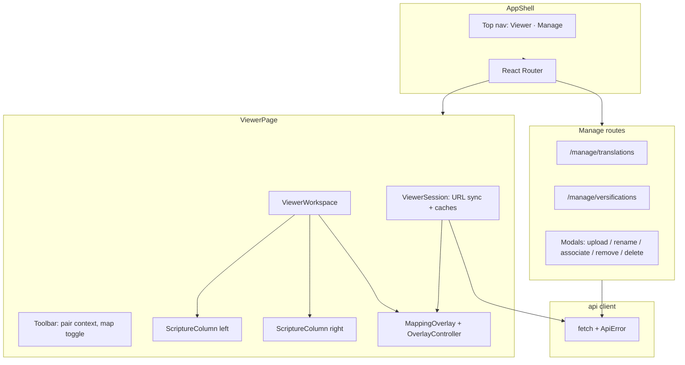
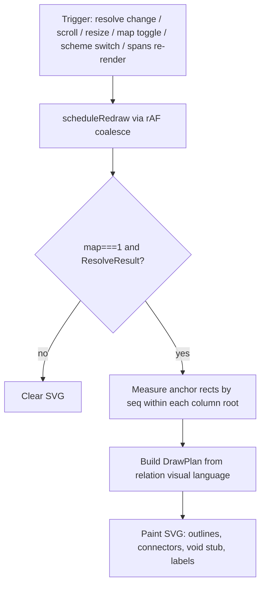

# Versification Viewer: UI Design Specification

**Status:** Draft for review and reconciliation
**Audience:** The developer implementing the React frontend; and the developers writing the server, resolver, and ETL specifications that this document is reconciled against.
**Scope of this document:** The React single-page application under `frvt/web/`: screens, client state, SVG overlay rendering, and API consumption conventions. It does not specify the HTTP API shapes, the mapping resolver, or ETL/ingest internals. Those are owned by separate specifications and appear here only as consumption contracts and reconciliation items.

---

## 1. Overview

This specification describes the frontend for the versification viewer proof-of-concept (POC). The POC displays two Bible translations side by side and aligns them across differing versifications, as described in [research/frvt-versification-viewer-poc-1.md](../research/frvt-versification-viewer-poc-1.md). The HTTP API this UI consumes is defined in [frvt-3-server-db-api-design-1.md](frvt-3-server-db-api-design-1.md).

The frontend has four responsibilities:

1. Render a desktop two-column scripture viewer with per-column navigation, jump menus, and versification switching.
2. Draw outlines and connector lines for the **current** alignment only, using an SVG overlay driven by denormalized resolve results.
3. Provide manage screens (separate routes) and focused modals for uploading, renaming, associating, and deleting translations and versifications.
4. Consume the FRVT-3 API with same-origin `fetch`, native HTTP Basic authentication, and the uniform error envelope.

The frontend does not compute mappings. It requests resolved spans from the API and draws what it receives.

### 1.1 Operational conventions

The UI is a React + TypeScript SPA. Vite emits built assets to `frvt/web/dist/`; FastAPI mounts that directory at `/` with `StaticFiles(html=True)` (see server §5.5 and §9, and the mount-path ask in [§9.2](#92-required-api-reconciliation)). Access is gated by the browser's native HTTP Basic prompt; there is no custom login form. The layout is desktop-only. Styling uses semantic CSS tokens for a dark, understated, VS Code–like appearance. This is provisional direction, not a pixel-accurate reproduction of Codex/Aquilla. Vite is the build tool for producing static assets; this document does not prescribe a Vite development-proxy workflow.

---

## 2. Scope and non-goals

### 2.1 In scope

- Route map for the viewer and manage screens.
- Two-column viewer: translation selectors, BCV selectors, jump menus, scheme switcher, mapping toggle, verse list by `seq`.
- SVG overlay: outlines, connector topologies, relation-colored visual language, connector-to-void for exclusions.
- Empty state that requires project upload when no translations exist.
- Manage screens for translations and versifications; modals for upload, rename, associate, remove association, and delete confirmation.
- Typed API client conventions, error handling, and URL-owned viewer session state.
- Module layout under `frvt/web/`.
- Contract-level UI tests.

### 2.2 Non-goals (owned by other specifications)

- **HTTP API, database, and server bootstrap.** Defined in [frvt-3-server-db-api-design-1.md](frvt-3-server-db-api-design-1.md). This document consumes those endpoints and flags reconciliation items only.
- **Resolver internals.** Mapping pivot and relation classification are specified elsewhere. The UI consumes `ResolveResult` and its `relation` field (values from the `relation_type` vocabulary) as given.
- **ETL/ingest internals.** Parsing and ingredient derivation are specified elsewhere. The UI only posts files and displays validation errors from the envelope.
- **Versification detection.** No sniffer UI. Detection remains external.
- **Editing scripture text.** The viewer is read-only for content.
- **Mobile / responsive layout.** Desktop only for the POC.
- **Production auth, multi-tenant, and scaling concerns.** Native Basic gate only.
- **Vite / local-proxy developer workflow.** Build output and static mount are enough for this spec.

### 2.3 Capability traceability

Every POC capability the UI owns traces to a screen or component and the API surface it consumes. API shapes remain defined by the server spec; this table does not redefine them.

| # | POC capability | UI surface | API surface (server) | Notes |
| --- | --- | --- | --- | --- |
| 1 | Side-by-side display of two translations | `ViewerPage` / `ScriptureColumn` | `GET /api/translations`, `GET /api/translations/{id}/spans` | Spans rendered by `seq`. |
| 2 | Navigation in one column drives alignment in the other | `ViewerSession` resolve cycle | `GET /api/resolve` | Drive→from / follower→to ([§7.6](#76-resolve-request-mapping)); follower may load a new chapter before scroll ([§6.4](#64-viewer-workflow)). |
| 3 | Per-column book/chapter/verse selector | `ColumnChrome` / BCV selectors | `GET /api/translations/{id}/navigation`, spans | Verse options from loaded chapter spans when navigation omits verse lists. |
| 4 | Per-column jump menu | `JumpMenu` | `GET /api/resolve/deltas`, `/misalignments`, `/navigation` | **Blocked** until `navigation_ref` lands ([§9.2](#92-required-api-reconciliation)). |
| 5 | Outlines around mapped verses and partial spans | `MappingOverlay` | `GET /api/resolve` (`part`) | Partial outlines the part node only. |
| 6 | Connector lines between mapped spans | `OverlayController` | `GET /api/resolve` (`seq`) | Topology by `relation` value; edges follow drive/follower, not left/right ([§8.4](#84-overlay-redraw-pipeline)). |
| 7 | Always-on highlight of current verse and its lines | `VerseSpan` CSS + overlay | `GET /api/resolve` | Text highlight stays on; connectors follow toggle. |
| 8 | Toggle for mapping overlays | `ViewerToolbar` `map` URL param | Current `ResolveResult` only | **Not** chapter-wide deltas. Server §2.3 row 8 reword ask: [§9.2](#92-required-api-reconciliation) #5. |
| 9 | On-the-fly switching of an associated versification | `ColumnChrome` scheme select | `PUT .../versifications/{scheme_id}/active` | Labels via versification list join ([§6.5](#65-switching-versifications)). |
| 10 | Ingest translation plus `custom.vrs` from a zipped project | Empty state + upload modal | `POST /api/ingest/project` | Synchronous; UI blocks on the request. |
| 11 | Direct upload of VRS and Copenhagen/Burrito files | Manage versifications modal | `POST /api/versifications/upload` | Then associate separately. |
| 12 | Association of an uploaded versification with a translation | Associate modal; remove association action | `POST` / `DELETE .../versifications/{scheme_id}` | Confirm-delete modal for remove. |
| 13 | CRUD for translations | `/manage/translations` | Server §7.3 | |
| 14 | CRUD for associated versifications | `/manage/versifications` + associations | Server §§7.5–7.6 | |

---

## 3. Basis and assumptions

### 3.1 Sources

- Architecture and capabilities: [research/frvt-versification-viewer-poc-1.md](../research/frvt-versification-viewer-poc-1.md).
- Domain background: [research/frvt-versification-standards-and-tooling-1.md](../research/frvt-versification-standards-and-tooling-1.md).
- API, auth, error envelope, static mount, and DTOs: [frvt-3-server-db-api-design-1.md](frvt-3-server-db-api-design-1.md).
- Relation vocabulary: server §6.2.
- Locked product decisions from FRVT-3 UI design review (this document's §3.2).

### 3.2 Assumptions and locked decisions

These are UI decisions at boundaries shared with sibling specifications. They are collected again in [Section 12](#12-open-questions-and-reconciliation-items).

- **Single active scheme.** Accept one globally active scheme per translation for the POC. Activation from either column invalidates all affected mapping data. If the same translation appears in both columns, both columns necessarily share that scheme.
- **BCV grammar.** Use the server grammar, including verse `0` and optional parts. `GET /api/resolve` receives only a single concrete span. Range-based jump entries carry a server-provided `navigation_ref`; the frontend does not duplicate a BCV range parser.
- **Resolve denormalization.** Require individual source and target spans suitable for DOM anchoring. Splits return one-to-many, merges include all source siblings, exclusions return an empty target list, and partial mappings carry part identifiers. `seq` remains the stable rendered anchor.
- **Mapping toggle.** Toggles drawing of the **current** alignment only. It does not load or draw all mappings in the chapter.
- **Exclude presentation.** Connector-to-void: a dashed connector from the source toward a void terminator in the inter-column gutter. No invented target span.
- **Visual language.** Relation-colored outlines, branch/converge topology, line patterns, and textual labels form the v1 baseline. Iteration after the first usable build is expected and allowed.
- **Desktop only.** Target usable layout at approximately 1280px and above. No mobile collapse.
- **Manage IA.** Separate routes away from the viewer. Modals only for upload, rename, associate, remove association, and confirm-delete.
- **Empty state.** When no translations exist, require project upload through an explanatory empty state. Seeded fixtures are appropriate for development, automated tests, and demonstrations only — not as default production content.
- **Auth.** Rely on the browser's native HTTP Basic prompt.
- **Verse 0 display.** Show both `Title` and `0` (for example `Title (0)`). Machine/API value remains `0`.
- **Styling.** Dark, understated, VS Code–like via semantic tokens. Not described as pixel-accurate Codex/Aquilla reproduction.

---

## 4. Technology stack

| Concern | Choice | Rationale |
| --- | --- | --- |
| Language | TypeScript | Matches typed API DTOs; catches ref/relation mistakes at compile time. |
| UI library | React 18+ | Stateful interactive viewer; efficient overlay invalidation. |
| Routing | React Router 6+ | Separate viewer and manage routes; SPA fallback via server `StaticFiles(html=True)`. |
| Build | Vite (build only) | Emits static assets for FastAPI to serve. Dev-proxy workflow is out of scope for this spec. |
| Styling | CSS variables (semantic tokens) + plain CSS | Dark VS Code–like chrome without a design-system package. |
| HTTP | `fetch` with `credentials: "same-origin"` | Same-origin static+API mount; native Basic supplies credentials after challenge. |
| State | URL search params + one `ViewerSession` context | Bookmarkable viewer session without Redux/Zustand/React Query. |
| Overlay | SVG + imperative controller (rAF-batched) | Matches POC; geometry is DOM-driven and redraw-heavy. |
| Tests | Vitest + Testing Library (or equivalent) | Contract tests for labels, DrawPlan topologies, ApiError mapping, empty state. |

### 4.1 Dependencies

Pin majors at implementation time. Expected packages:

```text
react
react-dom
react-router-dom
typescript
vite
```

Dev/test (illustrative): `vitest`, `@testing-library/react`, `msw` (optional for API contract tests).

Do not introduce a global state library, a component library, or OpenAPI codegen for the POC unless reconciliation later requires it.

---

## 5. UI architecture



### 5.1 Layer boundaries

| Module | Owns | Must not own |
| --- | --- | --- |
| `api/` | HTTP, error envelope unwrap, resource helpers | UI state, overlay geometry |
| `viewer/ViewerSession` | URL sync, span/nav/association caches, latest `ResolveResult`, scroll-lock | Drawing |
| `viewer/overlay/` | Measure anchors, build DrawPlan, paint SVG | Fetch, BCV range parsing, CRUD |
| `VerseSpan` | DOM anchors (`data-seq`, `data-ref`, `data-part`), click → set current ref | Drawing |
| Manage pages | Lists, detail actions, modal host | Overlay geometry |
| `lib/formatRef` / `lib/bcv` | Display helpers and **building** single-verse refs from structured fields | Parsing ranges |

### 5.2 Authentication

The server gates API and static assets with HTTP Basic (server §5.3). The UI:

1. Issues same-origin requests without a custom Authorization header on first load.
2. Relies on the browser to present the native Basic prompt when it receives `401` + `WWW-Authenticate`.
3. Relies on the browser to attach credentials on subsequent same-origin requests.
4. Shows a simple “Authentication required — reload and sign in” banner only if repeated requests fail after the challenge.

There is no login route and no credential form.

### 5.3 Desktop layout

Minimum comfortable width approximately 1280px. Two columns share horizontal space evenly inside `ViewerWorkspace`. The overlay is an absolutely positioned SVG sibling covering the workspace. Independent vertical scroll per column. No responsive breakpoint that stacks columns.

---

## 6. Screens, routes, and workflows

### 6.1 Route map

| Path | Screen | Purpose |
| --- | --- | --- |
| `/` | `ViewerPage` | Main POC surface. Empty state when `translations.total === 0`. One-translation state when `total === 1` ([§6.3](#63-empty-and-one-translation-states)). |
| `/manage/translations` | `TranslationsManagePage` | List, rename, delete, associate, remove association; project upload. |
| `/manage/versifications` | `VersificationsManagePage` | List, rename, delete; standalone versification upload. |

Shell chrome on all routes: product name, link to Viewer, link to Manage (Translations / Versifications).

Deep links work because the server mounts static files with `html=True` (server §5.5).

### 6.2 Modals (allowed)

Modals are local UI state on manage screens (or on the empty-state CTA). They are never routes.

| Modal | Trigger | API |
| --- | --- | --- |
| Upload project | Empty state CTA; manage translations | `POST /api/ingest/project` |
| Upload versification | Manage versifications | `POST /api/versifications/upload` |
| Rename | Row action | `PATCH` translation or versification |
| Associate scheme | Translation row / detail action | `POST /api/translations/{id}/versifications` |
| Confirm delete (resource) | Row action on translation or versification | `DELETE` translation or versification |
| Confirm remove association | Association row action | `DELETE /api/translations/{id}/versifications/{scheme_id}` |

### 6.3 Empty and one-translation states

When `GET /api/translations` returns `total === 0`:

- Replace the viewer workspace with an explanatory empty state.
- Explain that a Paratext-style project zip (USX + `custom.vrs`) must be uploaded before side-by-side viewing is possible.
- Primary CTA opens the upload-project modal.
- Secondary link to `/manage/versifications` is optional and secondary.

When `total === 1`:

- Render the single selected translation in the left column (or the column that has a translation id).
- Leave the other column on an “Select a second translation” placeholder (or after a second upload, enable the selector).
- Disable resolve, overlay drawing, the map toggle, and jump menus that require a counterpart until both `left` and `right` are set.
- Keep manage / upload available so the user can ingest a second project.

Fixtures under `web/src/fixtures/` (or equivalent) may seed demo/test environments only. Production empty path never assumes seeded content.

### 6.4 Viewer workflow

```mermaid
sequenceDiagram
  actor User
  participant URL as URL params
  participant Sess as ViewerSession
  participant API as /api
  participant Ov as OverlayController

  User->>URL: Set left/right translations and BCV
  URL->>Sess: Sync session
  Sess->>API: GET spans + navigation
  API-->>Sess: Chapter spans by seq
  User->>Sess: Change driving column verse / jump
  Sess->>API: GET /api/resolve (from/to/ref per §7.6)
  API-->>Sess: ResolveResult
  Sess->>Sess: If follower chapter differs, load it and update URL
  Sess->>Sess: Highlight; scroll follower by seq
  Sess->>Ov: Resolve + map toggle + drive side
  Ov->>Ov: Measure, DrawPlan, paint SVG
```

After a successful resolve:

1. Read the primary target's `book` / `chapter` / `verse` / `part` from the structured fields on `ResolvedSpan` ([§9.2](#92-required-api-reconciliation) #6). Do not tokenize `ref`.
2. If the follower's loaded `(book, chapter)` differs from that target, fetch that chapter's spans, update the follower's URL BCV params (`rb/rc/rv/rp` or left equivalents), then proceed.
3. Under scroll-lock, scroll the follower so the primary target `seq` is visible.
4. For `exclude`, do not invent a scroll target.

Follower **scroll offset** is derived, not stored in the URL. Follower **book/chapter/verse** after a cross-chapter resolve **are** written to the URL so refresh stays consistent.

### 6.5 Switching versifications

1. User selects another associated scheme in a column's scheme control.
2. Scheme option labels: baseline is `GET /api/translations/{id}/versifications` joined to `GET /api/versifications` by `scheme_id` to obtain `name` / `canonical` / `based_on`. If the server later enriches `AssociationOut` ([§9.2](#92-required-api-reconciliation) optional), use the enriched fields and skip the join.
3. UI calls `PUT /api/translations/{id}/versifications/{scheme_id}/active`.
4. Session invalidates resolve (and delta/misalignment caches) for that translation.
5. Re-resolve the current driving ref; redraw overlay.
6. Column text order remains `seq` order; only connectors and highlights change.

If both columns display the same translation, both necessarily reflect the newly active scheme.

Removing an association uses the confirm-remove-association modal and `DELETE /api/translations/{id}/versifications/{scheme_id}`. If the removed association was active, the next resolve returns `409` until another scheme is activated; the UI shows an actionable “No active versification — select one” state on that translation.

### 6.6 Jump menu

**Blocked** until server reconciliation item [§9.2](#92-required-api-reconciliation) #1 lands. Until then, ship arbitrary BCV selectors only; do not attempt to parse range-form `source_ref` for jumps.

Once unblocked, each column provides:

1. **Mapped deltas** — `GET /api/resolve/deltas`. Display `source_ref` / `base_ref` as labels. Navigate using `navigation` (preferred) or `navigation_ref`.
2. **Misalignment categories** — `GET /api/resolve/misalignments` with categories `psalm_title`, `chapter_boundary`, `chapter_count`, `lxx_psalm`, `synodal`, `nt_omission`, `other` (human labels owned by the UI). Same navigation rule.
3. **Arbitrary verses** — book/chapter from `GET .../navigation`; verse from loaded spans (or navigation verse lists if the server adds them later).

Selecting a jump entry sets that column's structured BCV from the structured `navigation` object. The UI must not parse range strings.

---

## 7. State model

### 7.1 URL parameters (viewer source of truth)

| Param | Meaning |
| --- | --- |
| `left`, `right` | Translation UUIDs |
| `lb`, `lc`, `lv`, `lp` | Left book, chapter, verse, part (`lp` empty if none) |
| `rb`, `rc`, `rv`, `rp` | Right book, chapter, verse, part |
| `drive` | `left` \| `right` — which column last drove navigation (resolve direction) |
| `map` | `1` \| `0` — overlay connectors on/off for the current alignment |

Defaults when data exists but params are missing: first two translations (or one + unset second), first book/chapter/verse from navigation/spans, `drive=left`, `map=1`.

Follower **scroll offset** is derived from resolve, not stored in the URL. After a cross-chapter resolve, the follower's book/chapter/verse **are** written to the URL ([§6.4](#64-viewer-workflow)).

### 7.2 React state / `ViewerSession`

| State | Location |
| --- | --- |
| Cached spans per `(translationId, book, chapter)` | Session |
| Cached navigation and associations per translation | Session |
| Latest `ResolveResult` for the current alignment | Session |
| Loading flags and `ApiError` banners | Session |
| Scroll-lock (suppress resolve loops during programmatic scroll) | Session |
| Modal open + draft fields | Local to manage / empty-state hosts |

### 7.3 Derived (never source of truth)

- Highlight set = union of current `source_spans` and `target_spans`.
- DrawPlan = visual-language table × measured anchor rects × `relation`.
- Empty viewer = `translations.total === 0`.
- One-translation viewer = `total === 1` or only one of `left`/`right` set ([§6.3](#63-empty-and-one-translation-states)).
- Can switch scheme = associations length > 0 for that translation.
- Resolve enabled = both translation ids set and each has an active scheme.

### 7.4 Building single-verse refs

The client builds resolve `ref` strings only from structured column fields it already holds:

```ts
function toSingleRef(book: string, chapter: number, verse: number, part: string | null): string {
  const base = `${book} ${chapter}:${verse}`;
  return part ? `${base}${part}` : base;
}
```

Examples: `PSA 3:0`, `GEN 1:1`, `SIR 36:13a`. Never parse a range such as `PSA 3:0-8` on the client.

### 7.5 Verse 0 labeling

| Context | Display |
| --- | --- |
| Verse gutter / selector option | `Title (0)` |
| API / `data-verse` / resolve `ref` | `0` |

### 7.6 Resolve request mapping

`GET /api/resolve` requires `from_translation`, `to_translation`, and a single-verse `ref` (server §7.8). Derive them from URL state as follows:

| Condition | `from_translation` | `to_translation` | `ref` |
| --- | --- | --- | --- |
| `drive=left` | `left` | `right` | `toSingleRef` of left BCV (`lb/lc/lv/lp`) |
| `drive=right` | `right` | `left` | `toSingleRef` of right BCV (`rb/rc/rv/rp`) |

Do not call resolve when either translation id is missing, or when either side lacks an active scheme (expect `409` if called anyway). The driving column owns `source_spans`; the follower owns `target_spans`.

---

## 8. Visual language and overlay pipeline

### 8.1 Semantic tokens

Provisional dark VS Code–like tokens (exact values may iterate after first usable build):

| Token | Role | Suggested value |
| --- | --- | --- |
| `--bg` | Page background | `#1e1e1e` |
| `--bg-elevated` | Panels, chrome | `#252526` |
| `--fg` | Primary text | `#cccccc` |
| `--fg-muted` | Secondary text | `#858585` |
| `--border` | Hairlines | `#3c3c3c` |
| `--accent` | Focus / selection | `#3794ff` |
| `--rel-one` | `one_to_one` | `#4ec9b0` |
| `--rel-shift` | `shift` | `#dcdcaa` |
| `--rel-renumber` | `renumber` | `#ce9178` |
| `--rel-split` | `split` | `#c586c0` |
| `--rel-merge` | `merge` | `#569cd6` |
| `--rel-partial` | `partial` | `#9cdcfe` |
| `--rel-exclude` | `exclude` | `#f44747` |
| `--void` | Void terminator | `#6a6a6a` |

### 8.2 Relation visual language (v1 baseline)

This table is the implementable baseline. Topology rules (branch, converge, to-void) stay stable; colors, dash arrays, corner radii, and label copy may iterate after the first usable build without changing the overlay contract.

| `relation` | Outline | Line pattern | Topology | Label (near connector mid / hub) |
| --- | --- | --- | --- | --- |
| `one_to_one` | `--rel-one`, solid | solid 1.5px | direct 1→1 | omit or `1:1` |
| `shift` | `--rel-shift`, solid | solid 1.5px | direct 1→1 | `shift` |
| `renumber` | `--rel-renumber`, solid | solid 1.5px | direct 1→1 | `renumber` |
| `split` | `--rel-split`; source emphasis, thinner targets | solid 2px | **branch** 1→N | `split` |
| `merge` | `--rel-merge`; target emphasis, thinner sources | solid 2px | **converge** N→1 | `merge` |
| `partial` | `--rel-partial`; outline the part box only | dashed 1.5px | direct (or parent cardinality) | `part {id}` |
| `exclude` | `--rel-exclude`; source only | dashed 1.5px | **connector-to-void** | `absent` |

**Toggle (`map`):** when `0`, clear connector/outline SVG for the alignment. Current-verse **text** highlight may remain via CSS. When `1`, draw the current `ResolveResult` only — never fan out chapter deltas into the overlay.

### 8.3 DOM anchor contract

Each rendered span:

```html
<div
  data-side="left"
  data-seq="42"
  data-ref="PSA 3:0"
  data-verse="0"
  data-part=""
>
  <span class="verse-num">Title (0)</span>
  <span class="verse-text">...</span>
</div>
```

Prefer `data-seq` for overlay lookup when `ResolvedSpan.seq` is present. Fall back to `data-ref` (+ part) when `seq` is null. Partial mappings outline the part-bearing node only.

### 8.4 Overlay redraw pipeline



**Algorithm:**

1. Overlay root is `position: absolute; inset: 0` over `ViewerWorkspace`. Columns scroll independently underneath.
2. Identify the **drive column** and **follower column** from URL `drive` (not from assuming source=left). `ResolveResult.source_spans` attach to the drive column; `target_spans` attach to the follower.
3. Anchor lookup: within each column root, `querySelector('[data-seq="…"]')`, with `data-ref` fallback. Skip endpoints whose chapter is not yet loaded (session must load the follower chapter first per §6.4).
4. Convert `getBoundingClientRect()` into overlay-local coordinates.
5. Outlines: rounded rects for each participating span (part-clipped when `part` is set).
6. Connector edge attachment (critical for bidirectional drive):
   - From a span in the **left** column, exit at mid-**right** of its box.
   - From a span in the **right** column, exit at mid-**left** of its box.
   - Therefore when `drive=left`, paths run left→right; when `drive=right`, paths run right→left. Never hard-code “source is left.”
7. Connectors by topology (endpoints are drive/follower spans, edges per step 6):
   - **direct:** drive span → follower span (straight or shallow cubic).
   - **split (branch):** one drive hub → N follower targets.
   - **merge (converge):** N drive sources → one follower hub.
   - **to-void:** dashed line from the drive span toward the inter-column gutter, ending at a void terminator (open circle or bar using `--void`). No fake target outline.
8. Labels: short badge near midpoint or hub per §8.2.
9. Coalesce triggers into one `requestAnimationFrame`. Attach scroll listeners on both column scrollports and a `ResizeObserver` on the workspace. Cancel on unmount.
10. Scroll behavior after resolve is owned by `ViewerSession` ([§6.4](#64-viewer-workflow)), not by the overlay painter.

### 8.5 Exclude = connector-to-void

When `relation === "exclude"` and `target_spans` is empty:

- Outline the drive-column span(s) only.
- Draw a dashed connector into a synthetic void slot in the gutter between columns (toward the follower side).
- Label `absent`.
- Never fabricate a counterpart verse or scroll the follower to an unrelated span.

---

## 9. API consumption boundary

The UI consumes the contract in server [§7](frvt-3-server-db-api-design-1.md#7-api-contract). This section defines client conventions and reconciliation asks only. It does not redefine DTO fields except where a required gap is called out in §9.2.

### 9.1 Client conventions

```text
frvt/web/src/api/
  client.ts       # apiGet / apiSend / apiUpload; credentials: "same-origin"
  errors.ts       # ApiError { status, detail, code, errors? }
  types.ts        # mirrors server §7.2 (+ navigation_ref once reconciled)
  translations.ts
  spans.ts
  versifications.ts
  associations.ts
  resolve.ts
  navigation.ts
  ingest.ts
  health.ts
```

- Paths are relative `/api/...`.
- Non-2xx responses parse the server §5.4 envelope into `ApiError`.
- UI mapping:
  - `400` → toast / inline “invalid request”
  - `401` → banner / reload
  - `404` → toast
  - `409` → actionable message (for example no active scheme)
  - `413` / `422` → show `errors[]` inside the active modal
  - `500` / unknown → generic error banner with `detail` when present
  - `503` → “database unavailable”
- Uploads use `FormData` via `apiUpload`.
- Resolve sends `from_translation`, `to_translation`, and a single-verse (or single partial) `ref` per [§7.6](#76-resolve-request-mapping).
- Abort in-flight resolve when the driving ref changes (`AbortController`).

### 9.2 Required API reconciliation

| # | Ask | Why |
| --- | --- | --- |
| **1 (required)** | Add to `DeltaEntry` and `MisalignmentEntry`: `navigation_ref: str` and `navigation: { book: str, chapter: int, verse: int, part: str \| null }`. **Derivation:** `navigation_ref` / `navigation` are the first single verse of `source_ref` in the from-scheme (the range's lower bound; e.g. `PSA 3:0-8` → `PSA 3:0`, part `null`). Single-verse `source_ref` values (including excludes) pass through unchanged. The result must be legal as `ref` for `GET /api/resolve`. | Jump menus must not parse range-form `source_ref`. Capability 4 is blocked until this lands. |
| **2 (confirm)** | Resolve denormalization as already specified in server §§7.2 / 7.8 / 8.1. | Overlay anchors. |
| **3 (confirm)** | Single active scheme; `PUT .../active` deactivates the previous. | Scheme switch UX. |
| **4 (confirm)** | BCV grammar including verse `0` and optional `part`. | Selectors and labels. |
| **5 (reword)** | Server §2.3 capability row 8 currently ties the overlay toggle to `/api/resolve/deltas`. UI toggle uses the current `ResolveResult` only; other-verse mappings surface via the jump-menu deltas, not a chapter-wide overlay. | Product decision, not cosmetic. |
| **6 (required)** | Extend `ResolvedSpan` with `book: str`, `chapter: int`, `verse: int` (in addition to existing `ref`, `seq`, `part`) so the UI can load a cross-chapter follower without tokenizing `ref`. | Cross-chapter shift/renumber follower load ([§6.4](#64-viewer-workflow)). |
| **7 (confirm)** | FastAPI `StaticFiles(html=True)` mounts `frvt/web/dist/` (Vite build output), not `frvt/web/`. | Avoid serving source instead of the bundle. |

Optional niceties (not blockers): enrich `AssociationOut` with `scheme_name` / `canonical` / `based_on` to avoid the versification-list join for the scheme switcher ([§6.5](#65-switching-versifications)); include verse number lists on `NavBook` if arbitrary jump must work before spans load.

### 9.3 Endpoint usage by screen

| Screen / feature | Endpoints |
| --- | --- |
| Empty / one-translation / upload project | `GET /api/translations`, `POST /api/ingest/project` |
| Viewer columns | `GET /api/translations`, `.../spans`, `.../navigation`, `.../versifications`, `GET /api/versifications` (scheme labels) |
| Resolve + overlay | `GET /api/resolve` |
| Jump menus | `GET /api/resolve/deltas`, `GET /api/resolve/misalignments` (after §9.2 #1) |
| Scheme activate / remove association | `PUT .../active`, `DELETE .../versifications/{scheme_id}` |
| Manage translations | Server §7.3 + ingest + associations |
| Manage versifications | Server §§7.5–7.7 |

---

## 10. Module and file layout

```text
frvt/web/
  index.html
  package.json
  tsconfig.json
  vite.config.ts                 # build only; outDir = dist/
  src/
    main.tsx
    App.tsx                      # router + AppShell
    styles/
      tokens.css                 # semantic + relation tokens
      app.css
    api/                         # §9.1
    lib/
      formatRef.ts               # Title (0) display; no range parser
      bcv.ts                     # toSingleRef from structured fields only
    routes/
      ViewerPage.tsx
      TranslationsManagePage.tsx
      VersificationsManagePage.tsx
    viewer/
      ViewerSession.tsx          # URL sync + caches + resolve mapping (§7.6)
      ViewerToolbar.tsx
      ViewerWorkspace.tsx
      ScriptureColumn.tsx
      ColumnChrome.tsx
      VerseList.tsx
      VerseSpan.tsx
      JumpMenu.tsx
      EmptyStateUpload.tsx
      overlay/
        OverlayController.ts     # measure + DrawPlan + rAF; drive/follower edges
        MappingOverlay.tsx       # SVG host
        visualLanguage.ts        # relation → stroke / topology / label
        drawPlan.ts              # pure builders (unit-tested)
    manage/
      ResourceTable.tsx
      modals/
        UploadProjectModal.tsx
        UploadVersificationModal.tsx
        RenameModal.tsx
        AssociateModal.tsx
        DeleteConfirmModal.tsx    # resource delete and association remove
    fixtures/                    # test and demo only
  dist/                          # Vite build output; FastAPI mounts this directory
```

Ownership: this specification owns `frvt/web/`. The server mounts **`frvt/web/dist/`** at `/` ([§9.2](#92-required-api-reconciliation) #7).

---

## 11. Cross-cutting conventions

### 11.1 Orienting comments

Every new exported function, non-trivial component prop, and module-level type carries a short orienting comment explaining why it exists and when to use it. Overlay topology helpers document the relation cases they cover.

### 11.2 Logging

Browser `console` is sufficient for the POC. Log resolve failures and overlay measure misses at a level useful for debugging. Do not log credentials.

### 11.3 Testing

Cover contract behavior, not boilerplate:

- `formatRef` / verse-0 label: `Title (0)` display with machine `0`.
- Jump handling: uses structured `navigation` / `navigation_ref`; never invokes a range parser.
- `drawPlan` / `visualLanguage`: fixtures for each `relation` value — direct, split branch counts, merge converge counts, exclude → void stub with zero target outlines, partial part outline; plus `drive=right` edge direction.
- Toggle off → empty SVG scene.
- `ApiError` maps the §5.4 envelope including `400` and `500`.
- Empty translations → empty-state CTA; one translation → resolve disabled (integration).
- Activate scheme → invalidate and re-resolve (integration / MSW).
- Resolve mapping: `drive=left` vs `drive=right` swaps from/to ([§7.6](#76-resolve-request-mapping)).
- Cross-chapter resolve → follower chapter fetch before scroll (integration).

Do not snapshot entire pages for pixel layout. Do not test thin fetch wrappers that only forward arguments.

### 11.4 Size and reuse

Keep files within project size guidance. Shared concerns live once: `api/client`, `ApiError`, `ViewerSession`, `visualLanguage`, tokens. Manage pages reuse modal primitives rather than forking upload/rename/delete.

### 11.5 Accessibility (POC floor)

- Controls have visible labels (translation, book, chapter, verse, scheme, toggle).
- Keyboard can reach selectors and jump menu entries.
- Contrast follows the dark token set reasonably; full a11y audit is out of scope.

---

## 12. Open questions and reconciliation items

### 12.1 Answers to server §11 UI items

| Server §11 item | UI answer |
| --- | --- |
| Single active scheme | Accepted. One globally active scheme per translation. Activation from either column invalidates affected mapping data. Same translation in both columns shares that scheme. |
| BCV grammar | Use the server grammar, including verse `0` and optional parts. `/api/resolve` receives only a single concrete span. Range jump entries require server `navigation_ref` (and preferably structured `navigation`). The frontend does not parse BCV ranges. |
| Resolve denormalization | Require individual source and target spans for DOM anchoring. Splits are one-to-many; merges include all source siblings; exclusions return an empty target list; partials carry `part`. `seq` is the stable rendered anchor. |

### 12.2 UI → server asks

Authoritative detail lives in [§9.2](#92-required-api-reconciliation). Summary:

1. **`navigation_ref` + structured `navigation`** on jump entries, with lower-bound derivation for ranges (required; blocks capability 4).
2. **Reword server §2.3 row 8** — overlay toggle is current `ResolveResult` only; other-verse mappings surface via jump-menu deltas, not a chapter-wide overlay.
3. **`ResolvedSpan` book/chapter/verse** fields (required for cross-chapter follower load without client BCV tokenization).
4. **Confirm static mount is `frvt/web/dist/`**.
5. Optional: enrich `AssociationOut`; optional: verse lists on `NavBook`.

### 12.3 Explicitly deferred (iterate after first usable build)

- Exact stroke widths, dash arrays, corner radii, animation easing.
- Jump-menu chrome density and grouping.
- Whether versification detail pages pretty-print the full ingredient JSON.
- Keyboard shortcuts beyond basic focus order.
- Optional VRS-incompleteness warning badge if ingest later exposes a source-format flag.

---

## 13. Glossary

- **Versification scheme:** a system that assigns book, chapter, and verse numbers to spans of text.
- **Versification mapping:** a relation between spans in one scheme and the spans holding the same text in another, usually a canonical base.
- **Ingredient:** the Copenhagen/Scripture Burrito JSON document describing a scheme.
- **`org`:** the original-language (Hebrew/Greek) numbering, the default canonical base.
- **Span:** an addressable unit of scripture text (`verse_span`), possibly a Psalm title (`verse 0`) or a sub-verse part.
- **Partial verse:** a mapping that covers only part of a verse, represented by a `part` component.
- **Relation type (`relation_type`):** the shared vocabulary of mapping classifications (`one_to_one`, `shift`, `renumber`, `split`, `merge`, `exclude`, `partial`). The DTO field that carries a value from this vocabulary is `relation`.
- **Drive column / follower column:** the column named by URL `drive` vs the other; resolve `from_translation`/`source_spans` belong to drive, `to_translation`/`target_spans` to follower.
- **Current alignment:** the `ResolveResult` for the driving column's current single-verse ref; the only mapping the overlay draws.
- **Connector-to-void:** exclude presentation: dashed connector from the drive span to a gutter void terminator with no target span.
- **DrawPlan:** pure overlay description (outlines, paths, labels) produced from measured anchors and the `relation` value.
- **`navigation_ref`:** server-provided single-verse (or single-partial) BCV used as a jump target so the UI never parses ranges; accompanied by structured `navigation` when reconciled.
- **`seq`:** stable document-order index for rendered spans; overlay and scroll anchors prefer it over BCV labels.
