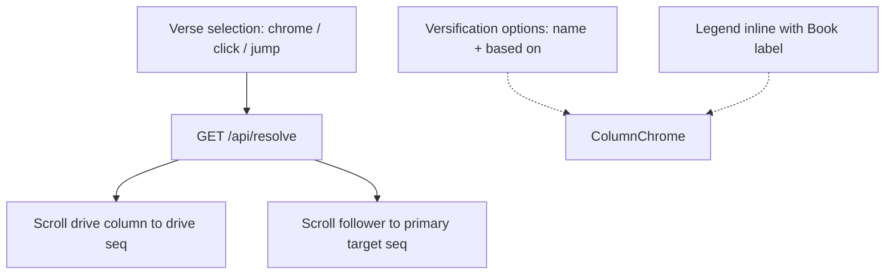

# Viewer Chrome UX Polish — Execution Plan

**Document:** `frvt-3-viewer-chrome-ux-execution-plan-1`
**Status:** Ready for implementation
**Audience:** A coding agent (and reviewers) applying three viewer chrome UX fixes: dual-column auto-scroll after verse selection, “based on” suffixes on versification option labels, and Book jump-legend placement beside the Book label.
**Scope:** UI-spec addendum only; `ViewerSession` scroll generalization; `ColumnChrome` label formatting and legend layout; CSS; unit/RTL/e2e contract updates. **No** server, resolver, or ingest changes.

## How to use this document

- Work phases **in order**. Do not start phase *N+1* until phase *N* Acceptance passes.
- Product specs remain authoritative after Phase 0 records the addendum: [UI](./frvt-3-ui-spec-1.md). Server and resolver specs are unchanged by this work.
- **Effective specification** = frozen main body + addenda applied in order (see [Spec modification policy](#spec-modification-policy) below). Cite effective spec targets (main-body section **or** addendum row), not this plan, when making policy decisions in code.
- **Never commit or push** (Rule 11).

> **Rule 12 (product code).** Phase numbers and plan/workflow identifiers must **never** appear in product application code under `frvt/api`, `frvt/resolver`, `frvt/ingest`, or `frvt/web/src`. Name modules and symbols for what they do, not for the phase that created them.

---

## Spec modification policy

The UI product spec ([`frvt-3-ui-spec-1.md`](./frvt-3-ui-spec-1.md)) states:

- The numbered main body (everything before **Addenda**) is **frozen** and must **never** be edited.
- Post-reconciliation changes go **only** in **Addenda** at the end of the file.
- One logical change set → one addendum subsection (`### ADD-U-NNN`) with a **capability-level Purpose** (no field names or section ids in the Purpose paragraph).
- Atomic changes → **modification rows** in a table: `Mod id`, `Target` (main-body section id), `Action` (`ADD` \| `CLARIFY` \| `REPLACE` \| `REMOVE`), `Effective text`.
- Apply subsections in numeric order; within a subsection, apply rows in listed order. Later rows override earlier ones for the same target.

Phase 0 must **append** `ADD-U-004` — not rewrite §6.4, §6.5, §10, or other main-body text in place.

**Server and resolver specs:** no addenda. This change set is UI-only; do not invent `ADD-S-*` / `ADD-R-*` subsections.

The viewer/overlay test plan ([`frvt-3-test-plan-viewer-and-overlay-1.md`](./frvt-3-test-plan-viewer-and-overlay-1.md)) is **not** governed by the addenda policy; the final phase may edit test cases directly.

---

## Locked owner decisions

| Topic | Decision |
| --- | --- |
| Dual scroll trigger | After every **successful** `GET /api/resolve`: scroll the **drive** column to the drive verse **and** the **follower** column to the primary resolve target (existing follower behavior). Covers chrome BCV changes, verse clicks, and jump-menu selection via the shared resolve path |
| Drive scroll when exclude | On `exclude` (or no follower target): **still** scroll the drive column; **do not** invent a follower scroll target (unchanged) |
| Single-translation (`!canResolve`) | When resolve cannot run, still scroll the **active** column to its selected BCV once that chapter’s spans are loaded (chrome / jump / click). No follower scroll |
| Scroll mechanics | Reuse follower behavior: `scrollIntoView({ block: "nearest", behavior: "smooth" })` under the existing scroll-lock (~400 ms). `nearest` keeps on-screen verse clicks effectively a no-op |
| Scroll lock | One shared lock for both columns; `setColumnBcv` continues to no-op while locked (prevents resolve loops — see TC-UI-034) |
| Drive seq lookup | Resolve drive `seq` from the drive column’s loaded spans matching drive `(book, chapter, verse, part)`. Prefer `data-seq` query on that column’s registered scroll root (same as follower). If no matching span yet, retry on the next span-ready tick (same pending-scroll pattern as follower) |
| Versification label | Option text: `{name} (based on {based_on_name})` when `based_on_name` is non-null; otherwise bare `{name}`. Preferred association appends ` ★` **after** the full label: e.g. `English (based on org) ★` |
| Root schemes | When `based_on_name` is null, **omit** the based-on suffix (do not append “Root”) |
| Preferred (default) | The empty-value option **Preferred (default)** stays unchanged (no based-on text) |
| Data source | Keep joining associations → `session.versifications` by `scheme_id` (already loaded). Use `based_on_name` from `VersificationOut`. No new API |
| Legend placement | Same row as the **Book** label text: `Book` then `● Book has mapping differences`, with the `<select>` on the row below. **Not** under the dropdown |
| Legend wording / a11y | Keep exact text `● Book has mapping differences`. Keep visible legend `id` + `aria-describedby` on the Book `<select>`. Do not use `aria-hidden` on the described legend |
| Legend visibility | Unchanged: show whenever the Book select is enabled (translation selected) |
| Markers | Unchanged: ` ●` suffix on flagged book options; bare `value`; jump-books fetch/cache semantics untouched |

---

## Why these changes



- Follower already auto-scrolls after resolve; drive often stays scrolled away after chrome or jump selection — both columns must move into view together.
- Scheme options already join `based_on_name` per §6.5 but do not display it; users need the parent scheme visible in the dropdown.
- Jump-books legend under the `<select>` wastes vertical chrome and reads as detached from the Book control; place it beside the label.

---

## Global conventions (every phase)

- **Logging:** no new backend public methods. Frontend: no new logging framework; keep existing error-banner / `handleApiFailure` patterns.
- **Orienting comments** (Rule 4) on every new field and non-overriding method.
- **Testing** (Rule 3): happy paths and essential failure contracts only — no thin handler-only tests, no DTO accessor tests.
- **Reuse** (Rule 6): generalize the existing follower scroll helper rather than duplicating `scrollIntoView` + lock logic.
- **Size / arguments** (Rules 9–10): keep modules under limits; prefer a small pure helper module for label formatting and/or scroll lookup if `ViewerSession.tsx` / `ColumnChrome.tsx` grow past comfort.
- Quality gates on changed code: TypeScript `tsc --noEmit` / `eslint` / `prettier --check`.
- **Never commit or push.**

---

## Phases

### Phase 0 — Spec addendum (frozen main body unchanged)

Append one addendum subsection to the UI product spec. Do **not** edit numbered sections before **Addenda**. Implementation cites **effective** text (main body as modified by addenda rows), not this plan.

#### UI — [`frvt-3-ui-spec-1.md`](./frvt-3-ui-spec-1.md) → `### ADD-U-004`

**Purpose (capability level):** After verse selection, both viewer columns scroll to the relevant spans; versification options show their parent scheme; the book jump-difference legend sits beside the Book label.

| Mod id | Target | Action | Effective text (summary — expand when writing the spec) |
| --- | --- | --- | --- |
| ADD-U-004a | §6.4 (After a successful resolve) | REPLACE | After a successful resolve: (1) under scroll-lock, scroll the **drive** column so the drive verse span is visible (`scrollIntoView` `block: "nearest"`, `behavior: "smooth"`); (2) if a primary follower target exists, under the same scroll-lock, scroll the **follower** so that target `seq` is visible (existing rule). For `exclude` / empty targets, do not invent a follower scroll target, but still scroll the drive column when its span is present. When `!canResolve`, scroll only the column whose BCV changed once its chapter spans are loaded. |
| ADD-U-004b | §6.4 sequence diagram note / step 3 | CLARIFY | Highlight and scroll steps cover **both** columns: drive to selected verse, follower to primary target when present. |
| ADD-U-004c | §6.5 step 2 (scheme option labels) | REPLACE | Scheme option labels: `{name} (based on {based_on_name})` when `based_on_name` is non-null; otherwise `{name}`. Preferred association appends ` ★` after the full label. The empty option remains `Preferred (default)` with no based-on text. Join path unchanged (associations → versification catalog by `scheme_id`, or enriched `AssociationOut` if present). |
| ADD-U-004d | §10 layout (`ColumnChrome`) / ADD-U-003b legend placement | REPLACE / CLARIFY | Book jump legend `● Book has mapping differences` is inline on the same row as the **Book** label text (not under the `<select>`). Keep legend `id` + `aria-describedby` on the Book `<select>`. Visibility and marker rules from ADD-U-003 remain. |
| ADD-U-004e | §11.3 | ADD | Contract tests: drive + follower scroll after resolve (no resolve loop); drive scrolls on exclude; versification option text includes `(based on …)` when `based_on_name` set and omits it when null; preferred ★ after full label; legend is a sibling of the Book label text (not below the select). |

**Acceptance:**

- `ADD-U-004` appended with a complete modification-row table and capability-level Purpose.
- **No** edits to main-body sections before **Addenda**.
- **No** server or resolver spec edits.
- No product code required.

---

### Phase 1 — Pure versification option label helper

Extract a small pure function so label rules are unit-tested without mounting chrome.

**Suggested location:** [`frvt/web/src/lib/formatVersificationOption.ts`](../frvt/web/src/lib/formatVersificationOption.ts) (or adjacent under `viewer/` if preferred — keep it pure and importable from tests).

**Implement:**

```ts
/** Build native <option> display text for a column versification choice. */
export function formatVersificationOptionLabel(args: {
  name: string;
  basedOnName: string | null;
  preferred: boolean;
}): string;
```

**Rules (locked):**

| Inputs | Output |
| --- | --- |
| `name="English"`, `basedOnName="org"`, `preferred=false` | `English (based on org)` |
| `name="English"`, `basedOnName="org"`, `preferred=true` | `English (based on org) ★` |
| `name="org"`, `basedOnName=null`, `preferred=false` | `org` |
| `name="org"`, `basedOnName=null`, `preferred=true` | `org ★` |

**Do not** wire into `ColumnChrome` yet.

**Acceptance:** unit tests green for the four rows above; `tsc` / eslint / prettier clean.

---

### Phase 2 — Apply based-on labels in ColumnChrome

**Touch:**

- [`frvt/web/src/viewer/ColumnChrome.tsx`](../frvt/web/src/viewer/ColumnChrome.tsx)
- [`frvt/web/src/viewer/ColumnChrome.test.tsx`](../frvt/web/src/viewer/ColumnChrome.test.tsx) (and/or `viewerStates.test.tsx` if that is where scheme options are asserted)

**Implement:**

1. For each association option, resolve `scheme` from `session.versifications`.
2. Replace inline `{name}{preferred}` with `formatVersificationOptionLabel({ name, basedOnName: scheme?.based_on_name ?? null, preferred: assoc.preferred })`.
3. Leave `value={assoc.scheme_id}` and the **Preferred (default)** empty option unchanged.
4. Fallback when scheme missing: use existing short-id fallback as `name`, `basedOnName: null`.

**Acceptance:**

- With a fixture scheme that has `based_on_name: "org"`, the option text includes `(based on org)`.
- Root / null `based_on_name` stays bare name (+ ★ if preferred).
- Selecting an option still writes bare scheme UUID to `lvers`/`rvers` (no label text leaked into URL).
- Existing “Preferred (default)” clear behavior unchanged.

---

### Phase 3 — Book legend beside the Book label

**Touch:**

- [`frvt/web/src/viewer/ColumnChrome.tsx`](../frvt/web/src/viewer/ColumnChrome.tsx)
- [`frvt/web/src/styles/app.css`](../frvt/web/src/styles/app.css)
- [`frvt/web/src/viewer/ColumnChrome.test.tsx`](../frvt/web/src/viewer/ColumnChrome.test.tsx)

**Current structure (problem):** legend is a block under the `<select>` via `grid-column: 1 / -1`.

**Target structure:**

```tsx
<label className="book-chrome-field">
  <span className="book-chrome-label-row">
    Book
    {translationId ? (
      <span className="book-jump-legend" id={bookLegendId}>
        ● Book has mapping differences
      </span>
    ) : null}
  </span>
  <select
    aria-label={`${side} book`}
    aria-describedby={translationId ? bookLegendId : undefined}
    ...
  >
    ...
  </select>
</label>
```

**CSS guidance:**

- Label row: horizontal flex/inline layout; Book text keeps existing uppercase chrome styling; legend keeps muted, non-uppercase, normal letter-spacing (today’s `.book-jump-legend` type styles).
- Remove `grid-column: 1 / -1` (that forced the under-select placement).
- Do not introduce card chrome, pills, or new color themes.
- Keep wrapping sensible at ~1280px; legend may wrap under the word “Book” on very tight widths, but must not sit under the `<select>` as its primary placement.

**Acceptance:**

- With a translation selected, legend text is present and associated via `aria-describedby`.
- DOM order: legend appears with the label text **before** the Book `<select>` (not as a following sibling after the select).
- Book option markers and bare `value` behavior unchanged.
- Existing ColumnChrome legend assertions updated to the new placement contract.

---

### Phase 4 — Dual-column (and drive-only) auto-scroll

This is the highest-risk phase. Keep follower semantics intact; extend the pending-scroll model.

**Touch:**

- [`frvt/web/src/viewer/ViewerSession.tsx`](../frvt/web/src/viewer/ViewerSession.tsx)
- Prefer extracting helpers to e.g. [`frvt/web/src/viewer/columnScroll.ts`](../frvt/web/src/viewer/columnScroll.ts) if `ViewerSession.tsx` is near size limits:
  - generalize `scrollFollowerToSeq` → `scrollColumnToSeq(root, seq, lock)` (same `nearest` / `smooth` / lock timeout)
  - `seqForBcv(spans, bcv): number | null` — first span matching book/chapter/verse/part with a usable `seq`
- Tests: unit tests for `seqForBcv`; extend viewer/session tests or e2e TC-UI-034 family for drive scroll without resolve loop
- [`frvt/web/src/test/setup.ts`](../frvt/web/src/test/setup.ts) already stubs `scrollIntoView` — keep that; assert **calls** or pending-scroll scheduling in unit tests rather than real viewport motion

**Implement (resolve path):**

1. After a successful resolve settles (existing `.then` after `ensureFollowerChapter`):
   - Compute drive `seq` via `seqForBcv(driveSpans, driveBcv)` (spans from drive column cache for current drive book/chapter). If spans are not ready yet, store a pending drive scroll keyed by side + BCV and complete it on the span-ready effect (same pattern as follower).
   - If `followerTarget?.seq != null`, keep scheduling follower pending scroll (existing).
   - **Important:** on `exclude` / `followerTarget === null`, do **not** `return` before scheduling drive scroll. Refactor the early return so exclude still scrolls the drive column.
2. Pending-scroll effect (today only follower): process **all** pending column scrolls in one rAF, sharing `scrollLock`. Clear each pending entry only when its `scrollColumnToSeq` succeeds (element found).
3. Abort/cancel pending scrolls when a new resolve starts (already clears `pendingFollowerScroll` — extend to drive pending).

**Implement (`!canResolve` path):**

4. When `canResolve` is false and a column’s BCV changes, schedule scroll of **that** column to `seqForBcv` once spans for that book/chapter exist. No follower scheduling.

**Do not:**

- Change resolve request mapping, follower chapter loading, or overlay redraw triggers.
- Use `block: "center"` or `behavior: "auto"`.
- Scroll the follower on exclude.
- Bypass scroll-lock in `setColumnBcv`.

**Acceptance:**

- After resolve with a mapped target: both columns receive a `scrollIntoView` toward their respective seqs (or pending resolves once DOM nodes exist).
- After resolve with `exclude`: drive scrolls; follower does not get a fabricated target.
- TC-UI-034 still holds: follower (and drive) programmatic scroll does not loop resolve.
- Clicking an already-visible drive verse does not fight the user (`nearest` ⇒ no movement when already visible).
- Chrome verse change that lands mid-chapter off-screen brings the drive verse into view after resolve (or after spans load when `!canResolve`).
- `tsc` / eslint / prettier clean; existing follower chapter tests still green.

---

### Phase 5 — Test-plan sync, e2e, gate wrap-up

**Touch:**

- [`frvt-3-test-plan-viewer-and-overlay-1.md`](./frvt-3-test-plan-viewer-and-overlay-1.md)
  - Update **TC-UI-034** expectations to mention drive + follower scroll without resolve loop.
  - Update **TC-UI-035** expected option text to the locked `(based on …)` / ★-after-full-label format (replace vague “showing name / canonical / based_on”).
  - Add a focused case (suggested id: **TC-UI-038**) for Book legend placement beside the Book label + `aria-describedby`.
- [`frvt/web/e2e/viewer.spec.ts`](../frvt/web/e2e/viewer.spec.ts) (and helpers if needed)
- Coverage matrix under [`.test/`](../.test/) only if an existing matrix row must stay in sync

**E2E / manual checks:**

1. Two translations, scroll drive column away from verse 1, select verse 1 in chrome → drive scrolls to verse 1; follower scrolls to aligned target.
2. Jump-menu entry that changes drive BCV → both columns end on the jumped / resolved loci.
3. Click a visible verse → no jarring re-center; highlight/resolve still update.
4. Exclude locus (if fixture available) → drive scrolls; follower not forced to a fake verse.
5. Versification dropdown shows `(based on …)` for non-root schemes; root schemes bare; preferred ★ at end; Preferred (default) unchanged.
6. Legend sits beside “Book”, not under the book `<select>`; still two legends when both translations selected.
7. Single-translation mode: changing verse via chrome scrolls that column when spans are loaded.

**Acceptance:** docs and tests agree with shipped behavior; quality gates clean; no commits/pushes.

---

## Touch-point index

| Artifact | Role |
| --- | --- |
| `.spec/frvt-3-ui-spec-1.md` | `ADD-U-004`: dual scroll, based-on labels, legend placement |
| `.spec/frvt-3-test-plan-viewer-and-overlay-1.md` | TC-UI-034 / 035 updates; TC-UI-038 legend placement |
| `frvt/web/src/lib/formatVersificationOption.ts` | Pure option-label helper |
| `frvt/web/src/viewer/columnScroll.ts` (optional extract) | Shared `scrollColumnToSeq` + `seqForBcv` |
| `frvt/web/src/viewer/ViewerSession.tsx` | Pending drive+follower scroll; exclude path fix; `!canResolve` drive scroll |
| `frvt/web/src/viewer/ColumnChrome.tsx` | Based-on labels; legend beside Book label |
| `frvt/web/src/styles/app.css` | Book label-row + legend layout |
| `frvt/web/src/viewer/ColumnChrome.test.tsx` | Label + legend contracts |
| `frvt/web/e2e/viewer.spec.ts` | Scroll / label / legend smoke |

---

## Explicit non-goals

- Server, resolver, or ingest changes; new API fields or endpoints
- Custom book or versification dropdown / combobox widgets
- Changing jump-books marker semantics, fetch, or cancel-filter behavior
- Changing legend wording or showing the legend when no translation is selected
- `block: "center"` scrolling, instant scroll, or per-column independent scroll-locks
- Enriching `AssociationOut` solely for this feature (optional join shortcut remains optional per §6.5)
- Manage-page “Based on” column changes ([`VersificationsManagePage.tsx`](../frvt/web/src/routes/VersificationsManagePage.tsx) already shows based-on separately)
- Committing or pushing (Rule 11)

---

## Verification cheat-sheet (implementer)

After Phase 5, a reviewer should be able to:

1. Select a verse via chrome while scrolled away → **both** columns move to the relevant verses after resolve.
2. Confirm an on-screen verse click does not visibly yank the drive column (`nearest`).
3. Open the versification `<select>` and see `Name (based on parent)` / `Name (based on parent) ★` / bare root names as appropriate.
4. See `● Book has mapping differences` on the **same row as** the Book label, above the book dropdown.
5. Confirm TC-UI-034 still passes (no resolve scroll loop).
6. Confirm book option `value`s and versification `value`s remain bare ids (no display suffixes in URL params).
