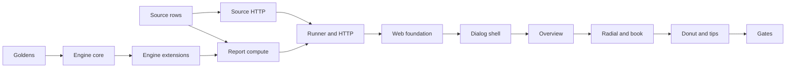

# Versification divergence dialog: phased execution plan

**Document:** `frvt-7-execution-plan-1`
**Status:** Ready to implement
**Audience:** The agent implementing the divergence dialog, and the owner reviewing that work
**Scope:** Port the prototype rooted in `versification-divergence-views.html` into the viewer as a full-screen dialog, with the versification source as written as the system of record, a cached report computed from translation indexes when they exist, and Ryder's breakdown and tooltip feedback.

Never commit or push. The owner reviews all changes.

---

## How to use this document

Work the phases in order. Each phase lists its work, its tests, and a gate that must pass before the next phase starts. The sections before the phase graph are the contract: request and response shapes, the wire format, source-reader rules, note templates, and help text. Do not invent alternatives when those sections already decide the question.

> **Rule 12 — read first.** Phase numbers and any identifiers in this plan are planning scaffolding. They must **never** appear in produced source code, comments, configuration, migration names, test names, or runtime strings. Name modules and symbols for what they do. Rule 12 does **not** apply to files under `.spec/` or `.test/`.
>
> The pre-existing `phase1`–`phase6` pytest markers in [`frvt/pyproject.toml`](../frvt/pyproject.toml) are the repository's established test-gating vocabulary and predate this plan. Reuse them as instructed. Do **not** add new markers.

---

## Locked owner decisions

| Topic | Decision |
| --- | --- |
| Comparison basis | Each side is a translation plus its selected versification. Flatten the versification through `based_on` to the root, then overlay the translation's text (texts mode). |
| System of record | `versification_source` stores the uploaded JSON or `.vrs` verbatim. `ingredient` and `mapping_record` stay derived views for the resolver. |
| Canonical sources | Bootstrap stores the packaged JSON plus a companion `.vrs` from `frvt/resources/vrs/` (eng, lxx, org, rsc, rso). vul has no `.vrs` and stays JSON-only. |
| Supplement rule | Attach a companion `.vrs` only when every JSON mapping pair appears in that `.vrs`. Bundled result: eng, lxx, rsc, org yes; rso no. |
| Legacy schemes | No source row means the engine reads the stored ingredient. `PUT /api/versifications/{id}/source` attaches a matching original file. API only. |
| Engine | Faithful port of the prototype `engine.py` into pure `frvt/divergence/`. Parity is gated by goldens. |
| Reports | `divergence_report`, keyed by the ordered four-tuple, payload stored as TEXT and returned verbatim. |
| Scheduling | A priority queue: dialog jobs at priority 0, precompute at priority 1. One daemon thread by default. |
| Precompute | When an index becomes ready, schedule both directions against every other ready index. Failures add a build note and never fail the index. |
| Dialog | Full prototype UI except the h1, the subtitle, the Compare picker, and the light theme. Launched from a toolbar above the side-by-side view. |
| Look | Tool tokens and fonts on the chrome. Prototype chart constants, severity ramp, and deviance ramp kept. Diagram fidelity outranks chrome styling. |
| Breakdown | Two-ring donut on every tab (layers inside, 12 types outside), Events / Verses toggle, scoped to the pinned selection. Layer toggles show a share of the total. |
| Tooltips | An accessible tip on every legend item, layer toggle, and flag chip. Data-warning chips include that item's warning codes. |
| Dependencies | Add `d3` and `@types/d3`. No other new runtime dependency. |

---

## The master safety invariant

**The resolver keeps reading `ingredient` and `mapping_record`. Divergence reads the source document, and falls back to the ingredient only when no source row exists.**

A source write must never change the scheme row, its ingredient, or its mapping rows. Doing so would invalidate indexes and could change resolve results. The attach endpoint exists to add a source beside an unchanged scheme.

The corollary for reports: a report is readable only when its status is `ready` and its fingerprint still matches the current inputs. Anything else is recomputed or refused with `409`.

---

## Evidence this plan relies on

These were measured against the prototype and this repository. Do not re-litigate them.

- Packaged `frvt/resources/{eng,lxx,rso,org}.json` plus `research/ParatextFormat/eng.vrs` reproduce the prototype's published `data.json` for eng-lxx (318 events) and eng-rso (225 events), including runs and warnings.
- Shuffling `mappedVerses`, `maxVerses`, and `partialVerses` key order does not change events, runs, or sorted loader warnings.
- Feeding normalized ingredients instead changes 17 events and 14 runs for eng vs vul, and 156 events and 14 runs for eng vs rso. Normalization strips part letters and copies base-side parts into the scheme's own `partialVerses`.
- The Copenhagen schema has `additionalProperties: false` and forbids part letters, so that information cannot live inside `ingredient`.
- A `.vrs` reader with the rules in [Source reader](#source-reader) reproduces packaged eng, rsc, and org exactly, and lxx `partialVerses` after trimming segment whitespace. lxx.json omits the 304 excluded verses listed in lxx.vrs, which is why canonicals keep JSON as the primary document.
- One full-Bible comparison takes about 10–25 seconds in CPython.

---

## What exists today (integration points)

Read these before writing anything. Line references are current at plan time; verify before editing.

- **Prototype** — `/mnt/hgfs/files/versification-prototype/`: `engine.py` (the port source), `catalog.py` (book order and sections), `viewer-template.html` (the UI port source), `data.json` (published oracle), `build.py` (how goldens are shaped).
- **Ingest** — [`frvt/ingest/ingest_api.py`](../frvt/ingest/ingest_api.py) `ingest_versification` and `ingest_project`; [`frvt/ingest/vrs_convert.py`](../frvt/ingest/vrs_convert.py) `convert_vrs` (drops `#` lines); [`frvt/ingest/normalize.py`](../frvt/ingest/normalize.py) `normalize_ingredient`; [`frvt/ingest/types.py`](../frvt/ingest/types.py) `ParsedScheme`.
- **Persistence** — [`frvt/api/ports/ingest_port.py`](../frvt/api/ports/ingest_port.py): `persist_versification` (rebuilds `ParsedScheme` on a name override, around line 137), project ingest (applies `apply_combined_milestone_splits` before insert, around line 281), `refresh_combined_milestone_splits` (rebuilds `ParsedScheme` around line 374 and must **not** touch the source).
- **Bootstrap** — [`frvt/api/bootstrap.py`](../frvt/api/bootstrap.py) `seed_canonical` and `_prepare_ingredient`. Keep `_prepare_ingredient` unchanged. Only upsert the source row.
- **Models and schemas** — [`frvt/api/models/__init__.py`](../frvt/api/models/__init__.py) (`VersificationScheme` around line 166; the file is 439 lines). [`frvt/api/schemas/__init__.py`](../frvt/api/schemas/__init__.py) (`VersificationDetailOut` around line 193; the file is 435 lines). New schema modules stay out of `__init__.py` except a re-export if one already imports siblings. Migration head is `c3d4e5f6a7b8`.
- **Selection and chains** — `selected_scheme_ref` in [`frvt/api/scheme_select.py`](../frvt/api/scheme_select.py). `build_chain` in [`frvt/resolver/chains.py`](../frvt/resolver/chains.py). `index_fingerprint` in [`frvt/api/indexing/fingerprint.py`](../frvt/api/indexing/fingerprint.py).
- **Index finish** — `_finish` in [`frvt/api/indexing/builder.py`](../frvt/api/indexing/builder.py) (around line 235) commits the index ready. `IndexWorker` in [`frvt/api/indexing/worker.py`](../frvt/api/indexing/worker.py) calls `build_index`. `usage_summary` in [`frvt/api/indexing/registry.py`](../frvt/api/indexing/registry.py). `IndexUsageOut` in schemas.
- **App** — [`frvt/api/main.py`](../frvt/api/main.py) registers routers and starts `IndexWorker` in the lifespan. [`frvt/api/config.py`](../frvt/api/config.py) holds settings. [`frvt/api/db.py`](../frvt/api/db.py): `get_session` commits on success; a thread must use `get_session_factory()`.
- **Errors** — `AppError` and `ErrorCode` in [`frvt/api/errors.py`](../frvt/api/errors.py). Add no new error codes; use the existing `not_found`, `conflict`, and `validation_failed` values (confirm the exact literals in that file before raising).
- **Viewer** — [`frvt/web/src/viewer/ViewerPage.tsx`](../frvt/web/src/viewer/ViewerPage.tsx) renders the toolbar slot above `ViewerWorkspace`. [`ViewerSession.tsx`](../frvt/web/src/viewer/ViewerSession.tsx) is 971 lines and must not grow. `canResolve`, `associationsFor`, and `url` are already on the session value. [`ModalShell.tsx`](../frvt/web/src/components/ModalShell.tsx) is a fixed 28rem dialog. Modal CSS lives near the end of [`styles/app.css`](../frvt/web/src/styles/app.css), which is over 1000 lines and must not grow. Tokens are in [`styles/tokens.css`](../frvt/web/src/styles/tokens.css).
- **Tests** — [`frvt/tests/conftest.py`](../frvt/tests/conftest.py): `db_session` restarts a savepoint, so commits are visible to the same connection and invisible to another. `api_client` uses `create_app(run_startup_seed=False, run_index_worker=False)`.
- **Docs** — [`docs/api.md`](../docs/api.md) and [`docs/export-openapi.py`](../docs/export-openapi.py). Regenerate `docs/openapi.json` with that script; do not hand-edit the generated file.
- **Anchors** — `GET /api/translations` excludes `is_anchor` rows. The viewer can never select a canonical anchor, so every dialog comparison a user opens is texts mode.

---

## Regression traps (read before writing code)

1. **Bootstrap must not touch scheme rows.** Reassigning `ingredient` bumps `updated_at` and invalidates every index fingerprint. Upsert `versification_source` only when `sha256` differs.
2. **Leave `convert_vrs`, `normalize_ingredient`, and mapping derivation unchanged.** The resolver depends on them. Every `ParsedScheme(` rebuilt in the ingest port must copy `source` through when the source is what gets persisted.
3. **Milestone augmentation writes `ingredient` only.** When a source exists, the engine reads the source, never the augmented ingredient. Combined verses arrive through the text overlay (`verse_range` on spans).
4. **Commit before the runner sees the row.** POST must commit, then submit. API tests run inside a restarting savepoint, so test `compute_report` directly and override the runner dependency in HTTP tests.
5. **Return the payload TEXT verbatim.** No Pydantic validation and no JSONB round trip on read. JSONB would reorder object keys.
6. **`VersificationDetailOut.source` defaults to `None`.** `model_validate(row)` has no such attribute. The router fills it with `model_copy`.
7. **Prototype CSS uses bare element selectors** (`table`, `th`, `select`, `svg text`). Scope every rule under `.dv-root`. Namespace SVG ids with `useId`.
8. **`ModalShell` listens for Escape on `document`.** The matrix and `InfoTip` handlers call `stopPropagation()` when they consume Escape.
9. **A drag that starts inside the dialog and ends on the backdrop must not close it.** Close on backdrop click only when `mousedown` also started on the backdrop.
10. **Hover state is read only by the inspector.** d3 views must not re-render on hover.
11. **Real comparisons are partial texts.** A book the text lacks becomes BOOK_ONE_SIDED. Seed end-to-end data whose coverage makes the expected events obvious.
12. **Compute shares the API process and the GIL.** Default to one runner thread. Throttle progress commits to at most one per second. Interactive jobs outrank precompute. `DIVERGENCE_PRECOMPUTE_ENABLED=false` turns precompute off.
13. **`PUT .../source` never writes the scheme row.** A mismatch is `422`. Canonical schemes and schemes that already have a source are `409`.
14. **`logger.trace` needs `# type: ignore[attr-defined]`** on the same line.
15. **`get_settings()` is cached.** Adding fields is safe. Do not read settings at import time.
16. **File limits.** `app.css` must not grow. `schemas/__init__.py` and `models/__init__.py` stay under 600 lines; put new models in `frvt/api/models/divergence.py` and re-export them if the models module would cross 600. `frvt/web/e2e/helpers/api.ts` is about 700 lines and must not grow. Engine modules stay under 300 lines.
17. **Tooling.** Add `frvt.divergence` to the ruff `src` list and the mypy `packages` list. Add `vrs/*.vrs` to the `frvt.resources` package data.
18. **Postgres TEXT rejects NUL.** `derive_ingredient` returns a validation issue when the text contains `\x00`.
19. **Anchor translations have no spans.** A DB-path parity test that uses them is schemes mode. That is intended.
20. **Do not log inside per-verse helpers.** Public entry points log a summary count at debug. Hot-path helpers stay module-private and silent.

---

## Global conventions (apply to every phase)

- **Logging (Rule 2).** `logger = get_logger(__name__)` at module top. Public functions log `DEBUG` on entry with counts and ids. Non-mutating getters log `TRACE`. Every `except` logs `ERROR` with `exc_info=True`. Per-verse and per-edge helpers are private and do not log.
- **Orienting comments (Rule 4).** Every new module gets a docstring. Every new function, dataclass field, ORM column, and Pydantic field gets a comment saying why it exists. TypeScript exported functions and types get the same. Match the density in `frvt/api/models/__init__.py`.
- **Testing (Rule 3).** Happy paths and essential contract failures only. Do not test pass-through routes, DTO constructors, or accessors. Golden and DB-path parity tests are slow (10–25 seconds). Keep them to the cases named in the phases.
- **Reuse (Rule 6).** `selected_scheme_ref`, `require_scheme`, `require_translation`, `build_chain`, `index_fingerprint`, `AppError`, `Page`, `apply_combined_milestone_splits`, and the existing ingest parse path.
- **Modern patterns and boilerplate (Rules 7, 8).** SQLAlchemy 2.0 `select()` and `mapped_column`. Frozen dataclasses. Pydantic v2. Keyword-only arguments after `*`.
- **Argument limits (Rule 10).** Six named arguments is the target, ten is the hard limit. Use `ReportKey` and `SourceDocument` instead of threading ids and strings.
- **File size (Rule 9).** Desirable 600, hard 1000. Engine modules and new frontend modules should land under 300 where the phase says so.
- **Typing.** mypy strict covers `frvt.api`, `frvt.ingest`, and `frvt.divergence`. Annotate every parameter and return. The web package is TypeScript strict with `noUnusedLocals` and `noUnusedParameters`. Prettier uses double quotes and a width of 90.
- **Frontend.** No `innerHTML`. No `title` attributes for the new tips. Guard `canvas.getContext` for jsdom.

### Test markers

| Test kind | Markers |
| --- | --- |
| Ingest and bootstrap source behavior | `phase3` + `ingest` |
| Versification HTTP, including source routes | `phase2` + `api` |
| Pure engine, reader, fingerprint, runner ordering | `phase6` |
| Report compute against the database | `phase6` |
| Divergence HTTP | `phase2` + `api` |

---

## Tooling and quality gates

Run from `frvt/` with the virtualenv. `$REPO` is the repository root.

```bash
cd "$REPO/frvt"
python -m ruff check api resolver ingest divergence tests testops
python -m black --check api resolver ingest divergence tests testops
python -m mypy -p frvt.api -p frvt.resolver -p frvt.ingest -p frvt.divergence
PYTHONPATH="$REPO" python -m pytest tests/test_<file>.py -vv
cd "$REPO/frvt/web" && npm test && npm run typecheck
```

`npm test` and `npm run typecheck` follow the scripts already in `frvt/web/package.json`. If a script name differs, use the one that runs Vitest and `tsc`.

A phase gate is green when its new tests pass and the gates above still pass for the packages that phase touched. Full `pytest -n auto` runs at the last phase, not after every phase.

---

## New settings

Add to `Settings` in [`frvt/api/config.py`](../frvt/api/config.py), each with an orienting comment:

| Field | Alias | Default | Purpose |
| --- | --- | --- | --- |
| `divergence_runner_threads` | `DIVERGENCE_RUNNER_THREADS` | `1` | Daemon threads draining the report queue. |
| `divergence_stale_seconds` | `DIVERGENCE_STALE_SECONDS` | `120` | A `running` row whose heartbeat is older than this is stalled. |
| `divergence_precompute_enabled` | `DIVERGENCE_PRECOMPUTE_ENABLED` | `True` | Schedule reports when an index becomes ready. |

---

## Files this plan creates or changes

**New**

- `.test/scripts/generate-divergence-goldens.py`
- `frvt/tests/data/divergence/*.json.gz`
- `frvt/ingest/source_document.py`
- `frvt/resources/vrs/{eng,lxx,org,rsc,rso}.vrs` (copies of `research/ParatextFormat/`)
- `frvt/api/models/divergence.py`
- `frvt/api/schemas/versification_source.py`, `frvt/api/schemas/divergence.py`
- `frvt/divergence/{__init__,catalog,refs,taxonomy,scheme,compose,classify,events,runs,report,vrs_reader,chain,text_facts,progress}.py`
- `frvt/api/divergence/{__init__,inputs,fingerprint,registry,compute,runner}.py`
- `frvt/api/routers/divergence.py`
- two Alembic revisions, named for the tables they add
- tests named in each phase
- `frvt/web/src/divergence/**`, `frvt/web/src/viewer/ViewerToolbar.tsx`, `frvt/web/src/styles/modal.css`
- `frvt/web/e2e/divergence.spec.ts`, `frvt/web/e2e/helpers/divergence.ts`
- `.test/scripts/run-divergence-benchmark.sh`

**Changed**

- `frvt/ingest/ingest_api.py`, `frvt/ingest/types.py`
- `frvt/api/ports/ingest_port.py`, `frvt/api/bootstrap.py`, `frvt/api/models/__init__.py` (docstring only, plus a re-export if required)
- `frvt/api/schemas/__init__.py` (the `source` field on `VersificationDetailOut`, and re-exports)
- `frvt/api/routers/versifications.py`, `frvt/api/indexing/worker.py`, `frvt/api/indexing/registry.py`
- `frvt/api/config.py`, `frvt/api/main.py`, `frvt/pyproject.toml`, `frvt/resources/__init__.py` if it is how packaged files are opened
- `frvt/web/src/viewer/ViewerPage.tsx`, `ModalShell.tsx`, `frvt/web/package.json`
- `docs/api.md`, `docs/openapi.json`
- frontend API types that mirror `VersificationDetailOut`

**Unchanged**

- `frvt/ingest/vrs_convert.py`, `frvt/ingest/normalize.py`, `frvt/resolver/**`
- `ViewerSession.tsx`, `styles/app.css` (modal rules move out; the file must not grow)
- resolve and navigation routes

---

## Wire format

One comparison object, the same shape `build.py` emits for a single comparison, plus the fields at the end of this section. Spans are JSON arrays. Object key order is not significant; arrays keep their order.

`types` is the 12-type list in this order, which is also `list(SEVERITY)` in the prototype and the index stored on each event:

`VERSE0_TITLE`, `BRIDGE`, `RENUMBER`, `MERGE`, `SPLIT`, `SEGMENT`, `CHAPTER_MOVE`, `ORDER_INVERSION`, `CROSS_BOOK`, `EXCLUDED`, `ONE_SIDED`, `BOOK_ONE_SIDED`.

Each type object is `{"id", "severity", "layer"}` using the prototype tables:

| id | severity | layer |
| --- | --- | --- |
| VERSE0_TITLE | 1 | scheme |
| BRIDGE | 1 | text |
| RENUMBER | 2 | scheme |
| MERGE | 3 | scheme |
| SPLIT | 3 | scheme |
| SEGMENT | 3 | segment |
| CHAPTER_MOVE | 4 | scheme |
| ORDER_INVERSION | 4 | scheme |
| CROSS_BOOK | 4 | scheme |
| EXCLUDED | 4 | text |
| ONE_SIDED | 4 | scheme |
| BOOK_ONE_SIDED | 5 | canon |

An event row is `[typeIdx, a, o, b, n, rel, flags, segA?, segB?]`. `segA` and `segB` are present only for `SEGMENT`. A span is `[book, c1, v1, c2, v2]` or `null`. `flags` is a sorted list of: `approximate`, `dataWarning`, `vrsSupplement`, `missingInA`, `missingInB`, `bridgeInA`, `bridgeInB`, `textOmission`.

A run row is `[a, o, b, typeIdxOrMinusOne, flagLetters, exA, exB]`. Flag letters are the sorted join of `a` (approx), `w` (warn), `v` (vrs), `s` (segment), exactly as `build_runs` emits. `SAME` relations use type index `-1`.

`books` entries are `{code, name, section, a, b}` where `a` and `b` are the per-chapter maxima arrays or `null` when that side lacks the book. `section` is `OT`, `NT`, `DC`, `EX`, or `NC`.

`warnings` is `{a, b, aCount, bCount}`. `a` and `b` are the first 200 loader warnings. Counts are the full lengths.

`org` is the org scheme's `maxVerses` map. `catalog` is `[[code, name, section], ...]` in USFM catalog order, copied from the prototype `catalog.py`.

Added fields, all arrays so key order cannot matter:

- `eventNotes`: `[eventIndex, side, code, detail]`. `side` is `"a"` or `"b"`. Present only for events whose flags include `dataWarning`. `code` is one of `unequal_ranges`, `identity_collision`, `no_org_anchor`. `detail` is the sentence in [Warning copy](#warning-copy). Attach a note only when the underlying relation's `warn` is true, so the flag and the notes cannot disagree.
- `sides`: `[side, schemeName, fidelity, multiTarget, textFacts]`. `side` is `"a"` or `"b"`. `fidelity` is `"source"` or `"legacy"`. `multiTarget` is true when every non-root hop on that chain has a supplement attached. `textFacts` is true when that translation has at least one span.
- `engineVersion`: the string constant `ENGINE_VERSION`, starting at `"1"`.
- `computedAt`: ISO-8601 UTC.

`mode` is `"texts"` when either side has `textFacts`, otherwise `"schemes"`.

`note` is assembled from these sentences, in order, skipping blanks:

1. Mode: `Texts mode.` or `Schemes mode.`
2. For each side whose supplement is attached: `{name} includes multi-target lines from its source file.`
3. For each side whose supplement is not attached and whose fidelity is `source`: `{name} has no multi-target source lines, so merges, splits, and segments that involve it are approximate.`
4. For each side whose fidelity is `legacy`: `{name} was stored before its original file was kept, so segment and multi-target detail may be missing. Attach the original file with PUT /api/versifications/{id}/source.`

`id`, `a`, and `b` are the scheme display names, matching the prototype comparison object.

Approximate reasons are recorded on the relation and surface only as the `approximate` flag plus, when the cause is also a warning, an `eventNotes` row. The two reason codes are `unequal_ranges` and `no_multi_target_data`. `no_multi_target_data` is applied when the type is `MERGE`, `SPLIT`, or `SEGMENT` and either side lacks multi-target data. It does not by itself set `dataWarning`.

### Warning copy

| Code | Detail |
| --- | --- |
| `unequal_ranges` | The two ranges have different lengths and were aligned verse by verse. Treat the pairing as approximate. |
| `identity_collision` | A default identity and an explicit mapping both claim this org verse, inside one book and across more than one chapter. |
| `no_org_anchor` | This verse maps to a reference that does not exist in the org scheme. |

---

## Source reader

`frvt/divergence/vrs_reader.py` is pure. `frvt/api/divergence/inputs.py` decides which document to feed it.

**JSON source.** Parse `document_text` as the engine document, part letters and all. Do not run `normalize_ingredient` on it.

**Supplement.** Parse `companion_vrs_text` with the prototype's `parse_vrs_pairs` rules: skip `#` comments, keep `#!` bodies, strip a leading `&`, and keep both sides when both parse. Attach the pairs only when every `(key, value)` in `mappedVerses` occurs in that pair list. Otherwise the side has no supplement. A missing companion means no supplement.

**VRS source** (an uploaded `.vrs`, `format = vrs`). Build the engine document from `document_text`:

- A book line `BOOK c:v c:v ...` becomes `maxVerses[BOOK]`, values in chapter order.
- A line `-REF` becomes an `excludedVerses` entry.
- A mapping line becomes a `mappedVerses` entry. The last line for a key wins. Part letters stay on both sides.
- A line `#! *REF,seg,seg` becomes `partialVerses[REF]` with each segment stripped.
- `partialVerses` is empty when no such lines exist.
- Every mapping line, including `#!` and `&` forms that `parse_vrs_pairs` would keep, is the supplement. It is always consistent with the document just built.

**Legacy.** No source row: the engine document is the stored `ingredient`, and there is no supplement. Fidelity is `legacy`.

**Chains.** Walk `build_chain` to the root. If the two roots differ, the request is `422`. Flatten by composing each hop to the root with the same engine, then compare the two root-space schemes. A side's `multiTarget` is true only when every non-root hop has a supplement. The root itself contributes no supplement requirement.

**Texts overlay**, applied after the scheme is loaded, only when the translation has at least one span:

- Drop books that have no span from that side's maxima. A book present on the other side then becomes `BOOK_ONE_SIDED` through the existing fold.
- A verse inside a present book that no span covers becomes an exclusion and carries `textOmission` on the resulting `EXCLUDED` event.
- A span `verse_range` wider than one verse becomes a bridge.
- A span `part` becomes that verse's segment list. Multiple parts of one verse accumulate.
- Never add verse 0. A span whose verse is past the scheme maximum produces a loader warning and is otherwise ignored.

Zero spans means schemes mode for that side: maxima stay as the scheme states them.

---

## HTTP contract

Authentication is the existing `BasicAuthMiddleware`. No route is public.

### `GET /api/versifications/{scheme_id}` (existing, extended)

`VersificationDetailOut` gains:

```json
"source": {
  "format": "copenhagen_json",
  "filename": "eng.json",
  "sha256": "<hex>",
  "document_bytes": 12345,
  "companion_bytes": 6789,
  "captured_at": "2026-09-30T00:00:00Z"
}
```

`source` is `null` when the scheme has no source row. `companion_bytes` is `null` when there is no companion. HTTP bodies use snake_case, like the rest of this API. The report payload inside `GET .../data` keeps the prototype's camelCase keys.

### `GET /api/versifications/{scheme_id}/source`

Returns `{format, filename, sha256, document_text, companion_vrs_text, captured_at}`. `companion_vrs_text` is `null` when absent. `404` when the scheme is missing or has no source row.

### `PUT /api/versifications/{scheme_id}/source`

`multipart/form-data` with one file field named `file`.

- `404` when the scheme does not exist.
- `409` when the scheme is canonical or already has a source row.
- `422` when the file contains NUL, does not parse, or does not re-derive to the stored ingredient. The error message names the first top-level key that differs (`maxVerses`, `mappedVerses`, `excludedVerses`, `partialVerses`, `mergedVerses`, `splitVerses`).
- `200` returns the same body as GET source.

Acceptance: `derive_ingredient(file)` equals the stored ingredient, compared as parsed JSON with key order ignored. When any translation has this scheme as its preferred scheme and that translation has spans, also accept equality with `apply_combined_milestone_splits(derived, those spans)`. Try the plain derivation first. On success, insert the source row and do not write the scheme.

### `POST /api/divergence/reports`

Body: `{from_translation_id, to_translation_id, from_scheme_id?, to_scheme_id?}`. Scheme ids follow `selected_scheme_ref` (override, else preferred, else `409`).

- `404` unknown translation or scheme.
- `409` from scheme selection.
- `422` when the flattened chains do not share a root, or either id is malformed.
- `200` when a ready row already has the current fingerprint.
- `202` when a row was created or rescheduled.

Both `200` and `202` return the status object below. The handler commits before it submits a job.

### `GET /api/divergence/reports/{report_id}`

```json
{
  "id": "<uuid>",
  "status": "pending",
  "stalled": false,
  "stage": "composing",
  "stage_index": 2,
  "stage_count": 6,
  "completed": 10,
  "total": 66,
  "error": null
}
```

`status` is `pending`, `running`, `ready`, or `failed`. `stalled` is true when status is `running` and the heartbeat is older than `divergence_stale_seconds`. `stage` is one of `loading`, `composing`, `classifying`, `events`, `runs`, `encoding`, or `null` before work starts. `404` when the id is unknown.

### `GET /api/divergence/reports/{report_id}/data`

`200` with `Content-Type: application/json` and the stored payload bytes. `409` when the row exists and is not `ready`. `404` when the id is unknown.

### `GET /api/indexes/usage` (existing, extended)

Add `divergence_reports` (count of report rows) and `divergence_bytes` (sum of `octet_length(payload)`, as a single integer). Existing fields stay.

---

## Report lifecycle

`divergence_report` columns:

| Column | Notes |
| --- | --- |
| `id` | UUID PK |
| `from_translation_id`, `from_scheme_id`, `to_translation_id`, `to_scheme_id` | FKs, `ON DELETE CASCADE`. Unique together. |
| `status` | `pending`, `running`, `ready`, `failed`. Check constraint. |
| `fingerprint` | Text. See below. |
| `stage` | Text, nullable. |
| `stage_index`, `completed`, `total` | Integers, default 0. `stage_count` is the constant 6, not a column. |
| `heartbeat_at` | Timestamptz, nullable. |
| `payload` | Text, nullable. |
| `error` | Text, nullable. |
| `created_at`, `updated_at` | Same pattern as `VersificationScheme`. |

`ReportKey` is a frozen dataclass of the four ids, ordered as stored. It is the parameter object for registry and runner calls.

Fingerprint: SHA-256 of a canonical string joining `index_fingerprint` for each side, then each chain hop's source `sha256` or the literal `legacy`, then `ENGINE_VERSION`. Hop order follows `build_chain`.

Claim: `INSERT ... ON CONFLICT DO NOTHING`, then `SELECT ... FOR UPDATE`. If the row is `ready` and the fingerprint matches, return it. If it is `pending` or `running` and the heartbeat is fresh, return it without submitting again. If it is `failed`, `stalled`, or the fingerprint differs, set `pending`, clear `payload` and `error`, commit, and submit.

The runner ignores a submit whose report id is already queued or running. Priority 0 is a dialog POST. Priority 1 is precompute. Ties keep FIFO order.

Progress commits at most once per second, and always on stage change and on completion. The compute function takes a `Progress` callback `(stage, stage_index, completed, total)`.

Precompute: `IndexWorker` gains `on_index_ready: Callable[[UUID], None] | None`. The lifespan sets it to a closure that lists ready indexes and submits both directions at priority 1, skipping pairs whose ready row is already fresh. Exceptions are logged and appended with `_append_note`. They must not change the index status.

---

## Help text catalog

Use these strings verbatim. `InfoTip` renders them. Layer toggles append ` None in this comparison.` when the count is zero, matching the prototype.

### Layers

| id | Label | Short | Help |
| --- | --- | --- | --- |
| scheme | Numbering | numbering | Verse and chapter numbering differences from the versification schemes: renumbered runs, Psalm-title numbering, merges, splits, chapter and book moves, order inversions, and verses with no counterpart. |
| segment | Verse segments | segment | Verses divided into lettered parts (a, b, c) differently on the two sides, for example Greek Esther additions. |
| text | Bridges and omissions | bridge or omission | Text-level differences: verse bridges (for example 1-2 printed as one verse) and verses a text leaves out. Standard schemes carry none, so this layer appears for text comparisons. |
| canon | Books on one side only | one-sided book | Books whose content exists on only one side, for example the Letter to the Laodiceans in eng but not lxx. Unchecked hides their rows. |

Layer toggle counts become `312 (87%)`, where the percent is that layer's share of events in all layers under the current donut measure, rounded to the nearest integer. A layer with events still shows its count when it is switched off, so the user can see what they are hiding.

### Types

| id | Label |
| --- | --- |
| VERSE0_TITLE | Psalm title numbering |
| BRIDGE | Verse bridge |
| RENUMBER | Renumbered run |
| MERGE | Merge |
| SPLIT | Split |
| SEGMENT | Segment difference |
| CHAPTER_MOVE | Chapter move |
| ORDER_INVERSION | Order inversion |
| CROSS_BOOK | Cross-book move |
| EXCLUDED | Omitted verse |
| ONE_SIDED | Present on one side only |
| BOOK_ONE_SIDED | Book on one side only |

### Legend tips

| Item | Tip |
| --- | --- |
| Same | This chapter uses the same verse numbers on both sides. |
| Deviance ramp | Chapter deviance runs from little (left) to much (right). It mixes how severe the events are with how much of the chapter they cover. |
| Severity 1 | Severity 1 of 5. Small numbering differences: Psalm titles and verse bridges. |
| Severity 2 | Severity 2 of 5. A run of verses renumbered by a constant offset. |
| Severity 3 | Severity 3 of 5. Merges, splits, and segment differences. |
| Severity 4 | Severity 4 of 5. Chapter moves, order inversions, cross-book moves, omitted verses, and verses present on one side only. |
| Severity 5 | Severity 5 of 5. A whole book present on only one side. |
| Chapter on one side only | This chapter has verses on one side and none on the other. Open the book to see which verses. |
| Approximate | The pairing is approximate. Either the ranges had different lengths, or one side has no multi-target source lines. Open the event to see which. |
| Data warning | The source data disagrees with itself for this item: unequal ranges, an identity collision, or a mapping with no org anchor. The chip on the event names which. |

### Flag chips

| Flag | Chip label | Tip |
| --- | --- | --- |
| approximate | approx. | This pairing is approximate. Check the data warning, if there is one, for the cause. |
| dataWarning | data warning | The source data disagrees with itself. The lines under this chip say how. |
| vrsSupplement | .vrs | This pairing comes from a multi-target line in the source file. |
| missingInA | missing in {a} | These verses have no counterpart in {a}. |
| missingInB | missing in {b} | These verses have no counterpart in {b}. |
| bridgeInA | bridge in {a} | {a} prints this range as one verse. |
| bridgeInB | bridge in {b} | {b} prints this range as one verse. |
| textOmission | omitted from the text | The versification lists this verse, and the text does not contain it. |

`{a}` and `{b}` are the scheme names on the comparison.

### Donut

The donut sits at the top of the inspector on every tab. The inner ring is the four layers. The outer ring is the 12 types, colored with `d3.schemeSet3` in type order. A control labeled `Events` / `Verses affected` switches the measure. `Events` counts events. `Verses affected` sums event `n`. The scope is the pinned book, or the book of the pinned event, or every visible event when nothing is pinned and after Clear selection. Layers that are switched off are excluded from both rings. Each slice's tip is `{label}: {count} ({percent}% of {scope})`, where scope is `this book` or `this comparison`.

---

## Dialog behavior

- The launcher is a button labeled `Divergence` in a new `ViewerToolbar` rendered above `ViewerWorkspace` on `ViewerPage`. It is enabled when `session.canResolve` is true and, for each side whose URL versification id is set, that id is among `associationsFor(side)`. Disabled, it exposes `title` text `Select two translations with versifications.` — this is the one `title` allowed, because the control is outside `.dv-root` and the session must not grow to host a tip.
- The dialog is `React.lazy`. Closing it aborts the poll.
- `useDivergenceReport` POSTs, then polls GET status with backoff from 500ms to 5s. When status is `ready`, it GETs data. A `409` on data causes one fresh POST. `stalled: true` causes one fresh POST. Failure shows the error and a Retry button.
- While pending or running, show a spinner, the stage label, and a progress bar of `completed/total` when `total > 0`. When neither translation has a ready index, add the sentence `No index is ready for this pair, so this comparison is computed on demand.`
- Tabs: `Overview`, `Radial`, `Book detail`, matching the prototype panels `matrix`, `radial`, and `detail`.
- Radial layouts: `Chapters as slices` (default) and `Chapters as rings`.
- Book detail: ladder with zoom 1–400, dot plot with a magnify toggle, event table. Arrow keys move the matrix focus. Enter opens that book. Escape clears the pin and does not close the dialog.
- Colors: map `--bg` to the dialog page, `--surface-raised` to panels, `--text` and `--text-muted` to ink and muted, `--border` to rules, `--font-ui` and `--font-serif` to the chrome fonts. Keep `--dv-accent: #ff82b4`, `--dv-hatch: #8a92a2`, `--dv-neutral: #272c35`, the cividis severity stops, and the RdYlGn deviance ramp from the prototype's dark `computeColors`. The tool is dark-only, so do not port the light ramp or the theme toggle.
- Chart constants from the prototype stay: `COLS = 50`, cell 12, gap 2, left 168, top 30, section header 30, summary gap 10.

---

## Phase graph



---

## Phase 0 — Baseline and goldens

**Goal:** A generator and four gzipped oracles, with no production code yet.

**Work:** Add `.test/scripts/generate-divergence-goldens.py`. It reads the prototype through `VERSIF_PROTOTYPE_DIR` (default `/mnt/hgfs/files/versification-prototype`) and writes `frvt/tests/data/divergence/`:

| File | Contents |
| --- | --- |
| `eng-lxx-published.json.gz` | The `eng-lxx` comparison from the prototype `data.json`, plus `org` and `catalog` and `types`. |
| `eng-rso-published.json.gz` | The same for `eng-rso`. |
| `eng-lxx-both-vrs.json.gz` | Generated: eng and lxx both supplemented from `research/ParatextFormat`. |
| `eng-vul-eng-vrs.json.gz` | Generated: eng supplemented, vul JSON-only from `frvt/resources/vul.json`. |

Generated files use the wire format's comparison object (`types`, one comparison, `org`, `catalog`) and keep the prototype's warning order, so `build_comparison` can be compared to them directly. Published files are the `data.json` objects unchanged.

**Tests:** The script runs to completion and the four files exist. No pytest yet.

**Acceptance:** The files are in the tree, each gunzips to JSON with an `events` array, and `eng-lxx-published` has 318 events.

---

## Phase 1 — Source of record

**Goal:** Every new scheme and every canonical scheme has a source row, and the stored ingredient still re-derives from it.

**Work:**

- Alembic revision after `c3d4e5f6a7b8` creating `versification_source` as specified in [Locked owner decisions](#locked-owner-decisions). `format` check: `copenhagen_json` or `vrs`.
- `SourceDocument` and `derive_ingredient` in `frvt/ingest/source_document.py`. NUL yields an `IngestIssue` of kind `invalid` and no document.
- `ParsedScheme.source: SourceDocument | None = None` as the last field.
- `ingest_versification` and `ingest_project` build the `SourceDocument` from the original bytes and call `derive_ingredient` instead of inlining parse-then-normalize. Behavior of the derived ingredient stays identical.
- `persist_versification` copies `source` through the name-override constructor and inserts the row after the scheme flush.
- Project ingest inserts the source row for the new scheme. `refresh_combined_milestone_splits` does not read or write it.
- Bootstrap upserts canonical sources from the packaged JSON text and the bundled `.vrs` copies. Write only when `sha256` differs. Do not assign `scheme.ingredient` when the value is unchanged.
- Copy `research/ParatextFormat/{eng,lxx,org,rsc,rso}.vrs` to `frvt/resources/vrs/`. Extend package data.
- Update the three "system of record" docstrings so they call `ingredient` a derived view and name `versification_source` as the record.

**Tests** (`frvt/tests/test_versification_source.py`, markers `phase3` and `ingest`):

- Upload: stored ingredient equals `derive_ingredient` of the stored source.
- Project: stored ingredient equals `apply_combined_milestone_splits(derive_ingredient(source), spans)`.
- Canonical: stored ingredient equals `_prepare_ingredient(name, json.loads(document_text))`.
- A document containing NUL is rejected and no scheme row is inserted.
- Calling `seed_canonical` a second time changes neither `versification_scheme.updated_at` nor the source `sha256`.

Existing ingest tests stay green without edits. If a `ParsedScheme(` constructor in tests fails because a new required argument was added, the field default was forgotten; fix the default rather than the tests.

**Acceptance:** The new tests pass, and `pytest tests/test_ingest_pure.py tests/test_versification_source.py` passes.

---

## Phase 2 — Source endpoints

**Goal:** Clients can see and, for legacy custom schemes, attach a source.

**Work:** Schemas in `frvt/api/schemas/versification_source.py`. Extend `get_versification`. Add GET and PUT on `/api/versifications/{scheme_id}/source` in the versifications router. Update `docs/api.md` with the three contracts. Regenerate `docs/openapi.json` with `docs/export-openapi.py`. Add the `source` field to the web `VersificationDetail` type if one exists; a list type that does not include the detail payload stays unchanged.

**Tests** (`frvt/tests/test_api_versification_source.py`, markers `phase2` and `api`):

- GET source is `404` for a scheme with no source row.
- PUT of the original file on a custom scheme with no source returns `200`, and a second PUT returns `409`.
- PUT of a file whose `maxVerses` differs returns `422` and the message names `maxVerses`.
- PUT on a canonical scheme returns `409`.

**Acceptance:** Those tests pass, and a scheme GET for a bootstrapped canonical includes a non-null `source` object. Confirm that with the canonical test from Phase 1 extended by one assertion, or with the PUT `409` test reading the detail.

---

## Phase 3 — Engine core port

**Goal:** `frvt/divergence` reproduces the four goldens.

**Work:** Port `engine.py` and `catalog.py` into the modules named in the files list. Public entry points are `load_scheme(label, doc, vrs_pairs=None)`, `compose_schemes(a, b, org)`, `build_events`, `build_runs`, and `build_comparison(...)`. `build_comparison` returns the wire-format comparison object without `eventNotes` or `sides` yet. Preserve iteration order of the prototype, including the order of `edges` insertion. Sort loader warnings only in the test, not in the port, except that generated-golden comparisons may sort them in the generator. The port itself matches the prototype, warnings included, in insertion order.

Hot-path functions (`_add`, `exists`, `to_org`, `find`, `union`, verse loops) are module-private and do not log. `build_comparison` logs the two labels and the event count at debug.

Copy `SEVERITY` and `LAYER` exactly. Copy the catalog table exactly, including book order.

**Tests** (`frvt/tests/test_divergence_engine.py`, marker `phase6`):

- Each golden's events, runs, and warnings equal `build_comparison` on the same inputs the generator used. Published goldens use JSON plus eng `.vrs` only, matching `build.py`.
- Shuffling `mappedVerses` keys leaves events and runs unchanged.

**Acceptance:** All four goldens match. `ruff`, `black`, and `mypy -p frvt.divergence` are clean.

---

## Phase 4 — Engine extensions

**Goal:** The port grows the features the dialog needs, without changing golden events.

**Work:**

- While classifying, record warning codes on the relation when `warn` becomes true: `unequal_ranges` from the unequal-range branch, `identity_collision` from the collide set, `no_org_anchor` from the `noanchor` flag. `build_comparison` emits `eventNotes` from those codes using [Warning copy](#warning-copy).
- `no_multi_target_data` sets `approx` exactly where the prototype sets it (`MERGE`, `SPLIT`, `SEGMENT` unless both sides have a supplement). Golden events already include that flag, so this must not add or remove events.
- `flatten_chain(hops)` in `chain.py`. A hop is a small frozen dataclass: label, document, supplement pairs or `None`, fidelity. Two flattened schemes with different roots raise `ChainRootError`.
- `apply_text_facts(scheme, spans)` in `text_facts.py`, following [Source reader](#source-reader). Spans are a frozen dataclass the API layer can build without importing SQLAlchemy into `frvt.divergence`.
- `Progress` in `progress.py`: a protocol with `advance(stage, completed, total)`. `build_comparison` calls it at each of the six stages. Stages do not change results.
- `vrs_reader.py` with `read_vrs_document(text) -> (doc, pairs)` and `supplement_if_consistent(doc, pairs) -> pairs | None`.

**Tests** (same module or `test_divergence_extensions.py`, marker `phase6`):

- A one-verse fixture with unequal ranges produces an `eventNotes` row `unequal_ranges` and the `dataWarning` flag together.
- A fixture that is `MERGE` with one side lacking a supplement sets `approximate` and produces no `eventNotes` row.
- `read_vrs_document` on `frvt/resources/vrs/eng.vrs` equals the packaged eng JSON for `maxVerses`, `mappedVerses`, `excludedVerses`, and `partialVerses`.
- The same for rsc and org. For lxx, `partialVerses` matches after stripping segment whitespace.
- `supplement_if_consistent` returns pairs for eng and `None` for a document that has one extra JSON pair.
- Text facts: a scheme with two books and spans for one book drops the other book from maxima.

**Acceptance:** Phase 3 goldens still match, and the new tests pass.

---

## Phase 5 — Report persistence and compute

**Goal:** `compute_report` persists a payload that matches the engine, including the DB path for anchor schemes.

**Work:** `DivergenceReport` in `frvt/api/models/divergence.py` and a second Alembic revision. Re-export the class from `frvt/api/models/__init__.py` if other modules import models from that package's root. `inputs.py` loads chains, sources, and spans and calls the engine. `fingerprint.py` builds the digest in [Report lifecycle](#report-lifecycle). `registry.py` implements claim, status read, and payload read. `compute.py` runs the engine, writes progress through the registry, and stores `json.dumps` of the payload with `separators=(",", ":")` so the text is stable.

**Tests:**

- `test_divergence_compute.py` (marker `phase6`): with anchor translations (no spans), `compute_report` for eng vs rso matches `eng-rso-published` events. This is the schemes-mode path.
- Supplement outcomes: loading the bootstrapped eng source attaches a supplement; loading rso does not. Assert `multiTarget` on the `sides` rows.
- A translation with no source row produces fidelity `legacy` and still returns a payload.

**Acceptance:** The compute test matches published eng-rso events. Migrations apply on a fresh database (`alembic upgrade head` against the test database the suite already uses).

---

## Phase 6 — Runner, HTTP, and precompute

**Goal:** The dialog's API works, and precompute cannot block a dialog request or an index build.

**Work:**

- Settings from [New settings](#new-settings).
- Schemas in `frvt/api/schemas/divergence.py`.
- `frvt/api/divergence/runner.py`: priority queue, daemon threads, duplicate suppression, `submit(report_id, priority)`, `stop()`.
- `frvt/api/routers/divergence.py` with the three routes. POST validates chains before insert, commits, then `submit(..., 0)`.
- `create_app` builds the runner, stores it on `app.state`, and shuts it down in the lifespan. A `get_runner` dependency reads `app.state` so tests can override it.
- `IndexWorker.__init__` takes `on_index_ready`. Lifespan passes a callback that submits priority-1 jobs when `divergence_precompute_enabled` is true. The callback uses its own session from `get_session_factory()`.
- Extend `IndexUsage` and `IndexUsageOut` with the two fields. Declare nothing that could shadow `/api/indexes/usage`.

**Tests:**

- `test_divergence_runner.py` (marker `phase6`, no database): three priority-1 jobs queued, then a priority-0 job, with a worker that records order. The priority-0 job is next after the one already running.
- `test_api_divergence.py` (markers `phase2` and `api`): override the runner to record submissions. POST returns `202`, the submission happens, and a spy on the session shows `commit` was called before `submit`. GET data before ready returns `409`. GET of an unknown id returns `404`.
- One usage test, or an assertion inside the API test, that `divergenceReports` is present and numeric.

**Acceptance:** The runner test and the API test pass. `docs/api.md` describes the three divergence routes and the two usage fields. `docs/openapi.json` is regenerated.

---

## Phase 7 — Frontend foundation

**Goal:** Types, pure model helpers, the tip component, and a full-screen modal, with no dialog yet.

**Work:**

- Add `d3` and `@types/d3`.
- `frvt/web/src/api/divergence.ts` and `divergenceTypes.ts` for the status object and the wire format.
- Pure modules under `frvt/web/src/divergence/model/`: `taxonomy.ts` (labels, layers, severities), `refs.ts`, `colors.ts` (the dark ramps), `comparisonIndex.ts` (the prototype's `buildIndex` / `cellState` / `bookState`), `detailModel.ts`, `breakdown.ts` (donut slices and layer percents).
- `InfoTip.tsx`: a button that opens a popup. Escape calls `stopPropagation()` and closes the tip. Click outside closes it.
- `ModalShell` gains `size?: "default" | "fullscreen"`. Fullscreen fills the viewport with the same padding the tool uses elsewhere. Backdrop `mousedown` records the target; the click closes only if that target was the backdrop.
- Move modal rules from `app.css` into `styles/modal.css` and import it from the same place `app.css` is imported. `app.css` must end shorter than it started.

**Tests:** Vitest for `breakdown.ts` (a pinned book changes the slice totals; a cleared selection returns the full totals; percents sum to 100) and `comparisonIndex.ts` (one cell with a known event lands on that book). One component test that `InfoTip` closes on Escape.

**Acceptance:** `npm test` and the typecheck script pass. `app.css` is under 1000 lines.

---

## Phase 8 — Dialog shell

**Goal:** The button opens a dialog that reaches a ready payload and shows the chrome around an empty view.

**Work:** `ViewerToolbar.tsx` and the enable rule. `useDivergenceReport.ts` with abort and backoff. `DivergenceLoading.tsx`. `DivergenceDialog.tsx` with the explorer reducer: tab, layers (default all four), legend, summary, note, provenance line (`engineVersion`, `computedAt`), and the legacy sentence taken from `sides` when fidelity is `legacy`. Wire the launcher into `ViewerPage` without editing `ViewerSession.tsx`.

**Tests:** A Vitest test for the enable rule as a pure function `divergenceLauncherEnabled(canResolve, leftSchemeId, rightSchemeId, leftAssociations, rightAssociations)`. A test that the note builder emits the legacy sentence when fidelity is `legacy`.

**Acceptance:** The typecheck passes and `ViewerSession.tsx` has the same line count as before this phase.

---

## Phase 9 — Overview and inspector

**Goal:** The matrix and the inspector match the prototype's behavior on a fixture payload.

**Work:** Port `renderMatrix` and the inspector into `divergence/overview/` as a d3 render function called from a React effect. Keyboard handling lives on the scroll container. Escape clears the pin and stops propagation. The inspector lists events for the focused cell, with flag chips. Hover updates the inspector only.

**Tests:** Vitest with a tiny payload: arrow-right moves the focus index; Escape clears a pin. jsdom will not lay out SVG, so assert on the selection state rather than on pixels.

**Acceptance:** The overview tests pass, and opening the dialog against the dev server is left to Phase 12's Playwright spec rather than a manual claim here.

---

## Phase 10 — Radial and book detail

**Goal:** Both radial layouts, the ladder, the dot plot, and the event table render from the same index.

**Work:** Port `renderRadial` and `renderDetail`. `ResizeObserver` on the dialog body redraws the active tab. The dot plot checks `canvas.getContext` and skips the draw when it returns null. Zoom is a controlled range input from 1 to 400. The book select lists books that have events.

**Tests:** The dot-plot draw function returns without throwing when given a canvas whose `getContext` is null. The ladder scale function maps zoom 1 and zoom 400 to the prototype's domain endpoints (copy the formula; test the endpoints).

**Acceptance:** Those tests pass, and both tabs are reachable from the tab buttons.

---

## Phase 11 — Donut, percentages, and tips

**Goal:** Ryder's three notes are visible on every tab.

**Work:** Render the donut from `breakdown.ts` at the top of the inspector on all three tabs. Add the Events / Verses toggle. Layer toggles show `count (percent%)`. Replace every prototype `title` inside `.dv-root` with `InfoTip` and the catalog strings. A `dataWarning` chip's tip appends each matching `eventNotes` detail for that event, one per line.

**Tests:** The breakdown test from Phase 7 already covers scope. Add one assertion that a hidden layer is excluded from the rings, and one that a data-warning tip contains the `unequal_ranges` detail when the note is present.

**Acceptance:** The tip test passes. A search under `frvt/web/src/divergence` finds no `title=` attributes.

---

## Phase 12 — End-to-end, gates, and reconciliation

**Goal:** One automated pass through the dialog, plus the gates, with no commit.

**Work:**

- Playwright project `divergence` in `playwright.config.ts`, with a timeout of at least 60 seconds. Helpers go in `frvt/web/e2e/helpers/divergence.ts`, not in `e2e/helpers/api.ts`.
- The spec intercepts `POST /api/divergence/reports` and the status and data GETs. The data body is the published eng-rso golden converted to the wire format. The spec opens the viewer with the existing seeded pair, clicks `Divergence`, and checks that the Overview tab shows a matrix, the donut has 12 outer slices, a legend tip opens on click, and the Radial and Book detail tabs render an svg.
- `.test/scripts/run-divergence-benchmark.sh` runs `compute_report` for eng vs rso on anchors and prints the elapsed seconds. No assertion on the number.
- Grep the diff for this plan's identifier and for `Phase` in `frvt/` and `docs/`. Matches under `.spec/` and `.test/` are expected. Matches elsewhere fail the gate.
- Count lines on `app.css`, `ViewerSession.tsx`, `schemas/__init__.py`, `models/__init__.py`, and `e2e/helpers/api.ts`. Record the counts in the report to the owner.
- Run the tooling gates, including `pytest -n auto` if the database is up, and the web typecheck and unit tests.

**Acceptance:** The Playwright spec passes. The identifier grep is clean. The owner report lists commands run, counts, and anything skipped because a service was down. No commit and no push.

---

## Out of scope

- Bundling `vul.vrs`.
- A Manage-page control for attaching a source.
- A light theme, or a theme toggle.
- Downloading or exporting a report.
- An A / org / B numbering toggle and a canon-order toggle.
- Moving compute into a process pool.
- Any change to resolve results, navigation, or `mapping_record` contents.
