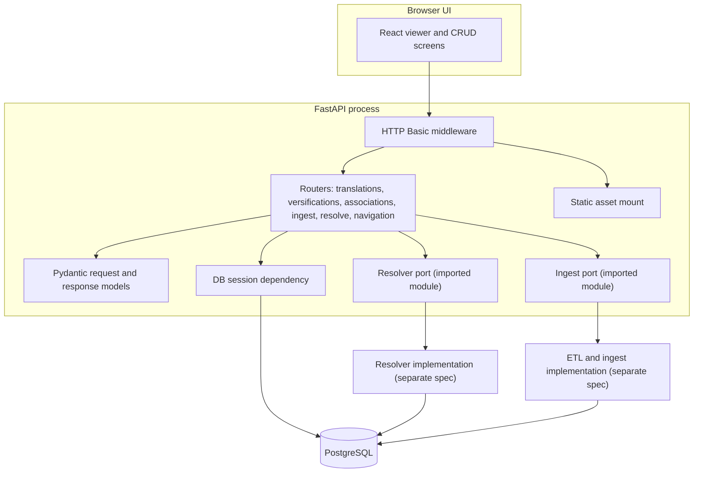
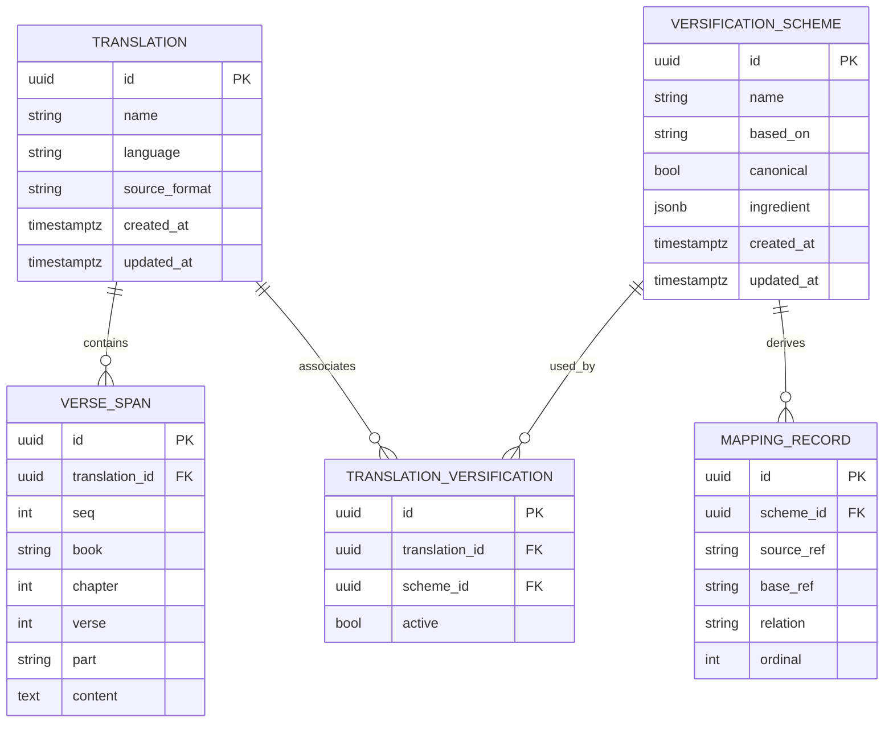
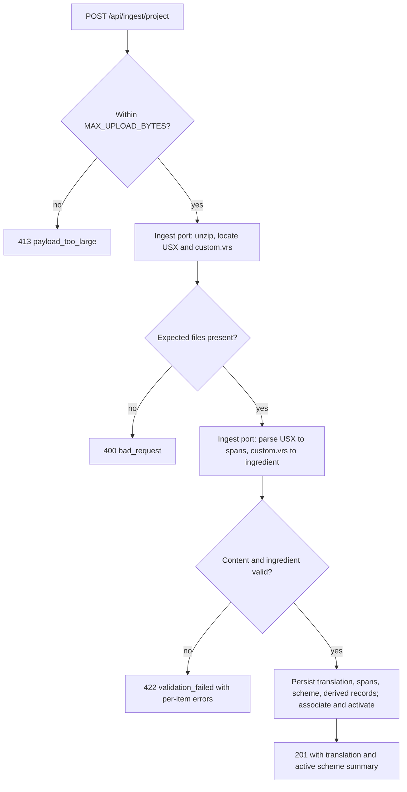
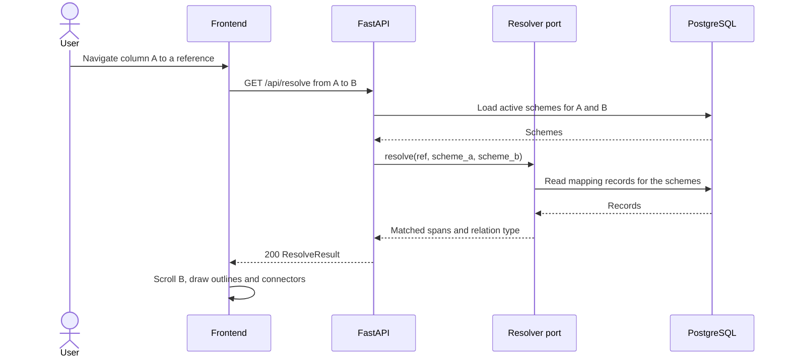

# Versification Viewer: Server, Database, and API Design Specification

**Status:** Draft for review and reconciliation
**Audience:** The developer implementing the server, database, and API; and the developers writing the UI, resolver, and ETL specifications that this document is reconciled against.
**Scope of this document:** The backend server process, the relational database, and the HTTP API. It does not specify the resolver internals, the ETL/ingest parsing internals, or the UI. Those are owned by separate specifications and appear here only as isolated interface contracts.

---

## 1. Overview

This specification describes the server, database, and API for the versification viewer proof-of-concept (POC). The POC displays two Bible translations side by side and aligns them across differing versifications, as described in [research/frvt-versification-viewer-poc-1.md](../research/frvt-versification-viewer-poc-1.md).

The backend has three responsibilities:

1. Persist translations, their verse text, versification schemes (stored as Copenhagen/Scripture Burrito ingredients), and the associations between them.
2. Expose an HTTP API that the UI uses to manage this data, read scripture content for display, and resolve a reference in one translation to the matching span in another.
3. Host the static UI assets and gate all access behind a simple authentication check.

The server calls a mapping resolver and a set of ETL/ingest routines. Both are implemented against separate specifications. This document defines the contracts the server depends on so the pieces reconcile cleanly later. See [Section 8](#8-boundary-interface-contracts).

### 1.1 Reference implementation

The PEMPal demo at [../OSI/PemPal-Demo-1](../../OSI/PemPal-Demo-1) is the technical reference for stack shape and operational conventions: FastAPI on Uvicorn, PostgreSQL in Docker Compose, `.env`-based configuration, HTTP Basic authentication as a middleware, a static-file mount that serves the UI from the same process, and a shared logging module with a custom `TRACE` level. This document reuses those conventions and calls out the two deliberate divergences: an ORM with migrations instead of hand-written SQL, and a read/write CRUD API instead of PEMPal's read-only API.

---

## 2. Scope and non-goals

### 2.1 In scope

- Database schema and ORM models for translations, verse spans, versification schemes, scheme-to-translation associations, and derived mapping records.
- Schema migrations.
- The HTTP API: CRUD for translations and versifications, scheme-to-translation association, file ingest and upload endpoints, scripture-content reads, navigation and jump-menu data, and reference resolution.
- Server bootstrap: configuration, authentication, static-asset serving, database session lifecycle, logging, and a uniform error contract.

### 2.2 Non-goals (owned by other specifications)

- **Resolver internals.** The algorithm that pivots through a base versification and classifies relations is specified elsewhere. This document defines only the callable the API invokes and the data it exchanges. See [Section 8.1](#81-resolver-contract).
- **ETL/ingest internals.** Parsing USX into verse spans, converting VRS to a Copenhagen ingredient, and validating an ingredient against the schema are specified elsewhere. This document defines only the callables the ingest endpoints invoke. See [Section 8.2](#82-etl--ingest-contract).
- **UI.** The React frontend, the overlay rendering of outlines and connectors, and client-side navigation are specified elsewhere. This document defines the API the UI consumes.
- **Versification detection.** The POC does not run the Copenhagen sniffer. Detection happens outside the tool; the tool ingests the resulting files. This matches the POC scope.
- **Production concerns.** Authentication beyond a simple gate, horizontal scaling, and multi-tenancy are out of scope, consistent with the POC.

---

## 3. Basis and assumptions

### 3.1 Sources

- Architecture and capabilities: [research/frvt-versification-viewer-poc-1.md](../research/frvt-versification-viewer-poc-1.md).
- Versification domain and format background: [research/frvt-versification-standards-and-tooling-1.md](../research/frvt-versification-standards-and-tooling-1.md).
- Copenhagen/Burrito ingredient schema: [research/CopenhagenFormat/versification_schema.json](../research/CopenhagenFormat/versification_schema.json).
- Concrete ingredient samples used for the examples below: [research/CopenhagenFormat/eng.json](../research/CopenhagenFormat/eng.json), [research/CopenhagenFormat/org.json](../research/CopenhagenFormat/org.json), and [research/CopenhagenFormat/validated.json](../research/CopenhagenFormat/validated.json).
- Stack and operational reference: the PEMPal demo, notably [api/main.py](../../OSI/PemPal-Demo-1/api/main.py), [api/auth.py](../../OSI/PemPal-Demo-1/api/auth.py), [etl/common/logging_config.py](../../OSI/PemPal-Demo-1/etl/common/logging_config.py), and [docker-compose.yml](../../OSI/PemPal-Demo-1/docker-compose.yml).

### 3.2 Assumptions to reconcile

These are decisions this document makes at boundaries owned by other specifications. Each is flagged so it can be confirmed or changed during reconciliation. They are collected again in [Section 11](#11-open-questions-and-reconciliation-items).

- **In-process resolver.** The resolver runs in-process as an imported Python module, not as a separate service. The POC architecture describes "a mapping resolver that the API calls," which this reads as an in-process call.
- **Synchronous ingest.** The ETL/ingest routines run in-process, synchronously, within the request handling the upload. The POC targets a small number of translations, so synchronous ingest is acceptable.
- **USX ingest target.** The ingest target format is USX, as the POC recommends. USFM projects are converted to USX before ingest by the ETL layer.
- **Single active scheme.** A translation has at most one active versification scheme at a time; several may be associated. This follows the POC resolution model.
- **BCV reference grammar.** Reference strings use the Copenhagen BCV grammar: `BOOK C:V` and ranges `BOOK C:V-V`, with `BOOK` a three-character USFM book id (pattern `^[A-Z1-6]{3}$`), verse `0` reserved for a Psalm-title span, and an optional sub-verse part identifier (a letter such as `a`, or `-`) for partial verses. This matches the schema's `bcv` and `bcvRange` patterns.
- **Ingredient as system of record.** The ingredient JSON is the system of record for a scheme. `mapping_record` rows are derived from it and can be rebuilt at any time.

---

## 4. Technology stack

| Concern | Choice | Rationale |
|---|---|---|
| Language | Python 3.11+ | Matches PEMPal and keeps the API, resolver, and ETL in one language. |
| Web framework | FastAPI on Uvicorn | Same as PEMPal. Typed request/response models, automatic OpenAPI, dependency injection for the DB session. |
| Validation / DTOs | Pydantic v2 | Request and response models, ingredient field validation at the edge. |
| ORM | SQLAlchemy 2.0 (typed, declarative) | Divergence from PEMPal's raw SQL. The CRUD surface and the association join are relational and benefit from an ORM. |
| Migrations | Alembic | Divergence from PEMPal's `schema.sql` + apply script. Schema evolves across CRUD entities, so versioned migrations are warranted. |
| Database | PostgreSQL 15 | Same engine as PEMPal, without PostGIS (no geometry here). |
| Ingredient storage | `jsonb` column | Preserves the Copenhagen/Burrito ingredient verbatim for round-trip fidelity, while allowing indexed queries on derived rows. |
| DB driver | `psycopg2-binary` | Matches PEMPal's driver; works with SQLAlchemy 2.0. |
| Config | `python-dotenv` + environment | Same `.env` pattern as PEMPal. |
| Auth | HTTP Basic via Starlette middleware | Same simple gate as PEMPal's [`BasicAuthMiddleware`](../../OSI/PemPal-Demo-1/api/auth.py). |
| Logging | Shared module with a custom `TRACE` level | Mirrors PEMPal's [`logging_config`](../../OSI/PemPal-Demo-1/etl/common/logging_config.py) so getter-style reads log at `TRACE`. |
| Tests | Pytest + Starlette `TestClient` | Matches PEMPal's test tooling. |

### 4.1 Dependencies

Pin these in `requirements.txt`. Versions are lower bounds; resolve to current releases at implementation time rather than inventing exact pins.

```text
fastapi>=0.115.0
uvicorn[standard]>=0.32.0
SQLAlchemy>=2.0.0
alembic>=1.13.0
psycopg2-binary>=2.9.9
pydantic>=2.7.0
python-dotenv>=1.0.0
python-multipart>=0.0.9
pytest>=8.0.0
httpx>=0.27.0
```

`python-multipart` is required for FastAPI file uploads. `httpx` backs the Starlette `TestClient`.

---

## 5. Server architecture



### 5.1 Request lifecycle

1. Every request passes through the HTTP Basic middleware first, including static assets and the OpenAPI docs, exactly as PEMPal gates everything. Unauthenticated requests get `401` with a `WWW-Authenticate` challenge.
2. Authenticated requests route to a router. The router validates the request body or query with a Pydantic model.
3. Handlers acquire a database session through a FastAPI dependency (`Depends(get_session)`), which yields a session and closes it after the response, committing on success and rolling back on error.
4. Handlers that resolve references call the resolver port. Handlers that ingest files call the ingest port. Both ports are thin adapters over the imported implementation modules, so the API depends on a stable signature rather than on internals.
5. Responses are serialized from Pydantic response models. Errors follow the uniform error contract in [Section 5.4](#54-error-contract).

### 5.2 Configuration

Read from environment (loaded from `.env` at startup, following PEMPal). All have defaults suitable for local Compose.

| Variable | Default | Purpose |
|---|---|---|
| `POSTGRES_HOST` | `localhost` | Database host. |
| `POSTGRES_PORT` | `5433` | Database port (Compose maps container `5432` to host `5433`, as PEMPal does). |
| `POSTGRES_DB` | `frvt` | Database name. |
| `POSTGRES_USER` | `frvt` | Database user. |
| `POSTGRES_PASSWORD` | `frvt` | Database password. |
| `DATABASE_URL` | derived | Optional full SQLAlchemy URL; when unset, built from the `POSTGRES_*` values. |
| `BASIC_AUTH_USERNAME` | `admin` | API/UI username. |
| `BASIC_AUTH_PASSWORD` | `Admin123!` | API/UI password. |
| `MAX_UPLOAD_BYTES` | `52428800` | Upload size cap (50 MB) for ingest endpoints. |
| `LOG_LEVEL` | `DEBUG` | Root logger level for the `frvt` logger tree. |

Configuration is centralized in a single settings object (a Pydantic `BaseSettings` model) so callers read typed values rather than calling `os.getenv` throughout.

### 5.3 Authentication

Reuse PEMPal's approach verbatim in shape: a `BaseHTTPMiddleware` subclass that validates the `Authorization: Basic` header against the configured credentials using `secrets.compare_digest`, and returns `401` with `WWW-Authenticate: Basic realm="FRVT"` on failure. Credentials are cached with `lru_cache`. This gates the API, the static UI, and the `/docs` page. This is a simple gate only and is not a production authentication system.

### 5.4 Error contract

All error responses share one JSON envelope so the UI can handle them uniformly:

```json
{
  "detail": "Human-readable summary.",
  "code": "machine_readable_code",
  "errors": [
    { "field": "custom.vrs", "message": "Unmapped verse at REV 13:1." }
  ]
}
```

- `detail` is always present. `code` is always present and drawn from a fixed set. `errors` is present only for validation failures that have per-item detail (for example, ingest problems), and is omitted otherwise.
- Status code usage:

| Status | When |
|---|---|
| `400` | Malformed request (bad reference grammar, bad query parameter, unparseable file). |
| `401` | Missing or invalid credentials. |
| `404` | A referenced translation, scheme, or association does not exist. |
| `409` | A conflicting write (for example, activating a scheme not associated with the translation, or deleting a scheme still referenced by an active association). |
| `413` | Upload exceeds `MAX_UPLOAD_BYTES`. |
| `422` | A file or ingredient fails schema or content validation (invalid ingredient, USX that does not parse into spans). FastAPI also emits `422` for request-model validation. |
| `500` | Unexpected server error. |
| `503` | Database unavailable, matching PEMPal's behavior. |

A fixed `code` vocabulary: `bad_request`, `unauthorized`, `not_found`, `conflict`, `payload_too_large`, `validation_failed`, `internal_error`, `database_unavailable`.

### 5.5 Static UI serving

Mount the UI directory at `/` with `StaticFiles(html=True)`, exactly as PEMPal mounts `web/`. The mount comes after the API routes so `/api/...` is never shadowed. The middleware still gates static assets.

### 5.6 Logging

Reuse PEMPal's logging module shape under a `frvt` logger root: a custom `TRACE` level (numeric `5`, below `DEBUG`) added to `logging.Logger`, a single stream handler configured once, and `get_logger(__name__)` used at import time. Per the project logging rules, these APIs check the level before building the message, so callers pass format args rather than pre-building strings. Logging expectations for generated code are in [Section 10.2](#102-logging).

---

## 6. Data model

This section is self-contained so it can be updated independently during reconciliation with the ETL, resolver, and UI specs. It defines five entities and one enumeration.



### 6.1 Entities

#### 6.1.1 `translation`

A single Bible translation loaded into the tool.

| Column | Type | Notes |
|---|---|---|
| `id` | `uuid` PK | Server-generated. |
| `name` | `text` not null | Display name, unique per case-insensitive value. |
| `language` | `text` not null | Free-text language label. |
| `source_format` | `text` not null | Original upload format, one of `usx`, `usfm`. Recorded for provenance; content is always stored as spans. |
| `created_at` | `timestamptz` not null default now | |
| `updated_at` | `timestamptz` not null default now | Updated on write. |

Deleting a translation cascades to its verse spans and its association rows. It does not delete versification schemes, which can be shared.

#### 6.1.2 `verse_span`

One addressable span of scripture text within a translation. A span can be a whole verse, a Psalm-title span (`verse = 0`), or a sub-verse part (`part` set), which is what lets the model represent partial verses.

| Column | Type | Notes |
|---|---|---|
| `id` | `uuid` PK | |
| `translation_id` | `uuid` FK not null | References `translation.id`, `ON DELETE CASCADE`. |
| `seq` | `int` not null | Document order assigned by the parser during ingest. A column always renders by `seq`, so reading order is stable regardless of the active versification. Each part of a split verse gets its own consecutive `seq`. |
| `book` | `char(3)` not null | USFM book id, pattern `^[A-Z1-6]{3}$`. |
| `chapter` | `int` not null | |
| `verse` | `int` not null | `0` denotes a Psalm-title span. |
| `part` | `text` null | Sub-verse part id (for example `a`), null for whole verses. |
| `content` | `text` not null | The verse text for this span. |

Constraints and indexes:

- Unique `(translation_id, book, chapter, verse, part)` where `part` null and non-null are distinct rows.
- Unique `(translation_id, seq)`.
- Index `(translation_id, book, chapter)` to serve column reads.

#### 6.1.3 `versification_scheme`

A versification stored as a Copenhagen/Burrito ingredient, plus the metadata the tool needs to resolve through it.

| Column | Type | Notes |
|---|---|---|
| `id` | `uuid` PK | |
| `name` | `text` not null | Display name (for example `eng`, `org`, `french org custom`). |
| `based_on` | `text` null | The canonical base this scheme maps against, from the ingredient's `basedOn`. Null or self-referential for a root canonical scheme such as `org`. |
| `canonical` | `bool` not null default false | True for the shipped canonical schemes (`org`, `eng`, `lxx`, `rso`, `rsc`, `vul`), false for uploaded custom schemes. |
| `ingredient` | `jsonb` not null | The full Copenhagen/Burrito ingredient, the system of record for this scheme. |
| `created_at` | `timestamptz` not null default now | |
| `updated_at` | `timestamptz` not null default now | |

#### 6.1.4 `translation_versification`

The association join. A translation can be associated with several schemes and can switch the active one on the fly.

| Column | Type | Notes |
|---|---|---|
| `id` | `uuid` PK | |
| `translation_id` | `uuid` FK not null | `ON DELETE CASCADE`. |
| `scheme_id` | `uuid` FK not null | `ON DELETE RESTRICT`, so a scheme in use cannot be deleted out from under a translation. |
| `active` | `bool` not null default false | At most one active row per translation. |

Constraints:

- Unique `(translation_id, scheme_id)`.
- A partial unique index on `translation_id` where `active` is true, enforcing at most one active scheme per translation (the single-active-scheme assumption, Section 3.2).

#### 6.1.5 `mapping_record`

The flattened, queryable form of a scheme's ingredient relationships, derived at load time from the `ingredient` jsonb (the ingredient-as-system-of-record assumption, Section 3.2). These rows exist to make resolution and jump-menu queries straightforward and fast; they are never the system of record.

| Column | Type | Notes |
|---|---|---|
| `id` | `uuid` PK | |
| `scheme_id` | `uuid` FK not null | `ON DELETE CASCADE`. |
| `source_ref` | `text` not null | A reference or range in this scheme, BCV grammar. |
| `base_ref` | `text` null | The corresponding reference or range in `based_on`. Null for an exclusion (no counterpart). |
| `relation` | `text` not null | A `relation_type` value (below). |
| `ordinal` | `int` not null | Stable ordering for deterministic output and jump-menu listing. |

Indexes: `(scheme_id, source_ref)` and `(scheme_id, relation)`.

### 6.2 Relation type enumeration

`relation_type` is a fixed vocabulary shared by the data model, the resolver contract, and the API. It travels with every resolved result because the UI draws each case differently.

| Value | Meaning |
|---|---|
| `one_to_one` | One span maps to one span with the same number. |
| `shift` | One span maps to one span with a different number (for example a Psalm-title offset). |
| `renumber` | A block moves across a chapter boundary or into a different chapter count. |
| `split` | One span in the source corresponds to several in the base. |
| `merge` | Several spans in the source correspond to one in the base. |
| `exclude` | The span is absent in the counterpart; it resolves to no span. |
| `partial` | The mapping covers only part of a verse. |

### 6.3 Storing mappings, and how the ingredient maps to rows

The `ingredient` jsonb is kept verbatim so the interchange format round-trips without loss, including fields the POC does not use. Deriving `mapping_record` rows from it, rather than normalizing every ingredient field into its own tables, keeps queries simple while preserving fidelity. The derivation reads each ingredient field and emits rows as follows. Examples are taken from the real samples in [research/CopenhagenFormat](../research/CopenhagenFormat).

| Ingredient field | Example (from samples) | Derived `mapping_record` rows |
|---|---|---|
| `basedOn` | `"org"` (in [validated.json](../research/CopenhagenFormat/validated.json)) | Not a row; stored on `versification_scheme.based_on`. |
| `maxVerses` | `"GEN": ["31","25",...]` (in [eng.json](../research/CopenhagenFormat/eng.json)) | Not rows; used to validate references and drive navigation bounds. |
| `mappedVerses` | `"GEN 31:55": "GEN 32:1"`, `"PSA 3:0-8": "PSA 3:1-9"`, `"NEH 7:69-73": "NEH 7:68-72"` (in [eng.json](../research/CopenhagenFormat/eng.json)) | One row per entry: `source_ref` = key, `base_ref` = value, `relation` classified as `shift` or `renumber` by comparing book/chapter/verse deltas. |
| `excludedVerses` | `["MAT 17:21", ...]` in NT-omission schemes; `[]` in [eng.json](../research/CopenhagenFormat/eng.json) | One row per verse: `source_ref` set, `base_ref` null, `relation` = `exclude`. |
| `mergedVerses` | `["JOS 19:47-48", "1PE 4:1-2", ...]` (in [validated.json](../research/CopenhagenFormat/validated.json)) | One row per range with `relation` = `merge`; `base_ref` resolved from the corresponding `mappedVerses` entry where present. |
| `partialVerses` | `"SIR 36:13": ["a"]`, `"ESG 3:13": ["-","a","b",...]` (in [validated.json](../research/CopenhagenFormat/validated.json)) | One row per part with `relation` = `partial`; the `part` component is encoded in `source_ref`. |

The concrete classification rules (how `shift` versus `renumber` is decided, how `mergedVerses` join to `mappedVerses`) belong to the resolver/ETL specifications. This document requires only that the derivation is deterministic, is rebuildable from the ingredient, and populates the columns above. See the ingredient-as-system-of-record assumption (Section 3.2) and [Section 8](#8-boundary-interface-contracts).

### 6.4 Coverage check

Every Copenhagen/Burrito ingredient field named in the schema is accounted for: `basedOn` (column), `maxVerses` (validation and navigation), `mappedVerses`, `excludedVerses`, `mergedVerses`, and `partialVerses` (derived rows). The `verification` field, when present, is retained inside the stored `ingredient` and is not otherwise modeled.

---

## 7. API contract

This section is self-contained so it can be updated independently during reconciliation. All paths are under `/api`. All requests require HTTP Basic auth. All responses are JSON unless noted. `id` path parameters are UUIDs. Timestamps are ISO-8601 UTC.

### 7.1 Conventions

- List endpoints return `{ "items": [...], "total": <int> }` and accept `limit` (default `100`, max `500`) and `offset` (default `0`).
- Reference strings follow the BCV grammar defined in Section 3.2.
- Write endpoints validate the body with a Pydantic model and return the created or updated resource.
- Errors follow [Section 5.4](#54-error-contract).

### 7.2 Pydantic models

Request and response models. Field types are Python; JSON types follow directly.

```python
# Shared
class RelationType(str, Enum):
    one_to_one = "one_to_one"
    shift = "shift"
    renumber = "renumber"
    split = "split"
    merge = "merge"
    exclude = "exclude"
    partial = "partial"

class SpanRef(BaseModel):
    book: str          # ^[A-Z1-6]{3}$
    chapter: int
    verse: int         # 0 == Psalm title
    part: str | None = None

# Translations
class TranslationCreate(BaseModel):
    name: str
    language: str
    source_format: Literal["usx", "usfm"]

class TranslationUpdate(BaseModel):
    name: str | None = None
    language: str | None = None

class TranslationOut(BaseModel):
    id: UUID
    name: str
    language: str
    source_format: str
    created_at: datetime
    updated_at: datetime

# Verse spans
class VerseSpanOut(BaseModel):
    id: UUID
    seq: int
    book: str
    chapter: int
    verse: int
    part: str | None
    content: str

# Versification schemes
class VersificationOut(BaseModel):
    id: UUID
    name: str
    based_on: str | None
    canonical: bool
    created_at: datetime
    updated_at: datetime
    # `ingredient` returned only from the detail endpoint, see 7.5

class VersificationDetailOut(VersificationOut):
    ingredient: dict

class VersificationUpdate(BaseModel):
    name: str | None = None

# Associations
class AssociationCreate(BaseModel):
    scheme_id: UUID

class AssociationOut(BaseModel):
    id: UUID
    translation_id: UUID
    scheme_id: UUID
    active: bool

# Resolution
class ResolvedSpan(BaseModel):
    ref: str                 # BCV string in the target scheme
    seq: int | None          # verse_span.seq when a stored span exists
    part: str | None = None

class ResolveResult(BaseModel):
    source_ref: str
    relation: RelationType
    target_spans: list[ResolvedSpan]   # empty for `exclude`

# Navigation
class NavBook(BaseModel):
    book: str
    chapters: list[int]      # chapter numbers present, from maxVerses/spans

class DeltaEntry(BaseModel):
    source_ref: str
    base_ref: str | None
    relation: RelationType

class MisalignmentEntry(BaseModel):
    category: str            # see 7.9
    source_ref: str
    relation: RelationType
```

### 7.3 Translations CRUD

| Method | Path | Purpose | Success |
|---|---|---|---|
| `GET` | `/api/translations` | List translations. | `200` `{items, total}` of `TranslationOut`. |
| `POST` | `/api/translations` | Create a metadata-only translation (content arrives via ingest). | `201` `TranslationOut`. |
| `GET` | `/api/translations/{id}` | Get one translation. | `200` `TranslationOut`. |
| `PATCH` | `/api/translations/{id}` | Update name/language. | `200` `TranslationOut`. |
| `DELETE` | `/api/translations/{id}` | Delete translation, its spans, and its associations. | `204`. |

`POST` and `PATCH` reject a duplicate case-insensitive `name` with `409 conflict`. `DELETE`/`GET`/`PATCH` on a missing id return `404 not_found`.

### 7.4 Scripture content reads

| Method | Path | Query | Purpose | Success |
|---|---|---|---|---|
| `GET` | `/api/translations/{id}/spans` | `book` (required), `chapter` (optional), `limit`, `offset` | Return verse spans for a column, ordered by `seq`. | `200` `{items, total}` of `VerseSpanOut`. |

Behavior: `book` filters to one book; adding `chapter` narrows to one chapter. Ordering is always by `seq` so reading order is stable regardless of the active versification (see `verse_span.seq`). Unknown `book` returns an empty list, not an error. Missing translation returns `404`.

### 7.5 Versifications CRUD

| Method | Path | Purpose | Success |
|---|---|---|---|
| `GET` | `/api/versifications` | List schemes. Supports `canonical` boolean filter. | `200` `{items, total}` of `VersificationOut`. |
| `GET` | `/api/versifications/{id}` | Get one scheme including its `ingredient`. | `200` `VersificationDetailOut`. |
| `PATCH` | `/api/versifications/{id}` | Rename a scheme. | `200` `VersificationOut`. |
| `DELETE` | `/api/versifications/{id}` | Delete a scheme and its derived rows. | `204`, or `409 conflict` if any association references it. |

Creation of a scheme happens through upload ([Section 7.7](#77-file-ingest-and-upload)), not a plain `POST`, because a scheme is always created from a file. Deleting a canonical scheme is allowed but discouraged; if it is referenced by an association it returns `409`.

### 7.6 Associations

| Method | Path | Purpose | Success |
|---|---|---|---|
| `GET` | `/api/translations/{id}/versifications` | List schemes associated with a translation, marking the active one. | `200` list of `AssociationOut`. |
| `POST` | `/api/translations/{id}/versifications` | Associate an existing scheme with the translation. | `201` `AssociationOut`. |
| `PUT` | `/api/translations/{id}/versifications/{scheme_id}/active` | Make this association the active one. | `200` `AssociationOut`. |
| `DELETE` | `/api/translations/{id}/versifications/{scheme_id}` | Remove an association. | `204`. |

Rules: `POST` with an already-associated scheme returns `409`. `PUT ... /active` on a scheme not associated with the translation returns `409 conflict`; it also clears `active` on the previously active row within the same transaction, preserving the single-active-scheme invariant. Deleting the active association is allowed and leaves the translation with no active scheme.

### 7.7 File ingest and upload

Both endpoints accept `multipart/form-data`. Both enforce `MAX_UPLOAD_BYTES` and return `413 payload_too_large` when exceeded. Both delegate parsing and validation to the ingest port ([Section 8.2](#82-etl--ingest-contract)) and persist the results in one transaction.

#### 7.7.1 Load a project

| Method | Path | Form fields | Purpose |
|---|---|---|---|
| `POST` | `/api/ingest/project` | `file` (zip), `name`, `language` | Ingest a zipped Paratext-style project: USX content plus a `custom.vrs`. |

Flow, matching the POC "Loading a Project" workflow:



Success returns `201` with a body containing the created `TranslationOut` and the created/active `VersificationOut`. On validation failure the transaction rolls back and the response uses the `errors` array to report the offending lines or content.

#### 7.7.2 Upload a versification

| Method | Path | Form fields | Purpose |
|---|---|---|---|
| `POST` | `/api/versifications/upload` | `file` (`.vrs` or Copenhagen/Burrito `.json`), `name` (optional) | Create a scheme from a standalone file. |

Flow, matching the POC "Uploading Versifications" workflow: the ingest port detects the format, converts VRS to a Copenhagen ingredient when needed (noting VRS cannot express splits), validates against the schema, stores the scheme, and derives records. The scheme is created unassociated; the caller associates it separately via [Section 7.6](#76-associations). Success returns `201` `VersificationOut`. Invalid input returns `422` with per-item `errors`.

### 7.8 Reference resolution

| Method | Path | Query | Purpose |
|---|---|---|---|
| `GET` | `/api/resolve` | `from_translation` (uuid), `to_translation` (uuid), `ref` (BCV string) | Resolve a reference in the source translation's active scheme to matching spans in the target translation's active scheme. |

Behavior:

1. Load the active scheme for each translation (`404` if either translation is missing; `409 conflict` if either has no active scheme).
2. Validate `ref` against the BCV grammar (`400 bad_request` on failure).
3. Call the resolver port ([Section 8.1](#81-resolver-contract)) with the source ref and the two schemes.
4. Return `200` `ResolveResult`. An `exclude` relation returns an empty `target_spans`, which the UI renders as a gap rather than a false match.

The resolver performs the pivot through the base, the multi-hop indirection, and the shared-base short-cut described in the POC; the API does not implement resolution logic itself. The sequence:



### 7.9 Navigation and jump-menu data

These endpoints supply the higher-level navigation controls: places where two versifications are explicitly mapped, common misalignment categories, and the book/chapter structure for arbitrary navigation.

| Method | Path | Query | Purpose | Success |
|---|---|---|---|---|
| `GET` | `/api/translations/{id}/navigation` | none | Books and chapter numbers available for the translation's active scheme, from `maxVerses` and stored spans. | `200` list of `NavBook`. |
| `GET` | `/api/resolve/deltas` | `from_translation`, `to_translation`, `book` (optional), `limit`, `offset` | The explicit mapping deltas between the two active schemes: every place they differ. | `200` `{items, total}` of `DeltaEntry`. |
| `GET` | `/api/resolve/misalignments` | `from_translation`, `to_translation`, `category` (optional), `limit`, `offset` | Deltas grouped into common misalignment categories. | `200` `{items, total}` of `MisalignmentEntry`. |

The `category` vocabulary, drawn from the research's known divergence categories: `psalm_title`, `chapter_boundary`, `chapter_count`, `lxx_psalm`, `synodal`, `nt_omission`, `other`. The deltas come from `mapping_record` rows for the schemes involved. Categorization rules (which delta falls in which category) are shared with the resolver/ETL specs; this document requires only that the endpoint returns entries tagged with a `category` and a `relation`, ordered deterministically by `mapping_record.ordinal`.

### 7.10 Health

| Method | Path | Purpose | Success |
|---|---|---|---|
| `GET` | `/api/health` | Liveness plus a database ping. | `200` `{"status":"ok"}`, or `503 database_unavailable`. |

---

## 8. Boundary interface contracts

The server depends on two modules owned by other specifications. Each contract below is a stable seam: the API imports the callable and exchanges the DTOs shown. Both rest on the in-process resolver and synchronous ingest assumptions (Section 3.2). Keeping them here, isolated, is what lets the resolver and ETL specs evolve without reopening the API or data-model sections.

### 8.1 Resolver contract

The resolver is imported as a module and called in-process (see the in-process resolver assumption, Section 3.2). It reads `mapping_record` rows (and may read `maxVerses` from the ingredient) to resolve and classify. It does not write.

```python
# frvt.resolver (implemented against the resolver specification)

@dataclass(frozen=True)
class SchemeRef:
    """Identifies a scheme for resolution: its id and its base chain root."""
    scheme_id: UUID
    based_on: str | None

@dataclass(frozen=True)
class ResolvedSpanDTO:
    ref: str                 # BCV string in the target scheme
    part: str | None

@dataclass(frozen=True)
class ResolutionDTO:
    source_ref: str
    relation: str            # a relation_type value
    target_spans: tuple[ResolvedSpanDTO, ...]   # empty for exclude

def resolve(
    session: Session,
    source_ref: str,
    source_scheme: SchemeRef,
    target_scheme: SchemeRef,
) -> ResolutionDTO:
    """
    Resolve `source_ref` from the source scheme to the target scheme by
    pivoting through the shared or canonical base. Returns matched spans and
    the relation type. Raises ReferenceError for a syntactically invalid ref
    and LookupError when a scheme cannot be loaded.
    """
```

The API adapter (`resolver port`) maps `ResolutionDTO` to `ResolveResult`, attaches the `verse_span.seq` for each target ref when a stored span exists, and translates the two exceptions to `400` and `409` respectively.

### 8.2 ETL / ingest contract

The ingest module is imported and called synchronously within the upload request (see the synchronous ingest assumption, Section 3.2). It parses and validates; the API persists what it returns inside one transaction, so the ingest functions do not commit.

```python
# frvt.ingest (implemented against the ETL specification)

@dataclass(frozen=True)
class ParsedSpan:
    seq: int
    book: str
    chapter: int
    verse: int
    part: str | None
    content: str

@dataclass(frozen=True)
class ParsedScheme:
    name: str
    based_on: str | None
    canonical: bool
    ingredient: dict         # validated Copenhagen/Burrito ingredient

@dataclass(frozen=True)
class IngestIssue:
    field: str               # e.g. "custom.vrs" or "GEN.usx"
    message: str

@dataclass(frozen=True)
class ProjectIngestResult:
    spans: tuple[ParsedSpan, ...]
    scheme: ParsedScheme
    issues: tuple[IngestIssue, ...]   # non-empty means reject

def ingest_project(archive_bytes: bytes) -> ProjectIngestResult:
    """
    Unzip a Paratext-style project, locate USX files and custom.vrs, parse USX
    into spans and custom.vrs into a validated ingredient. Returns parsed data
    and any blocking issues. Does not touch the database.
    """

def ingest_versification(file_bytes: bytes, filename: str) -> tuple[ParsedScheme, tuple[IngestIssue, ...]]:
    """
    Detect VRS vs Copenhagen/Burrito by content and extension, convert VRS to
    an ingredient when needed, and validate against the schema. Returns the
    parsed scheme and any blocking issues. Does not touch the database.
    """

def derive_mapping_records(scheme: ParsedScheme) -> tuple[MappingRecordDTO, ...]:
    """
    Flatten an ingredient into mapping_record rows per Section 6.3. Pure and
    deterministic, so records can be rebuilt from the stored ingredient.
    """
```

When `issues` is non-empty, the API rolls back and returns `422 validation_failed` with the issues in the `errors` array. The `MappingRecordDTO` mirrors the `mapping_record` columns minus `id` and `scheme_id`, which the API assigns on insert.

### 8.3 UI boundary

The UI consumes the API in [Section 7](#7-api-contract). The only shared contracts are the endpoint shapes and the `relation_type` vocabulary, which the UI uses to draw outlines and connectors. No server code depends on the UI beyond serving its static files.

---

## 9. Module and file layout

```text
frvt/
  api/
    main.py            # app bootstrap, middleware, static mount, router include
    config.py          # Pydantic settings object
    auth.py            # HTTP Basic middleware (mirrors PemPal)
    db.py              # engine, session factory, get_session dependency
    errors.py          # error envelope, exception handlers, code vocabulary
    logging_config.py  # shared logger with TRACE level (mirrors PemPal)
    ports/
      resolver_port.py # adapter over frvt.resolver
      ingest_port.py   # adapter over frvt.ingest
    routers/
      translations.py
      spans.py
      versifications.py
      associations.py
      ingest.py
      resolve.py
      navigation.py
      health.py
    schemas/           # Pydantic request/response models (Section 7.2)
    models/            # SQLAlchemy models (Section 6)
  migrations/          # Alembic environment and versions
  resolver/            # owned by the resolver spec (contract in 8.1)
  ingest/              # owned by the ETL spec (contract in 8.2)
  web/                 # owned by the UI spec; served statically
  tests/
  requirements.txt
  docker-compose.yml
  .env.example
  alembic.ini
```

Routers stay small and focused. If a router or module approaches the size guidance, split it (for example, separate read and write routers) rather than letting one file grow.

---

## 10. Cross-cutting conventions

These bind the generated code to the project rules.

### 10.1 Orienting comments

Every new field and non-overriding method, at every access level, carries an orienting comment explaining why it exists and when to use it. Interface and abstract declarations document the contract; implementations document high-level approach. The signatures in [Section 8](#8-boundary-interface-contracts) already carry contract-style docstrings for this reason.

### 10.2 Logging

Using the shared logger (Section 5.6), which checks the level before formatting:

- Public backend method invocations log at `DEBUG` with enough arguments to troubleshoot (for example, `logger.debug("Resolving ref=%s from=%s to=%s", ref, from_id, to_id)`).
- Caught exceptions log at `ERROR` with `exc_info=True`, matching PEMPal's handlers, before mapping to the error envelope.
- Getter-style reads that do not modify state log at `TRACE`.
- Do not pre-check the level except when building a genuinely large string inline with the call.

### 10.3 Testing

Per the testing rules, cover happy paths and essential failures for behavior that carries a contract, not implementation detail:

- Resolution adapter: a `one_to_one`, a `shift` (Psalm title, `PSA 3:0-8` to `PSA 3:1-9`), a `split`, and an `exclude` returning empty spans.
- Association invariant: activating a second scheme deactivates the first; activating an unassociated scheme returns `409`.
- Ingest endpoints: a valid project loads; a project missing `custom.vrs` returns `400`; an invalid ingredient returns `422` with populated `errors`.
- Error contract: `404` for missing ids; `413` over the size cap.
- Do not test REST handlers that only delegate, Pydantic model construction, ORM column accessors, or other boilerplate. Remove any such tests if they appear.

### 10.4 Size and argument limits

Keep source files within the desirable and hard size limits and decompose when they approach them. Keep function argument counts within the limits; the resolver and ingest signatures use small parameter objects (`SchemeRef`, the parsed DTOs) partly for this reason.

### 10.5 Reuse

Shared concerns live in one place: the settings object, the DB session dependency, the logging module, the error envelope, and the two ports. Routers and models reuse these rather than re-implementing them.

---

## 11. Open questions and reconciliation items

Consolidated boundary assumptions from Section 3.2, to confirm with the resolver, ETL, and UI specs:

- **In-process resolver.** Resolver runs in-process as an imported module (Section 8.1). Confirm it is not a separate service.
- **Synchronous ingest.** Ingest runs synchronously within the upload request (Section 8.2). Confirm no async job runner is expected for the POC.
- **USX ingest target.** USX is the canonical ingest target; USFM is converted to USX by ETL (Section 7.7). Confirm ETL owns the conversion.
- **Single active scheme.** At most one active scheme per translation, enforced by a partial unique index (Section 6.1.4). Confirm the UI expects a single active scheme.
- **BCV reference grammar.** BCV grammar for references, including `verse 0` for Psalm titles and a `part` for partial verses (Section 3.2). Confirm the resolver and UI use the same grammar.
- **Ingredient as system of record.** The ingredient jsonb is the system of record; `mapping_record` rows are derived and rebuildable (Sections 6.3, 8.2). Confirm the ETL derivation is deterministic and owns the classification rules.
- Delta and misalignment categorization (Section 7.9): confirm whether the category vocabulary and the rules assigning deltas to categories live in the ETL derivation or the resolver.

---

## 12. Glossary

- **Versification scheme:** a system that assigns book, chapter, and verse numbers to spans of text.
- **Versification mapping:** a relation between spans in one scheme and the spans holding the same text in another, usually a canonical base.
- **Ingredient:** the Copenhagen/Scripture Burrito JSON document describing a scheme, stored verbatim in `versification_scheme.ingredient`.
- **`org`:** the original-language (Hebrew/Greek) numbering, the default canonical base.
- **Pivot / base:** the canonical scheme a translation's scheme is expressed as deltas from, named by `basedOn`.
- **Span:** an addressable unit of scripture text (`verse_span`), possibly a Psalm title (`verse 0`) or a sub-verse part.
- **Partial verse:** a mapping that covers only part of a verse, represented by a `part` component.
- **Relation type:** the classification of a mapping (`one_to_one`, `shift`, `renumber`, `split`, `merge`, `exclude`, `partial`).
