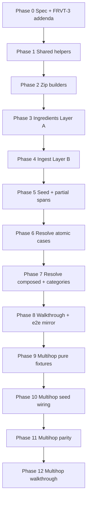
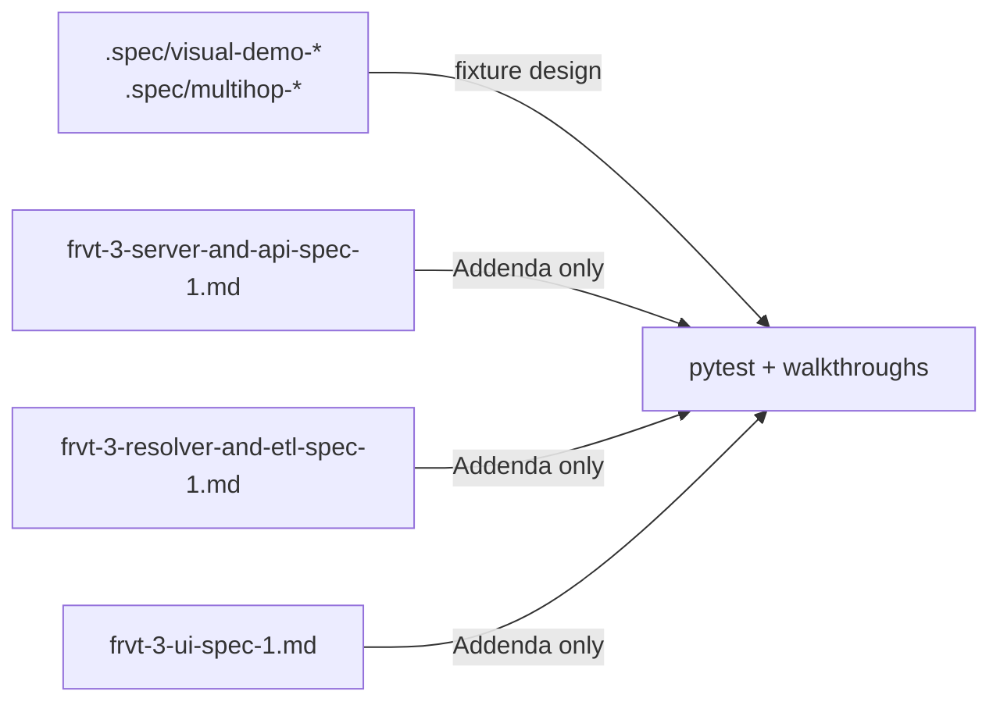
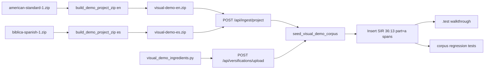
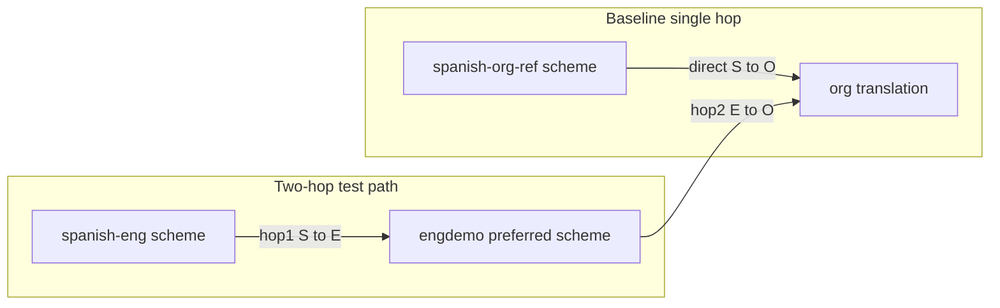

# Test Fixture Plans

**Canonical plan location:** [`.spec/visual-demo-corpus-plan.md`](.spec/visual-demo-corpus-plan.md) — update this file when iterating on the plan.

This document defines **two separate projects**. They share USX/zip builder utilities where sensible but have distinct goals, schemes, seeds, specs, tests, and walkthroughs.

| Project | Purpose |
|---|---|
| **A — Visual Demo Corpus** | Overlay topologies + jump-menu categories (scheme A→org→B contrast) |
| **B — Multi-hop Chain Test Bed** | Two-hop chain integrity (`spanish-eng` → `engdemo` → `org`) with org-parity baseline |

**Recommended implementation order:** Project A first (shared USX extract / identity VRS / PSA verse-0 helpers), then Project B (reuse those helpers; do not merge seeds).

## How to implement (phased, verifiable)

Work **phases in order**. Do not start phase *N+1* until phase *N* **Acceptance** passes. Each phase ends with a concrete verify command (pytest subset or import check). Phases are numbered globally so an agent can resume after any gate.

**Verify commands assume:** repo venv active, `cd` to repo root, DB available for phases that use `api_client` / `seeded_session` (same as existing `frvt/tests`).

| Global phase | Project | Gate test file / marker |
|---|---|---|
| 0–1 | Shared | `frvt/tests/test_fixture_shared_helpers.py` (new, small) |
| 2–8 | A | `frvt/tests/test_visual_demo_corpus.py` — add tests incrementally; use `@pytest.mark.visual_demo` |
| 9–13 | B | `frvt/tests/test_multihop_chain_testbed.py` — add tests incrementally; use `@pytest.mark.multihop` |

Docs (FRVT-3 product-spec addenda, `.test` walkthroughs) may trail their phase by one step but must land before the project is considered complete. FRVT-3 product-spec changes are **Phase 0 only** unless a later phase discovers a product-contract gap (new addendum subsection — see [FRVT-3 product spec addenda](#frvt-3-product-spec-addenda)).



### Phase 0 — Design skeleton (both projects, docs only)

**Deliver:**

1. **Fixture specs:** [`.spec/visual-demo-corpus-1.md`](.spec/visual-demo-corpus-1.md) and [`.spec/multihop-chain-testbed-1.md`](.spec/multihop-chain-testbed-1.md) with locked tables copied from this plan.
2. **FRVT-3 product spec addenda** on all three product specs (main body **never edited** — addenda only). For each file: insert the [modification-policy header](#frvt-3-product-spec-addenda), append `## Addenda`, and copy the corresponding subsection from [Required FRVT-3 addenda for this plan](#required-frvt-3-addenda-for-this-plan):
   - [`.spec/frvt-3-server-and-api-spec-1.md`](.spec/frvt-3-server-and-api-spec-1.md) — `ADD-S-001` (five modification rows)
   - [`.spec/frvt-3-resolver-and-etl-spec-1.md`](.spec/frvt-3-resolver-and-etl-spec-1.md) — `ADD-R-001` (four modification rows)
   - [`.spec/frvt-3-ui-spec-1.md`](.spec/frvt-3-ui-spec-1.md) — `ADD-U-001` (two modification rows)
3. **Python stubs:** modules that export empty `VERIFICATION_CASES` / `PARITY_CASES` tuples (importable, no builders yet).

**Acceptance:**

- Fixture specs exist and list case ids matching this plan.
- Each FRVT-3 product spec has the modification-policy block and exactly **one** Addenda subsection (`ADD-*-001`) with all modification rows from this plan; numbered main-body sections are unchanged on disk.
- `grep -c '^### ADD-' .spec/frvt-3-server-and-api-spec-1.md .spec/frvt-3-resolver-and-etl-spec-1.md .spec/frvt-3-ui-spec-1.md` prints `1` for each file.
- `python -c "from frvt.testops.fixtures.visual_demo_ingredients import VERIFICATION_CASES; from frvt.testops.fixtures.multihop_chain_fixtures import PARITY_CASES"` succeeds (empty tuples OK).

**Does not require:** zips, DB, passing resolve, or product code changes.

---

### Phase 1 — Shared testops helpers

**Deliver:** in [`api_setup.py`](frvt/testops/fixtures/api_setup.py):
- `ingest_project_bytes(...)`
- `set_preferred(...)` (mirror e2e `setPreferredScheme` endpoint)
- `insert_partial_verse_span(session, ...)`

**Deliver:** [`frvt/tests/test_fixture_shared_helpers.py`](frvt/tests/test_fixture_shared_helpers.py) — ingest a minimal zip from bytes; set preferred on a second association; insert one part span and assert row exists.

**Acceptance:**
```bash
pytest frvt/tests/test_fixture_shared_helpers.py -q
```

**Blocks if skipped:** all seed phases (5, 10).

---

### Phase 2 — Project A zip builders (pure, no DB)

**Deliver:** [`visual_demo_corpus.py`](frvt/testops/fixtures/visual_demo_corpus.py) — `extract_usx_books`, `ensure_psa_verse0`, `minimal_sir_usx`, `identity_vrs`, `demo_max_verses()` (or import from ingredients later), `validate_demo_zip_bytes`, `build_demo_project_zip`.

**Deliver:** first tests in [`test_visual_demo_corpus.py`](frvt/tests/test_visual_demo_corpus.py):
- `test_demo_zip_structure_en` / `_es`
- `test_psa_verse0_present_in_built_zip` (spot-check USX contains verse 0 milestone in PSA ch.3)

**Acceptance:**
```bash
pytest frvt/tests/test_visual_demo_corpus.py -k "zip_structure or psa_verse0" -q
```

**Manual spot-check (optional):** unzip built bytes; confirm five USX paths and VRS has no `=` lines.

---

### Phase 3 — Project A ingredients (pure, no DB)

**Deliver:** [`visual_demo_ingredients.py`](frvt/testops/fixtures/visual_demo_ingredients.py) — `demo_max_verses()`, scheme A/B builders, category scheme builders, full `VERIFICATION_CASES` / `CATEGORY_CASES`.

**Deliver:** Layer A tests (remainder):
- `test_all_ingredients_validate`
- `test_all_ingredients_usx_aligned`
- `test_verification_refs_parse`
- `test_merged_verses_have_mapped_targets`
- `test_verification_case_ids_unique`
- `test_max_verses_per_chapter`

**Acceptance:**
```bash
pytest frvt/tests/test_visual_demo_corpus.py -k "ingredients or verification_refs or merged_verses or case_ids or max_verses" -q
```

**Tune loop:** if `test_all_ingredients_validate` fails, fix `basedOn` / `maxVerses` shape before proceeding.

---

### Phase 4 — Project A ingest + upload (DB, no resolve yet)

**Deliver:** Layer B tests using `build_demo_project_zip` + `upload_ingredient_json`:
- `test_ingest_demo_en_project`
- `test_ingest_demo_es_project`
- `test_upload_all_demo_schemes`

**Acceptance:**
```bash
pytest frvt/tests/test_visual_demo_corpus.py -k "ingest_demo or upload_all" -q
```

**Verify:** ingest response includes translation id + preferred scheme id; uploaded scheme-a has mapping rows > 0.

---

### Phase 5 — Project A seed helper + partial spans

**Deliver:** `seed_visual_demo_corpus(api_client, session)` in [`api_setup.py`](frvt/testops/fixtures/api_setup.py); one integration test `test_seed_visual_demo_corpus_wiring` asserting returned id map keys cover all `from_scheme` / `to_scheme` names used in `VERIFICATION_CASES`.

**Acceptance:**
```bash
pytest frvt/tests/test_visual_demo_corpus.py -k seed_visual_demo -q
```

**Verify:** SIR `36:13` part=`a` rows exist on both translations after seed.

---

### Phase 6 — Project A resolve: atomic cases

**Deliver:** `test_resolve_verification_cases` parametrized **subset** — cases: `C-ident`, `C-shift`, `C-renumber`, `C-exclude`, `C-merge`, `C-split`, `C-partial`.

**Acceptance:**
```bash
pytest frvt/tests/test_visual_demo_corpus.py -k "resolve_verification" -q
```

**Tune loop:** if a case fails, adjust ingredient coordinates in `visual_demo_ingredients.py` + update fixture `.spec` + `VERIFICATION_CASES` together; re-run until green. Update FRVT-3 product-spec addenda only if the **product contract** changes (append a new addendum subsection — do not edit main body or prior subsections). Do **not** add composed cases until this subset passes.

---

### Phase 7 — Project A resolve: composed + navigation

**Deliver:** extend `test_resolve_verification_cases` with `C-shift-renum`, `C-chapter-count`, `C-complex`, `C-cancel-jump`; add `test_misalignment_categories`, `test_cancel_filter_psalm_pair`.

**Acceptance:**
```bash
pytest frvt/tests/test_visual_demo_corpus.py -q
```

**Optional Layer D:** `test_regenerate_zips_match_structure` marked `@pytest.mark.slow`.

---

### Phase 8 — Project A manual QA + e2e mirror

**Deliver:** [`.test/visual-demo-walkthrough.md`](.test/visual-demo-walkthrough.md); `seedVisualDemoCorpus` (or equivalent) in [`api.ts`](frvt/web/e2e/helpers/api.ts) mirroring pytest seed return shape.

**Acceptance:**
- Walkthrough references every `C-*` and `CAT-*` id from code.
- `pytest frvt/tests/test_visual_demo_corpus.py -q` still green.
- Manual: run walkthrough preconditions + spot-check `C-ident` and `CAT-lxx` in browser (document pass/fail in PR notes — not CI-gated initially).

**Project A complete when:** Phase 8 acceptance passes.

---

### Phase 9 — Project B pure fixtures + inference

**Deliver:** [`multihop_chain_fixtures.py`](frvt/testops/fixtures/multihop_chain_fixtures.py) — `engdemo_ingredient`, `spanish_org_ref_ingredient`, `infer_spanish_eng_ingredient`, `verify_parity_pair`, `PARITY_CASES`, `NONTRIVIAL_HOP_CASES`; `build_spanish_org_zip()` reusing Phase 2 extract helpers.

**Deliver:** pure tests in [`test_multihop_chain_testbed.py`](frvt/tests/test_multihop_chain_testbed.py):
- ingredient validate + USX alignment
- inference ≥3 non-trivial hop1 rows
- `verify_parity_pair` unit test with mocked resolve bodies

**Acceptance:**
```bash
pytest frvt/tests/test_multihop_chain_testbed.py -k "ingredient or infer or verify_parity_pair" -q
```

---

### Phase 10 — Project B seed wiring (DB, no parity yet)

**Deliver:** `seed_multihop_chain_testbed`; tests:
- `test_multihop_seed_creates_engdemo_translation`
- `test_multihop_engdemo_preferred_scheme`
- `test_spanish_eng_based_on_engdemo`

**Acceptance:**
```bash
pytest frvt/tests/test_multihop_chain_testbed.py -k "seed or engdemo_preferred or based_on" -q
```

**Verify:** after seed, `GET /api/translations` lists `engdemo`; spanish-eng scheme upload succeeds (proves `basedOn: engdemo` resolves).

---

### Phase 11 — Project B parity resolve

**Deliver:** `test_multihop_parity_cases` parametrized over `PARITY_CASES`; `test_multihop_nontrivial_hops`.

**Acceptance:**
```bash
pytest frvt/tests/test_multihop_chain_testbed.py -q
```

**Tune loop:** if parity fails, fix `engdemo` chain split or `spanish-org-ref` direct mapping; re-run inference; document hand-adjustments in fixture `.spec`. Update FRVT-3 product-spec addenda only if the product contract changes (new addendum subsection).

---

### Phase 12 — Project B walkthrough

**Deliver:** [`.test/multihop-chain-walkthrough.md`](.test/multihop-chain-walkthrough.md) — baseline vs two-hop overlay compare for each `P-*` case.

**Acceptance:**
- Walkthrough lists every `PARITY_CASES` id.
- `pytest frvt/tests/test_multihop_chain_testbed.py -q` green.
- Manual spot-check `P-psa-title` and `P-gen-chain` (optional, same as Phase 8).

**Project B complete when:** Phase 12 acceptance passes.

---

### Phase dependency summary

| If this fails… | Fix here before continuing |
|---|---|
| Phase 0 | Phase 1+ blocked if FRVT-3 addenda or fixture specs missing |
| Phase 1 | Do not seed; preferred scheme and bytes ingest broken |
| Phase 2 | Phase 4 ingest will fail (bad zip layout) |
| Phase 3 | Phase 4 upload may 422; Layer A alignment catches orphan books |
| Phase 4 | Phase 5 seed has nothing to ingest |
| Phase 5 | Phase 6 resolve has no fixture ids |
| Phase 6 | Phase 7 composed cases compound debugging — finish atomics first |
| Phase 9 | Phase 10 upload of spanish-eng will 422 on bad inference |
| Phase 10 | Phase 11 parity tests meaningless (chain not wired) |

---

## Platform constraints (both projects)

These are load-bearing and have bitten past drafts. Implementers must follow them.

| Constraint | Detail | Code |
|---|---|---|
| **`basedOn` charset** | Must match `^[a-z][a-z0-9]*$` — **no hyphens**. Use `engdemo`, never `eng-demo`. | [`burrito_validate.py`](frvt/ingest/burrito_validate.py), [`vrs_convert.py`](frvt/ingest/vrs_convert.py) |
| **`basedOn` resolves to a translation name** | `_lookup_base` looks up `Translation.name` (case-insensitive), **not** scheme name. Multi-hop intermediates need a real translation + **preferred** scheme. | [`ingest_port.py`](frvt/api/ports/ingest_port.py) `_lookup_base` |
| **Chain walk uses preferred schemes** | `build_chain` walks `scheme.based_on_id` → preferred scheme of that translation → … | [`chains.py`](frvt/resolver/chains.py) |
| **`maxVerses` is per-chapter** | Each book value is an array of verse-maxima, one entry **per chapter** (e.g. JHN has 21 strings). Never use `["21"]` as a stand-in for “21 chapters”. Copy from [`org.json`](frvt/resources/org.json) / [`eng.json`](research/CopenhagenFormat/eng.json) for the books you keep, or derive from USX. | [`org.json`](frvt/resources/org.json), navigation tree |
| **Project zip VRS required** | Ingest needs a `.vrs` under `release/` (prefers `release/versification.vrs`). Default `basedOn` if omitted: `org`. | [`project_zip.py`](frvt/ingest/project_zip.py), [`vrs_convert.py`](frvt/ingest/vrs_convert.py) |
| **Resolve HTTP params** | `from_translation`, `to_translation`, `ref`, optional `part`, `from_versification`, `to_versification`. Viewer URL uses `lvers`/`rvers` (scheme UUIDs) — map those to the resolve versification params. | [`resolve.py`](frvt/api/routers/resolve.py), [`viewerUrl.ts`](frvt/web/src/viewer/viewerUrl.ts) |
| **Do not change project ingest** | Designed divergence lives in uploaded Copenhagen JSON, not in zip mapping lines (Project A). | — |
| **No git commit/push** | Operator reviews all changes. | Workspace rule |

### Reuse before inventing

| Need | Existing helper |
|---|---|
| Ingredient dict patterns | [`synthetic_schemes.py`](frvt/testops/fixtures/synthetic_schemes.py) — `complex_left/right_ingredient`, `partial_ingredient`, `psalm_style_a/b_ingredient`, `exclude_ingredient` |
| Minimal PSA verse-0 zip pattern | [`verse0_project.py`](frvt/testops/fixtures/verse0_project.py) |
| Upload / associate / create translation | [`api_setup.py`](frvt/testops/fixtures/api_setup.py) — `upload_ingredient_json`, `associate`, `create_translation`, `ingest_primary_project` |
| E2E mirrors | [`api.ts`](frvt/web/e2e/helpers/api.ts) — `uploadIngredientJson`, `associateScheme`, **`setPreferredScheme`**, `seedContrastingPair` (**leave unchanged**) |
| Ingredient schema checks | `validate_ingredient()` in [`burrito_validate.py`](frvt/ingest/burrito_validate.py) |
| Test client / DB | [`conftest.py`](frvt/tests/conftest.py) — `api_client`, `seeded_session` |
| Resolve / nav test style | [`test_api_resolve.py`](frvt/tests/test_api_resolve.py), [`test_api_navigation.py`](frvt/tests/test_api_navigation.py) |
| Sample zips | `research/SampleTranslations/american-standard-1.zip`, `biblica-spanish-1.zip` (have JHN/PSA/GEN/ACT; **no SIR**; **no PSA verse-0** milestones) |

### Helpers that must be **added** to `api_setup.py`

| Helper | Why |
|---|---|
| `ingest_project_bytes(api_client, data: bytes, *, name, language)` | Demo zips are built in-memory; today `ingest_primary_project` only opens a path |
| `set_preferred(api_client, translation_id, scheme_id)` | First association may become preferred, but Project B **requires** preferred on `engdemo`; e2e already has `setPreferredScheme` — pytest does not |
| `insert_partial_verse_span(session, translation_id, book, chapter, verse, part, seq=...)` | USX parser always sets `part=None`; SIR `part=a` rows must be inserted for explicit part UI/DB anchors |

---

## FRVT-3 product spec addenda

Fixture design lives in [`.spec/visual-demo-corpus-1.md`](.spec/visual-demo-corpus-1.md) and [`.spec/multihop-chain-testbed-1.md`](.spec/multihop-chain-testbed-1.md). Gaps in the three **product** specs that block visual testing of all alignment types and categories are recorded as **addenda** on:

- [`.spec/frvt-3-server-and-api-spec-1.md`](.spec/frvt-3-server-and-api-spec-1.md)
- [`.spec/frvt-3-resolver-and-etl-spec-1.md`](.spec/frvt-3-resolver-and-etl-spec-1.md)
- [`.spec/frvt-3-ui-spec-1.md`](.spec/frvt-3-ui-spec-1.md)



### Conventions

| Rule | Requirement |
|---|---|
| Main body immutable | Numbered sections before **Addenda** (§1–§12 or §1–§13) are **never edited** after initial reconciliation — not for `ADD`, `CLARIFY`, `REPLACE`, or `REMOVE`. All post-reconciliation changes go in **Addenda** only. |
| Header instruction | Insert immediately after the document metadata block (status/audience/scope) and before `---` / `## 1. Overview` |
| Addenda section | Append `## Addenda` as the **last** section (after Glossary) |
| Subsection = logical extension | Each `### ADD-{S\|R\|U}-NNN — <title>` is **one** logical spec extension per issue or requirements change; it may contain **multiple** modification rows. Do not use one subsection per row. |
| Subsection title and purpose | **Title** and **Purpose** are at **capability or logical level** (what the spec must support). No field names, section ids, or implementation detail — detail belongs in modification rows. |
| Subsection order | Append chronologically (`ADD-*-001`, `ADD-*-002`, …). Never insert between existing subsections. |
| Modification row shape | `Mod id` · `Target` (e.g. `§6.1.3`) · `Action` (`ADD`, `CLARIFY`, `REPLACE`, `REMOVE`) · `Effective text`. `REPLACE` / `REMOVE` supersede main-body text **logically** for the effective spec only; they do **not** authorize editing the main body on disk. |
| Effective spec | Frozen main body + apply addenda subsections in order; within each subsection, apply rows in listed order. Later rows override earlier ones for the same target. |

**Modification-policy header** (same on all three product specs):

```markdown
> **Modification policy.** The normative body of this specification (numbered sections before **Addenda**) is frozen after initial reconciliation and is **never edited**. All post-reconciliation changes are recorded only in **Addenda** at the end of this file.
>
> - **Subsections** (`### ADD-*-NNN`) represent logical spec extensions or modifications — one subsection per issue discovery or requirements change. A subsection may list multiple modification rows. The subsection **title** and **Purpose** describe the extension at a **capability or logical level** (what the spec must support); they do not list field names, section ids, or other implementation detail.
> - **Modification rows** (within a subsection table) are the atomic changes: each row has its own id, cites the section identifier(s) being changed, states an **Action** (`ADD`, `CLARIFY`, `REPLACE`, `REMOVE`), and provides the **effective text**. Detail lives here, not in the Purpose paragraph. Rows with `REPLACE` or `REMOVE` supersede or void the cited main-body text **logically** when computing the effective specification; they do **not** authorize editing the main body.
> - **Effective specification:** Start from the frozen main body, then apply addendum subsections in order; within each subsection, apply modification rows in listed order. Later rows override earlier ones for the same target. The on-disk main body always remains unchanged.
```

**Addenda section skeleton** (append after Glossary):

```markdown
---

## Addenda

Post-reconciliation modifications. Apply subsections in order (`ADD-*-001`, then `ADD-*-002`, …). Each subsection is one logical extension; modification rows within it are applied in listed order to compute the **effective** specification. The main body above is never edited.

<!-- New subsections appended below -->
```

**Subsection template:**

```markdown
### ADD-S-001 — <Capability-level title>

**Purpose:** <One sentence at capability/logical level — not a list of fields or sections.>

| Mod id | Target | Action | Effective text |
| --- | --- | --- | --- |
| ADD-S-001a | §6.1.3 | ADD | … |
```

### Addenda maintenance (Phases 1–12)

| When | Update fixture `.spec`          | Update FRVT-3 addenda |
|---|---------------------------------|---|
| Ingredient coordinate tuning (Phases 6–7, 11) | No - fixture spec not required  | No (fixture data only) |
| Resolver interim binding change (product contract) | No - fixture spec not required            | Yes — append **new** subsection `ADD-*-002` |
| New jump heuristic (product contract) | No - fixture spec not required | Yes — new subsection (do not append rows to shipped subsections) |
| Pure test/fixture helper work | No - fixture spec not required              | No |

When adding a future addendum: append one new `### ADD-{prefix}-NNN` subsection; group all related rows inside; capability-level Purpose only; do not edit prior subsections or the main body.

---

## Required FRVT-3 addenda for this plan

**Exactly one addendum subsection per product spec** (applied in Phase 0). Copy each subsection verbatim into the target file's Addenda section.

#### Server — [`.spec/frvt-3-server-and-api-spec-1.md`](.spec/frvt-3-server-and-api-spec-1.md)

```markdown
### ADD-S-001 — Visual alignment and category test coverage

**Purpose:** Clarifications required to generate visual tests of all alignment relation types and jump-menu misalignment categories.

| Mod id | Target | Action | Effective text |
| --- | --- | --- | --- |
| ADD-S-001a | §6.1.3 | ADD | Ingredient `basedOn` values must match `^[a-z][a-z0-9]*$` (lowercase letter first, then lowercase letters/digits; **no hyphens or underscores**). Enforced at ingredient validation (`422 validation_failed` on upload/ingest). Applies to the **name used for translation lookup**, not scheme display names. |
| ADD-S-001b | §6.1.1 | CLARIFY | User-created translation names used as `basedOn` targets should follow the same charset when they will appear in ingredients (e.g. `engdemo`). |
| ADD-S-001c | §5.7 | ADD | Non-anchor translations created via `POST /api/translations` (`is_anchor=false`) may serve as numbering-space nodes: schemes may declare `"basedOn": "<translation.name>"` for such a translation. Chain walking loads that translation's **preferred** associated scheme for the next hop. The translation may carry minimal or no verse spans (A20). Example intermediate base: `engdemo`. |
| ADD-S-001d | §7.9 | ADD | Jump-menu categorization heuristics (in addition to the category vocabulary): PSA mapping involving verse 0 or verse renumbering → `lxx_psalm` if scheme name contains `lxx` (case-insensitive), else `psalm_title`; `relation == exclude` and source book in NT set → `nt_omission`; scheme name contains `synodal`, `rso`, or `rsc` → `synodal`; source and base refs differ in chapter → `chapter_boundary`; `relation == renumber` (same chapter) → `chapter_count`; otherwise → `other`. |
| ADD-S-001e | §10.3 | ADD | Supplementary contract coverage lives in [`frvt/tests/test_visual_demo_corpus.py`](../frvt/tests/test_visual_demo_corpus.py) and [`frvt/tests/test_multihop_chain_testbed.py`](../frvt/tests/test_multihop_chain_testbed.py), with manual QA in [`.test/visual-demo-walkthrough.md`](../.test/visual-demo-walkthrough.md) and [`.test/multihop-chain-walkthrough.md`](../.test/multihop-chain-walkthrough.md). These suites exercise composed relations, all seven misalignment categories, cancel-filter pairs, and multi-hop parity; they do not replace the §10.3 bullets above. |
```

#### Resolver — [`.spec/frvt-3-resolver-and-etl-spec-1.md`](.spec/frvt-3-resolver-and-etl-spec-1.md)

```markdown
### ADD-R-001 — Visual alignment and category test coverage

**Purpose:** Clarifications required to generate visual tests of all alignment relation types and jump-menu misalignment categories, including composed and multi-hop resolution paths.

| Mod id | Target | Action | Effective text |
| --- | --- | --- | --- |
| ADD-R-001a | §8.1 | ADD | Reject ingredients whose `basedOn` fails `^[a-z][a-z0-9]*$` before lookup. |
| ADD-R-001b | §8.3 | ADD | VRS `# basedOn:` comment values must satisfy the same charset when present. |
| ADD-R-001c | §6.2 | ADD | When a scheme's `based_on_id` references a non-anchor user translation, the next hop uses that translation's preferred scheme (same as anchors). Verse text on the intermediate translation is not read (A20). |
| ADD-R-001d | §10 | ADD | Rows T1–T13 remain the resolver/ETL golden set. Extended end-to-end coverage (composed relations, category navigation, multi-hop parity) is in the Visual Demo Corpus and Multi-hop Chain Test Bed fixture modules cited in server ADD-S-001e. |
```

#### UI — [`.spec/frvt-3-ui-spec-1.md`](.spec/frvt-3-ui-spec-1.md)

```markdown
### ADD-U-001 — Visual alignment and category test coverage

**Purpose:** Clarifications required to generate visual tests of all alignment relation types and jump-menu misalignment categories in the viewer overlay and jump menu.

| Mod id | Target | Action | Effective text |
| --- | --- | --- | --- |
| ADD-U-001a | §11.3 | ADD | Manual overlay QA for relation topologies and jump-menu categories is documented in [`.test/visual-demo-walkthrough.md`](../.test/visual-demo-walkthrough.md) (`C-*`, `CAT-*` case ids) and [`.test/multihop-chain-walkthrough.md`](../.test/multihop-chain-walkthrough.md) (`P-*` parity ids). Automated contract tests for resolve/overlay inputs remain in pytest; walkthroughs are not CI-gated initially. |
| ADD-U-001b | §6.6 | ADD | Category filter labels map 1:1 to server §7.9 vocabulary: `psalm_title`, `chapter_boundary`, `chapter_count`, `lxx_psalm`, `synodal`, `nt_omission`, `other` (see [`JumpMenu.tsx`](../frvt/web/src/viewer/JumpMenu.tsx)). |
```

**No addenda needed** for topics already covered in the frozen main body: partial ref/part separation; cancel-filter jump entries; per-chapter `maxVerses`; per-request `*_versification` overrides.

---

# Project A — Visual Demo Corpus for Divergence Coverage

## Goal

A repeatable fixture set for **visual QA** of the viewer overlay and jump menu that covers:

1. **Atomic** resolve relations (`one_to_one`, `shift`, `renumber`, `split`, `merge`, `exclude`, `partial`, `complex`)
2. **Composed** A→org→B outcomes from Interim `compose()` / hull rules (e.g. shift∘renumber → `renumber`, merge inverse → `split`, complex hull)
3. All **7 misalignment categories**
4. UI modes: `drive=left|right`, `map=0|1`, verse-0 label, cancel-filter absence in jump menu

**Hard constraints (Project A)**

- Do **not** change project ingest.
- Designed mappings live only in **uploaded Copenhagen JSON** via `POST /api/versifications/upload` (not inside the project zip).
- Every mapping book must exist in both demo zips’ USX (no orphan mapping books).
- Left text = American Standard (EN); right text = Spanish (ES). Note: existing `seedContrastingPair` uses Spanish primary / ASV secondary — opposite labeling; do not reuse it as drop-in.

## Document split

| Document | Audience | Contents |
|---|---|---|
| [`.spec/visual-demo-corpus-1.md`](.spec/visual-demo-corpus-1.md) | Implementers | Design, JSON schemes, verification table, seed algorithm, constraints |
| FRVT-3 product specs (addenda only) | Implementers / contract | [`ADD-S-001`](.spec/frvt-3-server-and-api-spec-1.md), [`ADD-R-001`](.spec/frvt-3-resolver-and-etl-spec-1.md), [`ADD-U-001`](.spec/frvt-3-ui-spec-1.md) — applied Phase 0; main body frozen |
| [`.test/visual-demo-walkthrough.md`](.test/visual-demo-walkthrough.md) | Manual QA | Preconditions, seed steps, **navigation steps per case id and category**, expected overlay/jump-menu observations |
| [`frvt/testops/fixtures/visual_demo_ingredients.py`](frvt/testops/fixtures/visual_demo_ingredients.py) | CI / maintenance | **`VERIFICATION_CASES`** — single source of truth for case ids, resolve params, expected relations |

When coordinates or expectations change, update the **fixture** artifacts together (ingredients, fixture `.spec`, walkthrough, tests). Update FRVT-3 product-spec addenda only when the **product contract** changes (new addendum subsection).

## Review findings baked into this plan

| Finding | Correction |
|---|---|
| Empty `merge_ingredient()` needs DB `_seed_mapping` | Demo JSON **must** include both `mappedVerses` and `mergedVerses` for the same key (see `complex_left_ingredient`) |
| USX parser always sets `part=None` | Seed helper **inserts** `VerseSpan(part="a")` for `SIR 36:13` on both translations |
| `categorize_delta` prefers `chapter_boundary` over `chapter_count` when chapters differ | Same-chapter unequal-range renumber (`GEN 2:3-5 → GEN 2:3-4`) for `chapter_count` |
| Open-ended “resolver probe” too vague | Fixed **verification table** in code + spec; tests assert it |
| Chapter-trimming USX is fragile | Extract **whole books** for the demo set |
| Complex needs real text anchors | Demo zips include GEN 1:1–11 (full GEN book) |
| Jump categories need named scheme on delta-owning side | Walkthrough spells out `lvers`/`rvers` (scheme UUIDs) per category row |
| Sample PSA has no verse-0 | `ensure_psa_verse0` / pattern from `verse0_project.py` is mandatory |
| Plan `maxVerses: ["21"]` is wrong | Copy per-chapter arrays from `org.json` for JHN/PSA/GEN/ACT/SIR |

## End-to-end flow



## 1. Project zips (text carriers)

### Books (whole USX files, both languages)

| Book | Source | Notes |
|---|---|---|
| `JHN` | sample zip | identity / `other` |
| `PSA` | sample zip + **verse-0 patch** on chapter 3 | shift / psalm_title / Title (0) |
| `GEN` | sample zip | merge / split / complex / renumber islands |
| `ACT` | sample zip | exclude / nt_omission |
| `SIR` | **synthetic stub** (both zips) | partial only — samples lack SIR |

### Zip layout (both languages)

```text
metadata.xml
release/versification.vrs             # identity maxVerses only; NO "=" mapping lines
release/USX_1/{JHN,PSA,GEN,ACT,SIR}.usx
```

### Identity VRS algorithm

1. Collect book codes from the USX set (`JHN`, `PSA`, `GEN`, `ACT`, `SIR`).
2. For each book, copy the **full per-chapter** `maxVerses[book]` list from [`frvt/resources/org.json`](frvt/resources/org.json) (or derive chapter lengths from USX if org lacks SIR — for SIR stub, use a short list covering at least chapter 36).
3. Emit Paratext-style maxVerses lines only (no `=` mappings). Omit `# basedOn` → ingest defaults to `org`.
4. Scheme name after ingest comes from VRS stem (`versification`), not the translation display name.

### Builder API ([`frvt/testops/fixtures/visual_demo_corpus.py`](frvt/testops/fixtures/visual_demo_corpus.py))

```python
def extract_usx_books(sample_zip: Path, books: set[str]) -> dict[str, str]: ...
def ensure_psa_verse0(psa_usx: str, *, chapter: int = 3) -> str: ...
def minimal_sir_usx() -> str: ...
def identity_vrs(max_verses: dict[str, list[str]]) -> str: ...
def usx_book_codes(usx_files: dict[str, str]) -> set[str]: ...
def validate_usx_mapping_alignment(usx_books: set[str], ingredient: dict) -> list[str]: ...
def validate_demo_zip_bytes(data: bytes) -> list[str]:
    """Structural checks: metadata, release/versification.vrs, required USX paths, no = mapping lines."""
def build_demo_project_zip(language: Literal["en", "es"]) -> bytes: ...
def demo_project_zip_path(language: Literal["en", "es"]) -> Path: ...
```

Sources:

- EN: `research/SampleTranslations/american-standard-1.zip`
- ES: `research/SampleTranslations/biblica-spanish-1.zip`

Pattern reference: [`verse0_project.py`](frvt/testops/fixtures/verse0_project.py) (`io.BytesIO` + `zipfile.ZipFile.writestr`).

## 2. Designed JSON schemes (uploaded, not in zip)

File: [`frvt/testops/fixtures/visual_demo_ingredients.py`](frvt/testops/fixtures/visual_demo_ingredients.py)

All schemes use `"basedOn": "org"`. **`VERIFICATION_CASES`** and **`CATEGORY_CASES`** live here and drive tests + `.test` walkthrough cross-references.

### `maxVerses` helper (required)

```python
def demo_max_verses() -> dict[str, list[str]]:
    """Return per-chapter maxima for JHN, PSA, GEN, ACT, SIR from org.json (+ SIR stub)."""
```

Do **not** hard-code `["21"]`-style placeholders in committed ingredients. Either call this helper or paste the full org arrays into the `.spec`.

### Scheme A — `visual-demo-scheme-a`

```json
{
  "basedOn": "org",
  "maxVerses": "<demo_max_verses()>",
  "mappedVerses": {
    "PSA 3:0-8": "PSA 3:1-9",
    "GEN 31:55": "GEN 32:1",
    "GEN 2:1": "GEN 2:2",
    "GEN 2:3-5": "GEN 2:3-4",
    "GEN 1:1-2": "GEN 1:1"
  },
  "excludedVerses": ["ACT 24:7"],
  "mergedVerses": ["GEN 1:1-2"],
  "partialVerses": { "SIR 36:13": ["a"] }
}
```

### Scheme B — `visual-demo-scheme-b`

```json
{
  "basedOn": "org",
  "maxVerses": "<demo_max_verses()>",
  "mappedVerses": {
    "PSA 3:1-8": "PSA 3:2-9",
    "GEN 31:55": "GEN 32:1",
    "GEN 2:1": "GEN 3:1",
    "GEN 1:10-11": "GEN 1:1"
  },
  "excludedVerses": [],
  "mergedVerses": ["GEN 1:10-11"],
  "partialVerses": {}
}
```

**Merge rule:** every `mergedVerses` entry must also be a key in `mappedVerses`.

### Category schemes

| Name | Builder / content | Jump category | Note |
|---|---|---|---|
| `visual-demo-lxx` | PSA `3:0-8 → 3:1-9`; scheme **name must contain `lxx`** | `lxx_psalm` | `categorize_delta` checks name substring |
| `visual-demo-synodal` | `GEN 31:55 → GEN 32:1` | `synodal` | |
| `visual-demo-nt-omit` | `excludedVerses: ["ACT 24:7"]` | `nt_omission` | |
| `visual-demo-psalm-a` / `visual-demo-psalm-b` | Reuse / adapt `psalm_style_a/b_ingredient()` | cancel-filter | Same BCV after 1↔1 resolve → jump row absent |

Each category scheme uses `basedOn: org` and `demo_max_verses()` (or the subset of books it needs). Full JSON belongs in `.spec` and the Python builders.

### `VERIFICATION_CASES` shape

```python
@dataclass(frozen=True)
class VerificationCase:
    id: str                          # e.g. "C-shift"
    from_scheme: str                 # logical name key into seed return map
    to_scheme: str                   # logical name key
    ref: str                         # "PSA 3:1"
    part: str | None                 # "a" for partial
    expected_relation: str           # one_to_one | shift | ...
    notes: str = ""
```

After seed, tests resolve with:

```text
GET /api/resolve
  ?from_translation=<en|es uuid>
  &to_translation=<en|es uuid>
  &ref=...
  &part=...   (optional)
  &from_versification=<scheme uuid for from_scheme>
  &to_versification=<scheme uuid for to_scheme>
```

Walkthrough maps the same scheme UUIDs to viewer `lvers` / `rvers`.

## 3. Composition verification table (authoritative)

Defined as `VERIFICATION_CASES` in Python; copied into `.spec` and referenced by case id in `.test`.

| Case id | from_scheme | to_scheme | ref (part) | Expected relation | Notes |
|---|---|---|---|---|---|
| C-ident | scheme-a | scheme-b | `JHN 3:16` | `one_to_one` | |
| C-shift | scheme-a | identity-es | `PSA 3:1` | `shift` | |
| C-renumber | scheme-a | identity-es | `GEN 31:55` | `renumber` | jump `chapter_boundary` |
| C-shift-renum | scheme-a | scheme-b | `GEN 2:1` | `renumber` | composed |
| C-chapter-count | scheme-a | identity-es | `GEN 2:3` | `renumber` | jump `chapter_count` |
| C-exclude | scheme-a | scheme-b | `ACT 24:7` | `exclude` | empty targets |
| C-merge | scheme-a | identity-es | `GEN 1:1` | `merge` | N→1 |
| C-split | identity-en | scheme-b | `GEN 1:1` | `split` | 1→N |
| C-complex | scheme-a | scheme-b | `GEN 1:1` | `complex` | edges non-empty |
| C-partial | scheme-a | identity-es | `SIR 36:13` part=`a` | `partial` | needs part span |
| C-cancel-jump | psalm-a | psalm-b | `PSA 3:1` | resolves same BCV | jump entry absent |

`identity-en` / `identity-es` = preferred schemes created by project ingest (VRS stem `versification`).

`CATEGORY_CASES` (separate list for `.test` navigation):

| Case id | scheme param | ref | filter / expect category |
|---|---|---|---|
| CAT-psalm-title | scheme-a | `PSA 3:1` | `psalm_title` |
| CAT-lxx | visual-demo-lxx | `PSA 3:0` | `lxx_psalm` |
| CAT-synodal | visual-demo-synodal | `GEN 31:55` | `synodal` |
| CAT-nt-omit | visual-demo-nt-omit | `ACT 24:7` | `nt_omission` |
| CAT-chapter-boundary | scheme-a | `GEN 31:55` | `chapter_boundary` |
| CAT-chapter-count | scheme-a | `GEN 2:3` | `chapter_count` |
| CAT-other | scheme-a | `JHN 3:16` | `other` |
| CAT-cancel | psalm-a + psalm-b | `PSA 3:1` | entry not in misalignments |

If a composed case fails, fix ingredient coordinates and update all three artifacts together. Coordinates above are **design intent**; if resolve returns a different relation during first implementation, adjust mappings (and this table) until Layer C passes — do not weaken asserts to “whatever compose returns”.

## 4. `.test/visual-demo-walkthrough.md`

New manual QA runbook at [`.test/visual-demo-walkthrough.md`](.test/visual-demo-walkthrough.md). Match tone of existing [`.test/runbooks/`](.test/runbooks/).

**Structure:**

1. **Preconditions** — server up, bootstrap seeded, run seed helper (document pytest one-liner or manage UI ingest order)
2. **Fixture inventory** — EN zip, ES zip, scheme names, where to find generated assets
3. **Session setup** — select EN left, ES right, enable map, default drive=left; URL shape `?left=&right=&lvers=&rvers=&map=1&drive=left&…`
4. **Per composition case** (`C-*`) — for each row in `VERIFICATION_CASES`:
   - Case id and purpose (atomic vs composed)
   - Column scheme selectors (`lvers`, `rvers` = scheme UUIDs from seed output)
   - Book/chapter/verse (and part if any)
   - Steps: navigate, click verse, observe overlay topology and labels
   - Expected: relation label, connector count/shape, follower scroll behavior
   - Optional: repeat with `drive=right`; toggle `map=0` once for C-ident
5. **Per category case** (`CAT-*`) — open jump menu, apply category filter, confirm entry present/absent
6. **UI mode spot checks** — verse-0 `Title (0)` at PSA 3:0; exclude void terminator; complex multi-edge
7. **Maintenance note** — if automated `test_visual_demo_corpus` fails, fix corpus before re-running this walkthrough

Do **not** duplicate full JSON in `.test`; link to `.spec` and case ids only.

## 5. Seed helper

[`frvt/testops/fixtures/api_setup.py`](frvt/testops/fixtures/api_setup.py) + [`frvt/web/e2e/helpers/api.ts`](frvt/web/e2e/helpers/api.ts):

1. Build (or load cached) `visual-demo-en.zip` / `visual-demo-es.zip`
2. `ingest_project_bytes` EN → `left`, capture `identity_en` scheme id
3. `ingest_project_bytes` ES → `right`, capture `identity_es` scheme id
4. Upload all schemes from `visual_demo_ingredients.py` (`basedOn: org` — org translation must exist from bootstrap)
5. Associate all uploaded schemes with **both** translations (viewer needs both sides selectable)
6. Insert `SIR 36:13` part=`a` VerseSpan on both translations via `insert_partial_verse_span` (use `seeded_session` / DB session available to the seed caller)
7. Return ids + `cases` keyed by case id (mirrors `VERIFICATION_CASES` with resolved scheme UUIDs)

Keep [`seedContrastingPair`](frvt/web/e2e/helpers/api.ts) unchanged.

## 6. Spec document

Do not create a spec document separately from the Addenda sections added for FRVT-3 specs
[frvt-3-resolver-and-etl-spec-1.md](frvt-3-resolver-and-etl-spec-1.md)
[frvt-3-server-and-api-spec-1.md](frvt-3-server-and-api-spec-1.md)
[frvt-3-ui-spec-1.md](frvt-3-ui-spec-1.md). Addenda are detailed in a later section.

## 7. Corpus regression tests (maintenance gate)

Primary goal: **catch corpus drift** when resolver, ingest, navigation, or ingredients change. File: [`frvt/tests/test_visual_demo_corpus.py`](frvt/tests/test_visual_demo_corpus.py)

**Phasing:** tests are added incrementally per **Phase 2–7** above; do not implement the full suite in one step. Layer labels below map to phases:

| Layer | Phases | DB required |
|---|---|---|
| A — Pure / build | 2–3 | No |
| B — Ingest | 4 | Yes |
| C — Resolve / nav | 6–7 | Yes (seeded) |
| D — Regeneration smoke | 7 optional | No |

### Layer A — Pure / build (no DB, fast)

| Test | Asserts |
|---|---|
| `test_demo_zip_structure_en` / `_es` | `validate_demo_zip_bytes` passes; required USX paths; VRS has no `=` mapping lines |
| `test_all_ingredients_validate` | Every builder dict passes `validate_ingredient()` |
| `test_all_ingredients_usx_aligned` | Every scheme passes `validate_usx_mapping_alignment` against demo USX book set |
| `test_verification_refs_parse` | Every case `ref` is valid BCV; parts separate where used |
| `test_merged_verses_have_mapped_targets` | Every `mergedVerses` key exists in `mappedVerses` (not covered by `validate_ingredient`) |
| `test_verification_case_ids_unique` | No duplicate case ids in `VERIFICATION_CASES` / `CATEGORY_CASES` |
| `test_max_verses_per_chapter` | Each demo book’s `maxVerses` length equals chapter count (e.g. JHN == 21) |

### Layer B — Ingest (DB)

| Test | Asserts |
|---|---|
| `test_ingest_demo_en_project` | `POST /api/ingest/project` 201; spans for JHN, PSA, GEN, ACT, SIR; preferred scheme present |
| `test_ingest_demo_es_project` | Same for ES zip |
| `test_upload_all_demo_schemes` | Each JSON upload 201; mapping row counts > 0 for scheme-a/b |

### Layer C — Resolve contracts (DB, seeded corpus)

Parametrize over `VERIFICATION_CASES`:

| Test | Asserts |
|---|---|
| `test_resolve_verification_cases` | `GET /api/resolve` returns expected `relation`; cardinality rules for merge/split/complex/exclude |
| `test_misalignment_categories` | Parametrize `CATEGORY_CASES` where applicable; `GET /api/resolve/misalignments?category=…` contains expected ref |
| `test_cancel_filter_psalm_pair` | `PSA 3:1` with psalm-a/psalm-b **not** listed in misalignments (or cancel-filter helper returns true) |

### Layer D — Regeneration smoke (optional, marked slow)

| Test | Asserts |
|---|---|
| `test_regenerate_zips_match_structure` | Re-run `build_demo_project_zip` and assert same structural validation (not byte-identical) |

**When resolver Interim bindings change intentionally:** update `VERIFICATION_CASES` expectations, fixture `.spec`, `.test` walkthrough, then tests together. If the binding change alters the product contract, append a new FRVT-3 addendum subsection (capability-level purpose + modification rows) — never edit the main body.

Do not test thin REST handlers or DTO accessors (Rule 03).

## 8. Files (Project A)

| File                                                                                                   | Action |
|--------------------------------------------------------------------------------------------------------|---|
| [`.spec/visual-demo-corpus-plan.md`](.spec/visual-demo-corpus-plan.md)                                 | **This plan** — maintain here |
| [`.spec/frvt-3-server-and-api-spec-1.md`](.spec/frvt-3-server-and-api-spec-1.md)                       | Phase 0 — append `ADD-S-001` (main body unchanged) |
| [`.spec/frvt-3-resolver-and-etl-spec-1.md`](.spec/frvt-3-resolver-and-etl-spec-1.md)                   | Phase 0 — append `ADD-R-001` |
| [`.spec/frvt-3-ui-spec-1.md`](.spec/frvt-3-ui-spec-1.md)                                               | Phase 0 — append `ADD-U-001` |
| [`.spec/visual-demo-corpus-1.md`](.spec/visual-demo-corpus-1.md)                                       | New — design |
| [`.test/visual-demo-walkthrough.md`](.test/visual-demo-walkthrough.md)                                 | New — manual navigation |
| [`frvt/testops/fixtures/visual_demo_corpus.py`](frvt/testops/fixtures/visual_demo_corpus.py)           | New |
| [`frvt/testops/fixtures/visual_demo_ingredients.py`](frvt/testops/fixtures/visual_demo_ingredients.py) | New — schemes + `VERIFICATION_CASES` |
| [`frvt/testops/fixtures/api_setup.py`](frvt/testops/fixtures/api_setup.py)                             | Extend — ingest bytes, set preferred, part spans, `seed_visual_demo_corpus` |
| [`frvt/web/e2e/helpers/api.ts`](frvt/web/e2e/helpers/api.ts)                                           | Extend seed mirror (keep `seedContrastingPair`) |
| [`frvt/tests/test_visual_demo_corpus.py`](frvt/tests/test_visual_demo_corpus.py)                       | New — Layers A–C (D optional) |
| `frvt/testops/fixtures/assets/visual-demo-{en,es}.zip`                                                 | Generated on demand |

## Out of scope (Project A)

- Changing project ingest format or adding new zip versification formats
- Production rejection of orphan VRS books in arbitrary user uploads
- Replacing existing `seedContrastingPair` e2e suite
- Exhaustive invalid relation×category cross-product

---

# Project B — Multi-hop Chain Test Bed (`spanish-eng` / `engdemo`)

## Goal

Verify that **multi-hop resolution** (`spanish-eng` → `engdemo` → `org`) preserves the same org-level alignment as a **single-hop baseline** (`spanish-org-ref` → `org`), while ensuring **both hops carry non-trivial mappings** on at least some test coordinates.

This is **not** the overlay/category corpus (Project A). It tests chain walking, `compose()` across hops, and preferred-scheme loading on the intermediate base translation.

## Concept (confirmed)

Introduce **`engdemo`** as a **synthetic intermediate base** (inspired by [`eng.json`](research/CopenhagenFormat/eng.json) but **decomposed into shorter steps**), so that:

1. **Hop 2** (`engdemo` → `org`) has non-trivial mappings (not identity-only).
2. **Hop 1** (`spanish-eng` → `engdemo`) can be **inferred** via org-pivot (Inference B) and yields **some `S → E` where `S ≠ E`** — impossible when hop 2 is canonical bootstrap `eng` with biblica-spanish VRS (shared lines infer as identity).

**Naming (critical):** translation name and ingredient `basedOn` must be **`engdemo`** (no hyphen). Scheme **display** name may be `engdemo` or `eng-demo-scheme`; FK lookup uses the **translation** name `engdemo`.

**Not a bootstrap anchor:** create via `POST /api/translations` (`is_anchor=False`). Intermediate base works as a normal translation + preferred scheme. Do **not** modify bootstrap `eng`.



## Parity contract (machine-checkable)

For each ref in `PARITY_CASES`, call resolve twice and compare:

| Field | Must match |
|---|---|
| `relation` | Exact string equality |
| Target BCV set | Sorted unique `(book, chapter, verse, part)` from result members / edges |
| Exclude emptiness | Both empty or both non-empty |

```text
# Two-hop path (preferred spanish-eng on Spanish; org on American, or explicit versification ids)
GET /api/resolve
  ?from_translation=<spanish_uuid>
  &to_translation=<american_uuid>
  &ref=<PARITY ref>
  &from_versification=<spanish-eng scheme uuid>
  &to_versification=<org scheme uuid>

# Baseline
GET /api/resolve
  ?from_translation=<spanish_uuid>
  &to_translation=<american_uuid>
  &ref=<same>
  &from_versification=<spanish-org-ref scheme uuid>
  &to_versification=<org scheme uuid>
```

UI walkthrough: same refs with `lvers`/`rvers` set to those scheme UUIDs; overlay/follower on American should match between the two configurations.

Differences indicate inference ambiguity or information loss — tests fail loudly.

## Why canonical `eng` is insufficient alone

Biblica-spanish non-partial VRS and `eng.json` share many identical `(source → org target)` pairs. Org-pivot inference with hop 2 = canonical `eng` yields **`S → S`** on hop 1. That collapses to single-base behavior plus hop bookkeeping.

`engdemo` fixes this by **splitting** selected org paths into two steps (e.g. PSA title: `3:0→3:1` then `3:1→3:2` on org) while `spanish-org-ref` keeps the **direct** org equivalent (`3:0→3:2`).

## Book subset (drop ESG/deuterocanon)

| Book | In USX | In schemes | Notes |
|---|---|---|---|
| `JHN` | yes | optional | Identity sanity (`JHN 3:16`) |
| `GEN` | yes | yes | Renumber + optional two-step chain |
| `PSA` | yes + verse-0 patch | yes | Primary non-trivial hop1/hop2 split |
| `ACT` | yes | yes | Optional exclude line |

No ESG/BAR/DAG partial lines (ambiguous org targets, no USX). Reuse Project A USX extract helpers where possible (without SIR unless needed).

## Artifacts

| Artifact | Type | `basedOn` | Role |
|---|---|---|---|
| **`spanish-org`** project | zip ingest | `org` (omit / identity VRS) | Spanish USX text; identity preferred scheme |
| **`spanish-org-ref`** | JSON upload | `org` | Baseline direct mappings (subset of biblica VRS) |
| **`engdemo`** translation | `POST /api/translations` name=`engdemo` | — | Intermediate numbering space (**required**) |
| **`engdemo`** scheme | JSON upload | `org` | Hop 2: decomposed eng-style mappings; **set preferred** on engdemo translation |
| **`spanish-eng`** | JSON upload | **`engdemo`** | Hop 1: inferred `S → E` |
| **`american-standard`** | sample or Project A EN zip ingest | `org` | Right column text for UI/API parity |

Optional: a Spanish zip with `# basedOn: engdemo` in VRS is **not** required if hop1 is uploaded as JSON after `engdemo` exists. Prefer JSON upload for clarity (same as Project A divergence pattern).

### engdemo (hop 2) — synthetic skeleton

Start from [`eng.json`](research/CopenhagenFormat/eng.json) subset for the four books, then **replace** selected single-hop lines with **chains**. `maxVerses` = full per-chapter lists from org/eng for those books.

```json
{
  "basedOn": "org",
  "maxVerses": "<per-chapter from org/eng for JHN,PSA,GEN,ACT>",
  "mappedVerses": {
    "GEN 31:55": "GEN 32:1",
    "PSA 3:0": "PSA 3:1",
    "PSA 3:1": "PSA 3:2",
    "GEN 2:10": "GEN 2:11",
    "GEN 2:11": "GEN 2:12"
  },
  "excludedVerses": [],
  "mergedVerses": [],
  "partialVerses": {}
}
```

### spanish-org-ref (baseline)

```json
{
  "basedOn": "org",
  "maxVerses": "<same books, per-chapter>",
  "mappedVerses": {
    "GEN 31:55": "GEN 32:1",
    "PSA 3:0": "PSA 3:2",
    "GEN 2:10": "GEN 2:12"
  },
  "excludedVerses": ["ACT 24:7"],
  "mergedVerses": [],
  "partialVerses": {}
}
```

Coordinates must be **verified by resolve** after ingest (range zip semantics). Treat the skeleton as design intent until Layer Parity passes.

### spanish-eng (hop 1) — Inference B + verification

Algorithm (`infer_spanish_eng_hop1(spanish_org_ref, engdemo)`):

1. For each `S → O` in spanish-org-ref `mappedVerses`
2. Find `E` such that `engdemo` maps `E → O` (build reverse index; flag **ambiguous** multi-source — do not silently pick)
3. Set spanish-eng `S → E` with `"basedOn": "engdemo"`
4. Where `S = E`, hop1 is trivial for that ref — acceptable if **other** refs have `S ≠ E`
5. Run **parity verifier** (compare fields in Parity contract above)

Hand-adjust only when ambiguous or verifier fails; document exceptions in `.spec`.

**Non-trivial case requirement:** at least **3** refs in `PARITY_CASES` where hop1 mapping has `source ≠ target` **and** hop2 has a distinct non-identity mapping on the composed path.

### Suggested `PARITY_CASES` (seed)

| Case id | ref | Expect non-trivial hops | Notes |
|---|---|---|---|
| P-ident | `JHN 3:16` | no | Sanity identity |
| P-psa-title | `PSA 3:0` | yes | Split path via engdemo |
| P-gen-chain | `GEN 2:10` | yes | Two-step GEN |
| P-renumber | `GEN 31:55` | hop2 only OK | Shared renumber |
| P-exclude | `ACT 24:7` | if excluded on both | Optional |

Exact list lives in `PARITY_CASES` Python constant; `.spec` copies it.

## Seed order (load-bearing)

`seed_multihop_chain_testbed(api_client, session)` — **do not reorder**:

1. Confirm bootstrap `org` exists (`canonical_scheme_ids`).
2. `create_translation(name="engdemo", …)`.
3. Upload **engdemo** scheme JSON (`basedOn: "org"`).
4. `associate(engdemo_translation, engdemo_scheme)` then **`set_preferred(...)`**.
5. Ingest **spanish-org** zip (Spanish USX, identity VRS → `basedOn org`).
6. Ingest **american-standard** (trimmed EN zip or full sample) for right column.
7. Upload **spanish-org-ref** (`basedOn: "org"`); associate with Spanish; optionally set preferred when testing baseline.
8. Build/upload **spanish-eng** (`basedOn: "engdemo"`); associate with Spanish; set preferred when testing two-hop path.
9. Return ids + `PARITY_CASES` with scheme UUIDs.

Without step 4, `build_chain` cannot load hop 2 and shared-ancestor resolution fails.

Distinct from `seed_visual_demo_corpus` — do not merge seeds.

## Builder module

[`frvt/testops/fixtures/multihop_chain_fixtures.py`](frvt/testops/fixtures/multihop_chain_fixtures.py) (new, separate from `visual_demo_*`):

- `engdemo_ingredient()` — curated hop-2 chain + real `maxVerses`
- `spanish_org_ref_ingredient()` — from biblica VRS subset parser (books JHN/GEN/PSA/ACT only)
- `infer_spanish_eng_ingredient(org_ref, engdemo)` — org-pivot inference; raises on ambiguity
- `verify_parity_pair(baseline_result, chain_result)` — compare relation + target BCV set
- `build_spanish_org_zip()` — reuse Project A extract/verse0 helpers (no SIR unless needed)
- `PARITY_CASES` / `NONTRIVIAL_HOP_CASES` constants

## Documentation

| File | Content |
|---|---|
| [`.spec/multihop-chain-testbed-1.md`](.spec/multihop-chain-testbed-1.md) | Design, naming (`engdemo`), inference algorithm, scheme JSON, parity table, ambiguity policy, seed order |
| [`.test/multihop-chain-walkthrough.md`](.test/multihop-chain-walkthrough.md) | Manual steps: spanish-org-ref vs spanish-eng on same refs vs American; URL params |

## Tests

[`frvt/tests/test_multihop_chain_testbed.py`](frvt/tests/test_multihop_chain_testbed.py) — added incrementally per **Phase 9–11** (see phased section above).

| Layer | Phases | DB required |
|---|---|---|
| Pure + inference | 9 | No |
| Seed wiring | 10 | Yes |
| Parity + non-trivial hops | 11 | Yes (seeded) |

| Layer | Asserts |
|---|---|
| Pure | Ingredients pass `validate_ingredient`; `basedOn` is `engdemo` (no hyphen); inference produces ≥3 non-trivial hop1 rows; no orphan books vs USX |
| Seed wiring | `engdemo` translation exists; preferred scheme is the hop-2 scheme; spanish-eng scheme `based_on` points at engdemo translation |
| Parity | Every `PARITY_CASES` ref: two-hop resolve ≅ baseline (relation + target BCV set) |
| Non-trivial hops | At least one mapping row in spanish-eng and engdemo with `source_ref ≠ base_ref` |
| Regression | After regenerating hop1 from inference, parity still holds |

Optional e2e: overlay compare on `PARITY_CASES` (manual checklist in `.test` is acceptable initially).

## Files (Project B)

| File | Action |
|---|---|
| [`.spec/multihop-chain-testbed-1.md`](.spec/multihop-chain-testbed-1.md) | New |
| [`.test/multihop-chain-walkthrough.md`](.test/multihop-chain-walkthrough.md) | New |
| [`frvt/testops/fixtures/multihop_chain_fixtures.py`](frvt/testops/fixtures/multihop_chain_fixtures.py) | New |
| [`frvt/testops/fixtures/api_setup.py`](frvt/testops/fixtures/api_setup.py) | Extend with `seed_multihop_chain_testbed` (+ shared helpers above) |
| [`frvt/tests/test_multihop_chain_testbed.py`](frvt/tests/test_multihop_chain_testbed.py) | New |
| `frvt/testops/fixtures/assets/spanish-org.zip` (optional cache) | Generated on demand |

## Out of scope (Project B)

- Modifying bootstrap canonical `eng` seed
- Full 257-line biblica VRS fidelity or ESG partial reconciliation
- Replacing Project A visual demo corpus
- Changing project ingest
- Treating `engdemo` as `is_anchor=True`

---

## Consistency checklist (pre-implementation)

Use at phase boundaries, not only at the end:

- [ ] **Phase 0:** case ids in fixture `.spec` match Python constants
- [ ] **Phase 0:** FRVT-3 product specs have modification-policy header + exactly one Addenda subsection each (`ADD-S-001`, `ADD-R-001`, `ADD-U-001`)
- [ ] **Phase 0:** `ADD-S-001a` documents `basedOn` charset (matches `burrito_validate`)
- [ ] **Phase 1:** `pytest frvt/tests/test_fixture_shared_helpers.py` green
- [ ] **Phase 3 / 9:** no `basedOn` hyphen in ingredients (enforced by validation + spec)
- [ ] **Phase 4:** project zips identity-only VRS; divergence only in uploaded JSON
- [ ] **Phase 6:** atomic resolve green before starting Phase 7
- [ ] **Phase 8 / 12:** walkthrough case ids cross-reference `ADD-U-001a` / server `ADD-S-001e`
- [ ] **Phase 10:** `engdemo` translation exists before uploading `spanish-eng`
- [ ] **Phase 10:** preferred scheme set on `engdemo` before Phase 11 parity
- [ ] Resolve tests use `from_versification` / `to_versification`; walkthroughs use `lvers` / `rvers`
- [ ] Shared helpers in `api_setup` / `visual_demo_corpus`; seeds remain separate
- [ ] Specs in `.spec/`; manual QA in `.test/`; no plan-phase identifiers in versioned code
