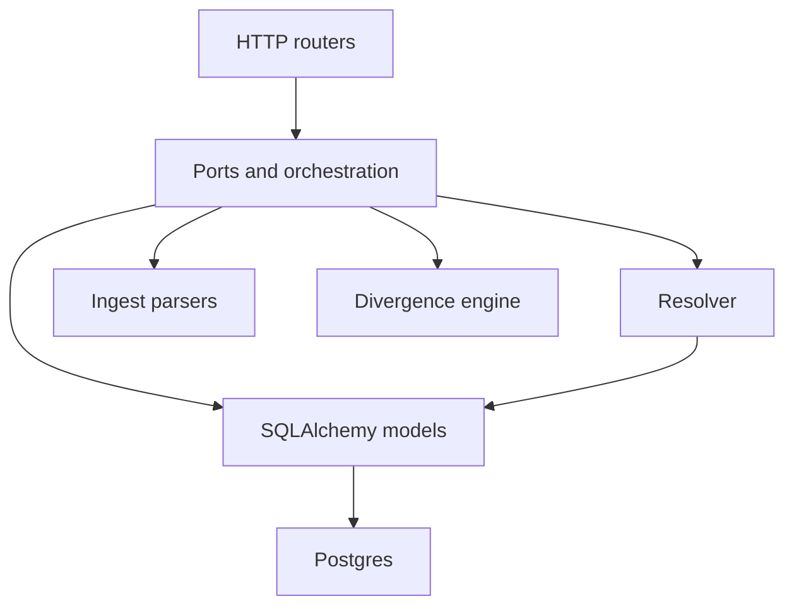

# Architecture

One Python process serves the HTTP API and, when the UI has been built, the React app. The glossary for the rows and the words below is [domain-model.md](domain-model.md). Route shapes are in [api.md](api.md).

## Process

`create_app` in `frvt/api/main.py` builds the FastAPI app. Uvicorn loads `frvt.api.main:app`. The app registers `BasicAuthMiddleware`, the exception handlers from `register_exception_handlers`, and the routers under `frvt/api/routers` (health, translations, spans, versifications, associations, ingest, resolve, navigation, indexes, divergence).

`_WEB_DIST` is `frvt/web/dist`. When that directory exists, `SpaStaticFiles` from `frvt/api/static.py` is mounted at `/` after the routers, so `/api/...` is not shadowed. The static app falls back to `index.html` for an extensionless path. When `dist` is missing, the mount is skipped and `/` is not the UI.

## Layering

Routers stay thin. They call ports (`frvt/api/ports`), scheme selection, the `resolve_*` modules, indexing, and the divergence orchestration under `frvt/api/divergence`. Those call three libraries and the ORM:

- `frvt/resolver` maps coordinates. It does not read verse text. It does import logging, and `build_chain` in `frvt/resolver/chains.py` loads `mapping_record` rows. Describe it as "no HTTP and no verse text", not as a package with zero `frvt.api` imports.
- `frvt/ingest` parses uploads and does not write the database. `frvt/api/ports/ingest_port.py` is the writer.
- `frvt/divergence` compares two numbering schemes. It imports logging from `frvt.api.logging_config` (`frvt/divergence/report.py`) and does not import FastAPI or SQLAlchemy. `frvt/api/divergence` loads inputs, caches the report, and runs the compute threads.

## Startup

The lifespan in `create_app` does three things, in order:

1. When `run_startup_seed` is true, it opens a session, calls `seed_canonical` in `frvt/api/bootstrap.py`, and commits. A failure rolls back and is logged at error.
2. It starts the `DivergenceRunner` stored on `app.state`.
3. When `run_index_worker` is true and `settings.index_worker_enabled` is true, it starts an `IndexWorker`. The worker's ready callback calls `schedule_precompute`. That callback logs and swallows failures so a comparison problem does not fail the index build. `divergence_precompute_enabled` false skips the schedule.

Shutdown stops the runner and the worker. Tests pass `run_startup_seed=False` and `run_index_worker=False` so a background thread cannot see rows that a test will roll back. The lifespan itself is omitted when both flags are off and the index worker setting is off.

`seed_canonical` is idempotent. It loads the packaged canonical numbering spaces. The names and the null base are in [domain-model.md](domain-model.md#anchor).

## Sessions, config, logging, errors, auth

`get_session` in `frvt/api/db.py` yields a request-scoped session, commits on success, rolls back on error, and always closes. The engine is process-wide, created lazily, with `pool_pre_ping`. `Settings.database_url` is a Postgres URL (`postgresql+psycopg2`). `DATABASE_URL` overrides the `POSTGRES_*` pieces. `get_settings` in `frvt/api/config.py` reads the environment and `.env`.

`configure_logging` in `frvt/api/logging_config.py` configures the `frvt` logger tree once. `TRACE` is level 5, below `DEBUG`, for getter-style diagnostics. Public operations log at `DEBUG`. Caught failures log at `ERROR`. The default level name is `DEBUG`.

`ErrorBody` in `frvt/api/errors.py` is `detail`, `code`, and optional `errors`. `code` is the `ErrorCode` literal: `bad_request`, `unauthorized`, `not_found`, `conflict`, `payload_too_large`, `validation_failed`, `too_many_requests`, `internal_error`, `database_unavailable`. Handlers normalize `HTTPException`, validation errors, and unexpected 500s onto that envelope. The live status mapping is in [api.md](api.md).

A few settings change process behavior rather than a single route. `LOG_LEVEL` is the logger level. `MAX_UPLOAD_BYTES` defaults to 52428800. `INDEX_WORKER_ENABLED` defaults to true. `DIVERGENCE_RUNNER_THREADS` defaults to 1. `DIVERGENCE_STALE_SECONDS` defaults to 120 and is how long a `running` report may go without a heartbeat before `claim_report` will schedule it again. Route-level effects of these settings are listed in [api.md](api.md). The names here are the `Settings` fields in `frvt/api/config.py`.

`BasicAuthMiddleware` in `frvt/api/auth.py` is the shared gate for the API, the UI, and `/docs`. The module calls it a POC access gate: one username and password, compared with `secrets.compare_digest`. `path_matches_public_prefix` opts a path out. A prefix of `/` matches every path. Any other prefix matches the path exactly or as a directory prefix, so `/doc` does not match `/docs`. Failed attempts go through `FailedAuthLimiter` in `frvt/api/failed_auth_limiter.py`. Past the limit the response is 429 with `too_many_requests`. Default credentials log a warning at startup (`warn_if_default_basic_credentials`).

## Priorities and tradeoffs

These are the constraints the code states, not a wishlist.

- **Shared gate.** Auth is one Basic pair for the whole process (`frvt/api/auth.py`). There are no per-user accounts.
- **Postgres.** Models use JSONB, partial indexes, and `ON DELETE` actions. The test URL is `postgresql+psycopg2`. Do not assume another dialect.
- **Workers in-process.** `IndexWorker` and `DivergenceRunner` are threads in the API process, started from the lifespan in `frvt/api/main.py`. They are not separate services.
- **A stale index is slow, not wrong.** `TranslationIndex` says mapping rows are consumed only when `status` is `ready`. Every other state resolves live. See [domain-model.md](domain-model.md#index).
- **Coordinates and text stay apart.** The resolver never reads `verse_span.content`. The port attaches stored spans after the coordinate result.
- **Source is the stored document.** `versification_source` holds the verbatim file. `ingredient` is derived. See [domain-model.md](domain-model.md#ingredient-and-source).
- **Bulk inserts skip the ORM unit of work.** `persist_project` in `frvt/api/ports/ingest_port.py` and the canonical mapping load in `frvt/api/bootstrap.py` use Core `executemany` for tens of thousands of write-only rows.
- **Modules stay readable.** Jump handling, batch resolve, and indexing are split across modules so a single file does not absorb every concern.

## Tests

Backend tests live in `frvt/tests`. `frvt/tests/conftest.py` provides:

- `engine`, session-scoped, creates the database if needed and runs Alembic.
- `db_session`, a connection with an outer transaction and a nested savepoint, always rolled back.
- `canonical_seed`, session-scoped, truncates and commits `seed_canonical` once.
- `seeded_session`, a rollback session that can see those committed anchors.
- `api_client`, a `TestClient` around `create_app(run_startup_seed=False, run_index_worker=False)` with `get_session` overridden.
- `auth_headers`, the Basic header from settings.

Under pytest-xdist, `_test_database_url` suffixes the database name with `PYTEST_XDIST_WORKER`, so workers do not share rows or locks. The UI suite is documented in `frvt/web/README.md`.

## Where to change things

| Change | Start here |
| --- | --- |
| A new HTTP route | The matching module in `frvt/api/routers`, then the port or helper it calls |
| How a verse maps | `resolve` in `frvt/resolver/resolve.py`, then `frvt/api/ports/resolver_port.py` if the change is about stored spans |
| An upload rule | `frvt/ingest` for the parse, `frvt/api/ports/ingest_port.py` for the transaction |
| When an index rebuilds | `frvt/api/indexing/invalidation.py` and `frvt/api/indexing/worker.py` |
| A divergence type | `classify` in `frvt/divergence/classify.py`, then `TYPE_IDS` in `frvt/divergence/taxonomy.py` |
| A dialog mark | `frvt/web/src/divergence`, after the wire row in `frvt/divergence/report.py` |
| The side-by-side viewer | `ViewerSession` in `frvt/web/src/viewer/ViewerSession.tsx` |

Keep a router free of SQL. Keep `frvt/ingest` and `frvt/divergence` free of sessions. The exception already in the tree is logging: both libraries call `get_logger` from `frvt/api/logging_config.py`, and `frvt/resolver/chains.py` loads mapping rows. Do not add a second exception because a call site is convenient. Pass the session in from the port, or return a value the port can write.

`failed_auth_limiter.py` keeps the failure window in the process. Restarting the process clears it. `TRUST_PROXY_HEADERS` must stay false unless a trusted proxy appends `X-Forwarded-For`. The limiter then uses the rightmost hop. Those two facts are the operational half of the gate described above. The HTTP details stay in [api.md](api.md).

`get_session` is the dependency routers use. A port that needs a session takes it as an argument. The lifespan seed uses `get_session_factory` instead, because it runs outside a request. The index worker and the divergence runner do the same. A test that overrides `get_session` does not override the factory. That is why `api_client` disables the index worker: the worker's factory would see committed canonical rows and also any row a test had committed, which the rollback fixture is not prepared to share. `canonical_seed` commits on purpose, once per session, so the rollback sessions can see the anchors without reseeding.

`reset_engine` disposes the cached engine. Tests call it when they point `DATABASE_URL` at another database. Application code does not. The engine uses `pool_pre_ping` so a connection that Postgres closed is not handed to the next request.

Logging format is time, level, logger name, and message, on stderr, under the `frvt` tree. `TRACE` is attached as `Logger.trace`. Getter-style helpers use it. A public operation uses `DEBUG` and includes the ids a reader needs to find the row. A caught exception uses `ERROR` and `exc_info`. Do not log a secret. The Basic password is compared and not written. Default credentials produce one warning at startup and the warning names that the defaults are in use, which is the signal to change them before the process is reachable.

## What `create_app` wires

`create_app` in `frvt/api/main.py` configures logging, warns on default Basic credentials, then builds the FastAPI app. `register_exception_handlers` runs before the middleware. `BasicAuthMiddleware` is the only middleware added here. Routers are included in this order: health, translations, spans, versifications, associations, ingest, resolve, navigation, indexes, divergence. `app.state.divergence_runner` is a `DivergenceRunner` sized by `DIVERGENCE_RUNNER_THREADS`. The static mount is last, and only when `frvt/web/dist` is a directory, so `/api` is never shadowed by `SpaStaticFiles`.

The lifespan runs when `run_startup_seed` is true or when both `run_index_worker` and `INDEX_WORKER_ENABLED` are true. It seeds, starts the runner, then starts `IndexWorker` when that second condition holds. Shutdown stops the runner and, if it was started, the worker. Tests that pass `run_startup_seed=False` and `run_index_worker=False` build an app with no lifespan. The runner object still exists on `app.state` and is not started. That is why an API test does not compute divergence reports unless it starts the runner itself.

`clock` is forwarded only to the failed-auth limiter. Production calls `create_app()` with the defaults. Uvicorn loads `frvt.api.main:app`.

Each router owns one resource and delegates. `frvt/api/routers/health.py` is the process and database check. `translations.py`, `spans.py`, `versifications.py`, and `associations.py` are the catalog. `ingest.py` accepts the zip and the standalone versification file. `resolve.py` is the single-reference, chapter, range, and batch routes. `navigation.py` is the book list, the delta and misalignment pages, and the jump menu. `indexes.py` is the precompute queue. `divergence.py` is the report. None of them construct a SQLAlchemy engine. The port or the orchestration module they call is the next file to open.

`register_exception_handlers` maps framework errors onto `ErrorBody` before a router runs. A handler that raises `AppError` already carries `detail`, `code`, and optional field errors. An unexpected exception is logged and returned as 500 `internal_error`. Request-model failures are 422 `validation_failed`. The health route uses 503 `database_unavailable` when its database ping fails. Other routes do not translate a database error into that code. The status each code uses is in [api.md](api.md). Do not add a second envelope.

## Symbols

| Symbol | Contract |
| --- | --- |
| `create_app` | Logging, handlers, Basic middleware, routers, runner, optional static mount |
| `get_session` | Request session. Commit on success, rollback on failure, always close |
| `get_session_factory` | Sessions for the lifespan, the index worker, and the divergence runner |
| `configure_logging` | `frvt` logger tree, stderr, `TRACE` at level 5 |
| `ErrorBody` | `detail`, `code`, optional `errors` |
| `BasicAuthMiddleware` | One Basic pair for the API, the UI, and `/docs` |
| `path_matches_public_prefix` | Opt-out. `/` matches every path. `/doc` does not match `/docs` |
| `warn_if_default_basic_credentials` | Warning at startup. The password is not written |
| `seed_canonical` | Idempotent packaged anchors, `org` first |
| `SpaStaticFiles` | Built UI, with `index.html` for an extensionless 404 |
| `get_settings` | Environment and `.env`, cached for the process |
| `reset_engine` | Dispose the cached engine. Tests use it. Application code does not |
| `FailedAuthLimiter` | In-process window. Restart clears it |
| `client_ip_for_request` | Rightmost `X-Forwarded-For` hop only when the proxy headers are trusted |
| `IndexWorker` | Daemon thread. Started from the lifespan when enabled |
| `DivergenceRunner` | Priority queue of report ids. Interactive work sorts ahead of precompute |

A request that passes Basic auth reaches one router. The router calls a port or an orchestration function and passes the `get_session` session. The port does not open its own session. The index worker and the divergence runner do open their own sessions, from `get_session_factory`, because they are threads outside the request. Those sessions commit on their own. A request rollback does not undo a row the worker already committed.

## See also

- [resolver.md](resolver.md) maps a reference across schemes.
- [ingest.md](ingest.md) parses a zip or a versification file into rows.
- [indexing.md](indexing.md) precomputes resolve results.
- [divergence-engine.md](divergence-engine.md) compares two schemes.
- [web-ui.md](web-ui.md) is the viewer, the manage pages, and the dialog host.
