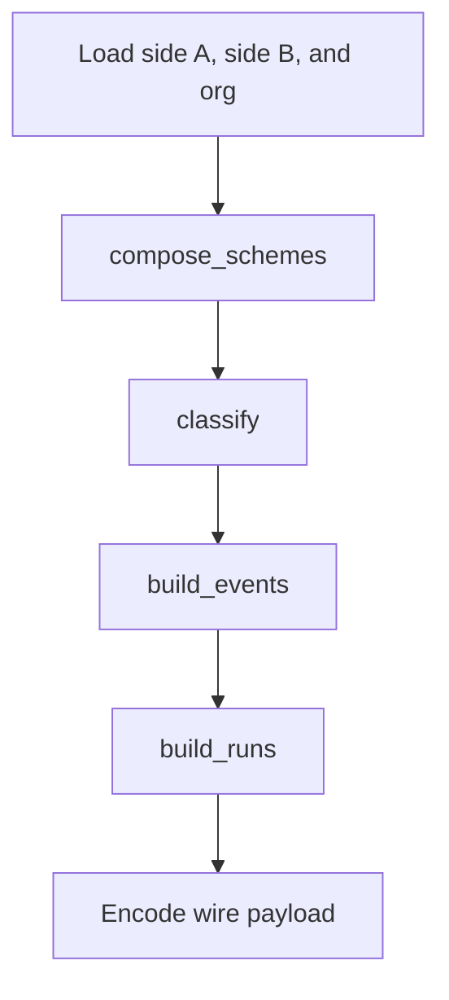

# Divergence engine

The engine compares two numbering schemes through org and emits a wire payload. Types and events are defined in [domain-model.md](domain-model.md#classification). [Bands](domain-model.md#band-and-run) are defined with runs. The cache sits in `frvt/api/divergence`. The dialog that draws the payload is a separate note.

## Pipeline

`build_comparison` in `frvt/divergence/report.py` takes side A, side B, and an org `Scheme` from `frvt/divergence/scheme.py`. Edges keep insertion order. Classification depends on that order, so `Scheme` does not sort mapping keys.

`compose_schemes` in `frvt/divergence/compose.py` unions verses that share an org verse. A connected component is one [divergence relation](domain-model.md#divergence-relation). Alternate book forms are split before classification.

`STAGES` in `frvt/api/divergence/registry.py` is `loading`, `composing`, `classifying`, `events`, `runs`, `encoding`. `build_comparison` advances the last five. `loading` is the API reading inputs before it calls the engine.

## Classification

`classify` in `frvt/divergence/classify.py` writes `type`, `rel`, `Ap`, and `Bp` on each relation. `Ap` and `Bp` are the verses that are not excluded. `rel` is a cardinality string such as `1:1` or `n:1`.

For each relation, in order:

- Both present-lists empty: `type` is `None`. That relation does not become an event.
- One present-list empty: `EXCLUDED` when that side had listed verses, otherwise `ONE_SIDED`.
- More than one book among the present verses: `CROSS_BOOK`.
- Same books but different chapter sets: `CHAPTER_MOVE`.
- One verse each: `None` when they are the same verse, `VERSE0_TITLE` when either verse number is 0, otherwise `RENUMBER`.
- The present lists are equal: `None`.
- The relation is flagged `segment`: `SEGMENT`.
- More verses on A than on B: `MERGE`. More on B: `SPLIT`. Otherwise `RENUMBER`.

`MERGE`, `SPLIT`, and `SEGMENT` gain the flag `approx` unless both schemes have multi-target `.vrs` data (`has_vrs`).

After that pass, each book is sorted by the A side. Verses whose B position is off the longest increasing subsequence become `ORDER_INVERSION`. That assignment replaces the type from the earlier pass.

The severity and layer for each type id are the table in [domain-model.md](domain-model.md#classification). `TYPE_IDS` is that table's order. The integer on an event is the index into `TYPE_IDS`.

## Events, runs, and bands

`build_events` collapses adjacent relations into one [event](domain-model.md#event). Families are `shift` (`RENUMBER`, `VERSE0_TITLE`), `move` (`CHAPTER_MOVE`, `CROSS_BOOK`), and `inv` (`ORDER_INVERSION`). Two simple 1:1 relations merge when they share a family, share `_delta` from A to B, and the A verses are adjacent. A `shift` also requires the same chapter. Two non-simple relations merge when they share type, cardinality, flags, and warning, and the A verses are adjacent. One-sided and excluded relations are collapsed by the same module after the both-sides pass. Bridges and segment-letter differences are added there too. `_fold_book_one_sided` replaces `ONE_SIDED` events for a book that exists on only one side when those events cover at least half of that book's verses (`covered / total >= 0.5`). The replacement is one `BOOK_ONE_SIDED` event spanning the book. Read `build_events` before changing a family: the grouping conditions are the contract. The wire row is a list, not an object. `report.py` builds it as type index, A span, org span, B span, count, cardinality, flags, and optional segment letters.

`build_runs` merges contiguous 1:1 relations with a constant offset into [bands](domain-model.md#band-and-run). A row with no deviance type uses `SAME`. `build_comparison` replaces the type name with a type index, or `-1` when the name is not in the catalog.

Warnings in the payload are capped at 200 per side. `aCount` and `bCount` stay the full lengths.

Top-level keys written by `build_comparison`:

| Key | Role |
| --- | --- |
| `types` | `{id, severity, layer}` in `TYPE_IDS` order |
| `comparisons` | One object: labels, `mode`, books, `events`, `runs`, `warnings` |
| `org` | Org chapter maxima |
| `catalog` | `[code, name, section]` rows |
| `eventNotes` | `[eventIndex, side, code, detail]` |
| `sides` | Side label, fidelity, multi-target flag, text-facts flag |
| `engineVersion` | `ENGINE_VERSION` |

`compute_report` overwrites `sides`, sets `computedAt`, and sets `engineVersion` again before storing the JSON.

## Schemes and texts

`build_comparison` defaults `mode` to `schemes`. `compute_report` in `frvt/api/divergence/compute.py` passes `texts` when either side has text facts, and `schemes` otherwise.

`apply_text_facts` in `frvt/divergence/text_facts.py` overlays stored verse coordinates on a scheme. A side with no spans is left unchanged. Books the text does not contain drop out of the maxima. Verses the text skips become exclusions tagged as text omissions. The overlay does not read scripture content. `TextSpan` is book, chapter, and verse only.

## Cache

A report is one `divergence_report` row keyed by the four ids in [domain-model.md](domain-model.md#tables). `status` is `pending`, `running`, `ready`, or `failed`. `payload` is text.

`report_fingerprint` hashes `engine={ENGINE_VERSION}`, each side's index fingerprint, and each chain hop's `versification_source.sha256`. A missing source contributes the literal `legacy`, so attaching a file later changes the digest.

`claim_report` inserts or locks the row. A `ready` row whose fingerprint still matches is returned without scheduling. A `running` row with a fresh heartbeat and the same fingerprint is left alone. A matching `pending` row is scheduled again. The runner drops an id that is already queued. Anything else is reset to `pending` and scheduled.

`DivergenceRunner` in `frvt/api/divergence/runner.py` is a priority queue. `PRIORITY_INTERACTIVE` is 0. `PRIORITY_PRECOMPUTE` is 1. Dialog requests use 0 so a precompute backlog does not sit in front of them.

`schedule_precompute` queues both directions against every other ready index. A failure is written onto the index as a build note and does not change the index status. The call runs on the divergence runner, not inside `build_index`.

## Scheme document

`Scheme` in `frvt/divergence/scheme.py` holds maxima (`maxVerses`), exclusions, bridges (`mergedVerses`), segments (`partialVerses`), and the edges to org (`mappedVerses`). A missing edge is identity: the verse maps to itself. Equal-length ranges zip verse by verse. A one-to-many or many-to-one edge is the cartesian product. An unequal multi-verse range aligns by position and is flagged approximate. `load_scheme` is the constructor `build_comparison` expects. `vrs_pairs` is the optional multi-target supplement parsed from a `.vrs` document.

`compose_schemes` also canonicalizes some 1:1 org edges before the union-find, so two schemes that name the same org verse land in one component. The disjoint-set is local to that call. Nodes are `(side, verse)` plus `("O", org_verse)`.

Run rows from `build_runs` have seven columns: A span, org span, B span, type name, flag letters, then 1 or 0 when A has excluded verses, then 1 or 0 when B does. Flag letters are `a` (`approx`), `w` (`warn`), `v` (`vrs`), and `s` (`segment`). `build_comparison` replaces the type name with an index into `TYPE_IDS`, or `-1` when the name is `SAME` or otherwise absent from the catalog.

`WARNING_DETAILS` in `frvt/divergence/report.py` is the sentence for `unequal_ranges`, `identity_collision`, and `no_org_anchor`. `eventNotes` copies those sentences. A code with no sentence is copied through as its own detail.

`compute_report` checks `same_fingerprint` before `mark_ready`. If the inputs changed while the thread was running, the payload is discarded and the row is left for the next claim. An exception calls `mark_failed` only when the fingerprint still matches. A stale failure does not overwrite a newer claim. The payload is `json.dumps` with compact separators, which is why the column is text: a JSONB write would be free to reorder keys, and the dialog reads the bytes back unchanged.

## Wire rows

`build_comparison` sorts events by the anchor side's book and first coordinate (`book_order` on `event["a"]`, or `event["b"]` when A is absent). Each encoded event is a list:

| Index | Value |
| --- | --- |
| 0 | `TYPE_IDS.index` of the type |
| 1 | A span |
| 2 | Org span |
| 3 | B span |
| 4 | `n`, the verse count |
| 5 | Cardinality string |
| 6 | Flags |

A `SEGMENT` event appends `segA` and `segB` when `segA` is present. Other types stop at flags. Run rows keep the seven columns described above, with the type name replaced by an index or `-1`.

`classify` runs inside `compose_schemes`, before `build_comparison` advances the `classifying` stage. The stage list is still `composing`, `classifying`, `events`, `runs`, `encoding`. The names are the progress labels. The classify call itself sits in the compose step.

`_adjacent` treats the next verse in the same chapter, or verse 0 or 1 of the next chapter, as adjacent. `_delta` is the book plus the chapter and verse offset from the first present A verse to the first present B verse. `_flush_group` picks one type for a merged group, in this order when more than one is present: `ORDER_INVERSION`, `CROSS_BOOK`, `CHAPTER_MOVE`, `VERSE0_TITLE`, otherwise the first relation's type.

## Modules

| Module | Role |
| --- | --- |
| `frvt/divergence/scheme.py` | In-memory `Scheme` and `to_org` |
| `frvt/divergence/compose.py` | Union of verses that share an org verse, then `classify` |
| `frvt/divergence/classify.py` | Type, cardinality, and flags |
| `frvt/divergence/events.py` | Adjacent relations into events, then book-level one-sided fold |
| `frvt/divergence/runs.py` | Constant-offset 1:1 rows into bands |
| `frvt/divergence/report.py` | `load_scheme` and `build_comparison` |
| `frvt/divergence/text_facts.py` | Overlay stored verse coordinates |
| `frvt/divergence/refs.py` | Divergence span grammar, including an optional part letter |
| `frvt/divergence/taxonomy.py` | `TYPE_IDS`, severity, layer, `ENGINE_VERSION` |
| `frvt/divergence/vrs_reader.py` | `parse_vrs_pairs` for a companion `.vrs` |
| `frvt/divergence/catalog.py` | `CATALOG` rows and `book_order` |
| `frvt/api/divergence/compute.py` | Load inputs, call the engine, store the payload |
| `frvt/api/divergence/fingerprint.py` | `report_fingerprint` |
| `frvt/api/divergence/registry.py` | `claim_report`, stages, ready and failed marks |
| `frvt/api/divergence/runner.py` | Priority queue and worker threads |
| `frvt/api/divergence/precompute.py` | Queue both directions when an index becomes ready |
| `frvt/api/divergence/inputs.py` | The schemes and text facts a report reads |
| `frvt/api/divergence/keys.py` | `ReportKey`, the four ids |

`schedule_precompute` skips a row that is missing or not `ready`. For every other ready index it claims both directions, commits, and submits the id at `PRIORITY_PRECOMPUTE` when `claim_report` says to schedule. An exception rolls back, appends `divergence precompute failed:` plus the exception to `build_notes`, and commits that note. The index `status` is left as it was.

`load_side` in `frvt/api/divergence/inputs.py` loads one scheme and overlays text when the translation has spans. The two sides must share a root. A different root is 422 `validation_failed`. `load_org` loads that root with no text overlay and no `.vrs` supplement. `shared_root` is the lookup both calls use. `is_stalled` is true when a `running` row's heartbeat is older than `DIVERGENCE_STALE_SECONDS`. `mark_progress` records the stage and refreshes the heartbeat. `mark_ready` stores the payload. `mark_failed` records the error so a later POST can schedule the row again.

`span` in `frvt/divergence/refs.py` encodes a verse list as `[book, chapterStart, verseStart, chapterEnd, verseEnd]`, or `None` when the list is empty. A list that changes books keeps only the first verse. `parse` accepts an optional part letter on a mapping token and returns `None` when the token is not a reference. The resolver's `parse_ref` does not accept that letter inside the string.

`Progress.advance` records a stage and must not change the comparison. `build_comparison` calls it for `composing`, `classifying`, `events`, `runs`, and `encoding`. `loading` is set by the API before that call. `book_order` sorts unknown codes after the catalog. `split_alternates` breaks a component into same-book pairs before classification. `apply_text_facts` returns whether any span was present and leaves a side with no spans unchanged.
