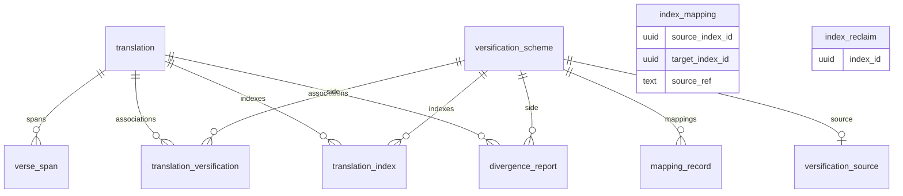

# Domain model

This is the glossary for the server, the resolver, the divergence engine, and the UI. Other documents link here instead of defining these words again. HTTP fields and status codes live in [api.md](api.md).

## Tables

A row in `translation` (`Translation` in `frvt/api/models/__init__.py`) is one Bible translation or one numbering-space anchor. The name is unique case-insensitively. `source_format` is `usx` or `usfm`. `text_direction` is `ltr` or `rtl`. `is_anchor` marks a numbering space rather than a scripture project. Deleting a translation cascades to its `verse_span` rows and its `translation_versification` rows.

A row in `verse_span` (`VerseSpan`) is one addressable unit of stored text: a whole verse, a Psalm title (`verse` 0), or a sub-verse part. `seq` is document order. `book` is a three-character USFM id. Coordinates `(translation_id, book, chapter, verse, part)` are unique, as is `(translation_id, seq)`. `verse_label` and `verse_range` hold combined USX milestones. `content` is the text the viewer shows.

A row in `versification_scheme` (`VersificationScheme`) is one named versification. `based_on_name` and `based_on_id` point at the numbering-space translation this scheme is defined against. Both are null for a root such as `org`. `based_on_id` uses `ON DELETE RESTRICT`. `canonical` marks a shipped scheme. `ingredient` is the derived Copenhagen JSON. Mapping rows and the source document hang off this row.

A row in `translation_versification` (`TranslationVersification`) associates one translation with one scheme. The pair is unique. At most one row per translation has `preferred` true. Deleting the translation cascades. Deleting the scheme is restricted while an association exists.

A row in `mapping_record` (`MappingRecord`) is one flattened ingredient relationship: `source_ref`, optional `base_ref`, optional `part`, a stored [resolver relation](#resolver-relation), and `ordinal`. Rows cascade with the scheme. `complex` is never stored.

A row in `translation_index` (`TranslationIndex`) is one translation plus one scheme whose pairwise mappings are precomputed. The pair is unique. `status` is one of `pending`, `building`, `ready`, `failed`, or `cancelled`. Mapping rows are read only when `status` is `ready`. Deleting the translation or the scheme cascades to the index row.

A row in `index_mapping` (`IndexMapping`) is one precomputed resolve result for an ordered pair of indexes and a `BOOK C:V` key. The primary key is `(source_index_id, target_index_id, source_ref)`. `payload` is JSON. There is no foreign key to `translation_index`. A delete orphans the rows, and `index_reclaim` tells the worker which ids to clean up in chunks. Readers only look up indexes that still exist and are `ready`, so orphans are unreachable.

A row in `index_reclaim` (`IndexReclaim`) is one deleted index id plus `requested_at`. It has no foreign key either.

A row in `versification_source` (`VersificationSource` in `frvt/api/models/divergence.py`) is the verbatim document for one scheme. The primary key is `scheme_id`, and the row cascades with the scheme. `format` is `copenhagen_json` or `vrs`. `document_text` keeps the original part letters. `companion_vrs_text` is an optional multi-target supplement. `sha256` covers the document and the companion.

A row in `divergence_report` (`DivergenceReport`) is one cached comparison of two translation-and-scheme sides. The four ids are unique together. Each foreign key cascades. `status` is `pending`, `running`, `ready`, or `failed`. `payload` is text, so key order survives a read. `fingerprint` is the digest of the inputs. `stage` and `heartbeat_at` are progress fields on the compute loop. The column comments in `frvt/api/models/divergence.py` name each one.

`index_mapping` is drawn below as an entity with no relationship line. A line would claim a foreign key the table does not have.

## Terms

### Anchor

An anchor is a `Translation` with `is_anchor` true. It is a numbering space, not a scripture project, and listings omit it. The shipped names are `org`, `eng`, `lxx`, `rso`, `rsc`, and `vul` (`CANONICAL_NAMES` in `frvt/resources/__init__.py`). `org` is the null base: its scheme has no `based_on_id`. The other shipped schemes are based on `org`.

### Scheme

A scheme is a `VersificationScheme` row: a name, a `based_on_id` link, a derived `ingredient`, and the `mapping_record` rows flattened from that ingredient. The divergence engine uses a different type with the same English word. See [Same word, different meaning](#same-word-different-meaning).

### Ingredient and source

The ingredient is the JSON on `versification_scheme.ingredient`. It is derived: normalized, and for a project upload augmented with milestone splits. The source is the `versification_source` row, the verbatim upload or the packaged file. The module docstring in `frvt/api/models/divergence.py` calls the source the system of record and the ingredient a derived view. The resolver reads mapping rows, not the source. Readers that need original part letters or multi-target lines load the source.

### Association

An association is a `translation_versification` row. `preferred` selects the scheme used when a caller does not name one. A partial unique index allows one preferred row per translation.

### Chain and hop

A hop is one step toward a base numbering (`Hop` in `frvt/resolver/types.py`): the scheme id, the `based_on_id` reached after the step, and that scheme's mapping rows. `build_chain` in `frvt/resolver/chains.py` walks preferred-scheme hops from a starting scheme to a root. Each hop's mappings are the `mapping_record` rows for that scheme, loaded by `load_mapping_views`. A cycle raises `LookupError`. `nearest_shared_translation` walks the numbering-space translation ids on both chains and returns the nearest one they share, or raises `LookupError` when they never meet.

### Verse reference

A verse reference is a Copenhagen BCV string: `BOOK C:V`, or a same-chapter range `BOOK C:V-V`. `parse_ref` in `frvt/resolver/parse_ref.py` rejects a part letter embedded in the string and rejects a cross-chapter range. Parts travel in a separate field. An index key is a single verse, `BOOK C:V`, produced for `index_mapping.source_ref`.

`GEN 1:1` is one verse. `GEN 1:1-3` is three verses in chapter 1. `GEN 1:1a` is rejected. `GEN 1:1-2:1` is rejected because the range leaves the chapter. `PSA 3:0` is a legal verse number: `verse` 0 is the Psalm title on a `verse_span`, and `VERSE0_TITLE` is the divergence type when one side uses that number and the other does not. The book code is three characters from the USFM set. The divergence parser in `frvt/divergence/refs.py` accepts an optional part letter on its own tokens. The resolver parser does not. Keep those two grammars apart when a string crosses the boundary.

### Span

In the database, a span is a `VerseSpan` row: stored text at one coordinate, including a title or a part. In the divergence engine, a span is a five-field list or `None`, produced by `span` in `frvt/divergence/refs.py`: `[book, chapter1, verse1, chapter2, verse2]`. An empty verse list encodes as `None`. A list that changes books keeps only the first verse.

### Index

An index is a `translation_index` row plus the `index_mapping` rows built for it. `status` moves through `pending`, `building`, `ready`, `failed`, and `cancelled` (`INDEX_STATUSES` in `frvt/api/models/__init__.py`). Only `ready` is safe to read. Every other state resolves live, so a partial or stale index is slow rather than wrong. `scheme_explicit` false means the row tracks the translation's preferred scheme instead of a pinned scheme id.

### Coupled scheme

`coupled_preferred_scheme_id` in `frvt/api/coupled_scheme_delete.py` returns the preferred scheme to delete with a translation. The scheme qualifies only when it is that translation's preferred association, its name matches the translation name case-insensitively, and no other translation is associated with it.

### Resolver relation

A resolver relation is a `RelationType` value on a mapping row or on a resolve result. The stored set, in `RelationType` in `frvt/api/models/__init__.py`, is `one_to_one`, `shift`, `renumber`, `split`, `merge`, `exclude`, and `partial`. `complex` is omitted from that enum so the database cannot persist it. The wire enum in `frvt/api/schemas/__init__.py` adds `complex` and `range`. Both exist only at resolve time. `partial` rows are the ones that carry a `part`. An exclusion has a null `base_ref`.

### Divergence relation

A divergence relation is one connected component after `frvt/divergence/compose.py` links each side's verses to the org verses they map to. The component has verse lists for sides A, org, and B. Alternate book forms are split, then the component is classified. This is not a `RelationType` value. The word "relation" is compared in the table below.

### Event

An event is a classified divergence the viewer can draw. `frvt/divergence/events.py` collapses adjacent relations that share a family and a constant chapter/verse offset into one event. Adjacent means the next verse in the same book, including the first verse of the next chapter. The wire form stores a type as an integer index into `TYPE_IDS`, not as a second copy of the type name. `TYPE_IDS` is `tuple(SEVERITY)` in `frvt/divergence/taxonomy.py`. That order is the integer. Reordering it changes every stored payload.

### Classification

Classification assigns the type, the cardinality, and the flags on a divergence relation. The type catalog, severity, and layer live in `SEVERITY` and `LAYER` in `frvt/divergence/taxonomy.py`. Severity 1 is a small numbering quirk. Severity 5 is a whole book on one side. The four layers are `scheme`, `segment`, `text`, and `canon`.

| Type id | Severity | Layer |
| --- | --- | --- |
| `VERSE0_TITLE` | 1 | scheme |
| `BRIDGE` | 1 | text |
| `RENUMBER` | 2 | scheme |
| `MERGE` | 3 | scheme |
| `SPLIT` | 3 | scheme |
| `SEGMENT` | 3 | segment |
| `CHAPTER_MOVE` | 4 | scheme |
| `ORDER_INVERSION` | 4 | scheme |
| `CROSS_BOOK` | 4 | scheme |
| `EXCLUDED` | 4 | text |
| `ONE_SIDED` | 4 | scheme |
| `BOOK_ONE_SIDED` | 5 | canon |

`ENGINE_VERSION` in the same module is `"1"`. Bump it when the payload shape or the classification changes. The frontend copy of `TYPE_IDS` must stay in the same order.

### Ladder

The ladder is the three-axis strip in `frvt/web/src/divergence/Ladder.tsx`. The axes are side A, org, and side B. Chapter ticks mark chapter starts. A one-sided stretch is drawn as a block. The marks between the axes are [ribbons](#ribbon).

### Band and run

A run is one ladder row: contiguous 1:1 divergence relations that share a type and a constant chapter/verse offset. `frvt/divergence/runs.py` merges those relations into bands. `SAME` is the type used when the row has no deviance type, including when the viewer hides the row's layer and still draws the band.

### Ribbon

A ribbon is a band drawn on the ladder, or a move drawn on the radial chart. The radial chart is `RadialView` in `frvt/web/src/divergence/RadialView.tsx`. It draws chapter moves and order inversions as ribbons between books. The ladder ribbons are the book-detail form of the same run rows. Both use the run key from `runKey` in `frvt/web/src/divergence/model/detail.ts`, so one selection lights the same run in the ladder, the dot plot, and the event table. The dot plot uses the same run identity (`DotSegment.key` in `frvt/web/src/divergence/model/dotPlot.ts`) so a click on a stroke, a ribbon, or a table row selects one run.

## Same word, different meaning

| Word | Meaning A | Meaning B |
| --- | --- | --- |
| Relation | Stored or resolve-time `RelationType` (`frvt/api/models/__init__.py`, `frvt/api/schemas/__init__.py`) | A connected A–org–B component inside `frvt/divergence/compose.py` |
| Span | `VerseSpan` row (`frvt/api/models/__init__.py`) | Five-field verse range encoded by `frvt/divergence/refs.py` |
| Scheme | `VersificationScheme` row | `Scheme` loaded by `frvt/divergence/scheme.py` |
| Segment | Event type and viewer layer `segment` | Hit-test geometry in `frvt/web/src/divergence/model/dotPlot.ts` |
| Band / ribbon | A band is the merged run produced by `frvt/divergence/runs.py` | A ribbon is that run drawn on the ladder or the radial chart |

Deleting a translation cascades to its spans, associations, indexes, and any divergence report that names it. Deleting a scheme is restricted while a `translation_versification` row still points at it, and cascades to mapping rows, the source row, indexes on that scheme, and divergence reports that name it. `index_mapping` does not participate in those cascades. The reclaim queue does.

The five rows above are the only definitions of those words. Other notes link here. "Rung" and "lane" are not names in the model or the viewer. A ladder row is a run. A drawn mark is a ribbon.

`complex` and `range` appear on a resolve result and are absent from `RelationType` on `MappingRecord`. A query that filters mapping rows by those two names matches nothing. The wire event type is an integer, not a second copy of the type id string. Both facts are the ones a migration or a client change trips over first.

A divergence span is `[book, chapterStart, verseStart, chapterEnd, verseEnd]` (`span` in `frvt/divergence/refs.py`). The end chapter may differ from the start chapter. A resolver reference may not: `parse_ref` rejects a range that leaves the chapter.
