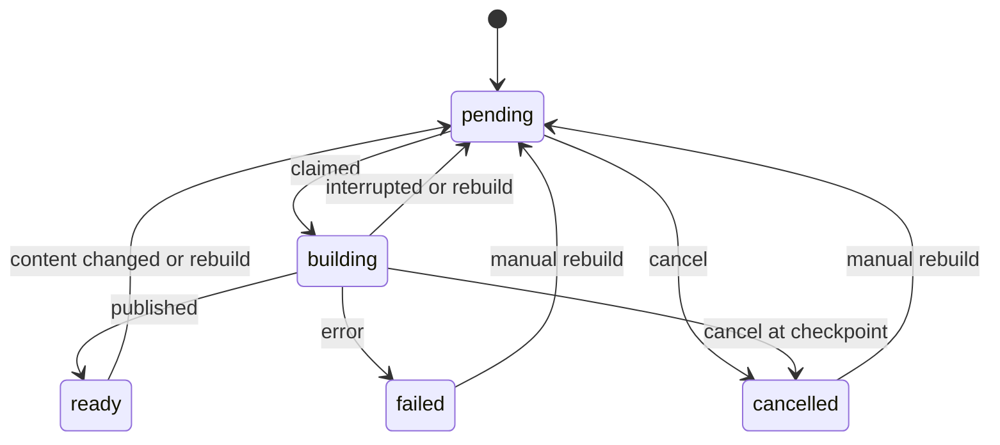

# Indexing

An index precomputes [resolve](resolver.md) results for one translation and one scheme against every other ready index. The row shapes are in [domain-model.md](domain-model.md#index). Creating and reading indexes over HTTP is specified in [api.md](api.md).

## What an index stores

A `translation_index` row is the operator's configuration and the queue entry. `index_mapping` stores one `ResolveResult` payload per `(source_index_id, target_index_id, source_ref)`. `index_key` in `frvt/api/indexing/keys.py` produces that `source_ref`. It returns `None` for a multi-verse range or an unparseable string, and those requests resolve live.

`IndexMapping` has no foreign key to `translation_index`. Deletes orphan the mapping rows. `index_reclaim` records the deleted index id, and `delete_mapping_chunk` in `frvt/api/indexing/registry.py` removes them in chunks.

`index_fingerprint` in `frvt/api/indexing/fingerprint.py` is a SHA-256 of newline-joined parts. The parts start with `translation={id}`, then `updated_at` (or `missing` when the translation row is gone) and `spans={count}`, then one group per scheme on the resolve chain from `build_chain`. A change to an intermediate scheme changes results even when the endpoint's own row does not, so the digest is how the worker notices. A `LookupError` from the chain walk becomes `AppError` 422 `validation_failed`. The builder records that as a failed build. The digest is hex. It is not a signature of the mapping payloads themselves. Two indexes with the same inputs and different stored payloads still share a fingerprint until a span count, a modification time, or a mapping count changes.

## Lifecycle

`INDEX_STATUSES` is `pending`, `building`, `ready`, `failed`, and `cancelled`.

`request_cancel` in `frvt/api/indexing/registry.py` cancels a `pending` row immediately. A `building` row stays `building` with `cancel_requested` set until the builder's next checkpoint. Any other status is 409 `conflict`. `request_rebuild` sets `status` to `pending`, reason `manual rebuild`, and clears `cancel_requested`, from every status including `failed` and `cancelled`.

`process_next_index` in `frvt/api/indexing/worker.py` claims a pending row. If `cancel_requested` is already set, the row becomes `cancelled` and is not built. Otherwise it becomes `building`. `build_index` publishes `ready` only while the row is still `building` and cancel is not requested. A missing scheme, or an exception from the build, sets `failed` and `last_error`. `recover_orphaned_builds` returns a `building` row to `pending` with reason `interrupted` after a crash, or to `cancelled` when cancel was already requested. `sweep_fingerprints` returns a `ready` row to `pending` with reason `content changed` when the digest no longer matches `content_fingerprint`.

## Build and reclaim

`build_index` in `frvt/api/indexing/builder.py` clears that index's old mapping rows, then materializes both directions against every other `ready` index, in chunks. A pair-level failure is written to `build_notes`. The index can still become `ready`, because the read path falls back per reference.

`IndexWorker` is a daemon thread named `frvt-index-worker`. `start` runs `recover_orphaned_builds` and `purge_orphan_mappings` once, commits, then polls. Each poll calls `try_build_lock`. A process that does not get the lock returns and waits `INDEX_WORKER_POLL_SECONDS`. A process that gets it drains one reclaim chunk (`INDEX_RECLAIM_CHUNK_SIZE`), commits, and runs `VACUUM (ANALYZE) index_mapping` when that chunk finished a queue row and deleted rows. It then calls `process_next_index` with `INDEX_BUILD_CHUNK_SIZE`. When that call does no work, and `INDEX_FINGERPRINT_SWEEP_SECONDS` has elapsed, it runs `sweep_fingerprints`. The defaults for those four settings are in [api.md](api.md). `stop` sets the event and joins for five seconds. An iteration that raises is logged and does not kill the thread.

`usage_summary` reports index counts, `index_mapping` row count, `pg_total_relation_size('index_mapping')`, reclaim-queue depth, `divergence_reports` (the count of `divergence_report` rows), and `divergence_bytes` (`SUM(octet_length(payload))` on that table).

## Read path

`find_ready_pair` in `frvt/api/indexing/lookup.py` returns an `IndexedPair` only when both indexes exist and are `ready`. Any other combination returns `None`. Callers then resolve live. That is the rule that makes a partial or stale index slow rather than wrong.

`load_payloads` reads the JSON for the keys in the request. `_resolve_entries` in `frvt/api/resolve_batch.py` uses a cached payload on a hit and `resolve_single_with_path` on a miss.

## Invalidation

`frvt/api/indexing/invalidation.py` is the only place that should move an index because a translation or a scheme changed.

`invalidate_for_translation` and `invalidate_for_scheme` call `_requeue`, which sets `status` to `pending`, stores the reason, and clears `cancel_requested`. They do not delete mapping rows. The next build clears those rows itself.

`drop_indexes_for_translation` and `drop_indexes_for_scheme` call `_drop`, which queues `index_reclaim` and deletes the index rows. The mapping rows stay until the worker drains the reclaim queue.

`retarget_default_indexes` runs when a translation's preferred scheme changes. It loads indexes with `scheme_explicit` false and points `scheme_id` at the scheme `batch_scheme_ref` would pick. A row that would collide with an index that already uses the new pair keeps its old `scheme_id` and appends a note to `build_notes`. A row that moves is requeued with reason `preferred versification changed`.

## Build steps

`process_next_index` claims the oldest pending row. `try_build_lock` in `frvt/api/indexing/worker.py` calls `pg_try_advisory_lock` with a key derived from the database OID (`build_lock_keys`). A process that does not get the lock leaves the row for whoever holds it. `release_build_lock` runs when the pass finishes.

Inside `build_index`, `_stop_if_not_current` abandons the build when the row is no longer the `building` request, and it applies a cancel that arrived mid-chunk. `_build_pair` writes one ordered direction. An unbuildable pair, such as two schemes with no shared ancestor, is skipped and recorded with `_append_note` rather than failing the index. `_upsert_chunk` inserts or replaces one page of `index_mapping` rows. `_increment_pairs` advances `pairs_completed` after both directions of one counterpart finish. `_finish` sets `ready` only when this build is still current.

`drain_reclaim` deletes one page for the oldest `index_reclaim` row and drops the queue row when the last mapping rows are gone. `purge_orphan_mappings` queues reclaim for mapping rows whose index id no longer exists, which covers a delete that missed the queue. `vacuum_index_mapping` runs `VACUUM (ANALYZE) index_mapping` on an autocommit connection after large deletes. It does not take the advisory lock.

`IndexUsage` in `frvt/api/indexing/registry.py` is the struct `usage_summary` returns: `total_indexes`, `ready_indexes`, `mapping_rows`, `mapping_bytes`, `reclaim_pending`, `divergence_reports`, and `divergence_bytes`. The HTTP shape of that struct is in [api.md](api.md).

## Modules

| Module | Role |
| --- | --- |
| `frvt/api/indexing/keys.py` | `index_key` for one `BOOK C:V` |
| `frvt/api/indexing/fingerprint.py` | `index_fingerprint` over the translation and the scheme chain |
| `frvt/api/indexing/registry.py` | Status updates, usage, and chunked mapping deletes |
| `frvt/api/indexing/builder.py` | `build_index` for one index against other ready indexes |
| `frvt/api/indexing/worker.py` | The daemon, the advisory lock, reclaim, and the fingerprint sweep |
| `frvt/api/indexing/lookup.py` | `find_ready_pair` and `load_payloads` |
| `frvt/api/indexing/invalidation.py` | Requeue or drop after a translation or scheme edit |

`build_lock_keys` derives a two-integer advisory-lock pair from the database OID (`_lock_key_from_oid` folds the OID into a signed int4). The lock is session-level. `release_build_lock` runs in a `finally` after the pass, including when the pass raised, as long as this session acquired it. Two API processes therefore do not build or reclaim at the same time against one database. Two pytest-xdist workers use different database names, so each has its own lock.

`process_next_index` claims the oldest `pending` row. A row that is already `cancel_requested` becomes `cancelled` without a build. `build_index` publishes `ready` only while that row is still the `building` request. `_stop_if_not_current` abandons a build whose row was replaced, and it applies a cancel that arrived between chunks. `_build_pair` writes one ordered direction. Two schemes with no shared ancestor are skipped: `_append_note` records the pair, and the index can still become `ready`. `_upsert_chunk` inserts or replaces one page of `index_mapping`. `_increment_pairs` advances `pairs_completed` after both directions of one counterpart. `_finish` sets `ready` and then the worker's `on_index_ready` callback runs. That callback is `schedule_precompute` from the lifespan. A failure there is logged on the index as a build note. It does not change `status`.

`drain_reclaim` takes the oldest `index_reclaim` row. If that index still exists, the queue row is deleted and the mapping rows are left for the builder. If the index is gone, one page of mapping rows is deleted, and the queue row is deleted only when both directions are empty. `purge_orphan_mappings` queues reclaim for mapping rows whose index id is gone, which covers a delete that missed the queue. `vacuum_index_mapping` uses a second, autocommit connection. A vacuum error is logged and does not fail the pass. The advisory lock stays on the worker session through reclaim, vacuum, and `process_next_index`, and `release_build_lock` runs in `finally`. Vacuum is outside the worker transaction because it needs autocommit. It is not outside the lock.

`find_ready_pair` is the only read API the batch resolver should use. A pair that is `pending`, `building`, `failed`, or `cancelled` on either side returns `None`, and `_resolve_entries` calls `resolve_single_with_path`. A hit returns the stored JSON. `index_key` returns `None` for a range, so a range request never consults `index_mapping`.

`invalidate_for_translation` and `invalidate_for_scheme` set `status` to `pending`, store the reason, and clear `cancel_requested`. They leave mapping rows in place until the next build deletes them. `drop_indexes_for_translation` and `drop_indexes_for_scheme` insert `index_reclaim` and delete the index rows. `retarget_default_indexes` moves indexes with `scheme_explicit` false onto the scheme `batch_scheme_ref` would pick. A move that would duplicate an existing `(translation_id, scheme_id)` keeps the old `scheme_id` and appends to `build_notes`. A move that fits is requeued with reason `preferred versification changed`.

## Creating and retargeting

`create_index` requires the translation. An explicit scheme id goes through `selected_scheme_ref` and sets `scheme_explicit` true. A missing scheme id goes through `batch_scheme_ref`, which falls back to canonical `org`, and sets `scheme_explicit` false. The new row is `pending` with reason `created`. A pair that already exists is 409 `conflict`, including a race that hits the unique constraint on flush.

`set_versification` always sets `scheme_explicit` true, `status` `pending`, and reason `versification changed`. It clears `cancel_requested`. Another index already on that pair is 409. `delete_index` queues `index_reclaim` and then deletes the index row. Mapping rows stay until `drain_reclaim` sees that the index is gone.

`list_indexes` orders by `created_at` and returns the page plus the unpaged total. `get_index` raises 404 `not_found` when the id is absent. Page limits are `clamp_page` in `frvt/api/scheme_select.py`. The HTTP query names are in [api.md](api.md).

## Symbols

| Symbol | Contract |
| --- | --- |
| `create_index` | Queue an index. 409 when that translation and scheme are already indexed |
| `set_versification` | Pin an explicit scheme and queue a rebuild. 409 on a duplicate pair |
| `delete_index` | Delete the index row and queue mapping cleanup |
| `request_rebuild` | `pending` from any status, reason `manual rebuild` |
| `request_cancel` | Immediate `cancelled` when `pending`. Checkpoint when `building`. Else 409 |
| `index_key` | `BOOK C:V`, or `None` for a range or an unparseable string |
| `find_ready_pair` | Both indexes `ready`, or `None` |
| `load_payloads` | Stored JSON by source ref. A malformed payload is omitted and logged |
| `index_fingerprint` | Digest of translation and chain inputs. 422 when the chain cannot be walked |
| `build_index` | Both directions against every other ready index |
| `process_next_index` | Claim the oldest pending row and build it |
| `recover_orphaned_builds` | `building` after a crash returns to `pending`, or `cancelled` if cancel was set |
| `schedule_precompute` | Both directions. A failure is a build note, not a status change |
| `usage_summary` | Index counts, mapping bytes, reclaim depth, report count, payload bytes |
| `delete_mapping_chunk` | One page of mapping rows in both directions |
| `queue_reclaim` | Record index ids for background delete. A second call for the same id is safe |
| `try_build_lock` | Session-level advisory lock, or false when another process holds it |
| `release_build_lock` | Drop that lock. The worker calls it in `finally` |
| `sweep_fingerprints` | `ready` rows whose digest no longer matches go back to `pending` |
| `purge_orphan_mappings` | Queue reclaim for mapping rows whose index id is gone |
| `vacuum_index_mapping` | `VACUUM (ANALYZE) index_mapping` on an autocommit connection |
| `IndexUsage` | The struct behind the usage route |
| `list_indexes` | A page ordered by `created_at`, plus the unpaged total |
| `get_index` | One row, or 404 `not_found` |
| `index_row_counts` | Outbound and inbound mapping counts for one index id |
| `build_lock_keys` | Two integers derived from the database OID |
| `PairBuild` | One ordered pair and the schemes used to resolve it |
| `ReclaimStep` | Rows deleted in the page, and whether the queue row was dropped |
| `IndexedPair` | The two ready index ids a batch read may use |
| `set_versification` | Pin `scheme_explicit` and requeue with reason `versification changed` |
| `create_index` | `pending` with reason `created`. Explicit scheme versus `batch_scheme_ref` |
| `delete_index` | Queue reclaim, then delete the index row |
| `invalidate_for_translation` | Matching indexes return to `pending`. Mapping rows stay until the next build |
| `invalidate_for_scheme` | Indexes on that scheme return to `pending` |
| `drop_indexes_for_translation` | Queue reclaim and delete every index of the translation |
| `drop_indexes_for_scheme` | Queue reclaim and delete every index of the scheme |
| `retarget_default_indexes` | Move `scheme_explicit` false onto the preferred scheme |
| `recover_orphaned_builds` | Startup. `building` returns to `pending`, or `cancelled` if cancel was already set |
| `process_next_index` | Oldest `pending` row. Returns whether a build ran |
| `on_index_ready` | The worker callback. The lifespan points it at `schedule_precompute` |
| `INDEX_STATUSES` | `pending`, `building`, `ready`, `failed`, `cancelled` |
| `content_fingerprint` | The digest stored on the row at the end of a successful build |
| `build_notes` | Pair failures and precompute failures. They do not change `status` |
| `pairs_completed` | Counter advanced after both directions of one counterpart |
| `scheme_explicit` | True when the operator named the scheme. False follows the preferred scheme |
| `cancel_requested` | Set on a `building` row. The builder applies it at the next checkpoint |
| `pending_reason` | Why the row is queued: `created`, `manual rebuild`, `content changed`, and others |
| `last_error` | Set when a build becomes `failed` |
