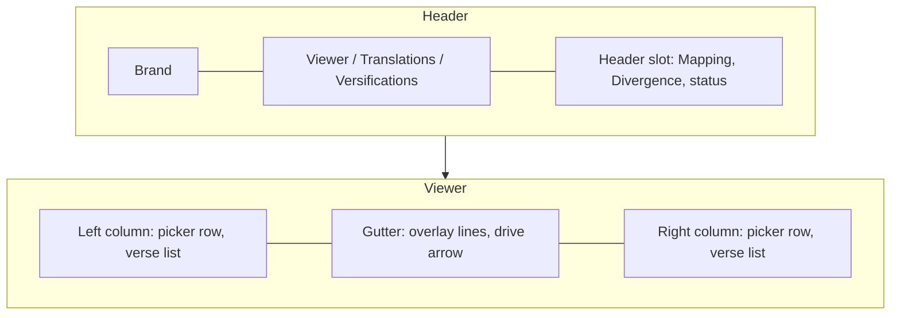

# UI style guide

How the FRVT UI should look and which control to reach for. The functional rules (what a click does, when a control is enabled, what the keyboard does) are in [ux-spec.md](ux-spec.md). The components and state behind them are in [web-ui.md](web-ui.md) and [divergence-dialog.md](divergence-dialog.md). Domain words such as relation, band, and ribbon are defined in [domain-model.md](domain-model.md).

This page names roles, not values. Colors, sizes, and fonts live in `frvt/web/src/styles/tokens.css` and the sheets beside it. The comparison charts also read colors from `frvt/web/src/divergence/model/colors.ts`, because SVG and canvas strokes there cannot always read a CSS variable. When a role on this page changes, change the token, not each rule that uses it.

## Principles

- **Scripture is the content.** Chrome is quiet, small, and muted so the verse text and the mapping lines carry the screen.
- **One accent means "this one".** The app accent marks focus, the active page, the source column, the highlighted verse, and the primary action. Inside the divergence dialog, the dialog accent marks what is selected. Neither is used for decoration or for data categories.
- **Color never separates categories alone.** A relation, a type, a flag, or a one-sided chapter also has a label, a dash pattern, a hatch, a shape, or a number. A reader who cannot tell two relation colors apart can still read the badge. Magnitudes such as chapter deviance may be color only, as long as the exact figures are one click away in the event list.
- **Dense and desktop.** The UI is a working tool on a wide screen. Spacing is tight, labels are short, and panes scroll on their own instead of the page.
- **Shared primitives, no component library.** Buttons, selects, modals, tables, and tips are a small set of shared styles and components. A new screen reuses them before adding a variant.

## Aesthetics

### Theme and surfaces

The theme is dark only. There is no light mode and no theme switch.

Surfaces stack in a few steps from the page background up: base, surface, raised, hover, and active. A panel that sits on another panel moves one step up. Hover uses the next step rather than a new color. Borders come in two weights. The normal border separates regions and outlines controls at rest. A control takes the strong border on hover. A soft shadow lifts elements that sit above the page: modals, menus, the error banner, and the empty-library panel.

### Color roles

| Role | Used for |
| --- | --- |
| Text | Verse text, headings, values |
| Muted text | Secondary copy, hints, status lines, inactive nav |
| Faint text | Field labels, table headers, verse numbers, placeholders |
| Accent | Focus ring, active nav item, source column edge, highlighted verse, primary button |
| Accent tint | Background of the highlighted verse and the primary button |
| Danger | Destructive buttons, error banners, error text, the `exclude` relation |
| Relation colors | One per [resolver relation](domain-model.md#resolver-relation) in the mapping overlay, plus a void fill |
| Comparison palette | Severity, deviance, hatch, cross-book, and dialog accent colors in the divergence dialog |

The relation colors and the comparison palette are separate families. The overlay never uses severity colors, and the dialog never uses relation colors.

The dialog accent is a warm color, distinct from the cool app accent. It marks the selected ribbon, dot-plot mark, or table row, the matrix cell under keyboard focus, the pressed tab or side tab, and data warnings. The app accent still draws the keyboard focus ring inside the dialog.

### Typography

- Interface text is a sans-serif UI face. Controls, labels, headings, tables, and chart text use it.
- Scripture text is a serif face at a slightly larger, fluid size with generous line height. It is set for reading, not scanning.
- Right-to-left scripture falls back to Naskh and Hebrew faces before the serif.
- Verse numbers are monospace with tabular figures so they align in the gutter. They always read left to right, even inside a right-to-left column.
- Field labels and table headers are small, uppercase, letter-spaced, and faint. They name a control without competing with its value.
- Headings are few. A page has one title. The dialog uses its title and the scope heading in the selection column.

### Density and spacing

Controls share one height and one corner radius so a row of mixed selects and buttons lines up. Verse rows are cards with a little vertical space between them. Tables are compact with a hairline between rows. The verse list is centered and capped to a readable measure, so a wide screen adds margin rather than longer lines.

### Motion

Motion is short and functional: hover and focus color changes, and smooth scrolling when a column brings a verse into view. Nothing animates on its own. When the operating system asks for reduced motion, transitions and smooth scrolling are removed. A new animation must respect that preference.

### Layering

Layers stack in a fixed order, bottom to top: verse content, mapping overlay, column controls, toolbar, banners, and modals. The overlay sits above the verses so lines are visible, and below the controls so it never covers a picker. A new floating element takes a slot in that order rather than an arbitrary depth. Tips inside the dialog are drawn on the document body so the dialog edge cannot clip them.

## Layout

The shell is a single header row with the brand, the three nav links, and a slot on the right. Only the viewer fills the slot.

The viewer is two equal columns with a gutter between them. Each column has its picker row on top and its own scrolling verse list below. The page body does not scroll. The minimum supported width is 1280 pixels. On very wide screens the picker controls grow, and the verse text stays capped.

A manage page is a heading row, with the page title on the left and the page's primary action on the right, then one table.

The divergence dialog is a large modal. The chart stage takes the remaining width on the left. A fixed-width selection column on the right holds the scope heading, the donut, the slice names beside it, the event list, and the scope actions. Tabs and layer toggles run across the top. Deviance severity is left-aligned with the swatch on each event, between the donut and the event list, when that list has events. Its squares match those swatches, and the list's divider is drawn above and below it. The donut and that scale stay in place while the event list scrolls. The other chart marks are centered at the top of the Overview and Radial chart areas. Slice names beside the donut, the ring headings, and the empty-slice sentence are 30% smaller than the column text. The pie is centered on the slice-name list. Each info control stays beside its slice name when that name wraps.

## Control patterns

### Buttons

| Variant | Use it for |
| --- | --- |
| Default | Ordinary actions and toggle buttons in a group |
| Primary | The one action a surface exists for: upload, associate, open the book detail |
| Danger | A destructive confirm, and the row action that opens one |
| Ghost | Cancel, close, and secondary row actions |
| Link-style | An inline action inside text or a list: Make preferred, Remove, a jump target |

Keep one primary button per surface. A destructive action always goes through a confirm modal whose confirm button is the danger variant. A toggle button in a group (dialog tabs, radial layout) shows its state as pressed, with a dialog-accent border, rather than as primary. A disabled control is dimmed and shows a not-allowed cursor. Where the reason is not obvious, say why. The Divergence button's tip is the example.

### Fields and selects

A label wraps its control, with the label text above in the faint uppercase style and an optional muted hint under it. Use a native select for a short fixed list: translation, versification, mapping mode, and the book picker in the dialog. Use the typeahead combobox when the list is long enough that typing helps: book, chapter, and verse in a column. The combobox filters on the option text and on its value, shows "No matches" when nothing fits, commits on Enter or a click, and restores the committed value on Escape or an outside click. A display-only marker on an option (such as the book marker below) is never part of the stored value.

An empty choice reads as a dash or as "Select…". A scheme picker's empty choice reads "Preferred (default)", because empty there means the preferred association.

### Checkboxes and sliders

A layer toggle is a checkbox whose label carries its count and percent, followed by an info control. A zero count reads "None" and disables the box. A slider shows its current value in its label, as the ladder zoom does.

### Tabs

Two tab forms exist. A row of pressed-state buttons switches the dialog's main view and the radial layout. Vertical side tabs, placed against the panel they control, switch the book detail between the event table and the dot plot. Only the selected panel is mounted, and only the selected tab is in the tab order.

### Tables

Manage tables have uppercase faint headers, compact rows, a visually hidden caption, and row actions in the last column. An empty manage table is replaced by one muted sentence that says what to do next. The dialog's event table is denser, with muted headers on a raised background. It keeps its header visible while the body scrolls, tints the selected row with the dialog accent, and makes each row focusable. A long translation name in a header is cut with an ellipsis, and resting on it shows the full name.

### Menus and popovers

The jump menu is the pattern: a button that toggles a floating panel, sections with a small heading and a count, link-style entries, a muted "Loading…" while the section loads, and "None" when it is empty. The panel closes on a choice, an outside press, or Escape.

### Tips

Three kinds, each with one job:

- **Legend flyout.** A small info icon or a summary that opens a short explanation on hover and on keyboard focus. Used for the book-marker legend and for a scheme row with several translations.
- **Info tip.** A click-to-open explanation behind an info icon, used throughout the dialog for layers, types, flags, the dot plot, and the comparison summary. Escape or an outside click closes only the tip.
- **Hover tip.** A delayed tip beside the pointer for content cut short on screen, such as a truncated translation name, and for donut slices.

Inside the dialog, do not use the browser's native title tooltip. It cannot be styled or delayed consistently and it duplicates the hover tip. Outside the dialog a native title is acceptable for a disabled control's reason.

### Modals

All modals share one shell: a darker header with the title and a ghost close button, a body of stacked labeled fields, and actions aligned right with Cancel (ghost) before the confirm. The confirm is primary, or danger for a delete or a remove. While the request runs, the confirm is disabled. The upload modals relabel it "Uploading…" and the delete confirm "Working…". It is also disabled until required input is present. Errors appear inside the modal, above the actions, and the modal stays open. The comparison dialog uses the same shell at full-screen size.

### Banners, errors, and status

- The error banner is a danger-tinted box at the top of the page or the dialog, announced to assistive technology. The dialog's banner carries a Retry button.
- The authentication banner, in the same treatment, replaces the viewer content when the session is no longer signed in.
- Inline error text is danger-colored text inside a modal or a menu panel. Field errors are a list with the field name in bold.
- A status line is muted, polite live text: in the header slot ("Resolving…", "Loading chapter mappings…"), and in the dialog while a comparison runs, with a progress bar when a total is known.

### Empty states and placeholders

An empty library shows a raised panel with a short title, one sentence on what is needed, a primary action, and a ghost action. A column with no translation shows one faint centered line. The dialog's selection column shows a one-line prompt until something is pinned. Each empty state names the next step.

## Application-specific guidelines

### Scripture columns

- Each verse is a row card: the number in a narrow gutter, the text beside it. Hover tints the card. The card is a focusable button.
- The highlighted verse gets an accent border, an accent tint, and a solid bar on its reading-start edge. In a right-to-left column the bar moves to the right edge.
- The source (drive) column is marked by an accent edge on its outer side. The follower has no edge.
- When both sides can resolve, a large muted arrow glyph sits over the gutter and points from the drive column to the follower. It is decorative and does not take clicks.
- A book in the book picker that has mapping differences carries a small dot after its name. An info icon beside the Book label explains the dot.

### Mapping overlay

The overlay draws over the gutter and both columns, and never intercepts a click. Each [resolver relation](domain-model.md#resolver-relation) has a color, a shape, and a label:

| Relation | Shape | Badge |
| --- | --- | --- |
| `one_to_one` | Direct line | None |
| `shift`, `renumber` | Direct line | Relation name |
| `split` | One source branching to several targets, source outline emphasized | `split` |
| `merge` | Several sources converging on one target, target outline emphasized | `merge` |
| `partial` | Dashed direct line | `part`, with the part letter when known |
| `exclude` | Dashed line ending at a void mark in the gutter | `absent` |
| `complex` | Graph of lines with one hub badge in the gutter | The two axis relations when known, otherwise `complex` |
| `range` | Graph of lines with one hub badge in the gutter | `range` |

Participating verses get a rounded outline in the relation color. Badges are small outlined labels in the same color. `split` and `merge` use a slightly heavier line than the others. In "All (dimmed)" mode every alignment in the drive chapter is drawn at reduced strength and the current one at full strength. Keep `one_to_one` unlabeled: it is the common case and labels would bury the exceptions.

### Divergence dialog

The dialog's marks follow these rules:

- **Same** is a neutral dark fill. A layer the reader hides is drawn as Same, not removed, so the shape of the book stays in place.
- **Chapter deviance** is a continuous green-to-red scale, from little to much. It colors matrix and radial cells.
- **Deviance severity** is a perceptually even sequential scale, darker for low severity. It colors event swatches and the chapter-move and order-inversion ribbons.
- **Count dot** is a page-colored dot centered on a matrix chapter or book square. Two to four deviances in that square use the smaller dot. Five or more use the larger. The mark line at the top of the chart draws both on a muted grey square, because the page-colored dot disappears on the neutral cell fill. The matrix still draws the dot on the deviance color.
- **Cross-book moves** have their own blue so they read apart from in-book moves.
- **Data warning** uses the dialog accent: a corner mark on a matrix cell, a thin band on the outer edge of a radial cell, an outline on a ladder ribbon, and a highlighted chip on an event.
- **Selection** also uses the dialog accent: a heavier stroke on the selected ribbon or dot-plot mark, a tint on the selected table row, and an outline on the matrix cell under keyboard focus.
- **Approximate** is a dashed outline.
- **Single-sided chapters** is the chart-key name for a diagonal hatch over the neutral fill. The hatch marks a chapter, or a whole book, that exists on one side only.

Ribbons ([domain-model.md](domain-model.md#ribbon)) grow wider with the number of verses they carry, up to a cap. Moves end in an arrowhead at the destination. Order inversions have no arrowhead. Ribbon items appear on the mark line at the top of the radial chart, because that is the only view that draws them.

The donut's inner ring is layers and its outer ring is types. A layer keeps one color whichever layers are drawn. A type keeps its color by its catalog position, so hiding one type never recolors another. The [ladder](domain-model.md#ladder) names its three axes with the two translation names and lowercase `org`. Side names are translation names throughout the dialog, never "A" and "B".

Event explanations name the type and a passage where it commonly appears. Keep new help text in that form: one or two plain sentences and one real example.

### Writing

- Sentence case for buttons, labels, and headings ("Upload project", "Clear selection", "Chapters as slices"). The comparison title "All Deviances" is the one title-case exception.
- An ellipsis character marks work in progress or an open choice: "Resolving…", "Uploading…", "Select…".
- Counts follow the browser's locale. Zero reads "None".
- An error shows the server's detail when it sent one, and a short status-based sentence when it did not.
- Name the next step in empty states and disabled reasons ("Select two translations with versifications.").

## Known departures

These are current differences from the patterns above. Align them when the surrounding code is touched.

- The Translations page uses the manage heading row. The Versifications page wraps its title, a subtitle, and the action in an unstyled heading container.
- The Translations page reports a load failure as inline error text. The Versifications page uses the error banner.
- Rename on the Versifications page is a default button. On the Translations page the secondary row actions are ghost buttons.
- A few viewer tones (the verse-list background and the verse text shades) are literal values in `frvt/web/src/styles/app.css` rather than tokens.
- The dialog accent marks both selection and data warnings, so on the ladder a selected ribbon and a warning ribbon's outline share a color. They differ only in stroke weight.
- The dialog's neutral, hatch, and accent colors are defined both in `frvt/web/src/styles/divergence.css` and in `frvt/web/src/divergence/model/colors.ts`. Change both together.

## See also

- [ux-spec.md](ux-spec.md) for the behavior each control must have.
- [web-ui.md](web-ui.md#mapping-overlay) for how the overlay is measured and drawn.
- [divergence-dialog.md](divergence-dialog.md#from-wire-rows-to-marks) for how payload rows become marks.
- [domain-model.md](domain-model.md#classification) for severities, layers, and types.
