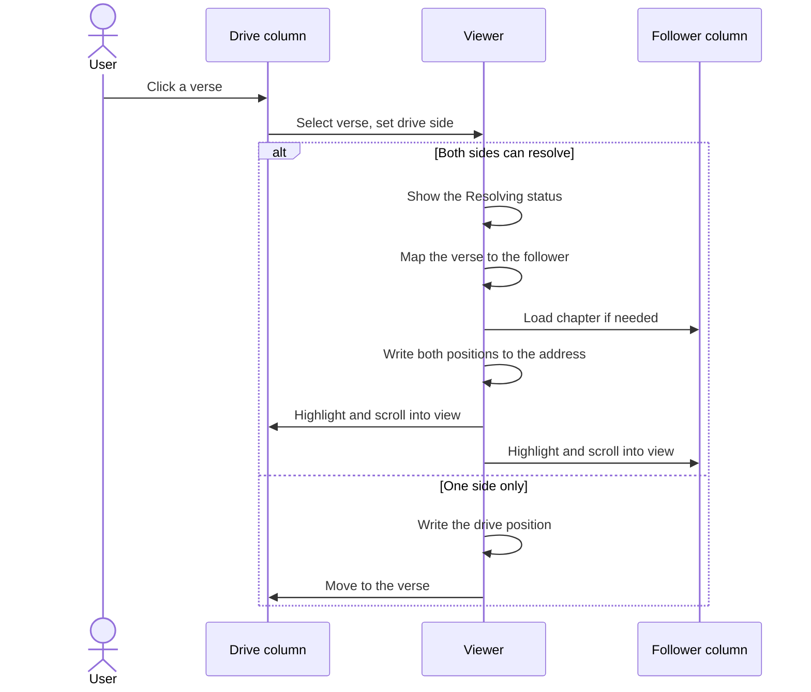
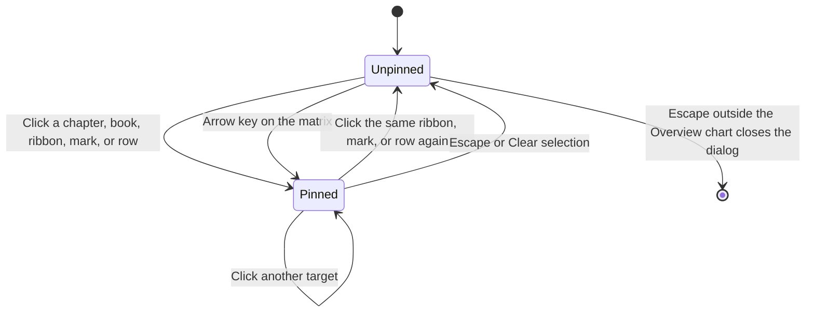

# UX specification

What the FRVT UI must do for the person using it. Each statement below is current behavior that a change must keep, or must change on purpose together with this page. How the screens look is in [ui-style-guide.md](ui-style-guide.md). The components and state that implement these rules are in [web-ui.md](web-ui.md) and [divergence-dialog.md](divergence-dialog.md). Server behavior and status codes are in [api.md](api.md). Domain words are defined in [domain-model.md](domain-model.md).

## Users and platform

- The user is a translation or versification specialist comparing how two translations number the same text.
- The UI runs in a desktop browser at 1280 pixels wide or more. There is no phone or narrow layout.
- The UI is served from the same origin as the API. Sign-in is the browser's HTTP Basic prompt. By default the server requires it for the API, the UI, and `/docs`.
- UI copy is English. Scripture text is shown in its own direction, left to right or right to left.

## Navigation

- The header shows the brand and three links: Viewer, Translations, Versifications. The current page's link is marked.
- The Viewer link returns to the last viewer state the user had, including both translations, positions, and options.
- `/manage` opens Translations. Any unknown path opens the viewer.
- A bookmarked or reloaded deep link opens the same page.
- Viewer controls (Mapping, Divergence, status) appear in the header only on the viewer.

## Viewer

### Opening the viewer

1. When the address has viewer parameters, the viewer uses them. Translation and scheme ids that no longer exist are dropped.
2. When the address has none, the viewer restores the last saved viewer state.
3. A column with no translation is filled from the library: the left column gets the first translation, and the right column the second when there is one.
4. A column with a translation and no position opens at the first verse of the first chapter of its first book.

When the library has no translations, the viewer shows an empty state instead of the columns. It explains that a Paratext-style project zip with USX and `custom.vrs` is needed, offers "Upload project", and links to the Versifications page. After an upload the viewer reloads its library and shows the new translation.

### Column controls

Each column has, in order: Translation, Book, Chapter, Verse, Versification, and Jump.

- Changing the translation clears that column's position and scheme choice.
- Changing the book moves to its first chapter, verse 1. Changing the chapter moves to verse 1.
- Book, chapter, and verse accept typing to filter the list.
- When both columns can resolve, books with mapping differences against the other column are marked in the book list. An info control beside the Book label explains the mark.
- Versification lists "Preferred (default)" and every scheme associated with the translation. Each option names the scheme it is based on when known, and the preferred one is starred. It is disabled when the translation has no associations. Choosing a scheme changes only this view. It does not change which association is preferred.
- Changing a scheme clears the current mapping until the next selection.
- A column with no translation shows "Select a second translation" in place of the verse list.

### Selecting a verse

"Both sides can resolve" means both columns have a translation and each translation has at least one associated scheme.

- Clicking a verse, pressing Enter or Space on it, or choosing a position in the column controls selects that verse and makes its column the drive column. The other column is the follower.
- When both sides can resolve, the viewer maps the selected verse to the follower, then moves the follower to the mapped verse, loading its chapter if needed. Both positions in the address change together, only after the mapping returns. The header shows "Resolving…" while it waits.
- When only one side can resolve, the selection moves that column alone.
- A newer selection replaces an older one still in flight. A stale result is never shown.
- Highlights appear on the mapped verses in both columns only after the selection settles, and only when the result belongs to the current drive verse.
- After a selection, both columns scroll the chosen verses into view. That scroll is not treated as a new selection.
- The two columns scroll independently. Scrolling one never scrolls the other.

### Mapping overlay

The header's Mapping control has three settings. It is disabled until both sides can resolve.

| Setting | What is drawn |
| --- | --- |
| Hidden | Nothing |
| Current | Lines between the selected verse and the verses it maps to |
| All (dimmed) | Every alignment in the drive chapter at reduced strength, with the current one at full strength. The header shows "Loading chapter mappings…" while it loads |

- Lines follow the verses as either column scrolls and as the window resizes.
- The overlay never blocks a click on a verse or a control.
- Each line's style tells the reader the [resolver relation](domain-model.md#resolver-relation). The visual vocabulary is in [ui-style-guide.md](ui-style-guide.md#mapping-overlay).
- When both sides can resolve, an arrow over the gutter shows which way the mapping runs, from drive to follower. It is for orientation only.

### Jump menu

- Jump is disabled until both sides can resolve.
- It opens a panel with three sections for this column's current book against the other column: Mapped deltas, Misalignments grouped by category (Psalm titles, chapter boundaries, chapter counts, LXX Psalms, Synodal, NT omissions, other), and the verses of the current chapter. The first two show a count once loaded, and "None" when empty.
- Choosing an entry moves this column there and makes it the drive column, which starts a selection as above.
- The panel closes on a choice, a press outside it, or Escape. A load failure is shown inside the panel.

### Address and persistence

- The address holds the whole viewer state: both translations, both positions, both scheme choices, the drive side, and the mapping setting. Choosing "Preferred (default)" leaves that column's scheme out of the address.
- Copying the address and opening it elsewhere reproduces the view.
- Each change replaces the current history entry. Browser Back leaves the viewer rather than stepping through verse selections.
- The last viewer state is also saved in the browser and restored as described in [Opening the viewer](#opening-the-viewer).

### Errors

- A failed request shows an error banner above the columns with the server's message, or a short status-based message when the server sent none. The next successful mapping clears it.
- After a second authentication failure without a successful mapping in between, the viewer content is replaced by "Authentication required — reload and sign in."

## Divergence comparison

### Opening

- The Divergence button is enabled when both sides can resolve and each column's chosen scheme is still associated with its translation. "Preferred" always counts as associated.
- When disabled, resting on it says "Select two translations with versifications."
- The comparison is between the left column (side A) and the right column (side B), each with its chosen or preferred scheme. The drive side does not matter.
- It opens as a full-screen dialog titled "Divergences". Closing it returns to the viewer unchanged.

### Loading and failure

- While the comparison is prepared, the dialog shows "Starting comparison…", then "Working — stage (n of m)" with a progress bar when the total is known.
- A comparison already computed for the same inputs opens without waiting for a rebuild.
- A comparison that stalls on the server is requested again without user action.
- A failure shows an error banner with the message and a Retry button.
- Closing the dialog while it loads cancels the work and shows no error.

### Layout

- Three tabs: Overview (the book-by-chapter matrix), Radial (chapters as slices or as rings), and Details (one book).
- Four layer toggles sit beside the tabs: scheme, segment, text, and canon. Each shows its count and percent of the whole comparison, adds the selection's share while something is pinned, and has an info control explaining the layer. A layer with no events reads "None (0%)" and cannot be toggled. All layers start on.
- A chart key under the toggles explains every mark. Move ribbons appear in the key only on the Radial tab.
- On every tab, a selection column shows the scope heading, the donut of layer and type shares, the donut key (collapsed until opened), the event list, and the scope actions.
- An info control beside the title holds a one-sentence summary of the comparison. When the schemes agree completely, it says "These versifications agree verse for verse."

### Selection

The dialog has one pin: a chapter, a whole book, a ribbon, or an event. The selection column describes the pin, or the whole comparison when nothing is pinned.

- A click pins. Pointer movement alone never changes the pin, the heading, the donut, the event list, or the actions. Hover may brighten a ribbon or open a tip.
- What can be clicked: a chapter or book in the matrix; a chapter, a book ring, or a ribbon in the radial chart; a ribbon, a one-sided block, a dot-plot mark, or a table row in the book detail.
- Clicking the same ribbon, mark, or table row again clears it.
- Pinning an event in another book from the book detail opens that book.
- Clear selection and Escape clear the pin. Escape with nothing pinned closes the dialog, except while focus is in the Overview chart, where Escape only clears. Escape while an info tip is open closes only the tip.
- Hiding the layer of a pinned event makes the column fall back to that event's chapter.
- The event list shows at most 60 events and then says how many more are in the book detail table. With nothing pinned it prompts: "Click a chapter, book, or event. Arrow keys move through the matrix."
- Under the event list, "Open BOOK in book detail" opens the pinned book on the Details tab. It is hidden on the Details tab. Clear selection appears only while something is pinned.

### Layers

- A hidden layer's events leave the charts' colors and the donut. Their marks are drawn as unchanged rather than removed, so the layout of a book stays stable.
- The toggle for a hidden layer still shows that layer's share, so hiding a layer never makes its own count read zero.
- Toggling a layer does not reset the book detail's zoom or position.

### Book detail

- A book picker lists every book with content, with its event count in the visible layers.
- The book opens from the scope action, from Enter on a matrix cell, from pinning an event in another book, or by default on the first book that has events.
- The [ladder](domain-model.md#ladder) shows three axes: side A, `org`, and side B, labeled with the translation names. Ribbons connect corresponding stretches. Verses on one side only are drawn as blocks.
- A book of at most 1,200 verses opens showing the whole book. A longer book opens on a window of about 300 verses starting shortly before its first divergence.
- Zoom runs from the whole book to one hundredth of it. The slider zooms around the middle. The mouse wheel zooms around the pointer. Dragging the background pans. A trackpad pinch zooms the ladder and never the browser page. A wheel that cannot zoom further scrolls the page.
- Changing the book resets the zoom and position. Toggling layers does not.
- Under the ladder, side tabs switch between Divergences (an event table, the default each time the tab opens) and Dot plot.
- The event table lists the book's events with type, severity, the three references, verse count, and flags. A row is selected by click, Enter, or Space. With no events it says "No divergences in the visible layers."
- The dot plot plots side A against side B. "Magnify offsets" exaggerates distance from the diagonal so single-verse offsets show. Its info control explains the axes and states the current magnification.

### Keyboard in the dialog

| Where | Key | Effect |
| --- | --- | --- |
| Overview chart | Arrow keys | Move to the next chapter in that direction and pin it |
| Overview chart | Enter | Open the focused cell's book on the Details tab |
| Overview chart | Escape | Clear the pin. It never closes the dialog from here |
| Detail side tabs | Up and Down | Move between Divergences and Dot plot, wrapping |
| Event table row | Enter or Space | Select the row, or clear it when already selected |
| Info tip | Escape | Close the tip only |
| Elsewhere in the dialog | Escape | Clear the pin, or close when nothing is pinned |
| Anywhere in the dialog | Tab | Cycle through the dialog's controls without leaving it |

## Manage pages

The manage pages do not change the viewer. A new or renamed item appears in the viewer's pickers on the next visit to the viewer.

### Translations

- The page shows "Upload project" and a table of translations: name, language, associated schemes, and actions.
- The preferred scheme is marked "(preferred)". Every other scheme offers "Make preferred" and "Remove". The preferred scheme cannot be removed until another one is preferred.
- Row actions: Rename, Associate, and Delete.
- Upload project takes a project zip. Name and language are optional and default to the project's `metadata.xml`. Upload stays disabled until a file is chosen and reads "Uploading…" while the server ingests it.
- Associate offers only schemes not already associated with that translation. A new association is not made preferred.
- Delete asks for confirmation and says the translation's spans and associations go with it.
- With no translations, the page says "No translations yet — upload a project to begin."

### Versifications

- The page shows "Upload versification" and a table of schemes: name, the scheme it is based on ("Root" when none), associated translations, kind (Canonical or Custom), and actions.
- A scheme with several translations shows a count. Hover or keyboard focus lists the names.
- Row actions: Rename and Delete. Delete warns that associated schemes must be removed first. The server's refusal is shown in the modal.
- Upload versification takes a `.vrs` file or a JSON versification. The display name is optional and defaults to the file name. The new scheme is not associated with any translation.

### Modal behavior

- Opening a modal moves focus into it, onto the close button. Tab and Shift+Tab stay inside the modal. Closing returns focus to the control that opened it.
- Escape, the close button, Cancel, and a click that starts and ends on the backdrop close the modal. A drag that ends on the backdrop does not.
- A failed request keeps the modal open and shows the server's message inside it. Field-level problems are listed by field.
- A successful action closes the modal and reloads the page's table.

## Accessibility

- Every task outside the comparison charts can be done by keyboard. Verses are focusable buttons. Book, chapter, and verse pickers are comboboxes with list navigation. The jump menu reports whether it is open. Modals keep focus inside.
- In the comparison, the Overview chart takes arrow keys and Enter, the side tabs follow the tabs pattern, the zoom is a slider, and event rows are focusable and report selection. The radial chart, the ladder's ribbons and blocks, and the dot plot's marks respond only to the pointer. The event table is the keyboard route to the same events.
- Focus is always visible as an accent outline.
- Form controls and icon buttons have accessible names. Column controls name their side ("left translation", "right verse"). Each info icon names what it explains.
- Status changes are announced politely ("Resolving…", "Loading chapter mappings…", comparison progress). Error banners are announced as alerts.
- Explanations that open on hover also open on keyboard focus.
- Color never separates categories alone. Relations have badges and line styles, severities have numbers, and one-sided chapters are hatched. Chapter deviance is shown by color, and its events are listed with numbers when the chapter is pinned.
- When the operating system asks for reduced motion, transitions and smooth scrolling are off.

## Changing this page

Change this page in the same change as the behavior. When a requirement here and the code disagree, decide which one is right, then fix the other. Visual changes that do not change behavior belong in [ui-style-guide.md](ui-style-guide.md). A change to what is stored in the viewer address also follows the checks in [web-ui.md](web-ui.md#url-fields). A change to what a click pins also follows [divergence-dialog.md](divergence-dialog.md#from-a-click-to-a-pin).

## See also

- [ui-style-guide.md](ui-style-guide.md) for the look of every control named here.
- [web-ui.md](web-ui.md#viewer-session) for the session, the address, and the caches.
- [divergence-dialog.md](divergence-dialog.md#selection) for the pin and the layers in code.
- [api.md](api.md) for what the server returns to each request.
